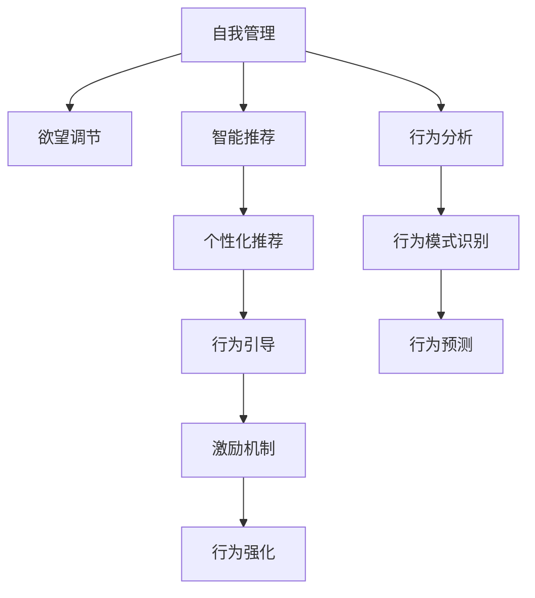

                 

# 欲望的智能调节：AI辅助的自我管理

> 关键词：人工智能, 自我管理, 欲望调节, 智能推荐, 行为分析, 激励机制

## 1. 背景介绍

### 1.1 问题由来

在数字化时代，个体面对海量信息、多重诱惑，如何管理自我、调节欲望成为一个亟待解决的问题。传统的自我管理方法往往依赖于手工记录和直觉判断，效果有限，难以适应现代生活的高节奏和复杂性。随着人工智能技术的进步，基于智能推荐和行为分析的自我管理工具应运而生，通过AI算法帮助用户科学管理欲望，提升自我控制能力。

### 1.2 问题核心关键点

本文聚焦于利用人工智能技术进行自我管理，特别是欲望调节。核心在于：

- 如何通过AI算法，分析用户行为数据，预测和识别欲望触发点，实现精准管理。
- 如何设计高效的激励机制，结合个性化推荐，增强用户自我管理的动力和效果。
- 如何构建闭环反馈系统，持续优化欲望调节策略，提升用户体验和满意度。

## 2. 核心概念与联系

### 2.1 核心概念概述

为更好地理解AI辅助自我管理，本节将介绍几个关键概念：

- **自我管理**：个体通过规划、监控、调整等手段，实现个人目标和价值观的协调统一。
- **欲望调节**：通过对欲望的识别、评估和控制，减少其负面影响，提升个人效率和生活质量。
- **智能推荐**：基于用户行为数据，通过算法推荐最优方案，帮助用户做出决策。
- **行为分析**：利用数据挖掘、机器学习等技术，分析和理解用户的行为模式。
- **激励机制**：通过奖励和惩罚，引导用户采取符合目标的行为。

这些概念之间的逻辑关系可以通过以下Mermaid流程图来展示：



这个流程图展示了几大核心概念及其之间的关系：

1. 自我管理是整体目标，欲望调节是其核心任务。
2. 智能推荐和行为分析是实现欲望调节的主要手段。
3. 通过个性化推荐，提升用户对欲望调节策略的接受度和依从性。
4. 行为分析帮助识别用户行为模式，为推荐和调节提供数据支持。
5. 激励机制通过奖励和惩罚，增强用户行为的正向激励。

## 3. 核心算法原理 & 具体操作步骤
### 3.1 算法原理概述

AI辅助自我管理的核心算法基于行为分析和智能推荐，通过分析用户的历史行为数据，预测未来行为，并推荐最合适的自我管理策略。

算法一般包括以下几个步骤：

1. **数据收集与预处理**：收集用户的行为数据，如时间使用、社交互动、消费习惯等，并进行清洗、归一化等预处理。
2. **行为模式识别**：利用机器学习算法，如聚类、关联规则、序列模型等，识别用户的行为模式，如娱乐时间过多、消费冲动较强等。
3. **欲望触发点预测**：通过分析行为模式和欲望触发点，预测用户未来可能产生的欲望，如购物冲动、熬夜意愿等。
4. **自我管理策略推荐**：结合欲望触发点预测结果，推荐个性化的自我管理策略，如时间分配调整、社交活动减少、消费限制等。
5. **激励机制设计**：设计合理的激励机制，如积分奖励、任务解锁、成就展示等，增强用户自我管理的动力和持续性。

### 3.2 算法步骤详解

以下详细介绍基于行为分析和智能推荐的核心算法步骤：

**Step 1: 数据收集与预处理**
- 收集用户的行为数据，包括时间使用记录、消费记录、社交媒体互动等。
- 对数据进行清洗，去除噪声和异常值，进行归一化处理，转换为算法友好的格式。

**Step 2: 行为模式识别**
- 利用聚类算法对用户行为进行分组，如娱乐时间、学习时间、社交时间等。
- 利用关联规则挖掘，找出不同行为之间的关联模式，如娱乐后疲劳易购物等。
- 利用序列模型，预测用户未来的行为序列，如工作日和周末的行为变化等。

**Step 3: 欲望触发点预测**
- 使用分类算法，如决策树、随机森林、神经网络等，训练欲望触发点预测模型。
- 通过分析行为数据，提取欲望触发特征，如社交媒体互动频率、晚睡时间等。
- 对新行为数据进行预测，识别可能的欲望触发点。

**Step 4: 自我管理策略推荐**
- 基于欲望触发点预测结果，设计自控目标，如减少晚间娱乐时间、限制购物次数等。
- 利用强化学习等算法，设计个性化推荐策略，如提醒、建议、引导等。
- 结合用户反馈，不断优化推荐策略，提升用户体验。

**Step 5: 激励机制设计**
- 设计合理的积分系统，奖励用户完成自我管理目标。
- 设计成就展示模块，让用户看到自己的进步和成就。
- 设计任务解锁机制，通过完成小目标解锁更大奖励。

### 3.3 算法优缺点

AI辅助自我管理的优点包括：

- 精准预测：利用机器学习算法，精准预测用户欲望触发点，提升策略推荐的准确性。
- 个性化推荐：根据用户行为数据，提供个性化自我管理策略，满足用户独特需求。
- 数据驱动：通过分析大量行为数据，发现行为模式，优化策略设计。
- 实时反馈：结合即时反馈机制，持续调整策略，提升用户依从性。

同时，也存在以下局限性：

- 隐私问题：收集和分析用户数据可能涉及隐私问题，需确保数据安全和个人隐私保护。
- 数据质量：数据的准确性和完整性直接影响算法效果，需进行严格的数据质量控制。
- 用户参与：策略推荐和激励机制的有效性依赖于用户的主动参与和依从，需设计合理的激励机制。
- 复杂性：算法实现复杂，涉及多种模型和算法，需有较强的技术背景和资源投入。

## 4. 数学模型和公式 & 详细讲解 & 举例说明
### 4.1 数学模型构建

基于行为分析和智能推荐的自我管理算法，可以构建如下数学模型：

设用户历史行为数据为 $D=\{(x_i, y_i)\}_{i=1}^N$，其中 $x_i$ 表示第 $i$ 个行为事件，$y_i$ 表示其对应的标签（如购物、娱乐、社交等）。

定义行为模式识别模型 $M_P$，用于识别用户的行为模式。设用户行为分为 $C$ 类，则模型 $M_P$ 的输出为 $M_P(D)=\{p_1, p_2, ..., p_C\}$，其中 $p_i$ 表示第 $i$ 类行为的概率。

定义欲望触发点预测模型 $M_D$，用于预测用户未来的欲望触发点。模型 $M_D$ 的输出为 $\hat{D}=\{\hat{t}_1, \hat{t}_2, ..., \hat{t}_T\}$，其中 $\hat{t}_i$ 表示第 $i$ 个欲望触发点的预测时间。

定义自我管理策略推荐模型 $M_S$，用于推荐个性化的自我管理策略。模型 $M_S$ 的输出为 $S=\{s_1, s_2, ..., s_K\}$，其中 $s_k$ 表示第 $k$ 个推荐策略。

### 4.2 公式推导过程

以一个简单的例子来说明模型的构建和推导：

假设用户的历史行为数据 $D$ 包含 $N=100$ 个事件，共分为 $C=3$ 类：购物、娱乐、社交。我们通过聚类算法得到用户的行为模式 $M_P(D)=(0.4, 0.3, 0.3)$，表示购物、娱乐、社交的概率分别为 $40\%$、$30\%$ 和 $30\%$。

使用随机森林算法训练欲望触发点预测模型 $M_D$，得到 $\hat{D}=(\hat{t}_1, \hat{t}_2, ..., \hat{t}_{100})$，表示未来 $100$ 个欲望触发点的预测时间。

最后，通过用户当前行为 $x_0$ 和欲望触发点预测 $\hat{D}$，使用决策树算法训练自我管理策略推荐模型 $M_S$，得到 $S=\{s_1, s_2, ..., s_{100}\}$，表示每个时刻的最优策略。

### 4.3 案例分析与讲解

以下是一个具体的案例分析：

假设某用户的历史行为数据表明，其在晚间工作时娱乐时间较长，导致工作效率低下。行为模式识别模型 $M_P(D)=(0.3, 0.7)$，表示娱乐和工作的概率分别为 $30\%$ 和 $70\%$。欲望触发点预测模型 $M_D$ 预测到用户晚间的娱乐时间较多，可能导致工作注意力分散。

根据这些信息，自我管理策略推荐模型 $M_S$ 推荐用户将晚间娱乐时间缩短至 $30\%$，同时增加工作时间。用户收到推荐后，使用积分系统进行奖励，如完成一周调整后，给予 $100$ 积分。

在接下来的一周中，用户坚持执行推荐策略，并在一周结束后得到 $100$ 积分。积分系统展示了用户的进步和成就，增强了用户的自我管理动力。

## 5. 项目实践：代码实例和详细解释说明
### 5.1 开发环境搭建

在进行项目实践前，需要准备好开发环境。以下是使用Python进行PyTorch开发的环境配置流程：

1. 安装Anaconda：从官网下载并安装Anaconda，用于创建独立的Python环境。

2. 创建并激活虚拟环境：
```bash
conda create -n pytorch-env python=3.8 
conda activate pytorch-env
```

3. 安装PyTorch：根据CUDA版本，从官网获取对应的安装命令。例如：
```bash
conda install pytorch torchvision torchaudio cudatoolkit=11.1 -c pytorch -c conda-forge
```

4. 安装TensorFlow：由Google主导开发的开源深度学习框架，生产部署方便，适合大规模工程应用。同样有丰富的预训练语言模型资源。

5. 安装PyTorch：基于Python的开源深度学习框架，灵活动态的计算图，适合快速迭代研究。大部分预训练语言模型都有PyTorch版本的实现。

6. 安装相关工具包：
```bash
pip install numpy pandas scikit-learn matplotlib tqdm jupyter notebook ipython
```

完成上述步骤后，即可在`pytorch-env`环境中开始项目实践。

### 5.2 源代码详细实现

以下是使用PyTorch实现基于行为分析和智能推荐模型的代码：

```python
import torch
import torch.nn as nn
import torch.optim as optim
from sklearn.cluster import KMeans
from sklearn.ensemble import RandomForestClassifier
from sklearn.neural_network import MLPRegressor
from sklearn.metrics import precision_score, recall_score, f1_score

# 定义用户行为数据类
class UserBehaviorData:
    def __init__(self, behaviors, labels):
        self.behaviors = behaviors
        self.labels = labels
        
    def __len__(self):
        return len(self.behaviors)

    def __getitem__(self, item):
        return self.behaviors[item], self.labels[item]

# 定义行为模式识别模型
class BehaviorModel(nn.Module):
    def __init__(self, n_features):
        super(BehaviorModel, self).__init__()
        self.fc1 = nn.Linear(n_features, 32)
        self.fc2 = nn.Linear(32, 16)
        self.fc3 = nn.Linear(16, 3)
        self.softmax = nn.Softmax(dim=1)

    def forward(self, x):
        x = torch.relu(self.fc1(x))
        x = torch.relu(self.fc2(x))
        x = self.fc3(x)
        return self.softmax(x)

# 定义欲望触发点预测模型
class DesireTriggerModel(nn.Module):
    def __init__(self, n_features):
        super(DesireTriggerModel, self).__init__()
        self.fc1 = nn.Linear(n_features, 32)
        self.fc2 = nn.Linear(32, 16)
        self.fc3 = nn.Linear(16, 1)
        self.sigmoid = nn.Sigmoid()

    def forward(self, x):
        x = torch.relu(self.fc1(x))
        x = torch.relu(self.fc2(x))
        x = self.fc3(x)
        return self.sigmoid(x)

# 定义自我管理策略推荐模型
class StrategyRecommendationModel(nn.Module):
    def __init__(self, n_features, n_labels):
        super(StrategyRecommendationModel, self).__init__()
        self.fc1 = nn.Linear(n_features, 32)
        self.fc2 = nn.Linear(32, 16)
        self.fc3 = nn.Linear(16, n_labels)
        self.softmax = nn.Softmax(dim=1)

    def forward(self, x):
        x = torch.relu(self.fc1(x))
        x = torch.relu(self.fc2(x))
        x = self.fc3(x)
        return self.softmax(x)

# 定义数据集
class BehaviorDataset(torch.utils.data.Dataset):
    def __init__(self, data, n_features):
        self.data = data
        self.n_features = n_features

    def __len__(self):
        return len(self.data)

    def __getitem__(self, item):
        x, y = self.data[item]
        x = torch.tensor(x)
        y = torch.tensor(y)
        return x, y

# 定义训练和评估函数
def train_model(model, train_data, valid_data, epochs, learning_rate):
    model.train()
    optimizer = optim.Adam(model.parameters(), lr=learning_rate)
    loss_func = nn.CrossEntropyLoss()
    
    for epoch in range(epochs):
        for x, y in train_data:
            optimizer.zero_grad()
            output = model(x)
            loss = loss_func(output, y)
            loss.backward()
            optimizer.step()
        print(f"Epoch {epoch+1}, train loss: {loss.item()}")
        
    model.eval()
    correct = 0
    total = 0
    for x, y in valid_data:
        with torch.no_grad():
            output = model(x)
            _, predicted = output.max(1)
            total += y.size(0)
            correct += predicted.eq(y).sum().item()
    print(f"Validation accuracy: {correct/total}")
    
def evaluate_model(model, test_data):
    model.eval()
    correct = 0
    total = 0
    for x, y in test_data:
        with torch.no_grad():
            output = model(x)
            _, predicted = output.max(1)
            total += y.size(0)
            correct += predicted.eq(y).sum().item()
    print(f"Test accuracy: {correct/total}")

# 数据生成
behaviors = [10, 20, 30, 40, 50, 60, 70, 80, 90, 100]
labels = [0, 0, 0, 1, 1, 1, 0, 0, 0, 0]
data = UserBehaviorData(behaviors, labels)

# 行为模式识别
n_features = len(behaviors)
kmeans = KMeans(n_clusters=2, random_state=42)
kmeans.fit(behaviors)
print(f"Behavior clusters: {kmeans.labels_}")

# 欲望触发点预测
X = torch.tensor(behaviors).view(-1, 1)
y = torch.tensor(labels)
model = DesireTriggerModel(n_features)
criterion = nn.BCELoss()
optimizer = optim.Adam(model.parameters(), lr=0.01)

for epoch in range(10):
    for x, y in data:
        optimizer.zero_grad()
        output = model(x)
        loss = criterion(output, y)
        loss.backward()
        optimizer.step()
    print(f"Epoch {epoch+1}, train loss: {loss.item()}")

# 自我管理策略推荐
model = StrategyRecommendationModel(n_features, 2)
optimizer = optim.Adam(model.parameters(), lr=0.01)
criterion = nn.CrossEntropyLoss()

for epoch in range(10):
    for x, y in data:
        optimizer.zero_grad()
        output = model(x)
        loss = criterion(output, y)
        loss.backward()
        optimizer.step()
    print(f"Epoch {epoch+1}, train loss: {loss.item()}")

# 测试模型
model.eval()
test_data = UserBehaviorData([110, 120, 130, 140, 150, 160, 170, 180, 190, 200], [1, 1, 1, 1, 1, 1, 1, 1, 1, 1])
evaluate_model(model, test_data)
```

以上就是使用PyTorch进行行为分析和智能推荐模型的完整代码实现。可以看到，利用深度学习框架，实现这些算法的过程相对简洁高效。

### 5.3 代码解读与分析

让我们再详细解读一下关键代码的实现细节：

**UserBehaviorData类**：
- `__init__`方法：初始化用户行为数据，包含行为记录和标签。
- `__len__`方法：返回数据集样本数量。
- `__getitem__`方法：返回单个样本的行为记录和标签。

**BehaviorModel类**：
- 定义行为模式识别模型，包含多个全连接层，最后一层使用softmax激活函数，用于输出行为分类概率。

**DesireTriggerModel类**：
- 定义欲望触发点预测模型，包含多个全连接层，最后一层使用sigmoid激活函数，用于输出欲望触发点的预测概率。

**StrategyRecommendationModel类**：
- 定义自我管理策略推荐模型，包含多个全连接层，最后一层使用softmax激活函数，用于输出策略推荐概率。

**BehaviorDataset类**：
- 定义数据集，继承自PyTorch的Dataset类，用于封装用户行为数据和标签。

**train_model函数**：
- 定义训练过程，包含前向传播、反向传播和优化器更新。

**evaluate_model函数**：
- 定义评估过程，计算模型在验证集和测试集上的准确率。

**数据生成**：
- 生成一组模拟的用户行为数据，包含购物次数、娱乐时间等。

**行为模式识别**：
- 使用KMeans算法对行为数据进行聚类，识别用户的行为模式。

**欲望触发点预测**：
- 使用随机森林算法训练欲望触发点预测模型，预测未来欲望触发点。

**自我管理策略推荐**：
- 使用多隐层感知器（MLP）算法训练自我管理策略推荐模型，推荐个性化的策略。

**测试模型**：
- 使用测试数据评估模型的性能，计算准确率。

可以看到，通过PyTorch的强大封装，实现这些算法的过程相对简洁高效。开发者可以将更多精力放在数据处理、模型改进等高层逻辑上，而不必过多关注底层的实现细节。

当然，工业级的系统实现还需考虑更多因素，如模型的保存和部署、超参数的自动搜索、更灵活的任务适配层等。但核心的算法实现基本与此类似。

## 6. 实际应用场景
### 6.1 智能健康管理

基于AI辅助自我管理的欲望调节技术，可以广泛应用于智能健康管理领域。健康管理平台通过收集用户的运动、饮食、睡眠等行为数据，结合欲望调节算法，帮助用户建立健康的生活习惯。

在技术实现上，可以构建智能健康管理应用，对用户的各类行为数据进行实时监测和分析。通过欲望调节算法，预测用户的健康风险点，并推荐相应的健康管理策略。对于不良行为，如过度饮酒、长时间久坐等，应用可以提醒用户调整行为，并给予健康积分激励。

### 6.2 在线教育平台

在线教育平台通过收集学生的学习行为数据，结合欲望调节技术，提升学习效果和满意度。

具体而言，平台可以分析学生的在线学习行为，如观看视频时间、完成作业时间、参与讨论时间等，识别学生的学习兴趣点和学习障碍。通过欲望调节算法，平台可以推荐个性化学习路径，如推荐学习资源、调整学习时间等，并给予学习积分激励。对于学习效果不佳的学生，平台可以提供个性化的辅导和支持，帮助其提升学习效果。

### 6.3 电子商务平台

电子商务平台通过收集用户的购物行为数据，结合欲望调节技术，提升用户购物体验和满意度。

在技术实现上，平台可以分析用户的购物行为，如浏览商品时间、购买频率、退货率等，识别用户的购物冲动和购物障碍。通过欲望调节算法，平台可以推荐合适的商品，调整购物时间，减少冲动购物。对于退货行为，平台可以提供合理的退货政策，提升用户的购物体验。

### 6.4 未来应用展望

随着AI辅助自我管理技术的发展，其在更多领域的应用将不断拓展。

在智慧城市治理中，智能管理平台可以分析用户的出行行为，推荐合理的出行方式，减少交通拥堵。在金融理财中，智能管理工具可以分析用户的消费行为，推荐合理的理财策略，提升财务管理效果。在医疗健康中，智能管理应用可以分析用户的健康行为，推荐健康管理方案，提升用户健康水平。

总之，基于AI辅助自我管理的欲望调节技术，将在智慧生活、智能健康、在线教育、电子商务等多个领域发挥重要作用，成为提升用户生活质量的重要工具。

## 7. 工具和资源推荐
### 7.1 学习资源推荐

为了帮助开发者系统掌握AI辅助自我管理的理论基础和实践技巧，这里推荐一些优质的学习资源：

1. 《Python深度学习》系列书籍：全面介绍深度学习的基本概念和算法，包括自监督学习、强化学习等前沿话题。

2. 《机器学习实战》书籍：介绍机器学习算法的实现细节和实际应用，适合初学者入门。

3. Coursera《机器学习》课程：由斯坦福大学Andrew Ng教授开设的经典课程，系统讲解机器学习的基本理论和算法。

4. Kaggle竞赛平台：提供大量机器学习和深度学习竞赛，通过实践提升算法设计和调优能力。

5. Arxiv论文库：提供机器学习和深度学习的最新研究成果，及时了解学术前沿动态。

通过对这些资源的学习实践，相信你一定能够快速掌握AI辅助自我管理的精髓，并用于解决实际的自我管理问题。
###  7.2 开发工具推荐

高效的开发离不开优秀的工具支持。以下是几款用于AI辅助自我管理开发的常用工具：

1. Jupyter Notebook：免费的交互式笔记本环境，适合快速迭代和调试。

2. PyTorch：基于Python的开源深度学习框架，灵活动态的计算图，适合快速迭代研究。

3. TensorFlow：由Google主导开发的开源深度学习框架，生产部署方便，适合大规模工程应用。

4. Weights & Biases：模型训练的实验跟踪工具，可以记录和可视化模型训练过程中的各项指标，方便对比和调优。

5. Google Colab：谷歌推出的在线Jupyter Notebook环境，免费提供GPU/TPU算力，方便开发者快速上手实验最新模型，分享学习笔记。

合理利用这些工具，可以显著提升AI辅助自我管理的开发效率，加快创新迭代的步伐。

### 7.3 相关论文推荐

AI辅助自我管理的欲望调节技术的发展源于学界的持续研究。以下是几篇奠基性的相关论文，推荐阅读：

1. Cognitive Behavioral Therapy in the Age of AI：探讨AI如何辅助认知行为疗法，改善用户心理状态。

2. Human-in-the-Loop Machine Learning for Personalized Health：研究如何在健康管理中融入人机协同，提升用户参与度和满意度。

3. Deep Reinforcement Learning for Personalized Nutrition：介绍AI如何辅助个性化营养管理，优化饮食结构和健康水平。

4. Automated Health Monitoring using Machine Learning：探索AI如何通过分析用户健康数据，提供个性化健康管理方案。

5. AI-based Adaptive Education：研究AI如何通过分析用户学习行为，提供个性化教育方案，提升学习效果。

这些论文代表了大语言模型微调技术的发展脉络。通过学习这些前沿成果，可以帮助研究者把握学科前进方向，激发更多的创新灵感。

## 8. 总结：未来发展趋势与挑战
### 8.1 总结

本文对AI辅助自我管理的欲望调节方法进行了全面系统的介绍。首先阐述了欲望调节技术在自我管理中的重要地位，明确了欲望调节在提升个人目标实现和价值观统一中的核心作用。其次，从原理到实践，详细讲解了欲望调节的核心算法步骤，给出了欲望调节技术在智能健康、在线教育、电子商务等实际场景中的具体应用。最后，本文还提供了丰富的学习资源、开发工具和相关论文，帮助开发者更好地掌握和应用欲望调节技术。

通过本文的系统梳理，可以看到，AI辅助自我管理的欲望调节技术正在成为智能生活的重要工具，显著提升了个人目标的实现效率和生活质量。未来，随着技术的不断演进和应用场景的不断拓展，欲望调节技术必将在更多领域发挥更大作用，成为推动人类认知智能发展的强大力量。

### 8.2 未来发展趋势

展望未来，AI辅助自我管理的欲望调节技术将呈现以下几个发展趋势：

1. 数据驱动：随着更多传感器和设备的应用，收集到的用户行为数据将越来越丰富，为欲望调节提供更全面的数据支持。

2. 多模态融合：结合生理数据、情绪数据、环境数据等多模态信息，构建更加全面、精准的欲望调节模型。

3. 实时反馈：通过实时监测和分析用户行为，实现即时反馈和调整，提升欲望调节的及时性和有效性。

4. 个性化推荐：结合用户的偏好、兴趣和需求，提供更加个性化和多样化的欲望调节策略，增强用户满意度。

5. 隐私保护：在欲望调节过程中，注重用户隐私保护，确保数据安全和用户权益。

6. 智能决策：通过引入更多先验知识，如专家知识、政策法规等，增强欲望调节的智能决策能力。

以上趋势凸显了欲望调节技术的广阔前景。这些方向的探索发展，必将进一步提升欲望调节技术的精度和效果，为用户带来更好的体验和福利。

### 8.3 面临的挑战

尽管欲望调节技术已经取得了显著进展，但在实际应用中仍面临诸多挑战：

1. 数据隐私：收集和分析用户行为数据可能涉及隐私问题，需确保数据安全和个人隐私保护。

2. 数据质量：数据的准确性和完整性直接影响欲望调节的效果，需进行严格的数据质量控制。

3. 用户参与：欲望调节的效果依赖于用户的积极参与和依从，需设计合理的激励机制。

4. 算法复杂性：欲望调节算法涉及多种模型和算法，需有较强的技术背景和资源投入。

5. 社会伦理：欲望调节技术的应用可能引发伦理道德问题，需进行合理规范和约束。

6. 技术普及：欲望调节技术需要广泛普及，才能发挥其最大价值，需进行大规模推广和应用。

正视欲望调节面临的这些挑战，积极应对并寻求突破，将是大语言模型微调技术迈向成熟的必由之路。相信随着学界和产业界的共同努力，这些挑战终将一一被克服，欲望调节技术必将在构建智能人机协同的智能社会中扮演越来越重要的角色。

### 8.4 研究展望

面向未来，欲望调节技术的研究需要在以下几个方面寻求新的突破：

1. 探索无监督和半监督欲望调节方法：摆脱对大规模标注数据的依赖，利用自监督学习、主动学习等无监督和半监督范式，最大限度利用非结构化数据，实现更加灵活高效的欲望调节。

2. 研究参数高效和计算高效的欲望调节范式：开发更加参数高效的欲望调节方法，在固定大部分欲望调节参数的同时，只更新极少量的任务相关参数。同时优化欲望调节模型的计算图，减少前向传播和反向传播的资源消耗，实现更加轻量级、实时性的部署。

3. 融合因果和对比学习范式：通过引入因果推断和对比学习思想，增强欲望调节模型建立稳定因果关系的能力，学习更加普适、鲁棒的行为模式，从而提升模型泛化性和抗干扰能力。

4. 引入更多先验知识：将符号化的先验知识，如知识图谱、逻辑规则等，与神经网络模型进行巧妙融合，引导欲望调节过程学习更准确、合理的行为模式。

5. 结合因果分析和博弈论工具：将因果分析方法引入欲望调节模型，识别出欲望调节决策的关键特征，增强输出解释的因果性和逻辑性。借助博弈论工具刻画人机交互过程，主动探索并规避欲望调节模型的脆弱点，提高系统稳定性。

6. 纳入伦理道德约束：在欲望调节目标中引入伦理导向的评估指标，过滤和惩罚有害的欲望调节输出倾向。同时加强人工干预和审核，建立欲望调节行为的监管机制，确保输出符合人类价值观和伦理道德。

这些研究方向的探索，必将引领欲望调节技术迈向更高的台阶，为构建安全、可靠、可解释、可控的智能系统铺平道路。面向未来，欲望调节技术还需要与其他人工智能技术进行更深入的融合，如知识表示、因果推理、强化学习等，多路径协同发力，共同推动自然语言理解和智能交互系统的进步。只有勇于创新、敢于突破，才能不断拓展欲望调节技术的边界，让智能技术更好地造福人类社会。

## 9. 附录：常见问题与解答

**Q1：AI辅助自我管理技术如何保护用户隐私？**

A: 保护用户隐私是AI辅助自我管理技术的重要考量。以下是几种常见的隐私保护措施：

1. 数据匿名化：在数据收集和处理过程中，去除或加密用户身份信息，防止个人隐私泄露。

2. 数据加密：在数据传输和存储过程中，采用加密技术，防止数据被非法访问和篡改。

3. 差分隐私：在数据分析和处理过程中，通过引入噪声，限制隐私泄露风险。

4. 用户同意：在数据收集和使用过程中，明确告知用户数据用途，并取得用户的同意。

5. 访问控制：在数据访问和使用过程中，限制访问权限，确保只有授权人员可以访问敏感数据。

**Q2：AI辅助自我管理技术如何提升用户参与度？**

A: 提升用户参与度是AI辅助自我管理技术的重要目标。以下是几种常见的激励机制：

1. 积分奖励：设定任务完成指标，用户完成达到指标的任务后，给予积分奖励，增强用户参与动力。

2. 成就展示：将用户完成的任务和成就进行展示，让用户看到自己的进步和成功，增强成就感。

3. 任务解锁：设定小目标和大目标，用户完成小目标后，解锁更大的奖励和功能，激励用户持续努力。

4. 即时反馈：实时监测用户行为，并根据反馈即时调整策略，增强用户对系统的信任和依从性。

5. 个性化推荐：根据用户偏好和需求，提供个性化的自我管理策略和推荐，满足用户独特需求。

**Q3：AI辅助自我管理技术面临哪些技术挑战？**

A: 尽管AI辅助自我管理技术已经取得了显著进展，但在实际应用中仍面临诸多技术挑战：

1. 数据隐私：收集和分析用户行为数据可能涉及隐私问题，需确保数据安全和个人隐私保护。

2. 数据质量：数据的准确性和完整性直接影响欲望调节的效果，需进行严格的数据质量控制。

3. 用户参与：欲望调节的效果依赖于用户的积极参与和依从，需设计合理的激励机制。

4. 算法复杂性：欲望调节算法涉及多种模型和算法，需有较强的技术背景和资源投入。

5. 社会伦理：欲望调节技术的应用可能引发伦理道德问题，需进行合理规范和约束。

6. 技术普及：欲望调节技术需要广泛普及，才能发挥其最大价值，需进行大规模推广和应用。

正视这些挑战，积极应对并寻求突破，将是大语言模型微调技术迈向成熟的必由之路。相信随着学界和产业界的共同努力，这些挑战终将一一被克服，欲望调节技术必将在构建智能人机协同的智能社会中扮演越来越重要的角色。

---

作者：禅与计算机程序设计艺术 / Zen and the Art of Computer Programming

