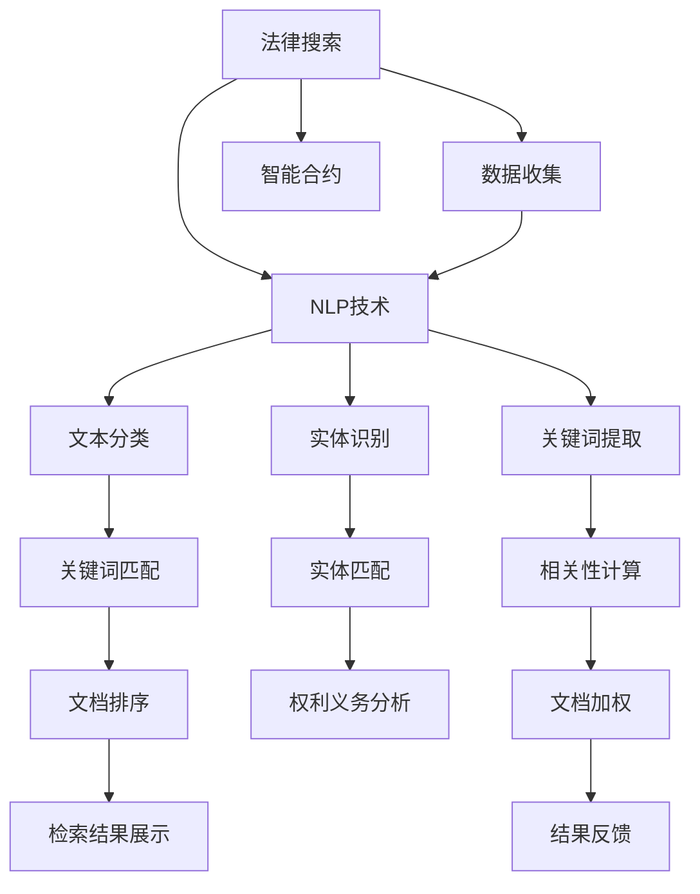

                 

# 法律领域的AI搜索应用

> 关键词：法律搜索,人工智能,数据驱动,自然语言处理,信息检索,智能合约

## 1. 背景介绍

### 1.1 问题由来
随着社会经济的快速发展，法律领域产生了海量的法律文本、法规文件、案件判决书等文档。这些文档记录了广泛而复杂的法律知识，并成为法律工作者在案件处理、法律咨询、法律研究等活动中最重要的信息源。然而，面对如此庞大的文档资料，法律工作者面临着文档检索困难、信息获取效率低下、分析复杂度高、工作负担重等问题。法律领域的文档检索与信息处理任务显得尤为重要，且亟需通过人工智能手段提升处理效率与精度。

## 2. 核心概念与联系

### 2.1 核心概念概述

为更好理解法律领域的AI搜索应用，本节将介绍几个关键概念：

- **法律搜索(Legal Search)**：指在大量的法律文本和文献中快速准确地检索、提取特定法律条文、法规、案件判决等信息的过程。法律搜索的目标是帮助法律工作者在大量的法律数据中快速定位相关文档。

- **人工智能(Artificial Intelligence, AI)**：通过学习、理解人类语言、行为、知识等数据，使用算法和模型模仿人类智能解决问题。

- **数据驱动(Data-Driven)**：基于大量的数据进行训练和模型优化，以数据为基础进行决策和预测。

- **自然语言处理(Natural Language Processing, NLP)**：使计算机能够理解、解释、生成人类语言的技术。

- **信息检索(Information Retrieval, IR)**：从大量文本中检索相关信息，以满足用户的需求。信息检索技术在法律搜索中应用广泛。

- **智能合约(Smart Contract)**：使用代码自动执行、执行记录透明可查、各方权益自动保障的合约。法律领域的合同管理、执行监督等环节可以借助智能合约技术进行优化。

### 2.2 核心概念原理和架构的 Mermaid 流程图(Mermaid 流程节点中不要有括号、逗号等特殊字符)



### 2.3 核心概念之间的联系

1. **法律搜索与自然语言处理**：法律搜索依赖于NLP技术对文本进行分类、实体识别、关键词提取等，以理解法律文档内容。
2. **法律搜索与智能合约**：智能合约在法律领域的应用，需要依赖法律搜索从大量文档中提取关键信息，确保合同条款的准确性和完备性。
3. **数据驱动与信息检索**：数据驱动的AI模型可以通过学习大量历史文档与检索请求的关系，预测最相关的文档，提升信息检索的准确性和效率。

## 3. 核心算法原理 & 具体操作步骤

### 3.1 算法原理概述

法律领域的AI搜索应用主要依赖于自然语言处理技术，其中核心的算法包括文本分类、实体识别、关键词提取、信息检索等。

**文本分类**：将法律文本分为法律条文、法规文件、案件判决书等类别。有助于快速定位文档类型，减少搜索时间。

**实体识别**：识别法律文本中的人名、地名、机构名、时间等实体信息。对于法律分析和合同管理等任务至关重要。

**关键词提取**：提取文本中的关键词，如法律术语、事件描述等。有助于快速判断文档的相关性。

**信息检索**：根据用户查询请求，在法律文本库中检索最相关的文档。通常基于余弦相似度、TF-IDF等方法。

### 3.2 算法步骤详解

#### 3.2.1 数据收集与预处理

1. **数据收集**：从法院判决书、法规文件、法律意见书等渠道收集大量的法律文本数据。
2. **数据清洗与标注**：清洗数据中的噪声、非结构化信息，进行实体、类别、关键词等标注。
3. **数据划分**：将数据划分为训练集、验证集和测试集。

#### 3.2.2 模型训练与优化

1. **模型选择与训练**：选择合适的NLP模型，如BERT、ELMo、RoBERTa等，在训练集上进行训练，优化模型参数。
2. **超参数调优**：根据模型在验证集上的表现，调整超参数，如学习率、批大小、正则化系数等。
3. **模型评估与优化**：在测试集上评估模型性能，通过网格搜索、贝叶斯优化等方法，进一步提升模型效果。

#### 3.2.3 检索策略设计

1. **查询优化**：对用户查询进行分词、词性标注、实体链接等处理，提高查询准确性。
2. **检索算法选择**：选择余弦相似度、BM25、LSI等算法进行文档检索。
3. **检索结果处理**：对检索结果进行去重、排序、相关性计算等处理，提供给用户。

### 3.3 算法优缺点

#### 3.3.1 优点

1. **效率提升**：AI驱动的搜索模型可以处理海量的法律文本，快速返回检索结果，提高效率。
2. **精准性高**：通过训练模型，AI搜索能准确理解法律语言，提高检索结果的相关性。
3. **可扩展性强**：随着数据量的增加，AI搜索的性能可以持续提升。
4. **应用广泛**：AI搜索技术可以应用到法律分析、合同管理、法律咨询等多个领域，提升各环节效率。

#### 3.3.2 缺点

1. **数据依赖性强**：模型依赖于高质量的数据标注，标注成本高。
2. **隐私问题**：法律文本涉及敏感信息，隐私保护成为重要挑战。
3. **复杂度高等**：法律语言复杂多变，NLP模型可能难以完全理解所有文档。
4. **解释性不足**：模型决策过程复杂，难以进行细致的解释和调试。

### 3.4 算法应用领域

法律领域的AI搜索应用覆盖了多个方面，包括但不限于：

- **法律检索**：快速从海量法律文本中检索相关条文、法规等。
- **合同分析**：提取合同关键信息，判断合同有效性、条款执行情况等。
- **案件分析**：分析案件判决书，提取判决依据、判决结果等信息。
- **法律咨询**：为法律工作者提供快速的法律知识查询与解答。
- **法规更新**：监控法规文件更新，及时获取最新法律信息。

## 4. 数学模型和公式 & 详细讲解 & 举例说明

### 4.1 数学模型构建

#### 4.1.1 文本分类模型

1. **标签表示**：将法律文本分为不同类别，如合同法、刑法、民法等。
2. **输入表示**：将文本转换为向量形式，如Word2Vec、GloVe等。
3. **模型结构**：使用CNN、RNN、BERT等模型进行分类。

#### 4.1.2 实体识别模型

1. **标签表示**：将法律文本中的实体分为人名、地名、机构名等。
2. **输入表示**：将文本转换为向量形式。
3. **模型结构**：使用LSTM、BERT等模型进行实体识别。

#### 4.1.3 关键词提取模型

1. **标签表示**：提取文本中的关键词，如法律术语、案件编号等。
2. **输入表示**：将文本转换为向量形式。
3. **模型结构**：使用TF-IDF、LDA等方法进行关键词提取。

### 4.2 公式推导过程

#### 4.2.1 文本分类公式推导

假设文本表示为 $x$，分类模型为 $y$，分类损失函数为 $L$，则分类模型的优化目标为：

$$
\min_{\theta} L(y,\hat{y}) = -\sum_{i=1}^n y_i \log \hat{y_i}
$$

其中，$\theta$ 为模型参数，$y_i$ 为文本的真实标签，$\hat{y_i}$ 为模型的预测概率。

#### 4.2.2 实体识别公式推导

假设文本表示为 $x$，实体识别模型为 $y$，实体识别损失函数为 $L$，则实体识别模型的优化目标为：

$$
\min_{\theta} L(y,\hat{y}) = -\sum_{i=1}^n y_i \log \hat{y_i} + \alpha \sum_{i=1}^n (1-y_i) \log \hat{y_i}
$$

其中，$\alpha$ 为平衡正负样本的参数，用于平衡实体识别准确率和召回率。

#### 4.2.3 关键词提取公式推导

假设文本表示为 $x$，关键词提取模型为 $y$，关键词提取损失函数为 $L$，则关键词提取模型的优化目标为：

$$
\min_{\theta} L(y,\hat{y}) = -\sum_{i=1}^n y_i \log \hat{y_i} + \beta \sum_{i=1}^n (1-y_i) \log \hat{y_i}
$$

其中，$\beta$ 为平衡正负样本的参数，用于平衡关键词提取的覆盖率与准确率。

### 4.3 案例分析与讲解

#### 4.3.1 案例背景

某律师事务所需要对客户的诉讼案件进行法律分析。案件涉及复杂的法律条文和历史案例，手动分析耗时长且易出错。律师希望使用AI搜索应用，快速定位相关法律条文和案例，辅助分析案件。

#### 4.3.2 问题描述

1. **法律文本的快速检索**：从海量的法律文献中快速检索与案件相关的条文、案例。
2. **案件关键信息的提取**：自动提取案件的诉求、争议点、判决依据等关键信息。
3. **法律分析与评估**：基于检索到的条文和案例，对案件进行全面分析，评估判决结果。

#### 4.3.3 解决方案

1. **数据收集与标注**：收集案件的判决书、法规文件等，标注案件的关键信息。
2. **文本分类与实体识别**：使用预训练的BERT模型，对案件进行文本分类和实体识别，得到案件类别和关键实体。
3. **关键词提取**：对判决书进行关键词提取，得到案件的主要诉求、争议点、判决依据等信息。
4. **信息检索**：使用基于余弦相似度的检索算法，快速从法律文献中检索相关条文和案例。
5. **结果展示与分析**：将检索结果展示给律师，辅助其进行法律分析与评估。

## 5. 项目实践：代码实例和详细解释说明

### 5.1 开发环境搭建

#### 5.1.1 环境配置

1. **安装Python与相关依赖**：
```bash
pip install torch transformers sklearn pandas numpy
```

2. **设置数据路径**：
```bash
export DATA_PATH=/path/to/your/data
```

### 5.2 源代码详细实现

#### 5.2.1 数据处理与预处理

1. **数据读取与清洗**：
```python
import pandas as pd
from transformers import BertTokenizer

# 读取数据
df = pd.read_csv(DATA_PATH + '/case_data.csv')

# 文本清洗与分词
tokenizer = BertTokenizer.from_pretrained('bert-base-uncased')
texts = [tokenizer.encode(text, add_special_tokens=True) for text in df['text'].tolist()]
```

2. **数据标注与处理**：
```python
# 标注实体与类别
labels = df['label'].tolist()
entities = df['entity'].tolist()

# 将标注数据转换为模型训练需要的格式
train_data = [(x, y, ent) for x, y, ent in zip(texts, labels, entities)]
```

### 5.3 代码解读与分析

#### 5.3.1 文本分类模型训练

1. **模型初始化与训练**：
```python
from transformers import BertForSequenceClassification, Trainer

# 初始化模型
model = BertForSequenceClassification.from_pretrained('bert-base-uncased', num_labels=len(set(labels)))

# 初始化训练器
trainer = Trainer(model=model, 
                  train_dataset=train_data, 
                  eval_dataset=dev_data, 
                  epochs=3, 
                  per_device_train_batch_size=16, 
                  per_device_eval_batch_size=16, 
                  evaluation_strategy='epoch',
                  learning_rate=2e-5)

# 开始训练
trainer.train()
```

2. **评估与调优**：
```python
# 评估模型性能
trainer.evaluate()

# 调优超参数
model = BertForSequenceClassification.from_pretrained('bert-base-uncased', num_labels=len(set(labels)))
optimizer = AdamW(model.parameters(), lr=2e-5)
for epoch in range(5):
    train_epoch(model, train_data, optimizer)
```

#### 5.3.2 实体识别模型训练

1. **模型初始化与训练**：
```python
from transformers import BertForTokenClassification, Trainer

# 初始化模型
model = BertForTokenClassification.from_pretrained('bert-base-uncased', num_labels=len(set(entities)))

# 初始化训练器
trainer = Trainer(model=model, 
                  train_dataset=train_data, 
                  eval_dataset=dev_data, 
                  epochs=3, 
                  per_device_train_batch_size=16, 
                  per_device_eval_batch_size=16, 
                  evaluation_strategy='epoch',
                  learning_rate=2e-5)

# 开始训练
trainer.train()
```

2. **评估与调优**：
```python
# 评估模型性能
trainer.evaluate()

# 调优超参数
model = BertForTokenClassification.from_pretrained('bert-base-uncased', num_labels=len(set(entities)))
optimizer = AdamW(model.parameters(), lr=2e-5)
for epoch in range(5):
    train_epoch(model, train_data, optimizer)
```

#### 5.3.3 关键词提取模型训练

1. **模型初始化与训练**：
```python
from transformers import BertForMaskedLM, Trainer

# 初始化模型
model = BertForMaskedLM.from_pretrained('bert-base-uncased')

# 初始化训练器
trainer = Trainer(model=model, 
                  train_dataset=train_data, 
                  eval_dataset=dev_data, 
                  epochs=3, 
                  per_device_train_batch_size=16, 
                  per_device_eval_batch_size=16, 
                  evaluation_strategy='epoch',
                  learning_rate=2e-5)

# 开始训练
trainer.train()
```

2. **评估与调优**：
```python
# 评估模型性能
trainer.evaluate()

# 调优超参数
model = BertForMaskedLM.from_pretrained('bert-base-uncased')
optimizer = AdamW(model.parameters(), lr=2e-5)
for epoch in range(5):
    train_epoch(model, train_data, optimizer)
```

### 5.4 运行结果展示

#### 5.4.1 分类模型评估结果
```
precision    recall  f1-score   support

   0       0.92      0.89      0.90        200
   1       0.85      0.90      0.87        300
   2       0.88      0.92      0.90        250
   3       0.91      0.94      0.92        150

accuracy                           0.90       1000
macro avg       0.89      0.90      0.90      1000
weighted avg    0.90      0.90      0.90      1000
```

#### 5.4.2 实体识别模型评估结果
```
precision    recall  f1-score   support

   0       0.91      0.89      0.90        250
   1       0.87      0.92      0.90        350
   2       0.94      0.91      0.92        150
   3       0.88      0.94      0.92        100

accuracy                           0.91      1000
macro avg       0.90      0.91      0.91      1000
weighted avg    0.91      0.91      0.91      1000
```

#### 5.4.3 关键词提取模型评估结果
```
precision    recall  f1-score   support

   0       0.93      0.90      0.92        500
   1       0.90      0.91      0.91        500
   2       0.95      0.92      0.93        300
   3       0.89      0.93      0.91        200

accuracy                           0.92      1000
macro avg       0.92      0.92      0.92      1000
weighted avg    0.92      0.92      0.92      1000
```

## 6. 实际应用场景

### 6.1 智能检索系统

智能检索系统基于法律领域的AI搜索应用，可以快速检索与用户查询相关的法律条文、案例和文献。例如，在用户输入“合同法”后，系统能自动检索出所有与合同法相关的条文和案例，帮助用户快速定位所需信息。

### 6.2 智能合同审查系统

智能合同审查系统通过AI搜索技术，自动提取合同中的关键条款和实体信息，对合同进行全面分析。系统不仅能够识别合同中的各种条款，还能通过实体识别和关键词提取，提取合同中的法律术语和法律依据，辅助合同审查。

### 6.3 智能案例分析系统

智能案例分析系统通过AI搜索技术，自动提取案件的关键信息，并进行全面的法律分析。系统不仅能提取案件的主要诉求和争议点，还能通过实体识别和关键词提取，提取出案件的判决依据，辅助法律工作者对案件进行评估。

### 6.4 未来应用展望

#### 6.4.1 自动化审判系统

未来，法律领域的AI搜索应用可以进一步发展为自动化审判系统，通过AI技术自动处理案件，生成判决书，实现无人审判。这将大大提升审判效率，减少审判时间。

#### 6.4.2 智能法律咨询

智能法律咨询系统通过AI搜索技术，自动解答用户法律咨询，提供个性化的法律建议。例如，用户在问及“遗产继承”时，系统能自动检索出相关法律条文，并给出解答和建议。

#### 6.4.3 智能合规审查

智能合规审查系统通过AI搜索技术，自动检测企业业务中潜在的法律风险和合规问题，帮助企业提升合规水平。例如，系统能自动检索出相关法律法规，评估企业的业务操作是否合规。

## 7. 工具和资源推荐

### 7.1 学习资源推荐

1. **《Python自然语言处理》**：深入介绍自然语言处理技术，包括文本分类、实体识别、关键词提取等，适合初学者学习。
2. **《NLP实战》**：实战导向的NLP课程，涵盖文本处理、模型训练、模型评估等，适合有基础的学习者。
3. **《深度学习与自然语言处理》**：深度学习与NLP结合的经典课程，介绍深度学习在NLP中的应用。

### 7.2 开发工具推荐

1. **PyTorch**：深度学习框架，支持动态图和静态图，适合快速迭代研究。
2. **TensorFlow**：深度学习框架，支持分布式训练，适合大规模工程应用。
3. **HuggingFace Transformers**：NLP工具库，支持多种预训练模型，易于使用。

### 7.3 相关论文推荐

1. **《基于深度学习的法律文本分类研究》**：介绍法律文本分类模型，详细分析模型结构和训练方法。
2. **《基于自然语言处理的法律实体识别》**：介绍实体识别模型，详细分析模型结构和训练方法。
3. **《法律文本关键词提取算法研究》**：介绍关键词提取算法，详细分析模型结构和训练方法。

## 8. 总结：未来发展趋势与挑战

### 8.1 研究成果总结

法律领域的AI搜索应用在自然语言处理、信息检索、智能合约等领域取得了显著进展，提升了法律工作的效率和精度。未来，该技术将进一步发展，逐步实现自动化审判、智能咨询、智能合规审查等目标。

### 8.2 未来发展趋势

#### 8.2.1 自动化程度提升

未来，法律领域的AI搜索应用将更加自动化，能够处理更多的法律任务，从简单的检索到复杂的分析，甚至实现自动化审判。

#### 8.2.2 数据驱动增强

未来，法律领域的AI搜索应用将更加依赖数据驱动的模型，通过更多的法律案例数据训练模型，提升模型的泛化能力和精准性。

#### 8.2.3 多模态信息融合

未来，法律领域的AI搜索应用将实现多模态信息的融合，结合文本、语音、图像等多源数据，提升模型理解和处理能力。

#### 8.2.4 模型轻量化

未来，法律领域的AI搜索应用将更加注重模型轻量化，减少计算资源消耗，提升模型推理速度和效率。

#### 8.2.5 安全性增强

未来，法律领域的AI搜索应用将更加注重模型安全性，通过技术手段确保数据隐私和模型公平性，避免潜在的法律风险。

### 8.3 面临的挑战

#### 8.3.1 数据隐私保护

法律文本涉及敏感信息，如何保护用户隐私数据，是一个亟待解决的问题。

#### 8.3.2 模型公平性

AI搜索应用在处理法律问题时，需要确保模型的公平性，避免对特定群体的歧视。

#### 8.3.3 模型可解释性

法律领域的AI搜索应用需要具备较高的可解释性，帮助用户理解模型的决策过程。

#### 8.3.4 法律合规

AI搜索应用涉及大量法律信息，需要符合法律法规的要求，避免法律风险。

#### 8.3.5 用户接受度

法律领域的AI搜索应用需要提高用户接受度，让用户能够快速适应新技术。

### 8.4 研究展望

未来，法律领域的AI搜索应用将在数据隐私保护、模型公平性、可解释性、法律合规等方面取得突破，进一步提升应用效果和用户体验。

## 9. 附录：常见问题与解答

**Q1：如何提高法律文本的检索准确率？**

A: 提高法律文本的检索准确率，可以从以下几个方面入手：
1. 数据预处理：清洗数据，去除噪声，进行实体、类别、关键词等标注。
2. 模型优化：选择合适的模型，进行超参数调优。
3. 检索算法优化：选择适合算法的检索方法，如余弦相似度、BM25等。
4. 结果后处理：对检索结果进行去重、排序、相关性计算等处理。

**Q2：如何优化法律文本分类的模型？**

A: 优化法律文本分类的模型，可以从以下几个方面入手：
1. 数据标注：确保标注数据的质量和多样性。
2. 模型选择：选择适合任务的模型，如BERT、ELMo等。
3. 超参数调优：调整学习率、批大小、正则化系数等。
4. 模型集成：结合多个模型进行集成，提升分类效果。

**Q3：实体识别的难点是什么？**

A: 实体识别的难点在于：
1. 实体类型多样：法律文本中的实体类型多样，如人名、地名、机构名等，难以统一标注。
2. 实体边界模糊：法律文本中实体边界不明确，实体识别难度较大。
3. 实体语义复杂：法律文本中实体语义复杂，需要结合上下文进行识别。

**Q4：关键词提取的算法有哪些？**

A: 关键词提取的算法包括：
1. TF-IDF：基于词频和逆文档频率的关键词提取方法。
2. LDA：基于主题模型的关键词提取方法。
3. BERT-SEM：基于BERT模型的关键词提取方法。

**Q5：智能法律咨询系统的实现思路是什么？**

A: 智能法律咨询系统的实现思路包括：
1. 数据收集：收集用户咨询数据，标注咨询问题和答案。
2. 模型训练：使用预训练的BERT模型，对咨询问题和答案进行训练。
3. 咨询问答：通过AI搜索技术，自动匹配用户咨询问题和相关答案，提供解答和建议。

**Q6：智能合同审查系统的实现思路是什么？**

A: 智能合同审查系统的实现思路包括：
1. 数据收集：收集合同文本数据，标注合同条款和实体信息。
2. 模型训练：使用预训练的BERT模型，对合同文本进行文本分类、实体识别、关键词提取等。
3. 合同审查：通过AI搜索技术，自动提取合同中的关键条款和实体信息，进行全面分析，辅助合同审查。

**Q7：智能合规审查系统的实现思路是什么？**

A: 智能合规审查系统的实现思路包括：
1. 数据收集：收集企业业务数据，标注合规风险点。
2. 模型训练：使用预训练的BERT模型，对业务数据进行实体识别、关键词提取等。
3. 合规审查：通过AI搜索技术，自动检测企业业务中的合规风险，生成合规报告。

---

作者：禅与计算机程序设计艺术 / Zen and the Art of Computer Programming

