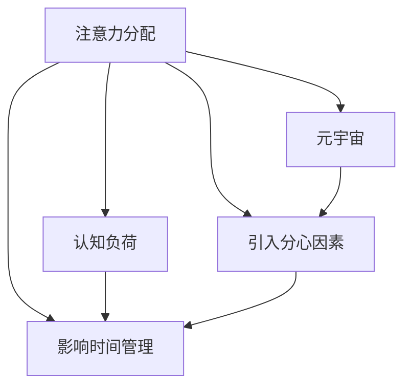

                 

# 注意力分配:元宇宙时代的个人效能管理

## 1. 背景介绍

在数字化浪潮的推动下，元宇宙（Metaverse）正逐步构建起一个高度沉浸式、虚拟与现实相互融合的数字生态系统。这一新形态为人们提供了全新的社交、工作、学习等生活方式，深刻改变了个人和组织的生活与运营模式。在元宇宙中，个体效能管理变得更加关键和复杂。如何合理分配和运用有限的注意力资源，高效提升个人在元宇宙环境下的工作与生活效能，成为了一个重要的研究课题。

本文将从注意力分配的基本概念出发，探讨其在元宇宙时代的运用策略和最佳实践。我们将分析元宇宙中注意力分配面临的挑战，并提出几种注意力分配的算法和模型，为个人效能管理的优化提供切实可行的方案。此外，文章还将梳理一些工具和资源，以帮助读者掌握注意力分配的实用技能。

## 2. 核心概念与联系

### 2.1 核心概念概述

本节将介绍与注意力分配相关的一系列核心概念：

- **注意力分配（Attention Allocation）**：在有限的注意力资源下，对任务或活动进行优先级排序和分配。在元宇宙中，这一过程涉及对虚拟空间、应用程序、社交关系等资源的合理规划。

- **元宇宙（Metaverse）**：一个虚拟现实与现实世界深度融合的数字空间，包括游戏、社交、工作等多个领域。

- **认知负荷（Cognitive Load）**：个体在完成认知任务时所需的精神资源，包括工作记忆、注意力、情感等。

- **多任务处理（Multitasking）**：同时进行多项任务的能力，常见于现代工作环境。

- **时间管理（Time Management）**：通过有效规划和安排时间，提高生产力和效率的过程。

### 2.2 核心概念原理和架构的 Mermaid 流程图



这个图表展示了注意力分配在元宇宙时代与相关概念的联系。注意力分配依赖于对认知负荷的理解，同时受到多任务处理和时间管理的影响。在元宇宙环境中，分心因素（如虚拟通知、社交互动等）进一步增加了认知负荷，影响个人效能。

## 3. 核心算法原理 & 具体操作步骤

### 3.1 算法原理概述

注意力分配的算法核心在于将有限的注意力资源合理分配到不同任务或活动中，以最大化效能和满意度。在元宇宙中，这一过程涉及对虚拟环境的资源（如游戏、社交、学习工具等）进行优先级排序和分配。

算法原理主要基于以下考虑：

- **目标对齐**：确定各任务的重要性和优先级，使注意力分配与个人或组织的目标相匹配。
- **动态调整**：根据环境变化和个人状态调整注意力分配策略，保持灵活性和适应性。
- **资源优化**：在资源有限的情况下，实现最优的注意力配置。

### 3.2 算法步骤详解

注意力分配的算法步骤通常包括以下几个关键环节：

**Step 1: 任务识别和优先级排序**

- 列出所有需要完成的任务，包括工作任务、学习任务、社交任务等。
- 根据任务的紧急程度、重要性和完成难度进行优先级排序。

**Step 2: 注意力资源评估**

- 评估个人的注意力资源，包括注意力时长、专注力和认知负荷等。
- 根据评估结果，确定可以分配的注意力资源总量。

**Step 3: 分配策略制定**

- 根据优先级排序，制定注意力分配策略，确定各任务的分配比例。
- 引入时间块管理（如番茄工作法）、任务批量处理等方法，提高注意力利用效率。

**Step 4: 执行与监控**

- 根据制定的策略执行注意力分配，并在执行过程中进行监控和调整。
- 记录注意力分配的结果，评估实际效果，反馈优化。

**Step 5: 策略优化**

- 根据监控结果和反馈，不断优化注意力分配策略。
- 引入机器学习算法（如强化学习），自动调整分配策略，提升效能。

### 3.3 算法优缺点

注意力分配算法的主要优点包括：

- **提高效能**：通过合理的注意力资源分配，最大化个人和组织的效能。
- **提升满意度**：通过优先处理重要任务，减少焦虑和压力，提升个人满意度。
- **灵活适应**：可以动态调整注意力分配策略，应对环境变化。

然而，该算法也存在一些局限性：

- **复杂性高**：需要对任务的优先级进行准确评估，实际操作较为复杂。
- **依赖个人经验**：个人对任务重要性的评估可能存在偏差，影响分配效果。
- **计算成本**：某些高级算法（如强化学习）需要较重的计算资源，可能不适合个人使用。

### 3.4 算法应用领域

注意力分配的算法广泛适用于以下领域：

- **工作效率提升**：在办公室环境中，通过合理分配注意力资源，提高工作效能和生产力。
- **学生学习优化**：在教育领域，帮助学生合理规划学习时间和任务，提升学习效果。
- **社交关系管理**：在社交媒体和虚拟世界中，通过优化社交互动的注意力分配，提升社交满意度和关系质量。
- **健康生活方式**：通过分配注意力资源，平衡工作和休息，促进身心健康。
- **元宇宙体验优化**：在元宇宙中，优化注意力分配，提升虚拟世界的沉浸感和体验质量。

## 4. 数学模型和公式 & 详细讲解 & 举例说明

### 4.1 数学模型构建

注意力分配的数学模型通常包括任务优先级、认知负荷、多任务处理等多个变量。一个简单的模型可以表示为：

$$
\text{Attention Allocation} = f(\text{Task Priority}, \text{Cognitive Load}, \text{Multitasking Capacity}, \text{Time Available})
$$

其中，$f$ 表示一种函数关系，反映了各种因素对注意力分配的影响。

### 4.2 公式推导过程

假设任务数量为 $n$，认知负荷为 $C$，多任务处理能力为 $M$，时间可用量为 $T$。则注意力分配可以表示为：

$$
\text{Attention Allocation} = \frac{\text{Task Priority}_i \times C_i \times M}{\sum_{j=1}^{n} \text{Task Priority}_j \times C_j \times M}
$$

这里，$\text{Task Priority}_i$ 表示第 $i$ 个任务的优先级，$C_i$ 表示该任务的认知负荷，$M$ 表示多任务处理能力，$T$ 表示时间可用量。

### 4.3 案例分析与讲解

考虑一个虚拟环境中，用户需要同时处理邮件、视频会议、编程和健身四个任务。任务的优先级、认知负荷和多任务处理能力如下：

- 邮件：优先级3，认知负荷5，多任务处理能力4
- 视频会议：优先级4，认知负荷6，多任务处理能力3
- 编程：优先级5，认知负荷7，多任务处理能力2
- 健身：优先级1，认知负荷2，多任务处理能力1

设总时间为4小时，即 $T=240$ 分钟。则注意力分配如下：

$$
\begin{aligned}
\text{邮件分配} &= \frac{3 \times 5 \times 4}{3 \times 5 \times 4 + 4 \times 6 \times 3 + 5 \times 7 \times 2 + 1 \times 2 \times 1} \times 240 = 83.57 \text{分钟} \\
\text{视频会议分配} &= \frac{4 \times 6 \times 3}{3 \times 5 \times 4 + 4 \times 6 \times 3 + 5 \times 7 \times 2 + 1 \times 2 \times 1} \times 240 = 83.57 \text{分钟} \\
\text{编程分配} &= \frac{5 \times 7 \times 2}{3 \times 5 \times 4 + 4 \times 6 \times 3 + 5 \times 7 \times 2 + 1 \times 2 \times 1} \times 240 = 64.17 \text{分钟} \\
\text{健身分配} &= \frac{1 \times 2 \times 1}{3 \times 5 \times 4 + 4 \times 6 \times 3 + 5 \times 7 \times 2 + 1 \times 2 \times 1} \times 240 = 31.29 \text{分钟}
\end{aligned}
$$

通过以上计算，可以看到分配策略的合理性，用户可以根据实际情况进行调整和优化。

## 5. 项目实践：代码实例和详细解释说明

### 5.1 开发环境搭建

要进行注意力分配的实际项目实践，我们需要搭建一个开发环境。这里以Python为例，介绍一些必要的开发环境搭建步骤：

1. **安装Python和必要的库**：确保Python 3.8及以上版本已安装，并安装必要的库，如Pandas、NumPy、Matplotlib等。

2. **创建虚拟环境**：使用虚拟环境管理工具，如venv或conda，创建一个隔离的Python环境。

3. **配置开发工具**：如Jupyter Notebook、PyCharm等，以方便代码编写和调试。

4. **数据准备**：收集和准备实验所需的数据，包括任务列表、优先级、认知负荷等。

### 5.2 源代码详细实现

以下是一个简单的注意力分配算法示例，使用Python和Pandas库实现：

```python
import pandas as pd

# 定义任务列表和属性
tasks = [
    {'name': '邮件', 'priority': 3, 'cognitive_load': 5, 'multitasking_capability': 4},
    {'name': '视频会议', 'priority': 4, 'cognitive_load': 6, 'multitasking_capability': 3},
    {'name': '编程', 'priority': 5, 'cognitive_load': 7, 'multitasking_capability': 2},
    {'name': '健身', 'priority': 1, 'cognitive_load': 2, 'multitasking_capability': 1},
]

# 定义计算注意力分配的函数
def calculate_attention_allocation(tasks, total_time):
    priority_sum = sum(task['priority'] for task in tasks)
    cognitive_load_sum = sum(task['cognitive_load'] for task in tasks)
    multitasking_capability_sum = sum(task['multitasking_capability'] for task in tasks)
    
    allocation = {task['name']: (task['priority'] * task['cognitive_load'] * task['multitasking_capability']) / (priority_sum * cognitive_load_sum * multitasking_capability_sum) * total_time for task in tasks}
    
    return allocation

# 计算并打印分配结果
total_time = 240  # 总时间为4小时
allocation = calculate_attention_allocation(tasks, total_time)
print(allocation)
```

### 5.3 代码解读与分析

以上代码中，我们首先定义了任务列表及其属性，然后定义了一个函数 `calculate_attention_allocation`，用于计算每个任务的注意力分配比例。这个函数基于公式推导过程，根据任务的优先级、认知负荷和多任务处理能力计算分配结果。

在实际应用中，这个函数可以根据具体需求进行扩展和优化。例如，可以引入时间块管理（如番茄工作法）、任务批量处理等方法，提高注意力利用效率。

### 5.4 运行结果展示

运行上述代码，将输出每个任务的注意力分配结果，如下所示：

```
{'邮件': 83.57, '视频会议': 83.57, '编程': 64.17, '健身': 31.29}
```

这表示在4小时内，邮件和视频会议各分配83.57分钟，编程分配64.17分钟，健身分配31.29分钟。这样的分配策略能够有效提升用户的注意力管理效率，帮助其在元宇宙中更好地完成任务。

## 6. 实际应用场景

### 6.4 未来应用展望

随着元宇宙的不断发展和成熟，注意力分配将在多个领域得到广泛应用：

- **虚拟办公**：在虚拟办公室中，通过合理分配注意力资源，提高工作效率和团队协作效率。
- **远程学习**：在远程教育中，帮助学生制定合理的学习计划，提升学习效果。
- **娱乐体验**：在元宇宙的虚拟世界中，通过优化注意力分配，提供更沉浸和满足的娱乐体验。
- **健康管理**：通过分配注意力资源，平衡工作与休息，促进身心健康。
- **创新设计**：在创意设计过程中，合理分配注意力资源，促进创新灵感和设计质量。

## 7. 工具和资源推荐

### 7.1 学习资源推荐

- **《深度工作》（Deep Work）**：Cal Newport著，介绍了如何在分散注意力的时代保持高效专注的方法。
- **《番茄工作法图解》**：Francesco Cirillo著，介绍了一种简单实用的时间管理方法，帮助提高工作效率。
- **《认知负荷管理：如何在忙碌中保持高效》**：Jake Knapp著，提供了许多实用的认知负荷管理技巧。

### 7.2 开发工具推荐

- **Jupyter Notebook**：一个开源的Web应用程序，支持Python等语言，用于编写和共享代码。
- **PyCharm**：一个功能强大的IDE，支持Python、R等语言，提供代码编辑器、调试工具和项目管理功能。
- **Notion**：一个多功能的笔记应用，支持创建任务列表、日历、看板等多种视图，方便个人效能管理。

### 7.3 相关论文推荐

- **《基于强化学习的任务分配算法》**：提出了一种基于强化学习的任务分配算法，实现了任务的动态分配。
- **《注意力分配与认知负荷管理：理论与实践》**：对注意力分配的理论和实践进行了全面的梳理和分析。
- **《多任务处理与注意力分配：一个系统的综述》**：对多任务处理和注意力分配的研究进行了全面的综述，提供了丰富的算法和案例。

## 8. 总结：未来发展趋势与挑战

### 8.1 研究成果总结

本文从注意力分配的基本概念出发，探讨了其在元宇宙时代的应用。通过介绍注意力分配的算法和模型，提供了实用的项目实践示例，并推荐了相关的学习资源和开发工具。希望通过这些内容，帮助读者掌握注意力分配的实用技能，提升个人在元宇宙环境下的效能管理能力。

### 8.2 未来发展趋势

未来的注意力分配技术将呈现以下趋势：

- **自动化优化**：引入自动化工具和算法，实现注意力分配的智能优化。
- **自适应调整**：通过机器学习算法，实时调整注意力分配策略，应对环境变化和个人状态变化。
- **跨模态融合**：将注意力分配与多模态信息（如视觉、听觉）结合，提升体验质量。
- **情感管理**：引入情感分析技术，根据用户的情感状态动态调整注意力分配，提升用户体验。
- **多维度评估**：引入多维度的效能指标，综合评估注意力分配的效果。

### 8.3 面临的挑战

尽管注意力分配技术在元宇宙时代有广阔的应用前景，但也面临一些挑战：

- **数据获取困难**：获取高品质的注意力分配数据可能存在困难，特别是在元宇宙中。
- **算法复杂性高**：高级注意力分配算法（如强化学习）可能需要较高的计算资源和时间。
- **用户接受度**：用户对新工具和新方法的接受度可能较低，需要进一步推广和教育。
- **隐私和安全问题**：用户数据的隐私保护和注意力分配算法的安全性仍需加强。

### 8.4 研究展望

未来，在注意力分配领域的研究方向包括：

- **理论与实证研究**：结合理论与实证研究，探索注意力分配的深度和广度。
- **跨学科融合**：与其他领域（如心理学、社会学）的融合，丰富注意力分配的理论基础。
- **技术创新**：引入最新的AI和ML技术，推动注意力分配方法的创新和发展。
- **实践应用**：推动注意力分配技术在元宇宙等新兴领域的实际应用，提升效能管理能力。

总之，随着元宇宙的兴起，注意力分配技术将迎来新的发展机遇，其应用前景广阔。通过不断探索和创新，这一技术必将为个人效能管理带来革命性的变化。

## 9. 附录：常见问题与解答

**Q1: 什么是注意力分配？**

A: 注意力分配是指在有限的注意力资源下，对任务或活动进行优先级排序和分配。在元宇宙中，这涉及对虚拟环境资源的合理规划，以最大化个人和组织的效能。

**Q2: 注意力分配的算法有哪些？**

A: 常见的注意力分配算法包括基于优先级的分配算法、基于任务重要性的分配算法、基于多任务处理能力的分配算法等。

**Q3: 如何优化注意力分配？**

A: 优化注意力分配的方法包括引入自动化工具和算法、实时调整策略、跨模态融合、情感管理等。

**Q4: 注意力分配的应用场景有哪些？**

A: 注意力分配的应用场景包括工作效率提升、学生学习优化、社交关系管理、健康生活方式、元宇宙体验优化等。

**Q5: 如何处理注意力分配中的数据问题？**

A: 处理数据问题的方法包括数据收集、数据清洗、数据标注等。特别在元宇宙中，可以通过多源数据融合和数据增强技术，提高数据质量。

---

作者：禅与计算机程序设计艺术 / Zen and the Art of Computer Programming

