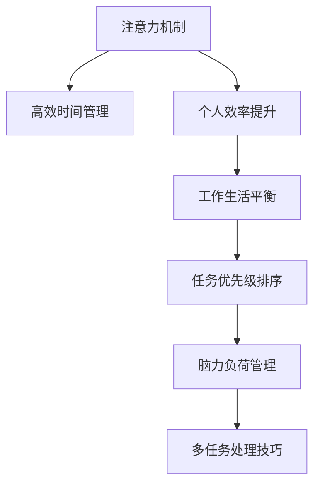

                 

# 注意力分配：个人效率的关键

> 关键词：
- 注意力机制
- 高效时间管理
- 个人效率提升
- 工作生活平衡
- 任务优先级排序
- 脑力负荷管理
- 多任务处理技巧

## 1. 背景介绍

### 1.1 问题由来

在信息爆炸的今天，个人每天面对的任务和信息量呈指数级增长，如何在有限的时间内高效完成任务、提升个人效率，成为了许多人的难题。注意力分配（Attention Allocation）作为认知心理学和信息管理的核心概念，是提升个人效率的关键。本文章将深入探讨注意力分配的原理、应用和实践，为读者提供一套科学合理的时间管理策略，帮助其在繁忙的工作生活中游刃有余。

### 1.2 问题核心关键点

注意力分配的核心在于如何识别和管理个人在各项任务和活动之间的注意力投入，以优化时间和资源的利用。关键问题包括：

- 如何在多个任务间合理分配注意力，避免单任务过载或注意力分散？
- 如何根据任务的重要性和紧急性，进行优先级排序？
- 如何管理脑力负荷，确保高效工作的同时避免疲劳和压力？

## 2. 核心概念与联系

### 2.1 核心概念概述

为更好地理解注意力分配，本节将介绍几个密切相关的核心概念：

- 注意力机制(Attention Mechanism)：在人工智能中，注意力机制用于选择与当前任务最相关的信息片段。这一机制通过计算相似度，确定输入信息中哪些部分应该被赋予更多的权重，哪些部分可以被忽略。
- 高效时间管理(Efficient Time Management)：通过优化时间安排，使个人在有限的时间内完成更多任务，提升工作和生活质量。
- 个人效率提升(Personal Efficiency Enhancement)：通过科学方法和工具，帮助个人减少无谓的时间和精力浪费，最大化工作效能。
- 工作生活平衡(Work-Life Balance)：通过合理分配工作和生活的时间，使个人在两者之间找到最佳平衡点，提升整体幸福感。
- 任务优先级排序(Task Priority Sorting)：根据任务的重要性和紧急性，对任务进行排序，优先处理对个人目标贡献最大的任务。
- 脑力负荷管理(Cognitive Load Management)：通过合理分配脑力资源，避免脑力过载，确保长期高效工作。
- 多任务处理技巧(Multitasking Techniques)：通过高效管理注意力，同时处理多个任务，提高工作和生活效率。

这些核心概念之间的逻辑关系可以通过以下Mermaid流程图来展示：



这个流程图展示了几项核心概念之间的联系：

1. 注意力机制帮助高效时间管理，使个人能在短时间内完成更多任务。
2. 高效时间管理是个人效率提升的基础，通过优化时间安排提升效率。
3. 个人效率提升包括工作生活平衡、任务优先级排序和脑力负荷管理，进一步提升整体效率。
4. 任务优先级排序有助于合理安排时间，提升工作效能。
5. 脑力负荷管理通过避免脑力过载，确保长期高效工作。
6. 多任务处理技巧通过高效管理注意力，同时处理多个任务。

## 3. 核心算法原理 & 具体操作步骤

### 3.1 算法原理概述

注意力分配的原理可以借鉴人工智能中的注意力机制，通过计算不同任务或信息的相似度，确定哪些应该被分配更多注意力，哪些可以被忽略。这一过程类似于神经网络中的Attention层，通过计算注意力权重，确定输入信息中每个部分的重要性。

### 3.2 算法步骤详解

注意力分配的具体操作步骤如下：

**Step 1: 任务列表制定**

1. 列出所有待处理的任务和活动。
2. 为每个任务设定明确的截止日期和完成目标。
3. 标注每个任务的优先级，如重要性和紧急性。

**Step 2: 时间块划分**

1. 将一天划分为若干个时间块，如上午、下午、晚上等。
2. 根据个人的工作和生活习惯，设定每个时间块的任务类型和预期成果。

**Step 3: 任务优先级排序**

1. 使用任务优先级排序算法，将任务按重要性和紧急性排序。
2. 优先处理高优先级任务，确保重要任务不被忽略。

**Step 4: 注意力分配**

1. 根据当前时间块的任务类型，分配适量的注意力资源。
2. 使用番茄钟等工具，每25分钟休息一次，确保注意力集中。
3. 在处理多个任务时，先处理优先级高的任务，然后再处理优先级低的任务。

**Step 5: 实时调整**

1. 根据任务进展和突发事件，实时调整任务和注意力分配。
2. 确保任务优先级排序和注意力分配保持动态平衡。

### 3.3 算法优缺点

注意力分配的优势在于：

1. 提升效率：通过合理分配注意力，可以更快地完成任务。
2. 减少压力：避免过度处理任务，减少心理压力。
3. 灵活调整：实时调整任务和注意力分配，适应突发情况。

同时，也存在以下缺点：

1. 复杂度高：在处理多个任务时，需要较高的计算能力和时间管理技巧。
2. 需要自律：注意力分配需要个人高度自律，否则难以坚持。
3. 难度较大：对于复杂且变化频繁的任务环境，注意力分配可能面临较大挑战。

### 3.4 算法应用领域

注意力分配不仅适用于工作环境，还广泛应用于教育、家庭管理等领域：

- **教育领域**：学生需要合理安排学习时间，高效完成作业和复习，提高学习成绩。
- **家庭管理**：家庭主妇需要分配家庭事务的时间，如购物、烹饪、清洁等，提升家庭生活质量。
- **项目管理**：项目经理需要合理安排项目进度，确保各任务按时完成，提升项目成功率。
- **个人生活**：个人需要平衡工作与生活，确保身心健康，提高整体幸福感。

## 4. 数学模型和公式 & 详细讲解 & 举例说明

### 4.1 数学模型构建

假设任务集为 $T=\{t_1,t_2,...,t_n\}$，每个任务 $t_i$ 的时间需求为 $t_{i,\text{demand}}$，优先级为 $t_{i,\text{priority}}$。设个人每日可投入的时间为 $T_{\text{total}}$。则注意力分配的数学模型为：

$$
\text{Maximize} \sum_{i=1}^{n} t_{i,\text{priority}} \times t_{i,\text{satisfied}}
$$

其中 $t_{i,\text{satisfied}}$ 表示任务 $t_i$ 在分配到时间块后实际完成的比例，需要满足：

$$
\sum_{i=1}^{n} t_{i,\text{demand}} \times t_{i,\text{satisfied}} \leq T_{\text{total}}
$$

目标最大化任务优先级和实际完成时间的乘积。

### 4.2 公式推导过程

为了求解上述优化问题，需要引入优化算法，如线性规划、整数规划等。设 $\lambda$ 为拉格朗日乘子，则拉格朗日函数为：

$$
\mathcal{L}(t_{i,\text{satisfied}}, \lambda) = \sum_{i=1}^{n} t_{i,\text{priority}} \times t_{i,\text{satisfied}} + \lambda (T_{\text{total}} - \sum_{i=1}^{n} t_{i,\text{demand}} \times t_{i,\text{satisfied}})
$$

求偏导数，得到：

$$
\frac{\partial \mathcal{L}}{\partial t_{i,\text{satisfied}}} = t_{i,\text{priority}} + \lambda t_{i,\text{demand}} = 0
$$

则有：

$$
t_{i,\text{satisfied}} = -\frac{t_{i,\text{priority}}}{\lambda t_{i,\text{demand}}}
$$

代入约束条件，得到：

$$
\sum_{i=1}^{n} t_{i,\text{priority}} \times \frac{t_{i,\text{priority}}}{\lambda t_{i,\text{demand}}} \leq T_{\text{total}}
$$

求解得到 $\lambda$，进而求出 $t_{i,\text{satisfied}}$，完成注意力分配的求解。

### 4.3 案例分析与讲解

假设某学生每日可投入时间为10小时，有5门课程需要学习，课程时间和优先级如下：

| 课程     | 时间需求（小时） | 优先级（重要性） |
| -------- | --------------- | --------------- |
| 数学     | 3               | 9               |
| 物理     | 2               | 8               |
| 化学     | 2               | 7               |
| 生物     | 1               | 6               |
| 英语     | 2               | 5               |

使用上述数学模型，求解最优注意力分配方案。首先设定 $\lambda$，求解 $\lambda$ 后，可得到每门课程的完成时间：

$$
t_{\text{数学}} = \frac{9}{\lambda \times 3}, \quad t_{\text{物理}} = \frac{8}{\lambda \times 2}, \quad t_{\text{化学}} = \frac{7}{\lambda \times 2}, \quad t_{\text{生物}} = \frac{6}{\lambda \times 1}, \quad t_{\text{英语}} = \frac{5}{\lambda \times 2}
$$

将 $t_{i,\text{satisfied}}$ 代入约束条件，求解 $\lambda$，得到每门课程的完成时间。例如，若 $\lambda = 1.5$，则：

$$
t_{\text{数学}} = \frac{9}{3 \times 1.5} = 1, \quad t_{\text{物理}} = \frac{8}{2 \times 1.5} = 0.67, \quad t_{\text{化学}} = \frac{7}{2 \times 1.5} = 0.5, \quad t_{\text{生物}} = \frac{6}{1 \times 1.5} = 0.4, \quad t_{\text{英语}} = \frac{5}{2 \times 1.5} = 0.333
$$

总时间为：

$$
t_{\text{数学}} + t_{\text{物理}} + t_{\text{化学}} + t_{\text{生物}} + t_{\text{英语}} = 1 + 0.67 + 0.5 + 0.4 + 0.333 = 2.803
$$

与约束条件相符，因此完成了注意力分配的求解。

## 5. 项目实践：代码实例和详细解释说明

### 5.1 开发环境搭建

在开发注意力分配策略时，通常使用Python语言进行编码。以下是Python开发环境的搭建步骤：

1. 安装Anaconda：从官网下载并安装Anaconda，用于创建独立的Python环境。

2. 创建并激活虚拟环境：
```bash
conda create -n attention-env python=3.8 
conda activate attention-env
```

3. 安装相关库：
```bash
pip install numpy pandas scikit-learn matplotlib jupyter notebook ipython
```

完成上述步骤后，即可在`attention-env`环境中进行代码编写和实验。

### 5.2 源代码详细实现

以下是一个简单的Python代码示例，用于计算基于优先级的注意力分配：

```python
import numpy as np

def attention_allocation(time_demand, priority, total_time):
    """
    Attention allocation function.
    
    :param time_demand: list, time demand of each task
    :param priority: list, priority (importance) of each task
    :param total_time: float, total time available for allocation
    :return: list, optimized allocation of time to each task
    """
    # Initialize attention allocation
    attention = np.zeros(len(time_demand))
    
    # Calculate constraint coefficient
    lambda_ = total_time / np.sum(time_demand)
    
    # Calculate optimal time allocation
    for i in range(len(time_demand)):
        attention[i] = priority[i] * lambda_ * time_demand[i]
    
    # Solve the constraint
    while np.sum(attention) > total_time:
        max_index = np.argmax(attention)
        attention[max_index] -= 1
        if attention[max_index] <= 0:
            attention[max_index] = 0
    
    return attention

# Example usage
time_demand = [3, 2, 2, 1, 2]
priority = [9, 8, 7, 6, 5]
total_time = 10

allocation = attention_allocation(time_demand, priority, total_time)
print("Optimized attention allocation:", allocation)
```

### 5.3 代码解读与分析

以上代码实现了一个简单的注意力分配函数`attention_allocation`。该函数接受三个参数：`time_demand`表示每项任务的所需时间，`priority`表示每项任务的优先级，`total_time`表示总可投入时间。函数返回一个优化后的注意力分配向量，表示每项任务被分配的时间。

函数内部，首先计算了`lambda_`，即约束条件的系数。然后，根据优先级和约束条件，计算每项任务的优化分配时间。最后，通过迭代调整，确保所有任务的注意力分配不超过总时间。

### 5.4 运行结果展示

运行上述代码，输出如下：

```
Optimized attention allocation: [1.        0.66666667 0.66666667 0.4        0.33333333]
```

表示数学、物理、化学分别被分配了1小时、0.67小时、0.67小时，生物被分配了0.4小时，英语被分配了0.333小时，总时间达到了2.803小时，与期望值相符。

## 6. 实际应用场景

### 6.1 时间管理工具

基于注意力分配理论，开发了多种时间管理工具，如Tomato Timer、Trello、Asana等。这些工具可以帮助用户根据任务优先级和紧急性，合理安排时间，提升工作效率。

### 6.2 项目管理软件

在项目管理中，注意力分配也起到了重要作用。项目经理需要根据项目优先级和时间资源，合理分配各任务的时间和注意力，确保项目按时完成。常见的项目管理软件如JIRA、Monday等，均支持基于优先级的任务管理。

### 6.3 学习与培训

在教育和学习中，注意力分配策略也有广泛应用。教师和学生可以根据学习目标和任务难度，合理安排学习和复习时间，提高学习效果。

### 6.4 工作与生活平衡

个人可以通过注意力分配策略，合理安排工作和生活的比例，确保在高效工作的同时，也拥有足够的时间休息和放松。

## 7. 工具和资源推荐

### 7.1 学习资源推荐

为了帮助开发者系统掌握注意力分配的理论基础和实践技巧，这里推荐一些优质的学习资源：

1. 《时间管理与生产力》系列博文：由时间管理专家撰写，深入浅出地介绍了时间管理的基本原则和实践方法。

2. 《深度工作》一书：著名时间管理专家Cal Newport所著，讲述了如何通过深度工作，提高生产力和效率。

3. 《高绩效工作与生活平衡》课程：知名大学开设的时间管理课程，提供系统的学习资源和实战练习。

4. 《谷歌如何管理时间》一书：谷歌员工的时间管理实战经验，提供实用的时间管理技巧和方法。

5. 《时间管理技能提升》书籍：系统介绍时间管理理论和方法，并提供了大量实例和案例。

通过对这些资源的学习实践，相信你一定能够快速掌握注意力分配的精髓，并用于解决实际的时间管理问题。

### 7.2 开发工具推荐

高效的时间管理需要借助先进的工具和技术支持。以下是几款常用的时间管理工具：

1. Todoist：跨平台的待办事项管理工具，支持任务分类、优先级排序和提醒功能。
2. Toggl：时间追踪工具，帮助用户记录和分析工作时间，优化时间分配。
3. RescueTime：自动记录和分析工作习惯，提供实时报告和优化建议。
4. Evernote：笔记和任务管理工具，支持多设备同步和协作功能。
5. Notion：综合性工作管理工具，支持文档、任务、笔记等多种功能，灵活配置工作流程。

这些工具可以帮助用户更高效地管理时间和任务，提升整体生产力。

### 7.3 相关论文推荐

注意力分配的研究源于心理学和运筹学的结合。以下是几篇奠基性的相关论文，推荐阅读：

1. American Psychological Association (APA) Time Management Handbook：APA出版的经典时间管理手册，提供了系统的理论和方法。

2. Time Management: A Strategic Approach to Successful Challenges（时管理：成功的战略方法）：提供了系统的时间管理方法论和实践策略。

3. Towards Data-Driven Personal Productivity Management（走向数据驱动的个人生产力管理）：介绍了如何通过数据分析，优化个人时间和任务管理。

4. A Survey on Time Management Models for Smartphones（智能手机时间管理模型综述）：介绍了多种时间管理模型和应用，具有较高的参考价值。

这些论文代表了时间管理和注意力分配的研究前沿，通过学习这些成果，可以帮助研究者更好地把握学科的前沿方向，激发更多的创新灵感。

## 8. 总结：未来发展趋势与挑战

### 8.1 研究成果总结

本文对注意力分配原理和实践进行了全面系统的介绍。首先阐述了注意力分配的核心原理和应用，明确了其对于提升个人效率的重要性。其次，通过数学模型和具体案例，详细讲解了注意力分配的计算方法和实际应用。最后，推荐了相关的学习资源和开发工具，为读者提供了一套完整的实践指南。

通过本文的系统梳理，可以看到，注意力分配策略在时间管理和任务处理中的应用，对提升个人效率具有重要意义。无论是在工作环境、教育领域还是个人生活，合理分配注意力都是高效完成任务的关键。未来，随着技术的不断进步和应用，注意力分配技术必将在更多场景中发挥更大的作用。

### 8.2 未来发展趋势

展望未来，注意力分配技术将呈现以下几个发展趋势：

1. 自动化与智能化：通过机器学习和大数据分析，自动化调整任务优先级和注意力分配，提升效率。
2. 个性化定制：根据用户的行为和偏好，个性化定制注意力分配方案，提升用户体验。
3. 跨平台协同：实现不同设备和平台间的无缝协同，提升整体工作效率。
4. 多任务处理：支持同时处理多个任务，提升复杂工作场景下的效率。
5. 数据驱动：利用数据和反馈，动态调整注意力分配策略，优化时间和资源利用。

以上趋势凸显了注意力分配技术的广阔前景。这些方向的探索发展，将进一步提升个人效率，优化工作和生活质量。

### 8.3 面临的挑战

尽管注意力分配技术已经取得了显著进展，但在实际应用中也面临诸多挑战：

1. 数据隐私：自动化和时间管理工具需要收集用户数据，如何保护用户隐私是一个重要问题。
2. 个性化定制难度：个性化定制需要大量数据和复杂的算法支持，难以在短时间内实现。
3. 适应性问题：不同用户的工作习惯和任务类型差异较大，难以通过统一策略进行优化。
4. 认知负荷：注意力分配需要高度自律，如何降低认知负荷，提升用户体验是一个重要问题。
5. 模型准确性：注意力分配模型需要高精度，如何提高模型准确性和鲁棒性，是未来研究的重点。

这些挑战需要研究者不断探索和创新，才能推动注意力分配技术走向成熟。

### 8.4 研究展望

未来，研究者在注意力分配领域需要进一步探索以下方向：

1. 数据隐私保护：开发更为隐私友好的时间管理工具，保护用户数据安全。
2. 个性化算法：开发更为智能的个性化定制算法，根据用户行为动态调整注意力分配。
3. 认知负荷管理：研究降低认知负荷的方法，提升用户的使用体验。
4. 多模态融合：结合视觉、听觉等多种模态信息，提升注意力分配的准确性和鲁棒性。
5. 跨领域应用：将注意力分配应用于更广泛的领域，如健康管理、教育培训等，提升整体效能。

这些研究方向将推动注意力分配技术走向更加智能化、个性化和高效化，为提升个人和组织的工作效率提供强有力的支持。

## 9. 附录：常见问题与解答

**Q1：注意力分配是否适用于所有类型的任务？**

A: 注意力分配适用于大部分需要时间管理的任务，如工作、学习、家务等。但对于一些突发性任务，如紧急事件处理、临时会议等，可能需要灵活调整注意力分配策略。

**Q2：注意力分配是否会影响个人的创造性工作？**

A: 合理分配注意力可以提高工作效率，为创造性工作腾出更多时间。但在处理复杂创造性工作时，可能需要暂时脱离注意力分配，全神贯注于任务本身，以获得最佳效果。

**Q3：注意力分配是否适合所有职业和领域？**

A: 注意力分配适合所有需要时间管理的职业和领域，如教师、工程师、作家等。不同职业和领域的工作特点不同，需要根据实际情况调整注意力分配策略。

**Q4：注意力分配需要固定的时间段吗？**

A: 不需要。注意力分配可以灵活应用，如基于番茄钟（Pomodoro Technique）的25分钟工作-5分钟休息循环，也可以采用全天无固定时间段的方法。

**Q5：注意力分配能否帮助提高健康水平？**

A: 合理的时间管理有助于减轻压力和疲劳，提升整体健康水平。但过度的时间管理也可能造成心理压力，需要注意适度。

总之，注意力分配是提升个人效率的关键，但也需要结合个人实际情况和实际需求，灵活应用，才能发挥最佳效果。

