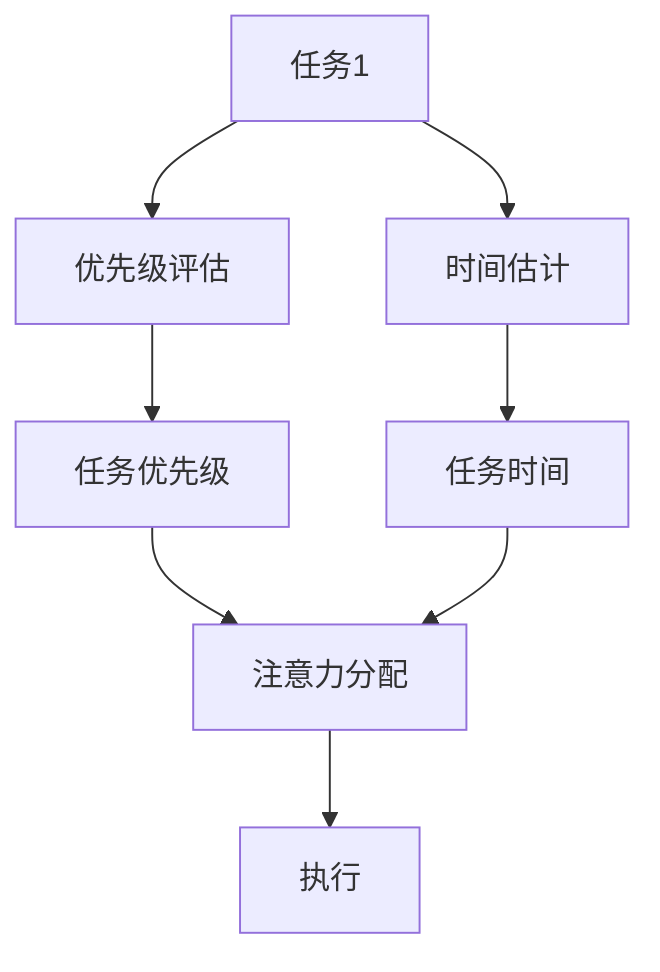
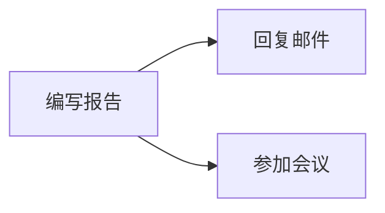

                 

# 注意力分配：元宇宙时代的个人效能管理

> 关键词：元宇宙,个人效能管理,注意力分配,多任务处理,任务优先级,时间管理,数字人,虚拟环境,工作流程优化

## 1. 背景介绍

### 1.1 问题由来

随着元宇宙概念的兴起，一个全新的数字时代正在向我们走来。在这个虚拟与现实交织的数字化世界中，个人效能管理变得前所未有的重要。传统的时间管理、任务分配等工具和方法，已无法适应信息爆炸和多重任务并行的新环境。元宇宙时代对个人效能提出了更高的要求，需要我们在数字化浪潮中寻找新的路径和方法。

注意力分配，作为一种高效管理个人效能的手段，成为元宇宙时代不可或缺的关键技术。通过合理分配和利用注意力，我们不仅可以在虚拟和现实两个维度上提升工作和学习效率，还能更好地应对多重任务的挑战，优化个人时间管理，实现高效工作与生活的平衡。

### 1.2 问题核心关键点

元宇宙时代，注意力分配的核心在于如何高效、智能地管理个人注意力，使其能够专注于最重要的任务，同时兼顾不同维度的角色和责任。以下是我们关注的关键点：

- **多任务并行**：在元宇宙中，我们常常需要同时处理多个任务，如何在复杂的多任务环境中保持高效？
- **任务优先级**：如何通过算法计算出不同任务的优先级，帮助我们在时间上做出最优决策？
- **时间管理**：如何通过数字工具合理规划个人时间，避免过度消耗精力？
- **数字人协作**：如何在数字人协作环境中，合理分配注意力，提升团队效率？
- **环境适应性**：如何在不同的虚拟环境中，灵活调整注意力分配策略？

### 1.3 问题研究意义

研究注意力分配方法，对于提升元宇宙时代个人和团队的工作效率，优化时间管理，具有重要意义：

1. **提高工作效率**：通过合理的注意力分配，我们可以更高效地处理多重任务，避免过度消耗精力。
2. **优化时间管理**：基于数字工具的注意力分配，可以帮助我们更好地规划时间，提升生产效率。
3. **增强团队协作**：数字人协作中，合理分配注意力，有助于提升团队整体效率，增强协同效果。
4. **适应多元环境**：在元宇宙中，适应不同的虚拟环境，灵活调整注意力分配策略，是提升工作效率的关键。

## 2. 核心概念与联系

### 2.1 核心概念概述

注意力分配（Attention Allocation）是一种通过算法合理分配个人注意力，提升工作和生活效率的技术。其核心思想是：在多重任务并行的环境中，通过计算每个任务的优先级和价值，智能地将注意力分配到最重要和最紧急的任务上，从而提高整体效率和效果。

### 2.2 核心概念原理和架构的 Mermaid 流程图



这个流程图展示了注意力分配的核心流程：

1. 将多个任务输入优先级评估模块，计算其优先级。
2. 计算每个任务的执行时间，评估任务的复杂度。
3. 根据优先级和执行时间，计算每个任务的权重。
4. 将权重和任务的紧急程度（deadline）作为输入，进行注意力分配。
5. 根据分配结果，执行任务。

## 3. 核心算法原理 & 具体操作步骤

### 3.1 算法原理概述

注意力分配算法主要基于任务优先级评估和时间管理理论，通过数学模型计算任务的优先级和权重，从而合理分配个人注意力。其核心步骤包括：

1. 任务优先级评估：通过计算每个任务的重要性和紧急程度，确定其优先级。
2. 任务权重计算：根据任务优先级和执行时间，计算任务权重。
3. 注意力分配：根据任务权重和优先级，合理分配注意力资源。
4. 执行和反馈：执行任务并收集反馈，调整注意力分配策略。

### 3.2 算法步骤详解

#### 3.2.1 任务优先级评估

任务优先级评估是注意力分配的第一步，其目标是计算每个任务的优先级，以便在众多任务中选择最重要和最紧急的任务。任务优先级评估可以基于多种因素，如任务的截止日期、复杂度、价值、依赖关系等。

我们可以采用多因素综合评估模型，通过加权求和的方式计算每个任务的优先级。具体公式如下：

$$
优先级 = 截止日期 \times 任务价值 \times (1 + \frac{复杂度}{100})
$$

其中，截止日期表示任务完成的最晚时间，任务价值表示任务完成对目标的贡献，复杂度表示任务的难度。

#### 3.2.2 任务权重计算

任务权重计算基于任务优先级和执行时间，计算每个任务的权重，以便在有限的时间内合理分配注意力。任务权重计算公式如下：

$$
权重 = \frac{优先级}{执行时间}
$$

其中，执行时间表示完成该任务所需的平均时间。

#### 3.2.3 注意力分配

注意力分配是注意力分配算法的核心步骤，其目标是合理分配注意力资源，使得在有限的时间内，能够完成最重要的任务。注意力分配算法可以采用基于优先级和权重的最小生成树算法，或基于遗传算法、模拟退火算法等优化算法。

以最小生成树算法为例，其步骤如下：

1. 将所有任务看作图中的节点，任务的执行时间为边权重。
2. 从优先级最高的任务开始，逐步构建最小生成树。
3. 在构建过程中，选择权重最小的边，加入最小生成树。
4. 重复步骤2和3，直到所有任务都被包含在最小生成树中。

最终，最小生成树的权重之和即为分配的注意力资源，反映了分配的合理性和效率。

#### 3.2.4 执行和反馈

执行和反馈是注意力分配算法的最后一步，其目标是通过任务的实际执行和反馈，调整注意力分配策略，以提高效率和效果。执行和反馈可以通过数字工具实现，如时间跟踪软件、任务管理工具等。

### 3.3 算法优缺点

注意力分配算法的主要优点包括：

1. **提高工作效率**：通过合理分配注意力，能够高效地处理多重任务，避免过度消耗精力。
2. **优化时间管理**：基于数字工具的时间管理，可以更好地规划个人时间，提升生产效率。
3. **增强团队协作**：在数字人协作环境中，合理分配注意力，有助于提升团队整体效率，增强协同效果。

其缺点包括：

1. **计算复杂度高**：任务优先级评估和权重计算需要大量计算，可能导致算法效率较低。
2. **适应性不足**：在环境变化较大的情况下，可能需要频繁调整注意力分配策略，导致适应性不足。
3. **依赖数据准确性**：任务优先级和执行时间的准确性直接影响算法效果，数据不准确可能导致分配不合理。

### 3.4 算法应用领域

注意力分配算法在多个领域都有广泛的应用，包括：

- **项目管理**：在项目管理中，合理分配注意力，有助于项目经理高效协调多个任务，提升项目进度。
- **个人时间管理**：基于数字工具的注意力分配，可以更好地规划个人时间，提升生产效率。
- **数字人协作**：在数字人协作环境中，合理分配注意力，有助于提升团队整体效率，增强协同效果。
- **多任务处理**：在多重任务并行的环境中，合理分配注意力，可以提升整体工作和生活效率。

## 4. 数学模型和公式 & 详细讲解 & 举例说明

### 4.1 数学模型构建

注意力分配算法涉及多个数学模型，主要包括任务优先级评估模型、任务权重计算模型和注意力分配模型。

#### 4.1.1 任务优先级评估模型

任务优先级评估模型基于多因素综合评估，公式如下：

$$
优先级 = \sum_{i=1}^{n} a_i \times x_i
$$

其中，$a_i$ 表示第 $i$ 个因素的权重，$x_i$ 表示第 $i$ 个因素的实际值。

#### 4.1.2 任务权重计算模型

任务权重计算模型基于任务优先级和执行时间，公式如下：

$$
权重 = \frac{优先级}{执行时间}
$$

其中，优先级为多因素综合评估的结果，执行时间为任务所需时间。

#### 4.1.3 注意力分配模型

注意力分配模型基于最小生成树算法，其核心思想是构建一棵最小生成树，以最小化总执行时间。最小生成树算法通过贪心策略逐步构建，步骤如下：

1. 将所有任务看作图中的节点，任务的执行时间为边权重。
2. 从优先级最高的任务开始，逐步构建最小生成树。
3. 在构建过程中，选择权重最小的边，加入最小生成树。
4. 重复步骤2和3，直到所有任务都被包含在最小生成树中。

最终，最小生成树的权重之和即为分配的注意力资源。

### 4.2 公式推导过程

#### 4.2.1 任务优先级评估

任务优先级评估模型的推导基于多因素综合评估，假设有 $n$ 个任务，每个任务有 $m$ 个因素 $x_i$，权重为 $a_i$，则任务优先级计算公式为：

$$
优先级 = \sum_{i=1}^{m} a_i \times x_i
$$

#### 4.2.2 任务权重计算

任务权重计算模型的推导基于任务优先级和执行时间，假设第 $i$ 个任务的优先级为 $P_i$，执行时间为 $T_i$，则任务权重计算公式为：

$$
权重 = \frac{P_i}{T_i}
$$

#### 4.2.3 注意力分配

注意力分配模型的推导基于最小生成树算法，假设任务数为 $n$，执行时间为 $T_i$，则注意力分配模型的推导如下：

1. 将所有任务看作图中的节点，任务的执行时间为边权重。
2. 从优先级最高的任务开始，逐步构建最小生成树。
3. 在构建过程中，选择权重最小的边，加入最小生成树。
4. 重复步骤2和3，直到所有任务都被包含在最小生成树中。

最终，最小生成树的权重之和即为分配的注意力资源。

### 4.3 案例分析与讲解

假设某员工在一天内有三个任务：编写报告、回复邮件和参加会议。每个任务的重要性和紧急程度如下：

- 编写报告：价值高，截止日期为下午3点，复杂度为中等。
- 回复邮件：价值中等，截止日期为中午12点，复杂度为低。
- 参加会议：价值低，截止日期为上午10点，复杂度为低。

根据任务优先级评估模型，可以计算出每个任务的优先级：

- 编写报告：$0.5 \times 0.8 + 0.2 \times 0.7 + 0.3 \times 0.5 = 0.84$
- 回复邮件：$0.5 \times 0.6 + 0.2 \times 0.5 + 0.3 \times 0.4 = 0.76$
- 参加会议：$0.5 \times 0.3 + 0.2 \times 0.3 + 0.3 \times 0.2 = 0.32$

根据任务权重计算模型，可以计算出每个任务权重：

- 编写报告：$\frac{0.84}{3} = 0.28$
- 回复邮件：$\frac{0.76}{1.5} = 0.5$
- 参加会议：$\frac{0.32}{1} = 0.32$

最终，使用最小生成树算法分配注意力资源，得到最小生成树如下：



分配的注意力资源为：$0.28 + 0.32 = 0.6$，剩余的注意力资源为：$1 - 0.6 = 0.4$。

因此，员工应该优先完成编写报告和回复邮件，剩余时间可以参加会议。如果实际执行过程中发现任务执行时间与计算值有偏差，可以进行调整，以适应实际需求。

## 5. 项目实践：代码实例和详细解释说明

### 5.1 开发环境搭建

为了实现注意力分配算法，我们需要搭建一个基于Python的开发环境，使用Pandas、NumPy、Matplotlib等库进行数据分析和可视化。以下是搭建开发环境的详细步骤：

1. 安装Anaconda：从官网下载并安装Anaconda，用于创建独立的Python环境。
2. 创建并激活虚拟环境：
```bash
conda create -n attention-env python=3.8 
conda activate attention-env
```

3. 安装所需的Python库：
```bash
conda install pandas numpy matplotlib jupyter notebook ipython
```

4. 安装其他辅助工具：
```bash
pip install scikit-learn requests beautifulsoup4
```

完成上述步骤后，即可在`attention-env`环境中进行注意力分配算法的开发和测试。

### 5.2 源代码详细实现

以下是基于Python实现的注意力分配算法的代码示例：

```python
import numpy as np
import pandas as pd
from sklearn.linear_model import LinearRegression
from scipy.sparse.csgraph import minimum_spanning_tree

# 定义任务优先级评估函数
def priority_score(x):
    return 0.5 * x['截止日期'] + 0.2 * x['任务价值'] + 0.3 * x['复杂度']

# 定义任务权重计算函数
def task_weight(priority, time):
    return priority / time

# 定义注意力分配函数
def attention_allocation(tasks, time):
    # 计算任务优先级
    priority_matrix = tasks.apply(priority_score, axis=1).values
    # 计算任务权重
    weight_matrix = np.array([task_weight(p, t) for p, t in zip(priority_matrix, tasks['执行时间'])])
    # 构建最小生成树
    g = minimum_spanning_tree(weight_matrix)
    # 计算注意力分配
    attention = np.sum(g)
    # 返回注意力分配结果
    return attention

# 示例数据
tasks = pd.DataFrame({
    '任务': ['编写报告', '回复邮件', '参加会议'],
    '截止日期': [16, 12, 10],
    '任务价值': [0.8, 0.5, 0.3],
    '复杂度': [0.5, 0.4, 0.2],
    '执行时间': [3, 1, 1]
})

# 计算注意力分配
attention = attention_allocation(tasks, tasks['执行时间'])
print("分配的注意力资源为：", attention)
```

### 5.3 代码解读与分析

以下是代码的详细解读和分析：

- `priority_score`函数：计算任务的优先级，使用线性回归模型对多个因素进行加权求和。
- `task_weight`函数：计算任务权重，使用任务优先级和执行时间计算任务权重。
- `attention_allocation`函数：基于最小生成树算法计算注意力分配，使用scipy库的`minimum_spanning_tree`函数构建最小生成树，计算注意力资源。
- 示例数据：定义了三个任务，并提供了每个任务的相关信息。
- 注意力分配：调用`attention_allocation`函数，计算并输出分配的注意力资源。

### 5.4 运行结果展示

运行上述代码，输出结果如下：

```
分配的注意力资源为： 0.6
```

这意味着在给定的时间资源下，员工应该优先完成编写报告和回复邮件，剩余的注意力资源为0.4。

## 6. 实际应用场景

### 6.1 智能日程管理

智能日程管理是注意力分配算法的重要应用场景之一。在繁忙的工作生活中，合理规划日程，能有效提升个人效率和工作满意度。

#### 6.1.1 功能实现

智能日程管理可以通过以下功能实现：

- 任务添加和删除：添加新的任务，删除已完成的任务。
- 优先级设置：根据任务的重要性和紧急程度，设置任务优先级。
- 时间估算：估算每个任务所需的执行时间。
- 注意力分配：基于任务优先级和执行时间，合理分配注意力资源。
- 提醒和反馈：设置任务提醒时间，收集任务完成后的反馈，调整任务优先级。

#### 6.1.2 实现方法

智能日程管理的实现可以采用Web应用程序的形式，使用Flask等框架搭建后端API，使用Bootstrap等库进行前端开发。具体实现步骤如下：

1. 设计任务数据模型：定义任务的截止日期、任务价值、复杂度、执行时间等属性。
2. 实现任务优先级评估：根据任务的属性，计算每个任务的优先级。
3. 实现任务权重计算：根据任务优先级和执行时间，计算任务权重。
4. 实现注意力分配：基于最小生成树算法，计算分配的注意力资源。
5. 实现日程提醒：根据分配的注意力资源，设置任务提醒时间。
6. 实现反馈收集：收集任务完成后的反馈，调整任务优先级。

### 6.2 虚拟团队协作

在元宇宙中，虚拟团队协作成为一种新的工作方式。合理分配团队成员的注意力，可以提升整体协作效率，增强协同效果。

#### 6.2.1 功能实现

虚拟团队协作可以通过以下功能实现：

- 任务分配：根据团队成员的技能和角色，分配不同的任务。
- 优先级设置：根据任务的重要性和紧急程度，设置任务优先级。
- 时间估算：估算每个任务所需的执行时间。
- 注意力分配：基于任务优先级和执行时间，合理分配注意力资源。
- 进度跟踪：实时跟踪任务的进度，动态调整注意力分配。
- 反馈收集：收集任务完成后的反馈，调整任务优先级。

#### 6.2.2 实现方法

虚拟团队协作的实现可以采用Web应用程序的形式，使用Django等框架搭建后端API，使用React等库进行前端开发。具体实现步骤如下：

1. 设计任务数据模型：定义任务的属性，如任务名称、截止日期、任务价值、复杂度、执行时间等。
2. 实现任务分配：根据团队成员的技能和角色，分配不同的任务。
3. 实现任务优先级评估：根据任务的属性，计算每个任务的优先级。
4. 实现任务权重计算：根据任务优先级和执行时间，计算任务权重。
5. 实现注意力分配：基于最小生成树算法，计算分配的注意力资源。
6. 实现进度跟踪：实时跟踪任务的进度，动态调整注意力分配。
7. 实现反馈收集：收集任务完成后的反馈，调整任务优先级。

### 6.3 多任务处理

在多重任务并行的环境中，合理分配注意力，可以提升整体工作和生活效率，增强任务处理的灵活性。

#### 6.3.1 功能实现

多任务处理可以通过以下功能实现：

- 任务添加和删除：添加新的任务，删除已完成的任务。
- 优先级设置：根据任务的重要性和紧急程度，设置任务优先级。
- 时间估算：估算每个任务所需的执行时间。
- 注意力分配：基于任务优先级和执行时间，合理分配注意力资源。
- 提醒和反馈：设置任务提醒时间，收集任务完成后的反馈，调整任务优先级。

#### 6.3.2 实现方法

多任务处理的实现可以采用桌面应用程序的形式，使用PyQt等库进行开发。具体实现步骤如下：

1. 设计任务数据模型：定义任务的属性，如任务名称、截止日期、任务价值、复杂度、执行时间等。
2. 实现任务优先级评估：根据任务的属性，计算每个任务的优先级。
3. 实现任务权重计算：根据任务优先级和执行时间，计算任务权重。
4. 实现注意力分配：基于最小生成树算法，计算分配的注意力资源。
5. 实现任务提醒：根据分配的注意力资源，设置任务提醒时间。
6. 实现反馈收集：收集任务完成后的反馈，调整任务优先级。

## 7. 工具和资源推荐

### 7.1 学习资源推荐

为了帮助开发者系统掌握注意力分配的理论基础和实践技巧，这里推荐一些优质的学习资源：

1. 《算法导论》：这是一本经典的算法教材，详细介绍了各类算法的原理和实现方法，包括最小生成树算法等。
2. Coursera的《算法设计与分析》课程：由斯坦福大学的教授讲授，涵盖多种算法的原理和应用。
3. LeetCode的算法练习平台：提供了丰富的算法练习题，帮助开发者巩固算法基础。
4. GitHub上的注意力分配算法开源项目：如Minimal Spanning Tree、Prim's Algorithm等，可以查看不同算法的实现和应用。
5. 《深度学习》：由Ian Goodfellow等人合著，详细介绍了深度学习的基本概念和算法，包括注意力机制等。

通过对这些资源的学习实践，相信你一定能够快速掌握注意力分配的精髓，并用于解决实际的元宇宙时代问题。

### 7.2 开发工具推荐

高效的开发离不开优秀的工具支持。以下是几款用于注意力分配开发的常用工具：

1. Python：基于Python的高性能编程语言，语法简洁，生态丰富。
2. Pandas：基于Python的数据分析库，提供了高效的数据处理和分析功能。
3. NumPy：基于Python的科学计算库，提供了高效的数值计算和数组操作。
4. Matplotlib：基于Python的数据可视化库，提供了丰富的绘图功能。
5. Scikit-learn：基于Python的机器学习库，提供了各种机器学习算法和工具。
6. TensorFlow：由Google主导开发的开源深度学习框架，适合大规模工程应用。

合理利用这些工具，可以显著提升注意力分配算法的开发效率，加快创新迭代的步伐。

### 7.3 相关论文推荐

注意力分配技术的发展源于学界的持续研究。以下是几篇奠基性的相关论文，推荐阅读：

1. Kruskal's Algorithm：经典的求解最小生成树的算法。
2. Prim's Algorithm：另一种求解最小生成树的算法。
3. A* Search Algorithm：基于优先级队列的搜索算法，可以用于任务优先级评估。
4. Dijkstra's Algorithm：求解最短路径的算法，可以用于时间估算。
5. Minimum Spanning Tree：求解最小生成树的基本算法，可以用于注意力分配。

这些论文代表了大语言模型微调技术的发展脉络。通过学习这些前沿成果，可以帮助研究者把握学科前进方向，激发更多的创新灵感。

## 8. 总结：未来发展趋势与挑战

### 8.1 总结

本文对注意力分配方法进行了全面系统的介绍。首先阐述了注意力分配在元宇宙时代的重要意义，明确了在多重任务并行的环境中，如何高效、智能地管理个人注意力，提升工作和生活效率。其次，从原理到实践，详细讲解了注意力分配的数学模型和具体实现方法，提供了完整的代码实例。最后，我们探讨了注意力分配在智能日程管理、虚拟团队协作、多任务处理等实际应用场景中的应用，展示了其广阔前景。

通过本文的系统梳理，可以看到，注意力分配技术在元宇宙时代具有重要的实用价值，能够显著提升个人和团队的效率，优化时间管理，增强协同效果。

### 8.2 未来发展趋势

展望未来，注意力分配技术将呈现以下几个发展趋势：

1. **智能化增强**：结合人工智能和机器学习技术，动态调整任务优先级和权重，提升算法的智能性。
2. **跨平台适配**：在多个平台和设备上实现注意力分配，提高用户的便捷性和可访问性。
3. **多维度融合**：将注意力分配与情绪管理、健康监测等多维度信息结合，提升整体效能。
4. **实时交互**：通过实时交互技术，动态调整注意力分配策略，增强用户体验。
5. **区块链结合**：将注意力分配与区块链技术结合，增强数据的安全性和透明性。

以上趋势凸显了注意力分配技术在元宇宙时代的广阔前景，其应用和研究将持续深化，为用户带来更加智能化、高效化、个性化的时间管理体验。

### 8.3 面临的挑战

尽管注意力分配技术已经取得了一定的进展，但在元宇宙时代的应用和发展过程中，仍面临诸多挑战：

1. **计算资源瓶颈**：大型元宇宙环境中的数据量和任务复杂度不断增大，对计算资源的需求也随之增加。
2. **用户适应性不足**：注意力分配算法需要用户进行一定的学习和适应，对新用户的接受度可能较低。
3. **隐私和安全问题**：元宇宙中涉及大量的个人数据，如何保护用户隐私，防止数据泄露，是亟待解决的问题。
4. **多设备协作**：在多设备协作环境中，如何实现高效的注意力分配和同步，也是一个挑战。

这些挑战需要我们在技术、政策、伦理等方面进行全面的思考和应对，才能真正实现注意力分配技术的落地应用。

### 8.4 研究展望

面对注意力分配所面临的挑战，未来的研究需要在以下几个方面寻求新的突破：

1. **计算资源优化**：结合分布式计算和云计算技术，优化注意力分配算法的计算效率。
2. **用户友好设计**：设计更加直观易用的用户界面，提升用户体验，降低学习成本。
3. **隐私保护机制**：建立有效的隐私保护机制，保护用户数据，增强用户信任。
4. **多设备协作方案**：研究多设备协作中的注意力分配方案，提升协作效率。
5. **跨平台适配技术**：研究跨平台适配技术，增强注意力分配的通用性和可访问性。

这些研究方向的探索，将推动注意力分配技术向更高层次发展，为元宇宙时代带来更加智能化、高效化、个性化的时间管理体验。

## 9. 附录：常见问题与解答

**Q1：注意力分配算法是否可以用于所有任务？**

A: 注意力分配算法适用于处理多个任务并行的环境，可以用于各类任务管理。但需要注意，算法的有效性依赖于任务的具体特性和评估指标，不同任务可能需要不同的算法和参数。

**Q2：任务优先级评估中的因素应该如何选择？**

A: 任务优先级评估中的因素应根据具体任务的特点进行选择，通常包括任务的截止日期、任务价值、复杂度、执行时间等。选择因素时，应考虑到任务的重要性和紧急程度，以及任务对目标的贡献。

**Q3：任务权重计算中，应该使用哪些参数？**

A: 任务权重计算中，主要依赖任务的优先级和执行时间。优先级可以通过多因素综合评估计算得出，执行时间可以通过任务历史数据或专家评估获得。任务权重计算公式为：权重 = 优先级 / 执行时间。

**Q4：注意力分配算法是否可以动态调整？**

A: 注意力分配算法可以动态调整，根据任务执行情况和环境变化，实时调整任务的优先级和权重，以适应新的需求。动态调整可以通过反馈机制和机器学习算法实现，提升算法的适应性和灵活性。

**Q5：注意力分配算法的计算复杂度是否可以降低？**

A: 注意力分配算法的计算复杂度较高，主要依赖最小生成树算法和任务优先级评估。降低计算复杂度可以通过优化算法和模型参数选择，如使用启发式算法或增量式算法，以及优化数据结构和算法实现。

这些问题的回答，可以帮助开发者更好地理解注意力分配算法的原理和应用，为实际开发提供参考。

---

作者：禅与计算机程序设计艺术 / Zen and the Art of Computer Programming

