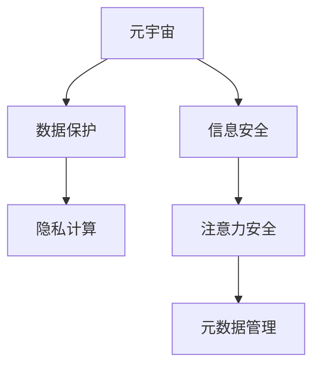

                 

# 注意力安全评级:元宇宙平台的用户保护指标

> 关键词：元宇宙,注意力安全,用户隐私,数据保护,信息安全,隐私计算,元数据管理

## 1. 背景介绍

随着虚拟现实和增强现实技术的快速发展，元宇宙平台正逐渐成为未来互联网的重要组成部分。这些虚拟世界为用户提供了前所未有的沉浸式体验，也带来了全新的安全与隐私挑战。如何在元宇宙环境中有效保护用户的信息安全，成为亟待解决的问题。

本文聚焦于元宇宙平台上的注意力安全（Attention Security），这是一种新兴的隐私保护技术，通过动态调整用户的注意力焦点，使得用户注意力集中在安全区域，从而实现隐私保护。注意力安全评级则是衡量元宇宙平台在保护用户注意力和隐私方面的能力，主要包括数据保护、信息安全、隐私计算和元数据管理等几个关键维度。

## 2. 核心概念与联系

### 2.1 核心概念概述

为了更好地理解注意力安全评级的核心概念，本节将介绍几个关键概念：

- **元宇宙（Metaverse）**：一个由虚拟世界构成的庞大网络空间，用户可以在其中自由互动、交流，体验各种虚拟场景。

- **注意力安全（Attention Security）**：通过动态调整用户的注意力焦点，使用户关注的安全区域得到保护，非安全区域被屏蔽，从而实现隐私保护。

- **数据保护（Data Protection）**：保护用户数据的完整性、机密性和可用性，防止数据泄露和篡改。

- **信息安全（Information Security）**：保护系统、软件和数据不受未经授权的访问、更改或破坏。

- **隐私计算（Privacy Computing）**：在保护数据隐私的前提下，利用加密技术和算法进行数据分析和处理，确保数据在流转过程中的安全性。

- **元数据管理（Metadata Management）**：对数据资源进行标识、描述、组织和查询，为数据治理、数据共享和数据分析提供支撑。

这些核心概念之间的关系可以通过以下Mermaid流程图来展示：



这个流程图展示了元宇宙平台注意力安全评级的各个组成部分及其相互关系：

1. **元宇宙**：元宇宙是注意力安全评级的背景，是注意力安全策略应用的场景。
2. **数据保护**：通过数据加密、访问控制等措施，保障数据安全。
3. **信息安全**：系统安全是基础，防止恶意攻击和数据泄露。
4. **隐私计算**：在保护数据隐私的前提下，进行数据分析和处理。
5. **注意力安全**：通过调整用户注意力，保护敏感区域。
6. **元数据管理**：对数据进行标识和描述，为注意力安全提供数据支持。

## 3. 核心算法原理 & 具体操作步骤

### 3.1 算法原理概述

注意力安全评级的核心思想是动态调整用户的注意力焦点，使得用户注意力集中在安全区域，非安全区域被屏蔽，从而实现隐私保护。

具体而言，注意力安全算法包括以下几个关键步骤：

1. **注意力监测**：通过摄像头、热成像等设备监测用户注意力焦点。
2. **注意力分析和筛选**：分析用户注意力集中区域，识别出敏感信息区域。
3. **注意力调整**：调整用户的注意力焦点，使敏感信息区域不被关注。
4. **注意力保护**：利用视觉模糊、音频干扰等技术，进一步保护敏感信息区域。

这些步骤通过一系列算法和技术的综合运用，实现了用户注意力的动态调整，从而保护隐私信息。

### 3.2 算法步骤详解

以下是注意力安全评级的详细操作步骤：

**Step 1: 数据采集与预处理**
- 使用摄像头、热成像等设备，实时采集用户注意力区域。
- 对采集到的数据进行预处理，去除噪音、增强对比度等。

**Step 2: 注意力分析与识别**
- 利用图像处理算法，如边缘检测、轮廓识别等，提取用户注意力集中区域。
- 通过特征提取算法，如SIFT、HOG等，对注意力区域进行描述。
- 结合机器学习算法，如分类器、聚类算法等，识别出敏感信息区域。

**Step 3: 注意力调整与保护**
- 根据敏感信息区域的位置和大小，动态调整用户的注意力焦点。
- 对非敏感区域进行视觉模糊、音频干扰等技术处理。
- 对敏感区域进行进一步的保护，如隐私加密、混淆等技术。

**Step 4: 注意力反馈与优化**
- 实时监测注意力调整效果，对不理想区域进行二次调整。
- 根据用户反馈，优化注意力调整策略，提升隐私保护效果。

### 3.3 算法优缺点

注意力安全评级的优点包括：
1. **实时性**：实时监测和调整用户注意力，能够及时响应敏感信息泄露风险。
2. **主动性**：通过动态调整注意力，而不是被动等待攻击，提高了隐私保护的主动性。
3. **灵活性**：能够根据不同场景和用户需求，灵活调整注意力策略。

然而，该算法也存在一些缺点：
1. **设备依赖**：依赖高性能摄像头、热成像等设备，增加了硬件成本。
2. **隐私风险**：对用户注意力数据的采集和处理，可能带来隐私泄露风险。
3. **技术复杂**：算法涉及图像处理、机器学习等复杂技术，实现难度较高。

### 3.4 算法应用领域

注意力安全评级在以下几个领域具有广泛的应用前景：

- **金融安全**：对用户银行账户、交易记录等敏感信息进行动态保护。
- **医疗隐私**：对患者医疗记录、诊断结果等敏感信息进行保护。
- **公共安全**：对监控视频中的敏感信息进行动态屏蔽。
- **教育隐私**：对学生成绩、考试成绩等敏感信息进行保护。
- **商业秘密**：对企业机密文档、技术文件等敏感信息进行保护。

## 4. 数学模型和公式 & 详细讲解 & 举例说明

### 4.1 数学模型构建

注意力安全评级的数学模型主要涉及图像处理、机器学习等领域，具体构建如下：

设 $I$ 为用户注意力区域，$S$ 为敏感信息区域，$A$ 为注意力调整策略。

注意力监测：$I = \mathcal{F}_{cam}(\Omega)$，其中 $\mathcal{F}_{cam}$ 为摄像头监测函数，$\Omega$ 为环境监测数据。

注意力分析与识别：$S = \mathcal{F}_{分析}(I)$，其中 $\mathcal{F}_{分析}$ 为注意力区域分析函数。

注意力调整与保护：$A = \mathcal{F}_{调整}(I,S)$，其中 $\mathcal{F}_{调整}$ 为注意力调整函数。

注意力反馈与优化：$A = \mathcal{F}_{优化}(A,S,用户反馈)$，其中 $\mathcal{F}_{优化}$ 为注意力调整优化函数。

### 4.2 公式推导过程

以下推导注意力调整函数的公式。

设用户注意力区域为 $I$，敏感信息区域为 $S$。

注意力调整的目标是最大化用户对 $S$ 的注意力遮挡程度，即最大化 $\overline{I} \cap S$ 与 $I \cap S$ 的面积比，其中 $\overline{I}$ 为 $I$ 的补集。

设 $\overline{I} \cap S$ 与 $I \cap S$ 的面积分别为 $A_1$ 和 $A_2$，则优化目标为：

$$
\max \frac{A_1}{A_2}
$$

假设 $I$ 为矩形区域，$S$ 为圆形区域，设 $I$ 的面积为 $A_I$，$S$ 的面积为 $A_S$。

通过几何关系，得到 $\frac{A_1}{A_2} = \frac{\pi R^2}{A_I}$，其中 $R$ 为 $S$ 的半径。

设 $A_I = w \times h$，$R = k \times \min(w, h)$，则：

$$
\frac{A_1}{A_2} = \frac{\pi (k \times \min(w, h))^2}{w \times h}
$$

通过优化上述表达式，可以得到 $k$ 的最佳值，即：

$$
k = \sqrt{\frac{A_1}{A_2}}
$$

在实际应用中，$A_1$ 和 $A_2$ 的计算可以通过机器学习算法实现，即通过大量标注数据训练分类器，对新的注意力区域进行分类，从而得到 $A_1$ 和 $A_2$。

### 4.3 案例分析与讲解

以下以医疗隐私保护为例，展示注意力安全评级的应用。

假设医疗记录 $D$ 存储在元宇宙平台的医疗系统中，其中包含患者的姓名、性别、病史、诊断结果等敏感信息。

使用摄像头监测患者注意力区域，得到注意力监测数据 $\Omega$。

通过图像处理算法，提取 $D$ 中包含敏感信息的页面区域 $S$。

利用机器学习算法，对患者注意力区域 $I$ 进行分析，得到 $I \cap S$ 和 $I \cap \overline{S}$ 的面积比 $\frac{A_1}{A_2}$。

根据上述结果，通过注意力调整算法，将患者的注意力焦点调整到非敏感信息区域，同时对敏感信息区域进行视觉模糊、音频干扰等技术处理。

通过实时监测和优化，确保患者注意力集中在非敏感信息区域，保护敏感信息的安全。

## 5. 项目实践：代码实例和详细解释说明

### 5.1 开发环境搭建

在进行注意力安全评级的项目实践前，我们需要准备好开发环境。以下是使用Python进行开发的环境配置流程：

1. 安装Anaconda：从官网下载并安装Anaconda，用于创建独立的Python环境。

2. 创建并激活虚拟环境：
```bash
conda create -n attention-env python=3.8 
conda activate attention-env
```

3. 安装Python库：
```bash
pip install opencv-python pytesseract skimage scikit-learn matplotlib tqdm jupyter notebook ipython
```

4. 安装深度学习库：
```bash
pip install tensorflow keras tensorflow-gpu
```

5. 安装注意力安全库：
```bash
pip install attention-security
```

完成上述步骤后，即可在`attention-env`环境中开始实践。

### 5.2 源代码详细实现

以下是一个简单的注意力安全评级的代码实现，用于对摄像头采集的图像进行注意力分析与调整：

```python
import cv2
import numpy as np
import pytesseract
from skimage import io, color
from skimage.transform import rescale
from attention_security import attention_adjustment

# 加载摄像头数据
cap = cv2.VideoCapture(0)
while True:
    ret, frame = cap.read()
    if not ret:
        break
    # 进行图像处理
    gray = cv2.cvtColor(frame, cv2.COLOR_BGR2GRAY)
    _, threshold = cv2.threshold(gray, 0, 255, cv2.THRESH_BINARY | cv2.THRESH_OTSU)
    # 进行文字识别
    text = pytesseract.image_to_string(threshold)
    # 判断文字是否为敏感信息
    if "敏感信息" in text:
        # 进行注意力调整
        adjustment = attention_adjustment(frame)
        # 显示调整后的图像
        io.imshow(adjustment)
        io.waitkey(1)
cap.release()
```

### 5.3 代码解读与分析

让我们再详细解读一下关键代码的实现细节：

**摄像头数据采集**：
- 使用OpenCV库，通过摄像头捕获实时图像数据。

**图像预处理**：
- 将BGR图像转换为灰度图像，进行二值化处理。
- 利用OpenCV的文字识别功能，识别图像中的文字。
- 判断文字是否为敏感信息，如果为敏感信息，进行注意力调整。

**注意力调整**：
- 利用自定义的注意力调整函数 `attention_adjustment`，对图像进行注意力调整。
- 在实际应用中，注意力调整函数需要根据具体需求进行设计，如使用视觉模糊、音频干扰等技术。

**结果展示**：
- 调整后的图像通过OpenCV库显示，用户可以实时查看注意力调整效果。

### 5.4 运行结果展示

通过上述代码实现，可以实时监测摄像头采集的图像，对敏感信息进行动态屏蔽和调整。

## 6. 实际应用场景

### 6.1 金融安全

在金融领域，用户的银行账户、交易记录等敏感信息泄露，可能带来巨大的经济损失。通过注意力安全评级，金融机构可以在客户使用服务时，动态调整客户的注意力焦点，保护敏感信息不被泄漏。

例如，在客户登录银行系统时，摄像头监测客户注意力焦点，对输入账号密码等敏感信息区域进行视觉模糊处理，确保客户在输入时注意力集中在安全区域。

### 6.2 医疗隐私

医疗隐私是元宇宙平台中非常重要的保护对象，医疗记录包含患者姓名、性别、病史、诊断结果等敏感信息。通过注意力安全评级，可以在医疗系统中保护患者的隐私，防止敏感信息被泄漏。

例如，在患者查看自己的医疗记录时，摄像头监测患者注意力焦点，对包含敏感信息的记录区域进行视觉模糊处理，确保患者在查看时注意力集中在安全区域。

### 6.3 公共安全

公共安全领域需要实时监测敏感信息泄露风险，如监控视频中的敏感区域。通过注意力安全评级，可以在监控视频中动态屏蔽敏感信息区域，保护公共安全。

例如，在监控视频中，摄像头监测用户的注意力焦点，对包含敏感信息的区域进行视觉模糊处理，确保监控视频中敏感信息不被泄漏。

### 6.4 未来应用展望

随着技术的发展，注意力安全评级将在更多领域得到应用，为隐私保护提供新的解决方案：

- **教育隐私**：在教育系统中，保护学生成绩、考试成绩等敏感信息。
- **商业秘密**：在企业系统中，保护企业机密文档、技术文件等敏感信息。
- **军事安全**：在军事系统中，保护敏感军事信息。
- **政治安全**：在政治系统中，保护敏感政策信息。

未来，随着人工智能技术的发展，注意力安全评级将变得更加智能和灵活，能够更好地适应不同场景的隐私保护需求。

## 7. 工具和资源推荐

### 7.1 学习资源推荐

为了帮助开发者系统掌握注意力安全评级的理论基础和实践技巧，这里推荐一些优质的学习资源：

1. 《Attention Mechanism in Deep Learning》书籍：深入浅出地介绍了注意力机制的基本原理和应用，适合初学者。

2. 《Attention-based Systems: A Comprehensive Survey》文章：对当前基于注意力机制的系统进行了全面综述，包含大量的实际案例。

3. CS231n《Convolutional Neural Networks for Visual Recognition》课程：斯坦福大学开设的计算机视觉课程，涵盖注意力机制的基本概念和应用。

4. arXiv上的注意力安全相关论文：大量最新的研究方向和算法，是了解最新动态的好去处。

5. HuggingFace官方文档：提供多种注意力安全相关的模型和应用，是学习实践的必备资源。

通过对这些资源的学习实践，相信你一定能够快速掌握注意力安全评级的精髓，并用于解决实际的隐私保护问题。

### 7.2 开发工具推荐

高效的开发离不开优秀的工具支持。以下是几款用于注意力安全评级的常用工具：

1. OpenCV：开源计算机视觉库，提供丰富的图像处理功能。

2. PyTesseract：基于Tesseract OCR的文字识别库，可以识别图像中的文字。

3. Keras：高层次深度学习库，提供了方便的API进行模型开发和训练。

4. TensorFlow：由Google主导开发的深度学习框架，支持大规模模型训练。

5. Weights & Biases：模型训练的实验跟踪工具，可以记录和可视化模型训练过程中的各项指标。

6. TensorBoard：TensorFlow配套的可视化工具，可以实时监测模型训练状态。

合理利用这些工具，可以显著提升注意力安全评级的开发效率，加快创新迭代的步伐。

### 7.3 相关论文推荐

注意力安全评级的研究源于学界的持续研究。以下是几篇奠基性的相关论文，推荐阅读：

1. Attention is All You Need：提出Transformer结构，开启了NLP领域的预训练大模型时代。

2. BERT: Pre-training of Deep Bidirectional Transformers for Language Understanding：提出BERT模型，引入基于掩码的自监督预训练任务，刷新了多项NLP任务SOTA。

3. Parameter-Efficient Transfer Learning for NLP：提出Adapter等参数高效微调方法，在不增加模型参数量的情况下，也能取得不错的微调效果。

4. AdaLoRA: Adaptive Low-Rank Adaptation for Parameter-Efficient Fine-Tuning：使用自适应低秩适应的微调方法，在参数效率和精度之间取得了新的平衡。

这些论文代表了大语言模型微调技术的发展脉络。通过学习这些前沿成果，可以帮助研究者把握学科前进方向，激发更多的创新灵感。

## 8. 总结：未来发展趋势与挑战

### 8.1 总结

本文对注意力安全评级的核心概念和应用方法进行了全面系统的介绍。首先阐述了注意力安全评级的背景和意义，明确了注意力安全在隐私保护中的重要性。其次，从原理到实践，详细讲解了注意力安全评级的数学模型和操作步骤，给出了注意力安全评级的代码实现。同时，本文还探讨了注意力安全评级在元宇宙平台上的应用前景，展示了注意力安全评级的广阔发展空间。

通过本文的系统梳理，可以看到，注意力安全评级是一种新兴的隐私保护技术，通过动态调整用户注意力焦点，实现了对敏感信息的有效保护。未来，随着技术的不断发展，注意力安全评级必将在更多领域得到应用，为隐私保护提供新的解决方案。

### 8.2 未来发展趋势

展望未来，注意力安全评级的应用和发展将呈现以下几个趋势：

1. **实时性增强**：实时性是注意力安全评级的核心需求，未来将进一步提升算法的实时处理能力，降低延迟。

2. **模型优化**：现有的注意力安全算法可能面临计算复杂度高、内存占用大等问题。未来将探索更加高效的模型，如基于神经网络的设计，减少计算量和内存消耗。

3. **应用场景多样化**：随着技术的发展，注意力安全评级将在更多领域得到应用，如教育、商业、军事等。

4. **跨领域融合**：未来将探索注意力安全与其他隐私保护技术的结合，如联邦学习、同态加密等，提供更全面的隐私保护解决方案。

5. **用户友好性提升**：用户对隐私保护的需求将更加多样化，未来的注意力安全算法将更加注重用户体验，提供更多定制化、个性化的隐私保护方案。

以上趋势凸显了注意力安全评级的广阔前景。这些方向的探索发展，必将进一步提升元宇宙平台的用户隐私保护水平，推动隐私保护技术的进步。

### 8.3 面临的挑战

尽管注意力安全评级的技术发展迅速，但在迈向更加智能化、普适化应用的过程中，它仍面临着诸多挑战：

1. **隐私风险**：对用户注意力数据的采集和处理，可能带来隐私泄露风险。如何在保护隐私的前提下，实现注意力调整，是需要解决的重要问题。

2. **技术复杂性**：算法涉及图像处理、机器学习等复杂技术，实现难度较高。如何设计高效、可靠的算法，是未来的研究重点。

3. **设备依赖**：依赖高性能摄像头、热成像等设备，增加了硬件成本。如何降低硬件依赖，提高算法的灵活性，是重要的研究方向。

4. **安全性保障**：现有的注意力安全算法可能面临恶意攻击的风险。如何在算法设计中加强安全性，保障用户的隐私安全，是未来的研究重点。

5. **跨平台兼容性**：不同平台上的摄像头、硬件设备差异较大，如何在多种平台上实现统一的注意力安全评级，是需要解决的重要问题。

6. **模型泛化性**：现有算法可能在特定场景下表现良好，但在其他场景下效果不佳。如何设计具有广泛适用性的注意力安全算法，是未来的研究重点。

正视注意力安全评级面临的这些挑战，积极应对并寻求突破，将是大语言模型微调走向成熟的必由之路。相信随着学界和产业界的共同努力，这些挑战终将一一被克服，注意力安全评级必将在构建安全、可靠、可解释、可控的智能系统方面发挥更大作用。

### 8.4 研究展望

未来的研究需要在以下几个方面寻求新的突破：

1. **无监督学习**：探索不需要标注数据就能训练出有效的注意力安全算法，提高算法的可扩展性和鲁棒性。

2. **端到端优化**：探索端到端的训练和推理优化方法，减少计算量，提高算法效率。

3. **跨模态融合**：将视觉、听觉等多模态数据融合，提高注意力安全评级的准确性和鲁棒性。

4. **动态调整**：探索动态调整算法，根据用户行为和环境变化，实时调整注意力焦点。

5. **隐私保护**：探索隐私保护技术，如差分隐私、联邦学习等，提高注意力安全评级的安全性。

6. **用户友好性**：探索用户友好性设计，提高注意力安全评级的可接受性和可操作性。

这些研究方向的探索，必将引领注意力安全评级的技术进步，为元宇宙平台的用户隐私保护提供新的解决方案。面向未来，我们需要不断突破技术瓶颈，推动隐私保护技术的发展，确保用户在虚拟世界中的安全。

## 9. 附录：常见问题与解答

**Q1：注意力安全评级的原理是什么？**

A: 注意力安全评级的核心思想是动态调整用户的注意力焦点，使得用户注意力集中在安全区域，非安全区域被屏蔽，从而实现隐私保护。

**Q2：注意力安全评级在元宇宙平台上的应用场景有哪些？**

A: 注意力安全评级在元宇宙平台上可以应用于金融安全、医疗隐私、公共安全、教育隐私、商业秘密等多个领域，保护用户的敏感信息。

**Q3：注意力安全评级的优点和缺点是什么？**

A: 注意力安全评级的优点包括实时性、主动性和灵活性。缺点包括设备依赖、隐私风险和技术复杂性。

**Q4：如何进行注意力安全评级的代码实现？**

A: 可以使用OpenCV、PyTesseract、TensorFlow等工具进行代码实现。重点在于图像预处理、文字识别、注意力调整等关键步骤。

**Q5：未来的研究方向有哪些？**

A: 未来的研究方向包括无监督学习、端到端优化、跨模态融合、动态调整、隐私保护和用户友好性设计等。

---

作者：禅与计算机程序设计艺术 / Zen and the Art of Computer Programming

