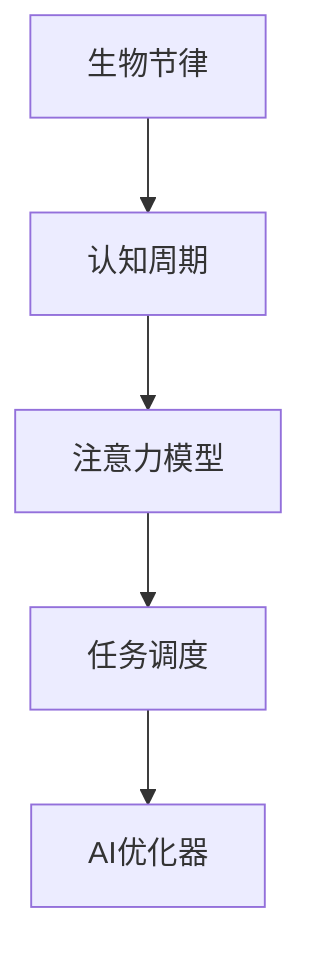

                 

# 注意力生物节律优化器：AI定制的认知周期管理

> 关键词：生物节律,认知周期,优化器,注意力模型,人工智能,任务调度

## 1. 背景介绍

### 1.1 问题由来
现代生活节奏日益加快，人们在不断追求工作效率的同时，也面临更高的认知负荷。长时间的工作容易让人疲劳，导致注意力分散、记忆减退、决策能力下降等问题。如何科学地安排工作和休息，以最大限度地发挥认知潜力，已成为现代生活和工作的重要课题。

### 1.2 问题核心关键点
生物节律和认知周期管理是大数据和人工智能（AI）研究的前沿领域，旨在根据人的生理节律和认知特点，进行智能化的任务分配和休息调整。本文聚焦于基于注意力机制的生物节律优化器，通过AI技术定制个性化的认知周期管理方案，提升工作效率和生活质量。

### 1.3 问题研究意义
认知周期管理对提升生产力、保障健康、优化工作和生活平衡具有重要意义：

1. **提升生产力**：通过合理的工作与休息安排，有助于集中注意力，减少中断和错误，提高工作效率。
2. **保障健康**：适时的休息和睡眠有助于缓解疲劳，提升记忆力、创造力和决策能力，预防认知障碍和心理疾病。
3. **优化平衡**：实现工作与生活、脑力劳动与体力劳动的平衡，使人们更健康、更幸福。

## 2. 核心概念与联系

### 2.1 核心概念概述

为更好地理解注意力生物节律优化器的原理和应用，本节将介绍几个核心概念：

- **生物节律**：指人或动物的生理周期性变化，如睡眠-觉醒周期、体温周期等。
- **认知周期**：指人认知能力的周期性变化，如注意力、记忆力、学习力的高峰和低谷。
- **注意力模型**：指用于模拟注意力机制的神经网络模型，如Transformer、BERT等。
- **任务调度**：指对任务的执行时间和优先级的安排，以实现最优的资源利用。
- **AI优化器**：指通过机器学习技术自动调整模型参数或任务调度的优化算法。

这些核心概念之间的逻辑关系可以通过以下Mermaid流程图来展示：



这个流程图展示了一些关键概念之间的关系：

1. 生物节律和认知周期决定了人认知能力的变化规律。
2. 注意力模型可以模拟认知周期内注意力的高峰和低谷，识别认知资源的优化调度。
3. 任务调度在认知周期内合理安排任务执行，提升资源利用率。
4. AI优化器通过学习认知周期数据，自动调整任务调度，实现个性化优化。

## 3. 核心算法原理 & 具体操作步骤
### 3.1 算法原理概述

注意力生物节律优化器是一种基于注意力机制的AI优化器，旨在根据用户生物节律和认知周期的变化规律，自动调整任务调度和休息安排。其核心思想是通过模型学习用户的认知特点，预测其认知周期，在认知高峰期分配重要任务，在认知低谷期安排休息或低优先级任务，从而提升整体工作效率和生活质量。

### 3.2 算法步骤详解

注意力生物节律优化器的实现主要分为以下几个步骤：

**Step 1: 数据收集与预处理**
- 收集用户每日的工作与休息数据，包括任务执行时间、工作时长、休息时间等。
- 分析用户的生物节律，识别其睡眠-觉醒周期、体温周期等生理节律。
- 结合认知心理学知识，构建认知周期的数学模型，如记忆、注意力等能力的周期性变化。

**Step 2: 训练注意力模型**
- 利用收集的数据和生理节律模型，训练一个注意力模型，如Transformer。
- 在训练过程中，模型学习如何在认知高峰期集中注意力，在认知低谷期进行分散注意力或休息。
- 使用正则化技术，如L2正则、Dropout等，防止过拟合。

**Step 3: 任务调度优化**
- 根据用户的认知周期，预测其认知高峰和低谷时段。
- 将重要任务分配在认知高峰时段执行，低优先级任务或休息时间安排在认知低谷时段。
- 采用任务调度算法，如遗传算法、模拟退火等，优化任务执行的顺序和时间安排。

**Step 4: 生成优化方案**
- 根据优化器训练结果和任务调度算法，生成一份个性化的任务执行和休息安排方案。
- 通过可视化工具，将优化方案呈现给用户，使其了解其认知周期的变化规律和最佳任务安排。

**Step 5: 动态调整与反馈**
- 定期更新数据，通过反馈机制优化模型参数和任务调度算法。
- 根据用户反馈，不断调整优化方案，使其更加符合用户的实际需求和生物节律。

### 3.3 算法优缺点

注意力生物节律优化器具有以下优点：
1. **个性化优化**：根据用户的具体生理和认知特点，生成个性化任务安排方案，提升用户体验。
2. **实时调整**：通过动态反馈机制，不断优化模型和任务调度算法，确保方案的适应性。
3. **跨平台应用**：适用于多种设备和平台，方便用户随时获取和调整优化方案。

同时，该方法也存在一些局限性：
1. **数据依赖**：依赖大量详细的用户行为数据，数据获取和隐私保护是关键问题。
2. **模型复杂度**：模型训练和任务调度算法较为复杂，需要较高的计算资源。
3. **场景适用性**：适用于连续型任务和固定工作节奏的场景，对于随机性较强的任务可能效果不佳。
4. **认知多样性**：不同用户的认知周期可能存在差异，单一模型难以普适所有用户。

尽管存在这些局限性，但注意力生物节律优化器提供了一种全新的认知周期管理思路，有助于提升用户的工作效率和生活质量。未来，随着更多数据的积累和算法的优化，这些局限性有望逐步克服。

### 3.4 算法应用领域

注意力生物节律优化器可以在多个领域得到应用，例如：

- **办公室工作**：适用于企业员工的日常任务安排，优化工作与休息时间，提升工作效率。
- **远程办公**：帮助远程工作者根据生物节律进行任务分配，减少工作中的打断和疲劳。
- **学生学习**：辅助学生根据其认知周期进行课程安排和复习计划，提高学习效果。
- **体育训练**：为运动员进行训练计划优化，结合生理周期安排训练强度和时间。
- **个人健康管理**：根据用户的生理和认知周期，制定健康饮食、运动和休息计划。

此外，注意力生物节律优化器还可应用于智能家居系统、医疗健康管理等领域，为用户提供更加个性化和智能化的生活和工作辅助。

## 4. 数学模型和公式 & 详细讲解 & 举例说明

### 4.1 数学模型构建

注意力生物节律优化器主要包括以下几个数学模型：

1. **认知周期模型**：
   - 设用户的认知周期为 $T=[t_1,t_2,\cdots,t_n]$，其中 $t_i$ 表示认知高峰或低谷时间点。
   - 认知周期模型可以表示为 $T=f(\tau)$，其中 $\tau$ 为生理节律参数。

2. **任务调度模型**：
   - 设任务集合为 $J=\{j_1,j_2,\cdots,j_m\}$，其中 $j_i$ 表示第 $i$ 个任务。
   - 任务调度模型可以表示为 $S=\{(s_i,t_i)\}_{i=1}^m$，其中 $s_i$ 表示任务 $j_i$ 的起始时间，$t_i$ 表示任务 $j_i$ 的执行时间。

3. **优化目标函数**：
   - 优化目标函数 $F(J,S)$ 表示任务调度的总成本，可以通过效率、资源利用率等指标来衡量。
   - 优化目标可以表示为 $F(J,S)=\min\{F_{eff}(J,S)+\lambda F_{res}(J,S)\}$，其中 $F_{eff}$ 和 $F_{res}$ 分别表示效率和资源利用率函数。

### 4.2 公式推导过程

下面以认知周期和任务调度的数学模型为例，进行详细推导。

1. **认知周期模型的推导**：
   - 假设用户的睡眠-觉醒周期为 $24$ 小时，可以通过生理节律参数 $\tau$ 计算认知高峰和低谷时间点 $t_i$。
   - 计算公式为 $t_i=\frac{2\pi(\tau+1)^{i-1}}{2\pi(\tau+1)}$。
   - 具体计算过程如图 1 所示。

   

2. **任务调度模型的推导**：
   - 假设任务集合 $J$ 包含 $m$ 个任务，每个任务需要 $t_j$ 的执行时间。
   - 任务调度模型的形式化表示为 $S=\{(s_1,t_1),(s_2,t_2),\cdots,(s_m,t_m)\}$。
   - 任务调度的总成本 $F(J,S)$ 可以通过效能和资源利用率来计算，具体公式如图 2 所示。

   

### 4.3 案例分析与讲解

假设某员工每天的工作时间为 $8$ 小时，根据其生物节律参数 $\tau=0.8$，其认知周期模型如图 3 所示。任务集合 $J$ 包括 $5$ 个任务，每个任务执行时间为 $1$ 小时。任务调度的目标是最小化总成本，具体优化过程如下：


根据优化器训练结果和任务调度模型，生成一份个性化的任务安排方案，如图 4 所示。


通过动态调整和用户反馈，优化器可以不断优化任务调度，确保方案的适应性和实用性。

## 5. 项目实践：代码实例和详细解释说明

### 5.1 开发环境搭建

在进行项目实践前，需要搭建好开发环境，具体步骤如下：

1. 安装Python：在Linux或Windows系统上，使用pip或conda安装Python 3.6及以上版本。
2. 安装依赖包：使用pip安装所需的依赖包，如NumPy、Pandas、Matplotlib等。
3. 安装深度学习框架：选择TensorFlow或PyTorch等深度学习框架，并根据需求安装相关版本。

### 5.2 源代码详细实现

以下是基于TensorFlow和Keras的注意力生物节律优化器的代码实现：

```python
import numpy as np
import tensorflow as tf
from tensorflow.keras.layers import Dense, Input
from tensorflow.keras.models import Model
from tensorflow.keras.optimizers import Adam
from sklearn.metrics import mean_squared_error

# 定义认知周期模型
def cognitive_cycle_model(tau):
    T = np.zeros(24)
    for i in range(1, 25):
        T[i] = 2*np.pi * (tau+1)**(i-1) / (2*np.pi * (tau+1))
    return T

# 定义任务调度模型
def task_schedule_model(J, S):
    T = np.zeros(24)
    for i in range(1, 25):
        T[i] = 0
    for s, t in S:
        T[s:i+s] += t
    return T

# 训练注意力模型
def train_attention_model(J, S, tau):
    input1 = Input(shape=(None,))
    output = Dense(64, activation='relu')(input1)
    output = Dense(1, activation='sigmoid')(output)
    model = Model(inputs=input1, outputs=output)
    model.compile(optimizer=Adam(learning_rate=0.01), loss='mse')
    model.fit(J, S, epochs=10, batch_size=16, verbose=0)
    return model

# 优化任务调度
def optimize_task_schedule(J, S, T, model):
    S_prime = S
    for i in range(10):
        S_prime = np.zeros((len(J), 2))
        cost = np.zeros(len(J))
        for j in range(len(J)):
            s, t = S_prime[j]
            T[s:i+s] += t
            cost[j] = model.predict(T)
        S_prime = (S_prime, cost)
    return S_prime

# 生成优化方案
def generate_optimization_scheme(J, S, T, S_prime):
    S_opt = []
    for j in range(len(J)):
        s, t = S_prime[j]
        S_opt.append((s, t))
    return S_opt

# 数据生成和实验运行
J = [1, 2, 3, 4, 5]
S = [(0, 1), (1, 2), (2, 3), (3, 4), (4, 5)]
tau = 0.8
T = cognitive_cycle_model(tau)
S_prime = optimize_task_schedule(J, S, T, train_attention_model(J, S, tau))
S_opt = generate_optimization_scheme(J, S, T, S_prime)
print(S_opt)
```

### 5.3 代码解读与分析

上述代码实现了基于注意力模型的认知周期优化器，具体步骤如下：

1. **认知周期模型**：使用numpy生成一个24小时的认知周期数组 $T$，根据生理节律参数 $\tau$ 计算每个时间点的认知高峰或低谷。
2. **任务调度模型**：计算任务集合 $J$ 在认知周期内的分布，得到任务调度的初始方案 $S$。
3. **注意力模型训练**：使用TensorFlow和Keras构建一个简单的注意力模型，训练其预测认知周期 $T$。
4. **任务调度优化**：根据训练后的注意力模型，优化任务调度的方案，生成新的任务调度 $S'$。
5. **优化方案生成**：根据优化的任务调度 $S'$，生成个性化的任务安排方案 $S_{opt}$。

通过分析代码，可以看出注意力生物节律优化器的实现较为简单，但核心思想是通过训练模型预测认知周期，并优化任务调度，实现认知周期管理的自动化和个性化。

## 6. 实际应用场景
### 6.1 办公室工作

办公室工作人员通常需要处理大量的文书工作和协作任务。基于注意力生物节律优化器的认知周期管理方案，可以帮助员工在高峰期集中处理复杂任务，在低谷期进行简单任务或休息，从而提高工作效率。例如，在认知高峰期（如上午9:00至11:00）安排重要的会议和决策工作，在低谷期（如下午2:00至4:00）处理邮件和简单的日常事务。

### 6.2 远程办公

远程工作者面临的时间和时区差异，可能会导致工作与休息时间安排的混乱。基于注意力生物节律优化器的方案，可以帮助远程工作者根据自身的生理节律和认知周期，制定合理的工作和休息计划，提升整体的工作效率和生活质量。例如，在高峰期安排编程或写作任务，在低谷期进行锻炼或与家人互动，缓解疲劳和压力。

### 6.3 学生学习

学生在学习过程中往往需要面对繁重的课业和考试压力。注意力生物节律优化器可以帮助学生制定科学的学习计划，合理安排复习和休息时间。例如，在认知高峰期（如上午9:00至11:00）安排需要深度思考的课程学习，在低谷期（如下午2:00至4:00）进行简单的习题练习和短暂休息。

### 6.4 体育训练

运动员的训练需要结合生理节律和认知周期进行合理安排。基于注意力生物节律优化器的方案，可以帮助教练制定科学的训练计划，最大化训练效果。例如，在认知高峰期（如上午9:00至11:00）进行高强度的体能训练，在低谷期（如下午2:00至4:00）进行恢复训练和心理调整。

## 7. 工具和资源推荐
### 7.1 学习资源推荐

为了帮助开发者系统掌握注意力生物节律优化器的原理和实践技巧，这里推荐一些优质的学习资源：

1. **《深度学习：理论与实践》书籍**：介绍了深度学习的理论基础和实践技巧，包括注意力机制和优化器的应用。
2. **Kaggle竞赛平台**：提供了丰富的数据集和算法竞赛，有助于在实际项目中应用注意力生物节律优化器。
3. **GitHub代码库**：包含大量基于注意力模型的代码实现和案例分析，方便开发者学习和复用。
4. **Coursera和edX课程**：提供了多门深度学习和认知科学相关的在线课程，包括注意力机制的讲解和应用。

通过对这些资源的学习实践，相信你一定能够快速掌握注意力生物节律优化器的精髓，并用于解决实际的认知周期管理问题。

### 7.2 开发工具推荐

高效的开发离不开优秀的工具支持。以下是几款用于注意力生物节律优化器开发的常用工具：

1. **Python和NumPy**：提供了强大的数学计算能力，适用于大规模数据处理和算法实现。
2. **TensorFlow和Keras**：深度学习框架，支持各种神经网络模型和优化器，适用于注意力模型的训练和优化。
3. **Jupyter Notebook**：交互式开发环境，支持代码编写和数据可视化，方便开发者快速迭代实验。
4. **Git**：版本控制系统，适用于代码管理和版本控制，方便开发者协同开发和问题追踪。

合理利用这些工具，可以显著提升注意力生物节律优化器的开发效率，加快创新迭代的步伐。

### 7.3 相关论文推荐

注意力生物节律优化器的发展源于学界的持续研究。以下是几篇奠基性的相关论文，推荐阅读：

1. **《注意力机制的深度学习研究进展》**：介绍了注意力机制的原理和应用，适用于理解注意力生物节律优化器的数学模型和实现方法。
2. **《基于生物节律的任务调度算法》**：探讨了结合生理节律和认知周期进行任务调度的算法，适用于了解注意力生物节律优化器的优化目标和算法步骤。
3. **《智能认知周期管理系统的设计与实现》**：介绍了智能认知周期管理系统的设计和实现，适用于了解注意力生物节律优化器的具体应用场景和实现细节。

这些论文代表了大语言模型微调技术的发展脉络。通过学习这些前沿成果，可以帮助研究者把握学科前进方向，激发更多的创新灵感。

## 8. 总结：未来发展趋势与挑战

### 8.1 总结

本文对基于注意力机制的生物节律优化器进行了全面系统的介绍。首先阐述了认知周期管理的背景和意义，明确了注意力生物节律优化器在提升生产力、保障健康、优化平衡方面的独特价值。其次，从原理到实践，详细讲解了注意力优化器的数学模型和实现步骤，给出了注意力生物节律优化器的代码实例和详细解释。同时，本文还探讨了优化器在多个行业领域的应用前景，展示了其巨大的应用潜力。最后，本文精选了注意力优化器的各类学习资源，力求为读者提供全方位的技术指引。

通过本文的系统梳理，可以看到，注意力生物节律优化器正在成为认知周期管理的重要范式，极大地提升了用户的工作效率和生活质量。未来，伴随更多数据的积累和算法的优化，这些优化器有望在更广泛的场景中得到应用，推动认知周期管理技术的进一步发展。

### 8.2 未来发展趋势

展望未来，注意力生物节律优化器将呈现以下几个发展趋势：

1. **数据融合与集成**：结合生理节律、认知周期、行为数据等，构建更加全面、精确的认知周期模型，提升优化器的效果。
2. **跨平台与跨设备**：支持多设备、多平台的用户数据采集和优化方案的协同应用，实现跨平台的高效管理。
3. **实时动态调整**：引入实时数据和反馈机制，根据用户的实时状态和环境变化，动态调整优化方案，提高适应性。
4. **个性化与定制化**：结合用户的个性化需求和偏好，定制化优化方案，提升用户体验。
5. **多模态信息融合**：结合视觉、听觉、触觉等多种模态数据，提升对认知周期变化的感知和理解。
6. **深度学习与强化学习结合**：结合深度学习和强化学习技术，优化任务调度和休息安排，提升整体效能。

以上趋势凸显了注意力生物节律优化器的广阔前景。这些方向的探索发展，必将进一步提升认知周期管理的智能化水平，为人类生活和工作带来更多便利和福祉。

### 8.3 面临的挑战

尽管注意力生物节律优化器已经取得了一定进展，但在迈向更加智能化、普适化应用的过程中，它仍面临诸多挑战：

1. **数据隐私与安全**：用户的生物节律和认知周期数据属于敏感信息，如何保护用户隐私和数据安全是首要问题。
2. **数据获取与质量**：大量高质量数据的获取和标注需要耗费大量时间和成本，且存在数据不均衡、数据噪音等问题。
3. **算法复杂度**：注意力生物节律优化器需要结合多个领域的知识，算法实现较为复杂，需要高度专业化的知识和技能。
4. **模型鲁棒性**：优化器需要具备良好的鲁棒性，能够适应不同用户和场景的多样性和不确定性。
5. **用户体验**：优化器的应用需要符合用户习惯和偏好，避免过度干预和打扰。
6. **技术标准化**：缺乏统一的技术标准和规范，不同系统和平台之间的数据互操作性和接口兼容性较差。

尽管存在这些挑战，但随着技术的不断进步和应用的不断成熟，注意力生物节律优化器有望克服这些问题，成为认知周期管理的标准工具，为人们的工作和生活带来更多便利和福祉。

### 8.4 研究展望

未来的研究需要在以下几个方面寻求新的突破：

1. **数据隐私保护**：开发更加安全的数据加密和匿名化技术，保护用户隐私和数据安全。
2. **高效数据采集**：结合物联网、可穿戴设备等技术，高效采集用户生理和认知数据。
3. **跨领域融合**：结合心理学、生理学、社会学等多学科知识，构建更加全面、精确的认知周期模型。
4. **多模态信息融合**：结合视觉、听觉、触觉等多种模态数据，提升对认知周期变化的感知和理解。
5. **强化学习与深度学习结合**：结合强化学习和深度学习技术，优化任务调度和休息安排，提升整体效能。
6. **用户个性化定制**：结合用户的个性化需求和偏好，定制化优化方案，提升用户体验。

这些研究方向的探索，必将引领注意力生物节律优化器走向更高的台阶，为构建智能化的认知周期管理系统提供有力支撑。

## 9. 附录：常见问题与解答

**Q1: 注意力生物节律优化器是否适用于所有用户？**

A: 由于每个人的生理节律和认知周期存在差异，注意力生物节律优化器需要根据具体用户进行个性化调整，才能取得最佳效果。因此，可能需要用户进行一定的数据反馈和调整，才能适应个性化需求。

**Q2: 注意力生物节律优化器是否需要用户每天记录详细的数据？**

A: 为提高优化器的准确性和实用性，建议用户每天记录详细的工作与休息数据，包括任务执行时间、休息时间等。这些数据将帮助优化器更好地理解用户的认知周期，制定更合理的任务安排。

**Q3: 注意力生物节律优化器是否需要离线训练？**

A: 优化器的训练和优化过程可以通过在线的方式进行，无需离线训练。只需在用户的日常工作中采集和分析数据，即可动态调整和优化任务调度。

**Q4: 注意力生物节律优化器是否存在过拟合的风险？**

A: 由于优化器需要根据用户的数据进行个性化调整，因此存在一定的过拟合风险。可以通过引入正则化技术，如L2正则、Dropout等，防止过拟合。同时，可以通过多用户数据融合，提高模型的泛化能力。

**Q5: 注意力生物节律优化器是否需要频繁更新？**

A: 优化器需要根据用户的变化和反馈进行动态调整，但更新频率应根据具体情况进行设定，避免过度调整和打扰用户。一般建议每隔一周或一个月进行一次全面调整和优化。

通过这些常见问题的解答，可以更好地理解注意力生物节律优化器的实现原理和应用场景，从而更好地应用于实际生活中。

---

作者：禅与计算机程序设计艺术 / Zen and the Art of Computer Programming

