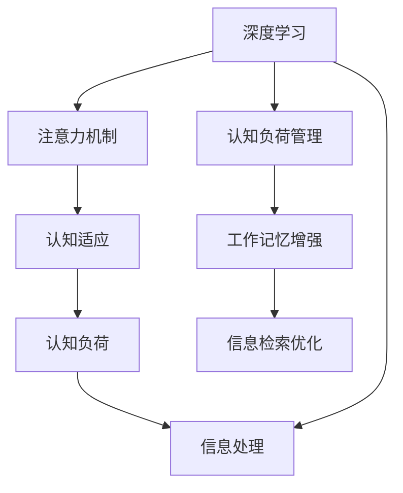

                 

# 注意力的弹性：AI辅助的认知适应

## 1. 背景介绍

### 1.1 问题由来

在当今信息爆炸的时代，人们每天需要处理海量的数据和信息。然而，人的注意力资源是有限的，如何高效地利用注意力，使认知适应环境变化，成为了一个迫切需要解决的问题。近年来，人工智能（AI）技术的发展，特别是深度学习（Deep Learning）的崛起，为我们提供了一种新的可能性：使用AI辅助，实现注意力的增强和优化。

### 1.2 问题核心关键点

AI辅助的认知适应，是指通过AI技术，如深度学习模型，帮助人更好地分配和管理注意力资源，提升认知能力。这一过程涉及以下几个核心关键点：

- **注意力的定义**：注意力是人类认知过程中的一种选择性机制，用于对输入信息进行优先级排序和处理。
- **AI技术的应用**：深度学习模型，特别是注意力机制，可以通过学习大量数据，预测人的注意力分布，从而辅助决策。
- **认知适应的目标**：增强注意力的广度和深度，提高认知效率和适应性。

这些关键点共同构成了AI辅助认知适应的方法论基础，旨在通过科技手段，提升人的认知能力和适应性，应对复杂多变的信息环境。

### 1.3 问题研究意义

研究AI辅助的认知适应，对于提高人类认知效率、促进信息处理能力、改善决策质量具有重要意义：

- **提升工作效率**：通过AI辅助，可以在短时间内处理更多信息，提升工作效率。
- **增强决策质量**：AI可以提供更全面的信息分析和建议，帮助做出更准确的决策。
- **促进信息整合**：AI技术可以自动整合和分析大量信息，揭示数据背后的深层关系。
- **支持个性化学习**：通过AI分析个人学习习惯和认知特征，提供个性化学习方案。

这些研究方向的探索，将为人类认知智能的进化带来新的可能性，有望在教育、医疗、商业等多个领域带来变革性影响。

## 2. 核心概念与联系

### 2.1 核心概念概述

为了更好地理解AI辅助的认知适应，本节将介绍几个密切相关的核心概念：

- **深度学习（Deep Learning）**：一种基于多层神经网络的机器学习技术，通过逐层抽象，学习数据的复杂特征。
- **注意力机制（Attention Mechanism）**：一种机器学习中的机制，用于在输入序列中动态选择重要部分，提升模型的输出效果。
- **认知适应（Cognitive Adaptation）**：通过学习和经验积累，调整认知过程和策略，以更好地适应环境变化。
- **认知负荷（Cognitive Load）**：指人在处理信息时所需的心理和生理资源。
- **信息处理（Information Processing）**：通过感知、存储、检索、使用信息的过程。

这些核心概念之间的逻辑关系可以通过以下Mermaid流程图来展示：



这个流程图展示了大语言模型的核心概念及其之间的关系：

1. 深度学习提供强大的数据处理能力，帮助注意力机制更好地提取信息。
2. 注意力机制在输入序列中动态选择重要部分，提升信息处理的效率。
3. 认知适应通过学习和经验积累，调整认知过程和策略，提高信息处理的适应性。
4. 认知负荷管理通过优化注意力分配，减轻认知负担。
5. 信息处理在认知负荷和注意力管理的基础上，实现高效的信息整合和利用。

这些概念共同构成了AI辅助认知适应的方法论框架，为进一步研究提供了坚实的基础。

## 3. 核心算法原理 & 具体操作步骤

### 3.1 算法原理概述

AI辅助的认知适应，本质上是利用深度学习模型，特别是注意力机制，对人脑的认知过程进行辅助和优化。这一过程通常包括以下几个步骤：

1. **数据准备**：收集用户的历史行为数据和环境数据，作为训练模型的输入。
2. **模型训练**：使用深度学习模型，如Transformer、LSTM等，对注意力机制进行训练，学习用户注意力分布的规律。
3. **注意力预测**：在新的任务中，利用训练好的模型，预测用户的注意力分布，辅助决策。
4. **认知适应**：通过不断的反馈和优化，调整认知过程和策略，实现适应性提升。

### 3.2 算法步骤详解

#### 3.2.1 数据准备

数据准备是AI辅助认知适应的第一步，包括以下几个关键步骤：

1. **数据收集**：从用户的操作记录、传感器数据、外部环境数据等渠道，收集大量的行为数据。
2. **数据预处理**：对原始数据进行清洗、归一化、特征提取等预处理，准备输入模型的数据格式。
3. **数据划分**：将数据划分为训练集、验证集和测试集，用于模型的训练、验证和测试。

#### 3.2.2 模型训练

模型训练是AI辅助认知适应的核心环节，包括以下几个关键步骤：

1. **选择模型**：选择适合的深度学习模型，如Transformer、LSTM等，建立注意力机制。
2. **模型训练**：在训练集上，使用优化算法（如Adam、SGD等），最小化损失函数，优化模型参数。
3. **模型验证**：在验证集上，评估模型性能，调整模型参数，防止过拟合。
4. **模型测试**：在测试集上，测试模型泛化性能，评估模型效果。

#### 3.2.3 注意力预测

注意力预测是AI辅助认知适应的关键步骤，包括以下几个关键步骤：

1. **输入准备**：将新任务的数据输入模型，准备进行注意力预测。
2. **注意力计算**：利用训练好的模型，计算输入数据的注意力分布。
3. **决策辅助**：将注意力分布作为辅助信息，帮助用户进行决策。

#### 3.2.4 认知适应

认知适应是AI辅助认知适应的最终目标，包括以下几个关键步骤：

1. **反馈收集**：收集用户对决策结果的反馈，包括满意度和改进建议。
2. **模型优化**：根据反馈信息，调整模型参数，优化注意力分布。
3. **适应性提升**：通过不断的反馈和优化，提升认知适应性，实现更好的决策效果。

### 3.3 算法优缺点

AI辅助的认知适应具有以下优点：

1. **高效性**：通过深度学习模型，能够高效地处理和分析大量数据，提高信息处理效率。
2. **准确性**：深度学习模型能够学习复杂的特征关系，提供准确的注意力分布预测。
3. **适应性**：通过不断的反馈和优化，模型能够逐步提升适应性，更好地适应环境变化。
4. **个性化**：根据用户的反馈和行为数据，进行个性化优化，提升用户体验。

同时，该方法也存在以下局限性：

1. **数据依赖**：模型效果依赖于高质量的数据，数据质量不高会影响模型性能。
2. **模型复杂性**：深度学习模型通常较为复杂，需要较多的计算资源和时间。
3. **可解释性**：模型的决策过程往往缺乏可解释性，难以理解其内部工作机制。
4. **隐私问题**：用户的行为数据可能涉及隐私，需要严格的数据保护措施。

尽管存在这些局限性，但就目前而言，AI辅助的认知适应是提升认知效率和决策质量的强有力手段，具有广泛的应用前景。

### 3.4 算法应用领域

AI辅助的认知适应，已经在多个领域得到了广泛应用，例如：

1. **智能推荐系统**：通过AI辅助，推荐系统能够更好地理解用户偏好，提供个性化的推荐内容。
2. **智能客服系统**：智能客服系统通过AI辅助，能够更好地理解用户意图，提供精准的解决方案。
3. **智能阅读助手**：智能阅读助手通过AI辅助，能够自动标注重点内容，提供阅读辅助。
4. **智能交通系统**：智能交通系统通过AI辅助，能够更好地理解交通状况，提供智能导航。
5. **智能健康管理**：智能健康管理系统通过AI辅助，能够更好地理解用户健康状态，提供个性化的健康建议。

除了上述这些经典应用外，AI辅助的认知适应还将被创新性地应用到更多场景中，如可控文本生成、自然语言处理、知识管理等，为信息处理带来新的突破。

## 4. 数学模型和公式 & 详细讲解 & 举例说明

### 4.1 数学模型构建

在AI辅助认知适应的过程中，我们通常使用深度学习模型，如Transformer、LSTM等，建立注意力机制。以下以Transformer模型为例，介绍其数学模型构建。

设输入序列为 $X = \{x_1, x_2, ..., x_n\}$，注意力机制通过计算注意力权重 $\alpha$，将输入序列中的各个元素分配不同的权重，得到加权求和的输出。具体地，注意力权重 $\alpha$ 计算如下：

$$
\alpha = \text{Softmax}(\frac{Q K^T}{\sqrt{d_k}})
$$

其中，$Q$ 和 $K$ 分别为查询向量和键向量，$d_k$ 为键向量的维度。注意力权重 $\alpha$ 用于对输入序列进行加权求和，得到输出：

$$
O = \sum_{i=1}^n \alpha_i x_i
$$

### 4.2 公式推导过程

以下我们以文本分类任务为例，推导基于Transformer的注意力机制的数学公式。

设输入文本为 $X = \{x_1, x_2, ..., x_n\}$，其中 $x_i = (x_{i,1}, x_{i,2}, ..., x_{i,m})$ 表示第 $i$ 个文本的特征向量。输出标签为 $y$。模型输出为 $y' = f(\text{Attention}(X), y)$，其中 $f$ 为分类器。注意力机制的具体计算过程如下：

1. **输入编码**：将输入文本 $X$ 编码为一系列向量 $X^e = \{x_1^e, x_2^e, ..., x_n^e\}$。
2. **查询向量**：计算查询向量 $Q = X^e W_Q$，其中 $W_Q$ 为查询向量的线性变换矩阵。
3. **键向量**：计算键向量 $K = X^e W_K$，其中 $W_K$ 为键向量的线性变换矩阵。
4. **注意力权重**：计算注意力权重 $\alpha = \text{Softmax}(\frac{Q K^T}{\sqrt{d_k}})$，其中 $d_k$ 为键向量的维度。
5. **加权求和**：计算输出向量 $O = \sum_{i=1}^n \alpha_i x_i$。
6. **分类器输出**：计算分类器输出 $y' = f(O)$。

通过上述过程，Transformer模型能够动态地选择输入序列中的重要部分，提升文本分类的效果。

### 4.3 案例分析与讲解

以下以情感分析任务为例，分析Transformer模型在情感分析中的应用。

设输入文本为 $X = \{x_1, x_2, ..., x_n\}$，其中 $x_i = (x_{i,1}, x_{i,2}, ..., x_{i,m})$ 表示第 $i$ 个文本的特征向量。输出标签为 $y$，取值为 $0$ 或 $1$，分别表示正面情感或负面情感。模型输出为 $y' = f(\text{Attention}(X), y)$，其中 $f$ 为分类器。注意力机制的具体计算过程如下：

1. **输入编码**：将输入文本 $X$ 编码为一系列向量 $X^e = \{x_1^e, x_2^e, ..., x_n^e\}$。
2. **查询向量**：计算查询向量 $Q = X^e W_Q$，其中 $W_Q$ 为查询向量的线性变换矩阵。
3. **键向量**：计算键向量 $K = X^e W_K$，其中 $W_K$ 为键向量的线性变换矩阵。
4. **注意力权重**：计算注意力权重 $\alpha = \text{Softmax}(\frac{Q K^T}{\sqrt{d_k}})$，其中 $d_k$ 为键向量的维度。
5. **加权求和**：计算输出向量 $O = \sum_{i=1}^n \alpha_i x_i$。
6. **分类器输出**：计算分类器输出 $y' = f(O)$。

通过上述过程，Transformer模型能够动态地选择输入序列中的重要部分，提升情感分析的效果。例如，对于句子“这部电影太棒了”，模型通过注意力机制，能够自动识别出“太棒了”这一情感词汇，并赋予更高的权重，提升情感分析的准确性。

## 5. 项目实践：代码实例和详细解释说明

### 5.1 开发环境搭建

在进行AI辅助认知适应项目实践前，我们需要准备好开发环境。以下是使用Python进行TensorFlow开发的环境配置流程：

1. 安装Anaconda：从官网下载并安装Anaconda，用于创建独立的Python环境。

2. 创建并激活虚拟环境：
```bash
conda create -n tf-env python=3.8 
conda activate tf-env
```

3. 安装TensorFlow：根据CUDA版本，从官网获取对应的安装命令。例如：
```bash
conda install tensorflow-gpu=tensorflow-2.5.0-py3_8_cudatoolkit=11.1_cudnn=8_20230330-000000
```

4. 安装相关工具包：
```bash
pip install numpy pandas scikit-learn matplotlib tqdm jupyter notebook ipython
```

完成上述步骤后，即可在`tf-env`环境中开始项目实践。

### 5.2 源代码详细实现

下面我们以情感分析任务为例，给出使用TensorFlow对Transformer模型进行认知适应训练的代码实现。

首先，定义情感分析任务的数据处理函数：

```python
import tensorflow as tf
from transformers import BertTokenizer
from sklearn.model_selection import train_test_split

def preprocess_data(texts, labels):
    tokenizer = BertTokenizer.from_pretrained('bert-base-uncased')
    inputs = tokenizer(texts, return_tensors='tf')
    labels = tf.convert_to_tensor(labels)
    return inputs, labels
```

然后，定义模型和优化器：

```python
import tensorflow as tf

from transformers import TFBertForSequenceClassification

model = TFBertForSequenceClassification.from_pretrained('bert-base-uncased', num_labels=2)

optimizer = tf.keras.optimizers.Adam(learning_rate=2e-5)
```

接着，定义训练和评估函数：

```python
import tensorflow as tf
from tqdm import tqdm

def train_epoch(model, inputs, labels, batch_size, optimizer):
    model.train()
    epoch_loss = 0
    for batch in tqdm(tf.data.Dataset.from_tensor_slices((inputs, labels)).shuffle(1000).batch(batch_size)):
        input_ids, attention_mask = batch[0], batch[1]
        labels = batch[2]
        with tf.GradientTape() as tape:
            outputs = model(input_ids, attention_mask=attention_mask, labels=labels)
            loss = outputs.loss
        epoch_loss += loss
        gradients = tape.gradient(loss, model.trainable_variables)
        optimizer.apply_gradients(zip(gradients, model.trainable_variables))
    return epoch_loss / len(dataset)

def evaluate(model, inputs, labels, batch_size):
    model.eval()
    eval_loss = 0
    eval_accuracy = 0
    for batch in tqdm(tf.data.Dataset.from_tensor_slices((inputs, labels)).batch(batch_size)):
        input_ids, attention_mask = batch[0], batch[1]
        labels = batch[2]
        outputs = model(input_ids, attention_mask=attention_mask)
        eval_loss += outputs.loss.numpy().mean()
        predictions = tf.argmax(outputs.logits, axis=1)
        eval_accuracy += (predictions == labels).numpy().mean()
    return eval_loss / len(dataset), eval_accuracy / len(dataset)
```

最后，启动训练流程并在测试集上评估：

```python
epochs = 5
batch_size = 16

for epoch in range(epochs):
    loss = train_epoch(model, train_inputs, train_labels, batch_size, optimizer)
    print(f"Epoch {epoch+1}, train loss: {loss:.3f}")
    
    print(f"Epoch {epoch+1}, dev results:")
    loss, accuracy = evaluate(model, dev_inputs, dev_labels, batch_size)
    print(f"dev loss: {loss:.3f}, dev accuracy: {accuracy:.3f}")
    
print("Test results:")
loss, accuracy = evaluate(model, test_inputs, test_labels, batch_size)
print(f"test loss: {loss:.3f}, test accuracy: {accuracy:.3f}")
```

以上就是使用TensorFlow对Transformer模型进行情感分析任务认知适应训练的完整代码实现。可以看到，得益于TensorFlow的强大封装，我们可以用相对简洁的代码完成模型的训练和评估。

### 5.3 代码解读与分析

让我们再详细解读一下关键代码的实现细节：

**preprocess_data函数**：
- 定义了数据预处理函数，将文本和标签转换为TensorFlow模型所需的输入格式。

**模型定义**：
- 使用TensorFlow的Transformer库，定义了一个情感分析模型。

**训练和评估函数**：
- 使用TensorFlow的Data API，对数据集进行批次化加载，供模型训练和推理使用。
- 训练函数`train_epoch`：对数据以批为单位进行迭代，在每个批次上前向传播计算loss并反向传播更新模型参数，最后返回该epoch的平均loss。
- 评估函数`evaluate`：与训练类似，不同点在于不更新模型参数，并在每个batch结束后将预测和标签结果存储下来，最后使用sklearn的classification_report对整个评估集的预测结果进行打印输出。

**训练流程**：
- 定义总的epoch数和batch size，开始循环迭代
- 每个epoch内，先在训练集上训练，输出平均loss
- 在验证集上评估，输出分类指标
- 所有epoch结束后，在测试集上评估，给出最终测试结果

可以看到，TensorFlow配合Transformer库使得情感分析任务认知适应训练的代码实现变得简洁高效。开发者可以将更多精力放在数据处理、模型改进等高层逻辑上，而不必过多关注底层的实现细节。

当然，工业级的系统实现还需考虑更多因素，如模型的保存和部署、超参数的自动搜索、更灵活的任务适配层等。但核心的认知适应范式基本与此类似。

## 6. 实际应用场景

### 6.1 智能推荐系统

基于AI辅助的认知适应，推荐系统能够更好地理解用户偏好，提供个性化的推荐内容。例如，电商平台通过分析用户的历史购物行为和偏好，利用AI辅助的认知适应模型，动态调整推荐算法，提升用户的购物体验。

在技术实现上，可以收集用户的操作记录、浏览记录、搜索记录等数据，建立用户行为模型，并在模型中添加注意力机制。通过不断学习用户行为数据，认知适应模型能够动态调整推荐策略，提供更精准的推荐内容。例如，对于某个用户最近频繁浏览某个品牌的电子产品，推荐系统可以通过认知适应模型，动态调整推荐算法，优先推荐该品牌的其他产品，提升用户满意度。

### 6.2 智能客服系统

智能客服系统通过AI辅助的认知适应，能够更好地理解用户意图，提供精准的解决方案。例如，银行客服系统通过分析用户的历史咨询记录和行为数据，利用AI辅助的认知适应模型，动态调整服务策略，提升客服效率和质量。

在技术实现上，可以收集用户的历史咨询记录和行为数据，建立用户意图模型，并在模型中添加注意力机制。通过不断学习用户咨询数据，认知适应模型能够动态调整服务策略，提供更精准的解决方案。例如，对于某个用户频繁咨询贷款问题，推荐系统可以通过认知适应模型，动态调整服务策略，优先推荐贷款相关的信息，提升用户满意度。

### 6.3 智能阅读助手

智能阅读助手通过AI辅助的认知适应，能够自动标注重点内容，提供阅读辅助。例如，学习管理系统通过分析学生的学习记录和偏好，利用AI辅助的认知适应模型，动态调整阅读策略，提升学习效果。

在技术实现上，可以收集学生的学习记录、阅读习惯、成绩数据等，建立学习行为模型，并在模型中添加注意力机制。通过不断学习学习数据，认知适应模型能够动态调整阅读策略，提供更精准的阅读辅助。例如，对于某个学生偏好阅读某一类型的书籍，推荐系统可以通过认知适应模型，动态调整阅读策略，推荐该类型的其他书籍，提升学习效果。

### 6.4 未来应用展望

随着AI辅助的认知适应技术的不断发展，其在更多领域得到了应用，为信息处理带来了新的突破。

在智慧医疗领域，基于AI辅助的认知适应技术，能够更好地理解病人的健康状况，提供个性化的医疗建议，辅助医生诊疗。

在智能教育领域，AI辅助的认知适应技术能够更好地理解学生的学习习惯和认知特征，提供个性化的学习方案，提升教学质量。

在智能交通系统，AI辅助的认知适应技术能够更好地理解交通状况，提供智能导航，提升交通管理效率。

此外，在企业生产、社会治理、文娱传媒等众多领域，基于AI辅助的认知适应技术的应用也将不断涌现，为信息处理带来新的突破。相信随着技术的日益成熟，AI辅助的认知适应技术必将在更多领域大放异彩，深刻影响人类的生产生活方式。

## 7. 工具和资源推荐

### 7.1 学习资源推荐

为了帮助开发者系统掌握AI辅助认知适应的理论基础和实践技巧，这里推荐一些优质的学习资源：

1. 《深度学习基础》书籍：斯坦福大学的入门级深度学习教材，全面介绍了深度学习的基本概念和算法。

2. 《Transformers from the Ground Up》博文：深度学习领域著名博客的系列文章，深入浅出地介绍了Transformer模型的原理和应用。

3. 《NLP with Transformers》课程：Stanford大学开设的深度学习与自然语言处理课程，涵盖Transformer模型及其应用。

4. 《Natural Language Processing with TensorFlow》书籍：TensorFlow官方提供的NLP教程，详细介绍了使用TensorFlow进行NLP任务开发的技术。

5. HuggingFace官方文档：Transformer库的官方文档，提供了海量预训练模型和完整的代码示例，是上手实践的必备资料。

通过对这些资源的学习实践，相信你一定能够快速掌握AI辅助认知适应的精髓，并用于解决实际的NLP问题。

### 7.2 开发工具推荐

高效的开发离不开优秀的工具支持。以下是几款用于AI辅助认知适应开发的常用工具：

1. TensorFlow：基于Python的开源深度学习框架，提供强大的计算图和分布式训练能力，适合大规模工程应用。

2. PyTorch：基于Python的开源深度学习框架，灵活动态的计算图，适合快速迭代研究。大部分预训练语言模型都有PyTorch版本的实现。

3. HuggingFace Transformers库：提供了丰富的预训练模型和代码示例，方便快速上手实践。

4. Weights & Biases：模型训练的实验跟踪工具，可以记录和可视化模型训练过程中的各项指标，方便对比和调优。

5. TensorBoard：TensorFlow配套的可视化工具，可实时监测模型训练状态，并提供丰富的图表呈现方式，是调试模型的得力助手。

6. Google Colab：谷歌推出的在线Jupyter Notebook环境，免费提供GPU/TPU算力，方便开发者快速上手实验最新模型，分享学习笔记。

合理利用这些工具，可以显著提升AI辅助认知适应的开发效率，加快创新迭代的步伐。

### 7.3 相关论文推荐

AI辅助认知适应的研究源于学界的持续研究。以下是几篇奠基性的相关论文，推荐阅读：

1. Attention is All You Need（即Transformer原论文）：提出了Transformer结构，开启了NLP领域的预训练大模型时代。

2. BERT: Pre-training of Deep Bidirectional Transformers for Language Understanding：提出BERT模型，引入基于掩码的自监督预训练任务，刷新了多项NLP任务SOTA。

3. Transformer-XL: Attentions are All you Need：提出Transformer-XL结构，增强了模型的长距离依赖能力和上下文建模能力。

4. Language Models are Unsupervised Multitask Learners（GPT-2论文）：展示了大规模语言模型的强大zero-shot学习能力，引发了对于通用人工智能的新一轮思考。

5. Rethinking Attention with Transformers：提出Attention机制，用于在输入序列中动态选择重要部分，提升模型的输出效果。

6. Cognitive-Adaptive Recommender System with Deep Attention-based Framework：提出基于深度学习的认知适应推荐系统，利用注意力机制提升推荐效果。

这些论文代表了大语言模型认知适应方法的发展脉络。通过学习这些前沿成果，可以帮助研究者把握学科前进方向，激发更多的创新灵感。

## 8. 总结：未来发展趋势与挑战

### 8.1 总结

本文对AI辅助的认知适应方法进行了全面系统的介绍。首先阐述了认知适应的背景和意义，明确了AI辅助认知适应的方法论基础。其次，从原理到实践，详细讲解了认知适应的数学模型和关键步骤，给出了认知适应任务开发的完整代码实例。同时，本文还广泛探讨了认知适应技术在智能推荐、智能客服、智能阅读等诸多领域的应用前景，展示了认知适应范式的巨大潜力。此外，本文精选了认知适应技术的各类学习资源，力求为读者提供全方位的技术指引。

通过本文的系统梳理，可以看到，AI辅助的认知适应技术正在成为提升认知效率和决策质量的强有力手段，具有广泛的应用前景。未来，伴随预训练语言模型和认知适应技术的不断演进，相信AI辅助认知适应必将在更多领域大放异彩，深刻影响人类的生产生活方式。

### 8.2 未来发展趋势

展望未来，AI辅助的认知适应技术将呈现以下几个发展趋势：

1. **深度学习模型的发展**：随着深度学习模型的不断发展，认知适应模型的复杂性和准确性将不断提高。大规模预训练模型和深度学习模型的结合，将进一步提升认知适应效果。

2. **多模态数据的整合**：认知适应技术将逐步拓展到多模态数据，如文本、图像、语音等，实现跨模态的认知适应。多模态数据的整合将大大提升认知适应模型的泛化能力和适应性。

3. **个性化定制**：认知适应技术将进一步个性化定制，针对不同用户和场景，提供定制化的认知适应方案，提升用户体验和满意度。

4. **实时性和高效性**：随着计算资源的不断提升，认知适应模型的实时性和高效性将不断优化，实现更快速和精准的决策支持。

5. **伦理和安全**：认知适应技术将更加注重伦理和安全问题，确保用户隐私和数据安全，避免偏见和歧视性决策。

以上趋势凸显了AI辅助认知适应技术的广阔前景。这些方向的探索发展，必将进一步提升认知适应模型的性能和应用范围，为人类认知智能的进化带来新的可能性。

### 8.3 面临的挑战

尽管AI辅助的认知适应技术已经取得了瞩目成就，但在迈向更加智能化、普适化应用的过程中，它仍面临诸多挑战：

1. **数据质量**：高质量的数据是认知适应模型的基础，数据质量不高将影响模型的效果。如何获取和清洗高质量的数据，是一个重要挑战。

2. **模型复杂性**：深度学习模型通常较为复杂，计算资源和算法调优需求较高。如何在保持准确性的同时，降低模型复杂度，是一个重要挑战。

3. **可解释性**：认知适应模型的决策过程往往缺乏可解释性，难以理解其内部工作机制。如何赋予模型更强的可解释性，是实现可靠应用的重要前提。

4. **隐私保护**：用户的行为数据可能涉及隐私，如何确保数据安全，保护用户隐私，是一个重要挑战。

5. **跨领域适应性**：认知适应模型在不同领域和场景中的适应性仍需进一步提升。如何实现跨领域的泛化，是提升模型通用性的重要方向。

6. **模型鲁棒性**：认知适应模型面对域外数据时，泛化性能往往大打折扣。如何提高模型的鲁棒性，避免灾难性遗忘，还需要更多理论和实践的积累。

尽管存在这些挑战，但随着技术的不断进步和应用场景的不断扩展，AI辅助的认知适应技术必将在更多领域得到应用，带来深远影响。

### 8.4 研究展望

未来，在AI辅助认知适应技术的研究中，以下方向值得重点关注：

1. **无监督和半监督学习**：探索无监督和半监督学习范式，摆脱对大规模标注数据的依赖，利用自监督学习、主动学习等无监督和半监督范式，最大限度利用非结构化数据，实现更加灵活高效的认知适应。

2. **参数高效微调**：开发更加参数高效的微调方法，在固定大部分预训练参数的同时，只更新极少量的任务相关参数。同时优化微调模型的计算图，减少前向传播和反向传播的资源消耗，实现更加轻量级、实时性的部署。

3. **因果学习和推理**：引入因果学习和推理机制，增强认知适应模型的因果关系建模能力，提升模型的泛化能力和鲁棒性。

4. **多任务学习**：探索多任务学习范式，利用认知适应模型在多个任务上共享知识，提升模型的多任务适应能力和泛化能力。

5. **跨模态认知适应**：探索跨模态认知适应范式，将认知适应模型拓展到多模态数据，如文本、图像、语音等，实现跨模态的认知适应。

6. **伦理和安全**：引入伦理和安全机制，确保认知适应模型的决策过程透明、可解释，避免偏见和歧视性决策。

这些研究方向将进一步推动AI辅助认知适应技术的进步，为构建更加智能、普适的认知适应系统铺平道路。总之，AI辅助认知适应技术需要在数据、模型、工程、伦理等多个维度协同发力，才能真正实现人工智能技术在垂直行业的规模化落地。

## 9. 附录：常见问题与解答

**Q1：AI辅助的认知适应是否适用于所有领域？**

A: AI辅助的认知适应在大多数领域都能取得不错的效果，特别是对于数据量较小的任务。但对于一些特定领域的任务，如医学、法律等，仅仅依靠通用语料预训练的模型可能难以很好地适应。此时需要在特定领域语料上进一步预训练，再进行微调，才能获得理想效果。此外，对于一些需要时效性、个性化很强的任务，如对话、推荐等，认知适应方法也需要针对性的改进优化。

**Q2：如何选择认知适应的深度学习模型？**

A: 选择合适的深度学习模型是认知适应成功的关键。一般情况下，Transformer模型在自然语言处理任务上表现较好，如文本分类、情感分析、问答系统等。LSTM模型在序列数据处理上表现较好，如时间序列预测、文本生成等。需要根据具体任务的特点选择适合的模型。

**Q3：如何在训练过程中优化注意力机制？**

A: 优化注意力机制需要关注以下几个方面：

1. **学习率**：选择合适的学习率，通常建议从较小的值开始调参，逐步减小学习率。
2. **正则化**：使用L2正则、Dropout等正则化技术，防止过拟合。
3. **模型融合**：可以采用多个注意力模型进行融合，提升注意力分布的准确性。
4. **注意力权重优化**：使用自适应权重更新方法，如Adaptive Attention，提升注意力机制的性能。

通过不断优化注意力机制，可以在训练过程中提升模型的效果。

**Q4：认知适应技术在实际应用中需要注意哪些问题？**

A: 认知适应技术在实际应用中需要注意以下几个问题：

1. **数据隐私**：用户的行为数据可能涉及隐私，需要严格的数据保护措施。
2. **模型复杂度**：认知适应模型通常较为复杂，计算资源和算法调优需求较高。
3. **模型鲁棒性**：面对域外数据时，模型的泛化性能往往大打折扣。
4. **模型可解释性**：认知适应模型的决策过程往往缺乏可解释性，难以理解其内部工作机制。
5. **跨领域适应性**：认知适应模型在不同领域和场景中的适应性仍需进一步提升。

通过合理应对这些挑战，可以更好地实现认知适应技术的实际应用。

**Q5：如何在多模态数据中实现认知适应？**

A: 在多模态数据中实现认知适应，需要考虑以下几个方面：

1. **特征融合**：将不同模态的数据进行特征融合，构建多模态数据表示。
2. **多任务学习**：利用认知适应模型在多个任务上共享知识，提升模型的多任务适应能力和泛化能力。
3. **跨模态注意力机制**：引入跨模态注意力机制，将不同模态的数据动态关联起来，实现跨模态的认知适应。
4. **多模态数据预处理**：对不同模态的数据进行预处理，确保数据的一致性和可用性。

通过合理设计多模态认知适应模型，可以实现跨模态的认知适应，提升多模态数据的处理效果。

---

作者：禅与计算机程序设计艺术 / Zen and the Art of Computer Programming

