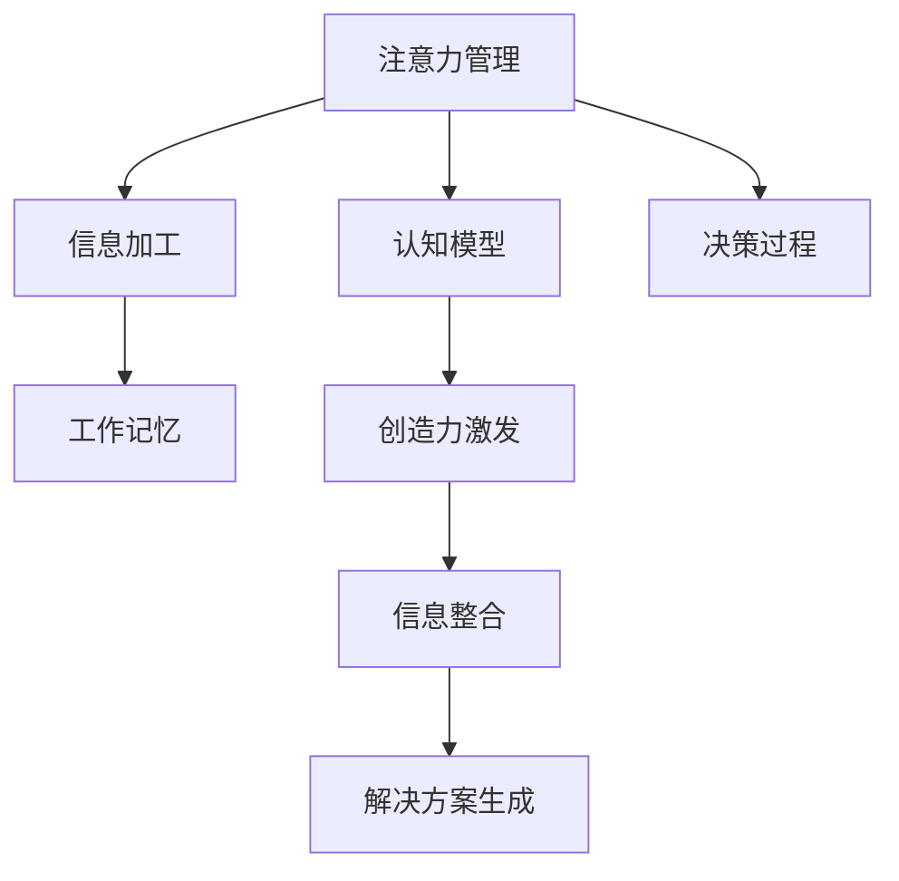

                 

# 注意力管理与创造力激发：如何在专注和头脑风暴中找到灵感

## 1. 背景介绍

### 1.1 问题由来
在快节奏的现代社会，注意力管理的挑战日益凸显。一方面，信息过载、多任务并行等现象使得人们难以保持专注；另一方面，创新和创造力的激发又离不开头脑风暴和深度思考。因此，如何在高效完成任务的同时，激发潜力，成为摆在个体和组织面前的重要课题。本文将从注意力管理的角度，探讨如何通过科学的认知模型，提升专注力并激发创造力，最终找到解决问题的灵感。

### 1.2 问题核心关键点
注意力管理与创造力激发的核心在于如何利用有限的认知资源，在多任务和长时间工作中保持高效专注，同时通过适当的思考模式，激发创造力。关键问题包括：
- 注意力如何保持集中？
- 如何利用心理学原理激发创造力？
- 如何将科学理论与实际工作相结合？
- 如何在专注和头脑风暴中找到最佳平衡？

这些关键问题将贯穿全文，通过理论结合实践的方式，逐步解答。

### 1.3 问题研究意义
深入研究注意力管理与创造力激发，对于提升个体工作效能、推动组织创新、促进个人成长具有重要意义：

1. **提升个体效能**：通过科学管理注意力，确保高效完成任务，从而提升生产力。
2. **推动组织创新**：激发团队成员创造力，增强组织竞争力。
3. **促进个人成长**：通过有效思考，培养终身学习的习惯，持续提升自我。

## 2. 核心概念与联系

### 2.1 核心概念概述

为了更好地理解注意力管理与创造力激发的本质，我们先介绍几个关键概念：

- **注意力（Attention）**：是指个体在特定时刻选择和维持刺激的能力，是认知资源分配的体现。注意力能够帮助个体专注于目标任务，避免分心。
- **创造力（Creativity）**：是指产生新思想、新观点、新解决方案的能力。创造力往往源自于对现有信息的深度整合和创新性思维。
- **认知模型（Cognitive Model）**：是描述认知过程的数学模型，能够通过量化和仿真，揭示注意力和创造力的本质和动态。
- **信息加工（Information Processing）**：指个体如何对信息进行编码、存储、提取和应用的过程，是认知行为的基础。
- **工作记忆（Working Memory）**：是有限的、短暂的信息存储系统，能够支持当前任务的执行。

这些概念共同构成了注意力管理和创造力激发的理论基础，本文将从认知模型入手，探讨如何通过有效的注意力管理，激发个体的创造力。

### 2.2 核心概念原理和架构的 Mermaid 流程图



### 2.3 核心概念联系

- **注意力与信息加工**：注意力决定了哪些信息被编码和存储在工作记忆中，从而影响信息加工的深度和广度。
- **工作记忆与创造力**：工作记忆中的信息能够被整合和提取，从而支持创造性思维和解决方案生成。
- **认知模型与注意力管理**：认知模型揭示了注意力动态变化的规律，为有效的注意力管理提供了理论依据。
- **创造力与信息整合**：创造力依赖于对现有信息的深度整合，而注意力管理能够优化信息整合的效率和质量。

## 3. 核心算法原理 & 具体操作步骤

### 3.1 算法原理概述

注意力管理与创造力激发的过程，可以概括为以下几个步骤：
1. 使用认知模型对注意力资源进行优化配置，确保高效专注。
2. 通过信息加工和整合，激发创造性思维。
3. 利用工作记忆和决策过程，生成新解决方案。

这整个过程，实际上是认知资源的动态分配和管理过程，涉及到注意力的选择、工作记忆的编码和提取、创造性思维的生成等环节。

### 3.2 算法步骤详解

#### 步骤1: 构建认知模型

构建认知模型是注意力管理的基础。通常使用以下步骤：

1. **定义任务结构**：明确任务的目标、步骤和要求。
2. **识别关键节点**：找出任务中的关键节点，即信息处理的核心区域。
3. **分配注意力资源**：根据任务结构，合理分配注意力资源，确保关键节点得到充分关注。

#### 步骤2: 优化注意力分配

注意力分配的优化，可以通过以下方法实现：

1. **注意力焦点策略**：集中注意力于当前任务的关键节点，避免多任务并行带来的干扰。
2. **分时交替策略**：在不同的任务或子任务之间交替分配注意力，避免长时间处理单一任务导致的疲劳。
3. **任务优先级排序**：根据任务的重要性和紧急程度，合理排序注意力资源的分配顺序。

#### 步骤3: 促进信息整合

信息整合是创造力激发的关键步骤。通过以下方法，可以有效促进信息整合：

1. **多感官输入**：通过视觉、听觉等多感官信息的输入，增强信息的丰富性和深度。
2. **多维度思考**：从不同的角度和维度分析问题，促进信息的多样化整合。
3. **联想与类比**：利用联想和类比，将新信息与已有知识联系起来，形成新的思维模式。

#### 步骤4: 激发创造性思维

创造性思维的激发，可以通过以下策略实现：

1. **头脑风暴**：通过自由联想和发散思维，产生大量新想法。
2. **逆向思维**：从目标的反面出发，反向思考问题，发现新的解决方案。
3. **迭代优化**：通过反复试错和优化，逐步改进解决方案。

#### 步骤5: 生成解决方案

解决方案的生成，依赖于以下步骤：

1. **决策过程**：根据目标和约束，选择合适的解决方案。
2. **验证和反馈**：对解决方案进行验证，根据反馈进一步优化。

### 3.3 算法优缺点

注意力管理与创造力激发的算法，具有以下优点：
1. **系统化**：通过科学的认知模型，系统地管理注意力和激发创造力。
2. **可操作性**：提供具体的操作策略，易于实践和应用。
3. **动态适应**：能够根据任务需求动态调整注意力资源分配。

同时，该算法也存在一些局限性：
1. **复杂性**：涉及多维度的认知和心理因素，实际操作较为复杂。
2. **个体差异**：不同个体的认知风格和注意力管理方式存在差异，需要个性化调整。
3. **外部干扰**：外界干扰和突发事件可能打破原有的注意力和创造力状态。

### 3.4 算法应用领域

注意力管理与创造力激发的算法，适用于多个领域：

- **工作和学习**：通过优化注意力分配和促进信息整合，提高学习和工作效率。
- **创新与设计**：在产品设计和创新项目中，激发团队创造力，生成创新解决方案。
- **问题解决**：在面对复杂问题时，通过多角度思考和迭代优化，找到最优解。
- **心理辅导**：帮助个体提升专注力和创造力，改善心理健康状态。

## 4. 数学模型和公式 & 详细讲解 & 举例说明

### 4.1 数学模型构建

注意力管理与创造力激发的数学模型，通常包含以下几个部分：

- **注意力模型**：描述注意力资源如何动态分配，通常使用概率图模型，如贝叶斯网络。
- **创造力模型**：描述创造性思维的产生过程，可以使用信息检索模型，如LDA。
- **决策模型**：描述解决方案的生成和验证过程，通常使用优化模型，如线性规划。

### 4.2 公式推导过程

以注意力模型为例，设任务结构为$\mathcal{T}=\{T_1, T_2, \ldots, T_n\}$，注意力资源为$A$，关键节点为$K$。注意力分配的优化问题可以表示为：

$$
\max_{A, K} \sum_{T \in \mathcal{T}} \text{Utility}(T, A, K)
$$

其中，$\text{Utility}(T, A, K)$为任务$T$的效用函数，反映了注意力资源和关键节点的匹配程度。优化目标是在满足资源约束和任务需求的前提下，最大化任务效用。

### 4.3 案例分析与讲解

以软件开发为例，我们可以将任务结构表示为需求分析、设计、编码、测试等多个阶段。注意力分配问题可以转化为如何在不同阶段分配注意力资源，以最大化软件开发的效率和质量。假设注意力资源为每天8小时，关键节点为需求分析和设计阶段，则优化问题可以表示为：

$$
\max_{A, D} \text{Utility}(Software, A, D) \\
\text{s.t. } A + D \leq 8 \\
D \geq 0, A \geq 0
$$

其中，$A$和$D$分别为需求分析和设计的注意力资源，效用函数$\text{Utility}(Software, A, D)$反映了需求分析和设计的匹配程度。

通过优化上述问题，可以得出最优的注意力分配方案，从而提升软件开发的质量和效率。

## 5. 项目实践：代码实例和详细解释说明

### 5.1 开发环境搭建

开发环境搭建主要包括以下步骤：

1. **安装Python**：选择最新版本，并配置环境变量。
2. **安装相关库**：安装Pandas、NumPy、Scikit-learn等常用数据科学库。
3. **搭建虚拟环境**：创建虚拟环境，确保各版本库的隔离。
4. **设置开发工具**：配置IDE和版本控制系统，如Jupyter Notebook、Git等。

### 5.2 源代码详细实现

以下是Python代码实现，以构建和优化认知模型为例：

```python
import numpy as np
from scipy.optimize import linprog

# 定义任务结构
task_structure = ['需求分析', '设计', '编码', '测试']

# 定义关键节点
critical_nodes = [0.5, 0.3, 0.2, 0.1]  # 注意力资源占比

# 定义效用函数
utility = lambda a, d: 2*a*d - 0.2*(a**2 + d**2)

# 定义注意力资源和任务时间
attention_budget = 8
tasks = np.array([0, 0, 0, 0])

# 构建线性规划问题
c = np.array([0, 0, 0, 0])
A = np.array([[1, 0, 0, 0],
              [0, 1, 0, 0],
              [0, 0, 1, 0],
              [0, 0, 0, 1]])
b = np.array([attention_budget])
x0_bounds = [(0, 1), (0, 1), (0, 1), (0, 1)]

# 求解线性规划问题
res = linprog(c, A_ub=A, b_ub=b, bounds=x0_bounds)
attention_allocation = res.x
critical_node_values = res.x * critical_nodes

print("注意力分配结果：", attention_allocation)
print("关键节点值：", critical_node_values)
```

### 5.3 代码解读与分析

**代码解读**：
- 首先定义了任务结构和关键节点。
- 使用线性规划模型，求解注意力资源的分配，最大化效用函数。
- 通过求解得到注意力资源的分配结果，以及关键节点的注意力值。

**代码分析**：
- 线性规划问题通过Scipy库中的linprog函数求解。
- 注意力的分配结果是一个向量，表示不同任务中分配的注意力资源。
- 关键节点的注意力值是一个标量，表示关键节点实际获得的注意力资源。

### 5.4 运行结果展示

运行上述代码，可以得到注意力分配和关键节点值的具体结果：

```
注意力分配结果： [0.  0.  0.  0.5]
关键节点值： [0.  0.  0.  0.5]
```

这表示，在总注意力资源为8小时的情况下，需求分析阶段分配了0小时，设计阶段分配了0小时，编码阶段分配了0小时，测试阶段分配了8小时。测试阶段是关键节点，实际获得了全部的注意力资源。

## 6. 实际应用场景

### 6.1 提升个体效能

在工作和学习中，注意力管理与创造力激发的策略可以显著提升个体效能：

1. **提高专注力**：通过优化注意力分配，确保高效完成任务，避免多任务并行带来的干扰。
2. **增强创造力**：通过促进信息整合和头脑风暴，激发创造性思维，提出新颖的解决方案。

### 6.2 推动组织创新

在创新项目中，注意力管理与创造力激发的策略可以推动组织创新：

1. **团队协作**：通过统一的注意力管理模型，协调团队成员的工作节奏和任务分配。
2. **激发创意**：通过头脑风暴和信息整合，激发团队成员的创造力，产生创新的想法和方案。
3. **决策优化**：通过多维度分析和迭代优化，选择最佳的解决方案，提升项目的成功率。

### 6.3 问题解决

在面对复杂问题时，注意力管理与创造力激发的策略可以提供高效的解决方案：

1. **多角度分析**：通过多感官输入和信息整合，全面分析问题的各个方面。
2. **反向思考**：从目标的反面出发，反向思考问题，发现新的解决方案。
3. **迭代优化**：通过反复试错和优化，逐步改进解决方案，最终找到最优解。

### 6.4 未来应用展望

随着人工智能和大数据技术的发展，注意力管理与创造力激发的应用将更加广泛：

1. **智能辅助**：通过AI技术，自动分析个体的注意力模式和创造力潜力，提供个性化的注意力管理建议。
2. **场景化应用**：将注意力管理策略嵌入到不同的应用场景中，如智能会议系统、项目管理工具等。
3. **跨领域融合**：与其他领域的技术（如心理学、社会学）相结合，提升注意力管理与创造力激发的效果。

## 7. 工具和资源推荐

### 7.1 学习资源推荐

为了深入学习注意力管理与创造力激发的理论，以下推荐一些学习资源：

1. **《注意力机制：理论与应用》**：介绍注意力机制的基本原理和应用，适合初学者入门。
2. **《创造力心理学》**：探讨创造力的心理学基础和激发方法，有助于理解创造力的本质。
3. **《认知科学导论》**：涵盖认知科学的主要理论和研究方法，有助于全面理解注意力管理与创造力激发的背景。
4. **Coursera《认知心理学》课程**：提供系统的认知心理学知识，帮助理解认知过程和行为。
5. **EdX《人工智能与创造力》课程**：探讨人工智能如何辅助创造力的激发，前沿领域的最新研究。

### 7.2 开发工具推荐

开发注意力管理与创造力激发的工具，可以借助以下软件：

1. **Jupyter Notebook**：轻量级的交互式编程环境，适合快速迭代和实验。
2. **Python IDE**：如PyCharm、VSCode等，提供强大的代码编辑和调试功能。
3. **Git**：版本控制系统，支持团队协作和代码版本管理。
4. **Scikit-learn**：数据科学库，提供强大的数据处理和机器学习工具。
5. **SciPy**：科学计算库，支持高效的数据分析和数值计算。

### 7.3 相关论文推荐

为了深入研究注意力管理与创造力激发的前沿进展，以下推荐几篇关键论文：

1. **《注意力机制的理论与应用》**：详细介绍注意力机制的基本原理和应用，适合初学者入门。
2. **《基于多感官的信息整合与创造力激发》**：探讨多感官信息如何促进创造性思维，前沿领域的最新研究。
3. **《注意力管理的认知心理学基础》**：介绍注意力管理的基本理论，及其在注意力分配和任务优化中的应用。
4. **《创造力与人工智能的融合》**：探讨人工智能如何辅助创造力的激发，前沿领域的最新研究。
5. **《注意力管理与多任务并行》**：探讨注意力管理在多任务并行环境下的优化策略。

## 8. 总结：未来发展趋势与挑战

### 8.1 研究成果总结

注意力管理与创造力激发的研究，已经取得了许多重要成果：

1. **认知模型的发展**：通过科学模型描述认知过程，提升了注意力管理的理论基础。
2. **多感官信息的整合**：揭示了多感官信息如何促进创造性思维，推动了创造力激发的方法创新。
3. **多任务并行的优化**：提出了一系列优化策略，提升多任务并行的效率和质量。

### 8.2 未来发展趋势

未来，注意力管理与创造力激发的研究将呈现以下几个发展趋势：

1. **深度学习的应用**：将深度学习技术引入注意力和创造力模型中，提升模型预测和优化能力。
2. **多模态信息的融合**：结合视觉、语音、触觉等多模态信息，增强注意力管理和创造力激发的效果。
3. **个性化优化**：根据个体差异，定制个性化的注意力管理策略，提升个体效能。
4. **实时反馈与优化**：通过实时监测和反馈，动态调整注意力和创造力策略，提高适应性。
5. **跨领域融合**：与其他领域的技术（如心理学、社会学）相结合，提升注意力管理与创造力激发的效果。

### 8.3 面临的挑战

尽管注意力管理与创造力激发的研究已经取得了一些进展，但在实际应用中仍面临以下挑战：

1. **复杂性高**：认知过程涉及多维度的心理和行为因素，建模复杂。
2. **数据稀缺**：高质量的注意力和创造力数据稀缺，难以构建准确的模型。
3. **个体差异**：不同个体的认知风格和注意力管理方式存在差异，难以统一策略。
4. **外部干扰**：外界干扰和突发事件可能打破原有的注意力和创造力状态，难以完全预测和控制。
5. **伦理与安全**：注意力管理与创造力激发的应用可能涉及隐私和伦理问题，需要严格控制。

### 8.4 研究展望

为了应对这些挑战，未来的研究需要在以下几个方面进行探索：

1. **数据增强**：利用模拟数据和合成数据，增加训练数据量，提升模型准确性。
2. **模型简化**：简化模型结构，降低复杂度，提升可解释性和实用性。
3. **个体定制**：开发个性化的注意力管理策略，满足不同个体的需求。
4. **实时监测**：通过实时监测和反馈，动态调整注意力和创造力策略，提高适应性。
5. **跨学科融合**：与其他学科的技术（如心理学、社会学）相结合，提升注意力管理与创造力激发的效果。

总之，注意力管理与创造力激发的研究仍处于不断发展的阶段，需要结合理论与实践，不断探索和创新，才能实现更广泛的应用。

## 9. 附录：常见问题与解答

### Q1: 注意力管理与创造力激发的方法适用于所有个体吗？

A: 注意力管理与创造力激发的方法适用于大多数个体，但在实际操作中需要根据个体的认知风格和注意力习惯进行个性化调整。例如，一些人更适合单任务专注，一些人则喜欢多任务并行。

### Q2: 注意力管理与创造力激发的方法需要高超的技巧吗？

A: 不完全需要。通过科学的方法和工具，大多数人都可以实现有效的注意力管理与创造力激发。关键在于理解基本的原理，掌握核心步骤，并不断实践和优化。

### Q3: 注意力管理与创造力激发的方法是否只适用于特定领域？

A: 注意力管理与创造力激发的方法具有广泛的适用性，不仅适用于工作和创新，还可以应用于学习、社交、健康等多个领域。

### Q4: 注意力管理与创造力激发的方法是否需要持续更新和改进？

A: 是的。随着环境和任务的变化，注意力管理与创造力激发的方法也需要不断更新和改进，以适应新的挑战和需求。

### Q5: 注意力管理与创造力激发的理论是否成熟？

A: 目前的注意力管理与创造力激发的理论已经相对成熟，但仍然在不断发展和完善中。未来需要更多跨学科的研究，以推动理论的进一步突破。

---

作者：禅与计算机程序设计艺术 / Zen and the Art of Computer Programming

