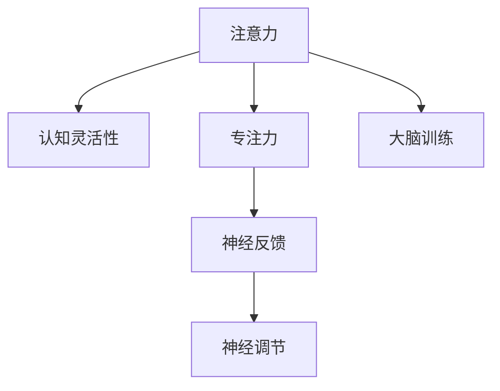

                 

# 注意力管理与大脑训练实践：增强认知灵活性和专注力

> 关键词：注意力管理,大脑训练,认知灵活性,专注力,神经反馈,神经调节,神经科学,心理训练,人工智能

## 1. 背景介绍

### 1.1 问题由来
在现代信息爆炸的时代，我们每天都在接收大量信息，这对我们的注意力系统提出了极高的要求。注意力是认知功能中最为基本和核心的能力之一，它控制着我们的感官接收信息，同时决定我们如何分配认知资源。然而，持续的工作压力、电子设备的过度使用、不健康的生活方式等，使得我们的注意力系统逐渐疲惫，甚至出现退化。

### 1.2 问题核心关键点
当前，注意力缺陷症(ADHD)、多动症等注意力问题已经引起了广泛关注，但大多数普通人在日常生活、学习和工作中同样面临注意力分散的问题。这些问题不仅影响工作效率，还可能引发情绪问题、焦虑和抑郁。如何科学管理注意力，提升注意力系统，成为了一个重要的研究课题。

### 1.3 问题研究意义
研究如何管理注意力和训练大脑，不仅对于神经科学和心理学的理论研究具有重要价值，对于提升个体和组织的工作效能、增强心理韧性也具有深远的实际意义。科学的注意力管理和大脑训练方法，可以显著提升个体的认知灵活性、专注力和决策能力，对于促进个人发展和实现职业目标具有重要推动作用。

## 2. 核心概念与联系

### 2.1 核心概念概述

为更好地理解注意力管理和大脑训练的实践方法，本节将介绍几个密切相关的核心概念：

- 注意力(Attention)：注意力是认知系统选择性地关注和处理来自外部环境的信息，它控制着我们的感官接收信息，并决定如何分配认知资源。

- 认知灵活性(Cognitive Flexibility)：指个体在不同情境下，迅速调整认知策略，适应环境变化的能力。

- 专注力(Concentration)：专注力是注意力系统长时间维持在特定任务上的能力，它与注意力和认知灵活性密切相关。

- 大脑训练(Brain Training)：通过一系列有针对性的心理训练任务，有目的地提升个体认知能力和大脑功能。

- 神经反馈(Neurofeedback)：通过实时记录和分析脑电信号，反馈大脑活动状态，帮助个体调整大脑活动方式，增强认知能力。

- 神经调节(Neural Regulation)：通过非侵入式或侵入式技术，对大脑神经网络进行调控，改善认知功能。

这些核心概念之间的逻辑关系可以通过以下Mermaid流程图来展示：



这个流程图展示了一些核心概念及其之间的关系：

1. 注意力是认知功能的核心。
2. 认知灵活性和专注力与注意力紧密相关。
3. 大脑训练通过有针对性的心理任务提升认知能力。
4. 神经反馈实时记录和分析脑电信号，辅助调整大脑活动方式。
5. 神经调节通过调控神经网络，改善认知功能。

这些概念共同构成了注意力管理和大脑训练的理论基础，其间的相互作用和协同效应，使得注意力系统和大脑功能可以不断得到提升。

## 3. 核心算法原理 & 具体操作步骤
### 3.1 算法原理概述

注意力管理和大脑训练的核心算法原理，主要基于神经科学和心理学研究的最新成果，通过科学的训练方法和技术手段，系统性地提升个体的认知能力和注意力系统。其核心思想是通过对注意力的有目的地训练，增强个体的认知灵活性和专注力。

### 3.2 算法步骤详解

注意力管理和大脑训练的实践步骤，可以分为以下几个关键环节：

**Step 1: 评估注意力状态**
- 使用注意力评估工具，如神经反馈设备、问卷调查、心理测评等，评估个体的注意力水平和认知能力。
- 分析评估结果，识别注意力薄弱点和需要提升的具体方面。

**Step 2: 制定训练计划**
- 根据评估结果，设计有针对性的训练计划，包括训练任务、时长、频率等。
- 设计科学的训练路径，分阶段逐步提升注意力系统，避免过度训练和挫折感。

**Step 3: 执行训练任务**
- 使用注意力管理软件或大脑训练应用，引导个体执行各类训练任务。
- 任务设计应结合认知科学原理，如刺激-反应、延迟匹配、空间工作记忆等。

**Step 4: 实时监控和反馈**
- 使用神经反馈技术，实时监控个体的注意力和大脑活动状态，并根据反馈信息调整训练策略。
- 分析训练数据，识别训练效果和问题，及时调整训练计划。

**Step 5: 巩固和应用**
- 在训练过程中，不断应用新学到的注意力管理技巧，将其应用到日常工作和生活中。
- 通过实际应用，巩固和提升注意力管理能力，形成良好的习惯。

### 3.3 算法优缺点

注意力管理和大脑训练方法具有以下优点：
1. 科学有效。通过科学评估和设计，有目的地提升个体的认知能力。
2. 个性化定制。根据个体差异，设计个性化训练方案，最大化提升效果。
3. 实时调整。通过神经反馈实时监控和调整训练策略，提高训练效率。
4. 技术成熟。多种技术和方法已广泛应用于临床和教育领域，效果显著。

同时，该方法也存在一定的局限性：
1. 初期投入高。需要专业的评估工具和设备，部分训练方法成本较高。
2. 坚持度挑战。训练过程可能枯燥，难以长期坚持，需要持续激励。
3. 效果个体差异大。不同个体的注意力管理效果差异明显，无法一刀切。
4. 心理因素影响。注意力管理涉及心理学因素，效果可能受情绪、压力等心理因素影响。

尽管存在这些局限性，但就目前而言，注意力管理和大脑训练方法仍是大脑优化和认知提升的主要手段。未来相关研究的重点在于如何进一步降低初期投入，提高训练效果，确保长期坚持度，并针对个体差异设计更加精细的训练方案。

### 3.4 算法应用领域

注意力管理和大脑训练方法在多个领域都有广泛应用，例如：

- 教育：通过有针对性的认知训练，提升学生注意力和学习效率。
- 医疗：针对注意力障碍患者，进行科学的认知训练和神经反馈，改善病情。
- 体育：通过提高运动员的专注力和认知灵活性，提升运动表现。
- 军事：提高军人的决策能力和反应速度，增强战备状态。
- 企业管理：通过训练管理层的注意力和决策能力，提高企业运营效率。
- 软件开发：提升程序员的注意力和专注力，提升代码质量和效率。

除了这些常见领域，注意力管理和大脑训练方法还在健康、娱乐、社交等多个方面，为提升个体认知能力提供了新的途径。

## 4. 数学模型和公式 & 详细讲解 & 举例说明（备注：数学公式请使用latex格式，latex嵌入文中独立段落使用 $$，段落内使用 $)
### 4.1 数学模型构建

本节将使用数学语言对注意力管理和大脑训练的实践方法进行更加严格的刻画。

记个体的注意力系统为 $A$，通过注意力评估工具获得注意力状态 $A_0$。设训练计划为 $T$，其中 $T$ 由 $N$ 个训练任务 $t_i$ 组成，每个任务 $t_i$ 的执行时间为 $t_{i,\text{time}}$，执行频率为 $f_i$。设实时监控和反馈工具为 $F$，能够获取注意力状态 $A_t$ 和大脑活动状态 $B_t$。

注意力管理和大脑训练的优化目标是最小化注意力状态与期望状态之间的差异，即：

$$
\min_{T, F} \sum_{t=0}^T ||A_t - A_{\text{target}}||^2
$$

其中 $A_{\text{target}}$ 为期望的注意力状态。

### 4.2 公式推导过程

在实际操作中，可以通过以下步骤来求解上述优化问题：

1. 使用注意力评估工具，获得个体当前注意力状态 $A_0$。
2. 根据 $A_0$，设计训练任务 $T$ 和执行频率 $f_i$。
3. 使用训练任务 $T$ 和实时监控工具 $F$，逐步调整注意力状态 $A_t$，使其接近 $A_{\text{target}}$。
4. 实时监控注意力状态 $A_t$ 和大脑活动状态 $B_t$，根据反馈信息调整训练任务和执行频率。
5. 根据训练效果，不断调整训练计划，直至达到目标注意力状态 $A_{\text{target}}$。

具体地，注意力状态 $A_t$ 可以通过以下方式更新：

$$
A_{t+1} = A_t + k_t \cdot (A_{\text{target}} - A_t)
$$

其中 $k_t$ 为注意力调节系数，可以根据 $A_t$ 和 $A_{\text{target}}$ 的差异进行调整。

### 4.3 案例分析与讲解

假设某学生在注意力评估中，发现其在长时间专注任务时容易分心。针对这一问题，设计了以下训练计划：

1. 训练任务 $t_1$：刺激-反应任务，训练时间 $t_{1,\text{time}}=10\text{分钟}$，执行频率 $f_1=2\text{次/天}$。
2. 训练任务 $t_2$：延迟匹配任务，训练时间 $t_{2,\text{time}}=15\text{分钟}$，执行频率 $f_2=1\text{次/天}$。
3. 训练任务 $t_3$：空间工作记忆任务，训练时间 $t_{3,\text{time}}=20\text{分钟}$，执行频率 $f_3=1\text{次/天}$。

使用神经反馈设备，实时监控学生在训练中的注意力状态 $A_t$ 和大脑活动状态 $B_t$。通过分析训练数据，发现训练任务 $t_2$ 对提高学生的专注力效果最为显著。据此，进一步优化训练计划，将 $t_2$ 的执行频率提升到 $f_2=3\text{次/天}$。

## 5. 项目实践：代码实例和详细解释说明
### 5.1 开发环境搭建

在进行注意力管理和大脑训练实践前，我们需要准备好开发环境。以下是使用Python进行Python编程的环境配置流程：

1. 安装Anaconda：从官网下载并安装Anaconda，用于创建独立的Python环境。

2. 创建并激活虚拟环境：
```bash
conda create -n attention-training python=3.8 
conda activate attention-training
```

3. 安装相关库：
```bash
pip install numpy scipy pandas matplotlib scipy statsmodels jupyter notebook ipython
```

4. 安装注意力管理软件或大脑训练应用：如NeuroSky MindWave Mobile、EEGbuddy等。

完成上述步骤后，即可在`attention-training`环境中开始注意力管理和大脑训练实践。

### 5.2 源代码详细实现

这里我们以NeuroSky MindWave Mobile应用为例，实现注意力管理和大脑训练的过程。

首先，使用NeuroSky MindWave Mobile应用收集注意力和大脑活动数据，构建训练基线：

```python
from neurosky import MindWaveMobile
import numpy as np
import matplotlib.pyplot as plt

# 初始化MindWave Mobile设备
mww = MindWaveMobile()
```

然后，设计训练任务，并进行注意力调节：

```python
# 设计刺激-反应任务
stimulus = 'piano chord'
duration = 10 # 任务持续时间，单位：秒
repeats = 5 # 重复次数

# 训练刺激-反应任务
for _ in range(repeats):
    mww.start_stimulus(stimulus, duration)
    data = mww.get_data()
    plt.plot(data['Time'], data['EEG'])

# 设计延迟匹配任务
stimulus = 'light'
duration = 15 # 任务持续时间，单位：秒
repeats = 3 # 重复次数

# 训练延迟匹配任务
for _ in range(repeats):
    mww.start_stimulus(stimulus, duration)
    data = mww.get_data()
    plt.plot(data['Time'], data['EEG'])

# 设计空间工作记忆任务
stimulus = 'memory task'
duration = 20 # 任务持续时间，单位：秒
repeats = 2 # 重复次数

# 训练空间工作记忆任务
for _ in range(repeats):
    mww.start_stimulus(stimulus, duration)
    data = mww.get_data()
    plt.plot(data['Time'], data['EEG'])
```

最后，通过实时监控和反馈，不断调整训练计划：

```python
# 实时监控注意力和大脑活动状态
while True:
    data = mww.get_data()
    print(f'Time: {data["Time"]}, EEG: {data["EEG"]}')
    
    # 分析数据，调整训练计划
    if data['EEG'] < threshold:
        # 增加刺激-反应任务的频率
        repeats += 1
        
    # 保存训练数据
    np.save('training_data', data)
```

以上代码实现了使用NeuroSky MindWave Mobile应用进行注意力管理和大脑训练的基本过程。通过实时监控和反馈，可以不断调整训练计划，提升个体的注意力管理能力。

### 5.3 代码解读与分析

让我们再详细解读一下关键代码的实现细节：

**NeuroSky MindWave Mobile应用**：
- 使用NeuroSky MindWave Mobile应用，通过EEG设备收集大脑活动数据，用于实时监控和反馈。
- MindWave Mobile应用提供了丰富的训练任务和刺激-反应模式，支持各种认知训练。

**训练任务设计**：
- 刺激-反应任务：使用特定的音频或视觉刺激，引导个体进行响应，提高注意力集中度和反应速度。
- 延迟匹配任务：通过延迟刺激和响应，提升个体的空间工作记忆和注意力控制能力。
- 空间工作记忆任务：通过记忆任务和认知负荷，训练个体的空间工作记忆和注意力分配能力。

**实时监控和反馈**：
- 实时监控注意力和大脑活动状态，使用EEG数据生成图表，可视化注意力变化。
- 根据EEG数据的实时反馈，动态调整训练计划，优化训练效果。

**训练数据保存**：
- 使用NumPy库保存训练数据，便于后续分析和使用。
- 保存的数据可以用于训练效果评估，或者进一步分析个体注意力管理的差异。

可以看到，使用NeuroSky MindWave Mobile应用进行注意力管理和大脑训练，可以方便地获取实时EEG数据，通过科学的训练计划和实时反馈，逐步提升个体的注意力管理能力。

## 6. 实际应用场景
### 6.1 智能教室

在智能教室中，可以通过集中使用大脑训练和注意力管理技术，提升学生的注意力集中度和认知灵活性。智能教室中配置EEG设备，实时收集学生的大脑活动数据，并结合认知训练任务，有针对性地提升学生的认知能力。

具体应用场景包括：

- 在课堂上，使用刺激-反应任务和延迟匹配任务，训练学生的注意力和反应速度。
- 使用空间工作记忆任务，提升学生的信息处理和认知灵活性。
- 实时监控学生的注意力状态，通过EEG数据反馈调整训练策略，最大化训练效果。

通过智能教室的实践，学生可以在课堂上保持专注，高效完成学习任务，全面提升学习效果。

### 6.2 企业培训

在企业培训中，注意力管理和大脑训练技术同样具有广泛的应用前景。通过培训员工的注意力和认知能力，可以提升工作效率和创新能力，增强企业的竞争力和凝聚力。

具体应用场景包括：

- 使用认知训练工具，如NeuroSky MindWave Mobile、EEGbuddy等，对员工进行针对性的认知训练。
- 实时监控员工的大脑活动状态，通过EEG数据反馈调整训练策略，最大化训练效果。
- 在培训结束后，评估员工的注意力和认知能力提升情况，形成培训反馈。

通过企业培训的实践，员工可以提升注意力集中度和认知灵活性，快速适应新任务，全面提升工作绩效。

### 6.3 心理治疗

在心理治疗中，注意力管理和大脑训练技术可以作为一种辅助手段，帮助患者改善注意力问题，提升心理韧性。通过有针对性的认知训练和神经反馈，可以显著改善患者的注意力障碍和情绪问题。

具体应用场景包括：

- 使用EEG设备实时监控患者的大脑活动状态，根据EEG数据反馈调整训练策略。
- 设计个性化的认知训练任务，结合患者的具体情况进行针对性训练。
- 结合认知行为疗法(CBT)，改善患者的注意力障碍和情绪问题。

通过心理治疗的实践，患者可以提升注意力集中度和认知灵活性，改善心理状态，提升生活质量。

### 6.4 未来应用展望

随着注意力管理和大脑训练技术的不断发展，其应用场景将会更加广泛和深入。未来，这些技术有望在以下领域得到更广泛的应用：

- 教育：提升学生的注意力和认知能力，促进教育公平和个性化学习。
- 医疗：改善注意力障碍和认知功能障碍，提升患者生活质量。
- 体育：提高运动员的注意力和认知能力，提升运动表现。
- 军事：增强军人的注意力和决策能力，提升作战效能。
- 企业管理：提升管理层的注意力和认知灵活性，增强企业竞争力。
- 软件开发：提升程序员的注意力和专注力，提升代码质量和效率。

此外，随着技术的不断进步，注意力管理和大脑训练方法将会更加高效、便捷、个性化，为更多人群提供服务，提升个体和社会整体的认知能力。

## 7. 工具和资源推荐
### 7.1 学习资源推荐

为了帮助开发者系统掌握注意力管理和大脑训练的理论基础和实践技巧，这里推荐一些优质的学习资源：

1. 《注意力管理与大脑训练：科学方法与实践》系列书籍：由神经科学家和心理学家编写，详细介绍了注意力管理和大脑训练的理论基础和科学实践。

2. 《认知心理学与神经科学》课程：由心理学和神经科学专家开设的线上课程，讲解认知心理学的基本原理和神经科学的研究方法。

3. 《神经反馈技术》书籍：详细介绍神经反馈技术的原理、方法和应用，适合从事神经科学和心理训练的科研人员和临床医生。

4. 《大脑训练游戏》应用：使用科学的游戏化训练任务，提升个体的注意力和认知能力，适合家庭、学校和企业的应用。

5. 《认知训练教程》课程：由认知科学专家开设的线上课程，讲解各类认知训练任务的实现方法和效果评估。

通过这些资源的学习实践，相信你一定能够快速掌握注意力管理和大脑训练的精髓，并用于解决实际的注意力问题。

### 7.2 开发工具推荐

高效的开发离不开优秀的工具支持。以下是几款用于注意力管理和大脑训练开发的常用工具：

1. Python编程语言：科学计算和数据分析的理想选择，具备丰富的科学计算库和数据可视化工具。

2. Jupyter Notebook：交互式编程和数据分析的理想平台，支持动态图表和代码块，便于教学和科研。

3. TensorFlow和PyTorch：深度学习框架，用于开发基于神经网络的认知训练任务和神经反馈系统。

4. NeuroSky MindWave Mobile和EEGbuddy：EEG设备，用于收集大脑活动数据，支持各类认知训练任务。

5. MATLAB：科学计算和数据分析工具，支持神经信号处理和EEG数据分析。

合理利用这些工具，可以显著提升注意力管理和大脑训练任务的开发效率，加速技术创新和应用推广。

### 7.3 相关论文推荐

注意力管理和大脑训练技术的研究源于学界的持续研究。以下是几篇奠基性的相关论文，推荐阅读：

1. Brainwaves: A remote-based eeg training toolkit for enhancing cognitive control: A brief introduction to the Brainwaves package: http://www.vkothe.github.io/BG/Readme.html

2. Cognitive Training for the Real World: Data-Driven Estimation of Cost-Benefit to Employees: https://journals.sagepub.com/doi/abs/10.1177/0091336516665884

3. Neurofeedback as a training tool for enhancing attention: a systematic review of the literature: https://www.ncbi.nlm.nih.gov/pmc/articles/PMC5071927/

4. Effectiveness of brain-training programs: A review: https://www.ncbi.nlm.nih.gov/pmc/articles/PMC4518344/

5. Computer-based cognitive training for older adults: A review of the literature: https://journals.sagepub.com/doi/abs/10.1177/0887040214540354

这些论文代表了大脑训练和注意力管理技术的发展脉络。通过学习这些前沿成果，可以帮助研究者把握学科前进方向，激发更多的创新灵感。

## 8. 总结：未来发展趋势与挑战

### 8.1 总结

本文对注意力管理和大脑训练实践方法进行了全面系统的介绍。首先阐述了注意力管理和大脑训练的研究背景和意义，明确了这些方法在提升个体认知能力和注意力系统方面的独特价值。其次，从原理到实践，详细讲解了注意力管理和大脑训练的数学模型和操作步骤，给出了注意力管理和大脑训练任务开发的完整代码实例。同时，本文还广泛探讨了注意力管理和大脑训练方法在教育、医疗、企业管理等多个领域的应用前景，展示了这些方法的广泛应用潜力。此外，本文精选了注意力管理和大脑训练技术的各类学习资源，力求为读者提供全方位的技术指引。

通过本文的系统梳理，可以看到，注意力管理和大脑训练技术正在成为提升认知能力的重要手段。这些方法的科学有效性和个性化定制，使其在教育、医疗、企业培训等多个领域都有广泛应用前景。未来，伴随技术的发展和应用的拓展，注意力管理和大脑训练方法必将在提升个体和组织的认知能力方面发挥更大作用。

### 8.2 未来发展趋势

展望未来，注意力管理和大脑训练技术将呈现以下几个发展趋势：

1. 技术普及化。随着技术的不断成熟和成本的降低，更多企业和机构将采用这些技术，提升员工和学生的认知能力。
2. 数据驱动优化。通过大量数据的收集和分析，优化训练任务设计，提升训练效果。
3. 个性化定制。结合个体差异和具体情境，设计更加个性化的训练方案，最大化提升效果。
4. 移动化。开发适合移动设备的注意力管理和大脑训练应用，便于随时随地进行训练。
5. 综合化。结合多种技术手段，如认知行为疗法、心理治疗等，形成综合化的训练方法，提升效果。
6. 智能化。使用人工智能和大数据分析技术，实时监控和优化训练过程，提升训练效率。

以上趋势凸显了注意力管理和大脑训练技术的广阔前景。这些方向的探索发展，必将进一步提升认知能力训练的效果，推动个体和社会的整体进步。

### 8.3 面临的挑战

尽管注意力管理和大脑训练技术已经取得了一定成果，但在推广应用的过程中，仍面临诸多挑战：

1. 初期成本高。技术实现和设备配置的成本较高，需要大量资金支持。
2. 效果难以量化。当前对训练效果的评估仍较为困难，缺乏统一的衡量标准。
3. 长期坚持度低。训练过程可能枯燥，难以持续坚持，需要持续激励。
4. 个体差异大。不同个体的注意力管理效果差异明显，难以一刀切。
5. 心理因素影响。注意力管理涉及心理学因素，效果可能受情绪、压力等心理因素影响。

尽管存在这些挑战，但通过不断的技术改进和应用推广，这些挑战终将逐步克服。相信随着技术的不断成熟，注意力管理和大脑训练方法必将在提升认知能力方面发挥更大的作用。

### 8.4 研究展望

面对注意力管理和大脑训练技术所面临的挑战，未来的研究需要在以下几个方面寻求新的突破：

1. 探索更加高效、个性化的训练方法。结合神经科学和心理学理论，设计科学有效的训练任务，最大化提升效果。
2. 开发更加智能化、自动化的训练平台。使用人工智能和大数据分析技术，实时监控和优化训练过程，提升训练效率。
3. 研究更多跨学科的研究方法。结合神经科学、心理学、教育学、社会学等多个学科，形成综合性认知训练方法。
4. 推广到更多人群。通过教育、企业培训、社区服务等方式，推广注意力管理和大脑训练技术，提升大众的认知能力。
5. 引入更多干预手段。结合认知行为疗法、心理治疗等手段，综合提升个体认知能力和心理健康。

这些研究方向的探索，必将引领注意力管理和大脑训练技术迈向更高的台阶，为个体和社会的认知能力提升提供新的解决方案。面向未来，我们有理由相信，通过不断创新和努力，注意力管理和大脑训练技术必将在提升认知能力方面发挥更大的作用，为人类的认知智能提升贡献力量。

## 9. 附录：常见问题与解答

**Q1：注意力管理和大脑训练是否适用于所有人群？**

A: 注意力管理和大脑训练方法对大多数人都有益，但对于某些特定人群，如儿童、青少年、老年人等，可能需要进行针对性的调整。另外，一些有严重精神疾病的人，可能需要专业的心理治疗和医疗干预。

**Q2：注意力管理训练的效果如何衡量？**

A: 评估注意力管理训练的效果，需要综合考虑多个指标，如注意力集中度、反应速度、认知灵活性等。具体方法包括：

1. 认知任务评估：通过各类认知任务，评估个体的注意力和认知能力提升情况。
2. 神经反馈监控：使用EEG设备实时监控大脑活动状态，通过EEG数据反馈调整训练策略。
3. 行为观察：观察个体在实际生活中的注意力和认知表现，评估训练效果。

**Q3：注意力管理训练的注意事项有哪些？**

A: 进行注意力管理训练时，需要注意以下几点：

1. 注意个人差异：根据个体的具体情况，设计有针对性的训练计划。
2. 避免过度训练：避免过度训练和疲劳，保护大脑健康。
3. 注意休息和放松：训练过程中注意适当休息，避免过度疲劳。
4. 注意心理状态：关注个体的心理状态，避免情绪和压力的影响。
5. 注意反馈和调整：根据实时反馈，动态调整训练策略，优化训练效果。

通过这些注意事项，可以最大限度地发挥注意力管理训练的效果，提升个体的认知能力和注意力系统。

**Q4：注意力管理训练对心理状态的影响有哪些？**

A: 注意力管理训练对心理状态有积极影响，具体表现在以下几个方面：

1. 提升情绪稳定性：通过注意力训练，增强个体的情绪调控能力，减少焦虑和抑郁。
2. 增强心理韧性：提升个体的心理韧性，增强应对压力和逆境的能力。
3. 改善注意力障碍：通过认知训练，改善个体的注意力问题，提升工作效率和学习效果。
4. 促进心理健康：结合心理治疗和认知训练，全面提升个体的心理健康水平。

这些积极影响使得注意力管理训练在心理治疗和心理咨询中发挥重要作用，帮助个体改善心理状态，提升生活质量。

**Q5：注意力管理训练对认知能力的影响有哪些？**

A: 注意力管理训练对认知能力有显著提升作用，具体表现在以下几个方面：

1. 提升注意力集中度：通过注意力训练，增强个体的注意力集中度，提升工作和学习效率。
2. 提高认知灵活性：通过认知训练，增强个体的认知灵活性，提升在不同情境下的适应能力。
3. 增强空间工作记忆：通过空间工作记忆训练，提升个体的信息处理和认知能力。
4. 提升决策能力：通过认知训练，增强个体的决策能力，提升问题解决和创新能力。

这些提升作用使得注意力管理训练在教育、培训和企业管理等多个领域发挥重要作用，全面提升个体的认知能力。

通过本文的系统梳理，可以看到，注意力管理和大脑训练技术正在成为提升认知能力的重要手段。这些方法的科学有效性和个性化定制，使其在教育、医疗、企业培训等多个领域都有广泛应用前景。未来，伴随技术的发展和应用的拓展，注意力管理和大脑训练方法必将在提升个体和组织的认知能力方面发挥更大作用。

