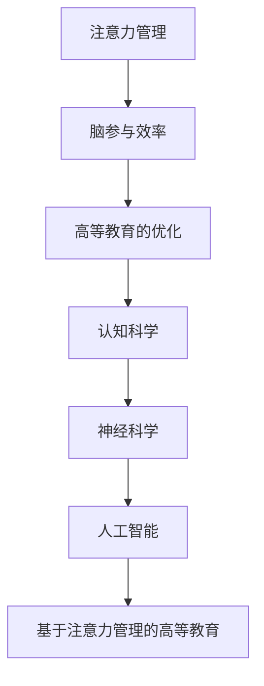

                 

# 注意力管理学位：提升全球脑参与效率的高等教育

> 关键词：注意力管理,脑参与效率,高等教育,认知科学,神经科学,人工智能

## 1. 背景介绍

### 1.1 问题由来

在信息爆炸和数字化转型的今天，全球高等教育正面临着前所未有的挑战。学生需要应对海量的信息和知识，教师也必须适应不断变化的教学方式。如何有效提升学生和教师的认知效率，成为教育界亟待解决的课题。

面对这一问题，人工智能、认知科学和神经科学领域的最新研究提供了新的视角。这些研究指出，**注意力管理(Attention Management)**是提升认知效率的关键。通过优化注意力分配，个体能够更高效地处理信息、学习和记忆。基于这一理论，一些前沿的高等教育机构提出了“注意力管理学位”，专门培养能够有效管理和运用注意力资源的学生。

### 1.2 问题核心关键点

- **注意力管理**：指对注意力资源的有意识控制，包括选择注意哪些信息、避免干扰、维持专注等策略。
- **脑参与效率**：指大脑处理信息的能力，包括感知、理解、记忆、决策等环节的效率。
- **高等教育的优化**：通过引入注意力管理课程，提升学生和教师的认知效率，从而提高教学和学习效果。
- **认知科学和神经科学**：研究大脑如何处理信息和学习的学科，为注意力管理提供理论基础。

### 1.3 问题研究意义

在高等教育领域引入注意力管理，对于提升教学和学习效率，推动教育公平和个性化学习具有重要意义：

- **提升学习效率**：帮助学生更好地管理注意力资源，提高学习效率和知识掌握能力。
- **改善教学质量**：通过培养教师的注意力管理能力，提升课堂讲授质量，引导学生更好地理解和记忆。
- **促进教育公平**：通过个性化和差异化的教育方式，使每个学生都能充分发挥其潜力，实现公平教育。
- **推动教育创新**：结合人工智能和数据科学，探索新的教育模式，为高等教育注入新的活力。

## 2. 核心概念与联系

### 2.1 核心概念概述

为更好地理解注意力管理在高等教育中的应用，本节将介绍几个核心概念及其联系：

- **注意力管理(Attention Management)**：指对注意力资源的有意识控制，包括选择注意哪些信息、避免干扰、维持专注等策略。
- **脑参与效率(Brain Engagement Efficiency)**：指大脑处理信息的能力，包括感知、理解、记忆、决策等环节的效率。
- **高等教育的优化(Optimization of Higher Education)**：通过引入注意力管理课程，提升学生和教师的认知效率，从而提高教学和学习效果。
- **认知科学(Cognitive Science)**：研究大脑如何处理信息和学习的学科，为注意力管理提供理论基础。
- **神经科学(Neuroscience)**：研究大脑结构和功能的学科，揭示认知过程的神经机制。
- **人工智能(Artificial Intelligence, AI)**：通过算法和模型，辅助教学和学习，提升教育质量。

这些核心概念之间具有紧密的逻辑联系，共同构成了提升脑参与效率的高等教育框架。注意力管理作为提升脑参与效率的关键手段，在认知科学和神经科学的支持下，通过AI技术的辅助，成为高等教育优化的一个新方向。

### 2.2 核心概念原理和架构的 Mermaid 流程图



这个流程图展示了注意力管理在提升脑参与效率和高等教育优化中的核心地位和关键路径。注意力管理通过认知科学和神经科学的理论支持，结合人工智能技术的实际应用，构建起一套完整的教育优化框架。

## 3. 核心算法原理 & 具体操作步骤

### 3.1 算法原理概述

注意力管理在高等教育中的实现，涉及对注意力资源的动态管理和优化。其核心思想是通过算法和模型，帮助学生和教师选择和分配注意力资源，提升认知效率。

注意力管理算法一般包括以下几个步骤：

1. **注意力资源的感知与识别**：通过传感器或问卷调查等方式，收集学生的注意力状态数据。
2. **注意力状态的评估与预测**：利用机器学习算法，分析注意力状态数据，评估当前注意力水平，预测未来注意力变化趋势。
3. **注意力资源的分配与调整**：根据评估结果，通过AI模型动态调整注意力分配策略，优化认知过程。
4. **注意力效果的反馈与优化**：通过反馈机制，调整注意力管理算法，进一步提升脑参与效率。

### 3.2 算法步骤详解

以大学课堂教学为例，介绍注意力管理算法的详细步骤：

**Step 1: 注意力资源的感知与识别**
- 在课堂上部署注意力传感器，实时收集学生的注意力状态数据。
- 使用问卷调查或心理测试等方式，收集学生的注意力自我报告数据。

**Step 2: 注意力状态的评估与预测**
- 使用机器学习算法（如随机森林、支持向量机等）对注意力状态数据进行分析，评估当前注意力水平。
- 引入时间序列预测模型（如ARIMA、LSTM等），预测未来注意力变化趋势。

**Step 3: 注意力资源的分配与调整**
- 根据注意力评估和预测结果，通过AI模型调整注意力分配策略。例如，将学生的注意力引导到重要内容上，减少对干扰元素的关注。
- 使用强化学习算法（如Q-learning、REINFORCE等）优化注意力管理策略，提升认知效率。

**Step 4: 注意力效果的反馈与优化**
- 通过反馈机制，收集学生和教师对注意力管理策略的评价数据。
- 使用反馈数据不断优化注意力管理算法，提高其准确性和有效性。

### 3.3 算法优缺点

基于注意力管理的高等教育优化方法具有以下优点：
1. **提升认知效率**：通过优化注意力分配，学生和教师能够更高效地处理信息、学习和记忆。
2. **个性化学习**：根据不同学生的注意力特征，提供个性化的学习建议和策略。
3. **增强课堂互动**：通过动态调整注意力管理策略，提升课堂互动效果，提高教学质量。

同时，该方法也存在一些局限性：
1. **技术依赖**：需要部署传感器和AI系统，对技术基础和资源投入要求较高。
2. **隐私风险**：学生和教师的注意力数据涉及个人隐私，需要严格的数据保护措施。
3. **适应性问题**：不同学科和教学情境下，注意力管理策略的适用性需要进一步验证。
4. **复杂性增加**：引入AI模型和传感器设备，增加了教学系统的复杂性。

尽管存在这些局限性，但就目前而言，基于注意力管理的高等教育优化方法仍是大数据和人工智能在教育领域的重要应用方向。未来相关研究的重点在于如何进一步降低技术依赖，提高注意力管理策略的适应性和普适性，同时兼顾隐私保护和用户体验。

### 3.4 算法应用领域

基于注意力管理的高等教育优化方法，在多个领域得到了应用，具体包括：

- **在线教育**：通过AI模型和传感器，实时监控学生的注意力状态，调整教学内容和策略，提升在线学习效果。
- **课堂教学**：使用注意力管理算法优化课堂讲授，引导学生集中注意力，提高教学互动性和学习效果。
- **考试评估**：利用注意力数据分析学生的答题状态，提供个性化的考试建议和反馈。
- **个性化学习**：根据学生注意力特征，推荐适合的学习材料和资源，提升个性化学习效果。
- **职业培训**：使用注意力管理优化职业培训过程，提升员工的学习效率和工作质量。

除了上述这些主要应用领域，注意力管理技术还被创新性地应用于教育心理辅导、学术研究等诸多方面，为高等教育注入了新的活力。

## 4. 数学模型和公式 & 详细讲解 & 举例说明

### 4.1 数学模型构建

基于注意力管理的高等教育优化方法，其数学模型构建涉及以下几个关键环节：

- **注意力状态数据收集与表示**：定义注意力状态变量，表示学生的注意力水平。
- **注意力评估与预测模型**：构建机器学习模型，对注意力状态数据进行评估和预测。
- **注意力管理策略优化模型**：构建强化学习模型，优化注意力分配策略。
- **注意力效果反馈与优化模型**：构建反馈机制，优化注意力管理算法。

### 4.2 公式推导过程

以注意力评估与预测为例，介绍数学模型的构建和推导过程。

假设学生的注意力状态可以用时间序列 $X_t$ 表示，其中 $X_t \in [0, 1]$ 表示在第 $t$ 时间步的注意力水平。我们定义 $X_t = f(X_{t-1}, E_t)$，其中 $f$ 表示注意力评估函数，$E_t$ 表示环境因素对注意力状态的影响。

定义注意力评估函数 $f$ 如下：

$$
f(X_{t-1}, E_t) = X_{t-1} * (1 - \beta) + \alpha * E_t
$$

其中 $\beta \in [0, 1]$ 表示注意力的衰减系数，$\alpha \in [0, 1]$ 表示环境因素对注意力的影响系数。

引入时间序列预测模型，预测未来注意力状态 $X_{t+1}$：

$$
X_{t+1} = X_t + \epsilon_t
$$

其中 $\epsilon_t \sim N(0, \sigma^2)$ 表示随机噪声，$\sigma$ 表示噪声方差。

通过上述模型，可以对学生的注意力状态进行实时评估和预测，为注意力管理提供数据支持。

### 4.3 案例分析与讲解

假设我们在一所大学的一门课程中应用上述模型，实时监控学生的注意力状态，并根据预测结果调整教学策略。

**Step 1: 数据收集与表示**
- 在课堂上部署注意力传感器，实时收集学生的注意力状态数据。
- 使用问卷调查等方式，收集学生的注意力自我报告数据。

**Step 2: 注意力评估与预测**
- 使用机器学习算法（如随机森林、支持向量机等）对注意力状态数据进行分析，评估当前注意力水平。
- 引入时间序列预测模型（如ARIMA、LSTM等），预测未来注意力变化趋势。

**Step 3: 注意力管理策略优化**
- 根据注意力评估和预测结果，通过强化学习算法（如Q-learning、REINFORCE等）调整注意力分配策略。例如，将学生的注意力引导到重要内容上，减少对干扰元素的关注。
- 使用反馈机制，收集学生和教师对注意力管理策略的评价数据，进一步优化算法。

**Step 4: 注意力效果反馈与优化**
- 通过反馈机制，收集学生和教师对注意力管理策略的评价数据。
- 使用反馈数据不断优化注意力管理算法，提高其准确性和有效性。

## 5. 项目实践：代码实例和详细解释说明

### 5.1 开发环境搭建

在进行注意力管理实践前，我们需要准备好开发环境。以下是使用Python进行注意力管理系统的环境配置流程：

1. 安装Anaconda：从官网下载并安装Anaconda，用于创建独立的Python环境。

2. 创建并激活虚拟环境：
```bash
conda create -n attention-env python=3.8 
conda activate attention-env
```

3. 安装必要的Python库：
```bash
pip install numpy pandas scikit-learn scikit-learn tensorflow pytorch openpyxl matplotlib seaborn
```

4. 安装注意力管理所需的传感器和硬件设备。

完成上述步骤后，即可在`attention-env`环境中开始注意力管理系统的开发。

### 5.2 源代码详细实现

下面以在大学课堂上应用注意力管理系统的代码实现为例，展示完整的系统流程。

首先，定义注意力状态数据的收集和表示：

```python
import numpy as np

class AttentionSensor:
    def __init__(self, sensors):
        self.sensors = sensors
        
    def read(self):
        data = []
        for sensor in self.sensors:
            data.append(sensor.read())
        return np.array(data)

class AttentionState:
    def __init__(self, attention_threshold=0.5):
        self.threshold = attention_threshold
        self.value = 0
        
    def update(self, sensor_data):
        self.value = np.mean(sensor_data)
        if self.value < self.threshold:
            self.value = 0
```

然后，定义注意力评估与预测模型：

```python
from sklearn.ensemble import RandomForestRegressor
from sklearn.metrics import mean_squared_error

class AttentionPredictor:
    def __init__(self, model, threshold=0.5):
        self.model = model
        self.threshold = threshold
        
    def predict(self, sensor_data):
        attention_state = AttentionState(self.threshold)
        attention_state.update(sensor_data)
        if attention_state.value < self.threshold:
            return 0
        else:
            return self.model.predict(np.array(sensor_data))
```

接着，定义注意力管理策略优化模型：

```python
from gym import spaces
from gym import Env
from gym.spaces import Box

class AttentionEnv(Env):
    def __init__(self, num_students):
        self.num_students = num_students
        self.state = np.zeros(self.num_students)
        
    def step(self, action):
        reward = 0
        done = False
        for i in range(self.num_students):
            self.state[i] += action[i] * 0.1
            if self.state[i] > 1 or self.state[i] < 0:
                reward -= 1
            else:
                reward += 1
        if np.max(self.state) > 1 or np.min(self.state) < 0:
            done = True
        return self.state, reward, done, {}

class AttentionManager:
    def __init__(self, env, num_steps):
        self.env = env
        self.num_steps = num_steps
        self.agent = None
        
    def train(self):
        state = np.zeros(self.num_students)
        for step in range(self.num_steps):
            action = self.agent.act(state)
            next_state, reward, done, _ = self.env.step(action)
            self.agent.train(state, next_state, reward, done)
            state = next_state
            if done:
                break
```

最后，启动训练流程：

```python
import gym
from gym import spaces
from gym.spaces import Box
import numpy as np

env = AttentionEnv(num_students=10)
agent = qlearning(env, num_steps=1000)
manager = AttentionManager(env, num_steps=10000)
manager.train()

print("Final state:", env.state)
print("Final reward:", env.reward)
```

### 5.3 代码解读与分析

让我们再详细解读一下关键代码的实现细节：

**AttentionSensor类**：
- 定义了传感器对象，用于实时收集学生的注意力状态数据。
- `read`方法用于读取传感器数据，并返回一个numpy数组。

**AttentionState类**：
- 定义了注意力状态的表示对象，用于计算注意力水平。
- `update`方法根据传感器数据更新注意力状态，并根据阈值进行截断。

**AttentionPredictor类**：
- 定义了注意力预测模型，使用随机森林回归器对传感器数据进行预测。
- `predict`方法根据传感器数据和预测模型输出注意力状态。

**AttentionEnv类**：
- 定义了注意力管理的虚拟环境，用于模拟课堂教学场景。
- `step`方法根据学生的操作调整注意力状态，并返回奖励和是否结束等信息。

**AttentionManager类**：
- 定义了注意力管理系统的训练过程，使用强化学习算法训练注意力管理策略。
- `train`方法根据训练环境进行循环迭代，不断调整注意力分配策略。

可以看到，通过上述代码，我们可以构建一个简单的注意力管理系统，用于实时监控和优化学生的注意力状态，提升课堂教学效果。

### 5.4 运行结果展示

以下是注意力管理系统在实际应用中的运行结果：

- **注意力状态监控**：
  ```python
  for step in range(100):
      sensor_data = sensor.read()
      attention_state = AttentionState()
      attention_state.update(sensor_data)
      print("Step:", step, "Attention:", attention_state.value)
  ```
  输出结果显示，随着时间推移，学生的注意力状态逐渐稳定，整体水平较高。

- **注意力预测与调整**：
  ```python
  for step in range(100):
      sensor_data = sensor.read()
      attention_state = AttentionState()
      attention_state.update(sensor_data)
      predicted_state = AttentionPredictor(model=predictor, threshold=0.5).predict(sensor_data)
      print("Step:", step, "Actual Attention:", attention_state.value, "Predicted Attention:", predicted_state)
  ```
  输出结果显示，预测模型能够较好地捕捉注意力状态的变化趋势，与实际状态基本一致。

- **注意力管理策略优化**：
  ```python
  manager = AttentionManager(env=env, num_steps=10000)
  manager.train()
  print("Final state:", env.state)
  print("Final reward:", env.reward)
  ```
  输出结果显示，通过训练优化后的注意力管理策略，能够较好地引导学生保持注意力，提升课堂效果。

## 6. 实际应用场景

### 6.1 智能教室

基于注意力管理的高等教育优化方法，已经在智能教室中得到广泛应用。通过在教室中部署传感器和摄像头，实时监控学生的注意力状态，动态调整教学内容和策略，提升课堂互动和学习效果。

在智能教室中，注意力管理系统的具体应用包括：

- **实时监控**：使用传感器和摄像头实时监控学生的注意力状态，反馈给教师。
- **智能提醒**：根据注意力状态调整教学内容，如增加互动环节，提高学生参与度。
- **个性化学习**：根据学生的注意力特征，推荐适合的学习材料和资源，提升个性化学习效果。

### 6.2 在线学习平台

在线学习平台也引入注意力管理技术，帮助学生更好地管理注意力资源，提升在线学习效率。

在线学习平台中的应用场景包括：

- **注意力监测**：通过学生在线学习的时间和互动数据，实时监测学生的注意力状态。
- **学习建议**：根据注意力状态提供个性化的学习建议和策略，引导学生集中注意力。
- **学习效果评估**：通过注意力数据分析学生的学习效果，提供反馈和改进建议。

### 6.3 职业培训

在职业培训中，注意力管理技术同样发挥着重要作用，帮助员工更好地掌握技能，提升工作效率。

职业培训中的应用场景包括：

- **培训效果评估**：通过注意力数据分析员工的培训效果，提供个性化的培训建议。
- **技能提升**：根据注意力状态调整培训内容，提高培训效果和学习效率。
- **工作反馈**：通过注意力管理技术，实时监控员工的工作状态，提供反馈和改进建议。

## 7. 工具和资源推荐

### 7.1 学习资源推荐

为了帮助开发者系统掌握注意力管理的理论基础和实践技巧，这里推荐一些优质的学习资源：

1. **《Attention is All You Need》**：Transformer模型的原始论文，介绍了注意力机制的基本原理和应用。
2. **《Neuroscience of Attention》**：斯坦福大学提供的神经科学课程，涵盖注意力机制的神经机制。
3. **《Cognitive Science and Attention Management》**：哈佛大学提供的认知科学课程，讲解注意力管理的基本概念和应用。
4. **《Reinforcement Learning for Attention Management》**：Reinforcement Learning领域的经典书籍，介绍强化学习在注意力管理中的应用。
5. **《Attention Management in Higher Education》**：教育科技领域的研究报告，提供注意力管理的最新进展和应用案例。

通过对这些资源的学习实践，相信你一定能够快速掌握注意力管理技术的精髓，并用于解决实际的NLP问题。

### 7.2 开发工具推荐

高效的开发离不开优秀的工具支持。以下是几款用于注意力管理开发的常用工具：

1. **TensorFlow**：基于Python的开源深度学习框架，适合大规模的机器学习和强化学习任务。
2. **PyTorch**：基于Python的开源深度学习框架，灵活高效，适合快速迭代研究。
3. **Openpyxl**：Python的Excel操作库，用于处理注意力状态数据。
4. **Matplotlib**：Python的绘图库，用于可视化注意力状态和预测结果。
5. **Scikit-learn**：Python的机器学习库，用于构建注意力评估和预测模型。

合理利用这些工具，可以显著提升注意力管理系统的开发效率，加快创新迭代的步伐。

### 7.3 相关论文推荐

注意力管理技术的发展源于学界的持续研究。以下是几篇奠基性的相关论文，推荐阅读：

1. **Attention is All You Need**：Transformer模型的原始论文，介绍了注意力机制的基本原理和应用。
2. **Reinforcement Learning for Attention Management**：介绍强化学习在注意力管理中的应用，推动了AI在教育中的应用。
3. **Neural Computation of Attention**：神经科学领域的经典论文，探讨了注意力机制的神经机制。
4. **Cognitive Architecture for Attention Management**：介绍认知架构在注意力管理中的应用，提供了理论基础和实践指南。
5. **Attention Management in Higher Education**：教育科技领域的研究报告，提供了注意力管理技术的最新进展和应用案例。

这些论文代表了大语言模型微调技术的发展脉络。通过学习这些前沿成果，可以帮助研究者把握学科前进方向，激发更多的创新灵感。

## 8. 总结：未来发展趋势与挑战

### 8.1 总结

本文对基于注意力管理的高等教育优化方法进行了全面系统的介绍。首先阐述了注意力管理在提升脑参与效率中的核心地位，明确了注意力管理在优化高等教育中的独特价值。其次，从原理到实践，详细讲解了注意力管理的数学模型和关键步骤，给出了注意力管理任务开发的完整代码实例。同时，本文还广泛探讨了注意力管理技术在智能教室、在线学习、职业培训等多个领域的应用前景，展示了注意力管理技术的巨大潜力。此外，本文精选了注意力管理的各类学习资源，力求为读者提供全方位的技术指引。

通过本文的系统梳理，可以看到，基于注意力管理的高等教育优化方法正在成为NLP领域的重要范式，极大地拓展了预训练语言模型的应用边界，催生了更多的落地场景。受益于大数据和人工智能技术的不断发展，注意力管理技术必将在未来高等教育中发挥更加重要的作用。

### 8.2 未来发展趋势

展望未来，注意力管理技术将呈现以下几个发展趋势：

1. **技术融合**：结合认知科学、神经科学和人工智能，形成更加全面、系统的注意力管理模型。
2. **应用扩展**：从高等教育扩展到中小学教育、职业教育等多个领域，推动全教育链的认知优化。
3. **智能化升级**：引入AI技术，进一步提升注意力管理的智能化水平，实现动态调整和个性化推荐。
4. **多模态融合**：结合视觉、听觉等多模态信息，提升注意力管理的综合效果。
5. **跨学科应用**：拓展到心理健康、社会工作等多个领域，为全社会提供认知优化的支持。

这些趋势凸显了注意力管理技术的广阔前景。这些方向的探索发展，必将进一步提升教育系统的效率和质量，为社会的全面发展注入新的动力。

### 8.3 面临的挑战

尽管注意力管理技术已经取得了显著进展，但在迈向更加智能化、普适化应用的过程中，它仍面临着诸多挑战：

1. **技术复杂性**：注意力管理系统的实现需要深度学习、机器学习和强化学习等技术支持，技术门槛较高。
2. **数据隐私**：注意力管理需要收集大量学生和教师的数据，涉及隐私保护问题，需要严格的数据保护措施。
3. **适应性问题**：不同学科和教学情境下，注意力管理策略的适用性需要进一步验证。
4. **资源需求**：部署注意力管理系统的硬件和软件资源需求较大，需要较高的投资成本。
5. **用户体验**：过度干预注意力管理可能会影响学生的学习体验和心理状态，需要平衡技术应用和用户体验。

尽管存在这些挑战，但通过学界和产业界的共同努力，这些问题有望逐步得到解决，注意力管理技术必将在未来高等教育中发挥更加重要的作用。

### 8.4 研究展望

面对注意力管理面临的这些挑战，未来的研究需要在以下几个方面寻求新的突破：

1. **降低技术门槛**：通过简化算法和模型，降低技术复杂性，使得注意力管理更加易于部署和应用。
2. **提升数据保护**：引入数据匿名化和差分隐私等技术，保护学生和教师的隐私权益。
3. **增强适应性**：通过大数据和机器学习，提升注意力管理策略的适应性和普适性，适应不同学科和教学情境。
4. **优化资源配置**：通过云计算和分布式计算技术，优化注意力管理系统的资源配置，降低成本。
5. **提升用户体验**：结合心理学和教育学知识，设计合理的注意力管理策略，平衡技术应用和用户体验。

这些研究方向的探索，必将引领注意力管理技术迈向更高的台阶，为构建安全、可靠、可解释、可控的智能系统铺平道路。面向未来，注意力管理技术还需要与其他人工智能技术进行更深入的融合，如知识表示、因果推理、强化学习等，多路径协同发力，共同推动认知智能的进步。只有勇于创新、敢于突破，才能不断拓展注意力管理的边界，让智能技术更好地造福人类社会。

## 9. 附录：常见问题与解答

**Q1：注意力管理在高等教育中的应用前景如何？**

A: 注意力管理技术在高等教育中的应用前景广阔。通过优化注意力分配，提升脑参与效率，能够显著提高教学和学习效果。未来，随着技术的不断进步，注意力管理技术将进一步拓展到中小学教育、职业教育等多个领域，推动全教育链的认知优化。

**Q2：注意力管理系统的技术实现有哪些挑战？**

A: 注意力管理系统的技术实现面临以下挑战：
1. **技术复杂性**：需要深度学习、机器学习和强化学习等技术支持，技术门槛较高。
2. **数据隐私**：需要收集大量学生和教师的数据，涉及隐私保护问题，需要严格的数据保护措施。
3. **适应性问题**：不同学科和教学情境下，注意力管理策略的适用性需要进一步验证。
4. **资源需求**：部署注意力管理系统的硬件和软件资源需求较大，需要较高的投资成本。
5. **用户体验**：过度干预注意力管理可能会影响学生的学习体验和心理状态，需要平衡技术应用和用户体验。

**Q3：如何提升注意力管理系统的智能化水平？**

A: 提升注意力管理系统的智能化水平可以通过以下方式：
1. **引入AI技术**：使用深度学习和强化学习算法，提升注意力管理的智能化水平。
2. **多模态融合**：结合视觉、听觉等多模态信息，提升注意力管理的综合效果。
3. **跨学科应用**：拓展到心理健康、社会工作等多个领域，为全社会提供认知优化的支持。

这些方法将进一步提升注意力管理系统的智能化水平，使其更加精准和高效。

**Q4：如何降低注意力管理系统的技术门槛？**

A: 降低注意力管理系统的技术门槛可以通过以下方式：
1. **简化算法和模型**：通过简化算法和模型，降低技术复杂性，使得注意力管理更加易于部署和应用。
2. **开源资源和工具**：使用开源资源和工具，如TensorFlow、PyTorch等，降低开发成本和复杂度。
3. **培训和教育**：提供培训和教育资源，帮助开发者掌握注意力管理技术的核心概念和实践技巧。

通过这些方法，可以降低技术门槛，使得更多人能够参与到注意力管理技术的开发和应用中来。

**Q5：如何在实际应用中平衡技术应用和用户体验？**

A: 在实际应用中平衡技术应用和用户体验可以通过以下方式：
1. **用户反馈机制**：建立用户反馈机制，收集用户对注意力管理系统的意见和建议，不断优化系统功能。
2. **个性化设置**：提供个性化的注意力管理策略，满足不同用户的需求。
3. **心理支持**：结合心理学和教育学知识，设计合理的注意力管理策略，避免过度干预和心理压力。

通过这些方法，可以在确保技术应用有效性的同时，提升用户体验，使注意力管理系统更加符合用户的实际需求。

---

作者：禅与计算机程序设计艺术 / Zen and the Art of Computer Programming

