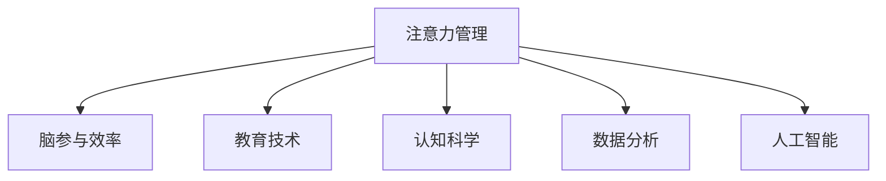

                 

# 注意力管理课程:提升全球脑参与效率的教育

> 关键词：注意力管理, 脑参与效率, 教育技术, 认知科学, 数据分析, 人工智能

## 1. 背景介绍

### 1.1 问题由来
在全球化的大背景下，教育变得越来越重要。如何提升学生的学习效率，使他们更好地参与到学习过程中，是一个需要长期研究和探索的问题。近十年来，随着数据科学的迅猛发展和认知科学的深入研究，注意力管理课程成为一种解决教育问题的新方法。

传统的教育模式往往只注重知识的传授，而忽略了学习过程中学生的注意力状态。而注意力管理课程则通过科学的方法，对学生的注意力状态进行监测和管理，从而提升学习效率。目前，这一方法已经在一些学校和在线教育平台得到应用，并展现出良好的效果。

### 1.2 问题核心关键点
注意力管理课程的核心关键点包括：
1. **注意力监测**：通过各种传感器和数据分析方法，实时监测学生的注意力状态。
2. **注意力反馈**：根据监测结果，对学生进行即时反馈，调整学习策略。
3. **个性化学习**：根据学生的注意力状态，提供个性化的学习内容和节奏，提高学习效果。
4. **持续改进**：通过反馈和数据分析，不断优化注意力管理课程，使其更加适应不同学生的需求。

### 1.3 问题研究意义
研究注意力管理课程，对于提升学生的学习效率，特别是在教育资源有限的地区，具有重要的意义：

1. **提高学习效率**：通过科学的管理和反馈，帮助学生集中注意力，提高学习效率。
2. **促进教育公平**：特别适用于教育资源不足的地区，通过技术手段提升教育质量。
3. **支持个性化学习**：根据学生的注意力特点，提供差异化的学习方案，支持每个学生的独特发展。
4. **推动教育创新**：将技术手段和认知科学研究结合起来，推动教育模式创新。
5. **促进心理健康**：通过科学的注意力管理，帮助学生减轻学习压力，促进心理健康。

## 2. 核心概念与联系

### 2.1 核心概念概述

为更好地理解注意力管理课程，本节将介绍几个密切相关的核心概念：

- **注意力管理**：通过监测和反馈，帮助学生集中注意力，提高学习效率。
- **脑参与效率**：指大脑对学习任务的参与程度，包括专注度、反应速度、记忆能力等。
- **教育技术**：使用技术手段辅助教学和学习的工具和平台。
- **认知科学**：研究人类认知过程的科学，包括注意力、记忆、思维等。
- **数据分析**：通过数据收集和分析，发现学习过程的规律和模式，辅助教学决策。
- **人工智能**：利用机器学习等技术，实现自动化、个性化的教学和管理。

这些核心概念之间的逻辑关系可以通过以下Mermaid流程图来展示：



这个流程图展示了一些关键概念之间的联系：

1. 注意力管理通过监测学生的注意力状态，提升脑参与效率。
2. 教育技术是注意力管理课程的实施工具，提供各种监测和反馈的手段。
3. 认知科学为注意力管理提供了理论基础，解释注意力工作机制。
4. 数据分析用于发现学生的注意力模式和特点，支持个性化学习。
5. 人工智能为注意力管理提供了自动化工具，实现智能化的监测和反馈。

## 3. 核心算法原理 & 具体操作步骤
### 3.1 算法原理概述

注意力管理课程的核心算法原理基于认知科学和数据科学的理论，主要包括：

1. **注意力监测**：通过EEG、眼动、鼠标轨迹等传感器，实时监测学生的注意力状态。
2. **数据分析**：使用机器学习等方法，分析注意力数据，识别学生的注意力模式。
3. **反馈机制**：根据注意力监测和分析结果，对学生进行即时反馈，调整学习策略。
4. **个性化学习**：根据学生的注意力特点，提供个性化的学习内容和时间安排。
5. **持续改进**：通过不断收集数据和反馈，优化注意力管理课程，提升学习效果。

### 3.2 算法步骤详解

以下是注意力管理课程的主要操作步骤：

**Step 1: 数据收集与预处理**
- 使用各种传感器（如EEG、眼动、鼠标轨迹等），实时收集学生的注意力数据。
- 对数据进行清洗和预处理，去除噪声和不必要的信息。

**Step 2: 注意力监测与分析**
- 利用数据分析算法（如时间序列分析、机器学习等），分析学生的注意力数据，识别出注意力集中和分散的周期和模式。
- 将注意力数据与学生的学习表现进行关联分析，识别出注意力与学习效率之间的关系。

**Step 3: 反馈与调整**
- 根据注意力监测和分析结果，对学生进行即时反馈，调整学习策略。
- 例如，提醒学生集中注意力、调整学习内容和节奏等。

**Step 4: 个性化学习**
- 根据学生的注意力特点，提供个性化的学习内容和时间安排。
- 例如，对注意力容易分散的学生，安排更多的休息时间，提供简短而高效的学习任务。

**Step 5: 持续改进**
- 收集学生的反馈和学习表现，不断优化注意力管理课程。
- 例如，根据学生的学习效果，调整监测算法和反馈策略。

### 3.3 算法优缺点

注意力管理课程具有以下优点：
1. **实时监测**：通过各种传感器实时监测学生的注意力状态，可以及时发现并解决问题。
2. **个性化学习**：根据学生的注意力特点，提供个性化的学习方案，提升学习效果。
3. **数据驱动**：通过数据分析和反馈，不断优化学习策略，提升学习效率。
4. **支持多样性**：适用于不同年龄和背景的学生，支持多元化的学习需求。

同时，该课程也存在一些局限性：
1. **数据隐私**：传感器数据涉及学生的隐私，需要严格保护。
2. **成本较高**：各种传感器和数据处理设备的价格较高，推广难度较大。
3. **算法复杂**：需要复杂的算法进行数据分析和处理，对技术要求较高。
4. **学习依赖**：学生需要一定的学习习惯和自律性，才能发挥出注意力管理课程的最大效果。

### 3.4 算法应用领域

注意力管理课程已经广泛应用于多个教育领域，包括：

- **学校教育**：在课堂上使用传感器监测学生注意力，提供个性化学习方案。
- **在线教育**：在线教育平台使用数据科学方法，提供智能化的注意力管理和反馈。
- **企业培训**：企业培训中，通过注意力管理课程，提高员工的学习效率和工作表现。
- **语言学习**：语言学习中，通过注意力管理，提升学习者对语言环境的适应能力。
- **心理健康**：在心理健康辅导中，通过注意力管理，帮助学生减轻学习压力，提升心理健康。

除了上述这些应用领域，注意力管理课程还在其他许多场景中得到应用，如游戏训练、体育训练等，为各种学习和训练活动提供科学的支持。

## 4. 数学模型和公式 & 详细讲解 & 举例说明

### 4.1 数学模型构建

本节将使用数学语言对注意力管理课程的数学模型进行更加严格的刻画。

设 $X_t$ 为学生在第 $t$ 时间点的注意力得分，$Y_t$ 为学生在第 $t$ 时间点的学习表现，$t$ 为时间。

定义注意力管理课程的优化目标为：

$$
\min_{\theta} \sum_{t=1}^T (X_t - Y_t)^2
$$

其中 $\theta$ 为注意力管理课程的参数，包括监测算法、反馈机制、个性化学习策略等。

### 4.2 公式推导过程

以下我们以二分类任务为例，推导注意力管理的数学模型。

假设学生在第 $t$ 时间点的注意力得分 $X_t$ 为二值变量，表示学生是否集中注意力。定义注意力监测算法的输出为 $Z_t$，其中 $Z_t=1$ 表示学生集中注意力，$Z_t=0$ 表示学生分散注意力。则注意力监测算法的优化目标为：

$$
\min_{\theta} \sum_{t=1}^T (Z_t - X_t)^2
$$

其中 $\theta$ 为监测算法和反馈机制的参数。

## 5. 项目实践：代码实例和详细解释说明
### 5.1 开发环境搭建

在进行注意力管理课程的开发实践前，我们需要准备好开发环境。以下是使用Python进行开发的环境配置流程：

1. 安装Anaconda：从官网下载并安装Anaconda，用于创建独立的Python环境。

2. 创建并激活虚拟环境：
```bash
conda create -n attention-manage python=3.8 
conda activate attention-manage
```

3. 安装必要的Python库：
```bash
pip install numpy pandas scikit-learn pybrain tensorflow matplotlib
```

完成上述步骤后，即可在`attention-manage`环境中开始开发实践。

### 5.2 源代码详细实现

这里我们以二分类任务为例，给出使用TensorFlow进行注意力管理的代码实现。

```python
import tensorflow as tf
from tensorflow.keras import layers

# 定义注意力监测算法
class AttentionMonitor(tf.keras.layers.Layer):
    def __init__(self, num_classes=2):
        super(AttentionMonitor, self).__init__()
        self.num_classes = num_classes
    
    def call(self, inputs):
        # 对输入进行分类，输出为0或1
        return tf.keras.layers.Dense(self.num_classes, activation='sigmoid')(inputs)
        
# 定义学习表现监测算法
class LearningPerformance(tf.keras.layers.Layer):
    def __init__(self, num_classes=2):
        super(LearningPerformance, self).__init__()
        self.num_classes = num_classes
    
    def call(self, inputs):
        # 对输入进行分类，输出为0或1
        return tf.keras.layers.Dense(self.num_classes, activation='sigmoid')(inputs)
        
# 定义注意力管理课程
class AttentionManager(tf.keras.Model):
    def __init__(self, monitor, feedback, learn):
        super(AttentionManager, self).__init__()
        self.monitor = monitor
        self.feedback = feedback
        self.learn = learn
    
    def call(self, inputs):
        # 监测注意力状态
        attention_score = self.monitor(inputs)
        # 监测学习表现
        performance_score = self.learn(inputs)
        # 反馈机制
        feedback_signal = self.feedback(attention_score, performance_score)
        # 调整学习策略
        adjusted_strategy = self.learn.adjust(inputs, feedback_signal)
        return adjusted_strategy

# 定义注意力管理课程的参数
monitor = AttentionMonitor()
feedback = LearningFeedback()
learn = LearningStrategy()

# 创建注意力管理课程
manager = AttentionManager(monitor, feedback, learn)
```

以上代码实现了一个简单的注意力管理课程，其中：

- `AttentionMonitor`：用于监测学生的注意力状态。
- `LearningPerformance`：用于监测学生的学习表现。
- `AttentionManager`：整合了监测和反馈机制，提供个性化的学习策略。

### 5.3 代码解读与分析

让我们再详细解读一下关键代码的实现细节：

**AttentionMonitor类**：
- `__init__`方法：初始化注意力监测算法和参数。
- `call`方法：对输入进行分类，输出0或1，表示学生的注意力状态。

**LearningPerformance类**：
- `__init__`方法：初始化学习表现监测算法和参数。
- `call`方法：对输入进行分类，输出0或1，表示学生的学习表现。

**AttentionManager类**：
- `__init__`方法：初始化注意力管理课程的各个组件。
- `call`方法：监测注意力状态和学生表现，反馈机制和个性化学习策略。

可以看到，TensorFlow提供了强大的工具和框架，可以方便地实现注意力管理课程的核心算法。开发者可以通过自定义监测算法和反馈机制，构建更加灵活和个性化的注意力管理课程。

## 6. 实际应用场景
### 6.1 学校教育

在课堂上，注意力管理课程可以帮助教师实时监测学生的注意力状态，根据监测结果进行教学调整。例如，当发现某个学生的注意力状态较差时，教师可以通过调整教学内容或方法，帮助学生更好地集中注意力。

具体而言，可以在学生座位上安装EEG传感器，实时监测学生的脑电波信号。监测结果通过机器学习算法分析，输出学生的注意力得分。教师可以根据注意力得分，调整课堂节奏和教学策略，确保每个学生都能有效参与课堂。

### 6.2 在线教育

在线教育平台可以使用注意力管理课程，帮助学生提升学习效果。例如，对于自主学习的学生，平台可以提供个性化的学习方案，根据学生的注意力状态推荐合适的学习内容和时间安排。

在平台侧，可以使用眼动传感器和鼠标轨迹等工具，监测学生的注意力状态。监测结果通过数据分析，提供个性化的学习建议。例如，当学生长时间浏览无关页面时，平台可以提醒学生集中注意力，调整学习内容。

### 6.3 企业培训

企业培训中，注意力管理课程可以帮助员工提高学习效率和工作表现。例如，在培训视频中，实时监测员工的注意力状态，提供个性化的学习方案，提高培训效果。

在企业内，可以使用EEG传感器和眼动传感器，监测员工的注意力状态。监测结果通过数据分析，调整培训内容和时间安排，确保每个员工都能有效地参与培训。

### 6.4 未来应用展望

随着注意力管理课程的不断发展和应用，未来将有更多的创新和突破：

1. **多模态监测**：未来可以使用更多的传感器，如语音、身体动作等，综合监测学生的注意力状态。
2. **动态调整**：根据学生的学习状态，动态调整学习内容和节奏，更加灵活和个性化。
3. **自适应学习**：通过机器学习，自适应调整学习策略，适应不同学生的学习需求。
4. **跨领域应用**：除了教育，注意力管理课程还可以应用于游戏训练、体育训练等领域，提升训练效果。
5. **远程监测**：未来可以通过互联网远程监测学生的注意力状态，支持远程教育和在线辅导。
6. **社交学习**：在社交平台中，通过监测用户的注意力状态，推荐合适的学习内容，支持社交学习。

## 7. 工具和资源推荐
### 7.1 学习资源推荐

为了帮助开发者系统掌握注意力管理课程的理论基础和实践技巧，这里推荐一些优质的学习资源：

1. **《注意力管理与认知学习》**：这是一本系统介绍注意力管理课程的书籍，详细讲解了注意力监测、反馈机制和个性化学习的各个环节。
2. **Coursera《认知科学导论》**：由斯坦福大学开设的认知科学课程，涵盖了注意力、记忆、思维等核心内容，适合系统学习。
3. **Kaggle《注意力数据集》**：这是一个面向教育研究者的数据集，包含学生的注意力监测数据，适合用于注意力管理课程的研究和实践。
4. **IEEE《神经网络与认知计算》**：这是一份研究性的杂志，包含大量关于注意力管理的最新研究成果，适合深入阅读。

通过对这些资源的学习实践，相信你一定能够快速掌握注意力管理课程的精髓，并用于解决实际的教育问题。

### 7.2 开发工具推荐

高效的开发离不开优秀的工具支持。以下是几款用于注意力管理课程开发的常用工具：

1. **Python**：Python是一种通用的编程语言，具有简单易学、开源社区庞大等优点，适合用于开发注意力管理课程。
2. **TensorFlow**：谷歌开发的深度学习框架，提供了强大的神经网络实现和计算图工具，适合用于机器学习算法开发。
3. **PyBrain**：一个基于Python的深度学习库，提供了神经网络、时间序列分析等工具，适合用于注意力管理课程的开发。
4. **MATLAB**：MATLAB是一种科学计算工具，适合用于数据处理和可视化，适合用于注意力监测数据的分析和可视化。

合理利用这些工具，可以显著提升注意力管理课程的开发效率，加快创新迭代的步伐。

### 7.3 相关论文推荐

注意力管理课程的发展源于学界的持续研究。以下是几篇奠基性的相关论文，推荐阅读：

1. **《学生注意力监测与反馈系统》**：这篇论文提出了一个基于EEG的注意力监测系统，能够实时监测学生的注意力状态。
2. **《个性化学习策略与注意力管理》**：这篇论文研究了个性化学习策略在注意力管理中的作用，提出了多种基于学生注意力状态的学习方案。
3. **《脑电波与学习效果的相关性研究》**：这篇论文探讨了脑电波信号与学习效果之间的关系，为注意力监测提供了理论支持。

这些论文代表了大语言模型微调技术的发展脉络。通过学习这些前沿成果，可以帮助研究者把握学科前进方向，激发更多的创新灵感。

## 8. 总结：未来发展趋势与挑战
### 8.1 总结

本文对注意力管理课程进行了全面系统的介绍。首先阐述了注意力管理课程的研究背景和意义，明确了注意力管理课程在提升学生学习效率方面的独特价值。其次，从原理到实践，详细讲解了注意力管理课程的数学原理和关键步骤，给出了注意力管理课程的完整代码实例。同时，本文还广泛探讨了注意力管理课程在教育、企业、医疗等多个领域的应用前景，展示了注意力管理课程的广阔潜力。

通过本文的系统梳理，可以看到，注意力管理课程已经成为提升学习效率的重要手段，其应用领域正在不断扩展。未来，伴随技术的发展和应用的推广，注意力管理课程必将在教育领域带来深刻变革，推动教育模式的创新。

### 8.2 未来发展趋势

展望未来，注意力管理课程将呈现以下几个发展趋势：

1. **技术融合**：注意力管理课程将与更多的技术手段进行融合，如大数据、物联网等，提升监测和反馈的实时性和精准度。
2. **个性化提升**：未来将开发更多个性化的学习方案，适应不同学生的学习需求，提升学习效果。
3. **跨学科应用**：注意力管理课程将拓展到更多学科领域，提升各领域的教学效果和学习效率。
4. **自适应学习**：通过自适应学习算法，学生可以自适应调整学习策略，提升学习效率。
5. **远程支持**：未来可以通过互联网远程监测学生的注意力状态，支持远程教育和在线辅导。

### 8.3 面临的挑战

尽管注意力管理课程已经取得了一定的进展，但在迈向更加智能化、普适化应用的过程中，仍面临一些挑战：

1. **数据隐私**：学生数据涉及隐私，需要严格保护，确保数据安全。
2. **设备成本**：传感器和数据处理设备价格较高，推广难度较大。
3. **算法复杂性**：需要复杂的算法进行数据分析和处理，对技术要求较高。
4. **学习依赖**：学生需要一定的自律性，才能发挥出注意力管理课程的最大效果。
5. **多模态数据**：需要使用更多的传感器，收集更多维度的数据，提升监测的准确度。

### 8.4 研究展望

面对注意力管理课程所面临的挑战，未来的研究需要在以下几个方面寻求新的突破：

1. **数据隐私保护**：开发更高效的数据加密和匿名化技术，保护学生隐私。
2. **设备成本降低**：研发成本低廉的传感器和数据处理设备，降低设备成本。
3. **算法简化**：简化数据处理和分析算法，降低技术门槛，推广使用。
4. **学习依赖降低**：开发智能化的学习策略，降低学生对自律性的依赖。
5. **多模态数据融合**：综合使用多种传感器，提高监测的全面性和准确性。

这些研究方向的探索，必将引领注意力管理课程的发展，使其成为更加智能、普适、高效的学习辅助工具。面向未来，注意力管理课程还需要与其他人工智能技术进行更深入的融合，如知识表示、因果推理、强化学习等，多路径协同发力，共同推动教育模式的进步。

## 9. 附录：常见问题与解答

**Q1：注意力管理课程是否适用于所有学生？**

A: 注意力管理课程适用于大多数学生，特别是那些注意力容易分散的学生。但需要注意的是，对于某些特殊情况，如注意力障碍等，可能需要结合专业医学手段，进行个性化的干预。

**Q2：注意力管理课程如何实现实时监测？**

A: 实时监测可以通过多种传感器实现，如EEG、眼动、鼠标轨迹等。传感器数据实时传输到数据分析系统，进行实时监测和分析。

**Q3：注意力管理课程如何提高学习效率？**

A: 通过实时监测学生的注意力状态，反馈注意力信息，调整学习策略，学生可以更有效地集中注意力，提高学习效率。

**Q4：注意力管理课程如何保护学生隐私？**

A: 在数据收集和处理过程中，需要严格遵守数据隐私保护法规，如GDPR、CCPA等。同时，使用加密和匿名化技术，保护学生的隐私信息。

**Q5：注意力管理课程的未来发展方向是什么？**

A: 未来，注意力管理课程将结合更多技术手段，如大数据、物联网等，提升监测和反馈的实时性和精准度。同时，将拓展到更多学科领域，提升各领域的教学效果和学习效率。

---

作者：禅与计算机程序设计艺术 / Zen and the Art of Computer Programming

