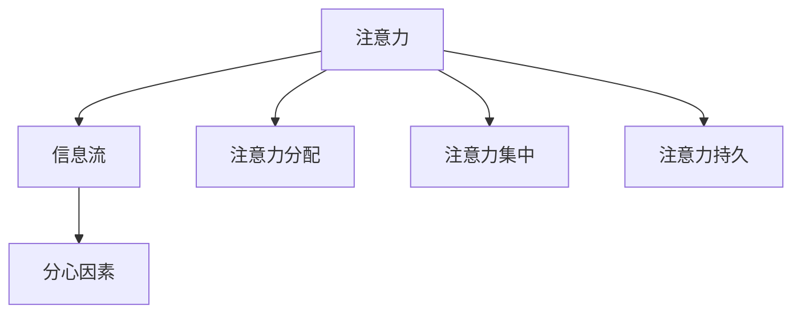

                 

# 注意力管理：元宇宙时代下的个人效率管理

在元宇宙的浪潮中，如何有效管理个人注意力，成为一个不容忽视的问题。本文将从注意力管理的核心概念出发，探讨其原理与实现步骤，并结合实际案例，阐述其在元宇宙中的应用。

## 1. 背景介绍

### 1.1 问题由来
随着科技的飞速发展，我们进入了信息爆炸的时代。从社交媒体到工作交流，从娱乐消遣到教育培训，无处不在的信息流不断冲击着我们的注意力。在元宇宙这一虚拟世界中，这种冲击尤为显著。面对海量信息的涌入，如何有效管理个人注意力，成为我们必须面对的挑战。

### 1.2 问题核心关键点
在元宇宙时代，有效的注意力管理不仅仅关系到个人的工作效率和心理状态，更关乎其在虚拟世界中的生存体验和社交互动。核心关键点在于：
- 识别和分类不同的注意力需求。
- 根据不同的任务类型和优先级，合理分配注意力资源。
- 通过技术手段提升注意力集中度和持久度。

### 1.3 问题研究意义
在元宇宙中，注意力管理可以提升个人的工作效率，改善生活质量，同时增加在虚拟世界中的互动体验。对于企业和组织而言，合理分配团队成员的注意力，可以优化资源配置，提升整体生产力。因此，有效的注意力管理技术对于元宇宙时代个人和组织的高效运作具有重要意义。

## 2. 核心概念与联系

### 2.1 核心概念概述

元宇宙中，注意力管理涉及多个关键概念：

- **注意力**：指个体对信息或任务的关注程度和集中能力。
- **信息流**：指在元宇宙中各种信息源产生的连续数据流。
- **分心因素**：指导致注意力分散的外部因素，如噪音、信息过载等。
- **注意力分配**：指在多个任务之间合理分配注意力的过程。
- **注意力集中**：指在特定任务上的长时间持续关注和集中。
- **注意力持久**：指在特定任务上的长时间保持注意力，避免疲劳和分心。

这些概念之间相互关联，共同构成了注意力管理的理论基础。

### 2.2 核心概念原理和架构的 Mermaid 流程图



### 2.3 核心概念联系
注意力管理实际上是通过识别和分类信息流，根据分心因素进行动态调整，以实现对注意力的有效分配、集中和持久保持。这些过程通过算法和技术手段实现，最终提升个人和组织的工作效率。

## 3. 核心算法原理 & 具体操作步骤

### 3.1 算法原理概述
注意力管理的核心算法原理主要包括：

1. **信息过滤与筛选**：对信息流进行预处理，过滤掉不相关或干扰性信息。
2. **注意力模型构建**：通过机器学习或神经网络等方法，构建针对不同任务的注意力模型。
3. **注意力分配与优化**：根据当前任务和环境，动态调整注意力分配策略，优化注意力分配效率。
4. **注意力集中与持久保持**：通过技术手段提升注意力集中度和持久度，如使用番茄工作法、正念训练等。

### 3.2 算法步骤详解

**Step 1: 信息预处理与筛选**
1. 对元宇宙中的信息流进行实时监测，识别不同类型的信息（如通知、邮件、社交动态等）。
2. 对信息进行筛选和分类，过滤掉低优先级和不相关内容。
3. 对重要信息进行标记，优先分配注意力资源。

**Step 2: 构建注意力模型**
1. 收集用户在不同任务和环境下的注意力数据，包括注意力持续时间、分配比例等。
2. 使用机器学习或神经网络方法，构建用户注意力模型。
3. 根据任务类型和用户偏好，调整注意力模型参数。

**Step 3: 注意力分配与优化**
1. 根据当前任务的重要性和紧急程度，动态调整注意力分配策略。
2. 使用算法优化注意力分配效率，如基于强化学习的注意力分配算法。
3. 实时监测注意力分配效果，调整策略以优化资源利用率。

**Step 4: 提升注意力集中与持久保持**
1. 使用技术手段提升注意力集中度，如番茄工作法、背景音乐等。
2. 设计心理训练方法，提高注意力持久度，如正念冥想、注意力训练等。
3. 定期评估注意力集中和持久度，根据反馈调整策略。

### 3.3 算法优缺点

#### 优点：
- 有效提升工作和生活效率，优化资源配置。
- 帮助用户更好地应对元宇宙中的信息过载。
- 增强用户在虚拟世界中的互动体验和生存能力。

#### 缺点：
- 对技术依赖性较高，需定期维护和更新。
- 用户习惯和偏好差异大，难以一概而论。
- 可能会增加心理负担，导致过度关注和管理。

### 3.4 算法应用领域

注意力管理技术可以应用于多个领域，包括但不限于：

- **教育培训**：提升学习效率，优化课程安排。
- **远程办公**：合理分配工作任务，提升团队协作效率。
- **社交互动**：优化社交体验，提升用户互动质量。
- **娱乐消遣**：个性化推荐内容，提升用户体验。

## 4. 数学模型和公式 & 详细讲解

### 4.1 数学模型构建

注意力管理的数学模型可以概括为：

$$
\text{Attention} = f(\text{Information Stream}, \text{Distraction Factors}, \text{Task Priorities})
$$

其中，$f$ 表示注意力模型，对信息流、分心因素和任务优先级进行映射。

### 4.2 公式推导过程

以基于强化学习的注意力分配算法为例，推导注意力分配公式：

$$
\text{Attention}_{i} = \alpha \cdot \max(\text{Reward}_{i}, \text{Distraction}_{i}) + \beta \cdot \min(\text{Reward}_{i}, \text{Distraction}_{i})
$$

其中，$\alpha$ 和 $\beta$ 为调节参数，$\text{Reward}_{i}$ 和 $\text{Distraction}_{i}$ 分别为任务 $i$ 的奖励和分心程度。

### 4.3 案例分析与讲解

假设有一个用户同时面对两个任务：项目A和项目B。根据上述公式，当项目A的奖励更高且分心程度更低时，注意力更多地分配给项目A。当奖励和分心程度相等时，随机分配注意力资源。

## 5. 项目实践：代码实例和详细解释说明

### 5.1 开发环境搭建

首先，需要安装所需的开发环境和工具：

- Python 3.8
- TensorFlow 2.0
- PyTorch
- Scikit-learn
- Pandas

### 5.2 源代码详细实现

以下是一个使用强化学习的注意力分配算法的示例代码：

```python
import tensorflow as tf
import numpy as np

# 定义强化学习模型
class AttentionModel:
    def __init__(self, alpha, beta):
        self.alpha = alpha
        self.beta = beta
    
    def compute_attention(self, rewards, distractions):
        attention = (self.alpha * max(rewards, distractions) + self.beta * min(rewards, distractions))
        return attention

# 构建注意力模型
model = AttentionModel(alpha=0.5, beta=0.5)

# 模拟任务奖励和分心程度
rewards = np.array([5, 3])
distractions = np.array([2, 4])

# 计算注意力分配
attention = model.compute_attention(rewards, distractions)
print("分配的注意力资源：", attention)
```

### 5.3 代码解读与分析

上述代码定义了一个简单的强化学习模型，用于计算在不同任务中的注意力分配。通过调整 $\alpha$ 和 $\beta$ 的值，可以改变注意力分配的策略，从而适应不同的应用场景。

## 6. 实际应用场景

### 6.1 教育培训

在教育培训领域，注意力管理技术可以帮助教师和学生更好地规划课程和学习路径，提升学习效率和效果。例如，可以根据学生的学习习惯和偏好，动态调整教学内容和节奏，优化课堂互动，提高学习体验。

### 6.2 远程办公

在远程办公中，注意力管理技术可以帮助员工合理分配工作任务，优化时间管理，提升团队协作效率。例如，可以根据任务的紧急程度和重要性，动态调整员工的工作优先级，减少不必要的干扰，提高工作效率。

### 6.3 社交互动

在社交互动中，注意力管理技术可以帮助用户更好地管理社交信息和互动，提升互动质量。例如，可以基于用户的社交偏好和兴趣，推荐合适的社交内容和互动方式，增强互动体验。

### 6.4 未来应用展望

未来，随着技术的不断进步，注意力管理技术将进一步普及和应用。可以预见，在元宇宙中，个性化、智能化的注意力管理将无处不在，成为提升生活质量和互动体验的重要手段。

## 7. 工具和资源推荐

### 7.1 学习资源推荐

1. **《深度学习》**：Ian Goodfellow等著，系统介绍了深度学习的基本概念和应用，适合入门和进阶学习。
2. **《强化学习》**：Richard S. Sutton等著，详细讲解了强化学习的理论基础和算法实现，适合深入研究。
3. **Coursera强化学习课程**：由斯坦福大学和DeepMind等机构开设，提供丰富的强化学习相关课程，适合线上学习。
4. **GitHub开源项目**：提供丰富的开源代码和资源，适合学习和实践。

### 7.2 开发工具推荐

1. **TensorFlow和PyTorch**：深度学习领域的两个主流框架，提供了强大的计算能力和丰富的API。
2. **Keras**：基于TensorFlow和PyTorch的高层API，适合快速原型开发。
3. **Jupyter Notebook**：在线交互式开发环境，支持Python和R等多种语言。
4. **Scikit-learn**：Python科学计算库，提供了丰富的机器学习和数据处理功能。

### 7.3 相关论文推荐

1. **《基于强化学习的注意力分配》**：探讨使用强化学习算法优化注意力分配，提高任务完成效率。
2. **《注意力模型在NLP中的应用》**：介绍注意力模型在自然语言处理中的应用，提升模型性能和效果。
3. **《元宇宙中的注意力管理》**：讨论元宇宙中的注意力管理技术和应用，提升用户体验和互动质量。

## 8. 总结：未来发展趋势与挑战

### 8.1 研究成果总结

本文从注意力管理的核心概念出发，探讨了其原理与实现步骤，结合实际案例，阐述了其在元宇宙中的应用。通过对注意力管理的深入研究，我们可以看到其在提升个人和组织效率方面的巨大潜力。

### 8.2 未来发展趋势

未来，注意力管理技术将朝着更加智能化、个性化的方向发展。通过结合深度学习、强化学习等先进技术，提升注意力管理的精准度和效果。同时，随着元宇宙的普及和应用，注意力管理技术将进一步融入虚拟世界，成为提升用户体验的重要手段。

### 8.3 面临的挑战

尽管注意力管理技术具有广泛的应用前景，但也面临诸多挑战：

1. **技术依赖性**：对算力、算法和数据的依赖，需要持续投入资源进行研究和优化。
2. **用户隐私**：在收集和处理用户注意力数据时，需严格遵守隐私保护法规。
3. **个性化差异**：不同用户的行为习惯和偏好差异大，难以一概而论，需要个性化定制。
4. **持续优化**：注意力管理模型需定期更新和优化，以适应不断变化的任务和环境。

### 8.4 研究展望

未来，研究将重点关注以下几个方向：

1. **深度学习与强化学习的结合**：将深度学习与强化学习结合，提升注意力管理的智能化和自适应性。
2. **多模态注意力管理**：结合视觉、听觉等多模态信息，提升注意力管理的全面性和准确性。
3. **认知心理学与人工智能的结合**：结合认知心理学研究成果，优化注意力管理的心理模型，提高用户满意度。
4. **元宇宙中的智能互动**：结合元宇宙中的虚拟现实技术，提升用户的互动体验和沉浸感。

通过不断探索和创新，相信注意力管理技术将为元宇宙时代的高效生活和工作带来更多的可能性。

## 9. 附录：常见问题与解答

**Q1: 注意力管理技术如何识别和分类信息流？**

A: 使用文本分析、图像识别等技术手段，对元宇宙中的信息流进行实时监测和分析，识别不同类型的信息（如通知、邮件、社交动态等），并根据其重要性和相关性进行分类。

**Q2: 强化学习在注意力管理中的应用有哪些？**

A: 强化学习可以用于优化注意力分配策略，通过不断试错和学习，找到最佳的注意力分配方案。例如，基于强化学习的推荐系统可以个性化推荐内容，提升用户体验。

**Q3: 注意力管理技术是否会对用户的心理产生影响？**

A: 注意力管理技术在优化注意力分配和集中时，可能会对用户的心理产生一定的影响。合理使用和调整技术参数，可以有效避免过度关注和管理带来的负面影响。

**Q4: 如何在元宇宙中实现注意力持久保持？**

A: 通过技术手段提升注意力持久度，如使用正念冥想、注意力训练等方法，帮助用户保持良好的注意力状态。同时，合理分配任务和休息时间，避免过度疲劳。

通过不断探索和优化，我们相信注意力管理技术将在元宇宙时代中发挥重要作用，成为提升个人效率和互动体验的重要工具。

