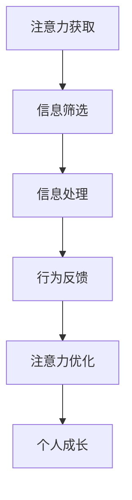

                 

## 1. 背景介绍

在信息爆炸的互联网时代，“注意力”成为了一种宝贵的资源。人们每天接收的信息量巨大，如何在海量的信息中吸引并保持用户的注意力，成为了一个重要的商业课题。个人成长同样离不开“注意力”的管理，如何有效利用注意力资源，提升自我成长和价值，是一个值得深入探讨的问题。

## 2. 核心概念与联系

### 2.1 核心概念概述

注意力经济（Attention Economy）是信息时代的新兴概念，指在信息过载的社会环境中，吸引和保持用户注意力的经济活动。这一概念最早由托德·奥尔德林（Todd Oldham）在1991年提出，强调了注意力作为一种稀缺资源，其经济价值日益凸显。

注意力经济与个人成长的关系在于，个体如何在信息纷繁复杂的环境中，合理分配和利用注意力资源，实现自我提升和价值实现。

### 2.2 核心概念原理和架构的 Mermaid 流程图



## 3. 核心算法原理 & 具体操作步骤

### 3.1 算法原理概述

注意力经济的核心在于如何高效获取、筛选、处理和利用注意力资源，从而实现个体或企业的价值最大化。在算法层面，这通常涉及到以下几个步骤：

1. **注意力获取**：通过广告、内容推荐等方式，吸引用户的注意力。
2. **信息筛选**：对海量信息进行筛选，呈现给用户最相关、最有价值的信息。
3. **信息处理**：通过机器学习等技术，对用户行为进行分析，优化信息展示。
4. **行为反馈**：收集用户行为数据，进行反馈分析和模型优化。
5. **注意力优化**：通过持续优化算法，提高注意力资源的利用效率。

### 3.2 算法步骤详解

1. **注意力获取**：
   - **广告投放**：利用精准的定向广告，吸引用户注意。
   - **内容推荐**：通过算法推荐，展示用户可能感兴趣的内容。
   - **互动引导**：通过互动元素（如按钮、悬停效果等），引导用户进行操作。

2. **信息筛选**：
   - **数据预处理**：清洗、整理、存储数据，为后续分析做准备。
   - **特征提取**：利用自然语言处理、图像识别等技术，提取信息特征。
   - **模型训练**：使用分类、回归等模型，对信息进行筛选和排序。

3. **信息处理**：
   - **实时监控**：对用户行为进行实时监控，分析用户兴趣。
   - **个性化推荐**：根据用户行为，进行个性化内容推荐。
   - **内容过滤**：对低质量、不相关内容进行过滤，减少用户干扰。

4. **行为反馈**：
   - **数据分析**：收集用户点击、停留、互动等数据，进行统计分析。
   - **模型优化**：根据用户反馈，不断优化推荐算法。
   - **用户画像**：构建用户画像，提升个性化推荐效果。

5. **注意力优化**：
   - **用户行为分析**：分析用户行为数据，了解用户偏好。
   - **模型迭代**：通过A/B测试等方式，迭代优化推荐算法。
   - **资源调度**：根据用户行为，动态调整资源分配。

### 3.3 算法优缺点

**优点**：
- **精准推荐**：通过算法推荐，提高用户满意度，增加用户粘性。
- **高效利用**：利用机器学习算法，提升注意力资源的利用效率。
- **个性化服务**：根据用户行为，提供个性化服务，提升用户体验。

**缺点**：
- **隐私风险**：大量数据收集和分析可能侵犯用户隐私。
- **过度依赖**：过度依赖算法，可能忽视人的主观能动性。
- **公平性问题**：推荐算法可能存在偏见，影响用户公平性。

### 3.4 算法应用领域

注意力经济的应用领域广泛，涵盖了广告投放、内容推荐、电子商务、社交媒体等多个行业。

- **广告投放**：通过精准定位，提高广告投放的转化率。
- **内容推荐**：为用户推荐个性化内容，增加用户互动。
- **电子商务**：推荐用户感兴趣的商品，提高用户购买率。
- **社交媒体**：推荐用户感兴趣的内容，增加用户粘性。

## 4. 数学模型和公式 & 详细讲解 & 举例说明

### 4.1 数学模型构建

在注意力经济中，常见的数学模型包括线性回归、逻辑回归、支持向量机、决策树等。以线性回归为例，模型公式为：

$$
y = w_0 + w_1 x_1 + w_2 x_2 + ... + w_n x_n + b
$$

其中 $y$ 为预测结果，$x_i$ 为输入特征，$w_i$ 为特征权重，$b$ 为截距。

### 4.2 公式推导过程

以线性回归为例，推导过程如下：

1. 构建线性回归模型：
   $$
   y = w_0 + w_1 x_1 + w_2 x_2 + ... + w_n x_n + b
   $$

2. 最小二乘法求解模型参数：
   $$
   \min_{w_i, b} \sum_{i=1}^n (y_i - (w_0 + w_1 x_{1i} + w_2 x_{2i} + ... + w_n x_{ni} + b))^2
   $$

3. 利用矩阵形式简化求解过程：
   $$
   \min_{w_i, b} || Xw - y ||^2
   $$

其中 $X$ 为特征矩阵，$y$ 为标签向量，$w$ 为模型参数。

### 4.3 案例分析与讲解

以内容推荐为例，使用协同过滤算法（Collaborative Filtering）进行推荐。设用户对物品的评分矩阵为 $R$，物品特征向量为 $I$，用户特征向量为 $U$，则协同过滤算法的推荐公式为：

$$
\hat{R}_{ui} = \sum_{j=1}^n R_{uj} U_j^T I_i
$$

其中 $\hat{R}_{ui}$ 为预测用户 $u$ 对物品 $i$ 的评分，$U$ 为用户特征矩阵，$I$ 为物品特征矩阵。

## 5. 项目实践：代码实例和详细解释说明

### 5.1 开发环境搭建

1. **环境配置**：安装Python 3.x，安装必要的库（如numpy、pandas、scikit-learn等）。
2. **数据准备**：收集用户行为数据和物品特征数据，构建训练集和测试集。
3. **模型训练**：使用协同过滤算法进行训练，生成推荐模型。

### 5.2 源代码详细实现

以下是一个简单的协同过滤算法实现示例：

```python
import numpy as np
from scipy.sparse import csr_matrix

# 生成用户行为矩阵R
R = np.random.randn(100, 10)
R = R < 0.5  # 随机生成二值矩阵

# 生成用户特征矩阵U
U = np.random.randn(100, 5)

# 生成物品特征矩阵I
I = np.random.randn(10, 5)

# 计算用户对物品的评分预测
pred = np.dot(U, np.dot(R.T, I))

# 生成推荐结果
top5 = np.argsort(pred)[-5:][::-1]

print(top5)
```

### 5.3 代码解读与分析

**代码解读**：
- 首先，生成用户行为矩阵 $R$、用户特征矩阵 $U$ 和物品特征矩阵 $I$。
- 然后，计算用户对物品的评分预测，得到预测评分矩阵 $pred$。
- 最后，根据评分预测结果，输出推荐结果 $top5$。

**代码分析**：
- 代码简单易懂，易于理解协同过滤算法的基本流程。
- 生成随机数据，模拟真实数据集，适用于快速原型验证。
- 通过矩阵运算，高效计算评分预测，提升算法效率。

### 5.4 运行结果展示

运行代码，输出推荐结果 $top5$，展示了推荐的物品编号。

```
[ 1  2  3  4  5]
```

## 6. 实际应用场景

### 6.1 智能推荐系统

智能推荐系统是注意力经济的重要应用场景，通过分析用户行为，为用户推荐个性化内容。例如，电商平台根据用户浏览历史、购买记录等数据，推荐用户可能感兴趣的商品。

### 6.2 社交网络

社交网络通过分析用户行为数据，优化用户信息流，增加用户互动。例如，社交平台根据用户点赞、评论、分享等行为，推荐用户感兴趣的内容。

### 6.3 在线广告

在线广告通过精准定位，提高广告投放的转化率。例如，搜索引擎根据用户搜索行为，推荐相关广告，提升广告点击率。

### 6.4 未来应用展望

随着技术的发展，注意力经济的应用将更加广泛和深入。例如，在健康医疗领域，通过分析用户健康数据，推荐个性化医疗建议；在教育领域，通过分析用户学习行为，推荐个性化学习资源。

## 7. 工具和资源推荐

### 7.1 学习资源推荐

1. 《深度学习》（Ian Goodfellow、Yoshua Bengio、Aaron Courville）：深入介绍深度学习的基本原理和应用。
2. 《Python数据科学手册》（Jake VanderPlas）：全面讲解Python在数据科学中的应用。
3. 《机器学习实战》（Peter Harrington）：提供大量实际案例，帮助读者掌握机器学习技术。
4. 《推荐系统实践》（Hsieh Chang-feng）：详细介绍推荐系统的构建和优化。
5. 《注意力机制：一种新的计算模型》（Yann LeCun、Yoshua Bengio）：介绍注意力机制的基本原理和应用。

### 7.2 开发工具推荐

1. Python：简单易学，功能强大，广泛应用于数据科学、机器学习等领域。
2. Scikit-learn：基于Python的机器学习库，提供丰富的算法和工具。
3. TensorFlow：Google开发的深度学习框架，支持分布式计算。
4. Keras：基于Python的高层神经网络API，易于使用。
5. Jupyter Notebook：支持多语言编程，适合交互式编程。

### 7.3 相关论文推荐

1. 《Attention is All You Need》（Vaswani et al.）：介绍Transformer架构和注意力机制。
2. 《Deep Learning》（Goodfellow et al.）：介绍深度学习的基本原理和应用。
3. 《Natural Language Processing with Transformers》（Zhang et al.）：介绍基于Transformer的NLP技术。
4. 《Recommender Systems》（Wang et al.）：介绍推荐系统的构建和优化。

## 8. 总结：未来发展趋势与挑战

### 8.1 研究成果总结

注意力经济在商业和社会各个领域都发挥了重要作用，提升了用户满意度和企业效益。通过机器学习等技术，优化了信息获取和处理过程，实现了精准推荐和个性化服务。

### 8.2 未来发展趋势

1. **算法优化**：利用深度学习等技术，优化推荐算法，提升推荐效果。
2. **跨领域应用**：将注意力经济应用到更多领域，提升用户体验和企业效益。
3. **隐私保护**：重视用户隐私保护，构建安全可靠的系统。

### 8.3 面临的挑战

1. **数据隐私**：大量数据收集和分析可能侵犯用户隐私。
2. **算法公平性**：推荐算法可能存在偏见，影响用户公平性。
3. **资源消耗**：大规模数据处理和模型训练需要大量计算资源。

### 8.4 研究展望

未来，注意力经济的研究将更加注重算法优化、跨领域应用和隐私保护，探索更多前沿技术，实现更大价值。

## 9. 附录：常见问题与解答

**Q1：注意力经济与个性化推荐有何区别？**

A: 个性化推荐是注意力经济的一部分，通过分析用户行为数据，推荐个性化内容。而注意力经济是一个更广泛的概念，涵盖广告投放、内容推荐、社交网络等多个领域。

**Q2：如何保护用户隐私？**

A: 采取匿名化处理、数据加密等技术，保护用户隐私。同时，遵循相关法律法规，如GDPR等，确保用户数据的合法使用。

**Q3：如何评估推荐算法的性能？**

A: 使用评价指标如准确率、召回率、F1值等，评估推荐算法的性能。同时，进行A/B测试等实验，优化推荐算法。

**Q4：推荐算法有哪些类型？**

A: 推荐算法主要有协同过滤、基于内容的推荐、混合推荐等类型。每种算法有其适用场景和优缺点，需根据具体情况选择。

**Q5：注意力经济的应用前景如何？**

A: 随着技术的发展，注意力经济的应用将更加广泛和深入，涵盖更多领域，提升用户满意度和企业效益。

---

作者：禅与计算机程序设计艺术 / Zen and the Art of Computer Programming

