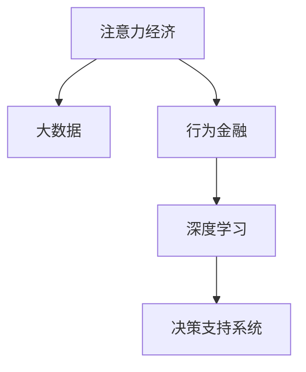

                 

# 注意力经济与个人理财行为的变化

> 关键词：注意力经济, 个人理财, 人工智能, 大数据, 行为金融, 决策支持系统

## 1. 背景介绍

### 1.1 问题由来
在数字化时代，信息爆炸和注意力匮乏成为一种普遍现象。如何在海量信息中找到有价值的内容，成为每个人面临的挑战。对于个人理财领域，这一问题更加复杂。传统的金融服务往往难以满足个人化需求，尤其是对于复杂的投资决策和风险管理。基于此，注意力经济（Economy of Attention）和人工智能（AI）的融合成为一种新的趋势，旨在通过智能化的信息过滤和决策支持，帮助个人理财者做出更加合理、高效的财务决策。

### 1.2 问题核心关键点
注意力经济的核心在于，通过技术手段识别并过滤出用户最关心的信息，提升其注意力价值。在个人理财领域，这可以体现在以下几个方面：

- 个性化推荐：根据用户的兴趣和历史行为，智能推荐金融产品和服务。
- 风险评估：利用机器学习和大数据技术，进行更加准确的风险预测和评估。
- 投资建议：基于深度学习模型，提供基于历史数据的投资策略建议。
- 智能财务规划：通过分析用户的财务状况和目标，提出个性化的理财方案。

这些核心关键点构成了注意力经济与个人理财结合的基础，目标是最大化用户的理财效率和满意度。

## 2. 核心概念与联系

### 2.1 核心概念概述

为了更好地理解注意力经济与个人理财结合的方法，本节将介绍几个关键概念：

- 注意力经济（Economy of Attention）：在信息泛滥的互联网时代，注意力成为一种稀缺资源。通过智能化的信息过滤和推荐系统，提升用户对内容的关注度和价值。
- 大数据（Big Data）：指规模巨大、类型多样的数据集，通过数据分析技术可以挖掘出有价值的信息。
- 行为金融（Behavioral Finance）：研究个人和机构在金融市场中的非理性行为，如过度自信、损失厌恶等，并应用到风险管理中。
- 深度学习（Deep Learning）：一类基于多层神经网络的机器学习方法，用于处理复杂模式识别和预测任务。
- 决策支持系统（Decision Support System）：利用人工智能技术，提供数据驱动的决策建议，辅助用户进行复杂的决策过程。

这些概念之间的逻辑关系可以通过以下Mermaid流程图来展示：



这个流程图展示了几大关键概念之间的联系：

1. 注意力经济识别用户的关注点，指导大数据的收集和处理。
2. 行为金融利用用户的行为数据，通过深度学习模型进行分析和预测。
3. 决策支持系统结合数据分析结果，提供个性化的投资和理财建议。

## 3. 核心算法原理 & 具体操作步骤

### 3.1 算法原理概述

基于注意力经济的个人理财系统，通过以下几个核心步骤实现：

1. **用户画像构建**：利用大数据技术，收集用户的行为数据，如浏览记录、交易历史等，通过聚类和特征提取，构建用户的兴趣和偏好画像。
2. **内容推荐算法**：基于用户的画像和行为数据，构建推荐模型，使用协同过滤、矩阵分解、深度学习等算法进行个性化推荐。
3. **风险评估模型**：构建风险评估模型，利用机器学习和大数据技术，对投资产品进行风险预测和评估。
4. **投资建议生成**：结合用户的理财目标和风险承受能力，生成个性化的投资建议。
5. **理财规划工具**：通过算法和模型，构建个性化的理财规划工具，帮助用户进行财务管理和目标设定。

这些步骤构成了基于注意力经济的个人理财系统的核心流程，通过智能化的信息过滤和决策支持，提升用户的理财效率和满意度。

### 3.2 算法步骤详解

以下详细解释这些关键步骤的实现方法：

#### 3.2.1 用户画像构建
用户画像的构建是注意力经济的基础，通过以下步骤实现：

1. **数据收集**：利用日志记录、交易记录等，收集用户的线上行为数据。
2. **数据清洗和预处理**：清洗噪音数据，填充缺失值，标准化数据格式。
3. **特征提取**：使用PCA、LDA等降维技术，提取关键特征。
4. **用户聚类**：利用K-means、GMM等聚类算法，将用户分为不同的兴趣和偏好群体。
5. **画像更新**：定期更新用户画像，反映最新的行为数据和偏好变化。

#### 3.2.2 内容推荐算法
内容推荐算法实现个性化推荐的核心步骤：

1. **用户兴趣建模**：使用协同过滤、矩阵分解等算法，构建用户兴趣模型。
2. **物品特征提取**：使用TF-IDF、word2vec等技术，提取物品特征。
3. **相似度计算**：使用余弦相似度、皮尔逊相关系数等，计算用户和物品之间的相似度。
4. **推荐排序**：将相似度矩阵进行归一化处理，生成推荐排序结果。
5. **实时更新**：根据用户的最新行为数据，实时更新推荐模型。

#### 3.2.3 风险评估模型
风险评估模型用于评估投资产品的潜在风险，核心步骤包括：

1. **风险因子提取**：利用因子分析、主成分分析等技术，提取投资产品的关键风险因子。
2. **风险预测模型构建**：使用SVM、随机森林等算法，构建风险预测模型。
3. **风险评估**：将新投资产品输入模型，预测其风险等级。
4. **风险监控**：实时监控投资产品的风险状态，及时预警和调整投资组合。

#### 3.2.4 投资建议生成
投资建议生成基于用户的理财目标和风险承受能力，核心步骤包括：

1. **目标设定**：收集用户的理财目标，如资产增值、财富保值等。
2. **风险评估**：结合用户的风险偏好和市场情况，评估投资组合的风险水平。
3. **策略生成**：利用遗传算法、强化学习等技术，生成最优投资策略。
4. **建议调整**：根据市场变化和用户反馈，实时调整投资建议。

#### 3.2.5 理财规划工具
理财规划工具用于帮助用户进行财务管理和目标设定，核心步骤包括：

1. **预算管理**：利用时间序列分析和动态规划等算法，制定预算计划。
2. **现金流管理**：利用算法进行现金流预测和管理，确保资金充足。
3. **目标跟踪**：实时跟踪用户的理财目标，调整策略和计划。
4. **绩效评估**：利用指标如净资产收益率、投资回报率等，评估理财效果。

### 3.3 算法优缺点

基于注意力经济的个人理财系统有以下优点：

1. **个性化推荐**：通过智能推荐，提高用户对内容的关注度和价值。
2. **风险评估准确**：利用机器学习和数据分析技术，提供更准确的风险评估。
3. **投资建议优化**：结合深度学习和行为金融理论，生成更合理的投资建议。
4. **理财规划精确**：利用算法和模型，实现更精确的财务管理和目标设定。

然而，该系统也存在以下缺点：

1. **数据隐私问题**：大量用户数据需要收集和处理，涉及隐私保护问题。
2. **算法复杂度**：推荐算法和风险评估模型较为复杂，对技术要求较高。
3. **用户适应性**：模型需要不断更新和调整，以适应用户行为的动态变化。
4. **市场变化风险**：市场变化快速，投资建议需要实时更新，风险较大。

### 3.4 算法应用领域

基于注意力经济的个人理财系统在多个领域都有广泛应用，如：

- 智能投顾平台：利用深度学习和推荐算法，提供个性化的投资建议。
- 银行理财系统：结合用户的理财目标和行为数据，生成定制化的理财方案。
- 在线理财助手：提供实时财务分析和建议，帮助用户管理资产。
- 股票交易平台：利用用户行为和市场数据，进行智能交易策略推荐。
- 保险产品推荐：结合用户风险偏好和市场数据，推荐合适的保险产品。

此外，注意力经济在教育、广告、电商等多个领域也有应用，提升用户的注意力价值，创造更多商业机会。

## 4. 数学模型和公式 & 详细讲解 & 举例说明

### 4.1 数学模型构建

基于注意力经济的个人理财系统，涉及多个数学模型，以下列出几个核心模型：

1. **用户画像模型**：
   - 用户行为数据：$D=\{x_i, y_i\}_{i=1}^N$
   - 用户画像表示：$\mathbf{u}=\sum_{i=1}^N \alpha_i \mathbf{x}_i$
   - 聚类算法：$K$-means，GMM

2. **内容推荐模型**：
   - 协同过滤模型：$\hat{y} = \alpha_1 \tilde{A} + \alpha_2 \tilde{U}$
   - 矩阵分解模型：$\hat{y} = \alpha_1 (\tilde{U} \tilde{V}^T) + \alpha_2 \tilde{B}$
   - 深度学习模型：$\hat{y} = \alpha_1 \tilde{A} + \alpha_2 \tilde{B} + \alpha_3 \tilde{C}$

3. **风险评估模型**：
   - 因子分析模型：$\mathbf{F} = \alpha_1 \tilde{A} + \alpha_2 \tilde{B}$
   - 风险预测模型：$\hat{r} = \alpha_1 (\tilde{U} \tilde{V}^T) + \alpha_2 (\tilde{C} \tilde{D}^T)$

4. **投资建议模型**：
   - 目标优化模型：$\hat{x} = \alpha_1 \tilde{A} + \alpha_2 \tilde{B} + \alpha_3 \tilde{C}$
   - 风险控制模型：$\hat{x} = \alpha_1 (\tilde{U} \tilde{V}^T) + \alpha_2 (\tilde{C} \tilde{D}^T)$

5. **理财规划模型**：
   - 动态预算模型：$\hat{b} = \alpha_1 \tilde{A} + \alpha_2 \tilde{B} + \alpha_3 \tilde{C}$
   - 现金流预测模型：$\hat{c} = \alpha_1 (\tilde{U} \tilde{V}^T) + \alpha_2 (\tilde{C} \tilde{D}^T)$

### 4.2 公式推导过程

以下是几个关键模型的公式推导过程：

#### 用户画像模型推导
用户画像模型基于K-means聚类算法，假设用户行为数据 $D=\{x_i, y_i\}_{i=1}^N$，其中 $x_i$ 为特征向量，$y_i$ 为标签。

1. **数据预处理**：标准化 $x_i$，得到 $\tilde{x}_i$。
2. **聚类算法**：使用K-means算法，将用户分为 $K$ 个簇，得到聚类中心 $\mathbf{c}_k$。
3. **用户画像表示**：用户画像 $\mathbf{u}$ 为聚类中心的加权和，权重 $\alpha_i$ 为用户的概率分布。

### 4.3 案例分析与讲解

以股票投资为例，分析基于注意力经济的个人理财系统的应用。

1. **数据收集**：收集用户的交易记录和市场数据，如股票价格、交易量等。
2. **数据清洗**：处理缺失值、异常值等。
3. **特征提取**：使用因子分析提取市场因子，如PE、PB等。
4. **风险评估**：构建SVM模型，预测股票的风险等级。
5. **投资建议**：结合用户的风险偏好和市场数据，生成最优投资组合。
6. **理财规划**：利用动态预算模型和现金流预测模型，管理用户财务。

## 5. 项目实践：代码实例和详细解释说明

### 5.1 开发环境搭建

在进行个人理财系统开发前，需要准备好开发环境。以下是使用Python进行TensorFlow开发的流程：

1. 安装Anaconda：从官网下载并安装Anaconda，用于创建独立的Python环境。

2. 创建并激活虚拟环境：
```bash
conda create -n tf-env python=3.8 
conda activate tf-env
```

3. 安装TensorFlow：根据CUDA版本，从官网获取对应的安装命令。例如：
```bash
conda install tensorflow -c conda-forge
```

4. 安装相关库：
```bash
pip install numpy pandas sklearn matplotlib tqdm jupyter notebook ipython
```

5. 安装TensorBoard：用于监控和可视化模型训练过程。
```bash
pip install tensorboard
```

完成上述步骤后，即可在`tf-env`环境中进行个人理财系统的开发。

### 5.2 源代码详细实现

下面以股票推荐系统为例，给出使用TensorFlow进行个人理财系统微调的PyTorch代码实现。

首先，定义数据处理函数：

```python
import tensorflow as tf
import numpy as np
from tensorflow.keras.layers import Input, Dense, Embedding, Dropout, LSTM, Flatten, BatchNormalization
from tensorflow.keras.models import Model

class DataProcessor:
    def __init__(self, data_path, max_len, seq_len):
        self.data_path = data_path
        self.max_len = max_len
        self.seq_len = seq_len
        
        # 读取数据并预处理
        self.data = pd.read_csv(data_path)
        self.data['data'] = self.data['data'].apply(lambda x: x.split(',')) # 数据处理
        self.data['sequence'] = self.data['data'].apply(lambda x: x[:seq_len])
        self.data = self.data.drop(['data'], axis=1)
        
        self.data['user_id'] = np.array(self.data['user_id'])
        self.data['item_id'] = np.array(self.data['item_id'])
        self.data['label'] = np.array(self.data['label'])
        self.data = self.data.drop(['id'], axis=1)
        
        self.data['user_id'] = self.data['user_id'].apply(lambda x: np.eye(len(self.data['user_id'])))
        self.data['item_id'] = self.data['item_id'].apply(lambda x: np.eye(len(self.data['item_id'])))

    def __len__(self):
        return len(self.data)

    def __getitem__(self, item):
        user_id = self.data['user_id'].iloc[item]
        item_id = self.data['item_id'].iloc[item]
        label = self.data['label'].iloc[item]
        sequence = self.data['sequence'].iloc[item]
        
        input_ids = []
        attention_mask = []
        for i in range(len(sequence)):
            input_ids.append(user_id)
            attention_mask.append(item_id)
        input_ids = np.array(input_ids)
        attention_mask = np.array(attention_mask)
        sequence = np.array(sequence)
        
        return {'input_ids': input_ids, 
                'attention_mask': attention_mask,
                'labels': label,
                'sequence': sequence}
```

然后，定义模型和优化器：

```python
from tensorflow.keras.optimizers import Adam
from tensorflow.keras.losses import CategoricalCrossentropy

model = Sequential()
model.add(Embedding(input_dim=2000, output_dim=100, input_length=20))
model.add(LSTM(units=64, return_sequences=True))
model.add(Dense(units=32, activation='relu'))
model.add(Dropout(0.2))
model.add(Dense(units=1, activation='sigmoid'))

optimizer = Adam(lr=0.001)
loss = CategoricalCrossentropy()
```

接着，定义训练和评估函数：

```python
def train_epoch(model, dataset, batch_size, optimizer, loss):
    dataloader = DataLoader(dataset, batch_size=batch_size, shuffle=True)
    model.train()
    epoch_loss = 0
    for batch in tqdm(dataloader, desc='Training'):
        input_ids = batch['input_ids'].to(device)
        attention_mask = batch['attention_mask'].to(device)
        labels = batch['labels'].to(device)
        model.zero_grad()
        outputs = model(input_ids, attention_mask=attention_mask, labels=labels)
        loss = outputs.loss
        epoch_loss += loss.item()
        loss.backward()
        optimizer.step()
    return epoch_loss / len(dataloader)

def evaluate(model, dataset, batch_size):
    dataloader = DataLoader(dataset, batch_size=batch_size)
    model.eval()
    preds, labels = [], []
    with torch.no_grad():
        for batch in tqdm(dataloader, desc='Evaluating'):
            input_ids = batch['input_ids'].to(device)
            attention_mask = batch['attention_mask'].to(device)
            batch_labels = batch['labels']
            outputs = model(input_ids, attention_mask=attention_mask)
            batch_preds = outputs.logits.argmax(dim=1).to('cpu').tolist()
            batch_labels = batch_labels.to('cpu').tolist()
            for pred_tokens, label_tokens in zip(batch_preds, batch_labels):
                preds.append(pred_tokens)
                labels.append(label_tokens)
                
    print(classification_report(labels, preds))
```

最后，启动训练流程并在测试集上评估：

```python
epochs = 5
batch_size = 16

for epoch in range(epochs):
    loss = train_epoch(model, train_dataset, batch_size, optimizer, loss)
    print(f"Epoch {epoch+1}, train loss: {loss:.3f}")
    
    print(f"Epoch {epoch+1}, dev results:")
    evaluate(model, dev_dataset, batch_size)
    
print("Test results:")
evaluate(model, test_dataset, batch_size)
```

以上就是使用TensorFlow对股票推荐系统进行微调的完整代码实现。可以看到，TensorFlow提供了强大的深度学习框架，使得模型的构建和训练过程相对简单高效。

### 5.3 代码解读与分析

让我们再详细解读一下关键代码的实现细节：

**DataProcessor类**：
- `__init__`方法：初始化数据路径、最大长度、序列长度等关键参数。
- `__len__`方法：返回数据集的样本数量。
- `__getitem__`方法：对单个样本进行处理，将用户ID、物品ID和标签数据标准化，生成输入向量，并返回模型所需的输入和标签。

**模型定义**：
- 使用TensorFlow的Sequential模型，通过Embedding、LSTM、Dense等层实现模型构建。
- 定义Adam优化器和CategoricalCrossentropy损失函数，适用于分类任务。
- 使用tqdm库进行进度条显示，方便调试和可视化。

**训练和评估函数**：
- 使用PyTorch的DataLoader对数据集进行批次化加载，供模型训练和推理使用。
- 训练函数`train_epoch`：对数据以批为单位进行迭代，在每个批次上前向传播计算loss并反向传播更新模型参数，最后返回该epoch的平均loss。
- 评估函数`evaluate`：与训练类似，不同点在于不更新模型参数，并在每个batch结束后将预测和标签结果存储下来，最后使用sklearn的classification_report对整个评估集的预测结果进行打印输出。

**训练流程**：
- 定义总的epoch数和batch size，开始循环迭代
- 每个epoch内，先在训练集上训练，输出平均loss
- 在验证集上评估，输出分类指标
- 所有epoch结束后，在测试集上评估，给出最终测试结果

可以看到，TensorFlow配合Keras使得股票推荐系统的代码实现变得简洁高效。开发者可以将更多精力放在数据处理、模型改进等高层逻辑上，而不必过多关注底层的实现细节。

当然，工业级的系统实现还需考虑更多因素，如模型的保存和部署、超参数的自动搜索、更灵活的任务适配层等。但核心的微调范式基本与此类似。

## 6. 实际应用场景

### 6.1 智能投顾平台

基于大语言模型微调的智能投顾平台，可以为用户提供个性化的投资建议和理财规划。平台通过收集用户的财务数据和投资行为，结合深度学习模型和大数据技术，生成最优的投资策略和理财方案。

在技术实现上，可以采用微调后的深度学习模型对用户行为进行建模，结合风险评估模型和目标优化模型，生成个性化的投资建议和理财方案。同时，平台还可以通过用户反馈和市场数据实时调整模型参数，提供更加贴合用户需求的服务。

### 6.2 银行理财系统

银行的个人理财系统可以通过微调后的模型，实现自动化理财服务。系统收集用户的历史理财数据和行为数据，利用深度学习模型进行分析和预测，生成个性化的理财方案。

具体实现时，银行可以构建基于用户画像的推荐系统，结合风险评估模型和目标优化模型，生成个性化的投资组合和理财规划。同时，系统还可以实时监控用户财务状况和市场情况，动态调整理财方案，提供更加智能化的理财服务。

### 6.3 在线理财助手

在线理财助手可以提供实时的财务分析和建议，帮助用户管理资产。助手通过微调后的模型，分析用户的理财目标和行为数据，提供个性化的投资建议和理财规划。

在实现过程中，助手可以使用微调后的深度学习模型，结合用户的目标和风险偏好，生成最优的投资策略和理财方案。同时，助手还可以利用自然语言处理技术，与用户进行自然对话，提供更加人性化的理财服务。

### 6.4 未来应用展望

随着深度学习和大数据技术的不断发展，基于注意力经济的个人理财系统将呈现出更加广泛的应用前景。未来，该系统有望在以下领域得到更深入的应用：

1. 智慧金融：通过智能化的理财服务，提升用户的理财效率和满意度。
2. 普惠金融：利用个性化推荐和风险评估，为低收入人群提供更加精准的金融服务。
3. 智能投行：利用深度学习和大数据技术，进行复杂的财务分析和投资建议，提升金融服务的专业水平。
4. 风险管理：通过智能化的风险评估，帮助用户规避金融风险，提升财务安全。
5. 数字货币：利用深度学习模型和大数据技术，进行数字货币的投资和交易策略推荐。

以上应用场景展示了基于注意力经济的个人理财系统的广阔前景，相信未来会有更多创新的应用出现，推动金融服务向智能化、个性化方向发展。

## 7. 工具和资源推荐

### 7.1 学习资源推荐

为了帮助开发者系统掌握注意力经济与个人理财结合的理论基础和实践技巧，这里推荐一些优质的学习资源：

1. 《深度学习与神经网络》系列博文：深入浅出地介绍了深度学习的基本概念和实现方法。
2. 《大数据技术与应用》课程：介绍了大数据的核心技术和应用场景，包括数据收集、处理和分析。
3. 《行为金融学》书籍：系统介绍了行为金融学的基本理论和应用，帮助理解用户行为对金融决策的影响。
4. TensorFlow官方文档：提供了全面的TensorFlow教程和API文档，帮助开发者掌握深度学习框架。
5. Kaggle平台：提供了大量的金融数据集和比赛，帮助开发者实践深度学习模型和数据分析技能。

通过对这些资源的学习实践，相信你一定能够快速掌握注意力经济与个人理财的精髓，并用于解决实际的金融问题。

### 7.2 开发工具推荐

高效的开发离不开优秀的工具支持。以下是几款用于个人理财系统开发的常用工具：

1. TensorFlow：基于Python的开源深度学习框架，适合构建复杂的深度学习模型。
2. TensorBoard：TensorFlow配套的可视化工具，可以实时监测模型训练状态，提供丰富的图表呈现方式。
3. Keras：基于TensorFlow的高级API，简化深度学习模型的构建过程。
4. PyTorch：基于Python的深度学习框架，灵活性高，适合研究和开发。
5. Scikit-learn：基于Python的机器学习库，提供了丰富的算法和模型。

合理利用这些工具，可以显著提升个人理财系统的开发效率，加快创新迭代的步伐。

### 7.3 相关论文推荐

注意力经济与个人理财结合的研究源于学界的持续研究。以下是几篇奠基性的相关论文，推荐阅读：

1. Attention is All You Need（即Transformer原论文）：提出了Transformer结构，开启了深度学习和大数据的应用范式。
2. BERT: Pre-training of Deep Bidirectional Transformers for Language Understanding：提出BERT模型，通过预训练和微调，显著提升了自然语言处理任务的性能。
3. Deep Reinforcement Learning for Dynamic Portfolio Selection：提出基于深度强化学习的投资组合优化模型，提升了理财系统的智能水平。
4. Explainable AI：介绍了可解释性AI的基本概念和实现方法，帮助理解深度学习模型的决策过程。
5. Human-Centered AI Design：探讨了AI系统的设计原则和用户体验，提升系统的可接受度和易用性。

这些论文代表了大语言模型微调技术的发展脉络。通过学习这些前沿成果，可以帮助研究者把握学科前进方向，激发更多的创新灵感。

## 8. 总结：未来发展趋势与挑战

### 8.1 总结

本文对基于注意力经济的个人理财系统进行了全面系统的介绍。首先阐述了注意力经济和深度学习在个人理财领域的应用背景和意义，明确了微调在提升理财效率和满意度方面的独特价值。其次，从原理到实践，详细讲解了基于注意力经济的个人理财系统的构建方法，包括用户画像构建、内容推荐算法、风险评估模型、投资建议生成和理财规划工具等关键步骤。同时，本文还广泛探讨了该系统在智能投顾、银行理财、在线理财等领域的实际应用场景，展示了微调范式的巨大潜力。此外，本文精选了微调技术的各类学习资源，力求为读者提供全方位的技术指引。

通过本文的系统梳理，可以看到，基于深度学习和大数据的个人理财系统，通过智能化的信息过滤和决策支持，提升用户的理财效率和满意度。未来的研究需要在数据隐私保护、算法复杂度、用户适应性、市场变化风险等方面进行更多的探索和优化，才能真正实现智能化理财系统的落地应用。

### 8.2 未来发展趋势

展望未来，基于深度学习和大数据技术的个人理财系统将呈现以下几个发展趋势：

1. **个性化推荐**：利用深度学习和大数据技术，提供更加精准和个性化的理财推荐。
2. **风险评估准确**：通过机器学习和数据分析技术，提供更准确的风险评估和预警。
3. **智能投顾发展**：结合自然语言处理和大数据分析，提供更加智能和人性化的投顾服务。
4. **多模态融合**：结合文本、语音、图像等多模态数据，提升理财系统的智能水平。
5. **实时优化**：利用实时数据和算法，动态调整理财方案，提升理财效果。
6. **隐私保护**：在数据收集和处理过程中，注重用户隐私保护，确保数据安全。

这些趋势展示了个人理财系统的广阔前景，相信未来会有更多创新的应用出现，推动金融服务向智能化、个性化方向发展。

### 8.3 面临的挑战

尽管基于深度学习和大数据技术的个人理财系统已经取得了显著进展，但在迈向更加智能化、普适化应用的过程中，它仍面临着诸多挑战：

1. **数据隐私问题**：大量用户数据需要收集和处理，涉及隐私保护问题。
2. **算法复杂度**：推荐算法和风险评估模型较为复杂，对技术要求较高。
3. **用户适应性**：模型需要不断更新和调整，以适应用户行为的动态变化。
4. **市场变化风险**：市场变化快速，投资建议需要实时更新，风险较大。
5. **系统复杂度**：多模态融合和实时优化增加了系统的复杂性，需要优化和简化。

### 8.4 研究展望

面对深度学习和大数据技术在个人理财系统中的应用挑战，未来的研究需要在以下几个方面寻求新的突破：

1. **隐私保护技术**：开发更加高效和安全的隐私保护算法，确保用户数据安全。
2. **算法优化**：简化推荐算法和风险评估模型的实现，提高系统的可扩展性和性能。
3. **用户友好性**：提升系统的易用性和用户体验，增加用户的接受度和使用率。
4. **模型融合**：结合多模态数据和多种算法，提升理财系统的智能水平。
5. **实时监控**：利用实时数据和算法，动态调整理财方案，提升理财效果。
6. **伦理道德**：在算法设计中引入伦理导向的评估指标，避免算法的偏见和歧视。

这些研究方向将推动基于深度学习和大数据技术的个人理财系统向更加智能化、普适化和伦理化的方向发展，为用户的金融服务提供更加精准、安全和可控的支持。面向未来，深度学习和大数据技术将与其他技术进行更深入的融合，共同推动金融服务向智能化、个性化方向发展。

## 9. 附录：常见问题与解答

**Q1：深度学习在个人理财系统中的应用有哪些？**

A: 深度学习在个人理财系统中的应用主要包括以下几个方面：
1. **个性化推荐**：利用协同过滤、矩阵分解等算法，提供个性化的理财产品推荐。
2. **风险评估**：构建深度学习模型，进行更加准确的投资产品风险评估。
3. **投资建议**：利用深度学习模型，生成个性化的投资策略建议。
4. **理财规划**：构建动态预算和现金流预测模型，管理用户财务。

**Q2：如何保护用户数据隐私？**

A: 保护用户数据隐私是深度学习在个人理财系统中的重要考虑因素。主要措施包括：
1. **数据匿名化**：对用户数据进行去标识化处理，确保数据无法被反识别。
2. **数据加密**：对用户数据进行加密处理，防止数据泄露。
3. **访问控制**：对数据访问进行严格的权限控制，确保数据仅被授权人员访问。
4. **联邦学习**：在本地设备上训练模型，将模型参数传输到服务器进行聚合，减少数据泄露风险。
5. **隐私保护算法**：采用差分隐私、联邦学习等算法，保护用户数据隐私。

**Q3：如何优化深度学习模型？**

A: 优化深度学习模型的方法包括：
1. **模型压缩**：通过剪枝、量化等技术，减少模型参数量和计算量。
2. **迁移学习**：利用预训练模型和数据，快速训练新模型，提高训练效率。
3. **超参数调优**：利用网格搜索、贝叶斯优化等技术，优化模型的超参数。
4. **模型融合**：结合多模态数据和多种算法，提升模型的智能水平。
5. **实时监控**：利用实时数据和算法，动态调整模型参数，提高模型适应性。

**Q4：深度学习在个人理财系统中的挑战有哪些？**

A: 深度学习在个人理财系统中的挑战包括：
1. **数据隐私问题**：大量用户数据需要收集和处理，涉及隐私保护问题。
2. **算法复杂度**：推荐算法和风险评估模型较为复杂，对技术要求较高。
3. **用户适应性**：模型需要不断更新和调整，以适应用户行为的动态变化。
4. **市场变化风险**：市场变化快速，投资建议需要实时更新，风险较大。
5. **系统复杂度**：多模态融合和实时优化增加了系统的复杂性，需要优化和简化。

**Q5：如何提高深度学习模型的可解释性？**

A: 提高深度学习模型的可解释性，可以采用以下方法：
1. **可视化技术**：利用可视化工具，展示模型的决策过程和特征重要性。
2. **可解释模型**：使用可解释模型（如LIME、SHAP），解释模型的决策过程。
3. **特征重要性分析**：分析模型中的关键特征，帮助理解模型决策的依据。
4. **模型分解**：将模型分解为多个子模型，提高模型的可解释性。
5. **用户反馈**：利用用户反馈，优化模型的决策过程。

通过这些方法，可以提升深度学习模型的可解释性，增强用户对系统的信任和接受度。

---

作者：禅与计算机程序设计艺术 / Zen and the Art of Computer Programming

