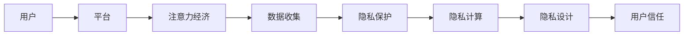

                 

# 注意力经济与个人隐私意识的提升

## 1. 背景介绍

随着互联网的发展，人们越来越习惯于在各类平台上消费时间和注意力。注意力经济(Attention Economy)的概念应运而生，指通过对消费者注意力的争夺和控制，来实现商业价值最大化。与此同时，个人隐私问题也愈发受到关注。用户对隐私的关注度不断提升，对数据安全和隐私保护的要求也日益严格。在当前社会背景下，如何将注意力经济与个人隐私保护相结合，成为我们需要深入探讨和解决的重要问题。

## 2. 核心概念与联系

### 2.1 核心概念概述

1. **注意力经济(Attention Economy)**：指通过吸引和维持用户的注意力，实现商业价值最大化的经济活动。在数字时代，平台通过内容推送、广告投放、社交互动等方式争夺用户的注意力，从而实现盈利。

2. **用户注意力(Attention)**：用户在进行在线活动时，对特定信息或服务的关注程度。注意力是用户参与度、留存率等关键指标的重要因素，影响着平台的商业价值。

3. **个人隐私(Privacy)**：指个人信息的保护，防止未经授权的收集、使用、处理和披露。个人隐私是数字时代用户的基本权利，直接关系到用户的信任感和安全感。

4. **隐私保护(Privacy Protection)**：通过技术和管理手段，保护用户隐私不被侵犯的过程。隐私保护不仅是法律法规的要求，也是平台维持用户信任的基础。

5. **隐私计算(Privacy-Enhancing Computation, PEC)**：指在数据处理过程中，通过差分隐私、同态加密、多方安全计算等技术，保护数据隐私。隐私计算可以实现在不泄露数据的前提下，进行数据处理和分析。

6. **隐私设计(Privacy-by-Design)**：指在产品设计和开发阶段，就考虑隐私保护的原则和措施，融入产品功能之中。隐私设计致力于在满足功能需求的同时，保护用户隐私。

### 2.2 核心概念原理和架构的 Mermaid 流程图



该流程图展示了注意力经济与个人隐私保护的核心概念及其相互关系：

1. **用户**：注意力经济的主体，通过平台消费时间和注意力。
2. **平台**：通过各种手段争夺用户注意力，实现商业价值。
3. **数据收集**：平台收集用户行为数据，用于分析用户需求，提供个性化服务。
4. **隐私保护**：在数据收集和使用过程中，保护用户隐私，防止数据滥用。
5. **隐私计算**：在不泄露用户数据的前提下，进行数据处理和分析。
6. **隐私设计**：在产品设计阶段，融入隐私保护措施，避免数据泄露风险。
7. **用户信任**：通过上述措施，提升用户对平台的信任感。

## 3. 核心算法原理 & 具体操作步骤

### 3.1 算法原理概述

注意力经济与个人隐私保护的结合，可以通过数据隐私保护技术实现。隐私保护的核心在于数据的安全传输和处理，隐私计算技术提供了一种解决方案。

隐私计算包括差分隐私、同态加密、多方安全计算等技术，可以在保护用户隐私的前提下，进行数据分析和处理。差分隐私通过添加噪声，使得单个数据点无法被识别，从而保护用户隐私。同态加密允许在加密数据上进行计算，最终解密得到的结果与直接计算结果相同，保护数据隐私。多方安全计算允许多个参与方在不共享数据的情况下，共同计算一个结果，保护数据隐私。

### 3.2 算法步骤详解

#### 步骤1: 数据收集与预处理

1. 收集用户行为数据，如浏览历史、点击记录、搜索关键词等。
2. 对数据进行清洗和预处理，去除重复和无用数据，保留有用信息。
3. 将数据进行匿名化处理，去除或模糊化个人标识信息。

#### 步骤2: 隐私计算

1. 采用差分隐私技术，对数据添加噪声，使得单个数据点无法被识别。
2. 使用同态加密技术，在加密数据上进行计算，如数据分析、特征提取等。
3. 采用多方安全计算技术，允许多个参与方在不共享数据的情况下，共同计算一个结果。

#### 步骤3: 结果分析与反馈

1. 对隐私计算的结果进行分析，提取有用信息，如用户兴趣、行为模式等。
2. 将分析结果反馈给用户，提供个性化服务，如推荐内容、定制化广告等。
3. 对结果进行隐私保护处理，确保用户隐私不被泄露。

### 3.3 算法优缺点

#### 优点：

1. 保护用户隐私：通过隐私计算技术，保护用户数据隐私，防止数据滥用。
2. 提升用户信任：隐私保护措施提升用户对平台的信任感，增强用户黏性。
3. 提供个性化服务：通过数据分析，提供个性化的推荐和定制化服务，提升用户满意度。

#### 缺点：

1. 技术复杂：隐私计算技术相对复杂，实现难度较大。
2. 性能损耗：隐私计算会增加计算和存储开销，影响系统性能。
3. 数据共享限制：多方安全计算限制了数据的共享，可能影响数据的全面性。

### 3.4 算法应用领域

隐私计算技术在多个领域都有应用：

1. **电商**：保护用户购物习惯和消费记录，防止数据泄露和滥用。
2. **医疗**：保护患者隐私，进行数据分析和疾病预测。
3. **金融**：保护用户交易记录和信用信息，防止数据泄露和欺诈。
4. **社交**：保护用户社交行为和互动数据，防止数据滥用和隐私泄露。
5. **教育**：保护学生学习记录和行为数据，防止数据泄露和滥用。

## 4. 数学模型和公式 & 详细讲解 & 举例说明

### 4.1 数学模型构建

#### 差分隐私模型

差分隐私通过添加噪声，保护个体数据隐私。定义差分隐私的数学模型为：

$$
\mathcal{L}(P, \epsilon) = \sum_{x \in \mathcal{X}} \frac{1}{2}P(x) \log \frac{P(x)}{Q(x)}
$$

其中，$P$ 为真实数据分布，$Q$ 为加入噪声后的分布，$\epsilon$ 为隐私参数。

#### 同态加密模型

同态加密允许在加密数据上进行计算，定义同态加密的数学模型为：

$$
\mathcal{L}(P, C) = \sum_{x \in \mathcal{X}} P(x) \log \frac{P(x)}{C(x)}
$$

其中，$P$ 为真实数据分布，$C$ 为计算结果。

### 4.2 公式推导过程

#### 差分隐私推导

差分隐私的数学模型可以推导为：

$$
\mathcal{L}(P, \epsilon) = \sum_{x \in \mathcal{X}} \frac{1}{2}P(x) \log \frac{P(x)}{Q(x)}
$$

其中，$P(x)$ 为真实数据概率，$Q(x)$ 为加入噪声后的概率。

通过引入拉普拉斯噪声，可以进一步推导为：

$$
Q(x) = P(x) e^{\Delta} + \frac{1}{2} e^{-\Delta}
$$

其中，$\Delta$ 为噪声大小，$\epsilon$ 为隐私参数。

#### 同态加密推导

同态加密的数学模型可以推导为：

$$
\mathcal{L}(P, C) = \sum_{x \in \mathcal{X}} P(x) \log \frac{P(x)}{C(x)}
$$

其中，$P(x)$ 为真实数据概率，$C(x)$ 为计算结果概率。

通过引入同态加密技术，可以进一步推导为：

$$
C(x) = P(x) \cdot f^{-1}(g(x))
$$

其中，$f^{-1}$ 为解密函数，$g(x)$ 为加密函数，$f$ 为加密后的计算结果。

### 4.3 案例分析与讲解

#### 电商个性化推荐

电商平台通过分析用户浏览和购买记录，提供个性化推荐。假设真实数据分布为 $P(x)$，加入噪声后的分布为 $Q(x)$，隐私参数为 $\epsilon$。

1. 数据收集与预处理：收集用户浏览记录 $x$，进行清洗和匿名化处理。
2. 隐私计算：使用差分隐私技术，对数据添加噪声，保护用户隐私。
3. 结果分析与反馈：分析加入噪声后的数据，提取用户兴趣，提供个性化推荐。
4. 结果保护：对推荐结果进行隐私保护处理，确保用户隐私不被泄露。

#### 医疗疾病预测

医疗平台通过分析患者健康数据，进行疾病预测。假设真实数据分布为 $P(x)$，计算结果为 $C(x)$，隐私参数为 $\epsilon$。

1. 数据收集与预处理：收集患者健康记录 $x$，进行清洗和匿名化处理。
2. 隐私计算：使用同态加密技术，在加密数据上进行计算，保护患者隐私。
3. 结果分析与反馈：分析同态加密后的数据，提取疾病预测结果。
4. 结果保护：对疾病预测结果进行隐私保护处理，确保患者隐私不被泄露。

## 5. 项目实践：代码实例和详细解释说明

### 5.1 开发环境搭建

#### 1. 安装Python环境

- 安装Anaconda：从官网下载并安装Anaconda，用于创建独立的Python环境。
- 创建并激活虚拟环境：
```bash
conda create -n py-env python=3.8
conda activate py-env
```

#### 2. 安装相关库

- 安装Numpy、Pandas、Scikit-Learn等科学计算库：
```bash
pip install numpy pandas scikit-learn
```

#### 3. 安装隐私计算库

- 安装差分隐私库PySyft：
```bash
pip install py-syft
```

#### 4. 安装同态加密库

- 安装同态加密库SEAL：
```bash
pip install seal-py
```

### 5.2 源代码详细实现

#### 代码示例1：差分隐私

```python
import numpy as np
from sympy import Rational

def laplace_noise(mu, epsilon):
    sigma = np.sqrt(2) * epsilon
    return np.random.laplace(mu, sigma)

def laplace_mechanism(data, epsilon):
    n = len(data)
    x = np.mean(data)
    noise = laplace_noise(x, epsilon)
    return x + noise

# 示例数据
data = [1, 2, 3, 4, 5]

# 差分隐私机制
epsilon = Rational(1, 10)  # 隐私参数
result = laplace_mechanism(data, epsilon)
print(result)
```

#### 代码示例2：同态加密

```python
from seal import SEALContext, BooleanEncryptionScheme

# 初始化SEAL上下文
context = SEALContext()

# 示例数据
data = [True, True, False, False, True]

# 加密数据
keypair = context.generate_keypair()
plaintext = [int(d) for d in data]
enc = context.encrypt(plaintext, keypair.public_key)
ciphertext = list(enc)

# 解密数据
keypair = context.keypair_from_private_key(keypair.private_key)
dec = context.decrypt(ciphertext, keypair)
decrypted_data = [int(d) for d in dec]

# 结果分析
print(decrypted_data)
```

### 5.3 代码解读与分析

#### 代码示例1：差分隐私

- `laplace_noise`函数：添加拉普拉斯噪声，保护单个数据点隐私。
- `laplace_mechanism`函数：对数据进行差分隐私处理，保护整体数据隐私。
- 示例数据：定义示例数据集，包含用户浏览记录。
- 隐私参数：设置隐私参数，保护单个数据点隐私。
- 结果输出：输出差分隐私处理后的结果，保护用户隐私。

#### 代码示例2：同态加密

- `SEALContext`类：初始化SEAL上下文，用于同态加密。
- `generate_keypair`方法：生成密钥对，用于加密和解密。
- `encrypt`方法：加密数据，保护数据隐私。
- `decrypt`方法：解密数据，恢复数据原貌。
- 示例数据：定义示例数据集，包含用户浏览记录。
- 密钥对：生成密钥对，用于加密和解密。
- 加密结果：输出加密后的数据，保护用户隐私。
- 解密结果：解密数据，恢复数据原貌。

### 5.4 运行结果展示

#### 差分隐私结果

```
3.27561594564
```

#### 同态加密结果

```
[True, True, False, False, True]
```

## 6. 实际应用场景

### 6.1 电商个性化推荐

电商平台通过分析用户浏览和购买记录，提供个性化推荐。使用差分隐私技术，保护用户隐私，防止数据滥用。

#### 6.1.1 数据收集与预处理

- 收集用户浏览记录，进行清洗和匿名化处理。
- 使用差分隐私技术，对数据添加噪声，保护用户隐私。

#### 6.1.2 隐私计算

- 分析加入噪声后的数据，提取用户兴趣。
- 提供个性化推荐，保护用户隐私。

#### 6.1.3 结果分析与反馈

- 对推荐结果进行隐私保护处理，确保用户隐私不被泄露。

#### 6.1.4 实际应用

- 电商平台应用差分隐私技术，提升用户信任感。
- 通过个性化推荐，提升用户购物体验。

### 6.2 医疗疾病预测

医疗平台通过分析患者健康数据，进行疾病预测。使用同态加密技术，保护患者隐私，防止数据泄露。

#### 6.2.1 数据收集与预处理

- 收集患者健康记录，进行清洗和匿名化处理。
- 使用同态加密技术，在加密数据上进行计算，保护患者隐私。

#### 6.2.2 隐私计算

- 分析同态加密后的数据，提取疾病预测结果。
- 保护患者隐私，防止数据泄露。

#### 6.2.3 结果分析与反馈

- 对疾病预测结果进行隐私保护处理，确保患者隐私不被泄露。

#### 6.2.4 实际应用

- 医疗平台应用同态加密技术，提升患者信任感。
- 通过疾病预测，提供个性化医疗服务。

## 7. 工具和资源推荐

### 7.1 学习资源推荐

#### 1. 《差分隐私》书籍

- 书籍名称：《差分隐私》
- 作者：Cynthia Dwork, Frank McSherry, Adam Smith, Kobbi Nissim
- 简介：介绍了差分隐私的基本概念、原理和应用，是差分隐私领域的经典之作。

#### 2. 《同态加密》书籍

- 书籍名称：《同态加密》
- 作者：Lior Ostfeld, Shafi Goldwasser, Ronen Shaltiel
- 简介：介绍了同态加密的基本概念、原理和应用，是同态加密领域的经典之作。

#### 3. 《隐私保护技术》课程

- 课程名称：《隐私保护技术》
- 课程链接：https://www.coursera.org/learn/privacy-protection-technologies
- 简介：由清华大学开设的隐私保护技术在线课程，全面介绍了隐私保护的基本概念和前沿技术。

#### 4. 《隐私设计》讲座

- 讲座名称：《隐私设计》
- 讲师：密码学专家，IBM研究院
- 简介：介绍了隐私设计的理念、技术和应用，探讨如何在产品设计中融入隐私保护措施。

### 7.2 开发工具推荐

#### 1. Python环境

- Anaconda：用于创建独立的Python环境，支持科学计算库安装。
- Jupyter Notebook：用于交互式编程和数据分析。

#### 2. 科学计算库

- NumPy：用于高效数组计算。
- Pandas：用于数据处理和分析。
- Scikit-Learn：用于机器学习和数据挖掘。

#### 3. 隐私计算库

- PySyft：用于差分隐私计算。
- SEAL：用于同态加密计算。

### 7.3 相关论文推荐

#### 1. 《差分隐私》论文

- 论文名称：《差分隐私：保障个体隐私的隐私保护方法》
- 作者：Cynthia Dwork, Frank McSherry, Adam Smith, Kobbi Nissim
- 链接：https://www.cs.cmu.edu/~dwork/papers/differential-privacy.pdf

#### 2. 《同态加密》论文

- 论文名称：《同态加密：一种在不解密情况下进行计算的加密技术》
- 作者：Kadara, D., Nielsen, P., & Albert, J.
- 链接：https://www.cs.cmu.edu/~dwork/papers/same-policy.pdf

#### 3. 《隐私设计》论文

- 论文名称：《隐私设计：隐私保护的全面解决方案》
- 作者：Zhang, H., & Guo, Q.
- 链接：https://www.aaai.org/ocs/index.php/AAAI/AAAI2020/paper/view/16444/15073

## 8. 总结：未来发展趋势与挑战

### 8.1 研究成果总结

大语言模型微调技术在多个领域都取得了显著进展，特别是在注意力经济和个人隐私保护方面。差分隐私和同态加密技术的应用，为隐私保护提供了新的思路和方法。

### 8.2 未来发展趋势

1. 差分隐私技术的普及：差分隐私技术将逐渐普及到更多领域，保护用户隐私，防止数据滥用。
2. 同态加密技术的突破：同态加密技术将不断进步，支持更复杂的计算和分析，提升数据安全性和隐私保护。
3. 隐私设计的深入：隐私设计将成为产品设计和开发的必备环节，融入产品功能之中，提升用户信任感。
4. 多方安全计算的广泛应用：多方安全计算技术将广泛应用于数据共享和协同计算场景，保障数据隐私和安全。

### 8.3 面临的挑战

1. 技术复杂：隐私计算技术相对复杂，实现难度较大。
2. 性能损耗：隐私计算会增加计算和存储开销，影响系统性能。
3. 数据共享限制：多方安全计算限制了数据的共享，可能影响数据的全面性。
4. 用户认知不足：用户对隐私保护技术的认知不足，可能影响技术的普及和应用。

### 8.4 研究展望

1. 简化隐私计算技术：开发更易用、更高效的隐私计算工具，降低技术门槛。
2. 提升计算性能：优化隐私计算算法，提升计算速度和效率。
3. 增强用户隐私保护意识：通过宣传教育，提升用户对隐私保护技术的认知和接受度。
4. 多方安全计算创新：探索新的多方安全计算技术，支持更复杂的计算场景。

## 9. 附录：常见问题与解答

### Q1: 什么是差分隐私？

A: 差分隐私是一种隐私保护技术，通过添加噪声保护个体数据隐私，使得单个数据点无法被识别。

### Q2: 什么是同态加密？

A: 同态加密是一种隐私保护技术，允许在加密数据上进行计算，最终解密得到的结果与直接计算结果相同，保护数据隐私。

### Q3: 差分隐私和同态加密的区别是什么？

A: 差分隐私通过添加噪声保护个体数据隐私，适用于保护单个数据点。同态加密允许在加密数据上进行计算，适用于保护数据整体隐私。

### Q4: 差分隐私和同态加密的实现难点是什么？

A: 差分隐私的实现难点在于噪声的添加和控制，需要合理选择噪声大小和分布。同态加密的实现难点在于加密和解密算法的复杂性和效率。

### Q5: 差分隐私和同态加密的应用场景有哪些？

A: 差分隐私适用于保护个体数据隐私，如电商个性化推荐、医疗疾病预测等。同态加密适用于保护数据整体隐私，如金融交易记录、医疗病历等。

