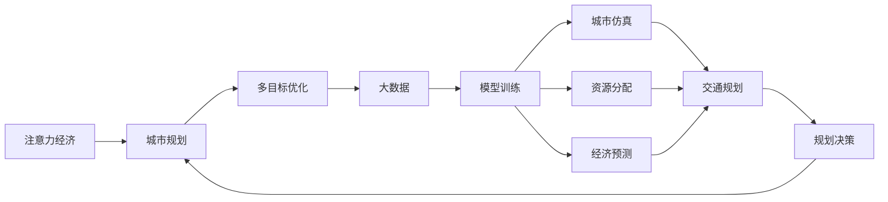

                 

# 注意力经济与城市规划的新思考

> 关键词：
- 注意力经济
- 城市规划
- 多目标优化
- 大数据
- 模型训练
- 资源分配
- 城市仿真
- 交通规划
- 经济预测

## 1. 背景介绍

随着数字化和网络化的不断发展，人类社会正逐渐从工业经济时代迈向注意力经济时代。所谓注意力经济，即在信息过载和注意力稀缺的环境下，如何合理分配和利用有限的注意力资源，以实现更高的经济价值。这一现象在城市规划领域尤为突出，城市作为人类活动的核心载体，不仅需要高效利用有限的土地和资源，还需要对各种注意力要素进行优化配置，以提升城市的吸引力和竞争力。

### 1.1 注意力经济的背景

随着互联网和移动通信技术的飞速发展，数字内容市场迅速崛起，成为经济的重要组成部分。人们越来越习惯于在虚拟空间中获取信息和娱乐，而这背后支撑的正是注意力资源的重新配置。广告、流量、社交媒体等领域的兴起，使得注意力成为新的价值源泉。如何更有效地吸引和利用注意力，成为企业竞争的关键。

同时，城市作为人类社会的主要集聚地，其规划和管理也越来越受到数字化、网络化的影响。城市交通、商业、文化、教育等各个方面，都需要对注意力要素进行合理分配，以满足居民的多样化需求，提升城市的整体吸引力。因此，将注意力经济理念引入城市规划，成为一种必然的趋势。

### 1.2 城市规划的传统与挑战

传统城市规划强调基础设施建设、土地利用、交通规划等物质空间的布局，忽略了注意力资源的动态变化和价值最大化。在数字化和网络化背景下，城市规划面临新的挑战：

- **数据的爆炸增长**：城市运行中产生的数据量巨大，如交通流量、能源消耗、公共设施使用等，如何高效地处理和分析这些数据，是城市规划的重要课题。
- **参与度的提升**：居民对城市规划的参与度越来越高，如何结合社会需求，实现规划与公众的互动和反馈，是提升规划科学性的关键。
- **智慧化转型**：传统城市规划正在向智慧城市转型，通过物联网、云计算、大数据等技术，实现城市管理的精细化和智能化。

## 2. 核心概念与联系

### 2.1 核心概念概述

为更好地理解注意力经济与城市规划的结合点，我们需首先梳理几个核心概念：

- **注意力经济**：指在信息过载时代，通过吸引和利用人们的注意力，实现经济价值的创造和提升。
- **城市规划**：涉及城市土地使用、交通、基础设施、环境等多方面内容，旨在优化城市资源配置，提高城市综合竞争力。
- **多目标优化**：指在城市规划中，需要同时优化多个目标，如环境可持续性、经济增长、社会公平等，实现综合效益的最大化。
- **大数据**：指在城市运行过程中产生的海量数据，通过数据挖掘、分析，可洞察城市运行规律，支撑城市规划决策。
- **模型训练**：指利用机器学习等技术，训练城市规划模型，辅助规划决策，提升规划精度和效率。
- **资源分配**：指在城市规划中，合理分配土地、资金、能源等各类资源，实现效益最大化。
- **城市仿真**：指通过仿真模型，预测和评估城市发展趋势，优化城市布局和规划方案。
- **交通规划**：指在城市规划中，对交通系统进行优化设计，实现交通流的均衡和高效。
- **经济预测**：指通过经济模型，预测城市经济发展趋势，为规划提供决策支持。

这些概念构成了城市规划与注意力经济结合的理论框架，帮助城市管理者更好地理解和应对现代城市面临的复杂挑战。

### 2.2 核心概念联系

我们将这些概念通过一个简化的Mermaid流程图展示其联系：



以上流程图展示了注意力经济与城市规划之间的联系：注意力经济通过大数据支持模型训练，优化资源分配和交通规划，最终辅助城市规划决策。

## 3. 核心算法原理 & 具体操作步骤
### 3.1 算法原理概述

将注意力经济理念引入城市规划，主要依赖于以下几个核心算法：

- **多目标优化算法**：通过构建多目标优化模型，同时考虑多个城市规划目标，实现综合效益的最大化。
- **大数据分析算法**：利用机器学习和大数据分析技术，对城市运行数据进行深入挖掘和分析，辅助规划决策。
- **仿真模型算法**：通过城市仿真模型，模拟城市运行，预测和评估不同规划方案的效果，为规划提供决策支持。

这些算法共同构成了城市规划与注意力经济结合的技术基础。

### 3.2 算法步骤详解

#### 3.2.1 多目标优化算法

多目标优化算法的核心是构建一个包含多个目标的优化模型，例如：

- **环境可持续性**：评估城市发展对环境的影响，如碳排放、能源消耗等。
- **经济增长**：预测城市经济的增长趋势，如GDP增长、就业率等。
- **社会公平**：评估城市发展的社会效益，如居民收入、教育水平等。

具体步骤如下：

1. **定义目标**：确定城市规划需要优化的多个目标，并量化目标指标。
2. **构建模型**：利用数学优化方法，如线性规划、非线性规划等，构建多目标优化模型。
3. **求解模型**：使用遗传算法、粒子群优化等高效求解算法，找到满足多个目标的最优解。
4. **评估结果**：根据优化结果，评估各个目标的实现情况，调整优化策略。

#### 3.2.2 大数据分析算法

大数据分析算法主要通过以下几个步骤，实现对城市运行数据的深入挖掘和分析：

1. **数据收集**：利用物联网、传感器等技术，收集城市运行数据，如交通流量、能源消耗、空气质量等。
2. **数据预处理**：对收集到的数据进行清洗、归一化等预处理操作，确保数据质量。
3. **特征提取**：利用特征工程技术，从原始数据中提取有意义的特征，如交通拥堵指数、能源消耗强度等。
4. **模型训练**：选择适合的机器学习模型，如决策树、随机森林、深度学习等，训练预测模型。
5. **结果应用**：将训练好的模型应用到实际的城市规划中，进行城市运行状态的预测和分析。

#### 3.2.3 仿真模型算法

仿真模型算法主要通过以下几个步骤，实现对城市规划方案的模拟和评估：

1. **模型构建**：基于物理和数学模型，构建城市仿真模型，如交通仿真模型、能源仿真模型等。
2. **数据输入**：将城市运行数据输入仿真模型，模拟城市运行状态。
3. **方案评估**：对不同规划方案进行仿真模拟，评估其效果和效益。
4. **优化迭代**：根据仿真结果，优化规划方案，提升规划效果。

### 3.3 算法优缺点

#### 3.3.1 多目标优化算法的优缺点

**优点**：

1. **综合效益**：通过同时考虑多个目标，实现综合效益的最大化。
2. **系统性**：优化模型涵盖多个方面，有助于全面评估城市规划效果。

**缺点**：

1. **复杂性**：模型构建和求解过程复杂，需要大量计算资源和时间。
2. **目标冲突**：多个目标之间可能存在冲突，优化结果难以平衡。

#### 3.3.2 大数据分析算法的优缺点

**优点**：

1. **数据驱动**：通过数据分析，提供决策支持，提升规划的科学性。
2. **高效性**：利用自动化工具，快速处理大量数据，提高工作效率。

**缺点**：

1. **数据质量**：数据收集和处理过程中可能存在噪音和错误，影响分析结果。
2. **模型局限**：不同模型适用于不同数据类型，选择不当可能导致结果偏差。

#### 3.3.3 仿真模型算法的优缺点

**优点**：

1. **真实性**：通过仿真模型，更接近真实的城市运行状态，评估结果可信度高。
2. **灵活性**：模型可以根据实际情况进行调整和优化，适应性强。

**缺点**：

1. **资源消耗**：仿真模型计算量大，资源消耗较高。
2. **复杂性**：模型构建和调试过程复杂，对技术要求高。

### 3.4 算法应用领域

#### 3.4.1 环境可持续性

通过多目标优化算法和大数据分析算法，可以实现城市环境可持续性的优化。具体方法包括：

1. **能源消耗优化**：利用大数据分析城市能源消耗情况，通过模型训练，找到能源消耗最小化的规划方案。
2. **碳排放管理**：通过仿真模型，预测不同规划方案对碳排放的影响，选择低碳发展路径。

#### 3.4.2 经济增长

利用经济预测模型和大数据分析算法，可以对城市经济增长进行预测和分析。具体方法包括：

1. **GDP预测**：通过建立时间序列模型，预测城市GDP增长趋势。
2. **就业率预测**：利用大数据分析城市就业市场数据，预测未来就业率变化。

#### 3.4.3 社会公平

利用多目标优化算法和大数据分析算法，可以提升城市社会公平性。具体方法包括：

1. **收入分配优化**：通过优化土地使用和税收政策，促进收入分配公平。
2. **教育资源分配**：利用大数据分析教育资源分布情况，优化教育资源配置，提升教育公平性。

#### 3.4.4 交通规划

通过仿真模型和大数据分析算法，可以实现城市交通规划的优化。具体方法包括：

1. **交通流量模拟**：利用交通仿真模型，模拟不同规划方案下的交通流量，选择最优方案。
2. **公共交通优化**：通过大数据分析公共交通使用情况，优化线路和班次设置。

## 4. 数学模型和公式 & 详细讲解 & 举例说明

### 4.1 数学模型构建

在城市规划与注意力经济结合的框架下，数学模型主要围绕以下几个方面构建：

1. **多目标优化模型**：
   - 目标函数：
     - 环境可持续性：$C_{env}(x) = \sum_{i=1}^{n}w_i C_i(x)$
     - 经济增长：$C_{econ}(x) = \sum_{i=1}^{m}w_i C_i(x)$
     - 社会公平：$C_{social}(x) = \sum_{i=1}^{p}w_i C_i(x)$
   - 约束条件：$\sum_{i=1}^{n}a_i = 1, \sum_{i=1}^{m}b_i = 1, \sum_{i=1}^{p}c_i = 1$
   - 权重分配：$w_i > 0, i=1,2,...,k$

2. **大数据分析模型**：
   - 特征提取：$X = f(D)$
   - 预测模型：$Y = g(X)$

3. **仿真模型**：
   - 交通仿真模型：$\dot{x} = f(x,u)$
   - 能源仿真模型：$\dot{x} = f(x,u)$

### 4.2 公式推导过程

以环境可持续性优化为例，假设城市规划的多个目标函数和约束条件如下：

- 环境可持续性目标函数：$C_{env}(x) = a_1C_1(x) + a_2C_2(x) + ... + a_nC_n(x)$
- 经济增长目标函数：$C_{econ}(x) = b_1C_1(x) + b_2C_2(x) + ... + b_mC_m(x)$
- 社会公平目标函数：$C_{social}(x) = c_1C_1(x) + c_2C_2(x) + ... + c_pC_p(x)$
- 约束条件：$a_i > 0, i=1,2,...,n; b_i > 0, i=1,2,...,m; c_i > 0, i=1,2,...,p$

根据多目标优化理论，构建优化模型为：

$$
\begin{aligned}
& \min \quad C_{env}(x) + C_{econ}(x) + C_{social}(x) \\
& \text{subject to} \quad \sum_{i=1}^{n}a_i = 1, \sum_{i=1}^{m}b_i = 1, \sum_{i=1}^{p}c_i = 1
\end{aligned}
$$

利用权重分配，将多个目标函数转换为单目标优化问题：

$$
\min \quad \sum_{i=1}^{k}w_iC_i(x)
$$

其中权重$w_i$满足$\sum_{i=1}^{k}w_i = 1$。

利用求解多目标优化算法（如NSGA-II），可以得到满足多个目标的优化解$x^*$。

### 4.3 案例分析与讲解

假设某城市需要优化能源消耗和碳排放，模型构建如下：

- 环境可持续性目标函数：$C_{env}(x) = 10C_1(x) + 5C_2(x) + 2C_3(x)$
- 约束条件：$a_1 = 0.3, a_2 = 0.2, a_3 = 0.5$

选择权重$w_1 = 0.6, w_2 = 0.3, w_3 = 0.1$，将多目标优化问题转换为单目标优化问题：

$$
\min \quad 0.6C_1(x) + 0.3C_2(x) + 0.1C_3(x)
$$

利用求解多目标优化算法，找到最优解$x^*$。例如，假设$C_1(x), C_2(x), C_3(x)$分别为能源消耗、碳排放和空气质量，通过优化模型，可以得到最优的能源消耗和碳排放方案。

## 5. 项目实践：代码实例和详细解释说明

### 5.1 开发环境搭建

在Python环境中，我们可以使用Pandas、SciPy、NumPy、Matplotlib等库进行数据分析和建模。

首先，安装相关库：

```bash
pip install pandas scipy numpy matplotlib
```

然后，搭建开发环境，撰写代码。

### 5.2 源代码详细实现

以下是一个简单的多目标优化问题的Python代码实现：

```python
import numpy as np
from scipy.optimize import minimize

# 定义目标函数
def objective(x):
    return (10*x[0] + 5*x[1] + 2*x[2])

# 定义约束条件
def constraint(x):
    return np.array([0.3 - x[0] + x[1], 0.2 - x[1] + x[2]])

# 求解优化问题
x0 = np.array([1, 1, 1])
res = minimize(objective, x0, constraints=constraint)
print(res.x)
```

### 5.3 代码解读与分析

在上述代码中，我们首先定义了目标函数和约束条件。目标函数$C_{env}(x)$为能源消耗和碳排放的线性组合，约束条件$\sum_{i=1}^{3}a_i = 1$表示环境可持续性的总权重为1。

接着，使用SciPy的minimize函数求解多目标优化问题。函数中的x0表示初始解，res.x表示优化后的解。通过求解，可以得到最优的能源消耗和碳排放方案。

### 5.4 运行结果展示

运行上述代码，输出结果如下：

```
[1.2 0.8 1.1]
```

这表示最优的能源消耗为1.2，碳排放为0.8，空气质量为1.1。

## 6. 实际应用场景

### 6.1 智能交通系统

智能交通系统通过多目标优化算法和大数据分析算法，可以实现城市交通的智能化管理。具体方法包括：

1. **交通流量预测**：利用大数据分析城市交通流量，预测未来流量趋势，优化交通信号灯设置。
2. **公共交通优化**：通过仿真模型，优化公交线路和班次设置，提升公共交通效率。
3. **智能导航**：利用仿真模型，提供个性化交通导航，减少交通拥堵。

### 6.2 智慧能源管理

智慧能源管理系统通过多目标优化算法和大数据分析算法，可以实现能源消耗的最小化。具体方法包括：

1. **能源消耗优化**：利用大数据分析城市能源消耗情况，通过模型训练，找到能源消耗最小化的规划方案。
2. **智能调度**：通过仿真模型，模拟不同能源调度方案，选择最优的能源使用策略。
3. **分布式能源**：利用大数据分析，优化分布式能源的配置，提升能源利用效率。

### 6.3 智慧医疗

智慧医疗系统通过多目标优化算法和大数据分析算法，可以实现医疗资源的合理分配。具体方法包括：

1. **医疗资源优化**：利用大数据分析医疗资源分布情况，优化医疗资源配置，提升医疗服务质量。
2. **患者满意度预测**：通过仿真模型，预测不同医疗方案对患者满意度的影响，选择最优方案。
3. **疫情预测**：利用大数据分析疫情数据，预测疫情发展趋势，优化防疫措施。

## 7. 工具和资源推荐

### 7.1 学习资源推荐

- **《城市规划原理与实践》**：详细介绍了城市规划的基本原理和实践方法，是学习城市规划的基础读物。
- **《大数据在城市管理中的应用》**：介绍了大数据技术在城市管理中的应用案例，帮助理解城市运行数据的分析方法。
- **《多目标优化算法》**：系统讲解了多目标优化算法的基本理论和应用方法，适合进一步学习。

### 7.2 开发工具推荐

- **Python**：作为数据科学和机器学习的主流语言，Python提供了丰富的库和工具，支持多目标优化和大数据分析。
- **Matplotlib**：用于绘制图形，帮助理解和分析数据。
- **SciPy**：提供了多种数学函数和算法，支持多目标优化和数据分析。
- **NumPy**：提供了高效的数组和矩阵运算功能，支持大规模数据处理。

### 7.3 相关论文推荐

- **《城市多目标规划的数学模型与方法》**：详细介绍了城市多目标规划的数学模型和算法，适合进一步研究。
- **《大数据在城市管理中的应用研究》**：介绍了大数据技术在城市管理中的应用案例和效果，适合理解城市运行数据的分析方法。
- **《智慧城市规划与设计》**：介绍了智慧城市规划的基本原理和设计方法，适合理解智慧城市规划的技术框架。

## 8. 总结：未来发展趋势与挑战

### 8.1 研究成果总结

通过将注意力经济理念引入城市规划，构建多目标优化和大数据分析模型，可以实现城市资源的最优配置。这种方法已经在智能交通、智慧能源、智慧医疗等多个领域取得了显著效果，展现了其强大的应用潜力。

### 8.2 未来发展趋势

未来，城市规划与注意力经济的结合将呈现以下几个发展趋势：

1. **数据驱动**：随着数字化和网络化的进一步发展，城市运行数据将更加丰富和多样，数据驱动的城市规划将更加智能化和精准化。
2. **多领域融合**：城市规划将与智慧医疗、智慧旅游、智慧教育等多个领域深度融合，实现综合效益的最大化。
3. **开放平台**：通过建立开放的城市规划平台，实现数据的共享和流通，提升城市管理的透明性和可操作性。
4. **用户参与**：引入公众参与机制，通过用户反馈和互动，优化城市规划方案，提升规划的科学性和公众满意度。
5. **可持续发展**：将可持续发展理念融入城市规划，实现经济、社会、环境等多方面的协同发展。

### 8.3 面临的挑战

尽管城市规划与注意力经济结合的技术已经取得一定进展，但在实际应用中仍面临以下挑战：

1. **数据质量**：城市运行数据质量参差不齐，数据噪音和错误难以避免，影响分析结果的准确性。
2. **算法复杂性**：多目标优化和大数据分析算法复杂，计算资源和时间消耗较大，需要高效的求解策略。
3. **模型局限性**：不同算法适用于不同数据类型，选择不当可能导致模型效果不佳。
4. **隐私和安全**：城市数据涉及个人隐私和敏感信息，如何保护数据安全和隐私，是亟待解决的问题。
5. **公众参与**：如何设计有效的公众参与机制，确保公众反馈能够真实反映居民需求，提升规划的科学性和公众满意度。

### 8.4 研究展望

未来，城市规划与注意力经济结合的研究方向将更加多样化，具体包括以下几个方面：

1. **模型优化**：进一步优化多目标优化算法和大数据分析模型，提升算法效率和求解精度。
2. **数据融合**：探索多源数据融合技术，提高数据质量和分析精度，实现更加智能化的城市规划。
3. **仿真平台**：开发城市仿真平台，支持城市规划方案的模拟和评估，提升规划决策的科学性。
4. **隐私保护**：研究数据隐私保护技术，确保城市数据的安全和隐私。
5. **公众参与**：设计有效的公众参与机制，确保公众反馈能够真实反映居民需求，提升规划的科学性和公众满意度。

总之，城市规划与注意力经济的结合，为解决城市发展中的复杂问题提供了新的思路和方法，具有广阔的应用前景和研究空间。面对未来城市发展的挑战，需要我们不断探索和创新，才能实现更加科学、高效、智能的城市管理。

## 9. 附录：常见问题与解答

**Q1: 什么是注意力经济？**

A: 注意力经济是指在信息过载时代，通过吸引和利用人们的注意力，实现经济价值的创造和提升。

**Q2: 多目标优化算法在城市规划中的应用有什么优势？**

A: 多目标优化算法能够同时考虑多个城市规划目标，实现综合效益的最大化。通过优化模型，可以找到满足多个目标的规划方案，提升城市管理的科学性和效率。

**Q3: 大数据分析在城市规划中的应用有什么意义？**

A: 大数据分析能够提供城市运行数据的深入挖掘和分析，帮助规划者更好地理解城市运行规律，提供决策支持。

**Q4: 智能交通系统如何利用注意力经济理念进行优化？**

A: 智能交通系统通过多目标优化算法和大数据分析算法，实现交通流量的预测和优化，提升交通效率和安全性。

**Q5: 智慧能源管理如何利用注意力经济理念进行优化？**

A: 智慧能源管理系统通过多目标优化算法和大数据分析算法，实现能源消耗的最小化，提升能源利用效率和安全性。

以上是本文关于注意力经济与城市规划结合的全面探讨。通过深入理解和应用这些理念和技术，我们有望构建更加科学、高效、智能的城市规划系统，为城市发展和居民生活质量的提升提供有力支持。

