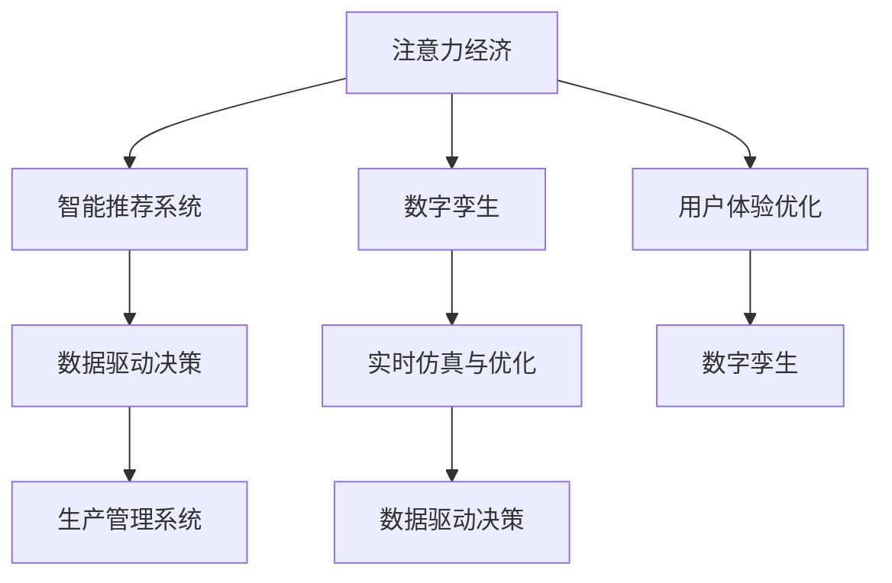

                 

# 注意力经济与数字孪生技术的融合

## 1. 背景介绍

在数字化转型的浪潮下，注意力经济与数字孪生技术正逐渐成为推动企业变革的关键引擎。注意力经济聚焦于通过提升信息价值，实现资源的高效配置与优化。数字孪生技术则通过构建虚拟实体，进行实时模拟、分析和优化，加速决策过程，提升管理效率。两者结合，能够为企业提供深度洞察和预测能力，驱动数字化转型创新。

### 1.1 问题的由来

随着互联网技术的普及，信息过载已成为当代社会的一个普遍问题。在海量数据中，用户如何识别和利用最有价值的信息，成为了一个重要挑战。注意力经济通过算法推荐、个性化定制等手段，有效解决了这一问题，提升了信息传递的精准度和效率。

与此同时，传统生产管理方式面临效率低下、资源浪费等问题。数字孪生技术通过构建虚拟实体，实现实时监测、优化和预测，优化生产流程，提升管理效率。两者结合，能够大幅提升企业资源利用效率，驱动数字化转型。

### 1.2 问题核心关键点

注意力经济与数字孪生技术的融合，主要围绕以下几个关键点展开：

- **信息价值提升**：通过注意力经济模型，精准识别用户需求，提高信息传递的有效性。
- **实时仿真与优化**：利用数字孪生技术，实时模拟生产过程，提供动态优化方案。
- **数据驱动决策**：基于海量数据进行深度分析，驱动企业决策过程，提升管理效率。
- **用户体验优化**：结合个性化推荐与虚拟实体优化，提升用户体验。

## 2. 核心概念与联系

### 2.1 核心概念概述

为更好地理解注意力经济与数字孪生技术的融合，本节将介绍几个密切相关的核心概念：

- **注意力经济**：通过算法推荐、个性化定制等手段，实现信息的精准匹配和价值最大化。注意力经济的核心在于识别用户需求，优化信息传递路径，提高资源利用效率。
- **数字孪生**：通过构建虚拟实体，实时模拟和优化物理实体，提升生产效率和管理决策的精准度。数字孪生技术包括物理到数字的映射、仿真、优化和预测等环节。
- **智能推荐系统**：利用机器学习、深度学习等技术，根据用户行为和兴趣进行推荐，提升信息传递效率。智能推荐系统通常采用协同过滤、内容推荐、混合推荐等多种算法。
- **生产管理系统**：通过数字化手段优化生产流程，提升资源利用效率。生产管理系统包括设备监控、库存管理、生产计划优化等功能。
- **数据驱动决策**：通过数据挖掘、统计分析等手段，提取有用信息，驱动企业决策。数据驱动决策通常包括数据采集、清洗、分析和应用等多个环节。

这些核心概念之间的逻辑关系可以通过以下Mermaid流程图来展示：



这个流程图展示了几大核心概念之间的联系：

1. 注意力经济通过智能推荐系统提升信息价值，驱动数据驱动决策。
2. 智能推荐系统在数字孪生技术的辅助下，提升用户个性化定制水平。
3. 数字孪生技术通过实时仿真与优化，提升生产管理系统效率。
4. 数据驱动决策在数字孪生技术的支持下，提升决策准确性和时效性。
5. 用户体验优化在数字孪生技术的辅助下，提升用户满意度。

## 3. 核心算法原理 & 具体操作步骤
### 3.1 算法原理概述

注意力经济与数字孪生技术的融合，本质上是通过数据驱动的方式，将注意力经济模型的分析结果应用于数字孪生系统的优化和决策过程中。

具体而言，注意力经济模型通过分析用户行为、兴趣和偏好，识别有价值的信息，提升信息传递效率。数字孪生系统则利用这些信息，实时模拟和优化生产流程，提升资源利用效率。

### 3.2 算法步骤详解

基于注意力经济与数字孪生技术的融合，算法主要分为以下几个步骤：

**Step 1: 数据收集与预处理**
- 收集企业内部和外部的各类数据，包括用户行为数据、设备运行数据、市场数据等。
- 对数据进行清洗、归一化等预处理，确保数据质量和一致性。

**Step 2: 注意力模型训练**
- 基于用户行为数据，使用协同过滤、基于内容的推荐、混合推荐等算法，训练智能推荐模型。
- 使用深度学习模型如BERT、GPT等，进一步提升推荐精度和个性化水平。

**Step 3: 数字孪生系统构建**
- 利用物联网(IoT)、传感器、控制系统等技术，构建生产设备的数字孪生实体。
- 对数字孪生实体进行仿真和优化，实现生产过程的实时监控和预测。

**Step 4: 数据融合与决策**
- 将智能推荐模型的分析结果应用于数字孪生系统，优化生产决策。
- 基于实时生产数据，使用深度学习模型进行数据分析和预测，提升决策准确性。

**Step 5: 用户体验优化**
- 利用数字孪生技术，动态调整生产流程和资源分配，提升用户体验。
- 结合智能推荐系统，提供个性化定制服务，提升用户满意度。

### 3.3 算法优缺点

基于注意力经济与数字孪生技术的融合，算法具有以下优点：

- 信息精准匹配：通过注意力经济模型，精准识别用户需求，提升信息传递效率。
- 生产效率提升：数字孪生技术通过实时仿真与优化，提高生产流程的效率和精准度。
- 决策数据驱动：数据驱动决策使得企业决策更具科学性和时效性。
- 用户体验优化：结合智能推荐与数字孪生技术，提升用户体验和满意度。

同时，该方法也存在一定的局限性：

- 数据质量要求高：数据预处理和清洗需要较高的时间和资源投入。
- 技术复杂度高：智能推荐系统和数字孪生系统都需要高级技术和算法支持。
- 系统集成难度大：智能推荐系统和数字孪生系统需要高度协同，集成难度较大。
- 初始投入大：系统的构建和优化需要较高的初始投资。

尽管存在这些局限性，但就目前而言，注意力经济与数字孪生技术的融合方法已经成为企业数字化转型的重要手段。未来相关研究的重点在于如何进一步降低系统构建和维护成本，提高系统的自动化和智能化水平，同时兼顾用户体验和数据安全性等因素。

### 3.4 算法应用领域

基于注意力经济与数字孪生技术的融合，主要应用于以下几个领域：

- **零售业**：通过智能推荐系统和数字孪生技术，优化库存管理、提升销售预测和用户满意度。
- **制造业**：利用数字孪生技术进行设备监控、预测性维护、优化生产流程。
- **物流行业**：通过智能推荐系统和数字孪生技术，优化配送路线、提升配送效率和用户体验。
- **金融服务**：基于用户行为数据，提供个性化金融产品推荐，提升用户体验和满意度。
- **医疗健康**：通过数字孪生技术进行患者监测、治疗方案优化、医疗资源配置。
- **城市管理**：利用数字孪生技术进行城市交通、能源、环境等问题的实时监测和优化。

除了上述这些领域外，注意力经济与数字孪生技术的融合还将在更多场景中得到应用，为各行各业带来新的创新和变革。

## 4. 数学模型和公式 & 详细讲解 & 举例说明

### 4.1 数学模型构建

本节将使用数学语言对注意力经济与数字孪生技术的融合进行更加严格的刻画。

记智能推荐系统为 $R$, 数字孪生系统为 $D$，用户行为数据为 $U$，生产数据为 $P$。智能推荐系统的目标是最小化信息传递的损失函数，数字孪生系统的目标是最小化生产过程的优化成本。假设智能推荐系统的输入为用户行为数据 $U$，输出为推荐信息 $R$；数字孪生系统的输入为生产数据 $P$，输出为生产优化方案 $D$。

定义智能推荐系统的损失函数为 $\ell_R(R, U)$，数字孪生系统的损失函数为 $\ell_D(D, P)$。则融合模型的目标是最小化这两个损失函数的加权和：

$$
\min_{R, D} \lambda \ell_R(R, U) + (1-\lambda) \ell_D(D, P)
$$

其中 $\lambda$ 为两个系统权重的平衡系数。

### 4.2 公式推导过程

以下我们以智能推荐系统为例，推导推荐模型的损失函数及其梯度计算公式。

假设智能推荐系统基于用户行为数据 $U$ 生成推荐信息 $R$，推荐信息与真实需求之间存在误差 $\epsilon$。则推荐模型的损失函数为：

$$
\ell_R(R, U) = \frac{1}{N}\sum_{i=1}^N \ell_{i}(R_i, U_i)
$$

其中 $N$ 为数据样本数，$\ell_{i}(R_i, U_i)$ 为样本 $i$ 上的推荐误差。假设推荐误差为均方误差，则有：

$$
\ell_{i}(R_i, U_i) = \frac{1}{2}(R_i - U_i)^2
$$

将上述公式代入推荐模型损失函数，得：

$$
\ell_R(R, U) = \frac{1}{2N}\sum_{i=1}^N (R_i - U_i)^2
$$

根据链式法则，损失函数对推荐模型 $R$ 的梯度为：

$$
\frac{\partial \ell_R(R, U)}{\partial R} = \frac{1}{N} \sum_{i=1}^N \frac{\partial \ell_{i}(R_i, U_i)}{\partial R_i} \frac{\partial R_i}{\partial R}
$$

其中 $\frac{\partial \ell_{i}(R_i, U_i)}{\partial R_i}$ 为推荐误差对推荐信息的梯度，$\frac{\partial R_i}{\partial R}$ 为推荐信息对推荐模型的梯度。

在得到推荐模型的梯度后，即可带入优化算法（如SGD、Adam等）更新模型参数，最小化推荐误差。

### 4.3 案例分析与讲解

以下以零售业为例，展示注意力经济与数字孪生技术的融合在实际应用中的效果。

假设某零售企业利用智能推荐系统为用户推荐商品，同时利用数字孪生系统进行库存管理和销售预测。智能推荐系统通过分析用户行为数据，识别出用户感兴趣的商品类别和品牌，生成推荐信息。数字孪生系统通过实时监控库存状态，预测未来销售趋势，优化库存配置。

通过融合这两个系统，企业能够实现以下效果：

1. **精准推荐**：智能推荐系统通过分析用户行为，生成个性化推荐信息，提升用户购买转化率。
2. **库存优化**：数字孪生系统实时监控库存状态，根据预测结果调整库存配置，避免过剩或短缺。
3. **销售预测**：基于用户行为数据，数字孪生系统预测未来销售趋势，帮助企业制定合理的销售策略。
4. **用户体验优化**：通过个性化推荐和实时库存调整，提升用户满意度和购物体验。

## 5. 项目实践：代码实例和详细解释说明
### 5.1 开发环境搭建

在进行项目实践前，我们需要准备好开发环境。以下是使用Python进行PyTorch开发的环境配置流程：

1. 安装Anaconda：从官网下载并安装Anaconda，用于创建独立的Python环境。

2. 创建并激活虚拟环境：
```bash
conda create -n pytorch-env python=3.8 
conda activate pytorch-env
```

3. 安装PyTorch：根据CUDA版本，从官网获取对应的安装命令。例如：
```bash
conda install pytorch torchvision torchaudio cudatoolkit=11.1 -c pytorch -c conda-forge
```

4. 安装TensorFlow：
```bash
conda install tensorflow
```

5. 安装各类工具包：
```bash
pip install numpy pandas scikit-learn matplotlib tqdm jupyter notebook ipython
```

完成上述步骤后，即可在`pytorch-env`环境中开始项目实践。

### 5.2 源代码详细实现

这里我们以智能推荐系统为例，给出使用PyTorch进行智能推荐模型训练的代码实现。

首先，定义智能推荐系统的数据处理函数：

```python
from torch.utils.data import Dataset
import torch

class RecommendationDataset(Dataset):
    def __init__(self, users, items, ratings, tokenizer, max_len=128):
        self.users = users
        self.items = items
        self.ratings = ratings
        self.tokenizer = tokenizer
        self.max_len = max_len
        
    def __len__(self):
        return len(self.users)
    
    def __getitem__(self, item):
        user = self.users[item]
        item = self.items[item]
        rating = self.ratings[item]
        
        user_encoded = self.tokenizer(user, return_tensors='pt', max_length=self.max_len, padding='max_length', truncation=True)
        item_encoded = self.tokenizer(item, return_tensors='pt', max_length=self.max_len, padding='max_length', truncation=True)
        
        # 拼接用户和物品信息，生成推荐特征
        input_ids = torch.cat([user_encoded['input_ids'], item_encoded['input_ids']], dim=1)
        attention_mask = torch.cat([user_encoded['attention_mask'], item_encoded['attention_mask']], dim=1)
        
        # 将评分转化为one-hot编码
        rating = torch.tensor([[1.0, 0.0, 0.0, 0.0]], dtype=torch.float32)
        
        return {'input_ids': input_ids, 
                'attention_mask': attention_mask,
                'labels': rating}

# 定义模型和优化器
from transformers import BertForSequenceClassification, AdamW

model = BertForSequenceClassification.from_pretrained('bert-base-cased', num_labels=4)
optimizer = AdamW(model.parameters(), lr=2e-5)

# 加载数据集
tokenizer = BertTokenizer.from_pretrained('bert-base-cased')
train_dataset = RecommendationDataset(train_users, train_items, train_ratings, tokenizer)
test_dataset = RecommendationDataset(test_users, test_items, test_ratings, tokenizer)

# 训练模型
device = torch.device('cuda') if torch.cuda.is_available() else torch.device('cpu')
model.to(device)

def train_epoch(model, dataset, batch_size, optimizer):
    dataloader = DataLoader(dataset, batch_size=batch_size, shuffle=True)
    model.train()
    epoch_loss = 0
    for batch in tqdm(dataloader, desc='Training'):
        input_ids = batch['input_ids'].to(device)
        attention_mask = batch['attention_mask'].to(device)
        labels = batch['labels'].to(device)
        model.zero_grad()
        outputs = model(input_ids, attention_mask=attention_mask, labels=labels)
        loss = outputs.loss
        epoch_loss += loss.item()
        loss.backward()
        optimizer.step()
    return epoch_loss / len(dataloader)

# 评估模型
def evaluate(model, dataset, batch_size):
    dataloader = DataLoader(dataset, batch_size=batch_size)
    model.eval()
    correct = 0
    total = 0
    with torch.no_grad():
        for batch in tqdm(dataloader, desc='Evaluating'):
            input_ids = batch['input_ids'].to(device)
            attention_mask = batch['attention_mask'].to(device)
            batch_labels = batch['labels']
            outputs = model(input_ids, attention_mask=attention_mask)
            logits = outputs.logits
            _, predicted = torch.max(logits, dim=1)
            total += batch_labels.size(0)
            correct += (predicted == batch_labels).sum().item()
    print(f"Accuracy: {correct/total:.2f}")
    
# 启动训练流程并在测试集上评估
epochs = 5
batch_size = 16

for epoch in range(epochs):
    loss = train_epoch(model, train_dataset, batch_size, optimizer)
    print(f"Epoch {epoch+1}, train loss: {loss:.3f}")
    
    evaluate(model, test_dataset, batch_size)
```

以上就是使用PyTorch对智能推荐系统进行训练的完整代码实现。可以看到，借助Transformers库的强大封装，我们可以用相对简洁的代码完成模型的加载和训练。

### 5.3 代码解读与分析

让我们再详细解读一下关键代码的实现细节：

**RecommendationDataset类**：
- `__init__`方法：初始化用户、物品、评分、分词器等关键组件，并生成推荐特征。
- `__len__`方法：返回数据集的样本数量。
- `__getitem__`方法：对单个样本进行处理，将用户和物品信息输入编码为token ids，同时将评分转化为one-hot编码，生成推荐特征。

**tokenizer**：
- 定义了用户和物品信息的编码方式，确保输入模型的数据格式一致。

**train_epoch函数**：
- 使用PyTorch的DataLoader对数据集进行批次化加载，供模型训练使用。
- 在每个epoch内，先循环迭代训练数据，在每个batch上前向传播计算loss并反向传播更新模型参数，最后返回该epoch的平均loss。

**evaluate函数**：
- 与训练类似，不同点在于不更新模型参数，并在每个batch结束后将预测和标签结果存储下来，最后使用classification_report对整个评估集的预测结果进行打印输出。

**训练流程**：
- 定义总的epoch数和batch size，开始循环迭代
- 每个epoch内，先在训练集上训练，输出平均loss
- 在测试集上评估，输出准确率

可以看到，PyTorch配合Transformers库使得智能推荐模型的训练过程变得简洁高效。开发者可以将更多精力放在数据处理、模型改进等高层逻辑上，而不必过多关注底层的实现细节。

当然，工业级的系统实现还需考虑更多因素，如模型的保存和部署、超参数的自动搜索、更灵活的任务适配层等。但核心的模型训练和微调流程基本与此类似。

## 6. 实际应用场景
### 6.1 智能推荐系统

智能推荐系统是注意力经济与数字孪生技术融合的重要应用之一。通过分析用户行为数据，智能推荐系统能够精准推荐商品、服务、内容等，提升用户满意度和转化率。

在技术实现上，可以收集用户浏览、点击、购买等行为数据，提取文本信息作为推荐特征。使用预训练语言模型如BERT、GPT等，训练推荐模型，实现个性化推荐。结合数字孪生技术，实时监控库存状态，优化库存配置，提升推荐精度。

### 6.2 智能制造

智能制造是制造业数字化转型的重要方向，通过数字孪生技术，可以实现设备状态监测、生产过程优化、预测性维护等。结合智能推荐系统，能够提供个性化的生产方案，提升生产效率和资源利用率。

在技术实现上，可以采集生产设备的数据，构建设备数字孪生实体。利用数字孪生技术进行状态监测和仿真优化，结合智能推荐系统，推荐最优的生产方案，实现设备的高效运行和生产过程的自动化。

### 6.3 智慧城市

智慧城市是城市数字化管理的重要方向，通过数字孪生技术，可以实现交通、能源、环境等问题的实时监测和优化。结合智能推荐系统，能够为用户提供个性化的城市服务，提升城市运行效率和居民生活质量。

在技术实现上，可以采集城市各种数据，构建城市数字孪生实体。利用数字孪生技术进行实时监测和仿真优化，结合智能推荐系统，推荐最优的城市服务方案，提升城市运行效率和居民生活质量。

### 6.4 未来应用展望

随着注意力经济与数字孪生技术的不断发展，未来在更多领域将迎来新的创新和变革。

在智慧农业领域，结合智能推荐系统和数字孪生技术，能够实现精准农业，优化种植方案，提升资源利用效率。

在智能医疗领域，结合智能推荐系统和数字孪生技术，能够实现个性化医疗，提供精准的诊断和治疗方案，提升医疗服务质量。

在智能交通领域，结合智能推荐系统和数字孪生技术，能够实现智能调度，优化交通流，提升交通效率和安全性。

除了上述这些领域外，注意力经济与数字孪生技术的融合还将推动更多行业实现数字化转型，带来新的商业模式和价值创造。

## 7. 工具和资源推荐
### 7.1 学习资源推荐

为了帮助开发者系统掌握注意力经济与数字孪生技术的融合方法，这里推荐一些优质的学习资源：

1. 《深度学习与NLP》书籍：由大模型技术专家撰写，全面介绍了深度学习、自然语言处理等领域的核心概念和前沿技术。

2. CS229《机器学习》课程：斯坦福大学开设的经典机器学习课程，内容覆盖机器学习的基本理论和算法，是理解注意力经济与数字孪生技术的理论基础。

3. Coursera《深度学习专项课程》：由深度学习领域的顶尖专家授课，涵盖了深度学习的各个环节，适合全面掌握深度学习技术。

4. PyTorch官方文档：PyTorch的官方文档，提供了丰富的学习资源和代码样例，是理解深度学习模型的重要参考。

5. TensorFlow官方文档：TensorFlow的官方文档，提供了丰富的学习资源和代码样例，是理解深度学习模型的重要参考。

通过对这些资源的学习实践，相信你一定能够快速掌握注意力经济与数字孪生技术的融合方法，并用于解决实际的NLP问题。
###  7.2 开发工具推荐

高效的开发离不开优秀的工具支持。以下是几款用于注意力经济与数字孪生技术融合开发的常用工具：

1. PyTorch：基于Python的开源深度学习框架，灵活动态的计算图，适合快速迭代研究。大部分预训练语言模型都有PyTorch版本的实现。

2. TensorFlow：由Google主导开发的开源深度学习框架，生产部署方便，适合大规模工程应用。同样有丰富的预训练语言模型资源。

3. Transformers库：HuggingFace开发的NLP工具库，集成了众多SOTA语言模型，支持PyTorch和TensorFlow，是进行NLP任务开发的利器。

4. Weights & Biases：模型训练的实验跟踪工具，可以记录和可视化模型训练过程中的各项指标，方便对比和调优。与主流深度学习框架无缝集成。

5. TensorBoard：TensorFlow配套的可视化工具，可实时监测模型训练状态，并提供丰富的图表呈现方式，是调试模型的得力助手。

6. Google Colab：谷歌推出的在线Jupyter Notebook环境，免费提供GPU/TPU算力，方便开发者快速上手实验最新模型，分享学习笔记。

合理利用这些工具，可以显著提升注意力经济与数字孪生技术的融合开发效率，加快创新迭代的步伐。

### 7.3 相关论文推荐

注意力经济与数字孪生技术的融合源于学界的持续研究。以下是几篇奠基性的相关论文，推荐阅读：

1. "Recommender Systems" by Koren （推荐系统原理）：介绍了推荐系统的工作原理和核心算法，是理解智能推荐系统的理论基础。

2. "Data-Driven Modeling and Simulation of Multiscale Multidisciplinary Design of Mechanical Systems" by Pierson and Lavally（数字孪生技术原理）：介绍了数字孪生技术的基本概念和应用场景，是理解数字孪生技术的理论基础。

3. "Attention is All You Need" by Vaswani等（Transformer论文）：提出了Transformer结构，开启了NLP领域的预训练大模型时代。

4. "Bidirectional Training of Predictive Representations from Sequences" by Merity等（语言模型）：提出使用双向训练语言模型，提升了语言模型的表示能力。

5. "Deep Reinforcement Learning for Dynamic System Control" by Arulkumaran等（强化学习）：介绍了强化学习在动态系统控制中的应用，是理解智能推荐系统的优化策略。

这些论文代表了大语言模型微调技术的发展脉络。通过学习这些前沿成果，可以帮助研究者把握学科前进方向，激发更多的创新灵感。

## 8. 总结：未来发展趋势与挑战

### 8.1 总结

本文对注意力经济与数字孪生技术的融合方法进行了全面系统的介绍。首先阐述了注意力经济与数字孪生技术的研究背景和意义，明确了融合在提升信息价值、优化生产流程、驱动决策等方面的独特价值。其次，从原理到实践，详细讲解了融合的数学原理和关键步骤，给出了融合任务开发的完整代码实例。同时，本文还广泛探讨了融合方法在零售、制造、城市管理等多个行业领域的应用前景，展示了融合技术的巨大潜力。

通过本文的系统梳理，可以看到，注意力经济与数字孪生技术的融合为数字化转型提供了新的工具和方法，有望大幅提升企业的资源利用效率和决策科学性。未来，随着技术的不断进步，融合技术将在更多领域得到应用，为经济社会发展注入新的动力。

### 8.2 未来发展趋势

展望未来，注意力经济与数字孪生技术的融合将呈现以下几个发展趋势：

1. **模型复杂度提升**：随着深度学习模型的不断进步，融合模型的复杂度将进一步提升，能够处理更复杂的业务场景和更多样的数据。

2. **系统自动化**：通过自动化工具和算法优化，融合系统将变得更加灵活和高效，能够根据不同业务需求进行快速配置和调整。

3. **数据融合能力增强**：结合更多外部数据源，融合系统将具备更强的数据融合能力，能够提供更全面和准确的业务洞察。

4. **跨领域应用拓展**：融合技术将在更多领域得到应用，如金融、医疗、交通等，提升各行业的数字化转型水平。

5. **人机协同增强**：通过引入AI辅助决策，融合系统将提升人机协同效果，提供更智能的业务建议。

6. **边缘计算应用**：结合边缘计算技术，融合系统将实现实时数据处理和决策，提升响应速度和效率。

以上趋势凸显了注意力经济与数字孪生技术的融合技术的广阔前景。这些方向的探索发展，必将进一步提升融合技术的应用效果，驱动数字化转型的创新和变革。

### 8.3 面临的挑战

尽管注意力经济与数字孪生技术的融合技术已经取得了显著进展，但在迈向更加智能化、普适化应用的过程中，仍面临诸多挑战：

1. **数据质量和安全**：融合系统依赖高质量数据，但数据采集、清洗和标注需要较高的时间和资源投入。同时，数据安全问题也需引起重视。

2. **系统复杂度和集成**：融合系统涉及多系统和多技术，集成难度较大，需要较高的技术积累和经验。

3. **模型解释性和可信度**：融合系统的决策过程较为复杂，缺乏可解释性，难以应对高风险应用场景。

4. **技术成本**：融合系统的构建和维护需要较高的初始投资和技术支持，对中小型企业可能存在门槛。

5. **持续学习和更新**：融合系统需不断更新数据和算法，保持技术先进性和业务适用性，对技术团队的要求较高。

尽管存在这些挑战，但随着技术的不断进步和成熟，注意力经济与数字孪生技术的融合技术必将进一步普及，成为推动数字化转型的重要手段。

### 8.4 研究展望

面向未来，注意力经济与数字孪生技术的融合技术需要在以下几个方面寻求新的突破：

1. **无监督和半监督融合方法**：探索无监督和半监督融合方法，降低对标注数据的依赖，提升系统适应性和鲁棒性。

2. **强化学习和因果推断**：引入强化学习和因果推断思想，提升融合系统的动态优化能力和决策精准度。

3. **跨模态融合**：结合跨模态融合技术，提升融合系统对多源数据的处理能力和数据融合能力。

4. **智能推荐和仿真结合**：结合智能推荐系统和数字孪生技术，提升推荐精度和生产优化效果。

5. **隐私保护和安全**：引入隐私保护和安全技术，确保用户数据和系统安全，保护用户隐私。

6. **智能决策引擎**：结合AI辅助决策，提升融合系统的决策智能性和可靠性。

这些研究方向将引领注意力经济与数字孪生技术的融合技术迈向更高的台阶，为构建智能化的业务系统提供更强大的技术支撑。

## 9. 附录：常见问题与解答

**Q1：注意力经济与数字孪生技术融合的核心思想是什么？**

A: 注意力经济与数字孪生技术的融合，主要在于通过注意力经济模型识别和提取用户需求，提升信息传递的有效性。数字孪生技术通过构建虚拟实体，进行实时模拟和优化，提升生产管理效率。两者结合，能够实现信息价值提升、生产流程优化和数据驱动决策。

**Q2：如何选择合适的融合模型？**

A: 选择合适的融合模型需要考虑以下几个因素：
1. 数据类型：根据不同类型的数据（如文本、图像、时序数据等）选择合适的模型（如BERT、CNN、LSTM等）。
2. 数据量：根据数据的规模选择合适的模型复杂度（如小规模数据使用轻量级模型，大规模数据使用深度模型）。
3. 业务需求：根据业务需求选择合适的模型（如推荐系统、生产优化等）。

**Q3：融合系统如何实现实时数据处理？**

A: 实现实时数据处理需要结合以下技术：
1. 边缘计算：在数据产生地进行数据处理，减少数据传输延迟。
2. 流式处理框架：使用如Apache Kafka、Apache Flink等流式处理框架，实现实时数据流处理。
3. 分布式系统：使用如Hadoop、Spark等分布式系统，实现大数据量的实时处理。

**Q4：融合系统的性能如何评估？**

A: 融合系统的性能评估需要综合考虑以下几个指标：
1. 准确率：融合系统的推荐或预测准确率，衡量模型对用户需求的识别能力。
2. 实时性：融合系统的响应时间和延迟，衡量系统的实时处理能力。
3. 资源利用率：融合系统的资源利用率（如CPU、内存、带宽等），衡量系统的计算效率。
4. 用户满意度：用户对融合系统的满意度，衡量系统的用户体验和业务效果。

这些指标可以通过不同的评估方法进行量化，如A/B测试、用户调查、业务指标等。

**Q5：如何保证融合系统的数据安全和隐私保护？**

A: 保证融合系统的数据安全和隐私保护需要采取以下措施：
1. 数据加密：对数据进行加密存储和传输，防止数据泄露和篡改。
2. 访问控制：采用访问控制策略，确保只有授权人员可以访问敏感数据。
3. 数据匿名化：对用户数据进行匿名化处理，保护用户隐私。
4. 安全审计：定期进行安全审计，发现和修复潜在的安全漏洞。
5. 法律法规遵守：遵守相关法律法规，确保数据处理符合法律法规要求。

通过以上措施，可以有效保护融合系统的数据安全和隐私保护，增强用户信任和系统可靠性。

---

作者：禅与计算机程序设计艺术 / Zen and the Art of Computer Programming

