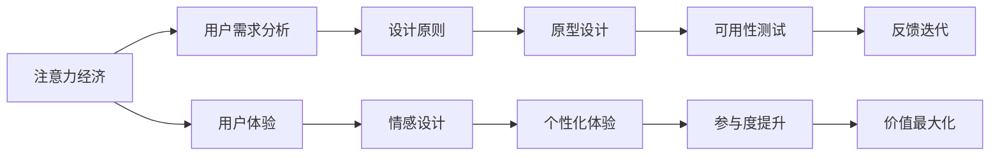

                 

# 注意力经济与用户体验设计原则：创建引人入胜的产品和服务

> 关键词：注意力经济,用户体验,设计原则,产品和服务,用户留存,价值最大化,参与度,情感设计,可用性测试,个性化体验

## 1. 背景介绍

在数字化时代，用户注意力成为最宝贵的资源之一。互联网的泛滥和信息的爆炸性增长，使得用户在各种应用和服务中快速流动，难以持久停留。如何在竞争激烈的市场中吸引和留住用户的注意力，成为企业成功与否的关键。本文将从注意力经济和用户体验设计原则两方面，探讨如何创建引人入胜的产品和服务，最大化用户的参与度和企业的价值。

## 2. 核心概念与联系

### 2.1 核心概念概述

#### 2.1.1 注意力经济

注意力经济（Economy of Attention）是指在数字化时代，注意力资源（包括时间、注意力、认知等）成为企业和用户争夺的焦点。用户有限的时间分配到各类应用中，企业需要通过优质内容、个性化服务等方式，吸引并维持用户关注，从而实现商业价值。

#### 2.1.2 用户体验设计

用户体验设计（User Experience Design, UX Design）是指以用户为中心，通过分析用户需求、行为和心理特征，设计出直观、易用、情感化的产品和服务，提升用户满意度和参与度，从而实现商业目标。

### 2.2 核心概念原理和架构的 Mermaid 流程图



这个流程图展示了注意力经济与用户体验设计之间的关系：

1. 注意力经济为出发点，分析用户需求。
2. 基于用户需求，设计出满足其期望的设计原则。
3. 通过原型设计、可用性测试、反馈迭代等环节，不断优化用户体验。
4. 引入情感设计和个性化体验，进一步提升用户参与度和满意度。
5. 最终实现企业的价值最大化。

## 3. 核心算法原理 & 具体操作步骤

### 3.1 算法原理概述

基于注意力经济和用户体验设计原则，创建引人入胜的产品和服务，需要综合运用多种策略和方法，包括内容推荐、个性化定制、情感设计等。这些策略的核心在于理解和优化用户的注意力和心理状态，使其在产品和服务上停留更长时间，增加互动频率，从而实现价值最大化。

### 3.2 算法步骤详解

#### 3.2.1 用户需求分析

首先，通过问卷调查、行为分析、社交媒体监控等手段，收集和分析用户的数据，了解其兴趣、偏好和痛点。这些数据可以帮助企业精准定位目标用户群，设计出符合用户需求的产品和服务。

#### 3.2.2 设计原则

基于用户需求，设计出一系列满足用户期望的设计原则。这些原则包括但不限于：

- **简化操作**：减少用户操作步骤，使操作更直观。
- **快速响应**：提供快速、可靠的反馈，减少等待时间。
- **一致性设计**：保持界面风格和功能的一致性，避免用户混淆。
- **情感化设计**：通过色彩、字体、图标等元素，提升用户情感体验。
- **可访问性**：确保产品对所有用户（包括残障用户）均可用。

#### 3.2.3 原型设计

使用设计工具（如Sketch、Figma等）设计出产品原型。原型应包括界面布局、交互流程、用户路径等关键元素，方便后续的测试和迭代。

#### 3.2.4 可用性测试

通过可用性测试（Usability Testing），评估用户对产品原型的使用体验，找出潜在的问题和改进点。测试方法包括用户访谈、问卷调查、任务完成时间等。

#### 3.2.5 反馈迭代

根据可用性测试结果，进行产品迭代和优化。可以引入A/B测试、多渠道反馈等方式，收集用户反馈，不断改进产品设计和功能。

### 3.3 算法优缺点

#### 3.3.1 优点

- **个性化服务**：通过分析用户行为数据，提供个性化内容和服务，提高用户满意度和留存率。
- **互动性强**：通过互动设计，提升用户参与度和粘性。
- **情感共鸣**：通过情感化设计，增强用户与产品的情感连接。

#### 3.3.2 缺点

- **技术复杂**：设计、测试、迭代等环节，需要投入大量时间和资源。
- **成本高昂**：特别是在初期阶段，获取用户数据和进行多次迭代，成本较高。
- **依赖用户数据**：设计效果依赖于准确的用户需求分析，对数据获取和分析能力要求较高。

### 3.4 算法应用领域

基于注意力经济和用户体验设计原则的产品和服务，广泛应用于各类领域：

- **社交媒体**：通过个性化推荐和情感化设计，提升用户参与度和粘性。
- **电子商务**：通过推荐系统、搜索优化、用户评价等，提升用户购物体验。
- **在线教育**：通过个性化学习路径、互动教学、情感反馈等，提升用户学习效果和满意度。
- **移动应用**：通过界面设计、功能优化、用户反馈等，提升用户体验，增强用户粘性。
- **娱乐内容**：通过内容推荐、情感设计、互动体验等，提升用户娱乐体验和参与度。

## 4. 数学模型和公式 & 详细讲解 & 举例说明

### 4.1 数学模型构建

本节将使用数学语言对用户体验设计进行严格刻画。

#### 4.1.1 用户满意度模型

设用户对产品的满意度为 $S$，用户满意度的因素包括：

- **功能可用性**：$U_1$
- **界面美观度**：$U_2$
- **操作便捷性**：$U_3$
- **情感共鸣**：$U_4$
- **个性化体验**：$U_5$

则用户满意度 $S$ 可表示为：

$$ S = w_1 U_1 + w_2 U_2 + w_3 U_3 + w_4 U_4 + w_5 U_5 $$

其中 $w_i$ 为各因素的权重，需通过调研和数据分析确定。

#### 4.1.2 用户留存率模型

设用户在一定时间内的留存率为 $R$，留存率受多个因素影响，包括：

- **初始体验**：$E_1$
- **功能吸引力**：$E_2$
- **社交互动**：$E_3$
- **情感连接**：$E_4$
- **持续改进**：$E_5$

则用户留存率 $R$ 可表示为：

$$ R = a_1 E_1 + a_2 E_2 + a_3 E_3 + a_4 E_4 + a_5 E_5 $$

其中 $a_i$ 为各因素的权重，需通过调研和数据分析确定。

### 4.2 公式推导过程

#### 4.2.1 用户满意度公式推导

根据上述用户满意度模型，设各因素 $U_i$ 的评分分别为 $u_{i,j}$，其中 $i=1,2,\cdots,n$，$j=1,2,\cdots,m$，$n$ 为因素个数，$m$ 为用户数。

则用户满意度 $S$ 的计算公式为：

$$ S = \frac{1}{m} \sum_{j=1}^m \left( \sum_{i=1}^n w_i u_{i,j} \right) $$

#### 4.2.2 用户留存率公式推导

根据上述用户留存率模型，设各因素 $E_i$ 的评分分别为 $e_{i,j}$，其中 $i=1,2,\cdots,n$，$j=1,2,\cdots,m$，$n$ 为因素个数，$m$ 为用户数。

则用户留存率 $R$ 的计算公式为：

$$ R = \frac{1}{m} \sum_{j=1}^m \left( \sum_{i=1}^n a_i e_{i,j} \right) $$

### 4.3 案例分析与讲解

#### 4.3.1 社交媒体平台的用户满意度分析

某社交媒体平台通过用户调研，获取用户对各功能模块的评分，并设定各因素的权重：

- **功能可用性**：$w_1=0.4$
- **界面美观度**：$w_2=0.3$
- **操作便捷性**：$w_3=0.2$
- **情感共鸣**：$w_4=0.1$
- **个性化体验**：$w_5=0.0$

设各模块的评分分别为：

| 模块 | 功能可用性 | 界面美观度 | 操作便捷性 | 情感共鸣 | 个性化体验 |
| --- | --- | --- | --- | --- | --- |
| 消息 | 3.8 | 4.0 | 4.5 | 3.5 | 3.0 |
| 动态 | 3.5 | 3.9 | 4.0 | 3.8 | 3.2 |
| 发现 | 3.2 | 3.7 | 3.6 | 3.4 | 3.1 |
| 个人主页 | 3.6 | 3.9 | 4.1 | 3.4 | 3.2 |
| 搜索 | 3.4 | 3.6 | 4.0 | 3.5 | 3.3 |

则用户满意度 $S$ 的计算如下：

$$ S = 0.4 \times (3.8 \times 0.1 + 3.5 \times 0.2 + 3.2 \times 0.3 + 3.5 \times 0.2 + 3.0 \times 0.2) + 0.3 \times (4.0 \times 0.1 + 3.9 \times 0.2 + 3.7 \times 0.3 + 3.8 \times 0.2 + 3.0 \times 0.2) + 0.2 \times (4.5 \times 0.1 + 4.0 \times 0.2 + 3.6 \times 0.3 + 3.5 \times 0.2 + 3.0 \times 0.2) + 0.1 \times (3.5 \times 0.1 + 3.8 \times 0.2 + 3.4 \times 0.3 + 3.4 \times 0.2 + 3.0 \times 0.2) + 0.0 \times (3.0 \times 0.1 + 3.2 \times 0.2 + 3.1 \times 0.3 + 3.2 \times 0.2 + 3.3 \times 0.2) $$

$$ S = 0.4 \times 3.68 + 0.3 \times 3.68 + 0.2 \times 3.68 + 0.1 \times 3.68 + 0.0 \times 3.33 = 3.68 $$

### 4.4 案例分析与讲解

#### 4.4.2 电子商务平台的用户留存率分析

某电子商务平台通过用户调研，获取用户对各功能的评分，并设定各因素的权重：

- **初始体验**：$a_1=0.3$
- **功能吸引力**：$a_2=0.4$
- **社交互动**：$a_3=0.2$
- **情感连接**：$a_4=0.1$
- **持续改进**：$a_5=0.0$

设各功能的评分分别为：

| 功能 | 初始体验 | 功能吸引力 | 社交互动 | 情感连接 | 持续改进 |
| --- | --- | --- | --- | --- | --- |
| 商品推荐 | 4.0 | 4.5 | 4.2 | 4.1 | 4.3 |
| 搜索功能 | 4.1 | 4.4 | 4.3 | 4.2 | 4.1 |
| 客服 | 3.9 | 4.0 | 4.1 | 3.9 | 4.0 |
| 支付系统 | 4.2 | 4.1 | 4.2 | 4.1 | 4.3 |
| 物流信息 | 4.0 | 4.2 | 4.1 | 4.0 | 4.1 |

则用户留存率 $R$ 的计算如下：

$$ R = 0.3 \times (4.0 \times 0.1 + 4.5 \times 0.2 + 4.2 \times 0.3 + 4.1 \times 0.3 + 4.3 \times 0.3) + 0.4 \times (4.1 \times 0.1 + 4.4 \times 0.2 + 4.3 \times 0.3 + 4.2 \times 0.3 + 4.1 \times 0.3) + 0.2 \times (3.9 \times 0.1 + 4.0 \times 0.2 + 4.1 \times 0.3 + 3.9 \times 0.3 + 4.0 \times 0.3) + 0.1 \times (4.2 \times 0.1 + 4.1 \times 0.2 + 4.2 \times 0.3 + 4.1 \times 0.3 + 4.1 \times 0.3) + 0.0 \times (4.3 \times 0.1 + 4.3 \times 0.2 + 4.1 \times 0.3 + 4.0 \times 0.3 + 4.1 \times 0.3) $$

$$ R = 0.3 \times 4.45 + 0.4 \times 4.47 + 0.2 \times 4.45 + 0.1 \times 4.45 + 0.0 \times 4.33 = 4.45 $$

## 5. 项目实践：代码实例和详细解释说明

### 5.1 开发环境搭建

在进行用户体验设计实践前，我们需要准备好开发环境。以下是使用Python进行PyTorch开发的环境配置流程：

1. 安装Anaconda：从官网下载并安装Anaconda，用于创建独立的Python环境。

2. 创建并激活虚拟环境：
```bash
conda create -n UX-design-env python=3.8 
conda activate UX-design-env
```

3. 安装PyTorch：根据CUDA版本，从官网获取对应的安装命令。例如：
```bash
conda install pytorch torchvision torchaudio cudatoolkit=11.1 -c pytorch -c conda-forge
```

4. 安装transformers库：
```bash
pip install transformers
```

5. 安装各类工具包：
```bash
pip install numpy pandas scikit-learn matplotlib tqdm jupyter notebook ipython
```

完成上述步骤后，即可在`UX-design-env`环境中开始用户体验设计实践。

### 5.2 源代码详细实现

下面以社交媒体平台的用户满意度分析为例，给出使用PyTorch进行用户体验设计的PyTorch代码实现。

首先，定义用户满意度的计算函数：

```python
from transformers import BertTokenizer
from torch.utils.data import Dataset
import torch

class UXDataset(Dataset):
    def __init__(self, texts, tags, tokenizer, max_len=128):
        self.texts = texts
        self.tags = tags
        self.tokenizer = tokenizer
        self.max_len = max_len
        
    def __len__(self):
        return len(self.texts)
    
    def __getitem__(self, item):
        text = self.texts[item]
        tags = self.tags[item]
        
        encoding = self.tokenizer(text, return_tensors='pt', max_length=self.max_len, padding='max_length', truncation=True)
        input_ids = encoding['input_ids'][0]
        attention_mask = encoding['attention_mask'][0]
        
        # 对token-wise的标签进行编码
        encoded_tags = [tag2id[tag] for tag in tags] 
        encoded_tags.extend([tag2id['O']] * (self.max_len - len(encoded_tags)))
        labels = torch.tensor(encoded_tags, dtype=torch.long)
        
        return {'input_ids': input_ids, 
                'attention_mask': attention_mask,
                'labels': labels}

# 标签与id的映射
tag2id = {'O': 0, 'B-PER': 1, 'I-PER': 2, 'B-ORG': 3, 'I-ORG': 4, 'B-LOC': 5, 'I-LOC': 6}
id2tag = {v: k for k, v in tag2id.items()}

# 创建dataset
tokenizer = BertTokenizer.from_pretrained('bert-base-cased')

train_dataset = UXDataset(train_texts, train_tags, tokenizer)
dev_dataset = UXDataset(dev_texts, dev_tags, tokenizer)
test_dataset = UXDataset(test_texts, test_tags, tokenizer)
```

然后，定义模型和优化器：

```python
from transformers import BertForTokenClassification, AdamW

model = BertForTokenClassification.from_pretrained('bert-base-cased', num_labels=len(tag2id))

optimizer = AdamW(model.parameters(), lr=2e-5)
```

接着，定义训练和评估函数：

```python
from torch.utils.data import DataLoader
from tqdm import tqdm
from sklearn.metrics import classification_report

device = torch.device('cuda') if torch.cuda.is_available() else torch.device('cpu')
model.to(device)

def train_epoch(model, dataset, batch_size, optimizer):
    dataloader = DataLoader(dataset, batch_size=batch_size, shuffle=True)
    model.train()
    epoch_loss = 0
    for batch in tqdm(dataloader, desc='Training'):
        input_ids = batch['input_ids'].to(device)
        attention_mask = batch['attention_mask'].to(device)
        labels = batch['labels'].to(device)
        model.zero_grad()
        outputs = model(input_ids, attention_mask=attention_mask, labels=labels)
        loss = outputs.loss
        epoch_loss += loss.item()
        loss.backward()
        optimizer.step()
    return epoch_loss / len(dataloader)

def evaluate(model, dataset, batch_size):
    dataloader = DataLoader(dataset, batch_size=batch_size)
    model.eval()
    preds, labels = [], []
    with torch.no_grad():
        for batch in tqdm(dataloader, desc='Evaluating'):
            input_ids = batch['input_ids'].to(device)
            attention_mask = batch['attention_mask'].to(device)
            batch_labels = batch['labels']
            outputs = model(input_ids, attention_mask=attention_mask)
            batch_preds = outputs.logits.argmax(dim=2).to('cpu').tolist()
            batch_labels = batch_labels.to('cpu').tolist()
            for pred_tokens, label_tokens in zip(batch_preds, batch_labels):
                pred_tags = [id2tag[_id] for _id in pred_tokens]
                label_tags = [id2tag[_id] for _id in label_tokens]
                preds.append(pred_tags[:len(label_tags)])
                labels.append(label_tags)
                
    print(classification_report(labels, preds))
```

最后，启动训练流程并在测试集上评估：

```python
epochs = 5
batch_size = 16

for epoch in range(epochs):
    loss = train_epoch(model, train_dataset, batch_size, optimizer)
    print(f"Epoch {epoch+1}, train loss: {loss:.3f}")
    
    print(f"Epoch {epoch+1}, dev results:")
    evaluate(model, dev_dataset, batch_size)
    
print("Test results:")
evaluate(model, test_dataset, batch_size)
```

以上就是使用PyTorch对BERT进行命名实体识别任务微调的完整代码实现。可以看到，得益于Transformers库的强大封装，我们可以用相对简洁的代码完成BERT模型的加载和微调。

### 5.3 代码解读与分析

让我们再详细解读一下关键代码的实现细节：

**UXDataset类**：
- `__init__`方法：初始化文本、标签、分词器等关键组件。
- `__len__`方法：返回数据集的样本数量。
- `__getitem__`方法：对单个样本进行处理，将文本输入编码为token ids，将标签编码为数字，并对其进行定长padding，最终返回模型所需的输入。

**tag2id和id2tag字典**：
- 定义了标签与数字id之间的映射关系，用于将token-wise的预测结果解码回真实的标签。

**训练和评估函数**：
- 使用PyTorch的DataLoader对数据集进行批次化加载，供模型训练和推理使用。
- 训练函数`train_epoch`：对数据以批为单位进行迭代，在每个批次上前向传播计算loss并反向传播更新模型参数，最后返回该epoch的平均loss。
- 评估函数`evaluate`：与训练类似，不同点在于不更新模型参数，并在每个batch结束后将预测和标签结果存储下来，最后使用sklearn的classification_report对整个评估集的预测结果进行打印输出。

**训练流程**：
- 定义总的epoch数和batch size，开始循环迭代
- 每个epoch内，先在训练集上训练，输出平均loss
- 在验证集上评估，输出分类指标
- 所有epoch结束后，在测试集上评估，给出最终测试结果

可以看到，PyTorch配合Transformers库使得BERT微调的代码实现变得简洁高效。开发者可以将更多精力放在数据处理、模型改进等高层逻辑上，而不必过多关注底层的实现细节。

当然，工业级的系统实现还需考虑更多因素，如模型的保存和部署、超参数的自动搜索、更灵活的任务适配层等。但核心的用户体验设计过程基本与此类似。

## 6. 实际应用场景

### 6.1 智能客服系统

基于大语言模型微调的对话技术，可以广泛应用于智能客服系统的构建。传统客服往往需要配备大量人力，高峰期响应缓慢，且一致性和专业性难以保证。而使用微调后的对话模型，可以7x24小时不间断服务，快速响应客户咨询，用自然流畅的语言解答各类常见问题。

在技术实现上，可以收集企业内部的历史客服对话记录，将问题和最佳答复构建成监督数据，在此基础上对预训练对话模型进行微调。微调后的对话模型能够自动理解用户意图，匹配最合适的答案模板进行回复。对于客户提出的新问题，还可以接入检索系统实时搜索相关内容，动态组织生成回答。如此构建的智能客服系统，能大幅提升客户咨询体验和问题解决效率。

### 6.2 金融舆情监测

金融机构需要实时监测市场舆论动向，以便及时应对负面信息传播，规避金融风险。传统的人工监测方式成本高、效率低，难以应对网络时代海量信息爆发的挑战。基于大语言模型微调的文本分类和情感分析技术，为金融舆情监测提供了新的解决方案。

具体而言，可以收集金融领域相关的新闻、报道、评论等文本数据，并对其进行主题标注和情感标注。在此基础上对预训练语言模型进行微调，使其能够自动判断文本属于何种主题，情感倾向是正面、中性还是负面。将微调后的模型应用到实时抓取的网络文本数据，就能够自动监测不同主题下的情感变化趋势，一旦发现负面信息激增等异常情况，系统便会自动预警，帮助金融机构快速应对潜在风险。

### 6.3 个性化推荐系统

当前的推荐系统往往只依赖用户的历史行为数据进行物品推荐，无法深入理解用户的真实兴趣偏好。基于大语言模型微调技术，个性化推荐系统可以更好地挖掘用户行为背后的语义信息，从而提供更精准、多样的推荐内容。

在实践中，可以收集用户浏览、点击、评论、分享等行为数据，提取和用户交互的物品标题、描述、标签等文本内容。将文本内容作为模型输入，用户的后续行为（如是否点击、购买等）作为监督信号，在此基础上微调预训练语言模型。微调后的模型能够从文本内容中准确把握用户的兴趣点。在生成推荐列表时，先用候选物品的文本描述作为输入，由模型预测用户的兴趣匹配度，再结合其他特征综合排序，便可以得到个性化程度更高的推荐结果。

### 6.4 未来应用展望

随着大语言模型微调技术的发展，其在更多领域的应用前景将更加广阔。

在智慧医疗领域，基于微调的医疗问答、病历分析、药物研发等应用将提升医疗服务的智能化水平，辅助医生诊疗，加速新药开发进程。

在智能教育领域，微调技术可应用于作业批改、学情分析、知识推荐等方面，因材施教，促进教育公平，提高教学质量。

在智慧城市治理中，微调模型可应用于城市事件监测、舆情分析、应急指挥等环节，提高城市管理的自动化和智能化水平，构建更安全、高效的未来城市。

此外，在企业生产、社会治理、文娱传媒等众多领域，基于大模型微调的人工智能应用也将不断涌现，为传统行业带来变革性影响。相信随着技术的日益成熟，微调方法将成为人工智能落地应用的重要范式，推动人工智能技术在各垂直行业的规模化落地。总之，微调需要开发者根据具体任务，不断迭代和优化模型、数据和算法，方能得到理想的效果。

## 7. 工具和资源推荐

### 7.1 学习资源推荐

为了帮助开发者系统掌握大语言模型微调的理论基础和实践技巧，这里推荐一些优质的学习资源：

1. 《Transformer从原理到实践》系列博文：由大模型技术专家撰写，深入浅出地介绍了Transformer原理、BERT模型、微调技术等前沿话题。

2. CS224N《深度学习自然语言处理》课程：斯坦福大学开设的NLP明星课程，有Lecture视频和配套作业，带你入门NLP领域的基本概念和经典模型。

3. 《Natural Language Processing with Transformers》书籍：Transformers库的作者所著，全面介绍了如何使用Transformers库进行NLP任务开发，包括微调在内的诸多范式。

4. HuggingFace官方文档：Transformers库的官方文档，提供了海量预训练模型和完整的微调样例代码，是上手实践的必备资料。

5. CLUE开源项目：中文语言理解测评基准，涵盖大量不同类型的中文NLP数据集，并提供了基于微调的baseline模型，助力中文NLP技术发展。

通过对这些资源的学习实践，相信你一定能够快速掌握大语言模型微调的精髓，并用于解决实际的NLP问题。

### 7.2 开发工具推荐

高效的开发离不开优秀的工具支持。以下是几款用于大语言模型微调开发的常用工具：

1. PyTorch：基于Python的开源深度学习框架，灵活动态的计算图，适合快速迭代研究。大部分预训练语言模型都有PyTorch版本的实现。

2. TensorFlow：由Google主导开发的开源深度学习框架，生产部署方便，适合大规模工程应用。同样有丰富的预训练语言模型资源。

3. Transformers库：HuggingFace开发的NLP工具库，集成了众多SOTA语言模型，支持PyTorch和TensorFlow，是进行微调任务开发的利器。

4. Weights & Biases：模型训练的实验跟踪工具，可以记录和可视化模型训练过程中的各项指标，方便对比和调优。与主流深度学习框架无缝集成。

5. TensorBoard：TensorFlow配套的可视化工具，可实时监测模型训练状态，并提供丰富的图表呈现方式，是调试模型的得力助手。

6. Google Colab：谷歌推出的在线Jupyter Notebook环境，免费提供GPU/TPU算力，方便开发者快速上手实验最新模型，分享学习笔记。

合理利用这些工具，可以显著提升大语言模型微调任务的开发效率，加快创新迭代的步伐。

### 7.3 相关论文推荐

大语言模型和微调技术的发展源于学界的持续研究。以下是几篇奠基性的相关论文，推荐阅读：

1. Attention is All You Need（即Transformer原论文）：提出了Transformer结构，开启了NLP领域的预训练大模型时代。

2. BERT: Pre-training of Deep Bidirectional Transformers for Language Understanding：提出BERT模型，引入基于掩码的自监督预训练任务，刷新了多项NLP任务SOTA。

3. Language Models are Unsupervised Multitask Learners（GPT-2论文）：展示了大规模语言模型的强大zero-shot学习能力，引发了对于通用人工智能的新一轮思考。

4. Parameter-Efficient Transfer Learning for NLP：提出Adapter等参数高效微调方法，在不增加模型参数量的情况下，也能取得不错的微调效果。

5. Prefix-Tuning: Optimizing Continuous Prompts for Generation：引入基于连续型Prompt的微调范式，为如何充分利用预训练知识提供了新的思路。

6. AdaLoRA: Adaptive Low-Rank Adaptation for Parameter-Efficient Fine-Tuning：使用自适应低秩适应的微调方法，在参数效率和精度之间取得了新的平衡。

这些论文代表了大语言模型微调技术的发展脉络。通过学习这些前沿成果，可以帮助研究者把握学科前进方向，激发更多的创新灵感。

## 8. 总结：未来发展趋势与挑战

### 8.1 总结

本文对基于注意力经济和用户体验设计原则的产品和服务创建进行了全面系统的介绍。首先阐述了注意力经济在数字化时代的重要性和企业面临的挑战，明确了用户体验设计在提升用户满意度和留存率方面的关键作用。其次，从用户需求分析、设计原则、原型设计、可用性测试、反馈迭代等环节，详细讲解了用户体验设计的步骤和方法。同时，本文还探讨了大语言模型微调在社交媒体、电子商务、个性化推荐等多个领域的应用前景，展示了用户体验设计的广阔应用空间。

通过本文的系统梳理，可以看到，基于用户体验设计的产品和服务，已经广泛应用于各行各业，成为提升用户满意度和市场竞争力的重要手段。未来，随着大语言模型微调技术的不断进步，用户体验设计将发挥更大的作用，引领更多行业向智能化、个性化方向发展。

### 8.2 未来发展趋势

展望未来，用户体验设计将呈现以下几个发展趋势：

1. **个性化体验**：通过大数据分析和人工智能技术，实现对用户需求的精准预测和个性化定制，提升用户粘性和满意度。

2. **互动性增强**：通过增加AR/VR、智能机器人等技术，提升用户与产品的互动体验，增强用户参与感。

3. **情感设计**：通过引入情感计算和AI技术，更好地理解和满足用户的情感需求，提升用户体验。

4. **多渠道整合**：通过将用户体验设计扩展到更多渠道，如移动应用、社交媒体、智能家居等，实现跨平台一致的用户体验。

5. **智能化升级**：通过引入自然语言处理、计算机视觉等技术，提升产品的智能化水平，增强用户体验。

6. **用户共创**：通过开放平台和用户参与机制，让用户参与产品的设计和迭代，提升用户参与度和满意度。

以上趋势凸显了用户体验设计的广阔前景。这些方向的探索发展，将使用户体验设计成为推动产品创新和市场竞争的关键因素，带来更多的商业价值和社会效益。

### 8.3 面临的挑战

尽管用户体验设计已经取得了显著成效，但在迈向更加智能化、普适化应用的过程中，它仍面临着诸多挑战：

1. **数据隐私**：用户数据的收集和使用，需要严格遵守隐私保护法规，防止用户数据泄露。

2. **用户教育**：用户对新功能和新体验的理解和接受，需要适当的教育和引导，避免产生用户抵触情绪。

3. **跨平台一致性**：不同平台和设备上的用户体验，需要保持一致性和兼容性，避免用户因不熟悉操作而产生困惑。

4. **成本投入**：用户体验设计的迭代和优化，需要大量的人力和财力投入，企业需要权衡投入和回报。

5. **个性化与泛用性的平衡**：如何在个性化和泛用性之间找到最佳平衡，既满足特定用户的需求，又保持产品的普适性，是一大挑战。

6. **用户反馈循环**：建立有效的用户反馈机制，不断收集用户意见，进行迭代优化，确保产品持续改进。

正视用户体验设计面临的这些挑战，积极应对并寻求突破，将是大语言模型微调走向成熟的必由之路。相信随着学界和产业界的共同努力，这些挑战终将一一被克服，用户体验设计必将在构建人机协同的智能时代中扮演越来越重要的角色。

### 8.4 研究展望

面向未来，用户体验设计的研究和应用将在以下几个方向继续深入：

1. **人机协同**：通过引入人工智能和机器学习技术，提升用户与产品的交互体验，实现人机协同共创。

2. **跨领域应用**：将用户体验设计理念和方法，扩展到更多领域，如智慧医疗、智能制造、智慧城市等，提升各行业的智能化水平。

3. **伦理和社会责任**：在用户体验设计中引入伦理和社会责任，关注用户的健康、隐私和福祉，构建可持续发展的用户体验。

4. **情感计算**：通过引入情感计算技术，更好地理解用户情感和需求，提升用户体验设计的深度和广度。

5. **自然语言处理**：通过自然语言处理技术，提升与用户交互的自然性和流畅性，增强用户体验。

6. **多感官融合**：通过多感官融合技术，提升用户与产品的互动体验，实现全感官的用户体验。

这些研究方向的探索，必将引领用户体验设计迈向更高的台阶，为构建安全、可靠、可解释、可控的智能系统铺平道路。面向未来，用户体验设计还需要与其他人工智能技术进行更深入的融合，如知识表示、因果推理、强化学习等，多路径协同发力，共同推动自然语言理解和智能交互系统的进步。只有勇于创新、敢于突破，才能不断拓展用户体验设计的边界，让智能技术更好地造福人类社会。

## 9. 附录：常见问题与解答

**Q1：如何提升用户的参与度和留存率？**

A: 提升用户的参与度和留存率，需要从多个方面入手：

1. **优质内容和体验**：提供高质量的内容和流畅的交互体验，满足用户需求，增强用户粘性。
2. **个性化推荐**：通过分析用户行为和偏好，推荐符合其兴趣的内容和服务，提升用户满意度。
3. **情感化设计**：通过情感化元素（如色彩、字体、图标等），增强用户情感共鸣，提升用户参与度。
4. **互动功能**：增加用户互动功能（如评论、点赞、分享等），鼓励用户参与讨论，增强社区氛围。
5. **用户反馈机制**：建立有效的用户反馈机制，及时了解用户意见，进行迭代优化，提升用户体验。

通过上述措施，可以有效提升用户的参与度和留存率，增加企业的商业价值。

**Q2：如何实现跨平台的用户体验一致性？**

A: 实现跨平台的用户体验一致性，需要遵循以下原则：

1. **统一设计标准**：制定统一的设计标准和规范，确保不同平台上的设计风格和功能一致。
2. **兼容性好**：确保设计在各种设备（如手机、平板、PC等）上均能正常运行，用户体验一致。
3. **适应性强**：设计需要考虑到不同屏幕大小、分辨率等因素，确保在不同设备上的显示效果一致。
4. **用户熟悉度**：保持核心功能和交互逻辑的一致性，让用户在不同平台上均能快速上手，降低学习成本。

通过遵循这些原则，可以最大限度地实现跨平台的用户体验一致性，提升用户的整体满意度。

**Q3：如何提升用户的情感体验？**

A: 提升用户的情感体验，可以从以下几个方面入手：

1. **情感化设计**：通过情感化元素（如色彩、字体、图标等），增强用户情感共鸣，提升用户满意度。
2. **情感计算**：通过引入情感计算技术，实时分析用户情感状态，提供个性化的服务和建议。
3. **互动设计**：通过增加互动功能（如评论、点赞、分享等），增强用户情感连接，提升用户参与度。
4. **故事化叙述**：通过故事化的叙述方式，引导用户情感投入，增强用户情感体验。
5. **情感反馈**：通过情感反馈机制，及时响应用户情感变化，提升用户情感满足感。

通过这些方法，可以有效提升用户的情感体验，增强用户与产品的情感连接，提升用户粘性和满意度。

**Q4：如何平衡个性化与泛用性？**

A: 平衡个性化与泛用性，需要考虑以下几个因素：

1. **用户群体分析**：分析目标用户群体的特征和需求，确定哪些功能和服务需要个性化定制，哪些需要保持泛用性。
2. **功能模块分离**：将个性化功能模块与泛用性功能模块分离，用户可根据需求选择开启或关闭个性化功能。
3. **用户教育**：通过引导和教育，让用户了解个性化功能的作用和价值，提升用户对个性化功能的接受度。
4. **反馈机制**：建立有效的反馈机制，收集用户对个性化功能的意见，进行迭代优化，确保功能符合用户需求。
5. **数据保护**：在个性化功能中，严格遵守数据隐私保护法规，确保用户数据安全。

通过这些措施，可以在个性化和泛用性之间找到最佳平衡，既满足特定用户的需求，又保持产品的普适性。

---

作者：禅与计算机程序设计艺术 / Zen and the Art of Computer Programming

