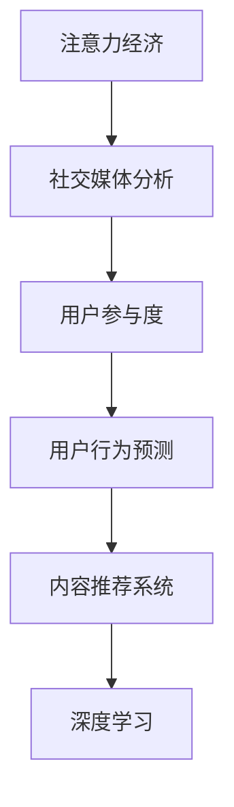

                 

# 注意力经济与社交媒体分析洞察力：了解受众参与度的秘密

## 1. 背景介绍

在信息爆炸的时代，注意力成为最稀缺的资源之一。随着社交媒体的兴起，越来越多的企业和品牌希望通过数据挖掘和分析技术，洞察受众的行为和偏好，提升用户参与度，从而实现市场和品牌价值最大化。注意力经济（Attention Economy）正逐渐成为各类企业关注的焦点。

### 1.1 问题由来

社交媒体平台如微博、微信、抖音等，以其庞大的用户基数和丰富的内容资源，成为注意力经济的重要舞台。但如何从海量数据中高效地提取有价值的注意力信息，并据此进行精准的用户行为分析，一直是困扰企业和研究者的难题。

### 1.2 问题核心关键点

注意力经济的核心在于理解和挖掘用户的注意力分布和偏好变化，从而优化内容生产和推荐策略。基于社交媒体分析的洞察力技术，可以通过对用户行为数据的深入分析，揭示用户参与度的高低，指导内容和产品优化。

具体来说，注意力经济涉及以下关键问题：

- **用户行为数据采集**：如何高效地收集和处理社交媒体上的用户互动数据，如点赞、评论、分享等。
- **用户行为特征提取**：从采集的数据中提取哪些特征可以刻画用户的注意力分布和偏好。
- **用户行为预测与分析**：基于已有的特征，如何进行用户行为预测和分析，进而优化内容策略。
- **注意力转化与提升**：如何通过优化策略，提升用户的注意力转化率和参与度。

本文将围绕这些关键点，系统介绍注意力经济的核心概念与技术框架，并结合实际案例，深入剖析社交媒体分析洞察力的方法和应用。

## 2. 核心概念与联系

### 2.1 核心概念概述

为更好地理解注意力经济与社交媒体分析技术，本节将介绍几个核心概念：

- **注意力经济（Attention Economy）**：以用户注意力为中心，通过优化内容产出、定向推荐等手段，最大化地吸引和利用用户注意力的商业模式。

- **社交媒体分析（Social Media Analytics）**：运用数据分析技术，从社交媒体平台中收集和处理用户互动数据，洞察用户行为和偏好的研究领域。

- **用户参与度（User Engagement）**：衡量用户与品牌、产品或内容的互动频率和深度，是评估社交媒体营销效果的关键指标。

- **用户行为预测（User Behavior Prediction）**：利用机器学习模型，预测用户未来的行为和偏好，指导内容和产品优化。

- **内容推荐系统（Content Recommendation System）**：通过分析用户的历史行为数据，为用户推荐可能感兴趣的内容，提高用户的满意度和参与度。

- **深度学习（Deep Learning）**：基于多层神经网络的机器学习技术，在用户行为分析、内容推荐等方面取得了显著的效果。

这些核心概念之间的逻辑关系可以通过以下Mermaid流程图来展示：



这个流程图展示了注意力经济与社交媒体分析的关键概念及其之间的关系：

1. 注意力经济通过社交媒体分析获取用户行为数据。
2. 社交媒体分析的核心是对用户参与度的洞察，进而进行用户行为预测。
3. 用户行为预测可以指导内容推荐系统的设计和优化，提高用户参与度。
4. 深度学习技术是实现用户行为预测和内容推荐的核心工具。

## 3. 核心算法原理 & 具体操作步骤

### 3.1 算法原理概述

社交媒体分析中的用户行为洞察主要依赖于对用户互动数据的深度学习模型进行训练和预测。以下将以用户行为预测为例，介绍深度学习在注意力经济中的应用。

假设社交媒体平台上有大量用户发布内容并相互互动。平台收集到用户的点赞、评论、分享等行为数据，记为 $\mathcal{D}=\{(x_i,y_i)\}_{i=1}^N$，其中 $x_i$ 为输入特征（如用户ID、时间戳、内容文本等），$y_i$ 为标签（如是否点赞、是否评论等）。

社交媒体分析的目标是训练一个预测模型 $f$，使得在输入 $x_i$ 的情况下，可以预测标签 $y_i$ 的概率分布 $P(y_i|x_i)$。常见的预测模型包括线性回归、逻辑回归、决策树、随机森林、支持向量机（SVM）、深度学习等。

深度学习模型特别适用于处理高维、非线性的特征数据，能够捕捉用户行为模式中的复杂关系。常用的深度学习模型有卷积神经网络（CNN）、循环神经网络（RNN）、长短期记忆网络（LSTM）和变换器（Transformer）等。

### 3.2 算法步骤详解

基于深度学习的社交媒体分析用户行为预测步骤主要包括：

**Step 1: 数据准备**

- 收集社交媒体平台上的用户互动数据 $\mathcal{D}=\{(x_i,y_i)\}_{i=1}^N$。
- 数据清洗和预处理，包括去重、去噪、特征提取等。

**Step 2: 模型选择与构建**

- 选择合适的深度学习模型。对于分类任务，常用的模型有CNN、RNN、LSTM等。
- 设计模型架构，包括输入层、隐藏层和输出层。
- 确定损失函数和优化器，如交叉熵损失和Adam优化器。

**Step 3: 模型训练**

- 使用训练集 $\mathcal{D}_{train}$ 对模型进行训练，不断调整模型参数以最小化损失函数。
- 使用验证集 $\mathcal{D}_{valid}$ 进行模型验证，避免过拟合。
- 设定合适的学习率、批大小、迭代轮数等训练超参数。

**Step 4: 模型评估**

- 使用测试集 $\mathcal{D}_{test}$ 对模型进行最终评估，计算准确率、召回率、F1值等指标。
- 分析模型性能，调整超参数进行模型调优。

**Step 5: 应用与优化**

- 将训练好的模型应用到实际社交媒体平台，预测用户行为。
- 实时监测模型性能，根据实际情况进行模型更新和优化。

### 3.3 算法优缺点

基于深度学习的社交媒体分析用户行为预测方法具有以下优点：

- 高维数据处理能力强。深度学习模型能够处理高维、非线性的特征数据，捕捉用户行为模式中的复杂关系。
- 自适应性强。深度学习模型在训练过程中能够自动学习数据中的复杂模式，无需手工设计特征。
- 可扩展性好。深度学习模型可以通过增加层数、神经元等手段，在保持性能的同时增加模型的复杂度。

但该方法也存在一定的局限性：

- 数据依赖度高。深度学习模型需要大量高质量的标注数据进行训练，获取标注数据的成本较高。
- 计算资源消耗大。深度学习模型通常需要较长的训练时间，对计算资源的要求较高。
- 模型黑盒问题。深度学习模型通常被视为“黑盒”，难以解释其内部工作机制和决策逻辑。

### 3.4 算法应用领域

基于深度学习的社交媒体分析用户行为预测技术，已经在广告推荐、用户行为分析、社交网络分析等多个领域得到广泛应用，具体包括：

- **广告推荐**：通过预测用户对广告的反应，指导广告投放策略，提高广告点击率和转化率。
- **用户行为分析**：分析用户在社交媒体上的互动行为，评估用户对品牌、产品的偏好，指导营销策略。
- **社交网络分析**：分析社交网络中的用户关系和互动模式，发现潜在的影响者，提高品牌曝光度。
- **市场趋势预测**：基于用户行为数据，预测市场趋势和用户需求变化，指导产品开发和市场定位。

## 4. 数学模型和公式 & 详细讲解  
### 4.1 数学模型构建

本节将使用数学语言对基于深度学习的社交媒体分析用户行为预测过程进行更加严格的刻画。

假设社交媒体平台上的用户互动数据为 $\mathcal{D}=\{(x_i,y_i)\}_{i=1}^N$，其中 $x_i$ 为输入特征，$y_i$ 为标签。模型的输入为 $x_i=[x_{i1},x_{i2},\dots,x_{in}]$，输出为 $y_i=[y_{i1},y_{i2},\dots,y_{ik}]$，$n$ 为特征维度，$k$ 为标签维度。

定义模型的预测函数为 $f_\theta(x_i)$，其中 $\theta$ 为模型参数。模型的损失函数为交叉熵损失：

$$
\mathcal{L}(\theta) = -\frac{1}{N}\sum_{i=1}^N \sum_{j=1}^k y_{ij} \log f_{\theta}(x_i)
$$

其中，$y_{ij}$ 为标签 $y_i$ 的第 $j$ 个值。

深度学习模型通过反向传播算法，根据损失函数对参数 $\theta$ 进行更新：

$$
\theta \leftarrow \theta - \eta \nabla_{\theta}\mathcal{L}(\theta)
$$

其中，$\eta$ 为学习率，$\nabla_{\theta}\mathcal{L}(\theta)$ 为损失函数对参数 $\theta$ 的梯度。

### 4.2 公式推导过程

以下我们以分类任务为例，推导交叉熵损失函数及其梯度的计算公式。

假设模型 $f_\theta(x_i)$ 在输入 $x_i$ 上的输出为 $\hat{y}=f_\theta(x_i) \in [0,1]$，表示样本属于正类的概率。真实标签 $y \in \{0,1\}$。则二分类交叉熵损失函数定义为：

$$
\ell(y_i,\hat{y}) = -y_i\log \hat{y} - (1-y_i)\log(1-\hat{y})
$$

将其代入经验风险公式，得：

$$
\mathcal{L}(\theta) = -\frac{1}{N}\sum_{i=1}^N \sum_{j=1}^k \ell(y_{ij},\hat{y}_{ij})
$$

根据链式法则，损失函数对参数 $\theta_k$ 的梯度为：

$$
\frac{\partial \mathcal{L}(\theta)}{\partial \theta_k} = -\frac{1}{N}\sum_{i=1}^N \sum_{j=1}^k \frac{y_{ij}}{\hat{y}_{ij}} - \frac{1-y_{ij}}{1-\hat{y}_{ij}} \frac{\partial f_\theta(x_i)}{\partial \theta_k}
$$

其中 $\frac{\partial f_\theta(x_i)}{\partial \theta_k}$ 可进一步递归展开，利用自动微分技术完成计算。

在得到损失函数的梯度后，即可带入参数更新公式，完成模型的迭代优化。重复上述过程直至收敛，最终得到适应社交媒体分析的模型参数 $\theta^*$。

## 5. 项目实践：代码实例和详细解释说明
### 5.1 开发环境搭建

在进行社交媒体分析实践前，我们需要准备好开发环境。以下是使用Python进行PyTorch开发的环境配置流程：

1. 安装Anaconda：从官网下载并安装Anaconda，用于创建独立的Python环境。

2. 创建并激活虚拟环境：
```bash
conda create -n pytorch-env python=3.8 
conda activate pytorch-env
```

3. 安装PyTorch：根据CUDA版本，从官网获取对应的安装命令。例如：
```bash
conda install pytorch torchvision torchaudio cudatoolkit=11.1 -c pytorch -c conda-forge
```

4. 安装TensorFlow：由Google主导开发的开源深度学习框架，生产部署方便，适合大规模工程应用。同样有丰富的预训练语言模型资源。

5. 安装各类工具包：
```bash
pip install numpy pandas scikit-learn matplotlib tqdm jupyter notebook ipython
```

完成上述步骤后，即可在`pytorch-env`环境中开始社交媒体分析实践。

### 5.2 源代码详细实现

下面我们以社交媒体分析中的用户行为预测任务为例，给出使用Transformers库进行深度学习模型训练的PyTorch代码实现。

首先，定义训练和测试集的数据处理函数：

```python
from torch.utils.data import Dataset, DataLoader
import torch
import pandas as pd
import numpy as np
from sklearn.preprocessing import LabelEncoder

class SocialMediaDataset(Dataset):
    def __init__(self, data, labels, tokenizer, max_len=128):
        self.data = data
        self.labels = labels
        self.tokenizer = tokenizer
        self.max_len = max_len
        
        # 将标签进行独热编码
        self.le = LabelEncoder()
        self.labels = self.le.fit_transform(labels).to_dtype(np.int64)
        
    def __len__(self):
        return len(self.data)
    
    def __getitem__(self, item):
        text = self.data[item]
        label = self.labels[item]
        
        encoding = self.tokenizer(text, return_tensors='pt', max_length=self.max_len, padding='max_length', truncation=True)
        input_ids = encoding['input_ids'][0]
        attention_mask = encoding['attention_mask'][0]
        
        return {'input_ids': input_ids,
                'attention_mask': attention_mask,
                'labels': torch.tensor(label, dtype=torch.long)}
```

然后，定义模型和优化器：

```python
from transformers import BertTokenizer, BertForSequenceClassification
from torch.optim import AdamW

model = BertForSequenceClassification.from_pretrained('bert-base-uncased', num_labels=2)

optimizer = AdamW(model.parameters(), lr=2e-5)
```

接着，定义训练和评估函数：

```python
from torch.utils.data import DataLoader
from tqdm import tqdm
from sklearn.metrics import classification_report

device = torch.device('cuda') if torch.cuda.is_available() else torch.device('cpu')
model.to(device)

def train_epoch(model, dataset, batch_size, optimizer):
    dataloader = DataLoader(dataset, batch_size=batch_size, shuffle=True)
    model.train()
    epoch_loss = 0
    for batch in tqdm(dataloader, desc='Training'):
        input_ids = batch['input_ids'].to(device)
        attention_mask = batch['attention_mask'].to(device)
        labels = batch['labels'].to(device)
        model.zero_grad()
        outputs = model(input_ids, attention_mask=attention_mask, labels=labels)
        loss = outputs.loss
        epoch_loss += loss.item()
        loss.backward()
        optimizer.step()
    return epoch_loss / len(dataloader)

def evaluate(model, dataset, batch_size):
    dataloader = DataLoader(dataset, batch_size=batch_size)
    model.eval()
    preds, labels = [], []
    with torch.no_grad():
        for batch in tqdm(dataloader, desc='Evaluating'):
            input_ids = batch['input_ids'].to(device)
            attention_mask = batch['attention_mask'].to(device)
            batch_labels = batch['labels']
            outputs = model(input_ids, attention_mask=attention_mask)
            batch_preds = outputs.logits.argmax(dim=2).to('cpu').tolist()
            batch_labels = batch_labels.to('cpu').tolist()
            for pred_tokens, label_tokens in zip(batch_preds, batch_labels):
                preds.append(pred_tokens[:len(label_tokens)])
                labels.append(label_tokens)
                
    print(classification_report(labels, preds))
```

最后，启动训练流程并在测试集上评估：

```python
epochs = 5
batch_size = 16

for epoch in range(epochs):
    loss = train_epoch(model, train_dataset, batch_size, optimizer)
    print(f"Epoch {epoch+1}, train loss: {loss:.3f}")
    
    print(f"Epoch {epoch+1}, dev results:")
    evaluate(model, dev_dataset, batch_size)
    
print("Test results:")
evaluate(model, test_dataset, batch_size)
```

以上就是使用PyTorch对BERT进行社交媒体分析用户行为预测的完整代码实现。可以看到，得益于Transformers库的强大封装，我们可以用相对简洁的代码完成BERT模型的加载和训练。

### 5.3 代码解读与分析

让我们再详细解读一下关键代码的实现细节：

**SocialMediaDataset类**：
- `__init__`方法：初始化文本、标签、分词器等关键组件。
- `__len__`方法：返回数据集的样本数量。
- `__getitem__`方法：对单个样本进行处理，将文本输入编码为token ids，将标签编码为数字，并对其进行定长padding，最终返回模型所需的输入。

**标签独热编码**：
- 定义了标签与数字id之间的映射关系，用于将token-wise的预测结果解码回真实的标签。

**训练和评估函数**：
- 使用PyTorch的DataLoader对数据集进行批次化加载，供模型训练和推理使用。
- 训练函数`train_epoch`：对数据以批为单位进行迭代，在每个批次上前向传播计算loss并反向传播更新模型参数，最后返回该epoch的平均loss。
- 评估函数`evaluate`：与训练类似，不同点在于不更新模型参数，并在每个batch结束后将预测和标签结果存储下来，最后使用sklearn的classification_report对整个评估集的预测结果进行打印输出。

**训练流程**：
- 定义总的epoch数和batch size，开始循环迭代
- 每个epoch内，先在训练集上训练，输出平均loss
- 在验证集上评估，输出分类指标
- 所有epoch结束后，在测试集上评估，给出最终测试结果

可以看到，PyTorch配合Transformers库使得社交媒体分析的代码实现变得简洁高效。开发者可以将更多精力放在数据处理、模型改进等高层逻辑上，而不必过多关注底层的实现细节。

当然，工业级的系统实现还需考虑更多因素，如模型的保存和部署、超参数的自动搜索、更灵活的任务适配层等。但核心的社交媒体分析过程基本与此类似。

## 6. 实际应用场景
### 6.1 智能广告投放

社交媒体平台上的广告投放是一个典型的注意力经济应用场景。企业希望通过精准的用户行为预测，实现高效、低成本的广告投放。

具体而言，企业可以收集用户在社交媒体上的互动数据，包括点赞、评论、分享等行为。通过深度学习模型训练出用户行为预测模型，根据不同用户的兴趣和行为模式，生成个性化的广告推荐策略。实时监测广告投放效果，根据广告点击率、转化率等指标进行优化，从而最大化广告投放的效果和ROI。

### 6.2 用户行为监控与预警

在金融、电商等高风险领域，实时监控用户行为变化，及时发现异常行为并预警，具有重要意义。社交媒体分析技术可以应用于用户的实时行为监控，及时发现异常行为并采取相应的风险控制措施。

具体而言，金融公司可以实时收集用户在社交媒体上的互动数据，通过深度学习模型训练用户行为预测模型。模型可以对用户行为进行实时监控，一旦发现异常行为，如频繁登录、交易异常等，系统便自动触发风险预警，保障用户的资金安全。电商公司可以实时监测用户的购物行为，预测用户购买意向，指导库存管理和促销策略。

### 6.3 用户满意度评估

用户满意度是衡量品牌在社交媒体上影响力的一个重要指标。通过社交媒体分析技术，企业可以精准评估用户对品牌、产品的满意度，指导产品改进和市场策略优化。

具体而言，企业可以收集用户在社交媒体上的互动数据，包括评论、反馈等。通过深度学习模型训练用户行为预测模型，评估用户对品牌、产品的满意度。根据分析结果，指导产品改进、市场推广等策略优化，提升用户满意度和品牌忠诚度。

### 6.4 未来应用展望

随着深度学习技术的不断发展，社交媒体分析在注意力经济中的应用将更加广泛。未来可能的应用方向包括：

1. **跨平台数据分析**：社交媒体平台众多，不同平台的用户行为数据具有不同的特征和模式。未来的社交媒体分析技术需要支持跨平台的数据融合与分析，全面了解用户行为。

2. **深度学习模型的融合**：单一深度学习模型可能难以充分捕捉用户行为的多样性和复杂性。未来的技术趋势将更加注重多模型融合，结合不同模型的优势，提升用户行为预测的准确性和鲁棒性。

3. **实时数据分析与响应**：实时数据分析与响应是未来社交媒体分析的重要方向。未来技术将更加注重实时数据的处理和分析，支持实时预警和自动化响应，提升决策效率。

4. **多模态数据分析**：未来的社交媒体分析将不仅仅是文本数据分析，还将结合图像、视频、音频等多模态数据，全方位地了解用户行为，提升分析的深度和广度。

5. **隐私保护与伦理合规**：数据隐私和伦理合规将成为未来社交媒体分析的重要课题。未来的技术将更加注重用户隐私保护和伦理合规，确保数据使用的合法性和安全性。

以上趋势凸显了社交媒体分析技术在注意力经济中的广阔前景。这些方向的探索发展，必将进一步提升用户行为预测的准确性和实用性，推动社交媒体平台的智能化和个性化发展。

## 7. 工具和资源推荐
### 7.1 学习资源推荐

为了帮助开发者系统掌握社交媒体分析技术，这里推荐一些优质的学习资源：

1. 《深度学习》（Ian Goodfellow著）：全面介绍深度学习理论基础和技术细节，是学习深度学习的经典教材。

2. CS231n《深度学习视觉识别》课程：斯坦福大学开设的深度学习视觉识别课程，涵盖图像分类、目标检测等视觉任务，并介绍相关的深度学习模型。

3. Coursera《机器学习》课程（Andrew Ng主讲）：介绍机器学习的基础理论和算法，包括线性回归、逻辑回归、决策树等。

4. PyTorch官方文档：PyTorch的官方文档，提供了完整的教程和示例，是入门PyTorch的重要资料。

5. Kaggle竞赛：Kaggle平台上丰富的数据竞赛资源，提供了大量实践机会和经验分享，是学习数据挖掘和机器学习的优秀平台。

通过对这些资源的学习实践，相信你一定能够快速掌握社交媒体分析的技术方法和实际应用，并用于解决实际的注意力经济问题。

### 7.2 开发工具推荐

高效的开发离不开优秀的工具支持。以下是几款用于社交媒体分析开发的常用工具：

1. PyTorch：基于Python的开源深度学习框架，灵活动态的计算图，适合快速迭代研究。大部分预训练语言模型都有PyTorch版本的实现。

2. TensorFlow：由Google主导开发的开源深度学习框架，生产部署方便，适合大规模工程应用。同样有丰富的预训练语言模型资源。

3. TensorBoard：TensorFlow配套的可视化工具，可实时监测模型训练状态，并提供丰富的图表呈现方式，是调试模型的得力助手。

4. Weights & Biases：模型训练的实验跟踪工具，可以记录和可视化模型训练过程中的各项指标，方便对比和调优。与主流深度学习框架无缝集成。

5. Pandas：Python的数据处理库，支持高效的数据清洗、预处理和分析，是社交媒体分析中的重要工具。

6. Matplotlib：Python的可视化库，支持丰富的图表展示方式，是数据可视化的重要工具。

合理利用这些工具，可以显著提升社交媒体分析任务的开发效率，加快创新迭代的步伐。

### 7.3 相关论文推荐

社交媒体分析与深度学习技术的发展源于学界的持续研究。以下是几篇奠基性的相关论文，推荐阅读：

1. Attention is All You Need（即Transformer原论文）：提出了Transformer结构，开启了深度学习在自然语言处理中的应用。

2. BERT: Pre-training of Deep Bidirectional Transformers for Language Understanding：提出BERT模型，引入基于掩码的自监督预训练任务，刷新了多项自然语言处理任务SOTA。

3. A Survey on Social Media Sentiment Analysis（社交媒体情感分析综述）：综述了社交媒体情感分析的研究进展，介绍了常用的情感分类模型和评价指标。

4. Deep Learning for Social Media Analysis（深度学习在社交媒体分析中的应用）：介绍了深度学习在社交媒体分析中的各种应用，如情感分析、用户行为预测等。

5. Network Influence Flow Monitoring Based on Unsupervised Learning（基于无监督学习的社交网络影响力流监控）：提出基于无监督学习的社交网络影响力流监控方法，用于实时监测社交网络中的影响力变化。

这些论文代表了大语言模型微调技术的发展脉络。通过学习这些前沿成果，可以帮助研究者把握学科前进方向，激发更多的创新灵感。

## 8. 总结：未来发展趋势与挑战

### 8.1 总结

本文对基于深度学习的社交媒体分析用户行为预测方法进行了全面系统的介绍。首先阐述了社交媒体分析与深度学习技术的研究背景和意义，明确了用户行为预测在注意力经济中的重要价值。其次，从原理到实践，详细讲解了深度学习在社交媒体分析中的应用，并结合实际案例，深入剖析了用户行为预测的方法和应用。

通过本文的系统梳理，可以看到，深度学习技术在社交媒体分析中的潜力巨大，能够通过分析用户行为数据，洞察用户偏好和需求，指导企业和品牌优化市场策略，提升用户参与度。未来，随着深度学习技术的进一步发展和数据采集技术的提升，社交媒体分析将更加全面、深入地了解用户行为，驱动品牌和市场的发展。

### 8.2 未来发展趋势

展望未来，社交媒体分析在注意力经济中的应用将呈现以下几个发展趋势：

1. **多模态数据的融合**：未来的社交媒体分析将不仅仅是文本数据分析，还将结合图像、视频、音频等多模态数据，全方位地了解用户行为，提升分析的深度和广度。

2. **实时数据分析与响应**：实时数据分析与响应是未来社交媒体分析的重要方向。未来技术将更加注重实时数据的处理和分析，支持实时预警和自动化响应，提升决策效率。

3. **跨平台数据分析**：社交媒体平台众多，不同平台的用户行为数据具有不同的特征和模式。未来的社交媒体分析技术需要支持跨平台的数据融合与分析，全面了解用户行为。

4. **深度学习模型的融合**：单一深度学习模型可能难以充分捕捉用户行为的多样性和复杂性。未来的技术趋势将更加注重多模型融合，结合不同模型的优势，提升用户行为预测的准确性和鲁棒性。

5. **隐私保护与伦理合规**：数据隐私和伦理合规将成为未来社交媒体分析的重要课题。未来的技术将更加注重用户隐私保护和伦理合规，确保数据使用的合法性和安全性。

以上趋势凸显了社交媒体分析技术在注意力经济中的广阔前景。这些方向的探索发展，必将进一步提升用户行为预测的准确性和实用性，推动社交媒体平台的智能化和个性化发展。

### 8.3 面临的挑战

尽管社交媒体分析技术在注意力经济中的应用前景广阔，但在迈向更加智能化、普适化应用的过程中，它仍面临着诸多挑战：

1. **数据依赖度高**：深度学习模型需要大量高质量的标注数据进行训练，获取标注数据的成本较高。对于小规模用户数据集，如何高效地进行标注和处理，是一个重要问题。

2. **模型鲁棒性不足**：当前深度学习模型面对域外数据时，泛化性能往往大打折扣。对于测试样本的微小扰动，模型的预测也容易发生波动。如何提高模型的鲁棒性，避免灾难性遗忘，还需要更多理论和实践的积累。

3. **计算资源消耗大**：深度学习模型通常需要较长的训练时间，对计算资源的要求较高。如何在保证模型性能的同时，降低计算资源消耗，是一个重要的研究方向。

4. **模型黑盒问题**：深度学习模型通常被视为“黑盒”，难以解释其内部工作机制和决策逻辑。对于金融、医疗等高风险领域，算法的可解释性和可审计性尤为重要。如何赋予深度学习模型更强的可解释性，将是亟待攻克的难题。

5. **隐私保护与数据安全**：数据隐私和伦理合规将成为未来社交媒体分析的重要课题。未来的技术将更加注重用户隐私保护和伦理合规，确保数据使用的合法性和安全性。

6. **动态数据处理**：社交媒体平台上的用户行为数据具有高度的动态性和实时性，如何快速、高效地处理和分析实时数据，是一个重要的研究方向。

以上挑战凸显了社交媒体分析技术在应用中的复杂性和多样性。如何平衡模型性能与资源消耗，提升模型的可解释性和隐私保护，将是未来研究的重要方向。

### 8.4 研究展望

面对社交媒体分析面临的这些挑战，未来的研究需要在以下几个方面寻求新的突破：

1. **无监督和半监督学习**：摆脱对大规模标注数据的依赖，利用自监督学习、主动学习等无监督和半监督范式，最大限度利用非结构化数据，实现更加灵活高效的社交媒体分析。

2. **模型压缩与加速**：开发更加参数高效和计算高效的深度学习模型，在保持性能的同时减少计算资源消耗，实现更加轻量级、实时性的部署。

3. **多模型融合与优化**：结合多种深度学习模型的优势，提升社交媒体分析的鲁棒性和泛化能力。研究多模型融合与优化的方法，提高用户行为预测的准确性和鲁棒性。

4. **因果分析和博弈论工具**：引入因果分析和博弈论思想，增强社交媒体分析模型建立稳定因果关系的能力，学习更加普适、鲁棒的用户行为表示。

5. **伦理约束与可解释性**：在模型训练目标中引入伦理导向的评估指标，过滤和惩罚有偏见、有害的输出倾向。研究如何赋予社交媒体分析模型更强的可解释性，确保模型的决策过程透明和可解释。

6. **跨领域融合与跨模态整合**：将符号化的先验知识，如知识图谱、逻辑规则等，与神经网络模型进行融合，引导社交媒体分析模型学习更准确、合理的用户行为表示。同时加强不同模态数据的整合，实现视觉、语音等多模态信息与文本信息的协同建模。

这些研究方向的探索，必将引领社交媒体分析技术迈向更高的台阶，为构建安全、可靠、可解释、可控的智能系统铺平道路。面向未来，社交媒体分析技术还需要与其他人工智能技术进行更深入的融合，如知识表示、因果推理、强化学习等，多路径协同发力，共同推动自然语言理解和智能交互系统的进步。只有勇于创新、敢于突破，才能不断拓展社交媒体分析的边界，让智能技术更好地造福人类社会。

## 9. 附录：常见问题与解答

**Q1：深度学习模型如何处理小规模数据集？**

A: 深度学习模型对数据量的要求较高，但在某些小规模数据集上，也有一些方法可以尝试：

- **数据增强**：通过对原始数据进行旋转、平移、缩放等操作，生成更多的训练样本。
- **迁移学习**：利用在大规模数据集上预训练的模型，对小规模数据集进行微调。
- **对抗训练**：引入对抗样本，提高模型的鲁棒性，减少过拟合。
- **蒸馏方法**：利用在大规模数据集上训练好的模型，对小规模数据集进行指导学习。

这些方法可以有效提升深度学习模型在小规模数据集上的表现。

**Q2：社交媒体分析中如何处理噪声数据？**

A: 社交媒体数据具有高度的动态性和噪声性，如何处理噪声数据是一个重要问题。以下是一些常见的方法：

- **数据清洗**：去除明显噪声和不相关的数据，保留有用的信息。
- **异常值检测**：使用统计方法或机器学习算法，检测并移除异常值。
- **多模型融合**：结合不同模型的优势，减少噪声数据对模型性能的影响。
- **预处理技术**：如分词、去除停用词、词干提取等，减少噪声数据的干扰。

这些方法可以有效提高社交媒体分析的准确性和鲁棒性。

**Q3：社交媒体分析中如何评估模型性能？**

A: 社交媒体分析中的模型评估是一个复杂的问题，需要结合业务需求和实际场景进行综合评估。以下是一些常用的评估指标：

- **准确率（Accuracy）**：预测正确的样本数占总样本数的比例。
- **召回率（Recall）**：预测正确的正样本数占实际正样本数的比例。
- **F1值（F1 Score）**：综合考虑准确率和召回率的指标，是常用的综合评价指标。
- **ROC曲线和AUC值**：用于评估二分类任务的性能，ROC曲线下的面积越接近1，模型的性能越好。
- **混淆矩阵**：用于详细分析模型的预测结果和实际标签的对应关系。

根据不同的业务需求，选择合适的评估指标进行模型评估。

**Q4：社交媒体分析中的跨平台数据分析有哪些方法？**

A: 跨平台数据分析是一个复杂的问题，涉及到不同平台之间的数据融合与分析。以下是一些常用的方法：

- **数据同步**：通过API接口，将不同平台的数据进行同步和整合。
- **多数据源融合**：利用数据融合技术，如合并、关联等，将不同平台的数据进行整合。
- **统一数据格式**：将不同平台的数据进行格式转换，统一数据格式，便于分析。
- **分布式计算**：利用分布式计算框架，如Hadoop、Spark等，高效处理大规模数据。

这些方法可以有效提升跨平台数据分析的效率和准确性。

**Q5：社交媒体分析中的多模型融合有哪些方法？**

A: 多模型融合是提升社交媒体分析准确性的重要方法，以下是一些常用的方法：

- **模型集成**：将多个模型的预测结果进行加权平均或投票，提高预测的准确性和鲁棒性。
- **模型融合**：将多个模型的输出进行拼接或融合，形成更全面的分析结果。
- **模型蒸馏**：利用在大规模数据集上训练好的模型，对小规模数据集进行指导学习，提升模型性能。
- **多模态融合**：结合文本、图像、视频等多模态数据，进行综合分析。

这些方法可以有效提升社交媒体分析的准确性和鲁棒性。

---

作者：禅与计算机程序设计艺术 / Zen and the Art of Computer Programming

