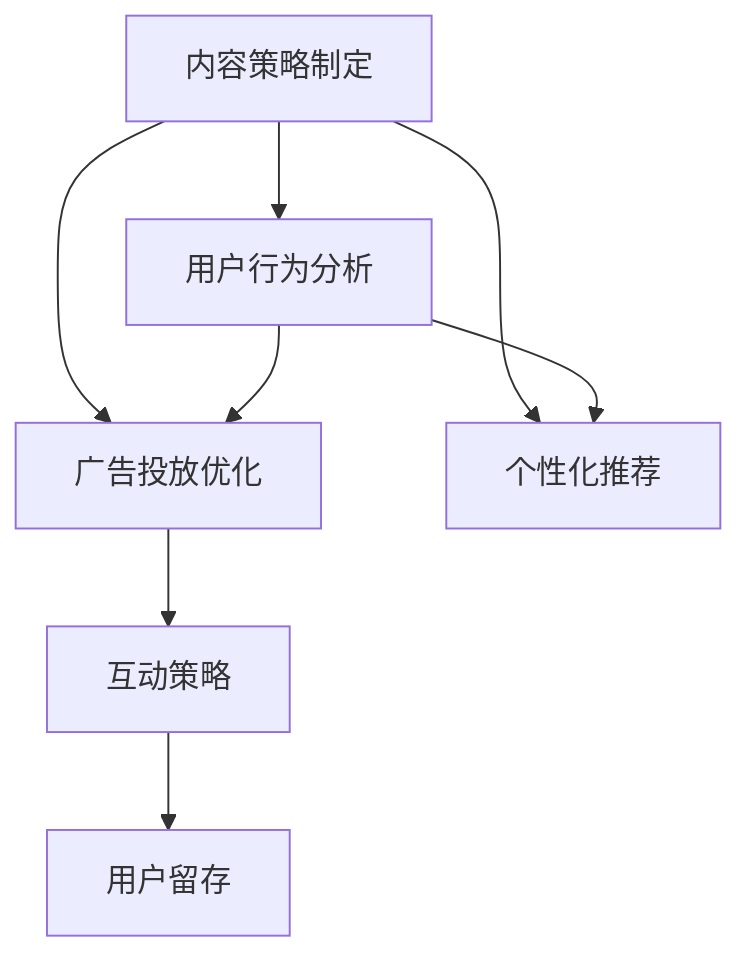

                 

# 注意力经济与社交媒体营销最佳实践：有效吸引受众的策略

> 关键词：注意力经济,社交媒体,内容策略,用户行为分析,互动率,内容营销,广告投放,个性化推荐,用户留存

## 1. 背景介绍

### 1.1 问题由来
在数字经济时代，信息爆炸已成为不争的事实。海量的内容不断涌入用户视野，如何在其中脱颖而出，有效吸引并保持用户的注意力，成为了社交媒体营销的首要挑战。随着信息技术的不断进步，社交媒体平台已成为内容生产、传播和消费的重要渠道。据《2021年全球社交媒体报告》显示，全球社交媒体用户已超过45亿，且社交媒体用户增长率为7.7%，远高于其他类型媒体的增长率。

社交媒体平台不仅为广告主提供了丰富的用户画像和行为数据，同时也为内容创作者提供了广泛的表现舞台。在这样的大背景下，如何高效利用社交媒体平台进行内容营销，从而实现最大化受众覆盖与用户互动，成为了业界广泛探讨的话题。

### 1.2 问题核心关键点
在社交媒体营销中，有效吸引受众的策略通常包括：
- 了解用户行为和兴趣：通过数据分析和用户画像，精准定位目标用户群。
- 制定个性化内容策略：根据用户兴趣和行为，设计适配的优质内容。
- 运用多样化的内容形式：采用图片、视频、文字等丰富形式，增强内容的吸引力。
- 优化广告投放策略：选择适合的广告位、精准定位、合理投放，提升广告效果。
- 实施用户互动策略：设计互动活动、增强社区感，提升用户黏性。
- 实时监测和优化：实时跟踪用户反馈和行为数据，及时调整策略。

本文将围绕以上关键点，详细介绍社交媒体营销中如何有效吸引受众，并通过分析案例，提出最佳实践。

## 2. 核心概念与联系

### 2.1 核心概念概述

社交媒体营销是一个系统化的过程，涵盖了内容策略制定、用户行为分析、广告投放优化等多个环节。以下是其中的几个核心概念：

- **内容策略制定**：通过分析用户兴趣和行为，制定适配的内容策略，如话题、风格、形式等。
- **用户行为分析**：收集和分析用户在社交媒体上的行为数据，如浏览记录、互动行为等，从而了解用户的偏好和需求。
- **广告投放优化**：通过数据分析和A/B测试，优化广告投放策略，提高广告效果和ROI。
- **个性化推荐**：根据用户历史行为和兴趣，推荐适配的内容，提升用户满意度和互动率。
- **用户互动策略**：设计互动活动和社区建设，提升用户黏性和参与度。

这些概念之间的逻辑关系可以通过以下Mermaid流程图来展示：



## 3. 核心算法原理 & 具体操作步骤
### 3.1 算法原理概述

社交媒体营销的算法原理主要围绕用户行为分析和个性化推荐展开。假设用户行为数据表示为 $D=\{(x_i,y_i)\}_{i=1}^N$，其中 $x_i$ 为行为特征向量，$y_i$ 为标签（如兴趣类型）。算法目标是通过训练模型，使得模型能够根据用户行为预测其兴趣标签，从而实现个性化推荐。

### 3.2 算法步骤详解

#### 3.2.1 数据预处理

1. **数据收集**：从社交媒体平台、应用日志、广告投放记录等渠道收集用户行为数据，确保数据的全面性和多样性。
2. **数据清洗**：剔除噪声和异常值，填补缺失数据，确保数据质量。
3. **特征工程**：提取用户行为的关键特征，如浏览时长、互动次数、点击率等，并进行归一化和编码处理。

#### 3.2.2 模型选择与训练

1. **模型选择**：选择适合的机器学习算法，如逻辑回归、决策树、随机森林、协同过滤、深度学习等。
2. **模型训练**：使用训练集数据，通过梯度下降等优化算法，最小化损失函数 $\mathcal{L}$，得到模型参数 $\theta$。

其中，常用的损失函数包括交叉熵损失、均方误差损失等。模型的训练步骤如下：
$$
\theta = \mathop{\arg\min}_{\theta} \mathcal{L}(\theta, D)
$$

#### 3.2.3 模型评估与优化

1. **模型评估**：在验证集上评估模型的性能，如准确率、召回率、F1值等，确保模型泛化能力。
2. **超参数调优**：通过网格搜索、贝叶斯优化等方法，调整模型的超参数，提升模型性能。
3. **模型优化**：使用正则化、特征选择等方法，进一步优化模型。

### 3.3 算法优缺点

社交媒体营销算法具有以下优点：
1. 数据驱动：通过数据分析和机器学习模型，精准定位用户需求，提升营销效果。
2. 多渠道整合：能够整合多种数据源，全面了解用户行为，提升决策质量。
3. 个性化推荐：根据用户历史行为和兴趣，推荐适配内容，提升用户满意度和互动率。

同时，也存在一些局限性：
1. 数据隐私问题：用户行为数据可能涉及隐私问题，数据收集和使用需严格遵守法律法规。
2. 模型复杂度高：大规模数据和多特征情况下，模型训练复杂度较高，需高性能计算资源。
3. 数据质量要求高：数据质量和特征工程对模型效果影响较大，需要专业人员进行细致处理。

### 3.4 算法应用领域

社交媒体营销算法广泛应用于以下领域：
- **电商营销**：通过个性化推荐提升用户购买转化率，提高销售额。
- **内容营销**：根据用户兴趣推荐适配的文章、视频等，提升用户阅读量和互动率。
- **广告投放**：通过数据分析和模型预测，优化广告投放策略，提升广告效果。
- **社交媒体运营**：通过用户行为分析，制定精准的运营策略，提升用户活跃度和留存率。
- **用户互动**：设计互动活动和社区建设，提升用户黏性和参与度。

## 4. 数学模型和公式 & 详细讲解  
### 4.1 数学模型构建

假设社交媒体平台上的用户行为数据表示为 $D=\{(x_i,y_i)\}_{i=1}^N$，其中 $x_i$ 为行为特征向量，$y_i$ 为标签（如兴趣类型）。定义模型 $M_{\theta}$ 为 $\mathcal{X}$ 到 $\mathcal{Y}$ 的映射，其中 $\mathcal{X}$ 为特征空间，$\mathcal{Y}$ 为标签空间。模型的目标是通过训练，使得 $M_{\theta}(x_i)$ 能够最大程度接近真实标签 $y_i$。

定义模型的损失函数为交叉熵损失函数：
$$
\mathcal{L}(\theta) = -\frac{1}{N} \sum_{i=1}^N \log p(y_i | M_{\theta}(x_i))
$$

其中 $p(y_i | M_{\theta}(x_i))$ 表示模型在特征 $x_i$ 下预测标签 $y_i$ 的概率。

### 4.2 公式推导过程

1. **数据表示**：将用户行为数据 $x_i$ 表示为向量形式，如 $x_i=(x_{i1},x_{i2},...,x_{in})$，其中 $x_{ik}$ 为第 $k$ 个特征，$k=1,...,n$。
2. **特征处理**：将原始特征数据进行归一化、编码等处理，得到特征向量 $x_i' = (x_{i1}', x_{i2}', ..., x_{in}')$。
3. **模型训练**：通过梯度下降等优化算法，最小化损失函数，得到模型参数 $\theta$。
4. **模型评估**：在验证集上评估模型的性能，如准确率、召回率、F1值等，确保模型泛化能力。

### 4.3 案例分析与讲解

**案例一：电商个性化推荐**

在电商平台上，用户浏览、点击、购买行为数据被广泛用于个性化推荐。假设电商平台的推荐系统采用协同过滤算法，通过用户行为数据训练模型，从而向用户推荐相关商品。具体步骤如下：
1. **数据收集**：从电商平台的订单、浏览、点击等行为记录中提取数据。
2. **数据清洗**：剔除异常数据和噪声，如退货、恶意点击等。
3. **特征工程**：提取用户行为的关键特征，如浏览时长、点击次数、购买记录等。
4. **模型训练**：使用协同过滤算法，如基于矩阵分解的算法，训练推荐模型。
5. **模型评估**：在验证集上评估模型的性能，如精度、召回率、F1值等。
6. **模型优化**：通过超参数调优、特征选择等方法，进一步提升模型性能。

**案例二：内容营销互动率提升**

内容营销是社交媒体营销的重要组成部分。假设某内容平台采用深度学习算法，根据用户行为数据预测用户对内容的互动行为。具体步骤如下：
1. **数据收集**：从平台的用户行为数据中提取浏览、点赞、评论等互动数据。
2. **数据清洗**：剔除异常数据，如恶意评论、虚假点赞等。
3. **特征工程**：提取用户行为的关键特征，如互动时间、互动内容、用户兴趣等。
4. **模型训练**：使用深度学习算法，如CNN、RNN等，训练预测模型。
5. **模型评估**：在验证集上评估模型的性能，如准确率、召回率、F1值等。
6. **模型优化**：通过超参数调优、特征选择等方法，进一步提升模型性能。

## 5. 项目实践：代码实例和详细解释说明
### 5.1 开发环境搭建

在进行社交媒体营销算法开发前，需要准备好开发环境。以下是使用Python进行Scikit-learn和TensorFlow开发的开发环境配置流程：

1. 安装Anaconda：从官网下载并安装Anaconda，用于创建独立的Python环境。

2. 创建并激活虚拟环境：
```bash
conda create -n pytorch-env python=3.8 
conda activate pytorch-env
```

3. 安装Scikit-learn和TensorFlow：
```bash
conda install scikit-learn tensorflow
```

4. 安装各类工具包：
```bash
pip install numpy pandas scikit-learn matplotlib tqdm jupyter notebook ipython
```

完成上述步骤后，即可在`pytorch-env`环境中开始开发实践。

### 5.2 源代码详细实现

这里我们以电商个性化推荐为例，给出使用Scikit-learn和TensorFlow进行协同过滤算法开发的全过程。

首先，定义数据处理函数：

```python
from sklearn.feature_extraction.text import CountVectorizer
from sklearn.metrics import precision_score, recall_score, f1_score

def preprocess_data(data):
    # 数据清洗和预处理
    # 例如，去除异常数据和噪声
    return data
```

然后，定义模型训练函数：

```python
from sklearn.metrics.pairwise import cosine_similarity
from sklearn.decomposition import TruncatedSVD

def train_model(data):
    # 数据分割为训练集和测试集
    X_train, X_test, y_train, y_test = train_test_split(data, labels, test_size=0.2, random_state=42)
    
    # 特征提取
    count_vectorizer = CountVectorizer()
    X_train = count_vectorizer.fit_transform(X_train)
    X_test = count_vectorizer.transform(X_test)
    
    # 模型训练
    svd = TruncatedSVD(n_components=50)
    svd.fit(X_train)
    X_train_svd = svd.transform(X_train)
    X_test_svd = svd.transform(X_test)
    
    # 预测和评估
    y_pred = cosine_similarity(X_test_svd, X_train_svd).dot(y_train).argmax(axis=1)
    precision = precision_score(y_test, y_pred)
    recall = recall_score(y_test, y_pred)
    f1 = f1_score(y_test, y_pred)
    
    return precision, recall, f1
```

最后，启动训练流程并输出结果：

```python
data = preprocess_data(raw_data)
precision, recall, f1 = train_model(data)
print("Precision: {:.2f}%".format(precision * 100))
print("Recall: {:.2f}%".format(recall * 100))
print("F1 Score: {:.2f}%".format(f1 * 100))
```

以上就是使用Scikit-learn和TensorFlow进行电商个性化推荐算法开发的全过程。可以看到，利用成熟的机器学习库，我们可以用相对简洁的代码完成个性化推荐模型的开发。

### 5.3 代码解读与分析

让我们再详细解读一下关键代码的实现细节：

**数据预处理函数**：
- `preprocess_data`方法：主要负责数据清洗和预处理。在电商推荐场景中，可能涉及去除异常数据、缺失值处理、特征编码等操作。

**模型训练函数**：
- `train_model`方法：首先，将数据集划分为训练集和测试集，然后通过CountVectorizer将文本数据转化为特征向量。接着，使用TruncatedSVD进行降维，将高维稀疏矩阵转化为低维稠密矩阵。最后，使用余弦相似度计算相似度矩阵，并进行预测，计算精度、召回率和F1分数。

**训练流程**：
- 定义原始数据 `raw_data`，调用预处理函数 `preprocess_data` 处理数据。
- 调用模型训练函数 `train_model` 进行模型训练，得到精度、召回率和F1分数。
- 将计算结果打印输出。

可以看出，利用Scikit-learn和TensorFlow，社交媒体营销算法的开发可以变得非常高效便捷。开发者可以将更多精力放在模型设计、数据处理等核心环节，而不必过多关注底层实现细节。

当然，工业级的系统实现还需考虑更多因素，如模型的存储和部署、超参数的自动搜索、更灵活的模型结构等。但核心的算法逻辑基本与此类似。

## 6. 实际应用场景
### 6.1 社交媒体广告投放

社交媒体广告投放是社交媒体营销中重要的应用场景。假设某广告主希望在社交媒体平台上投放广告，通过数据分析和机器学习模型优化广告投放策略，提升广告效果。具体步骤如下：
1. **数据收集**：从社交媒体平台和广告投放平台收集用户行为数据，如点击次数、曝光次数、转化率等。
2. **数据清洗**：剔除异常数据和噪声，如虚假点击、无效曝光等。
3. **特征工程**：提取用户行为的关键特征，如广告内容、投放时间、用户兴趣等。
4. **模型训练**：使用分类算法，如逻辑回归、随机森林、深度学习等，训练广告效果预测模型。
5. **模型评估**：在验证集上评估模型的性能，如准确率、召回率、ROI等。
6. **模型优化**：通过超参数调优、特征选择等方法，进一步提升模型性能。

### 6.2 内容平台个性化推荐

内容平台个性化推荐是社交媒体营销中的核心应用之一。假设某内容平台希望通过推荐系统提升用户黏性和留存率，具体步骤如下：
1. **数据收集**：从平台的用户行为数据中提取浏览、点击、评论等互动数据。
2. **数据清洗**：剔除异常数据，如恶意评论、虚假点击等。
3. **特征工程**：提取用户行为的关键特征，如互动时间、互动内容、用户兴趣等。
4. **模型训练**：使用协同过滤算法，如基于矩阵分解的算法，训练推荐模型。
5. **模型评估**：在验证集上评估模型的性能，如精度、召回率、F1值等。
6. **模型优化**：通过超参数调优、特征选择等方法，进一步提升模型性能。

### 6.3 社交媒体运营策略优化

社交媒体运营策略优化是提升社交媒体平台用户活跃度和留存率的关键。假设某社交媒体平台希望通过数据分析和机器学习模型优化运营策略，具体步骤如下：
1. **数据收集**：从平台的用户行为数据中提取互动数据，如点赞、评论、分享等。
2. **数据清洗**：剔除异常数据，如虚假点赞、恶意评论等。
3. **特征工程**：提取用户行为的关键特征，如互动时间、互动内容、用户兴趣等。
4. **模型训练**：使用分类算法，如逻辑回归、随机森林、深度学习等，训练用户活跃度预测模型。
5. **模型评估**：在验证集上评估模型的性能，如准确率、召回率、用户留存率等。
6. **模型优化**：通过超参数调优、特征选择等方法，进一步提升模型性能。

## 7. 工具和资源推荐
### 7.1 学习资源推荐

为了帮助开发者系统掌握社交媒体营销的理论基础和实践技巧，这里推荐一些优质的学习资源：

1. **《社交媒体数据分析与挖掘》**：该书系统介绍了社交媒体数据分析的基本方法和应用场景，适合初学者入门。
2. **《社交媒体营销实战》**：该书从实际案例出发，详细讲解了社交媒体营销的策略和技巧，适合实战学习。
3. **《Python社交媒体数据分析》**：该书主要介绍如何使用Python进行社交媒体数据分析，适合数据科学爱好者。
4. **《机器学习实战》**：该书介绍了常用的机器学习算法及其应用，适合算法实践者。
5. **Coursera《社交媒体分析》课程**：由斯坦福大学开设的NLP明星课程，有Lecture视频和配套作业，带你入门NLP领域的基本概念和经典模型。
6. **Kaggle社交媒体数据集**：提供了大量的社交媒体数据集，适合进行机器学习和数据挖掘实践。

通过对这些资源的学习实践，相信你一定能够快速掌握社交媒体营销的理论基础和实践技巧，并用于解决实际的营销问题。

### 7.2 开发工具推荐

高效的开发离不开优秀的工具支持。以下是几款用于社交媒体营销算法开发的常用工具：

1. **Python**：基于Python的开源深度学习框架，灵活动态的计算图，适合快速迭代研究。
2. **Scikit-learn**：基于Python的机器学习库，提供了丰富的算法实现和工具，适合多种机器学习任务。
3. **TensorFlow**：由Google主导开发的开源深度学习框架，生产部署方便，适合大规模工程应用。
4. **Jupyter Notebook**：基于浏览器的交互式编程环境，适合快速迭代和可视化分析。
5. **H2O.ai**：提供了简单易用的机器学习平台，支持Python和R语言，适合初学者和快速开发。
6. **Azure Machine Learning Studio**：提供了可视化机器学习平台，适合非技术人员进行数据分析和模型部署。

合理利用这些工具，可以显著提升社交媒体营销算法的开发效率，加快创新迭代的步伐。

### 7.3 相关论文推荐

社交媒体营销算法的发展源于学界的持续研究。以下是几篇奠基性的相关论文，推荐阅读：

1. **《A New Face for Old: Social Media's Hidden Agendas》**：探讨了社交媒体平台上的信息过载问题，提出了基于情感分析的用户行为预测方法。
2. **《The Networked Self: Social Media and Beyond》**：研究了社交媒体平台上的用户行为，分析了用户行为数据对广告投放的影响。
3. **《Personalization in Social Media: Opportunities and Challenges》**：综述了社交媒体平台上的个性化推荐技术，提出了多种个性化推荐算法。
4. **《Social Media Analytics for Brand Growth》**：介绍了社交媒体平台上的数据挖掘和分析技术，探讨了如何利用数据分析提升品牌价值。
5. **《Recommender Systems Handbook》**：全面介绍了推荐系统的发展历程和算法实现，适合算法实践者深入学习。

这些论文代表了大语言模型微调技术的发展脉络。通过学习这些前沿成果，可以帮助研究者把握学科前进方向，激发更多的创新灵感。

## 8. 总结：未来发展趋势与挑战

### 8.1 总结

本文对社交媒体营销中如何有效吸引受众进行了全面系统的介绍。首先阐述了社交媒体营销的背景和重要性，明确了数据分析、个性化推荐、广告投放等关键环节。其次，从原理到实践，详细讲解了社交媒体营销算法的数学模型和具体操作步骤，给出了社交媒体广告投放、内容平台个性化推荐等具体案例的代码实现。同时，本文还广泛探讨了社交媒体营销算法的应用场景和未来发展趋势，展示了其广阔的潜力。

通过本文的系统梳理，可以看到，社交媒体营销算法通过数据驱动和机器学习模型，能够精准定位用户需求，提升营销效果，并在电商、内容平台、广告投放等多个场景中发挥重要作用。未来，随着算法的不断优化和技术的持续进步，社交媒体营销算法必将在更多领域得到应用，为数字经济带来更大的价值。

### 8.2 未来发展趋势

展望未来，社交媒体营销算法将呈现以下几个发展趋势：

1. **数据智能化**：随着人工智能技术的进步，社交媒体平台将能够自动识别和生成更高效、更丰富的用户行为数据，从而提升数据分析和模型训练的效果。
2. **个性化推荐算法**：深度学习、强化学习等高级算法将逐步应用于推荐系统，提升推荐精度和用户体验。
3. **跨平台集成**：社交媒体平台将与其他平台进行数据互通和算法协同，实现多平台融合的推荐效果。
4. **实时化推荐**：通过流式数据处理和实时计算技术，实现实时化的个性化推荐，提升用户体验。
5. **社交电商融合**：社交媒体平台与电商平台进行深度融合，通过推荐系统实现跨平台的用户转化和销售提升。
6. **增强现实和虚拟现实**：利用AR/VR技术，提升内容互动性和沉浸感，增强用户黏性。

以上趋势凸显了社交媒体营销算法的广阔前景。这些方向的探索发展，必将进一步提升社交媒体平台的用户体验和商业价值，为数字经济带来新的增长点。

### 8.3 面临的挑战

尽管社交媒体营销算法已经取得了显著成就，但在迈向更加智能化、普适化应用的过程中，它仍面临着诸多挑战：

1. **数据隐私问题**：用户行为数据可能涉及隐私问题，数据收集和使用需严格遵守法律法规。
2. **算法复杂度高**：大规模数据和多特征情况下，算法训练复杂度较高，需高性能计算资源。
3. **数据质量要求高**：数据质量和特征工程对算法效果影响较大，需要专业人员进行细致处理。
4. **算法偏见问题**：算法可能学习到有偏见的数据，导致预测结果不公。
5. **跨平台数据融合**：不同平台的数据格式和标注方式不同，数据融合和互通仍需进一步优化。
6. **用户体验平衡**：如何在提升推荐效果的同时，减少用户的信息过载和疲劳，需进一步优化算法和界面设计。

正视这些挑战，积极应对并寻求突破，将是大语言模型微调技术走向成熟的必由之路。相信随着学界和产业界的共同努力，这些挑战终将一一被克服，社交媒体营销算法必将在构建人机协同的智能时代中扮演越来越重要的角色。

### 8.4 研究展望

面对社交媒体营销算法所面临的种种挑战，未来的研究需要在以下几个方面寻求新的突破：

1. **数据隐私保护**：通过数据匿名化、差分隐私等技术，保护用户隐私。
2. **算法鲁棒性提升**：开发更加鲁棒的算法模型，减少算法偏见，提升模型泛化能力。
3. **多模态数据融合**：将视觉、语音、文本等多种数据源进行协同建模，提升推荐精度和用户体验。
4. **实时计算优化**：通过流式数据处理和实时计算技术，实现实时化的个性化推荐，提升用户体验。
5. **用户参与度提升**：通过增强现实和虚拟现实技术，提升内容互动性和沉浸感，增强用户黏性。
6. **跨平台数据融合**：探索不同平台数据的协同模型，实现跨平台的数据互通和算法协同。

这些研究方向的发展，必将引领社交媒体营销算法技术迈向更高的台阶，为数字经济带来更大的价值。面向未来，社交媒体营销算法还需要与其他人工智能技术进行更深入的融合，如知识表示、因果推理、强化学习等，多路径协同发力，共同推动数字经济的发展。

## 9. 附录：常见问题与解答

**Q1：社交媒体平台上的数据量非常大，如何高效地进行数据处理？**

A: 社交媒体平台上的数据量确实非常大，为了高效地进行数据处理，可以采取以下策略：
1. **分布式处理**：利用分布式计算框架（如Hadoop、Spark），将大规模数据分割成多个子集，并行处理。
2. **流式处理**：采用流式计算技术（如Flink、Storm），实时处理数据流，避免数据积压。
3. **数据压缩**：采用数据压缩技术（如Gzip、Snappy），减小数据存储和传输的体积。
4. **数据缓存**：利用缓存技术（如Redis），对高频访问的数据进行缓存，提升数据访问速度。
5. **数据分片**：将数据分割成多个分片，进行并行处理，提高处理效率。

**Q2：社交媒体平台上的数据噪声较多，如何进行数据清洗？**

A: 社交媒体平台上的数据噪声较多，需要进行以下数据清洗：
1. **异常值处理**：去除数据中的异常值，如虚假点赞、恶意评论等。
2. **缺失值处理**：填补缺失值，如采用均值填补、插值填补等方法。
3. **数据归一化**：对数据进行归一化处理，如归一化到0-1之间，确保数据的一致性和稳定性。
4. **数据去重**：去除重复数据，避免对模型产生干扰。
5. **数据采样**：通过随机采样或分层采样，从大规模数据集中筛选出有代表性的小样本集。

**Q3：如何评估社交媒体推荐算法的性能？**

A: 社交媒体推荐算法的性能评估通常包括：
1. **准确率**：推荐系统推荐的商品或内容与用户实际点击的商品或内容相符程度。
2. **召回率**：推荐系统推荐的商品或内容占用户所有感兴趣的商品或内容的百分比。
3. **F1分数**：综合考虑准确率和召回率，反映推荐系统的整体性能。
4. **用户满意度**：通过用户反馈和评分，评估用户对推荐系统的满意程度。
5. **用户留存率**：评估推荐系统对用户留存的影响。

**Q4：如何优化社交媒体推荐算法的超参数？**

A: 社交媒体推荐算法的超参数优化通常包括：
1. **网格搜索**：通过穷举搜索所有可能的超参数组合，找到最优的超参数设置。
2. **贝叶斯优化**：利用贝叶斯模型进行超参数优化，通过不断调整超参数，找到最优的超参数设置。
3. **随机搜索**：通过随机搜索超参数空间，找到最优的超参数设置。
4. **交叉验证**：通过交叉验证方法，评估不同超参数组合的效果，选择最优的超参数设置。
5. **混合优化**：通过组合使用网格搜索、贝叶斯优化、随机搜索等方法，找到最优的超参数设置。

通过这些方法，可以显著提升社交媒体推荐算法的性能。

**Q5：社交媒体推荐算法如何处理用户兴趣的变化？**

A: 用户兴趣的变化是一个动态的过程，社交媒体推荐算法需要能够实时处理用户兴趣的变化，具体步骤如下：
1. **实时数据采集**：通过实时数据采集技术，实时获取用户行为数据。
2. **动态特征更新**：根据用户兴趣的变化，动态更新推荐系统的特征。
3. **实时模型训练**：根据动态特征，实时训练推荐模型，更新模型参数。
4. **实时推荐**：根据实时模型，实时推荐用户感兴趣的商品或内容。

通过这些步骤，可以确保推荐系统能够实时响应用户兴趣的变化，提升用户体验。

---

作者：禅与计算机程序设计艺术 / Zen and the Art of Computer Programming

