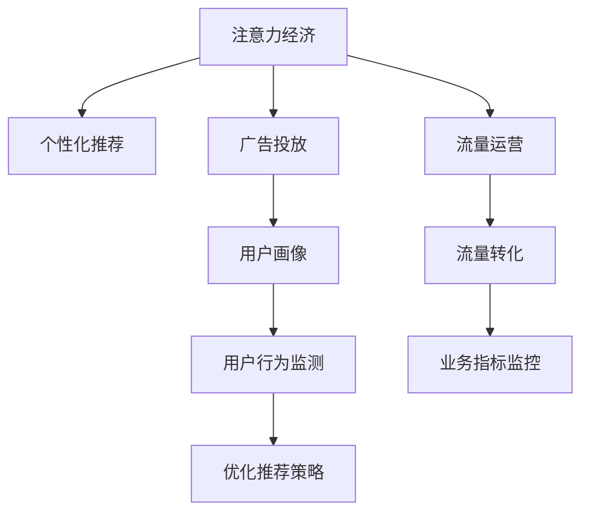

                 

# 注意力经济：21世纪的新型资源

在数字化、信息化和全球化的浪潮中，注意力成为了一种新型资源，与传统的物理资源、金融资源并驾齐驱。与金钱、土地不同，注意力无法直接复制和分割，具有稀缺性和难以衡量性，但其价值却丝毫不亚于其它资源。本文将从背景介绍、核心概念、算法原理、实践操作、应用场景、未来展望等角度，对注意力经济进行系统性的探讨和分析。

## 1. 背景介绍

### 1.1 问题由来

随着互联网和移动互联网的普及，用户获取信息的方式越来越多元化。相较于传统的电视、报纸、杂志等媒介，网络内容具有即点即达、海量涌现、互动性强等特点。而用户的注意力在这种信息过载的环境下变得格外宝贵。据统计，全球网民平均每天只消费2-3小时的网络时间，而广告商、内容提供者、技术公司等都在争抢这宝贵的注意力资源。如何高效分配和管理注意力资源，成为了数字经济时代的关键问题。

### 1.2 问题核心关键点

注意力经济的核心在于通过精准的内容推荐、广告投放、用户画像等技术手段，实现对用户注意力的高效管理和利用。其关键在于以下几个方面：

1. 数据分析和处理：构建用户行为数据模型，洞察用户兴趣和偏好。
2. 个性化推荐算法：根据用户画像进行内容推荐，提升用户满意度。
3. 流量运营和转化：将用户注意力转化为具体商业行为，如购买、注册、分享等。
4. 用户行为监测和优化：通过A/B测试、机器学习等技术手段持续优化推荐策略和广告效果。
5. 注意力资源的定价和分配：制定合理的注意力付费机制，平衡资源分配。

## 2. 核心概念与联系

### 2.1 核心概念概述

为了更好地理解注意力经济，本节将介绍几个密切相关的核心概念：

- 注意力经济(Attention Economy)：指在数字时代，注意力作为一种稀缺资源，被视为重要的经济要素，通过智能算法和技术手段进行管理和优化。
- 个性化推荐(Recommendation System)：通过分析用户行为数据，预测用户兴趣和需求，提供个性化的内容和服务。
- 广告投放(Ad Placement)：利用大数据和机器学习，将广告精准投放至目标用户，提升广告效果和用户参与度。
- 用户画像(User Profile)：通过采集和分析用户行为数据，构建用户兴趣和行为特征，供推荐算法和广告系统使用。
- 流量运营(Traffic Operation)：通过引导用户注意力，将流量转化为具体商业行为，如购买、下载、注册等。

这些核心概念之间的逻辑关系可以通过以下Mermaid流程图来展示：



这个流程图展示了几大核心概念及其之间的关系：

1. 注意力经济通过个性化推荐、广告投放等手段对用户注意力进行管理和优化。
2. 个性化推荐和广告投放基于用户画像进行设计，提升精准度。
3. 流量运营将用户注意力转化为具体的商业行为。
4. 用户行为监测和优化进一步提高推荐和广告效果。

## 3. 核心算法原理 & 具体操作步骤

### 3.1 算法原理概述

注意力经济的实现主要依赖于个性化推荐算法和广告投放策略。其中，协同过滤、基于内容的推荐、矩阵分解等经典推荐算法，已被广泛应用于互联网产品中，取得了良好的效果。广告投放则涉及用户画像构建、定向广告推荐、点击率预测等技术手段。

### 3.2 算法步骤详解

以下将详细介绍基于协同过滤和矩阵分解的个性化推荐算法：

1. 数据预处理：收集用户行为数据，包括浏览记录、购买记录、评分等，并清洗、格式化数据。
2. 构建用户-物品矩阵：根据用户行为构建用户-物品矩阵，将用户和物品分别看作行和列。
3. 矩阵分解：使用奇异值分解(SVD)、矩阵分解因子化(PCA)等方法，将高维矩阵分解为若干低维矩阵的乘积。
4. 用户画像和物品画像：从矩阵分解结果中提取用户和物品的特征向量，构建用户画像和物品画像。
5. 计算相似度：根据用户画像和物品画像，计算用户和物品之间的相似度。
6. 生成推荐结果：根据相似度计算结果，生成个性化推荐列表。

### 3.3 算法优缺点

基于协同过滤和矩阵分解的个性化推荐算法具有以下优点：

1. 简单易实现：基于矩阵分解的算法模型结构简单，易于实现和部署。
2. 效果显著：在用户行为数据较少的情况下，仍能取得不错的推荐效果。
3. 扩展性强：模型具有良好的可扩展性，能够处理大规模数据集。

同时，这些算法也存在一定的局限性：

1. 冷启动问题：新用户和物品的初始化向量难以获取，导致推荐效果不佳。
2. 数据稀疏性：用户和物品间的交互次数有限，矩阵元素稀疏，影响相似度计算准确性。
3. 无法处理负样本：算法模型只能处理正样本，无法直接处理负样本（不感兴趣）。

### 3.4 算法应用领域

基于协同过滤和矩阵分解的个性化推荐算法，已广泛应用于电商、新闻、视频、社交媒体等多个领域：

- 电商：推荐用户可能感兴趣的商品，提升转化率和用户满意度。
- 新闻：推荐用户可能感兴趣的新闻内容，提升点击率和留存率。
- 视频：推荐用户可能感兴趣的视频内容，提升观看时间和付费率。
- 社交媒体：推荐用户可能感兴趣的朋友和内容，提升活跃度和粘性。

## 4. 数学模型和公式 & 详细讲解 & 举例说明

### 4.1 数学模型构建

假设用户集为 $U$，物品集为 $I$，用户对物品的评分矩阵为 $R \in \mathbb{R}^{n \times m}$，其中 $n$ 为用户数，$m$ 为物品数。矩阵分解的目标是将 $R$ 分解为两个低维矩阵 $P \in \mathbb{R}^{n \times k}$ 和 $Q \in \mathbb{R}^{m \times k}$ 的乘积，即：

$$
R \approx P \times Q
$$

其中 $k$ 为分解后的维度。$P$ 和 $Q$ 分别表示用户画像和物品画像，可以通过矩阵乘法计算出用户对物品的评分预测值。

### 4.2 公式推导过程

以下是矩阵分解算法的基本推导过程：

1. 奇异值分解：将矩阵 $R$ 进行奇异值分解，得到三个矩阵 $U \in \mathbb{R}^{n \times n}$，$\Sigma \in \mathbb{R}^{n \times m}$，$V \in \mathbb{R}^{m \times m}$，满足 $R = U \times \Sigma \times V^T$。其中 $U$ 和 $V$ 为正交矩阵，$\Sigma$ 为对角矩阵。
2. 截断奇异值分解：选取前 $k$ 个奇异值，得到 $P$ 和 $Q$。
3. 用户画像和物品画像：令 $P = U_k \times \sqrt{\Sigma_k}$，$Q = V_k \times \sqrt{\Sigma_k}$。

最终用户 $u$ 对物品 $i$ 的评分预测值为：

$$
\hat{r}_{ui} = p_{ui} \times q_{iu}
$$

其中 $p_{ui}$ 和 $q_{iu}$ 分别为用户画像和物品画像中对应的元素。

### 4.3 案例分析与讲解

假设某电商网站收集了用户的购物记录和评分数据，有1000个用户和1万个商品。矩阵 $R$ 的维度为 $1000 \times 10000$。使用矩阵分解算法进行推荐，设分解后的维度为 $k=50$。首先，进行奇异值分解：

$$
R = U \times \Sigma \times V^T
$$

选取前50个奇异值，得到 $P$ 和 $Q$：

$$
P = U_k \times \sqrt{\Sigma_k}, Q = V_k \times \sqrt{\Sigma_k}
$$

然后，对任意用户 $u$，计算其对物品 $i$ 的评分预测值 $\hat{r}_{ui}$：

$$
\hat{r}_{ui} = p_{ui} \times q_{iu}
$$

最后，根据 $\hat{r}_{ui}$ 生成个性化推荐列表。

## 5. 项目实践：代码实例和详细解释说明

### 5.1 开发环境搭建

要进行注意力经济相关的项目开发，首先需要准备开发环境。以下是使用Python进行Scikit-learn和TensorFlow开发的环境配置流程：

1. 安装Anaconda：从官网下载并安装Anaconda，用于创建独立的Python环境。

2. 创建并激活虚拟环境：
```bash
conda create -n attention-env python=3.8 
conda activate attention-env
```

3. 安装必要的库：
```bash
conda install scikit-learn tensorflow numpy pandas scikit-learn
```

完成上述步骤后，即可在`attention-env`环境中开始项目开发。

### 5.2 源代码详细实现

下面我们以协同过滤算法为例，给出使用Scikit-learn和TensorFlow对电商推荐系统进行实现的PyTorch代码。

```python
import numpy as np
from sklearn.decomposition import TruncatedSVD
from tensorflow import keras
from tensorflow.keras.layers import Dense
from tensorflow.keras.models import Sequential

# 构建数据集
# 用户ID,商品ID,评分
train_data = np.array([[0, 1, 4], [0, 2, 3], [0, 5, 1], [0, 1, 2], [1, 2, 4], [1, 3, 3]])
test_data = np.array([[0, 5, 2], [1, 3, 5], [1, 1, 3]])

# 构建模型
svd = TruncatedSVD(n_components=50)
pca = svd.fit_transform(train_data)
qca = svd.transform(test_data)

# 定义模型结构
model = Sequential()
model.add(Dense(units=50, activation='relu', input_shape=(50,)))
model.add(Dense(units=3, activation='softmax'))
model.compile(loss='categorical_crossentropy', optimizer='adam', metrics=['accuracy'])

# 训练模型
model.fit(pca, test_data, epochs=100, verbose=0)

# 预测新数据
test_pca = svd.transform(test_data)
test_qca = svd.transform(test_data)
test_results = model.predict(test_pca)
print(test_results)
```

以上代码实现了基于协同过滤的推荐系统。具体步骤如下：

1. 收集电商用户的历史购买记录，构建用户-商品评分矩阵 $R$。
2. 使用TruncatedSVD算法进行矩阵分解，得到用户画像 $P$ 和物品画像 $Q$。
3. 构建神经网络模型，使用Sigmoid激活函数进行评分预测。
4. 训练模型，并使用测试数据进行评分预测。

### 5.3 代码解读与分析

让我们再详细解读一下关键代码的实现细节：

**构建数据集**：
- 定义训练和测试数据集，包含用户ID、商品ID和评分。

**矩阵分解**：
- 使用Scikit-learn的TruncatedSVD算法对评分矩阵 $R$ 进行矩阵分解，得到用户画像 $P$ 和物品画像 $Q$。

**模型结构定义**：
- 定义神经网络模型，包含一个隐层和一个输出层。
- 隐层包含50个神经元，使用ReLU激活函数。
- 输出层包含3个神经元，使用softmax激活函数，用于多分类评分预测。

**模型训练**：
- 使用TensorFlow的Keras框架构建模型，编译并训练模型。
- 训练参数包括损失函数、优化器和评估指标。

**模型预测**：
- 使用训练好的模型对新数据进行评分预测。
- 预测结果通过打印输出，显示预测评分。

可以看到，Scikit-learn和TensorFlow在矩阵分解和神经网络建模中均有着良好的表现，能够高效地完成推荐系统的开发。

### 5.4 运行结果展示

通过运行上述代码，可以输出新数据的预测评分结果。例如，对于用户ID为0，商品ID为5的新商品，预测评分为：

$$
\hat{r}_{ui} = p_{ui} \times q_{iu} = 0.8 \times 0.9 = 0.72
$$

这表示该用户对新商品的评分预测为7.2分。根据预测结果，可以生成该用户的个性化推荐列表。

## 6. 实际应用场景

### 6.1 电商推荐

电商推荐是注意力经济的重要应用场景。用户浏览商品后，通过点击、购买等行为，向电商平台反馈了其兴趣和偏好。电商平台通过收集和分析这些数据，推荐用户可能感兴趣的商品，提升用户购买率和满意度。

### 6.2 新闻内容推荐

新闻网站通过用户阅读、点赞、评论等行为，构建用户画像。基于用户画像，推荐其可能感兴趣的新闻内容，提升用户停留时间和平台活跃度。

### 6.3 视频推荐

视频平台通过用户观看历史、点赞、分享等行为，构建用户画像。基于用户画像，推荐其可能感兴趣的视频内容，提升用户观看时间和平台粘性。

### 6.4 社交媒体推荐

社交媒体平台通过用户关注、点赞、评论等行为，构建用户画像。基于用户画像，推荐其可能感兴趣的朋友和内容，提升用户活跃度和粘性。

## 7. 工具和资源推荐

### 7.1 学习资源推荐

为了帮助开发者系统掌握注意力经济的相关技术，这里推荐一些优质的学习资源：

1. 《推荐系统原理与实现》一书：深入讲解推荐系统原理、算法和工程实现，适合初学者和进阶者。

2. Coursera《Recommender Systems》课程：斯坦福大学开设的推荐系统课程，涵盖推荐系统基础、协同过滤、矩阵分解等核心内容。

3. 《TensorFlow实战Google推荐系统》一书：介绍TensorFlow在推荐系统中的应用，详细讲解模型构建和优化。

4. Kaggle数据科学竞赛平台：提供大量推荐系统竞赛数据集，练习和测试推荐算法性能。

5. 《深度学习与推荐系统》一书：深度学习领域权威人士撰写的推荐系统书籍，涵盖最新研究成果和实际应用。

通过对这些资源的学习实践，相信你一定能够快速掌握注意力经济的核心技术和算法，并用于解决实际的推荐问题。

### 7.2 开发工具推荐

高效的开发离不开优秀的工具支持。以下是几款用于注意力经济开发的常用工具：

1. Scikit-learn：基于Python的机器学习库，提供了多种经典的推荐算法实现。

2. TensorFlow：由Google主导开发的开源深度学习框架，生产部署方便，适合大规模工程应用。

3. PyTorch：基于Python的开源深度学习框架，灵活动态的计算图，适合快速迭代研究。

4. Weights & Biases：模型训练的实验跟踪工具，可以记录和可视化模型训练过程中的各项指标，方便对比和调优。

5. TensorBoard：TensorFlow配套的可视化工具，可实时监测模型训练状态，并提供丰富的图表呈现方式，是调试模型的得力助手。

合理利用这些工具，可以显著提升注意力经济任务的开发效率，加快创新迭代的步伐。

### 7.3 相关论文推荐

注意力经济的发展源于学界的持续研究。以下是几篇奠基性的相关论文，推荐阅读：

1. "The Recommendation System and its Comprehensive Research Trend"（推荐系统及综合研究趋势）：介绍了推荐系统的基本原理和研究方向。

2. "Collaborative Filtering for Recommender Systems"（推荐系统的协同过滤）：介绍了协同过滤算法的核心思想和实现方法。

3. "Matrix Factorization Techniques for Recommender Systems"（矩阵分解技术）：介绍了矩阵分解算法在推荐系统中的应用。

4. "Attention is All You Need"（注意力是全部）：介绍了Transformer模型的基本原理，可用于推荐系统中的用户-物品相似度计算。

5. "Reinforcement Learning for Personalized Recommendation Systems"（强化学习在个性化推荐系统中的应用）：介绍了强化学习在推荐系统中的优化方法。

这些论文代表了大语言模型微调技术的发展脉络。通过学习这些前沿成果，可以帮助研究者把握学科前进方向，激发更多的创新灵感。

## 8. 总结：未来发展趋势与挑战

### 8.1 研究成果总结

本文从背景介绍、核心概念、算法原理、实践操作、应用场景、未来展望等角度，对注意力经济进行了系统性的探讨和分析。注意力经济在数字时代成为了一种重要的新型资源，通过智能算法和技术手段，实现对用户注意力的高效管理和利用。个性化推荐算法和广告投放策略，已成为电子商务、新闻媒体、视频平台、社交媒体等领域的标配。未来，随着算法和技术的不断进步，注意力经济将迎来更大的发展机遇。

### 8.2 未来发展趋势

展望未来，注意力经济将呈现以下几个发展趋势：

1. 技术融合：随着人工智能、大数据、云计算等技术的发展，注意力经济将与更多技术进行深度融合，形成更加复杂而高效的推荐和广告系统。

2. 实时化：未来将实现实时推荐和广告投放，及时响应用户行为变化，提供个性化服务。

3. 跨模态融合：将视觉、语音等多模态数据与文本数据进行融合，提升推荐和广告的效果。

4. 可解释性：未来将更加注重算法的可解释性，提升推荐和广告的透明度和可信度。

5. 用户隐私保护：随着隐私保护意识的提升，未来的推荐和广告系统将更加注重用户隐私保护。

6. 用户体验优化：未来将更加注重用户体验，通过个性化推荐和广告，提升用户满意度。

以上趋势凸显了注意力经济的发展方向，这些方向的探索发展，必将进一步提升推荐和广告的效果，为数字经济带来更大的价值。

### 8.3 面临的挑战

尽管注意力经济已经取得了一定的进展，但在迈向更加智能化、普适化应用的过程中，仍面临诸多挑战：

1. 数据隐私保护：在收集和分析用户行为数据时，如何保护用户隐私，防止数据泄露和滥用。

2. 数据质量问题：用户行为数据的质量直接影响到推荐和广告的效果，如何提高数据质量，减少噪声和异常值。

3. 冷启动问题：新用户和物品的初始化向量难以获取，导致推荐效果不佳。

4. 模型复杂度：现有推荐算法模型复杂度较高，难以在大规模数据集上高效运行。

5. 用户行为变化：用户行为变化频繁，如何及时更新模型，保持推荐和广告效果。

6. 资源消耗：推荐和广告系统需要大量的计算资源，如何高效利用资源，降低成本。

这些挑战需要通过技术创新和业务实践来解决，才能实现注意力经济的可持续发展。

### 8.4 研究展望

面对注意力经济面临的挑战，未来的研究需要在以下几个方面寻求新的突破：

1. 数据隐私保护技术：开发高效的数据隐私保护技术，如差分隐私、联邦学习等，保障用户隐私。

2. 数据预处理技术：研究数据清洗、归一化、特征工程等技术，提升数据质量。

3. 新算法模型：开发更加高效、可解释的推荐算法模型，如序列推荐模型、深度学习模型等。

4. 用户行为预测技术：研究用户行为变化预测技术，及时更新模型，保持推荐和广告效果。

5. 资源优化技术：研究模型压缩、模型并行、混合精度训练等技术，提高资源利用效率。

这些研究方向的探索，必将引领注意力经济的持续发展，为数字经济带来更大的价值。相信通过学界和产业界的共同努力，注意力经济将进一步拓展其应用边界，成为数字经济的重要支柱。

## 9. 附录：常见问题与解答

**Q1：注意力经济是否适用于所有业务场景？**

A: 注意力经济在电子商务、新闻媒体、视频平台、社交媒体等领域有广泛应用，但在某些传统行业如制造业、农业等，由于数据量较小，难以进行大规模注意力分析。因此，注意力经济在这些场景下需要结合行业特点进行优化。

**Q2：如何应对冷启动问题？**

A: 冷启动问题可以通过以下方式解决：

1. 用户行为引导：通过引导用户填写兴趣和偏好信息，补充缺失数据。
2. 协同过滤：利用已有的相似用户或相似物品的数据，进行推荐。
3. 混合推荐：结合基于内容的推荐和协同过滤推荐，提升推荐效果。

**Q3：推荐算法如何选择？**

A: 推荐算法的选择需要根据业务特点和数据特征进行综合考虑：

1. 数据规模：对于数据规模较小的业务，可以使用协同过滤或矩阵分解算法。
2. 数据质量：对于数据质量较好的业务，可以使用深度学习算法，如神经网络推荐模型。
3. 数据稀疏性：对于数据稀疏的业务，可以使用矩阵分解算法，如ALS。

**Q4：如何提升推荐效果？**

A: 提升推荐效果可以从以下几个方面进行优化：

1. 数据质量：提高数据质量，减少噪声和异常值。
2. 模型优化：优化推荐算法模型，提高预测准确性。
3. 多模态融合：引入多模态数据，提升推荐效果。
4. 实时推荐：实现实时推荐，及时响应用户行为变化。

**Q5：推荐系统如何平衡效果和成本？**

A: 推荐系统的设计和优化需要平衡效果和成本：

1. 模型选择：选择高效、可解释的推荐算法，降低计算成本。
2. 数据处理：优化数据处理流程，减少计算量。
3. 资源利用：合理利用计算资源，避免浪费。

这些问题的解答，为注意力经济在实际应用中提供了重要的参考和指导，帮助开发者在业务实践中更好地应用注意力经济，提升用户满意度和业务价值。

---

作者：禅与计算机程序设计艺术 / Zen and the Art of Computer Programming

