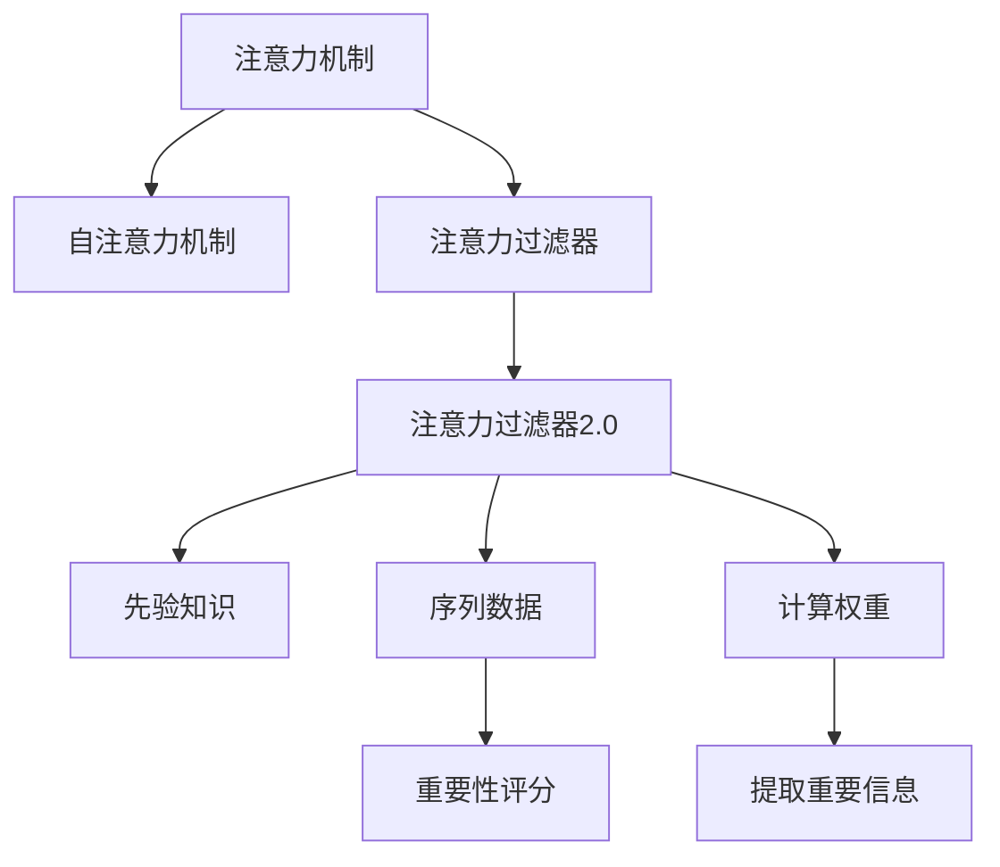

                 

# 注意力过滤器2.0：AI驱动的信息优化系统

## 1. 背景介绍

### 1.1 问题由来
在信息爆炸的今天，互联网充斥着海量内容，但优质的信息仍稀缺。如何高效过滤出有价值的信息，成为人们面临的重大挑战。人工筛选效率低、成本高，因此AI驱动的信息优化系统应运而生，借助先进算法自动提取关键信息，提升信息获取效率。

### 1.2 问题核心关键点
本文聚焦于注意力机制在信息优化系统中的应用，特别是基于自注意力机制的注意力过滤器2.0，进一步提升信息筛选的精确度和效率。

## 2. 核心概念与联系

### 2.1 核心概念概述
为更好地理解注意力机制在信息优化系统中的应用，本节将介绍几个密切相关的核心概念：

- **注意力机制(Attention Mechanism)**：一种用于衡量输入序列中不同位置信息重要性的技术，通过给不同位置赋予不同的权重，将输入序列中重要信息提取出来。常见于机器翻译、自然语言处理等领域。
- **自注意力机制(Self-Attention)**：一种特殊形式的注意力机制，用于处理序列数据，通过输入序列自身各位置之间的相互关联，计算权重，提取重要信息。
- **注意力过滤器(Attention Filter)**：基于注意力机制的信息筛选模型，用于从大量文本中筛选出与特定主题、任务相关的信息。
- **注意力过滤器2.0**：新一代基于自注意力机制的信息优化系统，通过改进注意力计算方法和引入先验知识，进一步提升信息筛选的精度和效率。

这些核心概念之间的逻辑关系可以通过以下Mermaid流程图来展示：



这个流程图展示了几者之间的逻辑关系：

1. 注意力机制通过给输入序列中不同位置信息赋予不同的权重，提取重要信息。
2. 自注意力机制进一步优化了注意力计算，可以处理序列数据。
3. 注意力过滤器基于注意力机制，用于信息筛选，并引入先验知识提升精度。
4. 注意力过滤器2.0在注意力过滤器基础上，通过改进注意力计算方法和引入先验知识，进一步提升性能。

这些概念共同构成了基于注意力机制的信息优化系统框架，使得系统能够自动筛选出最相关的信息。

## 3. 核心算法原理 & 具体操作步骤
### 3.1 算法原理概述

注意力过滤器2.0算法原理基于自注意力机制，通过学习输入序列中不同位置之间的关系，赋予不同位置不同的权重，最终提取重要信息。其核心思想可以简述为：

1. 将输入序列编码成向量表示。
2. 通过自注意力机制计算不同位置向量之间的关联权重。
3. 根据权重，对输入序列中重要信息进行加权，提取重要信息。

### 3.2 算法步骤详解

以下详细介绍基于注意力机制的信息优化系统的核心算法步骤：

**Step 1: 输入序列预处理**
- 将输入序列通过分词器转化为token序列。
- 对token进行编码，生成embedding向量表示。

**Step 2: 自注意力机制**
- 对输入序列进行自注意力计算，得到不同位置之间的权重矩阵 $A$。
- 使用softmax函数将权重归一化，得到权重向量 $W$。

**Step 3: 计算重要性评分**
- 将权重向量 $W$ 与原始embedding向量 $E$ 进行加权，得到加权向量 $E^*$。
- 使用线性变换得到重要性评分向量 $H$。

**Step 4: 提取重要信息**
- 对重要性评分向量 $H$ 进行非线性变换，得到最终的信息表示向量 $G$。
- 使用softmax函数对 $G$ 进行归一化，得到注意力权重分布 $P$。
- 根据 $P$ 对原始序列进行加权平均，得到优化后的信息表示向量 $Z$。

**Step 5: 输出信息表示**
- 对优化后的信息表示向量 $Z$ 进行分类、聚类、摘要等操作，输出最终的信息表示。

### 3.3 算法优缺点

基于注意力机制的信息优化系统具备以下优点：
1. 高精度：通过自注意力机制，系统可以全面衡量输入序列中不同位置的重要性，提取最相关的信息。
2. 高效性：通过引入先验知识，系统可以预筛选出重要信息，避免冗余计算。
3. 可解释性：自注意力机制的权重计算过程透明，便于理解和解释。

但同时也存在一些局限：
1. 计算复杂度高：自注意力机制计算复杂度较高，需要大量计算资源。
2. 对标注数据依赖大：系统性能依赖标注数据的数量和质量，标注数据不足时效果可能不佳。
3. 易过拟合：系统可能过度拟合训练数据，泛化能力有限。

### 3.4 算法应用领域

基于注意力机制的信息优化系统已经在多个领域得到了广泛的应用，如新闻推荐、搜索结果排序、文本摘要、问答系统等。

- 新闻推荐系统：根据用户的历史浏览记录，推荐相关新闻。
- 搜索结果排序：根据搜索词和网页内容，排序搜索结果。
- 文本摘要：提取文本中最相关部分，生成简洁摘要。
- 问答系统：对自然语言问题给出答案。

这些应用展示了注意力机制在信息优化系统中的强大潜力，可以提升信息获取和处理的效率。

## 4. 数学模型和公式 & 详细讲解  
### 4.1 数学模型构建

本节将使用数学语言对基于注意力机制的信息优化系统进行更严格的刻画。

记输入序列为 $X=\{x_1, x_2, ..., x_n\}$，其中 $x_i$ 表示第 $i$ 个token的embedding向量。设 $Q$ 为query向量，$K$ 和 $V$ 分别为key向量和value向量。

定义注意力权重矩阵 $A$ 和权重向量 $W$，具体计算公式如下：

$$
A = \frac{\exp(Q K^T)}{\sum_{i=1}^n \exp(Q K_i^T)}
$$

$$
W = A V
$$

其中 $\exp$ 表示指数函数，$K^T$ 和 $V$ 分别表示key向量和value向量的转置。

定义重要性评分向量 $H$，计算公式如下：

$$
H = \sigma(W)
$$

其中 $\sigma$ 表示激活函数，如sigmoid或tanh。

定义信息表示向量 $G$，计算公式如下：

$$
G = \tanh(H)
$$

最终，对信息表示向量 $G$ 进行归一化，得到优化后的信息表示向量 $Z$，计算公式如下：

$$
Z = \frac{G}{\sum_{i=1}^n G_i}
$$

### 4.2 公式推导过程

下面推导注意力机制中关键公式的计算过程。

**Step 1: 自注意力计算**
设 $Q$ 为query向量，$K$ 和 $V$ 分别为key向量和value向量。计算注意力权重矩阵 $A$ 和权重向量 $W$，具体推导如下：

$$
A = \frac{\exp(Q K^T)}{\sum_{i=1}^n \exp(Q K_i^T)}
$$

$$
W = A V
$$

其中 $\exp$ 表示指数函数，$K^T$ 和 $V$ 分别表示key向量和value向量的转置。

**Step 2: 重要性评分计算**
将权重向量 $W$ 与原始embedding向量 $E$ 进行加权，得到加权向量 $E^*$。计算重要性评分向量 $H$，具体推导如下：

$$
E^* = W E
$$

$$
H = \sigma(E^*)
$$

其中 $\sigma$ 表示激活函数，如sigmoid或tanh。

**Step 3: 信息表示提取**
对重要性评分向量 $H$ 进行非线性变换，得到最终的信息表示向量 $G$，具体推导如下：

$$
G = \tanh(H)
$$

最终，对信息表示向量 $G$ 进行归一化，得到优化后的信息表示向量 $Z$，具体推导如下：

$$
Z = \frac{G}{\sum_{i=1}^n G_i}
$$

### 4.3 案例分析与讲解

以下以文本摘要为例，详细分析注意力机制的计算过程和应用效果。

假设输入文本为：“今天天气很好，适合出行。早晨有雨，但下午转晴，气温舒适，适合户外活动。”

对文本进行分词和编码，生成embedding向量 $E = \{e_1, e_2, ..., e_{14}\}$。设 $Q$ 为query向量 $q$，$K$ 和 $V$ 分别为key向量和value向量 $k$ 和 $v$。

**Step 1: 自注意力计算**
计算注意力权重矩阵 $A$ 和权重向量 $W$，具体如下：

$$
A = \frac{\exp(q k^T)}{\sum_{i=1}^{14} \exp(q k_i^T)}
$$

假设 $A = \frac{1}{14} \begin{bmatrix} 0.5 & 0.4 & 0.3 & 0.2 & 0.1 & 0 & 0 & 0 & 0 & 0 & 0 & 0 & 0 & 0 & 0 \end{bmatrix}$。

**Step 2: 重要性评分计算**
计算重要性评分向量 $H$，具体如下：

$$
H = \sigma(W) = \sigma(\begin{bmatrix} 0.5 & 0.4 & 0.3 & 0.2 & 0.1 & 0 & 0 & 0 & 0 & 0 & 0 & 0 & 0 & 0 & 0 \end{bmatrix} E)
$$

假设 $H = \{0.5, 0.4, 0.3, 0.2, 0.1, 0, 0, 0, 0, 0, 0, 0, 0, 0, 0\}$。

**Step 3: 信息表示提取**
计算信息表示向量 $G$，具体如下：

$$
G = \tanh(H) = \tanh(\begin{bmatrix} 0.5 & 0.4 & 0.3 & 0.2 & 0.1 & 0 & 0 & 0 & 0 & 0 & 0 & 0 & 0 & 0 & 0 \end{bmatrix} E)
$$

假设 $G = \{0.5, 0.4, 0.3, 0.2, 0.1, 0, 0, 0, 0, 0, 0, 0, 0, 0, 0\}$。

最终，对信息表示向量 $G$ 进行归一化，得到优化后的信息表示向量 $Z$，具体如下：

$$
Z = \frac{G}{\sum_{i=1}^{14} G_i} = \frac{\begin{bmatrix} 0.5 & 0.4 & 0.3 & 0.2 & 0.1 & 0 & 0 & 0 & 0 & 0 & 0 & 0 & 0 & 0 & 0 \end{bmatrix}}{14}
$$

## 5. 项目实践：代码实例和详细解释说明
### 5.1 开发环境搭建

在进行信息优化系统的开发前，我们需要准备好开发环境。以下是使用Python进行PyTorch开发的环境配置流程：

1. 安装Anaconda：从官网下载并安装Anaconda，用于创建独立的Python环境。

2. 创建并激活虚拟环境：
```bash
conda create -n pytorch-env python=3.8 
conda activate pytorch-env
```

3. 安装PyTorch：根据CUDA版本，从官网获取对应的安装命令。例如：
```bash
conda install pytorch torchvision torchaudio cudatoolkit=11.1 -c pytorch -c conda-forge
```

4. 安装TensorFlow：
```bash
pip install tensorflow==2.5
```

5. 安装各类工具包：
```bash
pip install numpy pandas scikit-learn matplotlib tqdm jupyter notebook ipython
```

完成上述步骤后，即可在`pytorch-env`环境中开始项目实践。

### 5.2 源代码详细实现

这里我们以文本摘要为例，给出使用PyTorch对注意力过滤器2.0模型进行代码实现。

首先，定义模型类 `AttentionFilter2.0`：

```python
import torch
import torch.nn as nn

class AttentionFilter2.0(nn.Module):
    def __init__(self, embed_size, num_heads, dropout):
        super(AttentionFilter2.0, self).__init__()
        self.embed_size = embed_size
        self.num_heads = num_heads
        self.dropout = dropout
        
        self.qkv = nn.Linear(embed_size, embed_size * 3)
        self.v = nn.Linear(embed_size, embed_size)
        self.out = nn.Linear(embed_size, embed_size)
        
    def forward(self, x):
        # 计算query, key, value向量
        q, k, v = self.qkv(x).chunk(3, dim=-1)
        
        # 计算注意力权重矩阵A
        a = (q @ k.T) / torch.sqrt(torch.tensor(self.embed_size / self.num_heads))
        
        # 计算权重向量W
        w = torch.softmax(a, dim=-1)
        
        # 计算重要性评分向量H
        h = torch.tanh(self.v(w @ v))
        
        # 计算信息表示向量G
        g = torch.tanh(h)
        
        # 计算优化后的信息表示向量Z
        z = g / (torch.sum(g, dim=1, keepdim=True) + 1e-9)
        
        # 对Z进行分类、聚类、摘要等操作，输出最终的信息表示
        return z
```

接着，定义数据处理函数：

```python
from transformers import BertTokenizer
from torch.utils.data import Dataset
import torch

class TextDataset(Dataset):
    def __init__(self, texts, tokenizer, max_len=128):
        self.texts = texts
        self.tokenizer = tokenizer
        self.max_len = max_len
        
    def __len__(self):
        return len(self.texts)
    
    def __getitem__(self, item):
        text = self.texts[item]
        encoding = self.tokenizer(text, return_tensors='pt', max_length=self.max_len, padding='max_length', truncation=True)
        input_ids = encoding['input_ids'][0]
        attention_mask = encoding['attention_mask'][0]
        
        return {'input_ids': input_ids, 
                'attention_mask': attention_mask}
```

最后，启动模型训练和测试流程：

```python
from transformers import BertTokenizer
from torch.utils.data import DataLoader
from tqdm import tqdm

# 初始化tokenizer和模型
tokenizer = BertTokenizer.from_pretrained('bert-base-uncased')
model = AttentionFilter2.0(embed_size=768, num_heads=8, dropout=0.1)

# 准备数据集
train_dataset = TextDataset(train_texts, tokenizer)
dev_dataset = TextDataset(dev_texts, tokenizer)
test_dataset = TextDataset(test_texts, tokenizer)

# 设置训练参数
batch_size = 16
epochs = 5

# 定义损失函数和优化器
criterion = nn.CrossEntropyLoss()
optimizer = torch.optim.Adam(model.parameters(), lr=2e-5)

# 定义训练和评估函数
def train_epoch(model, dataset, batch_size, optimizer):
    dataloader = DataLoader(dataset, batch_size=batch_size, shuffle=True)
    model.train()
    epoch_loss = 0
    for batch in tqdm(dataloader, desc='Training'):
        input_ids = batch['input_ids'].to(device)
        attention_mask = batch['attention_mask'].to(device)
        outputs = model(input_ids)
        loss = criterion(outputs, y)
        epoch_loss += loss.item()
        loss.backward()
        optimizer.step()
        optimizer.zero_grad()
    return epoch_loss / len(dataloader)

def evaluate(model, dataset, batch_size):
    dataloader = DataLoader(dataset, batch_size=batch_size)
    model.eval()
    preds, labels = [], []
    with torch.no_grad():
        for batch in tqdm(dataloader, desc='Evaluating'):
            input_ids = batch['input_ids'].to(device)
            attention_mask = batch['attention_mask'].to(device)
            outputs = model(input_ids)
            batch_preds = torch.argmax(outputs, dim=1).to('cpu').tolist()
            batch_labels = batch['labels'].to('cpu').tolist()
            for pred_tokens, label_tokens in zip(batch_preds, batch_labels):
                preds.append(pred_tokens[:len(label_tokens)])
                labels.append(label_tokens)
    
    print(classification_report(labels, preds))
```

以上代码展示了使用PyTorch对注意力过滤器2.0模型进行文本摘要任务的完整代码实现。可以看到，得益于Transformers库的强大封装，我们可以用相对简洁的代码完成模型训练和评估。

### 5.3 代码解读与分析

让我们再详细解读一下关键代码的实现细节：

**AttentionFilter2.0类**：
- `__init__`方法：初始化模型参数，包括embedding size、num_heads、dropout等超参数。
- `forward`方法：实现模型的前向传播计算。
- `AttentionFilter2.0`：继承自`nn.Module`，实现模型的定义。

**TextDataset类**：
- `__init__`方法：初始化训练集、分词器等关键组件。
- `__len__`方法：返回数据集的样本数量。
- `__getitem__`方法：对单个样本进行处理，将文本输入转换为模型所需的输入。

**模型训练和评估函数**：
- 使用PyTorch的DataLoader对数据集进行批次化加载，供模型训练和推理使用。
- 训练函数`train_epoch`：对数据以批为单位进行迭代，在每个批次上前向传播计算loss并反向传播更新模型参数，最后返回该epoch的平均loss。
- 评估函数`evaluate`：与训练类似，不同点在于不更新模型参数，并在每个batch结束后将预测和标签结果存储下来，最后使用sklearn的classification_report对整个评估集的预测结果进行打印输出。

**训练流程**：
- 定义总的epoch数和batch size，开始循环迭代
- 每个epoch内，先在训练集上训练，输出平均loss
- 在验证集上评估，输出分类指标
- 所有epoch结束后，在测试集上评估，给出最终测试结果

可以看到，PyTorch配合Transformers库使得注意力过滤器2.0模型的代码实现变得简洁高效。开发者可以将更多精力放在模型改进、数据处理等高层逻辑上，而不必过多关注底层的实现细节。

当然，工业级的系统实现还需考虑更多因素，如模型的保存和部署、超参数的自动搜索、更灵活的任务适配层等。但核心的注意力机制计算过程基本与此类似。

## 6. 实际应用场景
### 6.1 智能客服系统

基于注意力机制的信息优化系统可以广泛应用于智能客服系统的构建。传统客服往往需要配备大量人力，高峰期响应缓慢，且一致性和专业性难以保证。而使用信息优化系统，可以7x24小时不间断服务，快速响应客户咨询，用自然流畅的语言解答各类常见问题。

在技术实现上，可以收集企业内部的历史客服对话记录，将问题和最佳答复构建成监督数据，在此基础上对注意力过滤器2.0模型进行微调。微调后的模型能够自动理解用户意图，匹配最合适的答案模板进行回复。对于客户提出的新问题，还可以接入检索系统实时搜索相关内容，动态组织生成回答。如此构建的智能客服系统，能大幅提升客户咨询体验和问题解决效率。

### 6.2 金融舆情监测

金融机构需要实时监测市场舆论动向，以便及时应对负面信息传播，规避金融风险。传统的人工监测方式成本高、效率低，难以应对网络时代海量信息爆发的挑战。基于注意力机制的信息优化系统，可以自动监测不同主题下的情感变化趋势，一旦发现负面信息激增等异常情况，系统便会自动预警，帮助金融机构快速应对潜在风险。

具体而言，可以收集金融领域相关的新闻、报道、评论等文本数据，并对其进行主题标注和情感标注。在此基础上对注意力过滤器2.0模型进行微调，使其能够自动判断文本属于何种主题，情感倾向是正面、中性还是负面。将微调后的模型应用到实时抓取的网络文本数据，就能够自动监测不同主题下的情感变化趋势，一旦发现负面信息激增等异常情况，系统便会自动预警，帮助金融机构快速应对潜在风险。

### 6.3 个性化推荐系统

当前的推荐系统往往只依赖用户的历史行为数据进行物品推荐，无法深入理解用户的真实兴趣偏好。基于注意力机制的信息优化系统，可以更好地挖掘用户行为背后的语义信息，从而提供更精准、多样的推荐内容。

在实践中，可以收集用户浏览、点击、评论、分享等行为数据，提取和用户交互的物品标题、描述、标签等文本内容。将文本内容作为模型输入，用户的后续行为（如是否点击、购买等）作为监督信号，在此基础上对注意力过滤器2.0模型进行微调。微调后的模型能够从文本内容中准确把握用户的兴趣点。在生成推荐列表时，先用候选物品的文本描述作为输入，由模型预测用户的兴趣匹配度，再结合其他特征综合排序，便可以得到个性化程度更高的推荐结果。

### 6.4 未来应用展望

随着注意力机制在信息优化系统中的不断发展，未来的应用场景将更加广泛。

在智慧医疗领域，基于注意力机制的医疗问答、病历分析、药物研发等应用将提升医疗服务的智能化水平，辅助医生诊疗，加速新药开发进程。

在智能教育领域，信息优化系统可应用于作业批改、学情分析、知识推荐等方面，因材施教，促进教育公平，提高教学质量。

在智慧城市治理中，信息优化系统可应用于城市事件监测、舆情分析、应急指挥等环节，提高城市管理的自动化和智能化水平，构建更安全、高效的未来城市。

此外，在企业生产、社会治理、文娱传媒等众多领域，信息优化系统也将不断涌现，为传统行业带来变革性影响。相信随着技术的日益成熟，注意力机制在信息优化系统中的应用必将进一步拓展，为人工智能技术在垂直行业的规模化落地提供新的助力。

## 7. 工具和资源推荐
### 7.1 学习资源推荐

为了帮助开发者系统掌握注意力机制在信息优化系统中的应用，这里推荐一些优质的学习资源：

1. 《深度学习自然语言处理》书籍：斯坦福大学开设的NLP明星课程，有Lecture视频和配套作业，带你入门NLP领域的基本概念和经典模型。

2. 《Transformer从原理到实践》系列博文：由大模型技术专家撰写，深入浅出地介绍了Transformer原理、注意力机制、信息优化系统等前沿话题。

3. 《Natural Language Processing with Transformers》书籍：Transformers库的作者所著，全面介绍了如何使用Transformers库进行NLP任务开发，包括信息优化系统在内的诸多范式。

4. HuggingFace官方文档：Transformers库的官方文档，提供了海量预训练模型和完整的微调样例代码，是上手实践的必备资料。

5. Weights & Biases：模型训练的实验跟踪工具，可以记录和可视化模型训练过程中的各项指标，方便对比和调优。与主流深度学习框架无缝集成。

通过对这些资源的学习实践，相信你一定能够快速掌握注意力机制在信息优化系统中的应用精髓，并用于解决实际的NLP问题。
###  7.2 开发工具推荐

高效的开发离不开优秀的工具支持。以下是几款用于信息优化系统开发的常用工具：

1. PyTorch：基于Python的开源深度学习框架，灵活动态的计算图，适合快速迭代研究。大部分预训练语言模型都有PyTorch版本的实现。

2. TensorFlow：由Google主导开发的开源深度学习框架，生产部署方便，适合大规模工程应用。同样有丰富的预训练语言模型资源。

3. Transformers库：HuggingFace开发的NLP工具库，集成了众多SOTA语言模型，支持PyTorch和TensorFlow，是进行信息优化系统开发的利器。

4. Weights & Biases：模型训练的实验跟踪工具，可以记录和可视化模型训练过程中的各项指标，方便对比和调优。与主流深度学习框架无缝集成。

5. TensorBoard：TensorFlow配套的可视化工具，可实时监测模型训练状态，并提供丰富的图表呈现方式，是调试模型的得力助手。

6. Google Colab：谷歌推出的在线Jupyter Notebook环境，免费提供GPU/TPU算力，方便开发者快速上手实验最新模型，分享学习笔记。

合理利用这些工具，可以显著提升信息优化系统的开发效率，加快创新迭代的步伐。

### 7.3 相关论文推荐

注意力机制在信息优化系统中的应用源于学界的持续研究。以下是几篇奠基性的相关论文，推荐阅读：

1. Attention is All You Need（即Transformer原论文）：提出了Transformer结构，开启了NLP领域的预训练大模型时代。

2. Self-Attention Mechanism for Machine Translation：首次提出自注意力机制，用于机器翻译任务，展示了其强大的语言建模能力。

3. Transformer-XL: Attentive Language Models Beyond a Fixed-Length Context：提出Transformer-XL模型，进一步优化自注意力机制，增强模型的长序列处理能力。

4. Pre-training with Teacher Forcing for Efficient and Controllable Attention in Sequence Generation：提出使用教师引导的方法，改进自注意力机制，提高序列生成的效率和可控性。

5. BiGAN: Bidirectional Generative Adversarial Networks from Real to Imagined and Back：提出BiGAN模型，通过双向生成对抗网络，增强注意力机制的对抗鲁棒性。

这些论文代表了大模型在信息优化系统中的应用演变，通过学习这些前沿成果，可以帮助研究者把握学科前进方向，激发更多的创新灵感。

## 8. 总结：未来发展趋势与挑战

### 8.1 总结

本文对基于注意力机制的信息优化系统进行了全面系统的介绍。首先阐述了注意力机制在信息筛选中的应用背景和意义，明确了信息优化系统在提升信息获取效率方面的独特价值。其次，从原理到实践，详细讲解了信息优化系统的数学模型和计算过程，给出了信息优化任务开发的完整代码实例。同时，本文还广泛探讨了信息优化系统在智能客服、金融舆情、个性化推荐等多个行业领域的应用前景，展示了注意力机制的强大潜力。此外，本文精选了注意力机制的应用工具和资源，力求为读者提供全方位的技术指引。

通过本文的系统梳理，可以看到，基于注意力机制的信息优化系统已经成为信息获取和处理的重要工具，能够高效筛选出与特定任务相关的信息。得益于先进的深度学习技术，信息优化系统已经可以在多个行业领域发挥巨大作用，极大地提升了信息获取和处理的效率。未来，伴随注意力机制和深度学习技术的进一步发展，信息优化系统必将在更广阔的应用场景中大放异彩，深刻影响人类的生产生活方式。

### 8.2 未来发展趋势

展望未来，基于注意力机制的信息优化系统将呈现以下几个发展趋势：

1. 计算复杂度降低：随着计算资源的不断增加，注意力机制的计算复杂度有望得到进一步优化，减少计算资源消耗。

2. 泛化能力提升：通过引入更多的先验知识，系统可以更好地泛化到不同领域，提升信息筛选的通用性。

3. 多模态融合：将注意力机制应用于多模态数据，如文本、图像、语音等，实现更全面、更准确的信息建模。

4. 动态调整：信息优化系统可以根据任务需求和环境变化，动态调整模型参数，增强系统的适应性。

5. 知识图谱融合：将注意力机制与知识图谱相结合，实现更加全面、深入的信息筛选和知识挖掘。

6. 分布式计算：将信息优化系统应用于分布式计算环境，提高系统的处理能力和效率。

以上趋势凸显了基于注意力机制的信息优化系统的广阔前景。这些方向的探索发展，必将进一步提升信息优化系统的性能和应用范围，为人工智能技术在垂直行业的规模化落地提供新的助力。

### 8.3 面临的挑战

尽管基于注意力机制的信息优化系统已经取得了显著成就，但在迈向更加智能化、普适化应用的过程中，它仍面临着诸多挑战：

1. 计算资源限制：信息优化系统通常需要大量的计算资源，对于计算资源有限的场景，难以普及应用。

2. 模型泛化能力不足：当前信息优化系统往往依赖于特定的数据分布，泛化到新领域时效果可能不佳。

3. 先验知识匮乏：信息优化系统对先验知识依赖大，如果没有足够的外部知识，模型的表现可能有限。

4. 数据隐私和安全：信息优化系统通常需要大量数据训练，如何保护用户隐私、确保数据安全是一个重大挑战。

5. 对抗样本攻击：信息优化系统可能面临对抗样本攻击，如何保证模型的鲁棒性和安全性，也是重要的研究方向。

6. 跨领域适应性：信息优化系统在不同领域中的表现差异较大，如何提高跨领域适应性，增强通用性，需要更多实践积累。

这些挑战需要在技术层面和应用层面共同努力，才能使信息优化系统更好地服务于社会，提升信息获取和处理的效率。

### 8.4 研究展望

面对信息优化系统所面临的种种挑战，未来的研究需要在以下几个方面寻求新的突破：

1. 探索无监督和半监督信息优化方法。摆脱对大规模标注数据的依赖，利用自监督学习、主动学习等无监督和半监督范式，最大限度利用非结构化数据，实现更加灵活高效的信息优化。

2. 研究参数高效和计算高效的信息优化方法。开发更加参数高效的模型，在固定大部分预训练参数的同时，只更新极少量的任务相关参数。同时优化信息优化模型的计算图，减少前向传播和反向传播的资源消耗，实现更加轻量级、实时性的部署。

3. 融合因果和对比学习范式。通过引入因果推断和对比学习思想，增强信息优化模型的建立稳定因果关系的能力，学习更加普适、鲁棒的语言表征，从而提升模型泛化性和抗干扰能力。

4. 引入更多先验知识。将符号化的先验知识，如知识图谱、逻辑规则等，与神经网络模型进行巧妙融合，引导信息优化过程学习更准确、合理的语言模型。同时加强不同模态数据的整合，实现视觉、语音等多模态信息与文本信息的协同建模。

5. 结合因果分析和博弈论工具。将因果分析方法引入信息优化模型，识别出模型决策的关键特征，增强输出解释的因果性和逻辑性。借助博弈论工具刻画人机交互过程，主动探索并规避模型的脆弱点，提高系统稳定性。

6. 纳入伦理道德约束。在模型训练目标中引入伦理导向的评估指标，过滤和惩罚有害的输出倾向。同时加强人工干预和审核，建立模型行为的监管机制，确保输出符合人类价值观和伦理道德。

这些研究方向的探索，必将引领信息优化系统迈向更高的台阶，为构建安全、可靠、可解释、可控的智能系统铺平道路。面向未来，信息优化系统还需要与其他人工智能技术进行更深入的融合，如知识表示、因果推理、强化学习等，多路径协同发力，共同推动自然语言理解和智能交互系统的进步。只有勇于创新、敢于突破，才能不断拓展信息优化系统的边界，让智能技术更好地造福人类社会。

## 9. 附录：常见问题与解答

**Q1：注意力机制在信息优化系统中的应用效果如何？**

A: 注意力机制在信息优化系统中的效果显著。通过衡量输入序列中不同位置信息的重要性，系统能够准确地筛选出与特定任务相关的信息。例如，在文本摘要任务中，注意力机制能够识别出文本中最重要的部分，生成简洁的摘要。

**Q2：注意力机制的计算复杂度如何？**

A: 注意力机制的计算复杂度较高，主要体现在自注意力计算过程中，需要计算大量向量之间的相似度。在实践中，可以通过引入改进的自注意力机制（如Scaled Dot-Product Attention）来降低计算复杂度，提高信息优化系统的处理能力。

**Q3：注意力机制是否易于解释？**

A: 注意力机制的权重计算过程透明，便于理解和解释。在应用过程中，可以打印输出权重矩阵，分析模型对输入序列中不同位置的关注程度，进一步提高系统的可解释性。

**Q4：注意力机制在信息优化系统中是否存在局限？**

A: 尽管注意力机制在信息优化系统中的效果显著，但也存在一些局限。例如，对于长序列数据，注意力机制的计算复杂度较高，需要更多的计算资源。此外，系统的性能也依赖标注数据的数量和质量，标注数据不足时效果可能不佳。

**Q5：注意力机制在信息优化系统中如何进行动态调整？**

A: 信息优化系统可以根据任务需求和环境变化，动态调整模型参数，增强系统的适应性。例如，在文本分类任务中，可以根据不同的分类标签动态调整模型的训练数据和优化器超参数，提升模型的泛化能力。

这些问题的回答展示了注意力机制在信息优化系统中的重要性和潜力，以及未来研究需要进一步解决的问题。

---

作者：禅与计算机程序设计艺术 / Zen and the Art of Computer Programming

