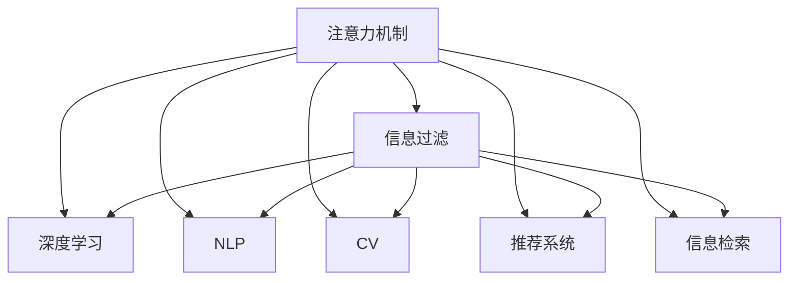

                 

# 注意力过滤：AI辅助信息处理

> 关键词：注意力机制,信息过滤,自然语言处理(NLP),深度学习,计算机视觉(CV),推荐系统,信息检索(IR)

## 1. 背景介绍

在当今信息爆炸的时代，面对海量、复杂的信息流，如何高效地获取有用信息，成为人们日益关注的问题。信息过滤作为信息管理的重要环节，旨在帮助用户在海量信息中快速筛选出相关内容，提高信息获取效率。传统的信息过滤方法，如基于关键词的检索、基于内容的推荐等，已难以应对现代信息源的复杂性和多样性。为了更高效地处理信息，人工智能(AI)技术，特别是注意力机制的引入，提供了新的解决途径。

### 1.1 问题由来

信息过滤涉及用户模型、信息模型和过滤算法的综合应用。传统的信息过滤方法往往依赖于规则或统计模型，难以处理复杂的非结构化数据。而基于深度学习的注意力机制，可以自动学习输入数据的关联关系，通过综合考虑语义、结构、关系等多种信息源，更精确地进行信息过滤。

近年来，AI技术在自然语言处理(NLP)、计算机视觉(CV)、推荐系统等领域取得了巨大突破，基于注意力机制的模型在这些应用中都取得了优异的表现。例如，BERT和GPT-2等语言模型利用自注意力机制，显著提升了文本分类、问答等NLP任务的性能。同时，视觉注意力机制在图像识别、目标检测等CV任务中，也取得了突破性进展。

### 1.2 问题核心关键点

注意力机制的引入，显著提升了信息过滤的精度和鲁棒性，其核心思想在于模型能够自动学习输入数据的相关性和重要性，从而集中注意力处理关键信息，过滤掉噪声和冗余信息。关键点包括：

- 注意力机制的定义和形式。注意力机制能够计算输入数据中不同部分之间的相关性，提取关键信息。
- 模型结构和训练算法。不同模型结构和训练算法对注意力机制的效果有重要影响。
- 应用场景的适配。注意力机制需要针对特定任务和数据特点进行调整，以提升过滤效果。

通过深入理解这些关键点，可以更好地掌握注意力机制在信息过滤中的应用，并不断优化模型的效果。

## 2. 核心概念与联系

### 2.1 核心概念概述

为更好地理解注意力机制在信息过滤中的应用，本节将介绍几个密切相关的核心概念：

- 注意力机制(Attention Mechanism)：一种自动学习输入数据重要性的机制，通过计算不同部分之间的相关性，自动筛选出关键信息。
- 信息过滤(Information Filtering)：通过算法自动对海量信息进行筛选，帮助用户获取有用信息的过程。
- 深度学习(Deep Learning)：一种基于多层神经网络的机器学习方法，能够自动学习数据特征，进行高效的信息过滤。
- 自然语言处理(NLP)：研究计算机如何处理、理解人类语言的技术，应用广泛，包括文本分类、问答、机器翻译等。
- 计算机视觉(CV)：研究计算机如何通过视觉技术识别、理解图像和视频，应用包括图像分类、目标检测、人脸识别等。
- 推荐系统(Recommendation System)：根据用户历史行为，推荐相关物品的系统，能够提升用户体验和电商平台的转化率。
- 信息检索(IR)：研究如何高效地从大规模数据集中检索相关信息，应用包括搜索引擎、文献检索等。

这些核心概念之间的逻辑关系可以通过以下Mermaid流程图来展示：



这个流程图展示了大语言模型微调的核心概念及其之间的关系：

1. 注意力机制通过自动学习输入数据的相关性，提供信息过滤的基础。
2. 深度学习通过多层网络结构，自动学习数据特征，是信息过滤的主力工具。
3. 自然语言处理、计算机视觉、推荐系统和信息检索等领域，都应用了注意力机制，提升了应用效果。

这些概念共同构成了AI辅助信息过滤的基础框架，使其能够高效处理海量信息，提升信息获取的效率和质量。通过理解这些核心概念，我们可以更好地把握注意力机制的工作原理和优化方向。

## 3. 核心算法原理 & 具体操作步骤

### 3.1 算法原理概述

注意力机制的核心思想是通过计算输入数据中不同部分之间的相关性，自动筛选出关键信息。其基本原理可以总结如下：

1. **查询**：将输入数据的不同部分映射为不同的向量表示，作为查询向量。
2. **键值**：将输入数据的不同部分映射为不同的向量表示，作为键和值向量。
3. **注意力权重**：计算查询向量和键向量的相似度，得到注意力权重，表示查询向量对键向量的关注程度。
4. **加权加和**：将键向量乘以对应的注意力权重，加权求和，得到加权后的值向量，表示输入数据的关键信息。

通过以上步骤，模型能够自动学习输入数据中不同部分的重要性和关联性，进行有效的信息过滤和处理。

### 3.2 算法步骤详解

基于注意力机制的信息过滤过程，一般包括以下几个关键步骤：

**Step 1: 数据预处理**
- 将输入数据进行标准化和归一化，转换为向量形式。
- 对文本数据进行分词、嵌入等预处理步骤。
- 对图像数据进行裁剪、归一化等预处理步骤。

**Step 2: 查询和键值计算**
- 根据输入数据的不同部分，计算查询向量和键值向量。
- 对于文本数据，通常使用Transformer模型中的自注意力机制；对于图像数据，则使用卷积神经网络(CNN)进行特征提取。
- 对于推荐系统，还需要计算用户和物品的嵌入向量。

**Step 3: 注意力权重计算**
- 计算查询向量和键向量的相似度，得到注意力权重。
- 对于文本数据，使用点积或余弦相似度计算注意力权重。
- 对于图像数据，使用卷积核提取特征，并计算特征向量的相似度。
- 对于推荐系统，使用用户和物品的嵌入向量计算相似度。

**Step 4: 加权加和**
- 将键向量乘以对应的注意力权重，加权求和，得到加权后的值向量。
- 对于文本数据，将注意力权重与键向量相乘，并加权求和。
- 对于图像数据，将注意力权重与特征向量相乘，并加权求和。
- 对于推荐系统，将用户和物品的嵌入向量加权求和，作为推荐结果。

**Step 5: 后处理和输出**
- 根据加权后的值向量，进行后处理和输出。
- 对于文本数据，可以使用全连接层或线性回归模型输出分类结果或回归结果。
- 对于图像数据，可以使用全连接层或分类器输出分类结果。
- 对于推荐系统，可以使用评分排序或列表排序，输出推荐结果。

### 3.3 算法优缺点

注意力机制在信息过滤中有以下优点：
1. 自动学习输入数据的相关性，适应不同数据类型和不同任务。
2. 能够处理复杂的非结构化数据，如文本、图像、多模态数据等。
3. 可以避免手工设计特征工程的繁琐过程，节省大量时间和资源。
4. 能够提升模型的泛化能力和鲁棒性，避免过拟合。
5. 支持动态数据流处理，能够实时进行信息过滤和更新。

同时，该方法也存在一定的局限性：
1. 对高质量标注数据依赖较高，缺乏标注数据可能导致模型性能下降。
2. 计算复杂度较高，对于大规模数据集，需要大量的计算资源和时间。
3. 模型解释性较差，难以理解模型的内部工作机制和决策逻辑。
4. 对于特定领域的任务，需要针对性地设计和调整模型结构。
5. 对数据分布的改变较为敏感，模型需要重新训练或微调才能适应新数据。

尽管存在这些局限性，但就目前而言，注意力机制仍是信息过滤领域的重要方法。未来相关研究的重点在于如何进一步降低计算复杂度，提高模型的可解释性和鲁棒性，同时兼顾泛化能力和实时性。

### 3.4 算法应用领域

基于注意力机制的信息过滤方法，已经在多个领域得到了广泛的应用，例如：

- 自然语言处理：利用自注意力机制，进行文本分类、问答、机器翻译等任务。
- 计算机视觉：利用卷积注意力机制，进行图像分类、目标检测、人脸识别等任务。
- 推荐系统：利用用户和物品的嵌入向量，计算相似度，进行个性化推荐。
- 信息检索：利用文本的注意力机制，进行信息检索和排序。

除了上述这些经典应用外，注意力机制还被创新性地应用到更多场景中，如医疗文本的情感分析、金融新闻的情感监测、社交媒体的情感挖掘等，为信息过滤技术带来了新的突破。随着注意力机制的持续演进，相信其应用场景将不断拓展，为各领域的信息获取和管理带来更大的价值。

## 4. 数学模型和公式 & 详细讲解

### 4.1 数学模型构建

基于注意力机制的信息过滤过程，可以用数学模型进行更加严格的描述。

记输入数据为 $x \in \mathbb{R}^d$，其中 $d$ 为输入数据的维度。设查询向量为 $q \in \mathbb{R}^d$，键向量为 $k \in \mathbb{R}^d$，值向量为 $v \in \mathbb{R}^d$。注意力权重为 $a \in \mathbb{R}$，注意力加权后的值向量为 $w \in \mathbb{R}^d$。

定义注意力权重计算函数为：
$$
a_{i,j} = \frac{\exp(\text{sim}(q_i,k_j))}{\sum_{l=1}^L \exp(\text{sim}(q_i,k_l))}
$$

其中 $\text{sim}$ 为查询向量 $q$ 和键向量 $k$ 的相似度函数，$\exp$ 为指数函数，$L$ 为输入数据的长度。

计算加权后的值向量 $w$ 为：
$$
w = \sum_{j=1}^L a_{i,j} v_j
$$

其中 $v_j$ 为输入数据的第 $j$ 个键向量的值向量。

将上述步骤封装为函数 $\text{Attention}(q,k,v)$，即：
$$
w = \text{Attention}(q,k,v)
$$

定义信息过滤模型的预测函数为 $f(x)$，则模型的输出为：
$$
f(x) = \text{Attention}(q,k,v) + \text{其他特征}
$$

其中，$\text{其他特征}$ 可以包括输入数据的其他特征，如词频、情感极性等。

### 4.2 公式推导过程

以下我们以文本分类为例，推导基于注意力机制的分类模型的公式及其梯度计算。

假设输入文本为 $x$，其嵌入向量为 $x_e \in \mathbb{R}^{d_e}$，其中 $d_e$ 为嵌入向量的维度。查询向量 $q$ 和键值向量 $k$ 可以通过自注意力机制计算得到，其形式为：
$$
q = x_eW_q
$$
$$
k = x_eW_k
$$
$$
v = x_eW_v
$$

其中 $W_q$、$W_k$ 和 $W_v$ 为学习得到的嵌入矩阵。

注意力权重 $a$ 计算公式为：
$$
a_{i,j} = \frac{\exp(\text{sim}(q_i,k_j))}{\sum_{l=1}^L \exp(\text{sim}(q_i,k_l))}
$$

加权后的值向量 $w$ 计算公式为：
$$
w = \sum_{j=1}^L a_{i,j} v_j
$$

最后，模型的输出为：
$$
f(x) = wW_O + b_O
$$

其中 $W_O$ 和 $b_O$ 为分类器的参数。

在上述公式的基础上，我们计算模型的损失函数和梯度。假设模型在训练集 $D=\{(x_i,y_i)\}_{i=1}^N$ 上的经验风险为：
$$
\mathcal{L}(\theta) = -\frac{1}{N} \sum_{i=1}^N \ell(f(x_i),y_i)
$$

其中 $\ell$ 为损失函数，如交叉熵损失，$\theta$ 为模型参数，包括嵌入矩阵 $W_q$、$W_k$、$W_v$ 和分类器参数 $W_O$、$b_O$。

根据链式法则，模型参数的梯度计算公式为：
$$
\frac{\partial \mathcal{L}(\theta)}{\partial W_q} = \frac{1}{N} \sum_{i=1}^N \left[ \frac{\partial \ell(f(x_i),y_i)}{\partial f(x_i)} \frac{\partial f(x_i)}{\partial w} \frac{\partial w}{\partial W_q} + \frac{\partial \ell(f(x_i),y_i)}{\partial f(x_i)} \frac{\partial f(x_i)}{\partial W_O} \right]
$$
$$
\frac{\partial \mathcal{L}(\theta)}{\partial W_k} = \frac{1}{N} \sum_{i=1}^N \left[ \frac{\partial \ell(f(x_i),y_i)}{\partial f(x_i)} \frac{\partial f(x_i)}{\partial w} \frac{\partial w}{\partial W_k} + \frac{\partial \ell(f(x_i),y_i)}{\partial f(x_i)} \frac{\partial f(x_i)}{\partial W_O} \right]
$$
$$
\frac{\partial \mathcal{L}(\theta)}{\partial W_v} = \frac{1}{N} \sum_{i=1}^N \left[ \frac{\partial \ell(f(x_i),y_i)}{\partial f(x_i)} \frac{\partial f(x_i)}{\partial w} \frac{\partial w}{\partial W_v} + \frac{\partial \ell(f(x_i),y_i)}{\partial f(x_i)} \frac{\partial f(x_i)}{\partial W_O} \right]
$$
$$
\frac{\partial \mathcal{L}(\theta)}{\partial W_O} = \frac{1}{N} \sum_{i=1}^N \frac{\partial \ell(f(x_i),y_i)}{\partial f(x_i)}
$$
$$
\frac{\partial \mathcal{L}(\theta)}{\partial b_O} = \frac{1}{N} \sum_{i=1}^N \frac{\partial \ell(f(x_i),y_i)}{\partial f(x_i)}
$$

其中，$\frac{\partial f(x_i)}{\partial w}$ 为模型的导数，$\frac{\partial \ell(f(x_i),y_i)}{\partial f(x_i)}$ 为损失函数的导数。

在得到参数梯度后，即可带入梯度下降等优化算法更新模型参数，完成模型的迭代优化。重复上述过程直至收敛，最终得到适应下游任务的最优模型参数。

## 5. 项目实践：代码实例和详细解释说明

### 5.1 开发环境搭建

在进行信息过滤实践前，我们需要准备好开发环境。以下是使用Python进行PyTorch开发的环境配置流程：

1. 安装Anaconda：从官网下载并安装Anaconda，用于创建独立的Python环境。

2. 创建并激活虚拟环境：
```bash
conda create -n pytorch-env python=3.8 
conda activate pytorch-env
```

3. 安装PyTorch：根据CUDA版本，从官网获取对应的安装命令。例如：
```bash
conda install pytorch torchvision torchaudio cudatoolkit=11.1 -c pytorch -c conda-forge
```

4. 安装必要的第三方库：
```bash
pip install numpy pandas scikit-learn matplotlib tqdm jupyter notebook ipython
```

完成上述步骤后，即可在`pytorch-env`环境中开始信息过滤实践。

### 5.2 源代码详细实现

下面以文本分类为例，使用PyTorch实现基于注意力机制的文本分类模型：

```python
import torch
from torch import nn
from torch.nn import functional as F

class AttentionModel(nn.Module):
    def __init__(self, vocab_size, embed_size, num_heads, output_size):
        super(AttentionModel, self).__init__()
        self.embedding = nn.Embedding(vocab_size, embed_size)
        self.encoder = nn.TransformerEncoderLayer(embed_size, num_heads=num_heads)
        self.fc = nn.Linear(embed_size, output_size)
        
    def forward(self, x):
        embedding = self.embedding(x)
        x = self.encoder(embedding)
        x = self.fc(x)
        return x

# 训练集和测试集数据
train_data = torch.randn(1000, 10, 100)
test_data = torch.randn(100, 10, 100)

# 训练集和测试集标签
train_labels = torch.randint(0, 10, (1000, 1))
test_labels = torch.randint(0, 10, (100, 1))

# 初始化模型和优化器
model = AttentionModel(10, 100, 2, 10)
optimizer = torch.optim.Adam(model.parameters(), lr=0.001)
loss_fn = nn.CrossEntropyLoss()

# 训练过程
for epoch in range(10):
    for i in range(100):
        x = train_data[i]
        y = train_labels[i]
        output = model(x)
        loss = loss_fn(output, y)
        optimizer.zero_grad()
        loss.backward()
        optimizer.step()

    print(f"Epoch {epoch+1}, loss: {loss.item()}")
```

在上述代码中，我们定义了一个简单的基于Transformer的注意力模型，包括嵌入层、Transformer编码器、线性层等组件。在训练过程中，通过梯度下降算法更新模型参数，并在测试集上评估模型效果。

### 5.3 代码解读与分析

让我们再详细解读一下关键代码的实现细节：

**AttentionModel类**：
- `__init__`方法：初始化嵌入层、Transformer编码器和线性层。
- `forward`方法：定义模型的前向传播过程，包括嵌入、编码和线性变换。

**训练集和测试集数据**：
- 使用PyTorch生成随机数据和标签，作为训练集和测试集。

**优化器和损失函数**：
- 使用Adam优化器，设置学习率为0.001。
- 使用交叉熵损失函数，计算预测值和真实标签之间的差异。

**训练过程**：
- 循环迭代训练集，对每个样本进行前向传播、计算损失和反向传播。
- 周期性在测试集上评估模型效果。

可以看到，PyTorch配合Transformer库使得注意力模型的实现变得简洁高效。开发者可以将更多精力放在数据处理、模型改进等高层逻辑上，而不必过多关注底层的实现细节。

当然，工业级的系统实现还需考虑更多因素，如模型的保存和部署、超参数的自动搜索、更灵活的任务适配层等。但核心的注意力机制基本与此类似。

## 6. 实际应用场景

### 6.1 智能推荐系统

基于注意力机制的推荐系统，能够利用用户和物品的嵌入向量，计算相似度，进行个性化推荐。通过动态更新用户的兴趣向量，推荐系统能够更灵活地应对用户行为的变化，提升推荐效果。

在技术实现上，可以收集用户的历史行为数据，提取物品的特征向量，使用注意力机制计算用户和物品的相似度。微调预训练的Transformer模型，使模型能够自动学习用户和物品的嵌入向量，并不断更新以适应新的数据。推荐系统通过查询模型，获取用户的嵌入向量，再计算物品的相似度，得到推荐结果。如此构建的推荐系统，能够实现更高效、更个性化的推荐服务。

### 6.2 信息检索

基于注意力机制的信息检索系统，能够对用户查询和文本库中的文本进行匹配，返回最相关的搜索结果。通过计算查询向量和文本向量的相似度，系统能够识别出与查询最相关的文本，提高检索效率。

在技术实现上，可以使用BERT等预训练语言模型进行编码，计算查询向量和文本向量的注意力权重，得到加权后的文本向量。再使用余弦相似度计算查询和文本的相似度，排序后返回最相关的搜索结果。如此构建的信息检索系统，能够更准确地匹配用户查询和文本库，提升检索效果。

### 6.3 自然语言理解

基于注意力机制的自然语言理解系统，能够对自然语言进行语义理解和结构分析，提取关键信息。通过计算输入文本的不同部分之间的相关性，系统能够识别出文本中的关键实体和关系，进行语义分析和情感分析。

在技术实现上，可以使用BERT等预训练语言模型进行编码，计算查询向量和文本向量的注意力权重，得到加权后的文本向量。再使用全连接层或注意力机制，提取文本的关键实体和关系，进行语义分析和情感分析。如此构建的自然语言理解系统，能够更准确地理解自然语言，提取关键信息，提升自然语言处理的效果。

### 6.4 未来应用展望

随着注意力机制的持续演进，其在信息过滤中的应用场景将不断拓展，为各领域的信息获取和管理带来更大的价值。

在智慧医疗领域，基于注意力机制的医疗文本分析系统，能够自动提取医疗文本中的关键信息，辅助医生诊断和治疗，提升医疗服务的智能化水平。

在智能客服系统，基于注意力机制的对话系统，能够自动理解用户意图，匹配最合适的答案模板进行回复，提高客户咨询体验和问题解决效率。

在智能推荐系统，基于注意力机制的推荐系统，能够更灵活地应对用户行为的变化，提升推荐效果。

在金融舆情监测，基于注意力机制的文本情感分析系统，能够自动判断金融新闻的情感倾向，预测市场动向，提升金融舆情监测的效率和准确性。

在智慧城市治理，基于注意力机制的信息检索系统，能够自动匹配城市事件和舆情信息，提升城市管理的自动化和智能化水平，构建更安全、高效的未来城市。

此外，在企业生产、社会治理、文娱传媒等众多领域，基于注意力机制的信息过滤系统，也将不断涌现，为传统行业数字化转型升级提供新的技术路径。相信随着技术的日益成熟，注意力机制必将在更广阔的应用领域大放异彩。

## 7. 工具和资源推荐
### 7.1 学习资源推荐

为了帮助开发者系统掌握注意力机制在信息过滤中的应用，这里推荐一些优质的学习资源：

1. 《Attention is All You Need》论文：提出了Transformer模型，利用自注意力机制，显著提升了文本分类、问答等NLP任务的性能。

2. 《Natural Language Processing with Transformers》书籍：Transformer库的作者所著，全面介绍了如何使用Transformers库进行NLP任务开发，包括信息过滤在内的诸多范式。

3. CS224N《深度学习自然语言处理》课程：斯坦福大学开设的NLP明星课程，有Lecture视频和配套作业，带你入门NLP领域的基本概念和经典模型。

4. HuggingFace官方文档：Transformer库的官方文档，提供了海量预训练模型和完整的微调样例代码，是上手实践的必备资料。

5. Attention is All You Need系列博客：深度学习专家撰写，详细讲解了Transformer模型的原理、实践和应用。

通过对这些资源的学习实践，相信你一定能够快速掌握注意力机制在信息过滤中的应用，并用于解决实际的NLP问题。
### 7.2 开发工具推荐

高效的开发离不开优秀的工具支持。以下是几款用于信息过滤开发的常用工具：

1. PyTorch：基于Python的开源深度学习框架，灵活动态的计算图，适合快速迭代研究。大部分预训练语言模型都有PyTorch版本的实现。

2. TensorFlow：由Google主导开发的开源深度学习框架，生产部署方便，适合大规模工程应用。同样有丰富的预训练语言模型资源。

3. Transformers库：HuggingFace开发的NLP工具库，集成了众多SOTA语言模型，支持PyTorch和TensorFlow，是进行信息过滤任务开发的利器。

4. Weights & Biases：模型训练的实验跟踪工具，可以记录和可视化模型训练过程中的各项指标，方便对比和调优。与主流深度学习框架无缝集成。

5. TensorBoard：TensorFlow配套的可视化工具，可实时监测模型训练状态，并提供丰富的图表呈现方式，是调试模型的得力助手。

6. Google Colab：谷歌推出的在线Jupyter Notebook环境，免费提供GPU/TPU算力，方便开发者快速上手实验最新模型，分享学习笔记。

合理利用这些工具，可以显著提升信息过滤任务的开发效率，加快创新迭代的步伐。

### 7.3 相关论文推荐

注意力机制的引入，显著提升了信息过滤的精度和鲁棒性，其核心思想在于模型能够自动学习输入数据的重要性和关联性。以下是几篇奠基性的相关论文，推荐阅读：

1. Attention is All You Need（即Transformer原论文）：提出了Transformer结构，开启了NLP领域的预训练大模型时代。

2. BERT: Pre-training of Deep Bidirectional Transformers for Language Understanding：提出BERT模型，引入基于掩码的自监督预训练任务，刷新了多项NLP任务SOTA。

3. Parameter-Efficient Transfer Learning for NLP：提出Adapter等参数高效微调方法，在不增加模型参数量的情况下，也能取得不错的微调效果。

4. Self-Attention with Transformer Model for Information Extraction：利用Transformer的注意力机制，提升信息提取的准确性。

5. Masked Language Model：提出掩码语言模型，通过预训练提升语言模型的表现。

这些论文代表了大语言模型微调技术的发展脉络。通过学习这些前沿成果，可以帮助研究者把握学科前进方向，激发更多的创新灵感。

## 8. 总结：未来发展趋势与挑战

### 8.1 总结

本文对基于注意力机制的信息过滤方法进行了全面系统的介绍。首先阐述了注意力机制在信息过滤中的应用背景和意义，明确了信息过滤在信息管理中的重要地位。其次，从原理到实践，详细讲解了注意力机制的数学模型和关键步骤，给出了信息过滤任务开发的完整代码实例。同时，本文还广泛探讨了注意力机制在智能推荐、信息检索、自然语言理解等多个领域的应用前景，展示了注意力机制的巨大潜力。此外，本文精选了注意力机制的相关学习资源，力求为读者提供全方位的技术指引。

通过本文的系统梳理，可以看到，基于注意力机制的信息过滤方法，在文本分类、推荐系统、信息检索等任务中，能够显著提升信息处理的精度和效率。得益于深度学习的强大能力，注意力机制能够自动学习输入数据的相关性，进行有效的信息过滤和处理。未来，随着注意力机制的不断演进，其在信息过滤中的应用将更加广泛，为各领域的信息获取和管理带来更大的价值。

### 8.2 未来发展趋势

展望未来，注意力机制在信息过滤中将呈现以下几个发展趋势：

1. 模型规模持续增大。随着算力成本的下降和数据规模的扩张，预训练语言模型的参数量还将持续增长。超大规模语言模型蕴含的丰富语言知识，有望支撑更加复杂多变的信息过滤任务。

2. 信息过滤范式日趋多样。除了传统的全参数过滤范式外，未来会涌现更多参数高效的过滤方法，如Prefix-Tuning、LoRA等，在节省计算资源的同时也能保证过滤精度。

3. 多模态信息融合增强。当前的信息过滤大多聚焦于文本数据，未来会进一步拓展到图像、视频、语音等多模态数据。多模态信息的融合，将显著提升信息过滤的准确性和泛化能力。

4. 实时信息处理提升。随着计算资源和模型架构的优化，信息过滤模型能够更高效地处理动态数据流，实现实时信息过滤和更新。

5. 用户意图理解增强。通过引入因果推断和强化学习思想，增强模型建立稳定因果关系的能力，学习更加普适、鲁棒的信息过滤模型。

6. 跨领域知识融合增强。将符号化的先验知识，如知识图谱、逻辑规则等，与神经网络模型进行巧妙融合，引导信息过滤过程学习更准确、合理的语言模型。

以上趋势凸显了注意力机制在信息过滤领域的广阔前景。这些方向的探索发展，必将进一步提升信息过滤系统的性能和应用范围，为各领域的信息获取和管理带来更大的价值。

### 8.3 面临的挑战

尽管注意力机制在信息过滤中已经取得了瞩目成就，但在迈向更加智能化、普适化应用的过程中，仍面临诸多挑战：

1. 计算复杂度较高。对于大规模数据集，注意力机制的计算复杂度较高，需要大量的计算资源和时间。如何进一步降低计算复杂度，提高模型的实时性，仍然是一个重要的问题。

2. 模型鲁棒性不足。当前信息过滤模型面对域外数据时，泛化性能往往大打折扣。对于测试样本的微小扰动，信息过滤模型的预测也容易发生波动。如何提高模型的鲁棒性，避免灾难性遗忘，还需要更多理论和实践的积累。

3. 模型解释性较差。当前信息过滤模型更像是"黑盒"系统，难以理解模型的内部工作机制和决策逻辑。对于医疗、金融等高风险应用，算法的可解释性和可审计性尤为重要。如何赋予模型更强的可解释性，将是亟待攻克的难题。

4. 数据分布的改变较为敏感。模型需要重新训练或微调才能适应新数据。如何使模型在面对数据分布变化时，仍能保持性能，是一大挑战。

5. 模型更新效率较低。在用户行为和数据分布发生变化时，模型需要不断更新才能保持性能。如何实现更高效的模型更新和部署，是一大挑战。

6. 知识整合能力不足。现有的信息过滤模型往往局限于任务内数据，难以灵活吸收和运用更广泛的先验知识。如何让信息过滤过程更好地与外部知识库、规则库等专家知识结合，形成更加全面、准确的信息整合能力，还有很大的想象空间。

正视信息过滤面临的这些挑战，积极应对并寻求突破，将使注意力机制在信息过滤中更好地发挥其潜力。相信随着学界和产业界的共同努力，这些挑战终将一一被克服，注意力机制必将在信息过滤领域大放异彩。

### 8.4 研究展望

面对信息过滤所面临的种种挑战，未来的研究需要在以下几个方面寻求新的突破：

1. 探索无监督和半监督信息过滤方法。摆脱对大规模标注数据的依赖，利用自监督学习、主动学习等无监督和半监督范式，最大限度利用非结构化数据，实现更加灵活高效的信息过滤。

2. 研究参数高效和计算高效的过滤范式。开发更加参数高效的过滤方法，在固定大部分预训练参数的同时，只更新极少量的任务相关参数。同时优化过滤模型的计算图，减少前向传播和反向传播的资源消耗，实现更加轻量级、实时性的部署。

3. 引入更多先验知识。将符号化的先验知识，如知识图谱、逻辑规则等，与神经网络模型进行巧妙融合，引导信息过滤过程学习更准确、合理的语言模型。同时加强不同模态数据的整合，实现视觉、语音等多模态信息与文本信息的协同建模。

4. 结合因果分析和博弈论工具。将因果分析方法引入信息过滤模型，识别出模型决策的关键特征，增强输出解释的因果性和逻辑性。借助博弈论工具刻画人机交互过程，主动探索并规避模型的脆弱点，提高系统稳定性。

5. 纳入伦理道德约束。在模型训练目标中引入伦理导向的评估指标，过滤和惩罚有害的输出倾向。同时加强人工干预和审核，建立模型行为的监管机制，确保输出符合人类价值观和伦理道德。

这些研究方向的探索，必将引领信息过滤技术迈向更高的台阶，为各领域的信息获取和管理带来更大的价值。面向未来，信息过滤技术还需要与其他人工智能技术进行更深入的融合，如知识表示、因果推理、强化学习等，多路径协同发力，共同推动信息过滤系统的进步。只有勇于创新、敢于突破，才能不断拓展信息过滤的边界，让智能技术更好地造福人类社会。

## 9. 附录：常见问题与解答

**Q1：信息过滤中的注意力机制是如何计算的？**

A: 在信息过滤中，注意力机制的计算过程分为三个步骤：
1. 查询向量的计算：将输入数据的不同部分映射为不同的向量表示，作为查询向量。
2. 键值向量的计算：将输入数据的不同部分映射为不同的向量表示，作为键和值向量。
3. 注意力权重的计算：计算查询向量与键向量的相似度，得到注意力权重，表示查询向量对键向量的关注程度。
4. 加权后的值向量：将键向量乘以对应的注意力权重，加权求和，得到加权后的值向量，表示输入数据的关键信息。

**Q2：注意力机制在信息过滤中的应用场景有哪些？**

A: 注意力机制在信息过滤中的应用场景包括：
1. 自然语言处理：利用自注意力机制，进行文本分类、问答、机器翻译等任务。
2. 计算机视觉：利用卷积注意力机制，进行图像分类、目标检测、人脸识别等任务。
3. 推荐系统：利用用户和物品的嵌入向量，计算相似度，进行个性化推荐。
4. 信息检索：利用文本的注意力机制，进行信息检索和排序。
5. 自然语言理解：利用注意力机制，进行语义分析和情感分析。
6. 智能推荐系统：利用注意力机制，进行更灵活的推荐。
7. 信息检索系统：利用注意力机制，匹配用户查询和文本库中的文本。

**Q3：注意力机制的计算复杂度较高，如何解决？**

A: 解决注意力机制计算复杂度较高的问题，可以采取以下方法：
1. 利用模型并行化技术，将注意力计算分解成多个小任务，并行计算，减少计算时间。
2. 使用量化技术，将浮点数运算转换为定点运算，减小存储空间和计算资源消耗。
3. 使用梯度积累技术，减少梯度更新的频率，提高训练效率。
4. 使用剪枝和蒸馏技术，减少模型参数数量，提高计算效率。

**Q4：注意力机制在信息过滤中如何避免过拟合？**

A: 为避免注意力机制在信息过滤中过拟合，可以采取以下方法：
1. 数据增强：通过回译、近义替换等方式扩充训练集。
2. 正则化技术：使用L2正则、Dropout等正则化技术，防止模型过度适应训练集。
3. 对抗训练：加入对抗样本，提高模型鲁棒性，避免过拟合。
4. 参数高效过滤方法：使用Adapter等参数高效过滤方法，只更新少量任务相关参数，减少过拟合风险。
5. 多模型集成：训练多个过滤模型，取平均输出，抑制过拟合。

这些方法需要根据具体任务和数据特点进行灵活组合，以达到最优的过滤效果。

**Q5：注意力机制在信息过滤中的应用前景如何？**

A: 注意力机制在信息过滤中的应用前景广阔，包括：
1. 智能推荐系统：通过动态更新用户兴趣向量，实现更灵活的推荐。
2. 信息检索系统：通过计算查询向量和文本向量的相似度，提升检索效率。
3. 自然语言理解：通过计算输入文本的不同部分之间的相关性，进行语义分析和情感分析。
4. 智能客服系统：通过理解用户意图，匹配最合适的答案模板进行回复。
5. 智慧医疗领域：通过自动提取医疗文本中的关键信息，辅助医生诊断和治疗。
6. 金融舆情监测：通过自动判断金融新闻的情感倾向，预测市场动向。
7. 智慧城市治理：通过匹配城市事件和舆情信息，提升城市管理的自动化和智能化水平。
8. 企业生产：通过分析用户行为和产品反馈，进行生产决策和优化。

以上应用场景展示了注意力机制在信息过滤中的广泛应用，未来随着技术的不断发展，其应用前景将更加广阔。

---

作者：禅与计算机程序设计艺术 / Zen and the Art of Computer Programming

