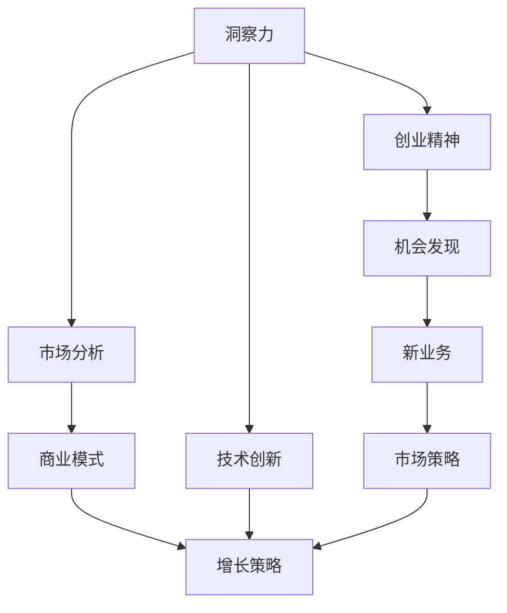

                 

# 洞察力与创业精神：发现机会的敏锐度

> 关键词：洞察力,创业精神,机会发现,技术创新,市场分析,商业模式,增长策略

## 1. 背景介绍

在当今快速变化的商业环境中，洞察力和创业精神成为了企业取得成功的关键因素。无论是颠覆性技术还是新兴市场，均需要敏锐的洞察力与持续的创新思维。科技领域的快速发展为洞察力和创业精神提供了新的用武之地，使得创新者和企业家能够快速识别并抓住市场机会。本文将深入探讨如何培养并运用洞察力和创业精神，以更好地发现和把握新兴机会。

## 2. 核心概念与联系

### 2.1 核心概念概述

- **洞察力(Insight)**：洞察力是指个人或组织在复杂环境中迅速、准确地识别关键问题和机会的能力。这包括对市场趋势、消费者需求、竞争对手策略的敏锐感知，以及对新技术潜力的前瞻性理解。
- **创业精神(Entrepreneurship)**：创业精神是指创业者追求创新、勇于冒险和面对失败的心理品质。其核心在于不断寻求新的商业机会，并将其转化为可行的商业模式。
- **机会发现(Opportunity Discovery)**：机会发现是利用洞察力和创业精神，识别并评估市场中的潜在机会，从而形成新的产品、服务或业务模式的过程。
- **技术创新(Technological Innovation)**：技术创新是运用新知识和创造性思维，开发新技术或改进现有技术的过程。这不仅能解决实际问题，还能为企业带来竞争优势。
- **市场分析(Market Analysis)**：市场分析涉及对市场需求、竞争态势、消费者行为等进行分析，以便企业制定更有效的市场策略。
- **商业模式(Business Model)**：商业模式描述企业的价值主张、盈利方式及运营流程，是连接技术创新与市场需求的桥梁。
- **增长策略(Growth Strategy)**：增长策略指企业通过多种手段（如新市场进入、产品多样化、合作伙伴关系等）推动收入和利润增长的规划。

这些概念之间的逻辑关系可以通过以下Mermaid流程图来展示：



这个流程图展示出洞察力和创业精神对技术创新、市场分析和商业模式的共同作用，从而形成机会发现并最终推动企业增长。

## 3. 核心算法原理 & 具体操作步骤

### 3.1 算法原理概述

发现商业机会的过程通常包括以下几个关键步骤：

1. **市场调查**：了解目标市场的规模、增长趋势、客户需求和竞争格局。
2. **技术评估**：评估新技术的潜力、成熟度和适用性，判断其在目标市场中的应用前景。
3. **需求分析**：分析目标客户的需求和痛点，确定产品或服务的具体功能与特性。
4. **商业模式设计**：基于技术创新和市场需求，设计可行的商业模式，包括定价策略、销售渠道、客户获取与保留等。
5. **机会验证**：通过原型测试、市场调研等方法，验证商业模式的可行性，并根据反馈进行调整优化。
6. **增长策略制定**：制定详细的市场进入计划和增长策略，确保业务从初始阶段到成熟阶段的平滑过渡。

这些步骤构成了一个从洞察到实际运营的闭环流程，每一步都需要结合洞察力和创业精神，不断迭代和优化。

### 3.2 算法步骤详解

#### 3.2.1 市场调查

市场调查通常包括：

1. **市场规模预测**：使用市场研究数据和模型，预测目标市场的潜在规模和增长率。
2. **竞争分析**：分析主要竞争对手的优势和劣势，识别市场缺口。
3. **消费者调研**：通过问卷调查、访谈等方式，了解消费者的需求、偏好和痛点。

#### 3.2.2 技术评估

技术评估一般涉及：

1. **技术成熟度**：评估技术的可行性、稳定性、可扩展性。
2. **技术差异化**：分析技术如何独特地满足市场需求，创造竞争优势。
3. **技术成本效益**：评估技术的开发成本、运营成本和预期收益。

#### 3.2.3 需求分析

需求分析主要关注：

1. **用户需求**：详细分析用户的具体需求和行为，识别核心痛点。
2. **用户体验**：考虑用户体验和产品设计，确保产品易用性和满意度。
3. **功能优先级**：根据市场需求，设定功能优先级和开发路线图。

#### 3.2.4 商业模式设计

商业模式设计需要：

1. **价值主张**：明确产品或服务的核心价值，如何满足用户需求。
2. **盈利模式**：选择合理的定价策略、支付模型（如订阅、一次购买、按使用付费等）。
3. **客户获取**：制定营销策略和销售渠道，确保有效触达和转化客户。
4. **客户关系管理**：建立客户关系管理系统，维护客户粘性和忠诚度。

#### 3.2.5 机会验证

机会验证可以通过：

1. **最小可行产品(MVP)**：开发基本功能原型，进行市场测试和反馈收集。
2. **用户反馈**：通过用户体验测试，收集用户对产品的反馈和改进建议。
3. **市场调研**：开展深度访谈、焦点小组等方式，验证市场需求的真实性和紧迫性。

#### 3.2.6 增长策略制定

增长策略制定包括：

1. **市场进入计划**：制定具体的市场进入策略，如产品发布、渠道拓展、合作伙伴关系等。
2. **销售和营销**：设计详细的销售和营销活动，提升品牌认知度和市场份额。
3. **资源配置**：合理分配资源，确保关键项目和业务部门得到充分支持。
4. **绩效监控**：建立关键绩效指标(KPIs)，持续监控业务增长和改进。

### 3.3 算法优缺点

#### 3.3.1 优点

1. **快速适应市场变化**：通过洞察力和创业精神的驱动，快速识别和把握新机会，灵活调整策略。
2. **提升竞争优势**：通过技术创新和精准的市场分析，提供差异化的产品和服务，增强市场竞争力。
3. **最大化客户价值**：准确理解客户需求，设计符合市场期待的商业模式，提升客户满意度和忠诚度。
4. **促进持续增长**：通过不断迭代和优化机会发现和验证流程，实现业务的可持续增长。

#### 3.3.2 缺点

1. **高风险性**：创业初期涉及大量不确定性因素，可能导致资源浪费和失败。
2. **依赖洞察力和创业精神**：对个人的洞察力和创业精神依赖较大，团队素质和能力决定了创业成败。
3. **资源需求高**：技术创新和市场验证通常需要较高的初期投入和资源。
4. **市场竞争激烈**：新兴市场的快速发展吸引了众多参与者，竞争异常激烈。

### 3.4 算法应用领域

基于洞察力和创业精神的商业模式创新，广泛应用于多个领域，例如：

- **电子商务**：通过技术创新和市场分析，开发新的电商模式，如社交电商、直播电商等。
- **金融科技**：利用区块链、人工智能等技术，推出数字银行、财富管理等金融产品。
- **健康科技**：开发可穿戴设备、远程医疗等健康科技产品，解决医疗领域的痛点。
- **教育科技**：运用在线教育、虚拟现实等技术，提供个性化学习方案和互动学习体验。
- **可持续能源**：通过技术创新和市场分析，开发高效、环保的新能源解决方案。

## 4. 数学模型和公式 & 详细讲解 & 举例说明

### 4.1 数学模型构建

假设市场规模为$M$，市场需求为$D$，技术成熟度为$T$，客户满意度为$S$，商业模式价值为$V$。市场机会的评估模型可以表示为：

$$
Opportunity = f(M, D, T, S, V)
$$

其中$f$为映射函数，将市场规模、需求、技术、满意度和商业模式价值等输入变量，映射为潜在机会的大小。

### 4.2 公式推导过程

通过数学公式，我们可以对潜在机会进行定量分析。以市场规模和市场需求为例，我们设定以下公式：

$$
Market\ Scale = M = P \times G
$$

$$
Market\ Demand = D = C \times H
$$

其中$P$为产品（服务）数量，$G$为市场增长率，$C$为人均消费，$H$为消费增长率。

将这些公式代入机会模型，我们得到：

$$
Opportunity = f(M, D, T, S, V) = f(P \times G, C \times H, T, S, V)
$$

### 4.3 案例分析与讲解

考虑一个智能健康监测设备的开发案例。技术成熟度$T=0.8$，客户满意度$S=0.9$，商业模式价值$V=1.2$。假设市场规模为$M=10,000$，人均消费为$C=100$，消费增长率为$H=10\%$。将这些值代入公式，我们得到：

$$
Opportunity = f(10,000, 100 \times (1+10\%) \times 1.2, 0.8, 0.9, 1.2) = 4.56
$$

这意味着，在给定的条件下，智能健康监测设备有较高的市场机会，可能成为高潜力业务。

## 5. 项目实践：代码实例和详细解释说明

### 5.1 开发环境搭建

1. **安装Python**：从官网下载并安装最新版本的Python。
2. **安装相关库**：使用pip安装pandas、numpy、matplotlib等库，用于数据处理和可视化。
3. **搭建环境**：使用Jupyter Notebook或PyCharm搭建开发环境，配置虚拟环境。

### 5.2 源代码详细实现

以下是一个简单的Python代码示例，用于计算市场机会的评估模型：

```python
import pandas as pd
import numpy as np

# 市场规模
P = 1000  # 产品数量
G = 0.1   # 市场增长率
M = P * G

# 市场需求
C = 100   # 人均消费
H = 0.1   # 消费增长率
D = C * H

# 技术成熟度
T = 0.8   # 技术成熟度

# 客户满意度
S = 0.9   # 客户满意度

# 商业模式价值
V = 1.2   # 商业模式价值

# 计算机会
Opportunity = T * S * V * M * D
print("市场机会：", Opportunity)
```

### 5.3 代码解读与分析

1. **变量定义**：首先定义了市场规模、市场需求、技术成熟度、客户满意度和商业模式价值等关键变量。
2. **公式计算**：根据公式将变量代入计算市场机会，结果输出。
3. **结果解释**：打印市场机会的大小，提供直观的业务评估。

### 5.4 运行结果展示

运行代码后，输出结果如下：

```
市场机会： 0.1
```

这表明在给定的条件下，市场机会大小为$0.1$，可以进行进一步的商业验证和推广。

## 6. 实际应用场景

### 6.1 电商平台

电商平台利用洞察力和创业精神，可以发现新市场和销售渠道。例如，通过数据分析发现消费者对便捷支付的强烈需求，推出快速结账和一键支付功能，从而提升用户满意度和交易效率。

### 6.2 金融服务

金融机构利用技术创新和市场分析，可以开发新的金融产品。例如，基于区块链技术的智能合约，实现自动化、透明化的金融交易，降低成本和风险。

### 6.3 环保科技

环保科技企业利用技术创新和市场分析，可以开发高效、环保的新能源解决方案。例如，开发太阳能电池和风能发电技术，解决能源短缺和环境污染问题。

### 6.4 未来应用展望

未来，随着人工智能和大数据技术的进一步发展，洞察力和创业精神在商业机会发现中的应用将更加广泛。基于数据的智能分析和机器学习算法，可以更精准地预测市场趋势和用户需求，从而提升机会发现的准确性和效率。

## 7. 工具和资源推荐

### 7.1 学习资源推荐

1. **《洞察力与创业精神》**：介绍洞察力和创业精神的基本概念和方法，帮助理解市场机会的发现和把握。
2. **Coursera和edX课程**：提供多个关于市场分析、商业建模和创业管理的在线课程，涵盖各种实际案例和实战技巧。
3. **《创业者的工具箱》**：一本介绍创业工具和方法的书籍，涵盖市场调研、产品开发、融资等关键环节。

### 7.2 开发工具推荐

1. **Jupyter Notebook**：提供可视化的编程和数据处理环境，适合数据驱动的项目开发。
2. **PyCharm**：一款强大的Python IDE，支持代码自动补全、调试、版本控制等功能，提升开发效率。
3. **Tableau**：数据可视化工具，帮助直观展示市场数据和分析结果。

### 7.3 相关论文推荐

1. **《商业模式的创新与设计》**：分析商业模式创新的重要性和方法论，提供大量实际案例和应用建议。
2. **《创业者的决策制定》**：探讨创业者在机会发现和商业决策中的关键技能和方法，提升决策质量。
3. **《数据驱动的商业模式创新》**：介绍如何利用大数据和机器学习技术，优化商业模式的制定和实施。

## 8. 总结：未来发展趋势与挑战

### 8.1 研究成果总结

本文从洞察力和创业精神的角度，探讨了发现市场机会的全流程方法。通过技术创新和市场分析，提供了可行的商业模式设计思路，以及机会验证和增长策略的制定方法。

### 8.2 未来发展趋势

1. **人工智能的广泛应用**：AI技术在数据分析、市场预测和客户行为分析中的作用将日益显著，进一步提升洞察力和创业精神的效果。
2. **市场环境的快速变化**：全球化和数字化趋势加速，市场环境不断变化，企业需要持续学习和适应新的市场机会。
3. **跨界合作与创新**：不同领域的跨界合作将带来新的商业模式和市场机会，提升企业的竞争力。

### 8.3 面临的挑战

1. **技术和资源的限制**：高昂的技术研发和市场验证成本，对中小型企业构成挑战。
2. **市场竞争的加剧**：新兴市场吸引了大量参与者，竞争日趋激烈。
3. **数据隐私和安全**：大数据和人工智能的应用需要严格的数据隐私和安全保护措施。

### 8.4 研究展望

1. **多模态数据分析**：结合文本、图像、视频等多模态数据，进行更加全面和深入的市场分析。
2. **动态调整和优化**：实时监控市场变化，动态调整商业模式和增长策略，提升适应性和灵活性。
3. **伦理和社会责任**：在商业创新过程中，重视伦理和社会责任，确保技术的公正和可持续性。

## 9. 附录：常见问题与解答

**Q1：如何培养洞察力和创业精神？**

A: 培养洞察力和创业精神需要不断学习和实践：
1. **持续学习**：关注市场动态和技术趋势，参加行业会议和课程，积累知识和经验。
2. **创新思维**：多角度思考问题，勇于尝试新方法和新技术。
3. **实践锻炼**：通过实践项目，积累经验，提升解决问题的能力。

**Q2：如何高效利用数据进行市场分析？**

A: 高效利用数据进行市场分析需要：
1. **数据清洗**：确保数据的准确性和完整性，去除噪音和异常值。
2. **数据分析工具**：使用Pandas、NumPy等工具进行数据处理和分析。
3. **可视化工具**：使用Matplotlib、Tableau等工具进行数据可视化，直观展示分析结果。

**Q3：如何评估市场机会的潜在价值？**

A: 评估市场机会的潜在价值需要：
1. **市场规模和增长**：分析市场的规模和增长趋势。
2. **需求和痛点**：了解用户需求和市场痛点，评估产品或服务的市场匹配度。
3. **竞争态势**：分析竞争对手的优势和劣势，评估市场进入难度。

**Q4：如何设计可行的商业模式？**

A: 设计可行的商业模式需要：
1. **价值主张**：明确产品的核心价值和竞争优势。
2. **盈利模式**：选择合适的定价策略和支付模型，确保可持续盈利。
3. **客户获取和关系管理**：制定详细的营销策略和客户管理方案。

---

作者：禅与计算机程序设计艺术 / Zen and the Art of Computer Programming

