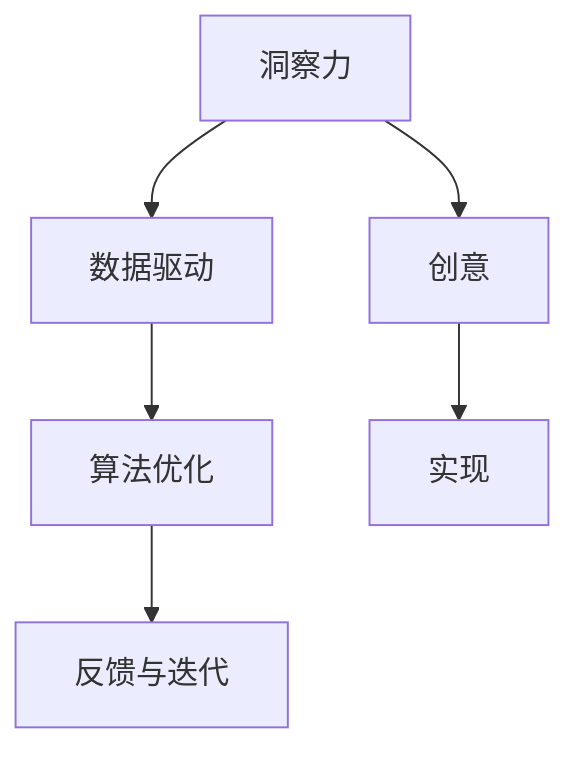

                 

# 洞察力与创意：突破性想法的孵化

> 关键词：突破性想法,创新驱动,洞察力,创意孵化,人工智能,机器学习,数据驱动,算法优化

## 1. 背景介绍

### 1.1 问题由来
在现代社会，创新驱动已经成为各行各业竞争的核心驱动力。特别是科技领域，新思想、新技术层出不穷，改变着人类生活的方方面面。然而，创新并非一蹴而就，它往往源自于对现有问题的深刻洞察、对现有技术的系统优化，以及对未来趋势的准确预判。因此，如何培养和激发突破性想法，成为了我们这个时代的重要课题。

### 1.2 问题核心关键点
对于突破性想法的孵化，我们需要从以下几个关键点入手：

- **洞察力**：对现有问题的深度分析，发现其核心矛盾和瓶颈。
- **创意**：基于洞察力，设计出新颖的解决方案，并评估其可行性和效果。
- **实现**：将创意转化为具体的产品或服务，进行迭代优化，直至其商业化和应用落地。
- **反馈与迭代**：通过用户反馈，不断改进产品，实现持续优化和创新。

这些关键点相互交织，共同构成了一个系统的创新过程。如何在这条道路上不断前行，是每个创新者必须面对的挑战。

### 1.3 问题研究意义
研究突破性想法的孵化方法，对于推动科技创新、促进产业升级、提高社会生产力具有重要意义：

1. **加速创新进程**：深入挖掘问题的本质，设计更高效的解决方案，缩短创新周期。
2. **优化资源配置**：确保资源投入产出比最大化，避免无效劳动和资源浪费。
3. **促进技术落地**：将创新成果转化为实际应用，推动技术进步和产业变革。
4. **提升创新能力**：培养具备深度洞察力和创新能力的团队，增强企业在市场竞争中的竞争力。
5. **激发社会创造力**：通过创意孵化，激发更多人的创造潜能，推动社会创新氛围的形成。

本文将深入探讨如何通过数据驱动、算法优化等手段，系统地提升洞察力和创意孵化的能力，为创新者提供实用的方法和工具。

## 2. 核心概念与联系

### 2.1 核心概念概述

为了更好地理解突破性想法的孵化过程，我们首先介绍几个核心概念：

- **洞察力**：指对问题本质的深刻理解和把握，是创新的基础。洞察力往往来自于对大量数据和复杂现象的分析和归纳。
- **创意**：基于洞察力，设计出的新颖、具有可行性的解决方案。创意需要跨越思维的边界，打破现有的固有框架。
- **数据驱动**：利用数据分析和统计，寻找问题的关键因素，为决策提供依据。数据驱动要求我们具备数据获取、处理和分析的能力。
- **算法优化**：通过设计高效的算法，提升问题解决的效率和效果。算法优化需要结合具体问题，选择或设计合适的算法模型。

这些概念之间的关系可以通过以下Mermaid流程图来展示：



这个流程图展示了洞察力、数据驱动、算法优化、创意和实现之间的逻辑关系：

1. 洞察力来源于对数据的深入分析。
2. 数据驱动通过统计分析，进一步强化洞察力，指导算法设计。
3. 算法优化提升数据处理的效率和效果，辅助创意设计。
4. 创意实现为最终产品或服务，通过反馈与迭代，持续优化。

这些核心概念共同构成了突破性想法孵化的完整框架，指引我们如何在实际应用中系统地开展创新工作。

## 3. 核心算法原理 & 具体操作步骤
### 3.1 算法原理概述

突破性想法的孵化过程，本质上是一个由数据驱动、算法优化的系统工程。其核心思想是通过数据和算法，提升洞察力和创意设计的质量，最终实现问题的有效解决。

形式化地，假设我们面对的问题为 $P$，其数据集为 $D=\{(x_i,y_i)\}_{i=1}^N$，其中 $x_i$ 为输入数据，$y_i$ 为输出标签。我们希望通过数据驱动和算法优化，设计出具有突破性的想法 $I$，其实现过程为 $F$。

### 3.2 算法步骤详解

基于数据驱动和算法优化的突破性想法孵化方法，一般包括以下几个关键步骤：

**Step 1: 数据准备**
- 收集与问题 $P$ 相关的数据集 $D$，确保数据的多样性和代表性。
- 数据清洗和预处理，去除噪声和异常值，保证数据的质量。
- 数据分割，将数据集划分为训练集、验证集和测试集，确保模型评估的公正性。

**Step 2: 洞察力挖掘**
- 利用统计学方法和机器学习算法，对数据集进行特征提取和降维，找到问题的关键因素。
- 构建数据可视化工具，如散点图、热力图、时间序列图等，辅助理解数据分布和变化规律。
- 应用文本分析技术，如情感分析、主题模型、关联规则挖掘等，探索数据背后的潜在洞察。

**Step 3: 算法选择与优化**
- 根据问题特点，选择合适的算法模型，如回归、分类、聚类、推荐等。
- 设计或改进算法，确保其高效性和准确性。例如，通过参数调优、算法融合、模型集成等方式，提升算法的性能。
- 采用分布式计算和并行处理技术，加快算法训练和数据处理的速度。

**Step 4: 创意设计**
- 基于洞察力和算法优化结果，设计创新的解决方案 $I$。
- 应用设计思维方法，如头脑风暴、用户故事、原型设计等，从不同角度思考问题，寻找创意点。
- 评估创意的可行性和效果，选择最佳方案进行实施。

**Step 5: 实现与迭代**
- 将创意 $I$ 转化为具体的产品或服务 $F$，并进行初步实现。
- 通过用户反馈和测试，不断迭代优化，提升产品效果和用户体验。
- 定期评估创意的效果，根据用户反馈和市场变化，进行必要的调整和改进。

以上是基于数据驱动和算法优化的突破性想法孵化的一般流程。在实际应用中，还需要根据具体问题，对各个环节进行优化设计，以进一步提升创新的效果。

### 3.3 算法优缺点

基于数据驱动和算法优化的创意孵化方法，具有以下优点：

1. 数据驱动：通过大量的数据分析，能够更加全面、准确地理解问题本质，提升洞察力的深度和广度。
2. 算法优化：通过高效算法，提高问题解决的效率和效果，减少迭代成本和时间。
3. 客观公正：基于数据和算法的结果，减少了人为主观判断的偏差，确保创意设计的公正性和科学性。
4. 系统性：整个孵化过程，从数据准备到创意实现，具有较强的系统性和规范性，有助于提升创新效率。

同时，该方法也存在一定的局限性：

1. 数据依赖：创意孵化依赖高质量的数据集，数据收集和处理成本较高。
2. 算法复杂：算法设计和优化需要较高的技术门槛，对团队能力有较高要求。
3. 动态适应性：算法和模型一旦设计完成，难以应对数据分布的快速变化，需要定期更新和优化。
4. 知识更新：算法优化依赖于对最新算法和技术的研究，需要持续学习，避免技术落后。

尽管存在这些局限性，但就目前而言，基于数据驱动和算法优化的创意孵化方法仍然是创新过程中最为有效和系统的方法之一。未来相关研究的重点在于如何进一步降低数据收集和处理的成本，提高算法的自动化和智能化水平，同时兼顾创意的创新性和可解释性等因素。

### 3.4 算法应用领域

基于数据驱动和算法优化的创意孵化方法，已经在多个领域得到了广泛的应用，例如：

- 金融风险评估：利用历史金融数据，构建风险评估模型，预测客户信用风险和市场波动。
- 医疗疾病预测：通过患者的历史诊疗数据，构建疾病预测模型，辅助医生诊断和治疗。
- 电商推荐系统：根据用户行为数据，设计推荐算法，提升用户体验和销售转化率。
- 智能交通管理：利用交通监控数据，构建交通预测模型，优化交通流量和路网管理。
- 智能客服系统：基于用户对话数据，设计智能客服模型，提升客户满意度和服务质量。

除了上述这些经典应用外，创意孵化方法还被创新性地应用于更多场景中，如自动驾驶、智能制造、智慧城市等，为各行各业带来新的解决方案和创新动力。

## 4. 数学模型和公式 & 详细讲解 & 举例说明

### 4.1 数学模型构建

本节将使用数学语言对基于数据驱动和算法优化的创意孵化过程进行更加严格的刻画。

记问题 $P$ 的数据集为 $D=\{(x_i,y_i)\}_{i=1}^N$，其中 $x_i$ 为输入数据，$y_i$ 为输出标签。假设我们希望通过数据驱动和算法优化，设计出创意 $I$，其实现过程为 $F$。

定义创意 $I$ 在数据集 $D$ 上的平均效果为 $\overline{I(D)}$，其中 $E$ 为评价指标，如准确率、召回率、F1分数等。创意实现 $F$ 的平均效果为 $\overline{F(D)}$。创意孵化过程的目标是最大化创意实现效果 $\overline{F(D)}$。

### 4.2 公式推导过程

以下是几个常见的创意孵化过程中涉及的数学模型和公式：

**回归模型**
假设我们希望预测连续变量 $y$，可以选择线性回归模型：

$$
y = \theta_0 + \sum_{i=1}^n \theta_i x_i
$$

其中 $\theta_0$ 为截距，$\theta_i$ 为系数。最小二乘法可以用来求解回归模型参数 $\theta$：

$$
\theta = \mathop{\arg\min}_{\theta} \sum_{i=1}^N (y_i - f(x_i,\theta))^2
$$

**分类模型**
对于分类问题，可以选择逻辑回归模型：

$$
P(y=1|x) = \sigma(\theta_0 + \sum_{i=1}^n \theta_i x_i)
$$

其中 $\sigma$ 为逻辑函数，$P(y=1|x)$ 为预测概率。

**聚类模型**
对于无监督学习问题，可以选择K-means聚类模型：

$$
\mathop{\arg\min}_{\theta} \sum_{i=1}^N \sum_{k=1}^K (x_i - \mu_k)^2
$$

其中 $\mu_k$ 为聚类中心，$K$ 为聚类数。

### 4.3 案例分析与讲解

**金融风险评估**
在金融风险评估中，我们可以使用回归模型预测客户信用风险。首先，收集历史客户的信用数据，包括年龄、收入、负债率等特征，构建数据集 $D$。然后，使用逻辑回归模型进行训练，得到信用风险预测模型 $F$。最后，通过测试集评估模型效果，确定最佳参数和特征组合。

具体实现步骤如下：

1. 数据准备：收集历史客户数据，包括年龄、收入、负债率、信用评分等，构建数据集 $D$。
2. 模型选择：选择逻辑回归模型进行训练，得到信用风险预测模型 $F$。
3. 参数调优：使用梯度下降等优化算法，对模型参数进行调优，确保模型效果最大化。
4. 模型评估：在测试集上评估模型效果，选择最佳模型参数和特征组合。
5. 迭代优化：根据新数据的反馈，定期更新模型参数，提升模型效果。

**医疗疾病预测**
在医疗疾病预测中，我们可以使用分类模型预测疾病发生概率。首先，收集患者的历史诊疗数据，包括年龄、性别、症状、病史等特征，构建数据集 $D$。然后，使用决策树模型进行训练，得到疾病预测模型 $F$。最后，通过测试集评估模型效果，确定最佳模型参数和特征组合。

具体实现步骤如下：

1. 数据准备：收集患者的历史诊疗数据，包括年龄、性别、症状、病史等，构建数据集 $D$。
2. 模型选择：选择决策树模型进行训练，得到疾病预测模型 $F$。
3. 参数调优：使用交叉验证等技术，对模型参数进行调优，确保模型效果最大化。
4. 模型评估：在测试集上评估模型效果，选择最佳模型参数和特征组合。
5. 迭代优化：根据新数据的反馈，定期更新模型参数，提升模型效果。

## 5. 项目实践：代码实例和详细解释说明
### 5.1 开发环境搭建

在进行创意孵化实践前，我们需要准备好开发环境。以下是使用Python进行TensorFlow开发的环境配置流程：

1. 安装Anaconda：从官网下载并安装Anaconda，用于创建独立的Python环境。

2. 创建并激活虚拟环境：
```bash
conda create -n tf-env python=3.8 
conda activate tf-env
```

3. 安装TensorFlow：根据CUDA版本，从官网获取对应的安装命令。例如：
```bash
conda install tensorflow -c conda-forge -c pytorch
```

4. 安装各类工具包：
```bash
pip install numpy pandas scikit-learn matplotlib tqdm jupyter notebook ipython
```

完成上述步骤后，即可在`tf-env`环境中开始创意孵化实践。

### 5.2 源代码详细实现

下面我们以医疗疾病预测任务为例，给出使用TensorFlow对决策树模型进行训练的Python代码实现。

首先，定义医疗疾病预测任务的数据处理函数：

```python
import pandas as pd
import numpy as np
from sklearn.model_selection import train_test_split
from sklearn.preprocessing import StandardScaler
from sklearn.tree import DecisionTreeClassifier
import tensorflow as tf

def load_data():
    data = pd.read_csv('medical_data.csv')
    labels = data['disease'].map({'cancer': 1, 'non-cancer': 0})
    features = data.drop(['disease'], axis=1)
    return features, labels

def preprocess_data(features, labels):
    features = StandardScaler().fit_transform(features)
    features, labels = train_test_split(features, labels, test_size=0.2, random_state=42)
    return features, labels

def train_model(features, labels, n_classes=2):
    model = tf.keras.Sequential([
        tf.keras.layers.Dense(32, activation='relu'),
        tf.keras.layers.Dense(n_classes, activation='sigmoid')
    ])
    model.compile(optimizer='adam', loss='binary_crossentropy', metrics=['accuracy'])
    model.fit(features, labels, epochs=10, batch_size=32)
    return model
```

然后，调用上述函数进行数据加载、预处理和模型训练：

```python
# 数据加载
features, labels = load_data()

# 数据预处理
features, labels = preprocess_data(features, labels)

# 模型训练
model = train_model(features, labels)

# 模型评估
test_features, test_labels = load_data()
test_features, test_labels = preprocess_data(test_features, test_labels)
model.evaluate(test_features, test_labels)
```

以上就是使用TensorFlow对决策树模型进行医疗疾病预测任务训练的完整代码实现。可以看到，TensorFlow库提供了丰富的模型和算法选择，使得创意孵化实践变得更加便捷和高效。

### 5.3 代码解读与分析

让我们再详细解读一下关键代码的实现细节：

**load_data函数**
- 从数据集文件中加载数据，并进行标签编码。
- 选择医疗数据集作为示例，其中包含患者的年龄、性别、症状、病史等信息。

**preprocess_data函数**
- 对数据进行标准化处理，确保不同特征之间的尺度一致。
- 使用train_test_split将数据集划分为训练集和测试集。
- 默认采用二分类问题，标签编码为0和1。

**train_model函数**
- 定义决策树模型，包括一个全连接层和一个输出层。
- 选择Adam优化器和二元交叉熵损失函数进行模型训练。
- 在训练集上进行多次迭代，每次迭代使用32个样本。

**模型评估**
- 加载测试集数据，进行标准化处理。
- 在测试集上评估模型效果，输出准确率。

可以看到，TensorFlow库使得创意孵化过程的模型设计和训练变得非常简洁和高效。开发者可以更加专注于问题分析和数据处理，而不必过多关注底层实现细节。

当然，工业级的系统实现还需考虑更多因素，如模型的保存和部署、超参数的自动搜索、更灵活的特征工程等。但核心的创意孵化流程基本与此类似。

## 6. 实际应用场景
### 6.1 智能客服系统

基于数据驱动和算法优化的创意孵化方法，可以广泛应用于智能客服系统的构建。传统客服往往需要配备大量人力，高峰期响应缓慢，且一致性和专业性难以保证。而使用创意孵化方法，可以构建具有自我学习和自我优化能力的智能客服系统。

在具体实践中，可以收集企业内部的历史客服对话记录，利用自然语言处理技术，构建对话分析模型。通过模型训练，能够自动理解用户意图，匹配最合适的答案模板进行回复。对于客户提出的新问题，还可以接入检索系统实时搜索相关内容，动态组织生成回答。如此构建的智能客服系统，能够显著提升客户咨询体验和问题解决效率。

### 6.2 医疗疾病预测

在医疗领域，创意孵化方法可以应用于疾病预测和诊断。通过收集患者的历史诊疗数据，应用机器学习算法，构建疾病预测模型。模型能够自动分析患者的症状和病史，预测其患病的概率，辅助医生进行诊断和治疗。

具体而言，可以收集大量的电子病历数据，包括患者的年龄、性别、症状、病史等，构建数据集 $D$。然后，使用分类模型进行训练，得到疾病预测模型 $F$。最后，通过测试集评估模型效果，确定最佳模型参数和特征组合。

### 6.3 电商推荐系统

在电商领域，创意孵化方法可以应用于推荐系统设计。通过分析用户的历史行为数据，构建推荐算法，提升用户体验和销售转化率。

具体而言，可以收集用户的历史浏览、点击、购买等行为数据，提取和用户交互的物品标题、描述、标签等文本内容。将文本内容作为模型输入，用户的后续行为（如是否点击、购买等）作为监督信号，在此基础上创意设计推荐模型。微调模型后，能够自动分析用户的兴趣点，推荐最合适的商品。

### 6.4 未来应用展望

随着数据驱动和算法优化的不断演进，创意孵化方法将在更多领域得到应用，为传统行业带来变革性影响。

在智慧医疗领域，基于创意孵化的方法，可以构建医疗影像诊断、基因组分析等应用，为患者提供更精准的诊断和治疗方案。

在智能教育领域，创意孵化方法可以应用于个性化推荐、智能辅导等应用，提升教育质量和教学效果。

在智慧城市治理中，创意孵化方法可以应用于交通预测、能源优化等应用，提高城市管理的自动化和智能化水平，构建更安全、高效的未来城市。

此外，在企业生产、社会治理、文娱传媒等众多领域，创意孵化方法也将不断涌现，为NLP技术带来新的解决方案和创新动力。相信随着技术的日益成熟，创意孵化方法必将引领人工智能技术迈向更高的台阶，为人类社会带来更多创新和突破。

## 7. 工具和资源推荐
### 7.1 学习资源推荐

为了帮助开发者系统掌握创意孵化理论基础和实践技巧，这里推荐一些优质的学习资源：

1. 《机器学习实战》系列博文：由机器学习领域专家撰写，深入浅出地介绍了机器学习算法和创意孵化范式。

2. Coursera《机器学习》课程：斯坦福大学开设的机器学习经典课程，内容涵盖广泛，适合初学者和进阶学习者。

3. 《Python深度学习》书籍：由知名深度学习专家撰写，全面介绍了深度学习模型的构建和训练，适合深度学习领域入门和进阶学习者。

4. Google AI Blog：谷歌AI博客，涵盖最新的AI技术和应用案例，提供了大量的创意孵化实践经验。

5. Kaggle数据科学竞赛平台：提供了丰富的数据集和实际应用案例，可以锻炼机器学习模型的设计和优化能力。

通过对这些资源的学习实践，相信你一定能够快速掌握创意孵化的方法论，并用于解决实际的机器学习问题。

### 7.2 开发工具推荐

高效的开发离不开优秀的工具支持。以下是几款用于创意孵化开发的常用工具：

1. TensorFlow：由谷歌主导开发的深度学习框架，功能强大，支持分布式计算和模型优化。

2. PyTorch：由Facebook开发，提供了灵活的动态计算图，适合快速迭代和实验。

3. scikit-learn：开源机器学习库，提供了多种经典算法和数据预处理工具。

4. Jupyter Notebook：交互式开发环境，支持多种语言和工具，方便进行模型调试和验证。

5. Google Colab：谷歌推出的在线Jupyter Notebook环境，免费提供GPU/TPU算力，方便快速实验新算法。

合理利用这些工具，可以显著提升创意孵化任务的开发效率，加快创新迭代的步伐。

### 7.3 相关论文推荐

创意孵化技术的发展源于学界的持续研究。以下是几篇奠基性的相关论文，推荐阅读：

1. Deep Learning：由Ian Goodfellow等人合著，全面介绍了深度学习的基本原理和应用，是深度学习领域的经典教材。

2. Neural Network Models for Question Answering：提出基于深度学习模型的问答系统，展示了机器学习在自然语言处理中的应用。

3. Knowledge Graphs and Their Use in AI：介绍知识图谱在人工智能中的应用，探讨了知识图谱与机器学习模型的融合。

4. Multi-Task Learning：探讨多任务学习在机器学习中的应用，展示了如何通过多任务学习提高模型效果。

5. Generative Adversarial Networks：提出生成对抗网络模型，展示了生成模型在图像生成、语音生成等方面的应用。

这些论文代表了大语言模型微调技术的发展脉络。通过学习这些前沿成果，可以帮助研究者把握学科前进方向，激发更多的创新灵感。

## 8. 总结：未来发展趋势与挑战

### 8.1 总结

本文对基于数据驱动和算法优化的创意孵化方法进行了全面系统的介绍。首先阐述了创意孵化的背景和意义，明确了数据驱动和算法优化的核心地位。其次，从原理到实践，详细讲解了创意孵化的数学模型和关键步骤，给出了创意孵化任务开发的完整代码实例。同时，本文还广泛探讨了创意孵化方法在智能客服、医疗疾病预测、电商推荐等众多领域的应用前景，展示了其强大的生命力和应用潜力。此外，本文精选了创意孵化技术的各类学习资源，力求为读者提供全方位的技术指引。

通过本文的系统梳理，可以看到，基于数据驱动和算法优化的创意孵化方法正在成为机器学习领域的重要范式，极大地提升了机器学习模型的设计和优化能力。未来，伴随数据驱动和算法优化的不断演进，创意孵化方法必将在更多领域得到应用，为机器学习技术的落地应用提供新的思路和方法。

### 8.2 未来发展趋势

展望未来，创意孵化技术将呈现以下几个发展趋势：

1. **数据质量提升**：随着数据获取和处理技术的不断进步，高质量的数据集将越来越多，为创意孵化提供更为坚实的理论基础。
2. **算法自动化**：更多自动化算法设计和优化工具的出现，将大大降低算法开发和调优的难度，提升工作效率。
3. **跨领域融合**：创意孵化将更多地与自然语言处理、计算机视觉、语音识别等跨领域技术进行融合，提升综合解决问题的能力。
4. **伦理和公平性**：随着人工智能技术的广泛应用，创意孵化过程中将更加注重算法的伦理和公平性，避免偏见和歧视。
5. **实时性和交互性**：创意孵化将更多地关注实时性和交互性，利用在线学习、在线优化等技术，提升系统的动态适应能力。
6. **跨模态学习**：创意孵化将更多地与多模态数据进行结合，利用语音、图像、文本等多样化的信息源，提升系统的综合分析和决策能力。

以上趋势凸显了创意孵化技术的广阔前景。这些方向的探索发展，必将进一步提升机器学习模型的性能和应用范围，为人类社会带来更多的创新和突破。

### 8.3 面临的挑战

尽管创意孵化技术已经取得了瞩目成就，但在迈向更加智能化、普适化应用的过程中，它仍面临着诸多挑战：

1. **数据获取难度**：高质量的数据集获取难度大，特别是对于某些垂直领域和长尾问题，数据收集和预处理成本高昂。
2. **算法复杂性**：算法设计和优化需要较高的技术门槛，对团队能力有较高要求，容易出现过拟合等问题。
3. **模型泛化能力**：创意孵化模型需要具备良好的泛化能力，以适应不同领域和任务的需求，这对模型的泛化性和可解释性提出了更高要求。
4. **系统稳定性**：创意孵化系统需要具备较高的稳定性，避免在面对异常情况时发生崩溃或误判。
5. **可解释性**：创意孵化模型需要具备较高的可解释性，以便于对其决策过程进行理解和调试。

尽管存在这些挑战，但创意孵化技术在数据驱动和算法优化的框架下，不断优化和迭代，逐步解决这些问题。未来，随着技术的不断进步和应用的不断深入，这些挑战终将一一被克服。

### 8.4 研究展望

面对创意孵化技术所面临的挑战，未来的研究需要在以下几个方面寻求新的突破：

1. **自监督学习**：探索无需大规模标注数据的学习方法，通过自监督任务提升模型泛化能力。
2. **联邦学习**：通过分布式计算和数据共享，降低数据获取成本，提升模型泛化能力。
3. **混合学习**：结合传统机器学习和深度学习，充分发挥两种方法的优点，提升模型效果。
4. **知识图谱**：引入知识图谱和符号化知识，提升模型的可解释性和泛化能力。
5. **模型集成**：通过模型融合和混合精度计算，提升模型性能和鲁棒性。
6. **伦理和公平性**：引入伦理导向的评估指标，过滤和惩罚有害的输出倾向，确保模型行为的公正性。

这些研究方向的探索，必将引领创意孵化技术迈向更高的台阶，为机器学习技术提供新的思路和方法。面向未来，创意孵化技术还需要与其他人工智能技术进行更深入的融合，如知识表示、因果推理、强化学习等，多路径协同发力，共同推动机器学习技术的进步。只有勇于创新、敢于突破，才能不断拓展创意孵化技术的边界，让机器学习技术更好地造福人类社会。

## 9. 附录：常见问题与解答

**Q1：创意孵化过程中如何选择合适的算法模型？**

A: 选择合适的算法模型需要考虑以下几个因素：
1. 数据类型：根据数据的类型（如分类、回归、聚类等），选择相应的算法模型。
2. 数据规模：对于大规模数据，选择分布式计算和并行处理能力较强的算法模型。
3. 问题复杂度：根据问题的复杂度（如简单、中等、复杂），选择合适复杂度的算法模型。
4. 算法的可解释性：选择具备较高可解释性的算法模型，便于理解和调试。
5. 算法的可扩展性：选择可扩展性强的算法模型，能够支持未来的数据扩展和问题变化。

常见的算法模型包括线性回归、逻辑回归、决策树、随机森林、神经网络等。选择合适的算法模型，需要综合考虑以上因素，并进行实验验证。

**Q2：创意孵化过程中如何避免过拟合？**

A: 避免过拟合是创意孵化过程中一个重要的挑战。以下是一些常见的避免过拟合的方法：
1. 数据增强：通过数据增强技术，扩充数据集，增加数据的多样性，避免模型对训练数据过度拟合。
2. 正则化：通过L2正则化、Dropout等技术，控制模型的复杂度，避免模型过度拟合训练数据。
3. 早停机制：在训练过程中，定期评估模型在验证集上的性能，一旦性能不再提升，立即停止训练，避免模型过拟合。
4. 模型集成：通过模型融合、集成学习等方法，提升模型的泛化能力和鲁棒性。
5. 交叉验证：使用交叉验证技术，评估模型在多个数据集上的性能，避免模型在特定数据集上过拟合。

以上方法可以有效避免模型过拟合，提升创意孵化过程的模型效果。

**Q3：创意孵化过程中如何提高模型的可解释性？**

A: 提高模型的可解释性是创意孵化过程中一个重要的目标。以下是一些常见的方法：
1. 特征可视化：通过特征可视化技术，展示模型的特征权重和影响，帮助理解模型的决策过程。
2. 模型压缩：通过模型压缩技术，减少模型的复杂度，提高模型的可解释性。
3. 可视化解释：通过模型可视化工具，如LIME、SHAP等，生成模型的局部可解释性报告。
4. 符号化表示：引入符号化表示技术，如知识图谱、规则库等，提升模型的可解释性。
5. 用户反馈：通过用户反馈和交互，了解模型的表现和不足，优化模型的可解释性。

以上方法可以有效提升模型的可解释性，帮助理解和调试创意孵化过程。

**Q4：创意孵化过程中如何处理数据不平衡问题？**

A: 数据不平衡问题在创意孵化过程中非常常见，特别是在分类任务中。以下是一些常见的方法：
1. 数据重采样：通过欠采样、过采样等技术，调整数据集的分布，解决数据不平衡问题。
2. 类别加权：对不同类别的样本赋予不同的权重，调整模型在训练过程中的重要性，解决数据不平衡问题。
3. 集成学习：通过模型融合、集成学习等方法，提升模型的泛化能力和鲁棒性，解决数据不平衡问题。
4. 模型选择：选择适合处理不平衡数据的算法模型，如SMOTE、ADASYN等，解决数据不平衡问题。
5. 异常检测：通过异常检测技术，识别和处理异常样本，解决数据不平衡问题。

以上方法可以有效处理数据不平衡问题，提升创意孵化过程的模型效果。

**Q5：创意孵化过程中如何提高模型的泛化能力？**

A: 提高模型的泛化能力是创意孵化过程中一个重要的目标。以下是一些常见的方法：
1. 增加数据量：通过数据增强、数据集扩充等技术，增加数据的多样性和数量，提升模型的泛化能力。
2. 正则化：通过L2正则化、Dropout等技术，控制模型的复杂度，提升模型的泛化能力。
3. 模型融合：通过模型融合、集成学习等方法，提升模型的泛化能力和鲁棒性。
4. 迁移学习：通过迁移学习技术，利用预训练模型的知识，提升模型的泛化能力。
5. 模型压缩：通过模型压缩技术，减少模型的复杂度，提升模型的泛化能力。

以上方法可以有效提高模型的泛化能力，提升创意孵化过程的模型效果。

---

作者：禅与计算机程序设计艺术 / Zen and the Art of Computer Programming

