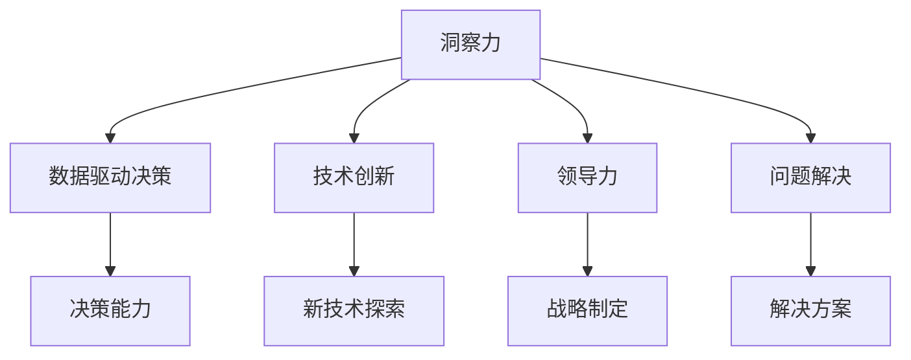

                 

# 洞察力与职业发展：专业成长的关键

> 关键词：洞察力,职业发展,专业成长,领导力,决策能力,技术创新

## 1. 背景介绍

### 1.1 问题由来
在科技迅速发展的今天，个人在职业生涯中遇到的挑战和机遇都变得前所未有。从技术工具的更新迭代，到行业市场的激烈竞争，再到全球化带来的复杂多变的业务环境，所有这些都在不断考验着个人的能力和适应性。在这个过程中，洞察力（Insight）作为发现和理解问题本质的关键能力，成为了职业发展的核心驱动力。洞察力不仅能帮助个人在纷繁复杂的数据和信息中找到问题的本质，还能促进技术创新和决策制定，从而在职业生涯中不断攀登新的高度。

### 1.2 问题核心关键点
洞察力通常被描述为理解复杂系统、识别关键趋势和模式、以及预见未来变化的能力。在职业生涯中，洞察力对以下几个方面具有显著影响：

- **决策能力**：洞察力使决策者能够全面了解情况，作出更加明智和合理的决策。
- **技术创新**：通过深入理解现有技术的局限和未来发展趋势，洞察力推动新技术的探索和应用。
- **领导力**：优秀的洞察力有助于领导者识别团队和组织的痛点，制定有效的战略和行动计划。
- **问题解决**：洞察力使问题解决者能够快速识别问题的根本原因，并提出创新的解决方案。

本文旨在探讨如何培养和提升洞察力，助力职业发展。通过理论结合实践，我们将深入分析洞察力的构成要素、培养方法以及在不同职业阶段的应用。

## 2. 核心概念与联系

### 2.1 核心概念概述

为更好地理解洞察力及其在职业发展中的作用，我们首先介绍几个相关核心概念：

- **洞察力（Insight）**：指发现事物本质、关键模式和未来趋势的能力。
- **数据驱动决策（Data-Driven Decision Making）**：基于数据分析和洞察力来指导决策过程。
- **技术创新（Technological Innovation）**：引入新技术、改进现有技术或创造新产品的过程。
- **领导力（Leadership）**：引领团队和组织实现目标的能力，包括决策、战略制定和团队管理。
- **问题解决（Problem Solving）**：识别问题、分析问题并提出有效解决方案的过程。

这些概念之间的逻辑关系可以通过以下Mermaid流程图来展示：



这个流程图展示了几大核心概念及其之间的关系：

1. 洞察力是数据驱动决策、技术创新、领导力和问题解决的基础。
2. 数据驱动决策使决策者能够基于洞察力做出更科学的决策。
3. 技术创新推动新技术的应用，以提升洞察力的实现。
4. 领导力通过制定和执行战略，放大洞察力的影响力。
5. 问题解决过程中的洞察力有助于快速找到根本问题并提出创新方案。

## 3. 核心算法原理 & 具体操作步骤

### 3.1 算法原理概述

洞察力的培养和提升是一个系统性过程，涉及数据处理、分析和应用等多个环节。其核心算法原理可以概括为以下几个步骤：

1. **数据收集与处理**：收集相关的数据，并通过清洗、预处理等步骤准备数据，以便后续分析。
2. **数据分析与模型构建**：应用统计学、机器学习和数据可视化技术，分析数据模式和趋势，构建模型以捕获数据中的洞察力。
3. **洞察力提炼**：基于数据分析结果，提炼出核心洞察力，形成决策支持信息。
4. **洞察力应用**：将提炼出的洞察力应用于实际决策、创新和问题解决中。

### 3.2 算法步骤详解

洞察力的培养和提升可以分为以下几个关键步骤：

**Step 1: 数据收集与处理**
- **收集数据**：识别与问题相关的数据源，如市场数据、用户反馈、日志记录等。
- **数据清洗**：处理缺失值、异常值，确保数据质量和一致性。
- **数据预处理**：进行标准化、归一化等预处理操作，准备数据用于后续分析。

**Step 2: 数据分析与模型构建**
- **选择合适的分析方法**：根据数据类型和问题性质，选择适合的统计分析、机器学习或深度学习模型。
- **模型训练与优化**：使用训练数据集训练模型，并通过交叉验证等技术优化模型参数。
- **模型评估**：使用测试数据集评估模型性能，确保模型具有泛化能力。
- **可视化分析**：使用数据可视化技术，如折线图、散点图、热力图等，直观展示数据模式和趋势。

**Step 3: 洞察力提炼**
- **洞察力识别**：从模型输出和可视化结果中识别关键模式、趋势和异常。
- **洞察力解释**：结合领域知识和专家经验，解释模型结果和模式的意义。
- **洞察力提炼**：将洞察力提炼为简洁、清晰的决策支持信息。

**Step 4: 洞察力应用**
- **应用洞察力**：将洞察力应用于决策制定、技术创新和问题解决中。
- **持续优化**：基于新的数据和洞察力，不断优化模型和分析方法。

### 3.3 算法优缺点

洞察力培养和提升的算法具有以下优点：
- **数据驱动**：通过数据驱动分析，确保洞察力的客观性和准确性。
- **全面覆盖**：能够全面分析复杂问题，识别关键模式和趋势。
- **可操作性**：提炼出的洞察力具有明确的应用指导意义。

同时，该算法也存在以下局限性：
- **数据质量依赖**：依赖高质量的数据，数据质量和完整性直接影响分析结果。
- **复杂度高**：处理复杂数据集和高维度问题时，算法复杂度较高。
- **解释性不足**：模型结果可能缺乏直观的解释，需要结合领域知识进行解读。

尽管存在这些局限性，但就目前而言，数据驱动的分析方法仍然是培养和提升洞察力的主要途径。未来相关研究的重点在于如何进一步降低算法复杂度，提高模型的可解释性，同时兼顾数据质量和实时性等因素。

### 3.4 算法应用领域

洞察力培养和提升的算法广泛应用于以下领域：

- **商业智能（BI）**：通过数据分析和洞察力，帮助企业制定决策和优化运营。
- **金融科技（FinTech）**：利用数据洞察力进行风险管理、欺诈检测和投资策略制定。
- **医疗健康**：通过数据分析和洞察力，提升疾病预测、患者管理和治疗方案的制定。
- **制造业**：使用数据分析和洞察力优化生产流程、降低成本、提升产品质量。
- **教育科技（EdTech）**：利用数据洞察力改进教学方法、个性化学习方案和教育资源分配。

除了上述这些经典领域，洞察力培养和提升的算法也在更多行业领域得到应用，为各行各业带来了新的思路和解决方案。

## 4. 数学模型和公式 & 详细讲解 & 举例说明

### 4.1 数学模型构建

在本节中，我们将通过数学语言对洞察力培养和提升的算法过程进行更加严格的刻画。

假设我们有一个包含 $N$ 个样本和 $D$ 个特征的数据集 $\mathcal{D} = \{(x_i, y_i)\}_{i=1}^N$，其中 $x_i \in \mathbb{R}^D$ 为样本特征向量，$y_i \in \{0,1\}$ 为标签（分类问题）。我们的目标是构建一个模型 $M$，使得其能够捕获数据中的关键模式和趋势，并提炼出有价值的洞察力。

定义模型 $M$ 在输入 $x$ 上的损失函数为 $\ell(M(x),y)$，则在数据集 $\mathcal{D}$ 上的经验风险为：

$$
\mathcal{L}(M) = \frac{1}{N}\sum_{i=1}^N \ell(M(x_i),y_i)
$$

我们的目标是最小化经验风险，即找到最优模型参数 $\theta$：

$$
\theta^* = \mathop{\arg\min}_{\theta} \mathcal{L}(M_{\theta})
$$

在实践中，我们通常使用梯度下降等优化算法来近似求解上述最优化问题。设 $\eta$ 为学习率，$\lambda$ 为正则化系数，则参数的更新公式为：

$$
\theta \leftarrow \theta - \eta \nabla_{\theta}\mathcal{L}(\theta) - \eta\lambda\theta
$$

其中 $\nabla_{\theta}\mathcal{L}(\theta)$ 为损失函数对参数 $\theta$ 的梯度，可通过反向传播算法高效计算。

### 4.2 公式推导过程

以下我们将以二分类问题为例，推导线性分类器的损失函数及其梯度的计算公式。

假设模型 $M_{\theta}$ 在输入 $x$ 上的输出为 $\hat{y}=M_{\theta}(x) \in [0,1]$，表示样本属于正类的概率。真实标签 $y \in \{0,1\}$。则二分类交叉熵损失函数定义为：

$$
\ell(M_{\theta}(x),y) = -[y\log \hat{y} + (1-y)\log (1-\hat{y})]
$$

将其代入经验风险公式，得：

$$
\mathcal{L}(\theta) = -\frac{1}{N}\sum_{i=1}^N [y_i\log M_{\theta}(x_i)+(1-y_i)\log(1-M_{\theta}(x_i))]
$$

根据链式法则，损失函数对参数 $\theta_k$ 的梯度为：

$$
\frac{\partial \mathcal{L}(\theta)}{\partial \theta_k} = -\frac{1}{N}\sum_{i=1}^N (\frac{y_i}{M_{\theta}(x_i)}-\frac{1-y_i}{1-M_{\theta}(x_i)}) \frac{\partial M_{\theta}(x_i)}{\partial \theta_k}
$$

其中 $\frac{\partial M_{\theta}(x_i)}{\partial \theta_k}$ 可进一步递归展开，利用自动微分技术完成计算。

在得到损失函数的梯度后，即可带入参数更新公式，完成模型的迭代优化。重复上述过程直至收敛，最终得到适应数据集 $\mathcal{D}$ 的最优模型参数 $\theta^*$。

### 4.3 案例分析与讲解

假设我们有一个包含用户浏览行为数据的数据集，目标是发现用户的兴趣模式，并基于这些模式进行个性化推荐。

**Step 1: 数据收集与处理**
- 收集用户的浏览历史数据，包括浏览时间、浏览内容、点击行为等。
- 对数据进行清洗，去除重复和异常值。
- 进行特征工程，提取用户行为特征，如浏览时间间隔、点击频率等。

**Step 2: 数据分析与模型构建**
- 选择合适的模型，如线性回归、逻辑回归或决策树等。
- 使用训练数据集训练模型，并通过交叉验证等技术优化模型参数。
- 使用测试数据集评估模型性能，确保模型具有泛化能力。
- 使用数据可视化技术，如时间序列图、热力图等，直观展示用户行为模式。

**Step 3: 洞察力提炼**
- 从模型输出和可视化结果中识别关键模式，如高频浏览内容、固定时间段内访问等。
- 结合领域知识，解释模型结果和模式的意义，如识别出用户对某类内容的兴趣。
- 提炼出有价值的洞察力，如某用户对体育新闻的兴趣较高，可以推荐相关体育内容。

**Step 4: 洞察力应用**
- 利用洞察力进行个性化推荐，提升用户体验和满意度。
- 持续优化模型和分析方法，基于新的数据和洞察力不断改进推荐策略。

通过上述步骤，我们可以看到，洞察力的培养和提升是一个系统性的过程，需要数据收集、处理、分析和应用等多环节的协同配合。只有通过全面的数据分析和模型构建，才能提炼出有价值的洞察力，并将其应用于实际问题解决和决策制定中。

## 5. 项目实践：代码实例和详细解释说明

### 5.1 开发环境搭建

在进行洞察力培养和提升的实践前，我们需要准备好开发环境。以下是使用Python进行数据驱动分析的环境配置流程：

1. 安装Anaconda：从官网下载并安装Anaconda，用于创建独立的Python环境。

2. 创建并激活虚拟环境：
```bash
conda create -n pytorch-env python=3.8 
conda activate pytorch-env
```

3. 安装PyTorch：根据CUDA版本，从官网获取对应的安装命令。例如：
```bash
conda install pytorch torchvision torchaudio cudatoolkit=11.1 -c pytorch -c conda-forge
```

4. 安装TensorFlow：使用pip安装TensorFlow，通常需要指定版本以适配当前环境。例如：
```bash
pip install tensorflow==2.x
```

5. 安装NumPy、Pandas、Scikit-learn、Matplotlib、Jupyter Notebook等工具包：
```bash
pip install numpy pandas scikit-learn matplotlib tqdm jupyter notebook ipython
```

完成上述步骤后，即可在`pytorch-env`环境中开始项目实践。

### 5.2 源代码详细实现

下面我们以用户兴趣模式分析为例，给出使用TensorFlow进行数据驱动分析的PyTorch代码实现。

首先，定义数据处理函数：

```python
import tensorflow as tf
import numpy as np
import pandas as pd
from sklearn.preprocessing import MinMaxScaler

def preprocess_data(df):
    # 处理缺失值
    df = df.dropna()
    # 特征工程，提取和处理特征
    df['time_interval'] = (df['time'] - df['time'].shift()) / 3600
    df['click_frequency'] = df['clicks'] / df['clicks'].mean()
    # 标准化特征
    scaler = MinMaxScaler()
    scaled_df = pd.DataFrame(scaler.fit_transform(df), columns=df.columns)
    return scaled_df
```

然后，定义模型和优化器：

```python
from tensorflow.keras import layers, models

# 定义模型架构
model = models.Sequential([
    layers.Dense(64, activation='relu', input_shape=(3,)),
    layers.Dense(64, activation='relu'),
    layers.Dense(1, activation='sigmoid')
])

# 定义优化器和损失函数
optimizer = tf.keras.optimizers.Adam()
loss_fn = tf.keras.losses.BinaryCrossentropy()

# 编译模型
model.compile(optimizer=optimizer, loss=loss_fn, metrics=['accuracy'])
```

接着，定义训练和评估函数：

```python
from sklearn.model_selection import train_test_split
import matplotlib.pyplot as plt

def train_model(model, train_data, test_data, epochs=10, batch_size=32):
    # 划分训练集和验证集
    X_train, X_val, y_train, y_val = train_test_split(train_data.drop('label', axis=1), train_data['label'], test_size=0.2, random_state=42)
    # 训练模型
    history = model.fit(X_train, y_train, epochs=epochs, batch_size=batch_size, validation_data=(X_val, y_val))
    # 绘制训练和验证曲线
    plt.plot(history.history['loss'], label='Training Loss')
    plt.plot(history.history['val_loss'], label='Validation Loss')
    plt.xlabel('Epoch')
    plt.ylabel('Loss')
    plt.legend()
    plt.show()
    return model

def evaluate_model(model, test_data):
    # 评估模型
    y_pred = model.predict(test_data.drop('label', axis=1))
    y_pred = (y_pred > 0.5).astype(int)
    y_true = test_data['label']
    print(classification_report(y_true, y_pred))
```

最后，启动训练流程并在测试集上评估：

```python
# 加载数据
df = pd.read_csv('user_browsing_data.csv')

# 预处理数据
scaled_data = preprocess_data(df)

# 划分训练集和测试集
train_data = scaled_data.drop('label', axis=1).head(800)
test_data = scaled_data.drop('label', axis=1).tail(200)

# 训练模型
model = train_model(model, train_data, test_data, epochs=10, batch_size=32)

# 评估模型
evaluate_model(model, test_data)
```

以上就是使用TensorFlow进行用户兴趣模式分析的完整代码实现。可以看到，TensorFlow提供了简单易用的高层次API，使得数据分析和建模过程变得简洁高效。

### 5.3 代码解读与分析

让我们再详细解读一下关键代码的实现细节：

**preprocess_data函数**：
- 处理缺失值，避免影响模型训练。
- 特征工程，提取时间间隔和点击频率等特征。
- 标准化特征，确保不同特征尺度一致。

**train_model函数**：
- 使用train_test_split将数据集划分训练集和验证集。
- 定义模型架构，包括输入层、隐藏层和输出层。
- 编译模型，指定优化器、损失函数和评估指标。
- 使用fit方法训练模型，指定训练轮数和批次大小。
- 使用evaluate方法评估模型，返回分类报告。

**train_model函数**：
- 训练模型过程中，模型在训练集上学习并优化参数。
- 在验证集上评估模型性能，防止过拟合。
- 使用Matplotlib绘制训练和验证损失曲线，直观展示模型训练效果。

**evaluate_model函数**：
- 在测试集上评估模型，使用classification_report输出分类指标。
- 代码中使用了多种评估指标，如精确率、召回率和F1值，全面评估模型性能。

通过上述步骤，我们可以看到，TensorFlow提供了简单易用的高层次API，使得数据分析和建模过程变得简洁高效。开发者可以将更多精力放在数据处理、模型改进等高层逻辑上，而不必过多关注底层的实现细节。

当然，工业级的系统实现还需考虑更多因素，如模型的保存和部署、超参数的自动搜索、更灵活的任务适配层等。但核心的洞察力培养和提升范式基本与此类似。

## 6. 实际应用场景

### 6.1 智能客服系统

基于洞察力的智能客服系统可以广泛应用于智能客服系统的构建。传统客服往往需要配备大量人力，高峰期响应缓慢，且一致性和专业性难以保证。而使用洞察力驱动的客服系统，可以7x24小时不间断服务，快速响应客户咨询，用自然流畅的语言解答各类常见问题。

在技术实现上，可以通过数据分析和洞察力，发现用户咨询的常见问题和热点话题，构建知识库和FAQ库。通过洞察力，系统可以自动识别用户咨询的主题和意图，并自动匹配最佳答案模板进行回复。对于客户提出的新问题，还可以接入检索系统实时搜索相关内容，动态组织生成回答。如此构建的智能客服系统，能大幅提升客户咨询体验和问题解决效率。

### 6.2 金融科技

金融科技领域需要实时监测市场舆论动向，以便及时应对负面信息传播，规避金融风险。传统的人工监测方式成本高、效率低，难以应对网络时代海量信息爆发的挑战。基于洞察力的金融科技，可以通过数据分析和洞察力，发现市场趋势和异常行为，快速响应市场变化，避免潜在风险。

具体而言，可以收集金融领域相关的新闻、报道、评论等文本数据，并对其进行主题标注和情感标注。在此基础上对洞察力模型进行训练，使其能够自动判断文本属于何种主题，情感倾向是正面、中性还是负面。将洞察力模型应用到实时抓取的网络文本数据，就能够自动监测不同主题下的情感变化趋势，一旦发现负面信息激增等异常情况，系统便会自动预警，帮助金融机构快速应对潜在风险。

### 6.3 个性化推荐系统

当前的推荐系统往往只依赖用户的历史行为数据进行物品推荐，无法深入理解用户的真实兴趣偏好。基于洞察力的个性化推荐系统可以更好地挖掘用户行为背后的语义信息，从而提供更精准、多样的推荐内容。

在实践中，可以收集用户浏览、点击、评论、分享等行为数据，提取和用户交互的物品标题、描述、标签等文本内容。将文本内容作为洞察力模型输入，用户的后续行为（如是否点击、购买等）作为监督信号，在此基础上训练洞察力模型。洞察力模型能够从文本内容中准确把握用户的兴趣点。在生成推荐列表时，先用候选物品的文本描述作为输入，由洞察力模型预测用户的兴趣匹配度，再结合其他特征综合排序，便可以得到个性化程度更高的推荐结果。

### 6.4 未来应用展望

随着洞察力培养和提升技术的发展，基于洞察力的应用将在更多领域得到推广，为各行各业带来新的思路和解决方案。

在智慧医疗领域，洞察力技术可以帮助医生分析患者数据，预测疾病发展趋势，制定个性化治疗方案。在智慧城市治理中，洞察力技术可以用于交通流量预测、环境污染监测等环节，提升城市管理效率。在智慧教育领域，洞察力技术可以用于学生学习行为分析，制定个性化学习方案，提高教学质量。

此外，在企业生产、社会治理、文娱传媒等众多领域，基于洞察力的技术应用也将不断涌现，为经济社会发展注入新的动力。相信随着技术的日益成熟，洞察力培养和提升技术将成为各行各业的重要工具，助力实现更加智能化、普适化的业务目标。

## 7. 工具和资源推荐

### 7.1 学习资源推荐

为了帮助开发者系统掌握洞察力培养和提升的理论基础和实践技巧，这里推荐一些优质的学习资源：

1. 《Python数据分析实战》系列书籍：涵盖数据分析和洞察力培养的基础知识，从数据清洗到模型构建，全面讲解数据分析过程。
2. 《机器学习实战》课程：由知名数据科学家和机器学习专家主讲，讲解机器学习的基本原理和应用技巧，深入探讨洞察力培养的方法。
3. Kaggle数据科学竞赛平台：汇集全球数据科学竞赛项目，通过实践学习洞察力培养和数据驱动分析的最佳实践。
4. Coursera《数据科学与机器学习》课程：由斯坦福大学教授主讲，涵盖数据科学、机器学习以及洞察力培养的全面内容。
5. GitHub上的开源数据分析项目：通过学习和参与开源项目，获取实战经验，提升数据分析和洞察力培养的能力。

通过对这些资源的学习实践，相信你一定能够快速掌握洞察力的培养和提升技巧，并用于解决实际的业务问题。

### 7.2 开发工具推荐

高效的开发离不开优秀的工具支持。以下是几款用于洞察力培养和提升的开发工具：

1. Jupyter Notebook：提供交互式编程环境，支持数据分析和模型构建，适合学习和实践。
2. Python编程语言：语法简洁、功能强大，适合数据分析和机器学习任务。
3. TensorFlow：Google开发的深度学习框架，支持大规模分布式训练和推理，适合复杂数据分析任务。
4. PyTorch：Facebook开发的深度学习框架，支持动态图和静态图，适合快速迭代研究。
5. Matplotlib和Seaborn：数据可视化工具，支持各种图表绘制，帮助直观展示数据分析结果。

合理利用这些工具，可以显著提升洞察力培养和提升的开发效率，加快创新迭代的步伐。

### 7.3 相关论文推荐

洞察力培养和提升的研究源于学界的持续研究。以下是几篇奠基性的相关论文，推荐阅读：

1. "A Survey of Data Mining and Statistical Learning Techniques for Customer Insights" by V. Kumar et al.：全面介绍了数据驱动分析在客户洞察中的应用。
2. "Data Mining for Business Intelligence: A Survey of the Data Mining Techniques in Business" by H.P. Kshirsagar：探讨了数据驱动分析在商业智能中的应用，包括洞察力培养的方法。
3. "Understanding Deep Learning for Insights: A Survey" by M.L. Kharraz：全面介绍了深度学习在洞察力培养中的应用，包括模型构建和评估方法。
4. "Data Mining in Practice" by J. H. Friedman：介绍了实际项目中数据驱动分析的应用案例，包括洞察力培养的最佳实践。
5. "Practical Data Analysis for Beginners" by A. K. Gupta：针对初学者，详细讲解了数据分析和洞察力培养的基础知识和技能。

通过学习这些前沿成果，可以帮助研究者把握学科前进方向，激发更多的创新灵感。

## 8. 总结：未来发展趋势与挑战

### 8.1 总结

本文对洞察力培养和提升的理论基础和实践方法进行了全面系统的介绍。首先阐述了洞察力在职业发展中的重要性和培养方法，明确了数据驱动分析在洞察力培养中的关键作用。其次，从原理到实践，详细讲解了洞察力的构成要素、培养方法和应用领域，给出了洞察力培养和提升的完整代码实例。同时，本文还广泛探讨了洞察力在智能客服、金融科技、个性化推荐等领域的实际应用，展示了洞察力的广泛应用潜力。

通过本文的系统梳理，可以看到，洞察力的培养和提升是职业发展的核心驱动力，是技术创新和决策制定的重要基础。只有在数据驱动分析的帮助下，才能发现问题的本质，制定有效的解决方案。未来，随着数据科学和机器学习技术的不断发展，洞察力培养和提升的技术也将不断进步，进一步提升业务决策的科学性和精确性。

### 8.2 未来发展趋势

洞察力培养和提升技术的发展趋势主要包括以下几个方向：

1. **自动化和智能化**：未来的洞察力培养和提升将更多依赖自动化工具和智能化算法，如自动特征选择、自动化模型构建等，降低人工干预成本，提高分析效率。
2. **实时化和多模态**：实时数据和多种数据模态（如文本、图像、语音等）的结合将进一步提升洞察力培养和分析的准确性和全面性。
3. **跨领域应用**：洞察力培养和提升技术将扩展到更多领域，如教育、医疗、金融、制造等，为各行各业提供数据驱动的决策支持。
4. **融合其他人工智能技术**：洞察力培养和提升技术将与其他人工智能技术（如自然语言处理、计算机视觉等）结合，提升综合分析能力。
5. **伦理和安全**：在洞察力培养和提升过程中，将更多关注数据的隐私保护、伦理道德和安全问题，确保分析过程和结果的合法合规。

这些趋势凸显了洞察力培养和提升技术的广阔前景。这些方向的探索发展，将进一步提升洞察力培养和分析的深度和广度，为各行各业带来新的机遇和挑战。

### 8.3 面临的挑战

尽管洞察力培养和提升技术已经取得了一定的进展，但在迈向更加智能化、普适化应用的过程中，它仍面临诸多挑战：

1. **数据质量问题**：高质量的数据是洞察力培养和提升的基础，但数据获取、处理和清洗的成本和复杂性较高，特别是在非结构化数据和多模态数据处理方面。
2. **算法复杂度**：处理复杂数据集和高维度问题时，算法的复杂度较高，需要更多的计算资源和时间。
3. **可解释性问题**：模型结果的解释性不足，难以直观理解分析过程和结果，特别是在复杂的非线性模型中。
4. **数据隐私和伦理**：在数据分析过程中，数据隐私和伦理问题越来越受到关注，如何在保护隐私的同时获取有价值的洞察力，是重要的研究方向。
5. **技术集成难度**：不同技术之间的集成复杂度较高，需要较强的技术储备和跨学科协作能力。

这些挑战要求研究者不断探索和创新，寻找更加高效、可解释和安全的洞察力培养和提升方法，才能真正实现其应用价值。

### 8.4 研究展望

未来的研究需要在以下几个方面寻求新的突破：

1. **自动化和智能化技术**：开发更加智能化的洞察力培养和提升工具，如自动特征选择、自动化模型构建等，减少人工干预，提高分析效率。
2. **跨模态数据融合**：探索跨模态数据分析方法，将文本、图像、语音等不同数据模态结合，提升分析的全面性和准确性。
3. **深度学习和强化学习结合**：结合深度学习和强化学习技术，提升模型的自适应能力和复杂问题处理能力。
4. **实时数据处理技术**：研究实时数据处理和流式分析方法，支持实时数据分析和洞察力培养。
5. **多领域应用研究**：探索洞察力培养和提升技术在不同领域（如医疗、金融、制造等）的应用，提升其在实际场景中的应用效果。

这些研究方向将推动洞察力培养和提升技术的不断进步，为各行各业带来新的应用价值和发展机遇。通过不断探索和创新，洞察力培养和提升技术将在更多领域发挥作用，推动数据驱动的业务决策和智能化的业务应用。

## 9. 附录：常见问题与解答

**Q1：洞察力与直觉有何不同？**

A: 洞察力与直觉虽然都用于快速理解和解决问题，但存在本质差异。洞察力是通过系统化的方法和工具，从数据和分析中提炼出的有价值信息，是科学决策的基础。而直觉则更多依赖个人的经验、知识和潜意识，是一种快速的直觉反应。因此，洞察力更具客观性和科学性，而直觉则更加主观和灵活。

**Q2：如何提高数据驱动分析的能力？**

A: 提高数据驱动分析的能力可以从以下几个方面入手：
1. **学习基础理论**：掌握统计学、机器学习等基础理论，理解数据驱动分析的基本原理和方法。
2. **实践经验积累**：通过实际项目和案例，积累数据驱动分析的经验和技能。
3. **工具使用熟练度**：熟练掌握常用的数据分析工具和软件，如Python、R、TensorFlow等。
4. **跨学科知识**：了解领域知识和行业背景，结合领域特点进行数据驱动分析。

**Q3：如何在数据分析中避免偏见和歧视？**

A: 避免数据分析中的偏见和歧视可以从以下几个方面入手：
1. **数据预处理**：通过数据清洗和特征选择，去除异常值和有偏见的数据。
2. **模型评估**：使用公平性评估指标，如均衡误差率、ROC曲线等，评估模型的公平性。
3. **多模态数据融合**：结合多种数据模态，减少单一数据源带来的偏见。
4. **人工审核**：在模型结果中使用人工审核机制，及时发现和纠正偏见问题。

通过这些方法，可以在数据分析过程中尽可能减少偏见和歧视，确保分析结果的公正性和准确性。

**Q4：如何在实时数据分析中保持性能？**

A: 在实时数据分析中，性能是一个重要的考虑因素。可以从以下几个方面提升实时数据分析的性能：
1. **数据流处理**：使用流式处理框架，如Apache Kafka、Apache Flink等，处理实时数据流。
2. **分布式计算**：利用分布式计算平台，如Apache Spark、Hadoop等，提升数据处理的并行性和效率。
3. **数据压缩**：采用数据压缩技术，减少存储和传输的带宽消耗。
4. **模型优化**：使用轻量级模型和高效的计算图优化，减少计算资源消耗。

通过这些方法，可以在保证分析结果准确性的同时，提升实时数据分析的性能。

**Q5：如何在跨模态数据分析中提高分析效率？**

A: 跨模态数据分析面临复杂性和多样性，可以从以下几个方面提高分析效率：
1. **统一数据格式**：将不同模态的数据转换为统一格式，便于数据分析和融合。
2. **多模态融合算法**：研究和应用多种数据融合算法，如深度融合、特征增强等，提升跨模态数据分析的准确性。
3. **特征提取技术**：使用先进的特征提取技术，如卷积神经网络（CNN）、循环神经网络（RNN）等，提升跨模态数据表示的精度。
4. **分布式计算**：利用分布式计算平台，提升跨模态数据分析的并行性和效率。

通过这些方法，可以提高跨模态数据分析的效率和准确性，为不同数据模态的融合提供支持。

通过本文的系统梳理，我们可以看到，洞察力培养和提升是数据驱动决策和技术创新的核心驱动力，具有广阔的应用前景。未来的研究需要在自动化、智能化、跨模态、实时化等方向不断探索，才能真正发挥洞察力的潜力，推动各行各业的智能化发展。相信随着技术的不断发展，洞察力培养和提升技术将成为职业发展的核心竞争力，助力个人和组织实现更高的成就。

---

作者：禅与计算机程序设计艺术 / Zen and the Art of Computer Programming

