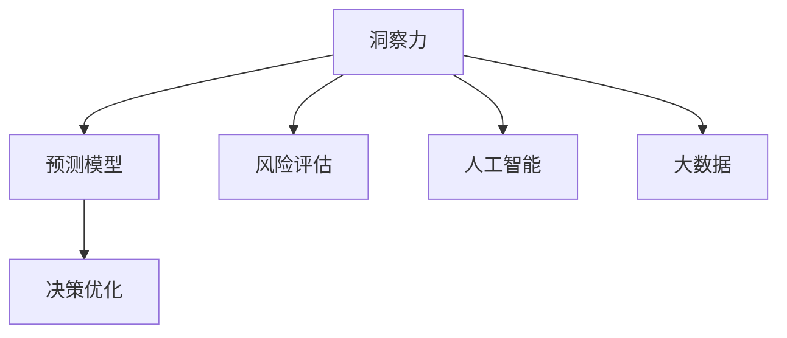

                 

# 洞察力与风险评估：预见与管理的能力

> 关键词：洞察力，风险评估，预测，管理，人工智能，机器学习，大数据

## 1. 背景介绍

### 1.1 问题由来
在日益复杂的现代社会中，决策者面临的挑战日益严峻。环境变化、市场波动、技术创新等诸多不确定因素，对企业战略、金融投资、公共管理等领域都提出了更高的要求。传统的基于经验的决策方法，往往难以适应快速变化的环境。因此，一种基于数据的决策支持系统，成为决策者们新的期望。

人工智能和大数据技术的崛起，为决策支持系统提供了全新的技术手段。通过挖掘数据中的洞察力，预测未来趋势，评估风险，进而优化决策，成为这一领域的核心问题。本文将探讨如何利用人工智能技术，构建洞察力与风险评估系统，以提升决策的质量和效果。

### 1.2 问题核心关键点
洞察力与风险评估的核心问题可以概括为以下几个方面：
1. **数据挖掘与洞察力提取**：如何从大规模数据中提取出有价值的信息，形成对问题深刻的理解。
2. **预测模型构建**：如何基于历史数据构建预测模型，以预测未来趋势和结果。
3. **风险评估**：如何评估预测结果的不确定性，识别可能的风险和异常。
4. **决策优化**：如何结合洞察力和风险评估结果，进行决策优化。

## 2. 核心概念与联系

### 2.1 核心概念概述

为更好地理解洞察力与风险评估的系统，本节将介绍几个关键概念：

- **洞察力（Insight）**：基于数据分析、挖掘出的有价值信息，能够帮助决策者理解问题的本质和趋势。洞察力通常包括数据中的模式、趋势、异常等。
- **预测模型（Prediction Model）**：基于历史数据和统计学、机器学习等方法构建的模型，用于预测未来事件或结果。预测模型可以基于回归、分类、时序分析等不同框架构建。
- **风险评估（Risk Assessment）**：通过统计分析和机器学习方法，评估预测结果的不确定性和可能的风险。风险评估包括概率分析、置信区间、敏感性分析等方法。
- **决策优化（Decision Optimization）**：结合洞察力和风险评估结果，采用优化算法进行决策选择。决策优化可以基于线性规划、整数规划、演化算法等多种方法。
- **人工智能（Artificial Intelligence）**：利用机器学习、深度学习等技术，自动发现数据中的规律和模式，构建预测和决策模型。
- **大数据（Big Data）**：处理海量、多样化的数据集，从中提取洞察力和预测模型。大数据通常需要分布式计算和存储技术支持。

这些概念之间的逻辑关系可以通过以下Mermaid流程图来展示：



这个流程图展示出各个概念之间的关联：

1. 洞察力来源于数据挖掘和分析。
2. 预测模型基于洞察力，用于预测未来。
3. 风险评估评估预测结果的不确定性。
4. 决策优化结合洞察力和风险评估，进行决策选择。
5. 人工智能和大数据技术，支持洞察力提取和预测模型构建。

## 3. 核心算法原理 & 具体操作步骤

### 3.1 算法原理概述

洞察力与风险评估系统通过以下步骤实现：

1. **数据预处理**：清洗、归一化数据，处理缺失值和异常值，构建训练集和测试集。
2. **特征工程**：从原始数据中提取和构造特征，提升模型性能。
3. **模型构建**：选择合适的算法和模型，基于训练集进行模型训练和调参。
4. **预测与评估**：使用测试集评估模型性能，基于风险评估模型预测结果的不确定性。
5. **决策优化**：结合洞察力和风险评估结果，进行决策选择。

### 3.2 算法步骤详解

基于以上步骤，下面详细介绍每个环节的具体操作：

**Step 1: 数据预处理**

数据预处理是洞察力与风险评估的第一步，通常包括以下几个关键步骤：

1. **数据清洗**：处理缺失值、异常值、重复数据等问题，保证数据的质量。
2. **特征选择**：根据领域知识和模型要求，选择或构造特征，去除冗余和无关特征。
3. **归一化与标准化**：将数据归一化到指定范围或标准化为均值为0、方差为1的分布，提升模型训练效率。
4. **数据分割**：将数据划分为训练集、验证集和测试集，保证模型泛化性能。

**Step 2: 特征工程**

特征工程是构建高质量预测模型的关键步骤，主要包括以下几个方面：

1. **特征提取**：从原始数据中提取关键特征，如统计特征、时序特征、文本特征等。
2. **特征构造**：通过组合、变换等方法构造新的特征，提升模型性能。
3. **特征选择**：采用特征选择算法，筛选出对预测目标贡献最大的特征。
4. **特征编码**：将非数值特征编码成数值特征，以便模型处理。

**Step 3: 模型构建**

模型构建是洞察力与风险评估的核心环节，主要包括以下几个关键步骤：

1. **算法选择**：根据问题特点选择合适的算法和模型，如回归、分类、时序分析等。
2. **模型训练**：使用训练集训练模型，进行超参数调优。
3. **模型评估**：使用验证集评估模型性能，选择最优模型。
4. **模型优化**：对模型进行优化，如正则化、交叉验证、模型融合等，提升模型泛化能力。

**Step 4: 预测与评估**

预测与评估是洞察力与风险评估的重要步骤，主要包括以下几个关键步骤：

1. **预测结果**：使用训练好的模型，对测试集进行预测，得到预测结果。
2. **风险评估**：使用风险评估模型，计算预测结果的不确定性和可能的风险。
3. **结果验证**：使用准确率、召回率、F1值等指标评估预测结果，确保模型性能。

**Step 5: 决策优化**

决策优化是洞察力与风险评估的最终目标，主要包括以下几个关键步骤：

1. **目标设定**：根据问题要求设定优化目标，如最大化利润、最小化风险等。
2. **决策选择**：结合洞察力和风险评估结果，选择最优决策方案。
3. **结果反馈**：对决策结果进行反馈和调整，提升决策效果。

### 3.3 算法优缺点

洞察力与风险评估系统具有以下优点：
1. **数据驱动决策**：基于大规模数据和先进的算法，能够提供更有价值的决策支持。
2. **自动化和高效**：自动化的数据分析和模型训练，节省了大量人力和时间成本。
3. **可解释性**：通过特征工程和模型解释工具，能够理解模型的决策过程。

同时，该系统也存在一定的局限性：
1. **数据质量依赖**：模型性能依赖于数据质量，需要高质量的数据源和数据处理能力。
2. **算法选择复杂**：不同的问题可能需要不同的算法和模型，选择不当可能导致性能下降。
3. **模型解释性有限**：尽管有解释工具，但复杂模型（如深度学习）的决策过程仍难以完全解释。
4. **鲁棒性问题**：模型可能对数据变化和噪声敏感，需要进一步的鲁棒性检验。

尽管存在这些局限性，但基于数据的洞察力与风险评估系统在决策支持中已经展现出巨大的潜力和优势。未来相关研究的方向在于进一步提高数据质量和算法鲁棒性，提升模型的可解释性和应用范围。

### 3.4 算法应用领域

洞察力与风险评估系统在多个领域中得到广泛应用，例如：

- **金融投资**：基于历史数据预测股票价格，评估投资风险，优化投资组合。
- **风险管理**：评估企业运营风险，进行资产配置和风险控制。
- **公共政策**：预测公共卫生事件趋势，评估政策效果，优化公共决策。
- **营销策略**：基于客户行为预测市场趋势，优化广告投放和产品推荐。
- **智能制造**：预测设备故障，优化生产计划，提升生产效率。

除了上述这些经典应用外，洞察力与风险评估系统还被创新性地应用到更多场景中，如自然灾害预测、环境保护、社会治理等，为复杂问题的解决提供了新的技术手段。

## 4. 数学模型和公式 & 详细讲解 & 举例说明（备注：数学公式请使用latex格式，latex嵌入文中独立段落使用 $$，段落内使用 $)
### 4.1 数学模型构建

洞察力与风险评估系统通常基于统计学、机器学习等方法构建，以预测和评估为核心。以下以回归问题为例，详细讲解模型构建的数学模型。

假设有一个回归问题，目标是预测变量 $y$ 与多个输入变量 $x_1, x_2, ..., x_n$ 的关系。数学模型可以表示为：

$$
y = \beta_0 + \sum_{i=1}^n \beta_i x_i + \epsilon
$$

其中 $\beta_0, \beta_1, ..., \beta_n$ 为回归系数，$\epsilon$ 为误差项，通常假设服从正态分布。回归系数可以通过最小二乘法求解：

$$
\beta = (\mathbf{X}^T \mathbf{X})^{-1} \mathbf{X}^T \mathbf{y}
$$

其中 $\mathbf{X}$ 为自变量矩阵，$\mathbf{y}$ 为因变量向量。

### 4.2 公式推导过程

回归问题的推导过程如下：

假设有一组训练数据 $\{(x_i, y_i)\}_{i=1}^N$，其中 $x_i$ 为输入向量，$y_i$ 为对应输出。回归模型的目标是最小化预测误差，即：

$$
\min_{\beta} \sum_{i=1}^N (y_i - \beta_0 - \sum_{j=1}^n \beta_j x_{ij})^2
$$

根据最小二乘法，解上述优化问题，得到回归系数：

$$
\beta = (\mathbf{X}^T \mathbf{X})^{-1} \mathbf{X}^T \mathbf{y}
$$

其中 $\mathbf{X}$ 为自变量矩阵，$\mathbf{y}$ 为因变量向量。

得到回归系数后，可以用于对新数据的预测，得到预测值 $\hat{y} = \beta_0 + \sum_{j=1}^n \beta_j x_{j}$。

### 4.3 案例分析与讲解

以股票价格预测为例，分析洞察力与风险评估系统的应用：

1. **数据预处理**：收集历史股价数据，处理缺失值，构建训练集和测试集。
2. **特征工程**：提取技术指标，如开盘价、收盘价、成交量等，构造特征。
3. **模型构建**：选择线性回归模型，使用训练集训练模型，进行超参数调优。
4. **预测与评估**：使用测试集评估模型性能，使用风险评估模型计算预测结果的不确定性。
5. **决策优化**：根据预测结果和风险评估，选择最优投资策略。

## 5. 项目实践：代码实例和详细解释说明
### 5.1 开发环境搭建

在进行洞察力与风险评估的实践前，我们需要准备好开发环境。以下是使用Python进行Scikit-learn开发的Python环境配置流程：

1. 安装Anaconda：从官网下载并安装Anaconda，用于创建独立的Python环境。

2. 创建并激活虚拟环境：
```bash
conda create -n insight-env python=3.8 
conda activate insight-env
```

3. 安装Scikit-learn、NumPy、Pandas等包：
```bash
conda install scikit-learn numpy pandas scikit-optimize matplotlib seaborn
```

4. 安装必要的开发工具：
```bash
pip install ipywidgets ipykernel jupyterlab nbclient nbformat
```

完成上述步骤后，即可在`insight-env`环境中开始实践。

### 5.2 源代码详细实现

下面我们以股票价格预测为例，给出使用Scikit-learn进行线性回归的Python代码实现。

```python
from sklearn.linear_model import LinearRegression
from sklearn.metrics import mean_squared_error
from sklearn.model_selection import train_test_split
import pandas as pd
import numpy as np

# 加载数据
data = pd.read_csv('stock_prices.csv')

# 数据预处理
data.fillna(method='ffill', inplace=True)
X = data.drop('price', axis=1)
y = data['price']

# 特征选择和构造
features = ['open', 'close', 'volume', 'market_cap']
X = X[features]

# 模型训练
X_train, X_test, y_train, y_test = train_test_split(X, y, test_size=0.2, random_state=42)
model = LinearRegression()
model.fit(X_train, y_train)

# 预测与评估
y_pred = model.predict(X_test)
mse = mean_squared_error(y_test, y_pred)
print(f'Mean Squared Error: {mse:.2f}')

# 风险评估
residuals = y_test - y_pred
std_residuals = np.std(residuals)
risk = std_residuals / np.sqrt(n_samples)
print(f'Risk: {risk:.2f}')
```

在这个代码中，我们首先加载股票价格数据，并进行数据预处理，包括填充缺失值和选择特征。接着，使用训练集对线性回归模型进行训练，并使用测试集进行预测和评估。最后，计算预测结果的不确定性，即残差的标准差。

### 5.3 代码解读与分析

让我们再详细解读一下关键代码的实现细节：

**数据预处理**：
- `data.fillna(method='ffill', inplace=True)`：使用前向填充缺失值。
- `X = data.drop('price', axis=1)`：选择除股价外的特征。

**特征选择和构造**：
- `features = ['open', 'close', 'volume', 'market_cap']`：选择常用的技术指标。
- `X = X[features]`：仅使用选定的特征。

**模型训练**：
- `X_train, X_test, y_train, y_test = train_test_split(X, y, test_size=0.2, random_state=42)`：将数据集分为训练集和测试集。
- `model = LinearRegression()`：创建线性回归模型。
- `model.fit(X_train, y_train)`：使用训练集训练模型。

**预测与评估**：
- `y_pred = model.predict(X_test)`：对测试集进行预测。
- `mse = mean_squared_error(y_test, y_pred)`：计算均方误差。

**风险评估**：
- `residuals = y_test - y_pred`：计算预测值与真实值之间的残差。
- `std_residuals = np.std(residuals)`：计算残差的标准差。
- `risk = std_residuals / np.sqrt(n_samples)`：计算风险，即残差标准差除以样本数的平方根。

可以看到，Scikit-learn提供了便捷的工具函数，使得模型构建和评估过程变得简单高效。开发者可以将更多精力放在特征工程和模型调参上，而不必过多关注底层实现。

## 6. 实际应用场景
### 6.1 金融投资

洞察力与风险评估系统在金融投资中具有重要应用价值。通过分析历史数据，构建预测模型，投资者可以预测股票价格趋势，评估投资风险，优化投资组合。具体应用场景包括：

- **股票价格预测**：基于历史股价和技术指标，预测未来股价走势，辅助投资决策。
- **风险控制**：根据预测结果，评估投资组合的风险水平，调整资产配置，实现风险控制。
- **投资策略优化**：结合市场信息和预测结果，优化交易策略，提升投资收益。

### 6.2 风险管理

风险管理是洞察力与风险评估系统的重要应用场景之一。通过分析企业历史数据，构建风险评估模型，企业可以预测运营风险，进行风险控制和资产配置。具体应用场景包括：

- **信用风险评估**：分析客户历史还款记录，预测其未来还款能力，控制信贷风险。
- **运营风险预测**：分析企业历史运营数据，预测其未来财务状况，实现风险控制。
- **资产配置优化**：根据风险评估结果，优化资产配置，提升投资回报率。

### 6.3 公共政策

公共政策制定需要基于大量数据和洞察力，以评估政策效果，优化公共决策。洞察力与风险评估系统可以应用于多个公共政策领域，如：

- **公共卫生预测**：分析疫情数据，预测疫情趋势，评估政策效果。
- **交通流量预测**：分析交通数据，预测流量变化，优化交通管理。
- **环境保护**：分析环境数据，预测污染趋势，制定环保政策。

### 6.4 未来应用展望

随着洞察力与风险评估系统的发展，未来将在更多领域得到广泛应用，为决策者提供更为精准和全面的支持。

在智慧城市治理中，通过分析城市数据，预测交通流量、环境污染等，优化城市管理，提升城市运行效率。

在农业生产中，基于气象数据和土壤数据，预测作物产量，优化种植策略，提升农业生产效益。

在社会治理中，通过分析社会数据，预测犯罪趋势，优化警力部署，提升社会安全水平。

此外，在更多垂直领域，洞察力与风险评估系统将发挥越来越重要的作用，为决策支持提供新的技术手段。

## 7. 工具和资源推荐
### 7.1 学习资源推荐

为了帮助开发者系统掌握洞察力与风险评估的理论基础和实践技巧，这里推荐一些优质的学习资源：

1. **《机器学习》（周志华）**：全面介绍机器学习的基本概念和算法，适合初学者和进阶学习。
2. **《Python数据科学手册》（Jake VanderPlas）**：详细介绍Python在数据分析和机器学习中的应用，适合实际开发。
3. **Coursera《机器学习》课程**：由斯坦福大学Andrew Ng教授主讲，系统介绍机器学习理论和实践。
4. **Kaggle竞赛平台**：提供大量数据集和竞赛任务，实战练习机器学习算法和模型评估。
5. **《统计学习方法》（李航）**：介绍统计学习的基本原理和方法，适合理论研究和算法优化。

通过对这些资源的学习实践，相信你一定能够快速掌握洞察力与风险评估的核心技术，并用于解决实际的决策支持问题。

### 7.2 开发工具推荐

高效的开发离不开优秀的工具支持。以下是几款用于洞察力与风险评估开发的常用工具：

1. **Python**：广泛使用的编程语言，适合数据分析和机器学习开发。
2. **Scikit-learn**：基于Python的机器学习库，提供丰富的算法和模型实现。
3. **Pandas**：数据分析工具，支持数据清洗、处理和分析。
4. **NumPy**：科学计算库，支持高效矩阵运算和数组处理。
5. **Jupyter Notebook**：交互式开发环境，支持代码编写和结果展示。
6. **TensorFlow**：深度学习框架，支持复杂模型和大规模数据处理。

合理利用这些工具，可以显著提升洞察力与风险评估任务的开发效率，加快创新迭代的步伐。

### 7.3 相关论文推荐

洞察力与风险评估领域的发展得益于学界的持续研究。以下是几篇奠基性的相关论文，推荐阅读：

1. **《统计学习方法》（李航）**：介绍了机器学习的基本原理和方法，适合理论研究和算法优化。
2. **《深度学习》（Ian Goodfellow）**：全面介绍深度学习的基本概念和算法，适合实际应用和算法优化。
3. **《大数据时代：机器学习及其应用》（周志华）**：介绍大数据时代机器学习的应用，适合实践应用。
4. **《人工智能：一种现代方法》（Stuart Russell, Peter Norvig）**：全面介绍人工智能的基本概念和算法，适合理论研究和应用实践。
5. **《机器学习实战》（Peter Harrington）**：通过实战项目，介绍机器学习的开发和应用，适合实践应用。

这些论文代表了大数据和机器学习领域的发展脉络。通过学习这些前沿成果，可以帮助研究者把握学科前进方向，激发更多的创新灵感。

## 8. 总结：未来发展趋势与挑战

### 8.1 研究成果总结

洞察力与风险评估系统通过数据分析和机器学习技术，为决策者提供了更加科学和可靠的决策支持。经过多年的发展，该系统已经在金融投资、风险管理、公共政策等多个领域得到广泛应用，并取得显著效果。

### 8.2 未来发展趋势

展望未来，洞察力与风险评估系统将呈现以下几个发展趋势：

1. **深度学习应用普及**：随着深度学习技术的成熟，洞察力与风险评估系统将更多采用深度学习模型，提升预测精度和模型泛化能力。
2. **多模态数据融合**：将语音、图像、文本等多种数据源融合，提升数据分析的全面性和深度。
3. **实时数据处理**：构建实时数据分析和预测系统，提升决策的及时性和响应速度。
4. **自动化决策支持**：结合人工智能技术，自动化生成决策建议，提升决策效率和效果。
5. **多场景应用拓展**：进一步拓展在智慧城市、农业、社会治理等多个领域的应用，提升决策支持系统的应用范围和价值。

### 8.3 面临的挑战

尽管洞察力与风险评估系统已经取得了显著进展，但在迈向更加智能化、普适化应用的过程中，仍面临诸多挑战：

1. **数据质量问题**：数据质量的不确定性，如数据缺失、异常值等问题，可能导致模型性能下降。
2. **算法复杂性**：深度学习模型结构复杂，难以解释和调试，可能导致模型鲁棒性不足。
3. **计算资源消耗**：深度学习模型对计算资源消耗大，可能面临硬件瓶颈。
4. **隐私和安全问题**：数据隐私和安全问题，如数据泄露、模型被盗用等，需要进一步加强保护。
5. **模型可解释性**：复杂模型的可解释性不足，难以满足决策支持系统的需求。

### 8.4 研究展望

面对洞察力与风险评估系统所面临的挑战，未来的研究需要在以下几个方面寻求新的突破：

1. **数据预处理与清洗**：开发更加高效和鲁棒的数据预处理算法，提升数据质量。
2. **模型解释与优化**：研究模型解释工具和方法，提升模型的可解释性和鲁棒性。
3. **硬件加速**：开发更加高效的硬件加速技术，支持大规模模型训练和推理。
4. **隐私保护技术**：研究数据隐私保护技术，保障数据安全和隐私。
5. **模型集成与融合**：结合多种模型和算法，构建更加全面和精准的洞察力与风险评估系统。

这些研究方向的探索，必将引领洞察力与风险评估系统迈向更高的台阶，为决策支持提供更加科学、高效、安全的支持。面向未来，洞察力与风险评估系统需要在算法、硬件、隐私保护等方面进行全面优化，才能真正实现其在决策支持中的广泛应用。

## 9. 附录：常见问题与解答

**Q1：如何评估洞察力与风险评估系统的性能？**

A: 洞察力与风险评估系统的性能评估通常从以下几个方面进行：

1. **预测准确率**：使用测试集评估模型预测的准确率，如均方误差、R²、F1值等指标。
2. **模型鲁棒性**：通过对抗样本测试和交叉验证等方法，评估模型的鲁棒性和泛化能力。
3. **风险评估效果**：使用残差分析、置信区间等方法，评估模型的不确定性和风险评估效果。
4. **决策优化效果**：通过实际决策效果评估，如投资回报率、政策效果等，评估系统的决策优化效果。

**Q2：洞察力与风险评估系统是否适用于所有问题？**

A: 洞察力与风险评估系统适用于需要数据分析和预测的问题，但并非所有问题都适用。对于依赖领域知识和专家经验的问题，洞察力与风险评估系统可能需要结合专家知识进行优化。此外，对于实时性要求很高的系统，洞察力与风险评估系统需要进一步优化算法和硬件支持。

**Q3：如何选择适当的洞察力与风险评估系统？**

A: 选择适当的洞察力与风险评估系统需要考虑以下几个方面：

1. **问题特点**：根据问题类型选择合适的算法和模型，如回归、分类、时序分析等。
2. **数据规模**：考虑数据规模和复杂度，选择合适大小的模型和算法。
3. **计算资源**：评估计算资源，选择合适的硬件平台，如GPU、TPU等。
4. **可解释性需求**：根据实际应用场景，选择具有可解释性的模型和工具。

**Q4：洞察力与风险评估系统是否需要持续优化？**

A: 洞察力与风险评估系统需要持续优化，以应对环境变化和数据更新。具体优化步骤包括：

1. **数据更新**：定期更新数据集，保持模型的时效性。
2. **模型调整**：根据实际效果，调整模型参数和算法，优化模型性能。
3. **算法改进**：采用最新的算法和模型，提升系统性能。
4. **环境适应**：研究模型在不同环境下的适应性，优化模型鲁棒性。

这些优化措施将有助于保持洞察力与风险评估系统的准确性和可靠性，为决策支持提供更好的支持。

---

作者：禅与计算机程序设计艺术 / Zen and the Art of Computer Programming

