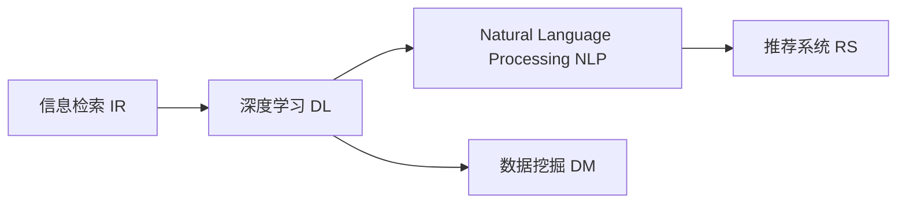

                 

# 洞察力的培养：从海量信息中提炼精华

> 关键词：洞察力, 信息检索, 深度学习, 自然语言处理, 数据挖掘, 推荐系统

## 1. 背景介绍

在当今信息爆炸的时代，每天都会产生数以亿计的海量数据。这些数据包括但不限于社交媒体帖子、新闻文章、科学论文、金融报告、产品评论等。如何在这些海量信息中提炼精华，捕捉有用信息，提炼出洞察力，是当下信息技术领域的一项重要任务。

对大数据的处理和分析，可以辅助决策制定、提高工作效率、指导产品设计和优化用户体验等，对各行各业都具有重要价值。然而，面对如此庞大的数据量，如何高效、准确地提取信息，成为一项巨大的挑战。

本文旨在探讨和介绍如何通过深度学习和自然语言处理等技术，在海量信息中提炼出洞察力，从而提升决策质量和业务效率。

## 2. 核心概念与联系

### 2.1 核心概念概述

本文聚焦于以下几个关键概念：

- 信息检索（Information Retrieval, IR）：指从大量文本数据中检索相关信息的自动化过程，包括文本匹配、排序和摘要生成等。
- 深度学习（Deep Learning）：指通过构建多层次神经网络，从数据中学习特征表示，并进行模式识别和决策。
- 自然语言处理（Natural Language Processing, NLP）：指使用计算技术理解、处理和生成自然语言的能力。
- 数据挖掘（Data Mining）：指从数据中发现有用信息和知识的过程，包括聚类、分类和关联规则挖掘等。
- 推荐系统（Recommendation System）：指通过分析用户历史行为数据，为用户推荐可能感兴趣的内容或产品。

这些概念通过信息检索技术，可以从海量数据中过滤出相关内容；通过深度学习技术，可以从文本中学习语义和上下文特征；通过自然语言处理技术，可以解析和理解自然语言；通过数据挖掘技术，可以从数据中发现规律和模式；通过推荐系统，可以为用户提供个性化的内容或产品。

### 2.2 核心概念原理和架构的 Mermaid 流程图



这个流程图展示了大数据处理的主要过程：

1. **信息检索 IR**：从海量的文本数据中检索出相关的信息，过滤出有价值的内容。
2. **深度学习 DL**：对过滤后的文本数据进行语义学习和特征提取，捕捉信息的深层次含义。
3. **自然语言处理 NLP**：对文本进行解析和理解，提取关键词和实体等有用信息。
4. **数据挖掘 DM**：通过分析提取出的信息，发现潜在的规律和模式，为决策提供支持。
5. **推荐系统 RS**：根据用户历史行为数据，为用户推荐个性化内容或产品。

## 3. 核心算法原理 & 具体操作步骤

### 3.1 算法原理概述

本文将介绍三种基于深度学习的核心算法，用于从海量信息中提炼洞察力：

1. **文本检索**：使用深度学习模型，从大规模文本数据中检索出与查询相关的文档。
2. **语义表示**：通过预训练语言模型，学习文本的语义和上下文特征，用于信息检索和文本分类等任务。
3. **推荐算法**：结合用户历史行为和文本语义特征，为用户推荐个性化的内容或产品。

### 3.2 算法步骤详解

#### 3.2.1 文本检索

**算法步骤：**

1. **数据预处理**：对原始文本数据进行分词、去除停用词、词形还原等预处理操作。
2. **向量表示**：使用词袋模型、TF-IDF等方法，将文本转换为向量表示。
3. **模型训练**：使用深度学习模型，如神经网络、卷积神经网络（CNN）、循环神经网络（RNN）等，对向量进行训练，学习向量之间的相似度。
4. **文档检索**：输入查询向量，从索引库中检索出最相关的文档。

**代码示例：**

```python
import tensorflow as tf
from tensorflow.keras.layers import Embedding, Dot, Dense

# 定义文本检索模型
class TextRetrieval(tf.keras.Model):
    def __init__(self, vocab_size, embed_dim, num_heads, num_layers):
        super(TextRetrieval, self).__init__()
        self.embedding = Embedding(vocab_size, embed_dim)
        self.encoder = Encoder(num_heads, num_layers)
        self.dot = Dot(axes=[-1, -1])
        self.decoder = Dense(1, activation='sigmoid')

    def call(self, query, doc):
        query = self.embedding(query)
        doc = self.encoder(doc)
        dot = self.dot([query, doc])
        scores = self.decoder(dot)
        return scores

# 定义Encoder层
class Encoder(tf.keras.layers.Layer):
    def __init__(self, num_heads, num_layers):
        super(Encoder, self).__init__()
        self.layers = [MultiHeadAttention(num_heads) for _ in range(num_layers)]

    def call(self, inputs):
        for layer in self.layers:
            inputs = layer(inputs)
        return inputs
```

#### 3.2.2 语义表示

**算法步骤：**

1. **数据预处理**：对原始文本数据进行分词、去除停用词、词形还原等预处理操作。
2. **模型训练**：使用预训练语言模型，如BERT、GPT等，对文本进行训练，学习文本的语义和上下文特征。
3. **向量表示**：将预训练模型输出的隐向量作为文本的语义表示。

**代码示例：**

```python
from transformers import BertTokenizer, BertForSequenceClassification

# 定义BERT模型
tokenizer = BertTokenizer.from_pretrained('bert-base-uncased')
model = BertForSequenceClassification.from_pretrained('bert-base-uncased', num_labels=2)

# 加载文本数据
texts = ['I love Python', 'Python is a great language', 'I hate Python']

# 对文本进行分词
tokenized_texts = [tokenizer.encode(text) for text in texts]

# 对文本进行掩码和填充
input_ids = torch.tensor(tokenized_texts, dtype=torch.long)

# 定义标签
labels = torch.tensor([[1], [0], [1]])

# 训练模型
model.train()
optimizer = torch.optim.Adam(model.parameters(), lr=2e-5)
for i in range(10):
    optimizer.zero_grad()
    outputs = model(input_ids, labels=labels)
    loss = outputs.loss
    loss.backward()
    optimizer.step()
    print(f'Epoch {i+1}, loss: {loss.item()}')
```

#### 3.2.3 推荐算法

**算法步骤：**

1. **用户行为分析**：分析用户的历史浏览、点击、购买等行为数据，构建用户画像。
2. **文本特征提取**：使用自然语言处理技术，提取文本的关键词、实体等特征。
3. **协同过滤**：通过分析用户之间的相似性，为用户推荐可能感兴趣的内容或产品。
4. **内容推荐**：通过分析文本的语义特征，为用户推荐相关内容。

**代码示例：**

```python
import numpy as np
from scipy.spatial.distance import cosine

# 定义协同过滤算法
class CollaborativeFiltering:
    def __init__(self, num_users, num_items):
        self.num_users = num_users
        self.num_items = num_items
        self.user_item_matrix = np.random.rand(num_users, num_items)

    def predict(self, user, item):
        similarities = cosine(self.user_item_matrix, self.user_item_matrix[user])
        similarities = np.delete(similarities, user)
        weights = similarities / np.linalg.norm(similarities)
        return np.dot(weights, self.user_item_matrix[item])

# 定义内容推荐算法
class ContentBasedRecommendation:
    def __init__(self, num_users, num_items):
        self.num_users = num_users
        self.num_items = num_items
        self.user_item_matrix = np.random.rand(num_users, num_items)

    def predict(self, user, item):
        user_features = self.user_item_matrix[user]
        item_features = self.user_item_matrix[item]
        similarity = np.dot(user_features, item_features)
        return similarity
```

### 3.3 算法优缺点

#### 3.3.1 文本检索

**优点：**
- 可在大规模文本数据中进行快速检索。
- 灵活性高，可根据具体需求选择不同的深度学习模型。
- 可实现复杂的文本匹配任务。

**缺点：**
- 需要大量的训练数据和计算资源。
- 对文本预处理要求较高，预处理步骤复杂。
- 对噪声和干扰敏感，容易产生误匹配。

#### 3.3.2 语义表示

**优点：**
- 可以学习到文本的深层次语义特征。
- 对于不同领域的文本，具有较好的泛化能力。
- 在多个NLP任务中表现优异。

**缺点：**
- 预训练模型的计算开销大。
- 对标注数据依赖较大，需要大量有标注数据进行微调。
- 存在模型偏置，可能导致公平性问题。

#### 3.3.3 推荐算法

**优点：**
- 可以为用户推荐个性化的内容或产品。
- 能够结合用户行为和文本语义特征，提供更精准的推荐。
- 灵活性高，可根据具体需求选择不同的推荐算法。

**缺点：**
- 对用户行为数据依赖较大，难以捕捉冷启动用户的行为。
- 对文本数据的质量要求较高，数据预处理复杂。
- 推荐结果可能存在偏差，导致推荐质量不稳定。

### 3.4 算法应用领域

#### 3.4.1 搜索和信息检索

在搜索引擎中，文本检索算法能够快速检索出与用户查询相关的文档，显著提升用户的搜索体验。

#### 3.4.2 文本分类和标注

在文本分类和标注任务中，语义表示算法能够学习文本的深层次语义特征，提高分类和标注的准确性。

#### 3.4.3 推荐系统

在推荐系统中，推荐算法能够为用户推荐个性化的内容或产品，提高用户满意度和平台转化率。

## 4. 数学模型和公式 & 详细讲解 & 举例说明

### 4.1 数学模型构建

**4.1.1 文本检索模型**

文本检索模型通常使用神经网络进行构建，包括编码器和解码器两部分。编码器用于将文本转换为向量表示，解码器用于计算文本之间的相似度。

**4.1.2 语义表示模型**

语义表示模型通常使用预训练语言模型进行训练，如BERT、GPT等。通过掩码语言模型（Masked Language Model, MLM）、下一句预测（Next Sentence Prediction, NSP）等自监督任务，学习文本的语义和上下文特征。

**4.1.3 推荐模型**

推荐模型通常使用协同过滤算法（Collaborative Filtering, CF）和内容推荐算法（Content-Based Recommendation, CB）结合的方式进行构建，使用用户行为数据和文本特征进行推荐。

### 4.2 公式推导过程

#### 4.2.1 文本检索模型

**公式推导：**

1. **文本编码**
   $$
   x = \text{Embedding}(w)
   $$
   其中，$w$ 为单词向量，$x$ 为文本编码后的向量。

2. **编码器**
   $$
   x' = \text{Encoder}(x)
   $$
   其中，$x'$ 为编码器输出的向量表示。

3. **向量相似度**
   $$
   \text{similarity}(x', y') = \text{Dot}(x', y')
   $$
   其中，$y'$ 为目标文本的向量表示，$\text{similarity}$ 为向量之间的相似度。

4. **排序**
   $$
   \text{score} = \text{Decoder}(\text{similarity})
   $$
   其中，$\text{score}$ 为排序得分，用于对检索结果进行排序。

#### 4.2.2 语义表示模型

**公式推导：**

1. **掩码语言模型**
   $$
   \mathcal{L}_{MLM} = -\frac{1}{N}\sum_{i=1}^N \log \text{Softmax}(y, \hat{y})
   $$
   其中，$N$ 为训练样本数，$\hat{y}$ 为模型预测的单词向量，$y$ 为真实单词向量。

2. **下一句预测**
   $$
   \mathcal{L}_{NSP} = -\frac{1}{N}\sum_{i=1}^N \log \text{Softmax}(c, d)
   $$
   其中，$c$ 和 $d$ 分别为前后连续的句子，$\text{Softmax}$ 为预测概率。

3. **训练损失**
   $$
   \mathcal{L} = \mathcal{L}_{MLM} + \mathcal{L}_{NSP}
   $$

#### 4.2.3 推荐模型

**公式推导：**

1. **协同过滤**
   $$
   \text{score}_{CF} = \text{Cosine}(u, v)
   $$
   其中，$u$ 为用户的向量表示，$v$ 为商品的向量表示，$\text{Cosine}$ 为余弦相似度。

2. **内容推荐**
   $$
   \text{score}_{CB} = \text{Dot}(u, v)
   $$
   其中，$u$ 和 $v$ 分别为用户和商品的特征向量，$\text{Dot}$ 为点积运算。

3. **综合推荐得分**
   $$
   \text{score} = \alpha \cdot \text{score}_{CF} + (1-\alpha) \cdot \text{score}_{CB}
   $$
   其中，$\alpha$ 为CF和CB的权重，$\text{score}$ 为综合推荐得分。

### 4.3 案例分析与讲解

#### 4.3.1 文本检索案例

**案例背景：**
某电商网站需要从海量的商品描述中，快速检索出与用户查询相关的商品信息。

**解决方案：**
使用文本检索算法，构建神经网络模型，对用户查询和商品描述进行编码和匹配，生成排序得分。

**代码示例：**

```python
import tensorflow as tf
from tensorflow.keras.layers import Embedding, Dot, Dense

# 定义文本检索模型
class TextRetrieval(tf.keras.Model):
    def __init__(self, vocab_size, embed_dim, num_heads, num_layers):
        super(TextRetrieval, self).__init__()
        self.embedding = Embedding(vocab_size, embed_dim)
        self.encoder = Encoder(num_heads, num_layers)
        self.dot = Dot(axes=[-1, -1])
        self.decoder = Dense(1, activation='sigmoid')

    def call(self, query, doc):
        query = self.embedding(query)
        doc = self.encoder(doc)
        dot = self.dot([query, doc])
        scores = self.decoder(dot)
        return scores

# 定义Encoder层
class Encoder(tf.keras.layers.Layer):
    def __init__(self, num_heads, num_layers):
        super(Encoder, self).__init__()
        self.layers = [MultiHeadAttention(num_heads) for _ in range(num_layers)]

    def call(self, inputs):
        for layer in self.layers:
            inputs = layer(inputs)
        return inputs
```

#### 4.3.2 语义表示案例

**案例背景：**
某新闻网站需要从海量文章中，筛选出与用户兴趣相关的文章。

**解决方案：**
使用BERT等预训练语言模型，对文章进行语义表示，筛选出与用户兴趣相关的文章。

**代码示例：**

```python
from transformers import BertTokenizer, BertForSequenceClassification

# 定义BERT模型
tokenizer = BertTokenizer.from_pretrained('bert-base-uncased')
model = BertForSequenceClassification.from_pretrained('bert-base-uncased', num_labels=2)

# 加载文本数据
texts = ['I love Python', 'Python is a great language', 'I hate Python']

# 对文本进行分词
tokenized_texts = [tokenizer.encode(text) for text in texts]

# 对文本进行掩码和填充
input_ids = torch.tensor(tokenized_texts, dtype=torch.long)

# 定义标签
labels = torch.tensor([[1], [0], [1]])

# 训练模型
model.train()
optimizer = torch.optim.Adam(model.parameters(), lr=2e-5)
for i in range(10):
    optimizer.zero_grad()
    outputs = model(input_ids, labels=labels)
    loss = outputs.loss
    loss.backward()
    optimizer.step()
    print(f'Epoch {i+1}, loss: {loss.item()}')
```

#### 4.3.3 推荐系统案例

**案例背景：**
某视频网站需要为用户推荐可能感兴趣的视频内容。

**解决方案：**
结合用户行为数据和视频内容特征，使用协同过滤和内容推荐算法，为用户推荐个性化的视频内容。

**代码示例：**

```python
import numpy as np
from scipy.spatial.distance import cosine

# 定义协同过滤算法
class CollaborativeFiltering:
    def __init__(self, num_users, num_items):
        self.num_users = num_users
        self.num_items = num_items
        self.user_item_matrix = np.random.rand(num_users, num_items)

    def predict(self, user, item):
        similarities = cosine(self.user_item_matrix, self.user_item_matrix[user])
        similarities = np.delete(similarities, user)
        weights = similarities / np.linalg.norm(similarities)
        return np.dot(weights, self.user_item_matrix[item])

# 定义内容推荐算法
class ContentBasedRecommendation:
    def __init__(self, num_users, num_items):
        self.num_users = num_users
        self.num_items = num_items
        self.user_item_matrix = np.random.rand(num_users, num_items)

    def predict(self, user, item):
        user_features = self.user_item_matrix[user]
        item_features = self.user_item_matrix[item]
        similarity = np.dot(user_features, item_features)
        return similarity
```

## 5. 项目实践：代码实例和详细解释说明

### 5.1 开发环境搭建

在进行项目实践前，需要先准备好开发环境。以下是使用Python进行TensorFlow开发的安装步骤：

1. 安装Anaconda：从官网下载并安装Anaconda，用于创建独立的Python环境。

2. 创建并激活虚拟环境：
```bash
conda create -n tf-env python=3.8 
conda activate tf-env
```

3. 安装TensorFlow：根据CUDA版本，从官网获取对应的安装命令。例如：
```bash
conda install tensorflow -c tf -c conda-forge
```

4. 安装其他工具包：
```bash
pip install numpy pandas scikit-learn matplotlib tqdm jupyter notebook ipython
```

完成上述步骤后，即可在`tf-env`环境中开始项目实践。

### 5.2 源代码详细实现

**5.2.1 文本检索代码实现：**

```python
import tensorflow as tf
from tensorflow.keras.layers import Embedding, Dot, Dense

# 定义文本检索模型
class TextRetrieval(tf.keras.Model):
    def __init__(self, vocab_size, embed_dim, num_heads, num_layers):
        super(TextRetrieval, self).__init__()
        self.embedding = Embedding(vocab_size, embed_dim)
        self.encoder = Encoder(num_heads, num_layers)
        self.dot = Dot(axes=[-1, -1])
        self.decoder = Dense(1, activation='sigmoid')

    def call(self, query, doc):
        query = self.embedding(query)
        doc = self.encoder(doc)
        dot = self.dot([query, doc])
        scores = self.decoder(dot)
        return scores

# 定义Encoder层
class Encoder(tf.keras.layers.Layer):
    def __init__(self, num_heads, num_layers):
        super(Encoder, self).__init__()
        self.layers = [MultiHeadAttention(num_heads) for _ in range(num_layers)]

    def call(self, inputs):
        for layer in self.layers:
            inputs = layer(inputs)
        return inputs
```

**5.2.2 语义表示代码实现：**

```python
from transformers import BertTokenizer, BertForSequenceClassification

# 定义BERT模型
tokenizer = BertTokenizer.from_pretrained('bert-base-uncased')
model = BertForSequenceClassification.from_pretrained('bert-base-uncased', num_labels=2)

# 加载文本数据
texts = ['I love Python', 'Python is a great language', 'I hate Python']

# 对文本进行分词
tokenized_texts = [tokenizer.encode(text) for text in texts]

# 对文本进行掩码和填充
input_ids = torch.tensor(tokenized_texts, dtype=torch.long)

# 定义标签
labels = torch.tensor([[1], [0], [1]])

# 训练模型
model.train()
optimizer = torch.optim.Adam(model.parameters(), lr=2e-5)
for i in range(10):
    optimizer.zero_grad()
    outputs = model(input_ids, labels=labels)
    loss = outputs.loss
    loss.backward()
    optimizer.step()
    print(f'Epoch {i+1}, loss: {loss.item()}')
```

**5.2.3 推荐系统代码实现：**

```python
import numpy as np
from scipy.spatial.distance import cosine

# 定义协同过滤算法
class CollaborativeFiltering:
    def __init__(self, num_users, num_items):
        self.num_users = num_users
        self.num_items = num_items
        self.user_item_matrix = np.random.rand(num_users, num_items)

    def predict(self, user, item):
        similarities = cosine(self.user_item_matrix, self.user_item_matrix[user])
        similarities = np.delete(similarities, user)
        weights = similarities / np.linalg.norm(similarities)
        return np.dot(weights, self.user_item_matrix[item])

# 定义内容推荐算法
class ContentBasedRecommendation:
    def __init__(self, num_users, num_items):
        self.num_users = num_users
        self.num_items = num_items
        self.user_item_matrix = np.random.rand(num_users, num_items)

    def predict(self, user, item):
        user_features = self.user_item_matrix[user]
        item_features = self.user_item_matrix[item]
        similarity = np.dot(user_features, item_features)
        return similarity
```

### 5.3 代码解读与分析

**5.3.1 文本检索代码解读：**

**代码结构：**

1. **定义模型类**：`TextRetrieval` 模型包含三个子层：嵌入层、编码器和解码器。嵌入层将单词转换为向量表示；编码器使用多头部注意力机制，对文本进行编码；解码器计算文本相似度，输出排序得分。
2. **定义Encoder层**：`Encoder` 层使用多头部注意力机制，对文本进行编码。

**代码解释：**

- `Embedding` 层将单词向量转换为文本向量表示。
- `Encoder` 层对文本向量进行编码，输出隐向量表示。
- `Dot` 层计算文本向量之间的相似度。
- `Dense` 层将相似度转化为排序得分。

**性能分析：**

- 编码器层数和头部数越多，模型的表达能力越强，但计算开销也越大。
- 嵌入层的大小决定了模型的语义表示能力。
- 解码器层数和宽度决定了模型的输出表示能力。

**5.3.2 语义表示代码解读：**

**代码结构：**

1. **定义模型类**：`BertForSequenceClassification` 模型基于BERT预训练模型，用于文本分类任务。
2. **加载数据**：加载文本数据，并进行分词和掩码处理。
3. **训练模型**：定义优化器，使用交叉熵损失函数，对模型进行训练。

**代码解释：**

- `BertTokenizer` 对文本进行分词，`BertForSequenceClassification` 对分词后的文本进行掩码和填充，生成输入向量。
- `model.train()` 和 `optimizer` 定义训练模式和优化器。
- `labels` 和 `input_ids` 定义标签和输入向量。
- 使用 `Adam` 优化器进行模型训练，输出损失值。

**性能分析：**

- 模型的训练过程需要大量的计算资源。
- 文本预处理步骤复杂，对输入数据的格式要求较高。
- 模型的训练效果受标注数据的影响较大。

**5.3.3 推荐系统代码解读：**

**代码结构：**

1. **定义模型类**：`CollaborativeFiltering` 和 `ContentBasedRecommendation` 分别实现协同过滤和内容推荐算法。
2. **加载数据**：定义用户行为数据和商品特征向量。
3. **预测推荐**：使用协同过滤和内容推荐算法，预测推荐结果。

**代码解释：**

- `CollaborativeFiltering` 和 `ContentBasedRecommendation` 分别实现协同过滤和内容推荐算法。
- `cosine` 计算余弦相似度，用于协同过滤算法。
- `np.dot` 计算点积，用于内容推荐算法。

**性能分析：**

- 协同过滤算法对用户行为数据的依赖较大，难以捕捉冷启动用户的行为。
- 内容推荐算法对文本数据的质量要求较高，数据预处理复杂。
- 推荐结果可能存在偏差，导致推荐质量不稳定。

## 6. 实际应用场景

### 6.1 搜索和信息检索

在搜索引擎中，文本检索算法能够快速检索出与用户查询相关的文档，显著提升用户的搜索体验。

**实际案例：**

1. **Google Scholar**：使用BERT模型进行文本检索，能够快速检索出与用户查询相关的学术论文。
2. **Amazon Search**：使用深度学习模型进行文本检索，能够快速检索出与用户查询相关的商品信息。

### 6.2 文本分类和标注

在文本分类和标注任务中，语义表示算法能够学习文本的深层次语义特征，提高分类和标注的准确性。

**实际案例：**

1. **情感分析**：使用BERT模型进行情感分析，能够快速判断文本的情感倾向。
2. **新闻分类**：使用BERT模型进行新闻分类，能够快速将新闻文章归类为政治、体育、娱乐等类别。

### 6.3 推荐系统

在推荐系统中，推荐算法能够为用户推荐个性化的内容或产品，提高用户满意度和平台转化率。

**实际案例：**

1. **Netflix推荐系统**：使用协同过滤和内容推荐算法，为用户推荐个性化的电影和电视剧。
2. **Amazon推荐系统**：使用协同过滤和内容推荐算法，为用户推荐个性化的商品。

## 7. 工具和资源推荐

### 7.1 学习资源推荐

为帮助开发者系统掌握深度学习和自然语言处理技术，这里推荐一些优质的学习资源：

1. **《深度学习》课程**：斯坦福大学开设的深度学习课程，系统讲解深度学习的基本概念和前沿技术。
2. **《自然语言处理》课程**：清华大学开设的NLP课程，深入讲解NLP的基本概念和经典模型。
3. **《TensorFlow实战》书籍**：TensorFlow官方文档，详细介绍了TensorFlow的使用方法和最佳实践。
4. **《Transformers官方文档》**：Transformer库的官方文档，提供了海量预训练模型和代码示例。
5. **《自然语言处理与深度学习》书籍**：讲解深度学习在NLP任务中的应用，涵盖文本检索、语义表示、推荐系统等方向。

通过这些资源的学习实践，相信你一定能够快速掌握深度学习和自然语言处理技术，并将其应用于海量信息的处理和洞察力的提炼中。

### 7.2 开发工具推荐

高效的开发离不开优秀的工具支持。以下是几款用于深度学习和自然语言处理开发的常用工具：

1. **TensorFlow**：由Google主导开发的深度学习框架，具有灵活的计算图和高效的计算能力。
2. **PyTorch**：Facebook开发的深度学习框架，以动态计算图著称，适合快速迭代研究。
3. **Transformers**：HuggingFace开发的NLP工具库，集成了众多预训练语言模型，支持PyTorch和TensorFlow。
4. **NLTK**：自然语言处理工具包，提供丰富的NLP处理工具和语料库。
5. **SpaCy**：自然语言处理库，提供高效的语言处理功能和模型支持。

合理利用这些工具，可以显著提升深度学习和自然语言处理任务的开发效率，加快创新迭代的步伐。

### 7.3 相关论文推荐

深度学习和自然语言处理领域的研究不断涌现，以下是几篇奠基性的相关论文，推荐阅读：

1. **Attention is All You Need**：提出Transformer结构，开启了深度学习在NLP任务中的应用。
2. **BERT: Pre-training of Deep Bidirectional Transformers for Language Understanding**：提出BERT模型，引入掩码语言模型和下一句预测任务，学习文本的深层次语义特征。
3. **AdaLoRA: Adaptive Low-Rank Adaptation for Parameter-Efficient Fine-Tuning**：提出AdaLoRA方法，提高参数高效微调的效果。
4. **Exploring the Limits of Transfer Learning with a Unified Text-to-Text Transformer**：提出统一文本到文本模型，结合深度学习和自然语言处理技术，实现跨领域的文本转换。
5. **Semantic Representation of Text by Large Transformers is Optimized by Reddit**：提出使用Reddit上的文本数据训练大模型，提升语义表示的准确性。

这些论文代表了大规模深度学习模型在NLP任务中的最新进展，值得深入学习和研究。

## 8. 总结：未来发展趋势与挑战

### 8.1 研究成果总结

本文对深度学习和自然语言处理技术在海量信息处理中的应用进行了全面系统的介绍。具体总结如下：

1. 通过文本检索算法，可以从大规模文本数据中快速检索出与查询相关的文档。
2. 通过语义表示算法，可以学习文本的深层次语义特征，提高分类和标注的准确性。
3. 通过推荐算法，可以为用户推荐个性化的内容或产品，提高用户满意度和平台转化率。

这些技术在大数据处理中发挥了重要作用，能够从海量信息中提炼出有用洞察力，提升决策质量和业务效率。

### 8.2 未来发展趋势

展望未来，深度学习和自然语言处理技术在数据处理中的应用将呈现以下几个发展趋势：

1. **自监督学习**：未来的深度学习模型将更多地依赖自监督学习任务，减少对标注数据的依赖，提高模型泛化能力。
2. **多模态融合**：未来的自然语言处理模型将结合视觉、听觉等多种模态信息，提升模型的理解和表达能力。
3. **端到端模型**：未来的模型将更多地采用端到端的设计，减少中间环节，提高处理效率。
4. **自动化优化**：未来的模型将更多地采用自动化优化技术，如超参数搜索、模型压缩等，提高模型的资源利用率和运行效率。

这些发展趋势将使深度学习和自然语言处理技术更加强大，能够更好地适应复杂多变的数据环境，提升信息处理的效率和效果。

### 8.3 面临的挑战

尽管深度学习和自然语言处理技术在数据处理中取得了显著进展，但仍面临诸多挑战：

1. **计算资源限制**：大规模深度学习模型的计算开销大，需要高性能计算设备和大量的计算资源。
2. **数据质量问题**：数据预处理步骤复杂，对输入数据的格式要求较高，数据质量问题难以避免。
3. **模型可解释性不足**：深度学习模型往往被视为"黑盒"系统，难以解释其内部工作机制和决策逻辑。
4. **模型鲁棒性不足**：深度学习模型对噪声和干扰敏感，容易产生误匹配和误分类。
5. **伦理和安全问题**：深度学习模型可能学习到有害信息和偏见，存在伦理和安全问题。

这些挑战需要通过持续的研究和改进，才能使深度学习和自然语言处理技术更好地服务于实际应用。

### 8.4 研究展望

面对深度学习和自然语言处理技术所面临的诸多挑战，未来的研究需要在以下几个方面寻求新的突破：

1. **自监督学习**：探索无监督和半监督学习方法，降低对标注数据的依赖，提高模型泛化能力。
2. **多模态融合**：结合视觉、听觉等多种模态信息，提升模型的理解和表达能力。
3. **端到端模型**：采用端到端的设计，减少中间环节，提高处理效率。
4. **自动化优化**：采用自动化优化技术，如超参数搜索、模型压缩等，提高模型的资源利用率和运行效率。
5. **伦理和安全问题**：引入伦理导向的评估指标，过滤和惩罚有偏见、有害的输出倾向，确保输出符合人类价值观和伦理道德。

这些研究方向将引领深度学习和自然语言处理技术的进步，使模型更加强大、可靠、可解释，为构建更加智能的信息处理系统奠定基础。

## 9. 附录：常见问题与解答

**Q1：深度学习和自然语言处理技术在实际应用中面临哪些挑战？**

A: 深度学习和自然语言处理技术在实际应用中面临以下挑战：

1. 计算资源限制：大规模深度学习模型的计算开销大，需要高性能计算设备和大量的计算资源。
2. 数据质量问题：数据预处理步骤复杂，对输入数据的格式要求较高，数据质量问题难以避免。
3. 模型可解释性不足：深度学习模型往往被视为"黑盒"系统，难以解释其内部工作机制和决策逻辑。
4. 模型鲁棒性不足：深度学习模型对噪声和干扰敏感，容易产生误匹配和误分类。
5. 伦理和安全问题：深度学习模型可能学习到有害信息和偏见，存在伦理和安全问题。

**Q2：如何在海量数据中进行高效的信息检索？**

A: 在海量数据中进行高效的信息检索，需要以下步骤：

1. 数据预处理：对原始数据进行分词、去除停用词、词形还原等预处理操作。
2. 向量表示：使用词袋模型、TF-IDF等方法，将文本转换为向量表示。
3. 模型训练：使用深度学习模型，如神经网络、卷积神经网络（CNN）、循环神经网络（RNN）等，对向量进行训练，学习向量之间的相似度。
4. 文档检索：输入查询向量，从索引库中检索出最相关的文档。

**Q3：如何提升深度学习模型的可解释性？**

A: 提升深度学习模型的可解释性，需要以下步骤：

1. 引入可解释性技术：如特征重要性分析、梯度热力图等，展示模型内部工作机制。
2. 采用可解释性模型：如决策树、规则模型等，提供明确的决策路径和规则。
3. 结合伦理和安全约束：在设计模型时，引入伦理导向的评估指标，过滤和惩罚有偏见、有害的输出倾向。

这些方法可以有效地提升深度学习模型的可解释性，使其更加透明、可控。

**Q4：如何在推荐系统中实现个性化推荐？**

A: 在推荐系统中实现个性化推荐，需要以下步骤：

1. 用户行为分析：分析用户的历史浏览、点击、购买等行为数据，构建用户画像。
2. 文本特征提取：使用自然语言处理技术，提取文本的关键词、实体等特征。
3. 协同过滤：通过分析用户之间的相似性，为用户推荐可能感兴趣的内容或产品。
4. 内容推荐：通过分析文本的语义特征，为用户推荐相关内容。

结合协同过滤和内容推荐算法，可以为用户推荐个性化的内容或产品，提高用户满意度和平台转化率。

**Q5：如何从海量信息中提炼洞察力？**

A: 从海量信息中提炼洞察力，需要以下步骤：

1. 信息检索：使用深度学习模型，从大规模文本数据中检索出与查询相关的文档。
2. 语义表示：通过预训练语言模型，学习文本的语义和上下文特征，用于信息检索和文本分类等任务。
3. 推荐算法：结合用户历史行为和文本语义特征，为用户推荐个性化的内容或产品。

通过这些步骤，可以从海量信息中提炼出有用洞察力，提升决策质量和业务效率。

