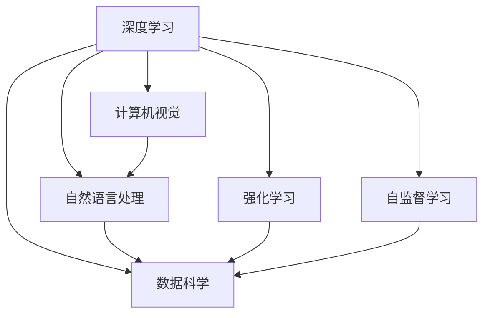

                 

# 洞察力的培养：从表象到本质的思考

> 关键词：洞察力, 表象, 本质, 深度学习, 计算机视觉, 自然语言处理, 机器学习, 数据科学

## 1. 背景介绍

在信息化和智能化的时代浪潮中，洞察力成为了企业竞争力和个人职业发展的重要基石。无论是市场洞察、客户洞察还是技术洞察，洞察力都能帮助企业在复杂多变的环境中发现机会，把握趋势，引领变革。在数据驱动和算法驱动的双重驱动下，洞察力的培养和应用日益成为信息时代不可或缺的一环。本文将从深度学习和数据科学的角度，探讨如何通过技术手段提升洞察力，从表象到本质，实现更精准、更深刻的洞察。

### 1.1 问题由来

随着数据量的爆炸性增长和算力水平的飞速提升，人工智能技术在多个领域取得了突破性进展。深度学习、计算机视觉、自然语言处理等技术，正在改变人们的生活和工作方式。然而，数据和算法只是洞察力的工具，如何从海量数据中提取出有价值的洞察，才是真正挑战所在。传统的数据挖掘方法往往依赖人工经验和规则，耗时耗力且效果有限。而深度学习技术，特别是深度学习中的自监督学习、强化学习等方法，能够自动发现数据中的隐含模式和规律，为洞察力的培养提供了新的路径。

### 1.2 问题核心关键点

从表象到本质，培养洞察力的核心关键点包括以下几点：

- **数据质量**：高质量、全面、多样化的数据是洞察力的基础，需要从多个维度收集和清洗数据。
- **算法选择**：不同的算法适用于不同的数据和任务，选择合适的算法是提高洞察力效果的关键。
- **模型训练**：通过大量的数据和合适的算法训练模型，使其能够捕捉数据的复杂结构和内在规律。
- **特征工程**：特征是洞察力的载体，有效的特征工程能够提取更有信息量的特征，提升模型的表现力。
- **模型解释**：模型的解释性决定了洞察力是否可理解、可解释，进而影响实际应用效果。

通过理解这些核心关键点，我们可以更好地把握洞察力培养的技术路径和方法论，进而实现从表象到本质的跨越。

### 1.3 问题研究意义

在今天的信息社会，洞察力不仅是企业决策的依据，更是个人成长的基石。通过深度学习技术，我们可以高效地从海量数据中提取洞察，支持业务决策，提升产品和服务质量，实现创新突破。同时，洞察力的培养也能够提升个人在技术领域的竞争力，助力职业发展。

## 2. 核心概念与联系

### 2.1 核心概念概述

为了更好地理解深度学习如何助力洞察力的培养，本节将介绍几个关键概念及其相互关系：

- **深度学习**：一种基于多层神经网络的学习范式，通过自动化的特征学习和模型训练，能够从大量数据中提取高层次的抽象特征。
- **计算机视觉**：利用深度学习对图像、视频等视觉信息进行处理和分析，实现自动化的视觉感知和理解。
- **自然语言处理**：利用深度学习对文本数据进行语义理解、情感分析、信息抽取等处理，实现自然语言的智能化理解。
- **强化学习**：通过智能体与环境的互动，学习最优策略以达到特定目标，常用于游戏、机器人控制等应用场景。
- **自监督学习**：利用数据的自身结构，自动进行无标签数据的预训练，提升模型的泛化能力。
- **数据科学**：涵盖数据采集、清洗、存储、分析等多个环节，旨在从数据中提取知识和洞察。

这些概念之间通过数据和算法紧密联系，共同构成了深度学习和数据科学的基础框架。通过理解这些核心概念及其相互关系，我们可以更好地掌握深度学习技术在洞察力培养中的应用。

### 2.2 核心概念原理和架构的 Mermaid 流程图

以下是这些核心概念之间关系的 Mermaid 流程图：



## 3. 核心算法原理 & 具体操作步骤

### 3.1 算法原理概述

洞察力的培养，本质上是深度学习技术在数据科学中的应用。通过选择合适的算法和模型，在数据上进行训练，提取有价值的特征和模式，从而实现从表象到本质的跨越。深度学习中的自监督学习和监督学习方法，是培养洞察力的主要工具。

### 3.2 算法步骤详解

深度学习技术培养洞察力的步骤主要包括：

1. **数据准备**：收集和清洗数据，确保数据质量和多样性。
2. **模型选择**：根据任务需求选择合适的深度学习模型，如卷积神经网络(CNN)、循环神经网络(RNN)、变压器(Transformer)等。
3. **特征工程**：设计合适的特征提取方法，提升模型的表现力。
4. **模型训练**：通过大量的数据和合适的算法训练模型，优化模型的参数。
5. **结果分析**：分析模型输出的特征和模式，提取洞察力。
6. **模型解释**：解释模型的决策过程，提升洞察力的可理解性和可信度。

### 3.3 算法优缺点

深度学习在培养洞察力方面具有以下优点：

- **自动特征提取**：能够自动发现数据中的复杂模式和规律，避免人工特征工程带来的主观性和错误。
- **高泛化能力**：自监督学习能够提升模型的泛化能力，更好地适应新数据和新任务。
- **高效计算**：利用GPU、TPU等高性能计算资源，能够快速训练大规模模型。

同时，深度学习也存在一些缺点：

- **数据依赖**：需要大量的标注数据进行监督学习，数据获取成本高。
- **模型复杂**：深度模型参数量庞大，计算资源消耗大。
- **可解释性差**：深度模型通常被视为"黑盒"，难以解释其内部决策过程。
- **过拟合风险**：在训练数据较少的情况下，容易过拟合，影响模型泛化性能。

### 3.4 算法应用领域

深度学习技术在多个领域中得到了广泛应用，培养洞察力的主要领域包括：

- **计算机视觉**：如图像分类、目标检测、人脸识别等，从图像数据中提取视觉特征。
- **自然语言处理**：如文本分类、情感分析、命名实体识别等，从文本数据中提取语义特征。
- **推荐系统**：如电商推荐、视频推荐等，从用户行为数据中提取推荐特征。
- **金融风控**：如信用评分、欺诈检测等，从交易数据中提取风险特征。
- **健康医疗**：如疾病诊断、基因分析等，从生物数据中提取健康特征。

## 4. 数学模型和公式 & 详细讲解 & 举例说明

### 4.1 数学模型构建

洞察力的培养，涉及到多个领域和任务，不同的任务需要构建不同的数学模型。以下以计算机视觉中的图像分类任务为例，构建深度学习模型：

设输入图像为 $x$，输出标签为 $y$，则深度学习模型的目标是最小化预测输出与真实标签之间的损失函数 $\mathcal{L}(\theta)$。假设使用卷积神经网络(CNN)模型，模型参数为 $\theta$，则预测输出为 $M_{\theta}(x)$。则损失函数可以表示为：

$$
\mathcal{L}(\theta) = -\frac{1}{N}\sum_{i=1}^N \log P(y_i|x_i)
$$

其中 $P(y_i|x_i)$ 为模型对标签 $y_i$ 的预测概率，可以表示为：

$$
P(y_i|x_i) = \frac{e^{M_{\theta}(x_i)}}{\sum_{k=1}^K e^{M_{\theta}(x_i)}}
$$

### 4.2 公式推导过程

以图像分类任务为例，推导模型的损失函数和预测概率：

1. **预测输出**：
   - 卷积神经网络由多个卷积层和池化层组成，每个卷积层和池化层的输出可以表示为 $f_{l}(x)$，其中 $l$ 表示层数。最终输出的特征图可以表示为 $H(x)$。
   - 使用全连接层对特征图进行分类，得到预测输出 $M_{\theta}(x)$。

2. **损失函数**：
   - 假设标签 $y_i$ 为独热编码形式，则损失函数可以表示为交叉熵损失：
   $$
   \mathcal{L}(\theta) = -\frac{1}{N}\sum_{i=1}^N \sum_{k=1}^K y_{ik} \log P_k
   $$
   - 其中 $P_k$ 为第 $k$ 个类别的预测概率，可以通过 softmax 函数计算：
   $$
   P_k = \frac{e^{M_{\theta}(x_i)_k}}{\sum_{k=1}^K e^{M_{\theta}(x_i)_k}}
   $$

3. **参数更新**：
   - 使用梯度下降算法更新模型参数 $\theta$，最小化损失函数：
   $$
   \theta \leftarrow \theta - \eta \nabla_{\theta}\mathcal{L}(\theta)
   $$
   - 其中 $\eta$ 为学习率，$\nabla_{\theta}\mathcal{L}(\theta)$ 为损失函数对模型参数的梯度。

### 4.3 案例分析与讲解

以 Kaggle 上的人脸识别任务为例，分析深度学习模型在实际应用中的表现。

- **数据准备**：收集和清洗人脸数据集，确保数据质量和多样性。
- **模型选择**：使用卷积神经网络(CNN)模型，加入数据增强和迁移学习技术，提升模型泛化能力。
- **特征工程**：设计合适的特征提取方法，如卷积核大小、池化方式等，提升模型的表现力。
- **模型训练**：使用大规模数据集进行模型训练，优化模型参数。
- **结果分析**：分析模型在验证集和测试集上的性能，提取洞察力。
- **模型解释**：使用可视化工具分析模型内部的特征提取和分类过程，提升洞察力的可理解性。

## 5. 项目实践：代码实例和详细解释说明

### 5.1 开发环境搭建

在进行深度学习模型开发前，需要准备好开发环境。以下是使用 Python 和 PyTorch 开发的环境配置流程：

1. **安装 PyTorch**：
   - 从官网下载并安装 PyTorch，用于深度学习模型的开发和训练。

2. **安装相关库**：
   - 安装 PyTorch 相关的库，如 torchvision、torchtext 等。
   - 安装数据处理库，如 NumPy、Pandas、SciPy 等。
   - 安装可视化库，如 Matplotlib、Seaborn 等。

3. **配置环境**：
   - 配置 Python 的虚拟环境，确保各库版本兼容。
   - 配置 GPU 和 CUDA，加速深度学习模型的训练和推理。

### 5.2 源代码详细实现

以下以计算机视觉中的人脸识别任务为例，给出使用 PyTorch 实现卷积神经网络的代码实现：

```python
import torch
import torch.nn as nn
import torchvision.transforms as transforms
import torchvision.datasets as datasets

# 定义数据增强和转换
transform_train = transforms.Compose([
    transforms.RandomCrop(32, padding=4),
    transforms.RandomHorizontalFlip(),
    transforms.ToTensor(),
    transforms.Normalize([0.4914, 0.4822, 0.4465], [0.2023, 0.1994, 0.2010])
])

transform_test = transforms.Compose([
    transforms.ToTensor(),
    transforms.Normalize([0.4914, 0.4822, 0.4465], [0.2023, 0.1994, 0.2010])
])

# 加载数据集
train_dataset = datasets.CIFAR10(root='./data', train=True, download=True, transform=transform_train)
test_dataset = datasets.CIFAR10(root='./data', train=False, download=True, transform=transform_test)

# 定义数据加载器
train_loader = torch.utils.data.DataLoader(train_dataset, batch_size=128, shuffle=True, num_workers=4)
test_loader = torch.utils.data.DataLoader(test_dataset, batch_size=128, shuffle=False, num_workers=4)

# 定义模型
class Net(nn.Module):
    def __init__(self):
        super(Net, self).__init__()
        self.conv1 = nn.Conv2d(3, 64, kernel_size=3, stride=1, padding=1)
        self.conv2 = nn.Conv2d(64, 64, kernel_size=3, stride=1, padding=1)
        self.pool = nn.MaxPool2d(kernel_size=2, stride=2)
        self.fc1 = nn.Linear(64 * 8 * 8, 512)
        self.fc2 = nn.Linear(512, 10)

    def forward(self, x):
        x = self.conv1(x)
        x = nn.ReLU(inplace=True)
        x = self.pool(x)
        x = self.conv2(x)
        x = nn.ReLU(inplace=True)
        x = self.pool(x)
        x = x.view(-1, 64 * 8 * 8)
        x = self.fc1(x)
        x = nn.ReLU(inplace=True)
        x = self.fc2(x)
        return x

# 定义损失函数和优化器
criterion = nn.CrossEntropyLoss()
optimizer = torch.optim.SGD(net.parameters(), lr=0.01, momentum=0.9)

# 训练模型
net = Net()
for epoch in range(10):
    for i, (images, labels) in enumerate(train_loader):
        outputs = net(images)
        loss = criterion(outputs, labels)
        optimizer.zero_grad()
        loss.backward()
        optimizer.step()
```

### 5.3 代码解读与分析

- **数据加载器**：使用 PyTorch 的 DataLoader 类，将数据集转换为批次数据，方便模型的训练和推理。
- **模型定义**：定义卷积神经网络模型，包括卷积层、池化层、全连接层等组件。
- **损失函数**：使用 CrossEntropyLoss 作为损失函数，计算模型预测输出与真实标签之间的交叉熵损失。
- **优化器**：使用 SGD 优化器，根据梯度下降算法更新模型参数。

## 6. 实际应用场景

### 6.1 智能推荐系统

在智能推荐系统中，洞察力的培养可以通过深度学习技术实现。通过对用户行为数据的分析，提取用户的兴趣和偏好，推荐系统能够提供更加个性化和精准的推荐结果。

具体而言，可以收集用户的历史浏览、点击、评分等行为数据，构建深度学习模型，从这些数据中提取用户特征。使用自监督学习技术，模型能够自动发现用户行为之间的隐含模式和规律，从而实现更精准的推荐。

### 6.2 金融风险控制

在金融领域，洞察力的培养可以应用于风险控制和欺诈检测。通过对交易数据的分析，提取风险特征，金融系统能够及时发现和预防潜在的欺诈行为。

具体而言，可以使用深度学习模型对交易数据进行特征提取和分类，识别出异常交易和潜在的欺诈行为。结合多模态数据，如用户行为数据、地理位置数据等，进一步提升模型的泛化能力和决策的可靠性。

### 6.3 医疗诊断系统

在医疗诊断领域，洞察力的培养可以应用于疾病诊断和基因分析。通过对患者数据的分析，提取健康特征，医疗系统能够提供更加精准和快速的诊断结果。

具体而言，可以收集患者的医疗记录、基因数据等，构建深度学习模型，从这些数据中提取健康特征。使用监督学习技术，模型能够自动学习疾病诊断的规律和特征，从而实现更精准的诊断。

## 7. 工具和资源推荐

### 7.1 学习资源推荐

为了帮助开发者掌握深度学习技术，以下推荐一些优质的学习资源：

1. **《深度学习》书籍**：
   - 《深度学习》，Ian Goodfellow 著，是深度学习领域的经典教材，涵盖了深度学习的基本概念、算法和应用。

2. **在线课程**：
   - Coursera 和 edX 上的深度学习课程，如 Andrew Ng 的《深度学习专项课程》。

3. **开源框架**：
   - TensorFlow 和 PyTorch，是深度学习开发的主要框架，提供了丰富的预训练模型和工具。

4. **社区和论坛**：
   - Reddit 上的 r/MachineLearning 和 r/deeplearning，社区活跃，资源丰富。

5. **论文和会议**：
   - arXiv 和 IEEE Xplore 上的最新研究论文，IEEE 和 CVPR 等会议的顶级论文。

### 7.2 开发工具推荐

深度学习开发需要依赖高效的计算资源和工具，以下是几款推荐的开发工具：

1. **PyTorch**：
   - 深度学习框架，支持动态计算图，适合研究和原型开发。

2. **TensorFlow**：
   - 深度学习框架，支持静态计算图，适合大规模工程应用。

3. **Jupyter Notebook**：
   - 交互式开发环境，支持多种编程语言和库，方便快速迭代和调试。

4. **TensorBoard**：
   - 可视化工具，实时监测模型训练状态，提供丰富的图表和分析工具。

5. **Weights & Biases**：
   - 实验跟踪工具，记录和可视化模型训练过程，方便对比和调优。

### 7.3 相关论文推荐

深度学习技术的发展离不开学界的持续研究，以下是几篇经典的研究论文：

1. **ImageNet Large Scale Visual Recognition Challenge (ILSVRC)**：
   - 2012 年 ILSVRC 竞赛的胜利，标志着深度学习在图像识别领域的突破。

2. **AlexNet**：
   - 2012 年 ILSVRC 竞赛中获胜的模型，首次展示了卷积神经网络在图像识别中的应用。

3. **GoogleNet**：
   - 2014 年 Google 提出的 Inception 网络，进一步提升了深度学习的模型性能和计算效率。

4. **ResNet**：
   - 2015 年微软提出的残差网络，解决了深度神经网络中的梯度消失问题，使得更深的网络成为可能。

5. **BERT**：
   - 2018 年 Google 提出的 BERT 模型，在自然语言处理领域取得了突破性进展。

这些论文代表了深度学习技术的多个里程碑，是深度学习研究的重要参考资料。

## 8. 总结：未来发展趋势与挑战

### 8.1 研究成果总结

深度学习技术在多个领域中得到了广泛应用，培养洞察力的主要领域包括计算机视觉、自然语言处理、推荐系统等。通过深度学习技术，可以从海量数据中提取有价值的洞察，支持业务决策，提升产品和服务质量，实现创新突破。

### 8.2 未来发展趋势

未来，深度学习技术将进一步提升洞察力的培养效果，其发展趋势包括：

- **多模态学习**：结合视觉、听觉、文本等多种数据源，实现更加全面和深入的洞察。
- **自监督学习**：利用无标签数据进行预训练，提升模型的泛化能力和泛化性能。
- **增强学习**：结合强化学习技术，实现更加智能和自适应的洞察培养。
- **联邦学习**：通过分布式计算和联邦学习技术，实现跨设备和跨系统的协同学习。

### 8.3 面临的挑战

深度学习技术在培养洞察力方面仍面临诸多挑战，主要包括：

- **数据质量**：高质量、全面、多样化的数据获取难度大，成本高。
- **模型复杂**：深度模型参数量大，计算资源消耗大，难以在大规模数据集上训练。
- **可解释性**：深度模型通常被视为"黑盒"，难以解释其内部决策过程。
- **过拟合风险**：在训练数据较少的情况下，容易过拟合，影响模型泛化性能。

### 8.4 研究展望

未来，深度学习技术在培养洞察力方面还需要进一步的研究和突破，主要方向包括：

- **数据增强技术**：通过数据增强技术，提升数据质量和多样性，降低数据获取成本。
- **模型压缩技术**：通过模型压缩技术，减小模型参数量和计算资源消耗，提高推理效率。
- **模型解释技术**：通过模型解释技术，提升模型的可解释性和可信度，增强用户信任。
- **跨模态学习技术**：通过跨模态学习技术，实现多模态数据的协同建模，提升洞察力的全面性。

## 9. 附录：常见问题与解答

**Q1: 深度学习技术如何培养洞察力？**

A: 深度学习技术通过自动化的特征学习和模型训练，能够从海量数据中提取高层次的抽象特征。自监督学习、监督学习等方法，能够自动发现数据中的隐含模式和规律，从而实现从表象到本质的跨越。

**Q2: 深度学习技术的主要优势和缺点是什么？**

A: 深度学习技术的优势包括：自动特征提取、高泛化能力、高效计算。缺点包括：数据依赖、模型复杂、可解释性差、过拟合风险。

**Q3: 如何选择合适的深度学习模型？**

A: 选择合适的深度学习模型需要考虑任务需求、数据类型和数据量。卷积神经网络适用于图像数据，循环神经网络适用于序列数据，变压器适用于自然语言处理任务。

**Q4: 深度学习技术在培养洞察力方面有哪些实际应用？**

A: 深度学习技术在计算机视觉、自然语言处理、推荐系统等领域中得到了广泛应用，培养了大量的洞察力。

**Q5: 如何提升深度学习模型的泛化能力？**

A: 提升深度学习模型的泛化能力，可以通过数据增强、正则化、迁移学习等方法，减少模型过拟合，提升模型泛化能力。

---

作者：禅与计算机程序设计艺术 / Zen and the Art of Computer Programming

