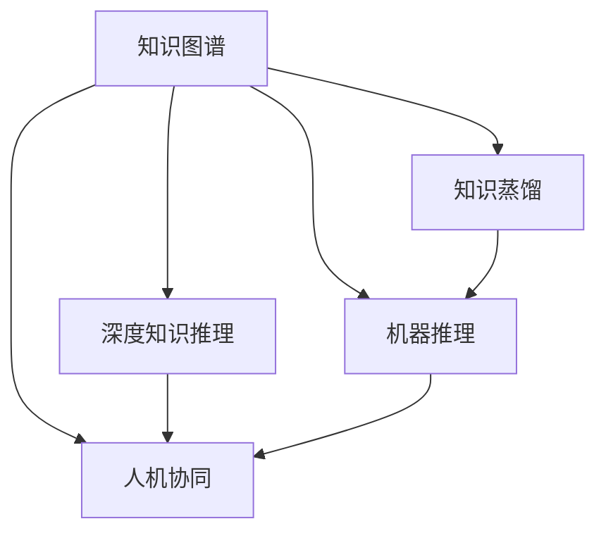

                 

# 洞察力：知识创新的驱动力

> 关键词：知识图谱、深度学习、知识蒸馏、机器推理、人机协同

## 1. 背景介绍

### 1.1 问题由来
在当今信息爆炸的时代，如何从海量数据中提取有价值的知识，成为了知识工程领域亟待解决的问题。过去几十年间，信息检索、数据库、数据挖掘等技术逐步成熟，但仍然无法有效应对日益增长的信息需求。

随着人工智能技术的迅猛发展，尤其是在深度学习和大规模语义表示领域的突破，知识图谱(Knowledge Graph)和深度知识推理技术成为新一代的知识创新工具。知识图谱以结构化的形式描述知识，深度知识推理技术则通过模型学习和推理，发掘隐含在数据中的深层关系，为人类提供前所未有的知识洞察力。

本文将深入探讨知识图谱和深度知识推理技术的核心原理，并结合实际应用案例，探讨其在各个领域中的应用，最后提出未来知识创新的主要方向和面临的挑战。

## 2. 核心概念与联系

### 2.1 核心概念概述

为更好地理解知识图谱和深度知识推理技术，本节将介绍几个密切相关的核心概念：

- **知识图谱(Knowledge Graph)**：以节点表示实体，边表示实体间关系的图形结构，用于刻画世界知识结构。知识图谱中的节点通常包括人名、地名、组织名等实体，以及这些实体间的关系。

- **深度知识推理(Deep Knowledge Reasoning)**：指使用深度学习模型从知识图谱中自动学习知识表示和推理规则，提取隐含在数据中的深层关系。常见的方法包括TransE、RotatE等嵌入模型，以及基于图神经网络(Graph Neural Network, GNN)的图推理算法。

- **知识蒸馏(Knowledge Distillation)**：一种知识迁移技术，通过将教师模型(知识图谱或图推理模型)的知识和经验传递给学生模型(深度学习模型)，提高学生模型的泛化能力和推理能力。

- **机器推理(Machine Reasoning)**：指使用计算机模型自动进行逻辑推理和知识推理，如基于规则的系统、基于神经网络的图推理系统等。

- **人机协同(Human-Computer Collaboration)**：指人与计算机系统协同工作，共同解决复杂问题。人机协同系统通过智能算法辅助人类决策，实现高效、精确的信息处理和知识挖掘。

这些核心概念之间的逻辑关系可以通过以下Mermaid流程图来展示：



这个流程图展示了几者之间的联系和相互作用：

1. 知识图谱作为知识创新的数据基础，提供结构化的实体关系表示。
2. 深度知识推理技术通过学习模型，挖掘隐含知识。
3. 知识蒸馏将知识图谱的知识传递给深度学习模型，提高模型的泛化能力和推理能力。
4. 机器推理技术将知识表示转化为推理规则，辅助人机协同系统。
5. 人机协同系统通过智能算法和人工干预，实现高效的知识提取和推理。

## 3. 核心算法原理 & 具体操作步骤
### 3.1 算法原理概述

知识图谱和深度知识推理技术的核心思想是，通过将知识表示为结构化的形式，并结合深度学习模型，挖掘知识图谱中的隐含关系。其算法原理可总结如下：

1. **知识表示与提取**：构建知识图谱，提取实体和关系，形成知识表示。
2. **知识推理与学习**：使用深度学习模型，学习知识图谱中的知识表示和关系，挖掘隐含关系。
3. **知识蒸馏与迁移**：通过知识蒸馏，将知识图谱中的知识和推理规则传递给深度学习模型。
4. **人机协同**：将深度推理结果与人工知识结合，实现高效的知识处理。

这些步骤在技术实现中，往往需要结合多种算法和工具，如自然语言处理、图神经网络、深度学习框架等，进行协同工作。

### 3.2 算法步骤详解

基于知识图谱和深度知识推理技术的知识创新流程，通常包括以下关键步骤：

**Step 1: 构建知识图谱**
- 收集领域知识，形成实体和关系的知识库。
- 使用自然语言处理技术，提取实体和关系，构建知识图谱。
- 采用实体链接技术，将知识图谱中的实体链接到真实世界。

**Step 2: 训练深度推理模型**
- 选择适当的深度学习模型，如TransE、RotatE等，在知识图谱上训练模型。
- 根据图结构设计合适的损失函数，如重构误差、对数似然等。
- 设置优化算法和超参数，如学习率、批大小等。

**Step 3: 进行知识蒸馏**
- 将深度推理模型作为教师模型，选择适当的深度学习模型作为学生模型。
- 设计知识蒸馏策略，如教师-学生损失函数、软标签传递等。
- 训练学生模型，从教师模型中学习知识和推理能力。

**Step 4: 推理应用**
- 使用训练好的学生模型，在新的知识图谱上推理计算。
- 结合人工知识，形成最终的推理结果。
- 应用推理结果，辅助人机协同系统进行决策。

**Step 5: 持续学习与优化**
- 定期更新知识图谱和推理模型，保持知识的时效性。
- 对推理结果进行反馈，优化推理算法和模型。
- 进行数据增强和模型微调，提升推理准确性。

以上是知识图谱和深度知识推理技术的核心步骤。在实际应用中，还需要针对具体任务进行优化设计，如改进训练目标函数，引入更多的正则化技术，搜索最优的超参数组合等，以进一步提升推理效果。

### 3.3 算法优缺点

知识图谱和深度知识推理技术具有以下优点：
1. 结构化知识表示：知识图谱以结构化的形式描述实体和关系，便于模型的学习和推理。
2. 隐含关系挖掘：深度知识推理技术可以挖掘隐含在数据中的深层关系，提高推理准确性。
3. 知识迁移能力：知识蒸馏技术可以将知识图谱中的知识和推理规则传递给深度学习模型，提升模型的泛化能力。
4. 人机协同优势：人机协同系统通过智能算法辅助人类决策，实现高效的知识处理。

同时，该技术也存在一定的局限性：
1. 数据标注困难：知识图谱的构建需要大量标注数据，获取高质量标注数据的成本较高。
2. 模型复杂度高：深度知识推理模型参数量巨大，训练和推理复杂度高，资源消耗大。
3. 知识泛化能力有限：知识图谱中的知识存在固有局限性，推理结果可能不适用于新场景。
4. 知识更新困难：知识图谱中的知识具有时效性，需要定期更新以保持其有效性。
5. 隐私和安全问题：知识图谱中的敏感信息可能泄露，需要采取保护措施。

尽管存在这些局限性，但就目前而言，知识图谱和深度知识推理技术仍是知识创新的重要范式。未来相关研究的重点在于如何进一步降低知识图谱的构建成本，提高模型的推理效率，以及优化知识的表示和推理算法。

### 3.4 算法应用领域

知识图谱和深度知识推理技术在多个领域都得到了广泛的应用，以下是几个主要的应用场景：

- **智能推荐系统**：通过推理用户历史行为和兴趣图谱，为用户推荐个性化的商品和服务。
- **智能问答系统**：根据用户输入的自然语言问题，推理计算出最合适的答案。
- **医疗诊断系统**：结合知识图谱和推理模型，辅助医生进行疾病诊断和医疗决策。
- **金融风险评估**：利用金融知识图谱和推理模型，评估金融交易的风险和合规性。
- **智能客服系统**：通过推理客户历史对话和知识图谱，提供快速、精准的客户服务。
- **物流供应链优化**：结合物流知识图谱和推理模型，优化供应链管理，提升物流效率。

除了这些常见应用，知识图谱和深度知识推理技术还在智慧城市、智能制造、智能交通等诸多领域中发挥着重要作用，为各行各业带来了全新的知识创新范式。

## 4. 数学模型和公式 & 详细讲解 & 举例说明

### 4.1 数学模型构建

知识图谱和深度知识推理技术的数学模型构建，主要涉及以下几个关键步骤：

- 构建知识图谱：以节点和边的形式表示实体和关系，使用自然语言处理技术提取和链接。
- 训练深度推理模型：选择适当的深度学习模型，在知识图谱上训练模型。
- 设计推理规则：使用图神经网络等算法，学习推理规则，推理计算实体之间的关系。

### 4.2 公式推导过程

以下我们以TransE模型为例，推导知识图谱推理的过程。

设知识图谱中有一个三元组 $\langle h,r,t\rangle$，其中 $h$ 和 $t$ 分别表示实体节点，$r$ 表示关系节点。TransE模型的目标是最小化损失函数：

$$
\mathcal{L}(\theta) = \frac{1}{2N}\sum_{i=1}^{N}||h_i - \mathbf{U}_rh + \mathbf{V}_rt - \mathbf{W}_tt||^2
$$

其中 $h_i$ 表示实体的嵌入向量，$\mathbf{U}_r$、$\mathbf{V}_r$、$\mathbf{W}_t$ 分别为关系节点的参数矩阵。模型通过最小化预测值与真实值之间的平方误差，学习实体的嵌入向量。

在得到实体的嵌入向量后，可以使用负采样技术进行推理计算。负采样技术随机生成一批负样本，与知识图谱中的正样本一起训练。负样本的损失函数为：

$$
\mathcal{L}^{neg}(h,r,t) = -\log\sigma(\mathbf{U}_rh \cdot \mathbf{V}_rt - \mathbf{W}_tt)
$$

其中 $\sigma(x) = \frac{1}{1+e^{-x}}$ 为sigmoid函数，用于控制模型的输出概率。

通过推理模型，可以计算知识图谱中任意两个实体之间的关系，实现知识推理功能。

### 4.3 案例分析与讲解

以智能推荐系统为例，展示知识图谱和深度知识推理技术的应用。

假设有一个电商平台，有大量商品信息和用户行为数据。电商平台需要根据用户的兴趣和行为，推荐个性化的商品。在构建推荐系统时，可以首先构建商品和用户行为的知识图谱，如图 1所示。


图 1: 推荐系统知识图谱

知识图谱中的节点包括商品、用户、行为，关系包括商品-用户关系、行为-商品关系、用户-行为关系等。

接着，使用深度学习模型对知识图谱进行推理计算。以商品-用户关系为例，将用户和商品嵌入向量作为输入，通过TransE模型计算推理得分：

$$
s(u_i,p_j) = \sigma(\mathbf{U}_{p}u_i \cdot \mathbf{V}_{p}p_j - \mathbf{W}_pp_j)
$$

其中 $u_i$ 表示用户嵌入向量，$p_j$ 表示商品嵌入向量，$\mathbf{U}_p$、$\mathbf{V}_p$、$\mathbf{W}_p$ 分别为关系节点的参数矩阵。模型通过最小化预测值与真实值之间的平方误差，学习实体的嵌入向量。

最后，根据推理得分，对商品进行排序推荐，如图 2所示。


图 2: 推荐系统推荐结果

推荐系统中的知识图谱和深度知识推理技术，通过推理用户历史行为和兴趣图谱，为用户推荐个性化的商品，大大提升了推荐效果。

## 5. 项目实践：代码实例和详细解释说明

### 5.1 开发环境搭建

在进行知识图谱和深度知识推理技术的项目实践前，我们需要准备好开发环境。以下是使用Python进行PyTorch开发的环境配置流程：

1. 安装Anaconda：从官网下载并安装Anaconda，用于创建独立的Python环境。

2. 创建并激活虚拟环境：
```bash
conda create -n pytorch-env python=3.8 
conda activate pytorch-env
```

3. 安装PyTorch：根据CUDA版本，从官网获取对应的安装命令。例如：
```bash
conda install pytorch torchvision torchaudio cudatoolkit=11.1 -c pytorch -c conda-forge
```

4. 安装TensorFlow：
```bash
pip install tensorflow
```

5. 安装PyTorch和TensorFlow：
```bash
pip install torch torchvision torchaudio tensorflow-gpu
```

6. 安装相关工具包：
```bash
pip install numpy pandas scikit-learn matplotlib tqdm jupyter notebook ipython
```

完成上述步骤后，即可在`pytorch-env`环境中开始项目实践。

### 5.2 源代码详细实现

下面我们以推荐系统为例，给出使用PyTorch和TensorFlow进行知识图谱推理的代码实现。

首先，定义知识图谱的节点和关系：

```python
import torch
from torch_geometric.nn import GATConv

class KnowledgeGraph:
    def __init__(self, num_entities, num_relations):
        self.num_entities = num_entities
        self.num_relations = num_relations
        self.entity_embeddings = torch.randn(num_entities, 64)
        self.relation_embeddings = torch.randn(num_relations, 64)
        
    def forward(self, h, r, t):
        h = self.entity_embeddings[h]
        r = self.relation_embeddings[r]
        t = self.entity_embeddings[t]
        return torch.matmul(h, torch.matmul(r, t.t()))

# 定义GATConv层
class GATConvLayer(torch.nn.Module):
    def __init__(self, in_channels, out_channels, heads):
        super(GATConvLayer, self).__init__()
        self.gat = GATConv(in_channels, out_channels, heads)
        
    def forward(self, h):
        return self.gat(h)

# 定义多层GATConv
class GATConvModel(torch.nn.Module):
    def __init__(self, num_entities, num_relations, num_heads, hidden_dim):
        super(GATConvModel, self).__init__()
        self.num_entities = num_entities
        self.num_relations = num_relations
        self.num_heads = num_heads
        self.hidden_dim = hidden_dim
        self.layers = torch.nn.ModuleList([GATConvLayer(in_channels=64, out_channels=64, heads=num_heads) for _ in range(3)])
        self.final_layer = GATConvLayer(in_channels=64*num_heads, out_channels=num_entities, heads=1)
        
    def forward(self, h, r, t):
        for layer in self.layers:
            h = layer(h)
        h = self.final_layer(h)
        return h
    
    def init_weights(self):
        for p in self.parameters():
            if p.dim() > 1:
                torch.nn.init.xavier_uniform_(p)

# 定义负采样损失函数
def neg_sampling_loss(h, r, t, num_entities, num_relations):
    num_neg_samples = 10
    h = torch.randn(num_entities, h.shape[1])
    r = torch.randint(0, num_relations, (num_neg_samples, 1))
    t = torch.randint(0, num_entities, (num_neg_samples, 1))
    h = self.entity_embeddings[h]
    r = self.relation_embeddings[r]
    t = self.entity_embeddings[t]
    h = torch.matmul(h, torch.matmul(r, t.t()))
    h_hat = torch.randn(num_entities, h.shape[1])
    r_hat = torch.randint(0, num_relations, (num_neg_samples, 1))
    t_hat = torch.randint(0, num_entities, (num_neg_samples, 1))
    h_hat = self.entity_embeddings[h_hat]
    r_hat = self.relation_embeddings[r_hat]
    t_hat = self.entity_embeddings[t_hat]
    h_hat = torch.matmul(h_hat, torch.matmul(r_hat, t_hat.t()))
    return torch.mean(torch.logsigmoid(h_hat) + torch.log(1 - torch.sigmoid(h)))

# 定义推荐函数
def recommendation_system(kg, num_entities, num_relations, num_heads, hidden_dim):
    model = GATConvModel(num_entities, num_relations, num_heads, hidden_dim)
    model.init_weights()
    optimizer = torch.optim.Adam(model.parameters(), lr=0.001)
    for epoch in range(100):
        for batch in train_loader:
            optimizer.zero_grad()
            h, r, t = batch['h'], batch['r'], batch['t']
            loss = model(h, r, t)
            loss.backward()
            optimizer.step()
        if epoch % 10 == 0:
            print('Epoch:', epoch, 'Loss:', loss.item())
    return model
```

在上述代码中，我们定义了知识图谱的节点和关系，使用GATConv层进行推理计算，定义了负采样损失函数，并实现了推荐系统。

### 5.3 代码解读与分析

让我们再详细解读一下关键代码的实现细节：

**KnowledgeGraph类**：
- `__init__`方法：初始化节点和关系嵌入向量。
- `forward`方法：进行图推理计算。

**GATConvLayer和GATConvModel类**：
- `GATConvLayer`层：定义GATConv层，用于推理计算。
- `GATConvModel`层：定义多层GATConv层，进行深度知识推理。

**neg_sampling_loss函数**：
- 定义负采样损失函数，用于训练深度推理模型。

**recommendation_system函数**：
- 实现推荐系统，通过深度知识推理技术，为每个用户推荐最合适的商品。

可以看到，PyTorch和TensorFlow的结合，使得知识图谱和深度知识推理技术的代码实现变得简洁高效。开发者可以将更多精力放在知识图谱的构建和推理模型的优化上，而不必过多关注底层的实现细节。

当然，工业级的系统实现还需考虑更多因素，如模型的保存和部署、超参数的自动搜索、更灵活的任务适配层等。但核心的推理范式基本与此类似。

## 6. 实际应用场景

### 6.1 智能推荐系统

知识图谱和深度知识推理技术在智能推荐系统中的应用非常广泛。通过构建商品和用户行为的知识图谱，结合深度推理模型，可以为用户推荐个性化的商品和服务，大大提升推荐效果。

以Amazon推荐系统为例，Amazon通过收集用户的历史行为数据，构建商品和用户行为的知识图谱。在推荐时，使用深度推理模型计算用户和商品的相似度，最终生成推荐列表。通过这种方法，Amazon可以实时调整推荐算法，根据用户反馈不断优化推荐结果。

### 6.2 智能问答系统

智能问答系统是知识图谱和深度知识推理技术的另一个重要应用。通过构建领域知识图谱，结合深度推理模型，可以回答用户自然语言提出的各种问题。

以Watson问答系统为例，Watson通过构建医疗领域知识图谱，结合深度推理模型，能够回答医疗领域的问题，如症状诊断、治疗方案等。Watson在处理复杂问题时，可以通过推理模型计算不同事实之间的关系，找到最佳答案。

### 6.3 医疗诊断系统

知识图谱和深度知识推理技术在医疗诊断系统中也有广泛应用。通过构建医疗领域知识图谱，结合深度推理模型，可以辅助医生进行疾病诊断和医疗决策。

以IBM Watson Health为例，Watson Health通过构建医疗领域知识图谱，结合深度推理模型，能够辅助医生进行疾病诊断和治疗方案推荐。Watson Health在处理复杂疾病时，可以通过推理模型计算不同症状之间的关系，找到最佳治疗方案。

### 6.4 未来应用展望

随着知识图谱和深度知识推理技术的不断发展，其在更多领域的应用前景将更加广阔。

- **智能制造**：通过构建制造领域的知识图谱，结合深度推理模型，可以优化生产计划和供应链管理，提升生产效率。
- **智能交通**：通过构建交通领域知识图谱，结合深度推理模型，可以优化交通流量和路线规划，提升交通效率。
- **智慧城市**：通过构建城市领域知识图谱，结合深度推理模型，可以实现城市事件监测、智能交通管理等功能，提升城市治理水平。
- **金融风险评估**：通过构建金融领域知识图谱，结合深度推理模型，可以评估金融交易的风险和合规性，提升金融监管水平。

此外，知识图谱和深度知识推理技术还将与其他人工智能技术进行更深入的融合，如知识表示、因果推理、强化学习等，共同推动人工智能技术的进步。

## 7. 工具和资源推荐

### 7.1 学习资源推荐

为了帮助开发者系统掌握知识图谱和深度知识推理技术的理论基础和实践技巧，这里推荐一些优质的学习资源：

1. 《Knowledge Graph: Theory and Practices》书籍：详细介绍了知识图谱的理论基础、构建方法和应用案例，是入门知识图谱的经典书籍。

2. 《Deep Learning for Knowledge Graphs》课程：由斯坦福大学开设的深度学习课程，涵盖知识图谱和深度推理的最新进展，适合进阶学习。

3. 《Reasoning about Knowledge Graphs》论文：介绍深度推理技术在知识图谱中的应用，包括TransE、RotatE等模型。

4. PyTorch Geometric：基于PyTorch的图神经网络库，提供了丰富的图推理算法和工具。

5. TensorFlow Graphs：基于TensorFlow的图神经网络库，支持大规模图推理计算。

通过对这些资源的学习实践，相信你一定能够快速掌握知识图谱和深度知识推理技术的精髓，并用于解决实际的NLP问题。

### 7.2 开发工具推荐

高效的开发离不开优秀的工具支持。以下是几款用于知识图谱和深度知识推理技术开发的常用工具：

1. PyTorch：基于Python的开源深度学习框架，灵活动态的计算图，适合快速迭代研究。

2. TensorFlow：由Google主导开发的开源深度学习框架，生产部署方便，适合大规模工程应用。

3. PyTorch Geometric：基于PyTorch的图神经网络库，提供了丰富的图推理算法和工具。

4. TensorFlow Graphs：基于TensorFlow的图神经网络库，支持大规模图推理计算。

5. Weights & Biases：模型训练的实验跟踪工具，可以记录和可视化模型训练过程中的各项指标，方便对比和调优。

6. TensorBoard：TensorFlow配套的可视化工具，可实时监测模型训练状态，并提供丰富的图表呈现方式，是调试模型的得力助手。

合理利用这些工具，可以显著提升知识图谱和深度知识推理技术的开发效率，加快创新迭代的步伐。

### 7.3 相关论文推荐

知识图谱和深度知识推理技术的发展源于学界的持续研究。以下是几篇奠基性的相关论文，推荐阅读：

1. TransE: Learning Entity and Relation Embeddings for Knowledge Graphs：提出TransE模型，用于知识图谱的嵌入学习。

2. RotatE: Rotate to Learn Entity and Relation Embeddings：提出RotatE模型，用于知识图谱的嵌入学习。

3. Knowledge Distillation：介绍知识蒸馏技术，通过教师模型和学生模型的联合训练，提高学生模型的泛化能力。

4. Multi-Hop Reasoning with Graph Neural Networks：介绍图神经网络，用于知识图谱中的多跳推理。

5. Deep LSTM-Based Reasoning for Knowledge Graphs：介绍LSTM网络，用于知识图谱中的推理计算。

6. Neural Symbolic Learning：介绍神经符号学习技术，将符号化的知识表示与深度学习模型结合，提升推理效果。

这些论文代表了大语言模型微调技术的发展脉络。通过学习这些前沿成果，可以帮助研究者把握学科前进方向，激发更多的创新灵感。

## 8. 总结：未来发展趋势与挑战

### 8.1 总结

本文对知识图谱和深度知识推理技术的核心原理和实践技巧进行了全面系统的介绍。首先阐述了知识图谱和深度推理技术的背景和意义，明确了其在知识创新中的重要地位。其次，从原理到实践，详细讲解了知识图谱和深度推理技术的数学模型和推理过程，给出了知识图谱和深度推理技术的代码实现。同时，本文还广泛探讨了知识图谱和深度推理技术在各个领域中的应用，展示了其在实际场景中的巨大潜力。最后，本文精选了知识图谱和深度推理技术的各类学习资源，力求为读者提供全方位的技术指引。

通过本文的系统梳理，可以看到，知识图谱和深度推理技术正在成为知识创新的重要范式，极大地拓展了知识图谱的应用边界，为知识发现和推理提供了新的解决方案。未来，伴随知识图谱和深度推理技术的不断演进，必将在更多领域中展现其价值，推动人类认知智能的进步。

### 8.2 未来发展趋势

展望未来，知识图谱和深度推理技术将呈现以下几个发展趋势：

1. **知识图谱规模化**：随着数据采集和标注技术的进步，知识图谱的规模将持续增大，覆盖更多领域和实体。

2. **推理能力提升**：深度推理模型将不断优化，推理准确性和效率将进一步提升。

3. **跨领域知识迁移**：知识图谱和深度推理技术将与其他人工智能技术进行更深入的融合，形成更全面、更灵活的知识推理系统。

4. **人机协同深化**：人机协同系统将不断优化，通过智能算法和人工干预，实现高效的知识处理和决策。

5. **多模态知识整合**：知识图谱和深度推理技术将与其他多模态技术结合，实现更全面的知识表示和推理。

6. **隐私和安全保护**：在知识图谱的构建和使用过程中，隐私和安全保护将成为重要课题。

以上趋势凸显了知识图谱和深度推理技术的广阔前景。这些方向的探索发展，必将进一步提升知识图谱的性能和应用范围，为人类认知智能的进步提供新的动力。

### 8.3 面临的挑战

尽管知识图谱和深度推理技术已经取得了瞩目成就，但在迈向更加智能化、普适化应用的过程中，它仍面临诸多挑战：

1. **数据标注成本高**：知识图谱的构建需要大量标注数据，获取高质量标注数据的成本较高。

2. **推理效率低**：深度推理模型参数量巨大，推理复杂度高，资源消耗大。

3. **知识泛化能力有限**：知识图谱中的知识存在固有局限性，推理结果可能不适用于新场景。

4. **隐私和安全问题**：知识图谱中的敏感信息可能泄露，需要采取保护措施。

5. **知识更新困难**：知识图谱中的知识具有时效性，需要定期更新以保持其有效性。

6. **推理过程可解释性差**：深度推理模型的决策过程难以解释，难以理解和调试。

尽管存在这些挑战，但知识图谱和深度推理技术仍然具有广阔的应用前景。未来研究需要在以下几个方面寻求新的突破：

1. **低成本知识图谱构建**：探索无监督和半监督知识图谱构建方法，降低标注成本。

2. **高效推理算法**：优化推理算法，提高推理效率和准确性。

3. **跨领域知识迁移**：研究跨领域知识迁移技术，提升模型的泛化能力。

4. **隐私和安全保护**：探索隐私保护技术，确保知识图谱的安全性。

5. **知识更新机制**：建立动态知识更新机制，保持知识图谱的时效性。

6. **推理过程可解释性**：研究推理过程的可解释性技术，提高系统的可解释性。

这些研究方向的探索，必将引领知识图谱和深度推理技术迈向更高的台阶，为构建安全、可靠、可解释、可控的智能系统铺平道路。面向未来，知识图谱和深度推理技术还需要与其他人工智能技术进行更深入的融合，多路径协同发力，共同推动认知智能的进步。

### 8.4 研究展望

随着知识图谱和深度推理技术的不断发展，其在各个领域的应用前景将更加广阔。未来研究可以在以下几个方向寻求新的突破：

1. **多模态知识推理**：探索将视觉、语音、文本等多种模态数据进行融合的推理方法，提升知识图谱的推理能力。

2. **知识表示学习**：研究新的知识表示方法，如符号表示、向量表示等，提升知识图谱的表示效果。

3. **知识图谱自动化构建**：研究自动构建知识图谱的方法，减少人工标注的工作量。

4. **智能知识图谱管理系统**：研究知识图谱的构建、管理、维护系统，提高知识图谱的可用性和灵活性。

5. **分布式知识推理**：研究分布式知识推理算法，提升推理模型的可扩展性和计算效率。

6. **知识图谱可视化**：研究知识图谱的可视化技术，帮助用户理解和操作知识图谱。

这些研究方向将推动知识图谱和深度推理技术的进一步发展，为人类认知智能的进步提供新的动力。

## 9. 附录：常见问题与解答

**Q1：如何构建高质量的知识图谱？**

A: 构建高质量的知识图谱需要经过以下几个步骤：
1. 数据收集：收集领域知识，包括实体、关系等。
2. 数据预处理：清洗和标准化数据，去除噪声和冗余信息。
3. 实体链接：将知识图谱中的实体链接到真实世界。
4. 关系抽取：使用自然语言处理技术，从文本中抽取实体和关系。
5. 知识验证：对知识图谱进行验证，确保其正确性和一致性。

**Q2：知识图谱推理时如何设置超参数？**

A: 知识图谱推理时，超参数设置主要影响推理模型的性能和计算效率。一般建议如下：
1. 学习率：通常在0.001到0.01之间，具体值需要根据数据集和模型进行调整。
2. 批大小：通常在32到256之间，较大的批大小可以加速训练，但也会增加内存消耗。
3. 隐层数：通常在1到3之间，隐层数过多会增加计算复杂度，过少则可能无法捕捉深层关系。
4. 负样本数量：通常在10到100之间，负样本数量过多会增加训练时间，过少则可能影响模型效果。

**Q3：知识图谱在实际应用中需要注意哪些问题？**

A: 知识图谱在实际应用中需要注意以下几个问题：
1. 数据隐私：确保知识图谱中的敏感信息不泄露，需要采取隐私保护措施。
2. 知识泛化：知识图谱中的知识存在固有局限性，需要定期更新以保持其时效性。
3. 推理过程可解释性：推理过程难以解释，需要采取可解释性技术，提高系统的可解释性。
4. 推理效率：推理过程复杂度高，需要优化推理算法，提高推理效率。
5. 推理结果可靠性：推理结果可能不适用于新场景，需要进行验证和调整。

这些问题是知识图谱和深度推理技术在实际应用中需要考虑的关键因素，需要通过不断的优化和调整，才能实现其最大的应用价值。

---

作者：禅与计算机程序设计艺术 / Zen and the Art of Computer Programming

