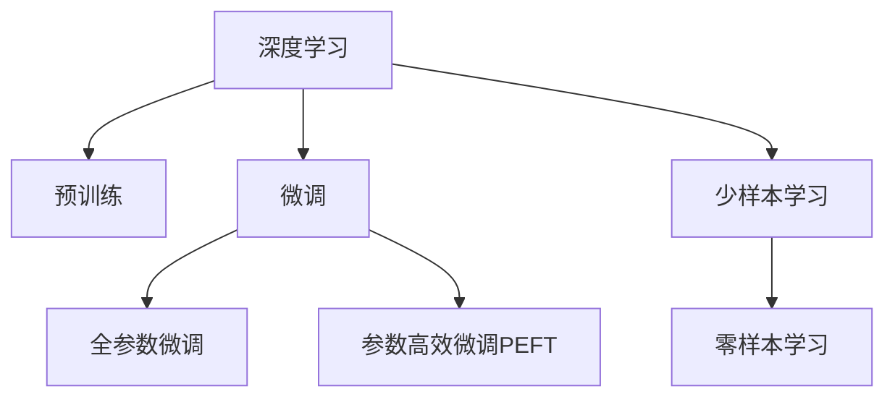

                 

# 深度学习vs广度学习：知识积累的策略

> 关键词：深度学习, 广度学习, 知识积累, 预训练, 微调, 参数高效微调, 少样本学习

## 1. 背景介绍

随着深度学习技术的发展，深度神经网络已成为处理复杂学习任务的主流技术。然而，深度学习并非万能钥匙，其需要大量标注数据和高计算资源，难以应用于数据量不足或计算资源有限的情况。广度学习(Width Learning)作为一种相对浅层的学习范式，提供了另一种知识积累和优化的策略。

深度学习和广度学习的区别主要在于模型结构上的不同。深度学习通常使用多层感知器，通过增加模型的深度(即增加隐藏层数)来提升模型的表达能力。而广度学习则通过增加模型的宽度(即增加隐藏层中的神经元数量)来提升模型的表达能力。

本文旨在探讨深度学习和广度学习在知识积累上的策略，包括预训练、微调、参数高效微调和少样本学习等方法，分析各自的优势和局限性，并提出未来发展的趋势和挑战。

## 2. 核心概念与联系

### 2.1 核心概念概述

为更好地理解深度学习和广度学习的知识积累策略，本节将介绍几个密切相关的核心概念：

- **深度学习(Deep Learning)**：使用多层神经网络进行模式识别、分类、预测等任务的技术。通过增加网络深度，使模型能够学习到复杂的特征表示。
- **广度学习(Width Learning)**：使用较浅的神经网络，但增加每层中的神经元数量，提升模型的表达能力。
- **预训练(Pre-training)**：在大规模无标签数据上训练模型，使其能够学习通用的特征表示。
- **微调(Fine-tuning)**：在预训练模型的基础上，使用下游任务的少量标注数据，通过有监督学习优化模型在特定任务上的性能。
- **参数高效微调(Parameter-Efficient Fine-tuning, PEFT)**：在微调过程中，只更新少量的模型参数，而固定大部分预训练权重不变，以提高微调效率。
- **少样本学习(Few-shot Learning)**：在只有少量标注样本的情况下，模型能够快速适应新任务的学习方法。
- **少样本学习与零样本学习**：区别在于是否存在任何标注样本，少样本学习存在少量标注数据，零样本学习则没有任何标注数据。

这些核心概念之间的逻辑关系可以通过以下Mermaid流程图来展示：



这个流程图展示了大语言模型知识积累策略的核心概念及其之间的关系：

1. 深度学习通过增加模型的深度来提升表达能力。
2. 广度学习通过增加每层中的神经元数量来提升表达能力。
3. 预训练是深度学习中常见的一种知识积累方法，通过在大规模无标签数据上训练模型。
4. 微调是在预训练模型的基础上，通过有监督学习优化模型在特定任务上的性能。
5. 参数高效微调通过只更新少量的模型参数，提升微调效率。
6. 少样本学习和零样本学习分别通过少量标注数据和没有标注数据，实现快速学习新任务的能力。

## 3. 核心算法原理 & 具体操作步骤

### 3.1 算法原理概述

深度学习和广度学习在知识积累上的策略主要有预训练和微调两种方式。以下将详细阐述这两种方法的原理和具体操作步骤。

#### 3.1.1 预训练

预训练是指在大规模无标签数据上训练模型，使其能够学习通用的特征表示。常见的预训练方法包括自编码、掩码语言模型、生成对抗网络等。

以自编码为例，其基本思想是将输入数据压缩到低维编码，再从编码中恢复出原始数据。自编码过程可以看作是从输入数据中学习到一种压缩表示，这种压缩表示可以捕捉到数据的本质特征。通过在大规模数据上预训练自编码器，可以使其学习到丰富的数据表示，这些表示可以被用于下游任务的微调。

#### 3.1.2 微调

微调是在预训练模型的基础上，使用下游任务的少量标注数据，通过有监督学习优化模型在特定任务上的性能。微调过程通常包括以下步骤：

1. 准备预训练模型和数据集。
2. 添加任务适配层，如线性分类器、解码器等。
3. 设置微调超参数，如学习率、正则化技术、批大小等。
4. 执行梯度训练，通过前向传播计算损失函数，反向传播更新模型参数。
5. 周期性在验证集上评估模型性能，根据性能指标决定是否触发Early Stopping。
6. 重复上述步骤直至满足预设的迭代轮数或Early Stopping条件。
7. 测试和部署微调后的模型。

微调的核心思想是利用预训练模型的表示能力，通过下游任务的标注数据进行有监督学习，使模型更好地适应特定任务。

### 3.2 算法步骤详解

#### 3.2.1 预训练

以BERT为例，其预训练过程如下：

1. 准备大规模无标签文本数据，通常是互联网上的各种文章、网页等。
2. 将文本数据切分为固定长度的序列，通过掩码语言模型任务进行预训练。
3. 在掩码语言模型任务中，模型需要预测被掩码的词汇，学习到上下文信息。
4. 在预训练过程中，模型需要进行多个epoch的训练，直到收敛。

#### 3.2.2 微调

以BERT为例，其微调过程如下：

1. 准备下游任务的标注数据集，划分为训练集、验证集和测试集。
2. 在BERT模型之上添加一个线性分类器，作为任务的输出层。
3. 设置微调超参数，如学习率、正则化技术、批大小等。
4. 执行梯度训练，通过前向传播计算损失函数，反向传播更新模型参数。
5. 周期性在验证集上评估模型性能，根据性能指标决定是否触发Early Stopping。
6. 重复上述步骤直至满足预设的迭代轮数或Early Stopping条件。
7. 测试和部署微调后的模型。

### 3.3 算法优缺点

深度学习和广度学习在知识积累上的策略各有优缺点：

**深度学习的优点**：
1. 表达能力强。通过增加深度，能够学习到更复杂的特征表示。
2. 模型可解释性高。深度学习的模型结构简单，易于解释和调试。
3. 已有成功案例多。深度学习在图像识别、语音识别、自然语言处理等领域取得了显著成果。

**深度学习的缺点**：
1. 数据需求量大。深度学习需要大量的标注数据才能训练出高效模型。
2. 计算资源消耗大。深度学习模型通常参数量巨大，需要高性能计算资源。
3. 过拟合风险高。深度学习模型容易过拟合，尤其是在数据量不足的情况下。

**广度学习的优点**：
1. 表达能力强。通过增加宽度，能够学习到更丰富的特征表示。
2. 模型可解释性高。广度学习的模型结构简单，易于解释和调试。
3. 数据需求量小。广度学习在数据量较少的情况下也能训练出高效模型。

**广度学习的缺点**：
1. 计算资源消耗大。广度学习模型参数量巨大，需要高性能计算资源。
2. 模型复杂度高。广度学习模型结构复杂，难以调试和优化。
3. 已有成功案例少。广度学习在深度学习领域还未被广泛应用。

### 3.4 算法应用领域

深度学习和广度学习在知识积累上的策略广泛应用于多个领域，例如：

- 计算机视觉：通过预训练自编码器或卷积神经网络，学习到图像的特征表示，再进行微调用于图像分类、物体检测等任务。
- 自然语言处理：通过预训练语言模型，学习到文本的特征表示，再进行微调用于文本分类、命名实体识别、问答等任务。
- 语音识别：通过预训练自编码器或卷积神经网络，学习到语音信号的特征表示，再进行微调用于语音识别、语音情感分析等任务。
- 推荐系统：通过预训练自编码器或矩阵分解模型，学习到用户和物品的特征表示，再进行微调用于推荐系统。
- 金融预测：通过预训练自编码器或神经网络，学习到金融数据的特征表示，再进行微调用于股票预测、风险评估等任务。

除了上述这些经典应用外，深度学习和广度学习的知识积累策略也在不断扩展，应用于更多场景中，如医疗诊断、交通监控、智能制造等，为各行各业带来了创新性的解决方案。

## 4. 数学模型和公式 & 详细讲解  
### 4.1 数学模型构建

本节将使用数学语言对深度学习和广度学习的知识积累策略进行更加严格的刻画。

设输入数据为 $x \in \mathbb{R}^d$，模型参数为 $\theta$，输出为 $y \in \mathbb{R}^k$。深度学习模型的通用形式为多层感知器，其表达式为：

$$
y = \sigma\left(W_L\sigma\left(W_{L-1}\sigma\left(\dots\sigma\left(W_1 x\right)\dots\right)\right)\right)
$$

其中 $\sigma$ 为激活函数，$W_i$ 为第 $i$ 层的权重矩阵。

广度学习模型则使用浅层神经网络，但每层中的神经元数量远大于深度学习模型。其表达式为：

$$
y = \sigma\left(W_L \sigma\left(W_{L-1} \sigma\left(\dots \sigma\left(W_1 x\right)\dots\right)\right)\right)
$$

其中 $W_i$ 为第 $i$ 层的权重矩阵，$n_i$ 为第 $i$ 层的神经元数量，$n_i > 1$。

### 4.2 公式推导过程

以BERT为例，其预训练过程的数学表达式如下：

1. 掩码语言模型：给定一个文本序列 $x=[x_1, x_2, \dots, x_n]$，预训练模型需要预测被掩码的词汇。掩码语言模型损失函数为：

$$
L = -\sum_{i=1}^n \left[ y_i \log \hat{y}_i + (1-y_i) \log (1-\hat{y}_i) \right]
$$

其中 $y_i$ 为掩码的实际词汇，$\hat{y}_i$ 为模型的预测概率。

2. 下一句预测：给定两个连续的文本序列 $x=[x_1, x_2, \dots, x_n]$ 和 $x'=[x'_1, x'_2, \dots, x'_n]$，预训练模型需要预测它们是否来自同一文本。下一句预测损失函数为：

$$
L = -\sum_{i=1}^n \log \hat{y}_i
$$

其中 $y_i$ 为下一句的实际状态，$\hat{y}_i$ 为模型的预测概率。

微调的数学表达式如下：

1. 全参数微调：在预训练模型的基础上，使用下游任务的标注数据进行微调。全参数微调的目标是最小化损失函数：

$$
\theta^* = \arg\min_{\theta} \mathcal{L}(y, M_{\theta}(x))
$$

其中 $y$ 为任务的标注数据，$M_{\theta}(x)$ 为微调后的模型输出，$\mathcal{L}$ 为任务的损失函数。

2. 参数高效微调：只更新少量的模型参数，而固定大部分预训练权重不变。参数高效微调的目标是最小化损失函数：

$$
\theta^* = \arg\min_{\theta} \mathcal{L}(y, M_{\theta}(x)) \quad \text{s.t.} \quad W_i = W_i^0, \quad i \in [1, L-1]
$$

其中 $W_i^0$ 为预训练模型的权重，$L$ 为模型的深度。

### 4.3 案例分析与讲解

以BERT为例，其微调过程的案例分析如下：

1. 准备标注数据集：收集下游任务的标注数据集，划分为训练集、验证集和测试集。
2. 添加任务适配层：在BERT模型之上添加一个线性分类器，作为任务的输出层。
3. 设置微调超参数：选择合适的学习率、正则化技术、批大小等。
4. 执行梯度训练：通过前向传播计算损失函数，反向传播更新模型参数。
5. 周期性在验证集上评估模型性能，根据性能指标决定是否触发Early Stopping。
6. 重复上述步骤直至满足预设的迭代轮数或Early Stopping条件。
7. 测试和部署微调后的模型。

以少样本学习为例，其案例分析如下：

1. 准备少量标注数据：收集下游任务的少量标注数据。
2. 设计提示模板：设计提示模板，引导模型进行少样本学习。
3. 执行少样本学习：将提示模板和少量标注数据输入模型，得到模型的预测结果。
4. 评估预测结果：评估模型的预测结果，计算其与真实标签之间的差异。
5. 迭代优化：根据评估结果，对提示模板进行优化，重复执行少样本学习。
6. 测试和部署优化后的模型。

## 5. 项目实践：代码实例和详细解释说明
### 5.1 开发环境搭建

在进行深度学习和广度学习知识积累的实践前，我们需要准备好开发环境。以下是使用Python进行PyTorch开发的环境配置流程：

1. 安装Anaconda：从官网下载并安装Anaconda，用于创建独立的Python环境。

2. 创建并激活虚拟环境：
```bash
conda create -n pytorch-env python=3.8 
conda activate pytorch-env
```

3. 安装PyTorch：根据CUDA版本，从官网获取对应的安装命令。例如：
```bash
conda install pytorch torchvision torchaudio cudatoolkit=11.1 -c pytorch -c conda-forge
```

4. 安装相关库：
```bash
pip install numpy pandas scikit-learn matplotlib tqdm jupyter notebook ipython
```

完成上述步骤后，即可在`pytorch-env`环境中开始深度学习和广度学习的知识积累实践。

### 5.2 源代码详细实现

这里以BERT为例，给出使用Transformers库对BERT模型进行微调的PyTorch代码实现。

首先，定义微调任务的训练函数：

```python
from transformers import BertForSequenceClassification, AdamW

def train_epoch(model, dataset, optimizer, batch_size):
    model.train()
    epoch_loss = 0
    for batch in dataset:
        input_ids = batch['input_ids'].to(device)
        attention_mask = batch['attention_mask'].to(device)
        labels = batch['labels'].to(device)
        model.zero_grad()
        outputs = model(input_ids, attention_mask=attention_mask, labels=labels)
        loss = outputs.loss
        epoch_loss += loss.item()
        loss.backward()
        optimizer.step()
    return epoch_loss / len(dataset)
```

然后，定义模型和优化器：

```python
from transformers import BertTokenizer
from torch.utils.data import Dataset

tokenizer = BertTokenizer.from_pretrained('bert-base-cased')
train_dataset = Dataset()
test_dataset = Dataset()

model = BertForSequenceClassification.from_pretrained('bert-base-cased', num_labels=2)
optimizer = AdamW(model.parameters(), lr=2e-5)
```

接着，定义训练和评估函数：

```python
def evaluate(model, dataset, batch_size):
    model.eval()
    preds, labels = [], []
    with torch.no_grad():
        for batch in dataset:
            input_ids = batch['input_ids'].to(device)
            attention_mask = batch['attention_mask'].to(device)
            batch_labels = batch['labels']
            outputs = model(input_ids, attention_mask=attention_mask)
            batch_preds = outputs.logits.argmax(dim=2).to('cpu').tolist()
            batch_labels = batch_labels.to('cpu').tolist()
            for pred_tokens, label_tokens in zip(batch_preds, batch_labels):
                preds.append(pred_tokens[:len(label_tokens)])
                labels.append(label_tokens)
    
    print(classification_report(labels, preds))
```

最后，启动训练流程并在测试集上评估：

```python
epochs = 5
batch_size = 16

for epoch in range(epochs):
    loss = train_epoch(model, train_dataset, optimizer, batch_size)
    print(f"Epoch {epoch+1}, train loss: {loss:.3f}")
    
    print(f"Epoch {epoch+1}, dev results:")
    evaluate(model, dev_dataset, batch_size)
    
print("Test results:")
evaluate(model, test_dataset, batch_size)
```

以上就是使用PyTorch对BERT进行微调的完整代码实现。可以看到，得益于Transformers库的强大封装，我们可以用相对简洁的代码完成BERT模型的加载和微调。

### 5.3 代码解读与分析

让我们再详细解读一下关键代码的实现细节：

**train_epoch函数**：
- 对数据集进行迭代，在每个批次上前向传播计算损失函数，反向传播更新模型参数。

**evaluate函数**：
- 对模型进行评估，在每个批次结束后将预测和标签结果存储下来，最后使用sklearn的classification_report对整个评估集的预测结果进行打印输出。

**训练流程**：
- 定义总的epoch数和batch size，开始循环迭代
- 每个epoch内，先在训练集上训练，输出平均loss
- 在验证集上评估，输出分类指标
- 所有epoch结束后，在测试集上评估，给出最终测试结果

可以看到，PyTorch配合Transformers库使得BERT微调的代码实现变得简洁高效。开发者可以将更多精力放在数据处理、模型改进等高层逻辑上，而不必过多关注底层的实现细节。

当然，工业级的系统实现还需考虑更多因素，如模型的保存和部署、超参数的自动搜索、更灵活的任务适配层等。但核心的知识积累策略基本与此类似。

## 6. 实际应用场景

深度学习和广度学习在知识积累上的策略已经被广泛应用于多个领域，例如：

### 6.1 医疗诊断

深度学习和广度学习在医疗诊断中的应用主要是通过预训练模型学习到医学数据的特征表示，再进行微调用于疾病诊断、影像识别等任务。例如，可以使用预训练的BERT模型学习到医学影像的特征表示，再进行微调用于肺结节识别、乳腺癌诊断等任务。

### 6.2 金融预测

深度学习和广度学习在金融预测中的应用主要是通过预训练模型学习到金融数据的特征表示，再进行微调用于股票预测、风险评估等任务。例如，可以使用预训练的BERT模型学习到股票市场的特征表示，再进行微调用于预测股票价格走势、评估市场风险等任务。

### 6.3 推荐系统

深度学习和广度学习在推荐系统中的应用主要是通过预训练模型学习到用户和物品的特征表示，再进行微调用于推荐系统。例如，可以使用预训练的BERT模型学习到用户和物品的特征表示，再进行微调用于推荐个性化商品、音乐、电影等任务。

### 6.4 交通监控

深度学习和广度学习在交通监控中的应用主要是通过预训练模型学习到交通数据的特征表示，再进行微调用于交通事件检测、交通流量预测等任务。例如，可以使用预训练的BERT模型学习到交通信号的特征表示，再进行微调用于交通事件检测、交通流量预测等任务。

## 7. 工具和资源推荐

### 7.1 学习资源推荐

为了帮助开发者系统掌握深度学习和广度学习的知识积累策略，这里推荐一些优质的学习资源：

1. 《深度学习》系列书籍：由斯坦福大学教授Ian Goodfellow等人编写，系统介绍了深度学习的基本概念、算法和应用。
2. 《神经网络与深度学习》课程：由DeepLearning.ai提供，介绍了神经网络和深度学习的核心原理和实现。
3. CS231n《计算机视觉基础》课程：斯坦福大学提供的计算机视觉课程，涵盖图像识别、目标检测等任务。
4. 《自然语言处理综论》书籍：由HNC、斯坦福大学教授David Jurafsky等人编写，系统介绍了自然语言处理的基本概念和算法。
5. CS224n《神经网络与深度学习》课程：斯坦福大学提供的自然语言处理课程，涵盖语言模型、序列标注等任务。

通过对这些资源的学习实践，相信你一定能够快速掌握深度学习和广度学习的知识积累策略，并用于解决实际的NLP问题。

### 7.2 开发工具推荐

高效的开发离不开优秀的工具支持。以下是几款用于深度学习和广度学习知识积累开发的常用工具：

1. PyTorch：基于Python的开源深度学习框架，灵活动态的计算图，适合快速迭代研究。大部分预训练语言模型都有PyTorch版本的实现。
2. TensorFlow：由Google主导开发的开源深度学习框架，生产部署方便，适合大规模工程应用。同样有丰富的预训练语言模型资源。
3. Transformers库：HuggingFace开发的NLP工具库，集成了众多SOTA语言模型，支持PyTorch和TensorFlow，是进行知识积累任务开发的利器。
4. Weights & Biases：模型训练的实验跟踪工具，可以记录和可视化模型训练过程中的各项指标，方便对比和调优。与主流深度学习框架无缝集成。
5. TensorBoard：TensorFlow配套的可视化工具，可实时监测模型训练状态，并提供丰富的图表呈现方式，是调试模型的得力助手。

合理利用这些工具，可以显著提升深度学习和广度学习知识积累任务的开发效率，加快创新迭代的步伐。

### 7.3 相关论文推荐

深度学习和广度学习在知识积累上的策略源于学界的持续研究。以下是几篇奠基性的相关论文，推荐阅读：

1. "A Framework for Multi-task Learning" by Caruana: 提出了多任务学习的框架，利用不同任务共享特征表示，提升模型性能。
2. "How does Deep Learning make us more intelligent?" by Goodfellow et al.: 讨论了深度学习如何使机器更智能，强调了深度学习在知识积累上的作用。
3. "Fine-tuning word embeddings in sequence tagging tasks" by Mikolov et al.: 提出了预训练词嵌入的方法，通过在大规模文本数据上预训练词嵌入，提升序列标注任务的性能。
4. "Towards Building a Knowledge Base from Free-Base Databases" by Sun et al.: 提出了基于深度学习的知识图谱构建方法，利用预训练模型学习到实体和关系之间的语义表示。
5. "Meta-Learning of Hierarchical Pre-trained Representations from Wikipedia" by Cai et al.: 提出了基于深度学习的跨领域知识表示方法，通过预训练模型学习到不同领域之间的语义关系。

这些论文代表了大语言模型知识积累策略的发展脉络。通过学习这些前沿成果，可以帮助研究者把握学科前进方向，激发更多的创新灵感。

## 8. 总结：未来发展趋势与挑战

### 8.1 总结

本文对深度学习和广度学习在知识积累上的策略进行了全面系统的介绍。首先阐述了深度学习和广度学习的区别，明确了预训练和微调在知识积累上的重要性，以及参数高效微调和少样本学习等前沿技术。其次，从原理到实践，详细讲解了深度学习和广度学习的知识积累策略，给出了知识积累任务开发的完整代码实例。同时，本文还探讨了深度学习和广度学习在多个领域的应用前景，展示了知识积累策略的广阔应用空间。最后，本文精选了深度学习和广度学习的知识积累策略的学习资源、开发工具和相关论文，力求为读者提供全方位的技术指引。

通过本文的系统梳理，可以看到，深度学习和广度学习在知识积累上的策略为NLP技术的发展提供了新思路。无论是深度学习的大规模预训练，还是广度学习的多样化表示，都在不同程度上推动了NLP技术的进步。未来，随着深度学习和广度学习的不断演进，NLP技术必将在更广阔的应用领域大放异彩。

### 8.2 未来发展趋势

展望未来，深度学习和广度学习在知识积累上的策略将呈现以下几个发展趋势：

1. 模型规模持续增大。随着算力成本的下降和数据规模的扩张，预训练语言模型的参数量还将持续增长。超大规模语言模型蕴含的丰富语言知识，有望支撑更加复杂多变的知识积累任务。

2. 知识表示更加多样。除了传统的语言表示，未来将引入更多类型的数据表示，如视觉、音频等，实现多模态的知识积累。

3. 少样本学习和零样本学习将更加普及。随着提示学习、自监督学习等技术的发展，深度学习和广度学习模型将能够在更少的标注样本下实现高效的知识积累。

4. 持续学习和增量学习成为常态。随着数据分布的不断变化，知识积累模型需要不断学习新知识以保持性能。如何在不遗忘原有知识的同时，高效吸收新知识，将成为重要的研究课题。

5. 模型可解释性将更加重要。未来知识积累模型需要具备更强的可解释性，以提高模型的可信度和可控性。

6. 跨领域知识整合能力将进一步增强。未来的知识积累模型将能够更好地整合不同领域的知识，实现更为全面和准确的语义表示。

以上趋势凸显了深度学习和广度学习在知识积累上的广阔前景。这些方向的探索发展，必将进一步提升知识积累模型的性能和应用范围，为NLP技术的发展注入新的动力。

### 8.3 面临的挑战

尽管深度学习和广度学习在知识积累上的策略已经取得了显著成果，但在迈向更加智能化、普适化应用的过程中，仍面临诸多挑战：

1. 标注成本瓶颈。尽管微调和少样本学习降低了对标注数据的需求，但对于特定领域的应用，获取高质量标注数据仍是一大难题。

2. 模型鲁棒性不足。当前知识积累模型面对域外数据时，泛化性能往往大打折扣。如何提高模型的鲁棒性，避免灾难性遗忘，还需要更多理论和实践的积累。

3. 计算资源消耗大。超大规模知识积累模型需要高性能计算资源，对于某些应用场景可能难以负担。

4. 模型可解释性不足。现有的知识积累模型通常缺乏可解释性，难以解释其内部工作机制和决策逻辑。

5. 安全性有待保障。知识积累模型可能学习到有害信息，甚至被用于恶意用途。如何从数据和算法层面消除模型偏见，确保输出安全性，也将是重要的研究课题。

6. 知识整合能力不足。现有的知识积累模型往往局限于任务内数据，难以灵活吸收和运用更广泛的先验知识。

正视知识积累面临的这些挑战，积极应对并寻求突破，将是大语言模型知识积累策略走向成熟的必由之路。相信随着学界和产业界的共同努力，这些挑战终将一一被克服，知识积累策略必将在构建人机协同的智能系统上发挥重要作用。

### 8.4 研究展望

面对知识积累策略面临的挑战，未来的研究需要在以下几个方面寻求新的突破：

1. 探索无监督和半监督知识积累方法。摆脱对大规模标注数据的依赖，利用自监督学习、主动学习等无监督和半监督范式，最大限度利用非结构化数据，实现更加灵活高效的知识积累。

2. 研究参数高效和计算高效的微调范式。开发更加参数高效的微调方法，在固定大部分预训练参数的同时，只更新极少量的任务相关参数。同时优化知识积累模型的计算图，减少前向传播和反向传播的资源消耗，实现更加轻量级、实时性的部署。

3. 融合因果和对比学习范式。通过引入因果推断和对比学习思想，增强知识积累模型建立稳定因果关系的能力，学习更加普适、鲁棒的语言表征，从而提升模型泛化性和抗干扰能力。

4. 引入更多先验知识。将符号化的先验知识，如知识图谱、逻辑规则等，与神经网络模型进行巧妙融合，引导知识积累过程学习更准确、合理的语言模型。同时加强不同模态数据的整合，实现视觉、语音等多模态信息与文本信息的协同建模。

5. 结合因果分析和博弈论工具。将因果分析方法引入知识积累模型，识别出模型决策的关键特征，增强输出解释的因果性和逻辑性。借助博弈论工具刻画人机交互过程，主动探索并规避模型的脆弱点，提高系统稳定性。

6. 纳入伦理道德约束。在知识积累目标中引入伦理导向的评估指标，过滤和惩罚有害的输出倾向。加强人工干预和审核，建立模型行为的监管机制，确保输出符合人类价值观和伦理道德。

这些研究方向的探索，必将引领深度学习和广度学习在知识积累上的新突破，为构建安全、可靠、可解释、可控的智能系统铺平道路。面向未来，知识积累策略还需要与其他人工智能技术进行更深入的融合，如知识表示、因果推理、强化学习等，多路径协同发力，共同推动人工智能技术的发展。只有勇于创新、敢于突破，才能不断拓展知识积累策略的边界，让智能技术更好地造福人类社会。

## 9. 附录：常见问题与解答

**Q1：深度学习和广度学习在知识积累上有何区别？**

A: 深度学习和广度学习在知识积累上的区别主要在于模型结构上的不同。深度学习通过增加模型的深度，学习到更复杂的特征表示，而广度学习则通过增加每层中的神经元数量，学习到更丰富的特征表示。深度学习需要大量的标注数据和计算资源，而广度学习则相对浅层，对标注数据的需求较小。

**Q2：深度学习和广度学习在实际应用中有何优缺点？**

A: 深度学习的优点在于表达能力强，模型可解释性高，已有成功案例多。其缺点在于数据需求量大，计算资源消耗大，容易过拟合。广度学习的优点在于表达能力强，模型可解释性高，数据需求量小。其缺点在于计算资源消耗大，模型复杂度高，已有成功案例少。

**Q3：如何进行参数高效微调？**

A: 参数高效微调通过只更新少量的模型参数，固定大部分预训练权重不变，以提高微调效率。例如，使用适配器(Adapters)技术，只更新微调任务相关的层，而不影响预训练模型的其他部分。

**Q4：如何进行少样本学习？**

A: 少样本学习通过设计提示模板(Prompts)，引导模型进行少样本学习。例如，使用基于模板的零样本学习，通过向模型输入少量示例，指导模型学习新任务。

**Q5：如何提高知识积累模型的鲁棒性？**

A: 提高知识积累模型的鲁棒性可以通过以下方法：
1. 数据增强：通过回译、近义替换等方式扩充训练集。
2. 正则化：使用L2正则、Dropout等技术防止模型过拟合。
3. 对抗训练：引入对抗样本，提高模型鲁棒性。
4. 自监督学习：利用数据的有标签和无标签信息，提升模型泛化能力。

这些方法可以结合使用，以提高知识积累模型的鲁棒性和泛化性能。

**Q6：如何提高知识积累模型的可解释性？**

A: 提高知识积累模型的可解释性可以通过以下方法：
1. 特征可视化：通过可视化模型的特征表示，理解模型内部工作机制。
2. 规则约束：引入符号化的先验知识，如知识图谱、逻辑规则等，指导模型学习。
3. 因果分析：通过因果分析方法，识别模型决策的关键特征，提高模型可解释性。

这些方法可以结合使用，以提高知识积累模型的可解释性和可信度。

---

作者：禅与计算机程序设计艺术 / Zen and the Art of Computer Programming

