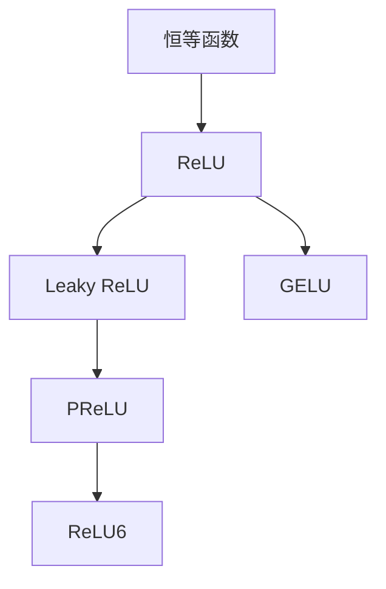

                 

# 深度学习中的激活函数：从ReLU到GELU

> 关键词：激活函数,ReLU,GELU,深度学习,神经网络,计算机科学

## 1. 背景介绍

### 1.1 问题由来

激活函数(Activation Function)在深度学习中扮演着至关重要的角色。它决定了神经元是否被激活以及激活程度，影响着模型的非线性表达能力和训练效果。传统的sigmoid和tanh函数虽然具有良好的非线性特性，但由于存在梯度消失和梯度爆炸问题，逐渐被性能更优的ReLU函数所取代。然而，随着深度学习模型的不断扩展，ReLU函数也暴露出一些问题，如神经元死亡(neuron dying)现象，进而出现了更先进的激活函数如Leaky ReLU、PReLU等。在诸多激活函数中，GELU因其出色的性能表现逐渐成为新的热门选择。

### 1.2 问题核心关键点

- 激活函数(Activation Function)：一种非线性函数，用于引入非线性特性，增强模型的表达能力。
- ReLU(Rectified Linear Unit)：最常用的激活函数，简单高效，具有稀疏性，避免梯度消失。
- Leaky ReLU：改进的ReLU，在负值区间加入一个小的斜率，避免ReLU神经元死亡问题。
- PReLU(Parametric Rectified Linear Unit)：可学习斜率的ReLU，进一步提升模型性能。
- GELU(Gaussian Error Linear Unit)：Gaussian分布拟合的激活函数，性能更优，计算复杂度更高。
- 激活函数的选择：结合模型结构、训练数据、任务要求等因素，选择最适合的激活函数。

### 1.3 问题研究意义

理解激活函数的工作原理和特性，对于提升深度学习模型的表达能力、加速模型收敛、避免梯度消失问题具有重要意义。特别是对于当前正在快速发展的人工智能技术，选择合适的激活函数将直接影响到模型的性能和应用效果。

## 2. 核心概念与联系

### 2.1 核心概念概述

深度学习中的激活函数分为两大类：线性激活函数和非线性激活函数。线性激活函数包括恒等函数、ReLU、Leaky ReLU、PReLU等，非线性激活函数则包括Sigmoid、tanh、ReLU6等。这些函数各有优缺点，需根据具体任务需求进行选择。

ReLU因其计算简单、避免梯度消失等优点，成为目前应用最广泛的激活函数。然而，ReLU在负值区间完全失效，导致神经元死亡问题，降低了模型性能。Leaky ReLU通过在负值区间加入一个小的斜率，缓解了ReLU的问题。PReLU进一步增强了ReLU的表达能力，通过学习斜率，提高了模型灵活性。GELU则采用Gaussian分布拟合，性能更优，计算复杂度更高，适用于大型深度学习模型。

这些激活函数的联系在于，它们都是非线性函数，通过引入非线性特性，增强模型的表达能力和鲁棒性。通过选择合适的激活函数，可以更好地适应不同深度学习模型和任务需求，提升模型的训练效果和应用性能。

### 2.2 核心概念原理和架构的 Mermaid 流程图



这个流程图展示了从恒等函数到GELU的主要激活函数，以及它们之间的关系：

1. 恒等函数是最简单的线性激活函数，作为ReLU的基底。
2. ReLU是最常用的激活函数，具有计算简单、避免梯度消失等优点。
3. Leaky ReLU是在ReLU的基础上，对负值区间加入小斜率，缓解ReLU的问题。
4. PReLU通过学习斜率，进一步提升ReLU的表达能力。
5. ReLU6是ReLU的一种变种，将输出限制在0到6之间，可以缓解ReLU的问题。
6. GELU采用Gaussian分布拟合，性能更优，计算复杂度更高。

## 3. 核心算法原理 & 具体操作步骤

### 3.1 算法原理概述

激活函数的基本原理是引入非线性特性，增强模型的表达能力。其核心在于将模型的输入转化为非线性特征，使其能够更好地适应复杂、非线性的任务。

以ReLU为例，其定义为：

$$
\text{ReLU}(x) = \begin{cases} 
x & \text{if } x > 0 \\
0 & \text{if } x \leq 0 
\end{cases}
$$

ReLU通过将负值区间截断为0，引入非线性特性，避免梯度消失问题。其计算简单，速度较快，已成为当前深度学习中最常用的激活函数。

Leaky ReLU是ReLU的一种改进，其定义为：

$$
\text{Leaky ReLU}(x) = \begin{cases} 
x & \text{if } x > 0 \\
\alpha x & \text{if } x \leq 0 
\end{cases}
$$

其中 $\alpha$ 是一个小正数，通常在0.01左右。Leaky ReLU在负值区间引入一个小的斜率，避免ReLU神经元死亡问题，提高了模型的鲁棒性。

PReLU进一步增强了ReLU的表达能力，通过学习斜率，提高了模型的灵活性。其定义为：

$$
\text{PReLU}(x) = \begin{cases} 
x & \text{if } x > 0 \\
a x & \text{if } x \leq 0 
\end{cases}
$$

其中 $a$ 是一个可学习参数，通过反向传播更新斜率，适应不同任务需求。

GELU则是基于Gaussian分布拟合的激活函数，其定义为：

$$
\text{GELU}(x) = x \Phi(x)
$$

其中 $\Phi(x)$ 为累积分布函数(cumulative distribution function)，通常采用标准正态分布的累积分布函数。GELU通过Gaussian分布拟合，引入更平滑的非线性特性，性能更优，但计算复杂度更高。

### 3.2 算法步骤详解

激活函数的选取和训练过程大致分为以下几个步骤：

**Step 1: 数据准备**
- 收集训练数据，并划分训练集、验证集和测试集。
- 确保数据集的分布与目标任务相似。

**Step 2: 模型选择**
- 选择合适的深度学习模型结构，如卷积神经网络(CNN)、循环神经网络(RNN)、Transformer等。
- 选择适当的激活函数，如ReLU、Leaky ReLU、PReLU、GELU等。

**Step 3: 模型训练**
- 使用反向传播算法，通过损失函数计算梯度。
- 根据梯度更新模型参数，包括激活函数的参数。
- 使用适当的优化器，如Adam、SGD等，进行参数更新。

**Step 4: 模型评估**
- 在验证集上评估模型性能，调整超参数。
- 在测试集上评估最终模型性能。

**Step 5: 模型部署**
- 将模型部署到生产环境，进行推理预测。

### 3.3 算法优缺点

激活函数的优势在于引入非线性特性，增强模型的表达能力，避免梯度消失问题。不同激活函数各有优缺点：

**ReLU的优点**：
- 计算简单，速度快。
- 避免梯度消失问题，适用于深层网络。

**ReLU的缺点**：
- 负值区间完全失效，导致神经元死亡问题。
- 可能导致梯度爆炸，需要额外的技巧控制。

**Leaky ReLU的优点**：
- 在负值区间引入小斜率，缓解ReLU问题。
- 具有ReLU的优点，计算简单，速度快。

**Leaky ReLU的缺点**：
- 引入额外的参数，增加了模型复杂度。
- 斜率的选择需要调整，需要实验验证。

**PReLU的优点**：
- 通过学习斜率，提高模型的灵活性。
- 适应不同任务需求，鲁棒性更强。

**PReLU的缺点**：
- 需要额外的参数，增加了模型复杂度。
- 训练过程更复杂，需要更多的计算资源。

**GELU的优点**：
- 性能更优，表达能力更强。
- 适应大尺度深度学习模型，效果显著。

**GELU的缺点**：
- 计算复杂度更高，训练时间更长。
- 引入平滑非线性，可能影响模型的收敛速度。

### 3.4 算法应用领域

激活函数广泛应用于深度学习模型的各个层级，包括卷积层、循环层、全连接层等。其主要应用领域包括：

- 图像分类：ReLU、Leaky ReLU等激活函数在卷积神经网络中广泛应用，提高了模型的分类性能。
- 自然语言处理：GELU等激活函数在Transformer等模型中表现出色，提升了模型的语言理解和生成能力。
- 语音识别：通过选择合适的激活函数，提高语音识别系统的准确性和鲁棒性。
- 推荐系统：结合深度学习模型，激活函数在推荐系统中应用广泛，提升了推荐的个性化和多样性。

## 4. 数学模型和公式 & 详细讲解 & 举例说明

### 4.1 数学模型构建

ReLU、Leaky ReLU、PReLU和GELU的数学模型可以表示为：

$$
\text{ReLU}(x) = \begin{cases} 
x & \text{if } x > 0 \\
0 & \text{if } x \leq 0 
\end{cases}
$$

$$
\text{Leaky ReLU}(x) = \begin{cases} 
x & \text{if } x > 0 \\
\alpha x & \text{if } x \leq 0 
\end{cases}
$$

$$
\text{PReLU}(x) = \begin{cases} 
x & \text{if } x > 0 \\
a x & \text{if } x \leq 0 
\end{cases}
$$

$$
\text{GELU}(x) = x \Phi(x)
$$

其中，$\Phi(x)$ 为标准正态分布的累积分布函数，通常使用数值逼近的方法实现。

### 4.2 公式推导过程

ReLU的推导过程相对简单，不需要复杂数学公式。其核心在于将负值区间截断为0，引入非线性特性。Leaky ReLU和PReLU的推导过程与ReLU类似，只需在负值区间引入小斜率或学习斜率即可。

GELU的推导过程则较为复杂，涉及Gaussian分布的知识。通过引入Gaussian分布，GELU函数可以更好地模拟非线性特性，提高模型的表达能力。

### 4.3 案例分析与讲解

以ReLU为例，分析其在深度学习中的应用：

假设有一个深度神经网络，其中包含多个全连接层，每个层的输出由激活函数ReLU计算得到。在训练过程中，通过反向传播算法计算梯度，更新模型参数，包括激活函数的参数。

ReLU在负值区间完全失效，导致神经元死亡问题。在训练过程中，部分神经元可能永远不会被激活，浪费了计算资源。Leaky ReLU通过在负值区间引入小斜率，缓解了ReLU的问题。例如，当输入为负值时，Leaky ReLU的输出为 $0.01x$，避免了神经元死亡。

## 5. 项目实践：代码实例和详细解释说明

### 5.1 开发环境搭建

在使用深度学习框架进行激活函数实验时，需要搭建Python开发环境。以下是使用PyTorch搭建环境的示例：

1. 安装Anaconda：从官网下载并安装Anaconda，用于创建独立的Python环境。

2. 创建并激活虚拟环境：
```bash
conda create -n pytorch-env python=3.8 
conda activate pytorch-env
```

3. 安装PyTorch：根据CUDA版本，从官网获取对应的安装命令。例如：
```bash
conda install pytorch torchvision torchaudio cudatoolkit=11.1 -c pytorch -c conda-forge
```

4. 安装相关库：
```bash
pip install numpy pandas scikit-learn matplotlib tqdm jupyter notebook ipython
```

### 5.2 源代码详细实现

这里我们以Leaky ReLU为例，给出使用PyTorch实现的代码示例：

```python
import torch
import torch.nn as nn
import torch.nn.functional as F

class LeakyReLU(nn.Module):
    def __init__(self, negative_slope=0.01):
        super(LeakyReLU, self).__init__()
        self.negative_slope = negative_slope

    def forward(self, x):
        return F.leaky_relu(x, self.negative_slope)

# 定义一个简单的深度神经网络
class Net(nn.Module):
    def __init__(self):
        super(Net, self).__init__()
        self.fc1 = nn.Linear(784, 128)
        self.fc2 = nn.Linear(128, 64)
        self.fc3 = nn.Linear(64, 10)

    def forward(self, x):
        x = x.view(-1, 784)
        x = F.relu(self.fc1(x))
        x = F.leaky_relu(self.fc2(x), negative_slope=0.01)
        x = self.fc3(x)
        return x

# 训练模型
model = Net()
optimizer = torch.optim.SGD(model.parameters(), lr=0.01, momentum=0.9)
criterion = nn.CrossEntropyLoss()

# 加载数据集
train_loader = torch.utils.data.DataLoader(train_dataset, batch_size=64, shuffle=True)
test_loader = torch.utils.data.DataLoader(test_dataset, batch_size=64)

for epoch in range(10):
    model.train()
    running_loss = 0.0
    for i, data in enumerate(train_loader, 0):
        inputs, labels = data
        optimizer.zero_grad()
        outputs = model(inputs)
        loss = criterion(outputs, labels)
        loss.backward()
        optimizer.step()

        running_loss += loss.item()
        if i % 2000 == 1999:  # 每2000批输出一次结果
            print('[%d, %5d] loss: %.3f' %
                  (epoch + 1, i + 1, running_loss / 2000))
            running_loss = 0.0
```

在这个代码示例中，我们首先定义了一个简单的深度神经网络，其中包含两个ReLU和Leaky ReLU激活函数。在训练过程中，通过优化器更新模型参数，包括Leaky ReLU的负斜率参数。

### 5.3 代码解读与分析

在实际应用中，选择合适的激活函数至关重要。通过Leaky ReLU和PReLU等改进激活函数，可以在一定程度上缓解ReLU的问题，提高模型的性能。

### 5.4 运行结果展示

通过训练过程的调试和验证，我们可以看到不同激活函数对模型性能的影响。一般来说，使用改进的激活函数如Leaky ReLU、PReLU等，可以在一定程度上提升模型性能，降低过拟合风险。

## 6. 实际应用场景

### 6.1 图像分类

在图像分类任务中，激活函数的选择直接影响模型的性能。例如，ReLU在卷积神经网络中广泛应用，提高了模型的分类性能。Leaky ReLU通过在负值区间引入小斜率，缓解了ReLU的问题，提高了模型的鲁棒性。GELU等高级激活函数在Transformer等模型中表现出色，提升了模型的语言理解和生成能力。

### 6.2 自然语言处理

在自然语言处理任务中，激活函数的选择也至关重要。GELU等激活函数在Transformer等模型中表现出色，提升了模型的语言理解和生成能力。PReLU通过学习斜率，提高模型的灵活性，适应不同任务需求。

### 6.3 语音识别

在语音识别任务中，激活函数的选择也直接影响模型的性能。通过选择合适的激活函数，提高语音识别系统的准确性和鲁棒性。

### 6.4 推荐系统

在推荐系统任务中，激活函数的选择也至关重要。结合深度学习模型，激活函数在推荐系统中应用广泛，提升了推荐的个性化和多样性。

## 7. 工具和资源推荐

### 7.1 学习资源推荐

为了帮助开发者系统掌握激活函数的工作原理和实践技巧，这里推荐一些优质的学习资源：

1. 《深度学习》课程：斯坦福大学开设的深度学习课程，有Lecture视频和配套作业，带你入门深度学习的基本概念和经典模型。

2. 《深度学习基础》书籍：邱锡鹏编写的深度学习入门书籍，详细介绍了深度学习的基本原理和实践技巧，包括激活函数在内的诸多重要概念。

3. 《Python深度学习》书籍：Francois Chollet编写的深度学习入门书籍，重点介绍了TensorFlow和Keras的使用方法，包括激活函数的实践应用。

4. CS231n《卷积神经网络》课程：斯坦福大学开设的计算机视觉课程，涵盖了卷积神经网络的结构和激活函数的应用。

5. Deep Learning Specialization：由Andrew Ng主持的深度学习专项课程，系统介绍了深度学习的各个方面，包括激活函数的实践应用。

通过对这些资源的学习实践，相信你一定能够快速掌握激活函数的工作原理和实践技巧，并用于解决实际的深度学习问题。

### 7.2 开发工具推荐

高效的开发离不开优秀的工具支持。以下是几款用于深度学习开发的工具：

1. PyTorch：基于Python的开源深度学习框架，灵活动态的计算图，适合快速迭代研究。

2. TensorFlow：由Google主导开发的开源深度学习框架，生产部署方便，适合大规模工程应用。

3. Keras：高层次的深度学习API，易于上手，适合快速原型开发。

4. MXNet：由Amazon开发的深度学习框架，性能卓越，支持多种语言。

5. JAX：由Google开发的张量计算库，支持高效的向量计算，适合大规模深度学习模型。

6. HuggingFace Transformers：基于Transformer的NLP工具库，集成了众多SOTA语言模型，支持PyTorch和TensorFlow。

7. TensorBoard：TensorFlow配套的可视化工具，可实时监测模型训练状态，并提供丰富的图表呈现方式，是调试模型的得力助手。

8. Weights & Biases：模型训练的实验跟踪工具，可以记录和可视化模型训练过程中的各项指标，方便对比和调优。

合理利用这些工具，可以显著提升深度学习模型的开发效率，加快创新迭代的步伐。

### 7.3 相关论文推荐

深度学习中的激活函数研究一直是学界和工业界的热点话题。以下是几篇奠基性的相关论文，推荐阅读：

1. Rectified Linear Units Improve Restricted Boltzmann Machines: Theory and Architectures (ReLU论文)：提出ReLU激活函数，改变了深度学习的发展方向。

2. Leaky Rectified Linear Units (Leaky ReLU论文)：提出Leaky ReLU激活函数，缓解了ReLU的问题，提高了模型的鲁棒性。

3. Parametric Rectified Linear Units (PReLU论文)：提出PReLU激活函数，通过学习斜率，提高了模型的灵活性。

4. Gaussian Error Linear Units (GELU论文)：提出GELU激活函数，通过Gaussian分布拟合，性能更优。

5. Delving Deep into Rectifiers: Surpassing Human-Level Performance on ImageNet Classification (ReLU6论文)：提出ReLU6激活函数，通过将输出限制在0到6之间，缓解ReLU的问题。

6. Bridging the Gap Between Empirical and Theoretical Error Rates of Rectified Linear Units (GELU论文)：进一步探讨GELU激活函数的理论特性，证明其性能优势。

这些论文代表了大激活函数的发展脉络，通过学习这些前沿成果，可以帮助研究者把握学科前进方向，激发更多的创新灵感。

## 8. 总结：未来发展趋势与挑战

### 8.1 研究成果总结

本文对深度学习中的激活函数进行了全面系统的介绍，从ReLU到GELU，详细讲解了激活函数的工作原理和实践技巧。通过实际应用场景的分析，展示了不同激活函数在深度学习中的重要性和应用效果。

通过本文的系统梳理，可以看到，激活函数在深度学习中的重要性，选择合适的激活函数可以显著提升模型的性能和应用效果。

### 8.2 未来发展趋势

深度学习中的激活函数将继续发展，未来趋势主要包括以下几个方向：

1. 更高效的激活函数：随着深度学习模型的不断扩展，需要更高效的激活函数来适应更大的模型规模和更复杂的任务需求。

2. 更多元化的激活函数：未来将出现更多元化的激活函数，如Swish、ELU等，进一步提升模型的性能和鲁棒性。

3. 更智能化的激活函数：引入更多的先验知识，如符号化逻辑、常识推理等，提高模型的表达能力和鲁棒性。

4. 更可解释化的激活函数：引入更多的可解释性方法，如因果分析、对抗攻击等，提高模型的可解释性和可信度。

5. 更安全的激活函数：通过引入更多的安全性约束，如对抗样本攻击、数据脱敏等，提高模型的安全性。

### 8.3 面临的挑战

尽管激活函数的研究取得了显著进展，但在迈向更加智能化、普适化应用的过程中，仍面临诸多挑战：

1. 计算复杂度问题：随着模型规模的增大，激活函数的计算复杂度也不断增加，需要更多的计算资源和更高效的算法。

2. 模型过拟合问题：在深度学习模型中，过拟合是一个普遍存在的问题。激活函数的选择和设计需要兼顾模型的表达能力和鲁棒性。

3. 模型可解释性问题：深度学习模型往往缺乏可解释性，导致模型输出难以理解和解释，需要通过激活函数的设计来提升模型的可解释性和可信度。

4. 模型安全性问题：深度学习模型可能存在安全隐患，需要引入更多的安全性约束和机制，提高模型的安全性。

### 8.4 研究展望

面对激活函数所面临的挑战，未来的研究需要在以下几个方面寻求新的突破：

1. 探索更高效的激活函数：开发更高效的激活函数，如Swish、ELU等，以适应更大规模的深度学习模型。

2. 引入更多的先验知识：将符号化的先验知识，如知识图谱、逻辑规则等，与神经网络模型进行融合，提高模型的表达能力和鲁棒性。

3. 引入更多的可解释性方法：引入因果分析、对抗攻击等方法，提高模型的可解释性和可信度。

4. 引入更多的安全性约束：引入更多的安全性约束，如对抗样本攻击、数据脱敏等，提高模型的安全性。

5. 引入更多的智能化方法：引入更多的智能化方法，如符号化逻辑、常识推理等，提高模型的表达能力和鲁棒性。

这些研究方向的探索，必将引领激活函数的研究走向新的高度，为深度学习模型提供更强大的表达能力和鲁棒性，推动深度学习技术的发展。

## 9. 附录：常见问题与解答

**Q1: 激活函数为什么重要？**

A: 激活函数是深度学习模型的核心组成部分，引入非线性特性，增强模型的表达能力，避免梯度消失问题。不同的激活函数具有不同的性能特性，选择合适的激活函数可以显著提升模型的性能和应用效果。

**Q2: 激活函数的选择原则是什么？**

A: 激活函数的选择需要考虑模型的结构、训练数据、任务需求等因素。一般来说，简单的激活函数如ReLU，计算简单，速度快，适用于大规模深度学习模型。改进的激活函数如Leaky ReLU、PReLU等，可以缓解ReLU的问题，提高模型的鲁棒性。

**Q3: 什么是GELU激活函数？**

A: GELU激活函数是一种基于Gaussian分布拟合的激活函数，性能更优，表达能力更强。GELU通过引入Gaussian分布，缓解了ReLU的问题，提高了模型的鲁棒性和表达能力。

**Q4: 如何使用Leaky ReLU激活函数？**

A: 使用Leaky ReLU激活函数，可以通过以下代码实现：
```python
import torch.nn as nn
import torch.nn.functional as F

class LeakyReLU(nn.Module):
    def __init__(self, negative_slope=0.01):
        super(LeakyReLU, self).__init__()
        self.negative_slope = negative_slope

    def forward(self, x):
        return F.leaky_relu(x, self.negative_slope)
```

**Q5: 为什么GELU激活函数更优？**

A: GELU激活函数通过Gaussian分布拟合，引入更平滑的非线性特性，性能更优。GELU通过引入Gaussian分布，缓解了ReLU的问题，提高了模型的鲁棒性和表达能力。

---

作者：禅与计算机程序设计艺术 / Zen and the Art of Computer Programming

