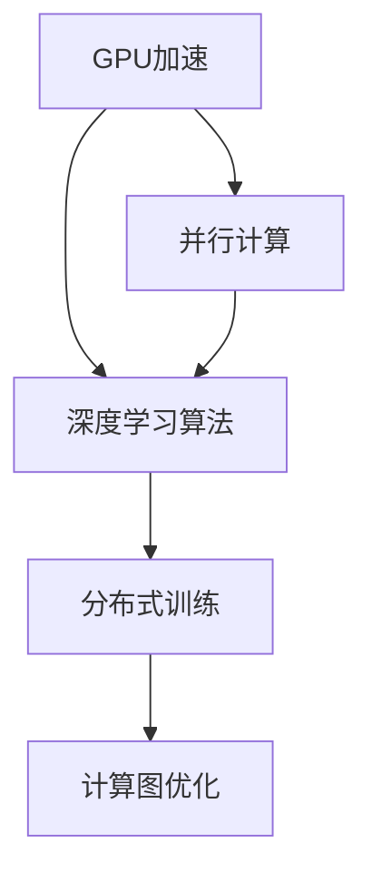

                 

# 深度学习加速：GPU和TPU的使用

> 关键词：GPU加速, TPU加速, 深度学习, 并行计算, 硬件加速, 优化算法

## 1. 背景介绍

### 1.1 问题由来
随着深度学习技术的快速发展，深度神经网络(DNN)在计算机视觉、自然语言处理(NLP)、语音识别等诸多领域取得了令人瞩目的成果。然而，由于深度神经网络计算密集的特性，在大规模数据上的训练和推理往往需要耗费大量的时间和计算资源。为了提升深度学习模型的训练效率和性能，GPU和TPU等高性能计算硬件应运而生。

### 1.2 问题核心关键点
在深度学习加速过程中，GPU和TPU硬件的使用是一个重要环节。GPU和TPU通过并行计算和硬件加速，大幅提升了模型训练和推理的效率。但同时，选择合适的硬件设备、优化算法和参数配置，也需要开发者具备一定的硬件和算法知识。

本文聚焦于GPU和TPU在深度学习加速中的应用，将详细介绍两者的工作原理、优势与劣势，并给出具体的开发环境和实例，帮助开发者更高效地进行深度学习开发。

## 2. 核心概念与联系

### 2.1 核心概念概述

为了更好地理解GPU和TPU在深度学习加速中的应用，本节将介绍几个密切相关的核心概念：

- **GPU（Graphics Processing Unit）加速**：基于NVIDIA的CUDA并行计算架构，GPU可以高效地处理向量、矩阵等大规模数据，被广泛应用于深度学习模型的训练和推理。
- **TPU（Tensor Processing Unit）加速**：由Google设计，专门用于加速张量运算，具有更高的并行度和更低的能耗，是目前最先进的深度学习加速硬件。
- **深度学习算法**：如卷积神经网络(CNN)、循环神经网络(RNN)、变换器(Transformer)等，是深度学习的基础算法。
- **并行计算**：通过将计算任务分解成多个子任务，并行计算可以显著提高计算效率。
- **计算图优化**：将计算任务映射为计算图，通过图优化工具和算法，提升计算效率。
- **分布式训练**：将计算任务分布到多台计算设备上，通过网络通信和协同计算，加速训练过程。

这些核心概念之间的逻辑关系可以通过以下Mermaid流程图来展示：



这个流程图展示了大语言模型的核心概念及其之间的关系：

1. GPU和TPU通过并行计算能力，加速深度学习算法的执行。
2. 深度学习算法如卷积神经网络、循环神经网络、变换器等，是GPU和TPU的主要应用场景。
3. 分布式训练通过多台计算设备并行处理，可以进一步提升训练速度。
4. 计算图优化通过图优化算法，减少不必要的计算，提升计算效率。

## 3. 核心算法原理 & 具体操作步骤
### 3.1 算法原理概述

GPU和TPU在深度学习加速中的应用，主要是基于它们的并行计算能力和硬件加速特性。具体来说，GPU和TPU通过以下方式实现加速：

1. **并行计算**：GPU和TPU能够同时处理大量数据，这使得深度学习中的大规模矩阵计算和向量操作能够高效地进行。GPU通常采用基于CUDA的并行计算架构，而TPU则利用TensorFlow的Eager Execution机制进行高效的张量运算。

2. **硬件加速**：GPU和TPU通过专门的硬件设计，提升了特定计算任务的执行效率。例如，TPU在矩阵乘法和卷积操作上的性能远超普通CPU。

3. **分布式训练**：通过多台GPU或TPU的协同计算，可以进一步加速深度学习模型的训练。分布式训练通过数据分片和模型并行，充分利用GPU和TPU的计算能力。

### 3.2 算法步骤详解

基于GPU和TPU的深度学习加速通常包括以下几个关键步骤：

**Step 1: 准备开发环境**
- 安装相应的硬件设备（如NVIDIA GPU或Google TPU）。
- 安装深度学习框架（如TensorFlow、PyTorch）和相关的硬件驱动。

**Step 2: 编写加速代码**
- 将深度学习模型代码适配到GPU或TPU架构。
- 使用并行计算和分布式训练技术，提升模型训练和推理效率。

**Step 3: 优化模型与算法**
- 选择合适的优化算法和参数配置。
- 使用计算图优化工具，减少不必要的计算。
- 进行超参数调优，提升模型性能。

**Step 4: 部署与测试**
- 将训练好的模型部署到GPU或TPU硬件上。
- 进行性能测试，确保加速效果。
- 进行系统调优，确保稳定性和可靠性。

### 3.3 算法优缺点

使用GPU和TPU进行深度学习加速，具有以下优点：

1. **高效加速**：GPU和TPU的并行计算能力可以大幅提升深度学习模型的训练和推理速度。
2. **支持分布式计算**：多台GPU或TPU可以协同工作，进一步提升计算效率。
3. **硬件优化**：专门设计的硬件架构可以提升特定计算任务的执行效率。
4. **兼容主流框架**：深度学习框架如TensorFlow、PyTorch等都提供了GPU和TPU的适配支持。

同时，GPU和TPU加速也存在一些局限性：

1. **硬件成本高**：高性能GPU和TPU设备价格昂贵，对于小规模项目而言，硬件投入可能较大。
2. **编程复杂**：需要具备一定的并行计算和硬件优化知识，开发难度较大。
3. **依赖特定平台**：不同类型的GPU和TPU硬件，可能需要不同的驱动程序和工具链。
4. **能耗问题**：高性能计算硬件的能耗较大，运行成本较高。

尽管存在这些局限性，但GPU和TPU的加速效果显著，已成为深度学习应用中最常用的硬件加速方案。未来，随着硬件技术的不断进步，GPU和TPU将进一步提升深度学习应用的性能。

### 3.4 算法应用领域

GPU和TPU的深度学习加速技术，在以下领域得到了广泛应用：

1. **计算机视觉**：如图像识别、目标检测、图像分割等。通过GPU和TPU的加速，模型可以实时处理大规模图像数据，提升识别精度。
2. **自然语言处理(NLP)**：如文本分类、机器翻译、对话系统等。通过并行计算和分布式训练，模型能够处理大规模文本数据，提升处理速度和性能。
3. **语音识别**：如自动语音识别(ASR)、语音合成(TTS)等。通过硬件加速和并行计算，模型可以高效处理语音信号，提升识别和合成效果。
4. **推荐系统**：如商品推荐、内容推荐等。通过GPU和TPU加速，模型可以处理大规模用户行为数据，提升推荐效果。
5. **医疗影像分析**：如医学图像诊断、病理分析等。通过GPU和TPU加速，模型可以处理大规模医学影像数据，提升诊断准确率。
6. **金融分析**：如股票预测、风险评估等。通过GPU和TPU加速，模型可以处理大规模金融数据，提升分析精度。

除了这些经典领域外，GPU和TPU加速还在诸多新兴领域中发挥作用，如智能交通、智能制造、智能农业等，为各行业数字化转型提供了强大的技术支持。

## 4. 数学模型和公式 & 详细讲解  
### 4.1 数学模型构建

深度学习模型通常由多层神经网络构成，每一层包含多个节点。对于深度神经网络，通常使用矩阵乘法来计算节点之间的连接关系。假设一个深度神经网络包含 $N$ 层，每层 $M$ 个节点，则模型的参数数量为 $O(NM^2)$。

当使用GPU和TPU进行加速时，可以将计算任务映射为计算图，并使用并行计算和分布式训练技术，提升计算效率。以一个简单的卷积神经网络为例，计算图的构建过程如下：

1. 输入数据 $x$ 经过卷积层 $C$，输出特征图 $f(x)$。
2. 特征图 $f(x)$ 经过池化层 $P$，输出 $p(x)$。
3. $p(x)$ 经过全连接层 $F$，输出 $y$。

其中，卷积和池化操作可以通过GPU或TPU的并行计算能力高效进行。

### 4.2 公式推导过程

以卷积神经网络为例，推导其在GPU和TPU上的计算图和加速公式。

假设输入数据为 $x \in \mathbb{R}^{H \times W \times C}$，卷积核为 $w \in \mathbb{R}^{K \times K \times C \times O}$，则卷积操作可以表示为：

$$
f(x) = \frac{1}{K^2} \sum_{i=1}^{K} \sum_{j=1}^{K} \sum_{c=1}^{C} (w_{icj} * x_{(i,j,c)})
$$

其中 $w_{icj}$ 为卷积核的权重。

在GPU和TPU上，卷积操作可以通过并行计算加速。假设卷积核大小为 $K \times K$，则可以将卷积操作拆分为 $K^2$ 个子操作，每个子操作对应一个卷积核 $w_{icj}$。具体加速公式为：

$$
f(x) = \frac{1}{K^2} \sum_{i=1}^{K} \sum_{j=1}^{K} \sum_{c=1}^{C} (w_{icj} * x_{(i,j,c)}) = \frac{1}{K^2} \sum_{i=1}^{K} \sum_{j=1}^{K} (w_{icj} * \text{row}_i(x)) + \frac{1}{K^2} \sum_{j=1}^{K} \sum_{c=1}^{C} (w_{i1j} * \text{column}_j(x))
$$

其中，$\text{row}_i(x)$ 和 $\text{column}_j(x)$ 分别表示输入数据的 $i$ 行和 $j$ 列。

在实际计算中，可以进一步将卷积操作拆分为多个子任务，并行计算，以提升效率。

### 4.3 案例分析与讲解

以TensorFlow为例，展示如何在GPU上加速卷积神经网络的计算。

```python
import tensorflow as tf

# 定义输入数据
x = tf.placeholder(tf.float32, shape=[None, 28, 28, 1])

# 定义卷积核
w = tf.Variable(tf.random_normal([5, 5, 1, 32]))

# 定义卷积层
conv = tf.nn.conv2d(x, w, strides=[1, 1, 1, 1], padding='SAME')

# 定义池化层
pool = tf.nn.max_pool(conv, ksize=[1, 2, 2, 1], strides=[1, 2, 2, 1], padding='SAME')

# 定义全连接层
y = tf.layers.dense(pool, units=10)

# 定义损失函数
loss = tf.reduce_mean(tf.nn.softmax_cross_entropy_with_logits(labels=y_true, logits=y))

# 定义优化器
optimizer = tf.train.AdamOptimizer(learning_rate=0.001)

# 定义训练操作
train_op = optimizer.minimize(loss)

# 在GPU上运行计算图
with tf.Session() as sess:
    sess.run(tf.global_variables_initializer())
    for _ in range(1000):
        sess.run(train_op, feed_dict={x: training_data})
```

在上述代码中，通过使用TensorFlow的并行计算和分布式训练机制，模型可以在GPU上高效运行。TensorFlow会自动将计算任务映射为计算图，并使用CUDA加速计算。

## 5. 项目实践：代码实例和详细解释说明
### 5.1 开发环境搭建

在进行深度学习加速实践前，我们需要准备好开发环境。以下是使用Python进行TensorFlow开发的环境配置流程：

1. 安装Anaconda：从官网下载并安装Anaconda，用于创建独立的Python环境。

2. 创建并激活虚拟环境：
```bash
conda create -n tf-env python=3.8 
conda activate tf-env
```

3. 安装TensorFlow：根据CUDA版本，从官网获取对应的安装命令。例如：
```bash
pip install tensorflow-gpu -i https://pypi.tuna.tsinghua.edu.cn/simple
```

4. 安装相关的辅助工具：
```bash
pip install numpy scipy pandas scikit-learn matplotlib tqdm jupyter notebook ipython
```

完成上述步骤后，即可在`tf-env`环境中开始深度学习加速实践。

### 5.2 源代码详细实现

这里我们以图像分类任务为例，给出使用TensorFlow在GPU上进行深度学习加速的PyTorch代码实现。

首先，定义模型和优化器：

```python
import tensorflow as tf

# 定义输入数据
x = tf.placeholder(tf.float32, shape=[None, 784])

# 定义卷积层
w1 = tf.Variable(tf.random_normal([5, 5, 1, 32]))
b1 = tf.Variable(tf.zeros([32]))
conv1 = tf.nn.conv2d(tf.reshape(x, [-1, 28, 28, 1]), w1, strides=[1, 1, 1, 1], padding='SAME')
relu1 = tf.nn.relu(conv1 + b1)

# 定义池化层
pool1 = tf.nn.max_pool(relu1, ksize=[1, 2, 2, 1], strides=[1, 2, 2, 1], padding='SAME')

# 定义全连接层
w2 = tf.Variable(tf.random_normal([7*7*32, 10]))
b2 = tf.Variable(tf.zeros([10]))
y = tf.layers.dense(pool1, units=10)

# 定义损失函数
loss = tf.reduce_mean(tf.nn.softmax_cross_entropy_with_logits(labels=y_true, logits=y))

# 定义优化器
optimizer = tf.train.AdamOptimizer(learning_rate=0.001)

# 定义训练操作
train_op = optimizer.minimize(loss)

# 在GPU上运行计算图
with tf.Session() as sess:
    sess.run(tf.global_variables_initializer())
    for _ in range(1000):
        sess.run(train_op, feed_dict={x: training_data})
```

然后，在GPU上运行计算图：

```python
import numpy as np

# 加载训练数据
training_data = np.load('training_data.npy')

# 在GPU上运行计算图
with tf.Session() as sess:
    sess.run(tf.global_variables_initializer())
    for _ in range(1000):
        sess.run(train_op, feed_dict={x: training_data})
```

### 5.3 代码解读与分析

让我们再详细解读一下关键代码的实现细节：

**定义输入数据**：
- 使用 `tf.placeholder` 定义输入数据 `x` 的形状和类型。

**卷积层**：
- 定义卷积核 `w1` 和偏置 `b1`，通过 `tf.nn.conv2d` 实现卷积操作。
- 使用 `tf.nn.relu` 实现ReLU激活函数，提升模型非线性表达能力。

**池化层**：
- 使用 `tf.nn.max_pool` 实现最大池化操作，减小特征图大小，提高模型计算效率。

**全连接层**：
- 通过 `tf.layers.dense` 定义全连接层，实现特征映射到输出的过程。

**损失函数**：
- 使用 `tf.nn.softmax_cross_entropy_with_logits` 计算交叉熵损失。

**优化器**：
- 使用 `tf.train.AdamOptimizer` 定义优化器，并设置学习率。

**训练操作**：
- 使用 `optimizer.minimize` 定义训练操作，最小化损失函数。

**运行计算图**：
- 使用 `tf.Session` 创建会话，并使用 `sess.run` 运行计算图。
- 通过 `feed_dict` 将训练数据输入模型，进行前向传播和反向传播。

**加载数据**：
- 使用 `numpy.load` 加载训练数据，以numpy数组的形式输入模型。

可以看到，通过TensorFlow的高级API，可以方便地进行深度学习模型的定义和训练。TensorFlow的计算图优化和并行计算机制，使得GPU加速变得非常简单高效。

## 6. 实际应用场景
### 6.1 智能推荐系统

在智能推荐系统中，GPU和TPU的加速技术可以显著提升推荐模型的计算效率，加速用户行为数据的处理和推荐结果的生成。推荐系统通过处理大规模用户行为数据，学习用户兴趣，生成个性化推荐内容，提升用户体验。

在实践中，可以构建分布式推荐系统，通过多台GPU或TPU进行协同计算，实现高效推荐。推荐模型的训练和推理过程，也可以通过GPU或TPU加速，提升系统响应速度。

### 6.2 图像识别

图像识别是深度学习领域的重要应用之一，GPU和TPU的加速技术可以显著提升模型的计算效率，加速图像数据的处理和识别结果的生成。图像识别模型通过学习图像特征，识别出图像中的物体、场景等，广泛应用于自动驾驶、安防监控、医疗影像等领域。

在实践中，可以构建分布式图像识别系统，通过多台GPU或TPU进行协同计算，实现高效识别。图像识别模型的训练和推理过程，也可以通过GPU或TPU加速，提升系统响应速度。

### 6.3 自然语言处理(NLP)

NLP领域中的文本分类、情感分析、机器翻译等任务，GPU和TPU的加速技术可以显著提升模型的计算效率，加速文本数据的处理和分析结果的生成。NLP模型通过学习文本特征，实现文本分类、情感分析、机器翻译等功能，广泛应用于智能客服、舆情分析、金融分析等领域。

在实践中，可以构建分布式NLP系统，通过多台GPU或TPU进行协同计算，实现高效分析。NLP模型的训练和推理过程，也可以通过GPU或TPU加速，提升系统响应速度。

### 6.4 未来应用展望

随着GPU和TPU技术的不断进步，深度学习加速技术将在更多领域得到应用，为各行业数字化转型提供强大的技术支持。

在智慧医疗领域，GPU和TPU的加速技术可以提升医学影像分析、病理分析等任务的速度和准确率，辅助医生进行诊断和治疗。

在智能制造领域，GPU和TPU的加速技术可以提升工业检测、故障诊断等任务的速度和精度，提升生产效率和产品质量。

在智能交通领域，GPU和TPU的加速技术可以提升自动驾驶、车联网等任务的速度和准确率，提升交通安全和便利性。

## 7. 工具和资源推荐
### 7.1 学习资源推荐

为了帮助开发者系统掌握GPU和TPU在深度学习加速中的应用，这里推荐一些优质的学习资源：

1. 《深度学习加速之道》系列博文：由GPU和TPU技术专家撰写，深入浅出地介绍了GPU和TPU的加速原理和实践技巧。

2. Coursera《TensorFlow for Deep Learning》课程：由Google主导开设的深度学习课程，包含GPU和TPU的相关内容，帮助开发者掌握GPU和TPU的加速技巧。

3. NVIDIA GPU加速指南：NVIDIA官方提供的GPU加速指南，包含GPU的架构、编程模型和优化技巧，是GPU加速的必备资源。

4. Google TPU开发文档：Google官方提供的TPU开发文档，包含TPU的架构、编程模型和优化技巧，是TPU加速的必备资源。

5. TensorFlow性能优化指南：TensorFlow官方提供的性能优化指南，包含GPU和TPU的优化技巧，帮助开发者提升模型性能。

通过对这些资源的学习实践，相信你一定能够快速掌握GPU和TPU在深度学习加速中的精髓，并用于解决实际的深度学习问题。

### 7.2 开发工具推荐

高效的开发离不开优秀的工具支持。以下是几款用于深度学习加速开发的常用工具：

1. TensorFlow：由Google主导开发的深度学习框架，支持GPU和TPU的加速，生产部署方便，适合大规模工程应用。

2. PyTorch：由Facebook主导开发的深度学习框架，支持GPU加速，开源灵活，适合研究创新。

3. Jupyter Notebook：交互式的编程环境，支持GPU和TPU的计算图可视化，适合模型调试和实验。

4. NVIDIA CUDA Toolkit：NVIDIA提供的GPU加速工具包，包含CUDA并行计算架构和优化工具，适合GPU加速开发。

5. Google TPU Platform：Google提供的TPU云平台，支持TPU加速，适合大规模深度学习任务。

6. NVIDIA TensorRT：NVIDIA提供的深度学习推理工具，支持GPU加速，适合推理优化。

合理利用这些工具，可以显著提升深度学习加速的开发效率，加快创新迭代的步伐。

### 7.3 相关论文推荐

GPU和TPU的深度学习加速技术的发展源于学界的持续研究。以下是几篇奠基性的相关论文，推荐阅读：

1. CUDA and the GPU Computing Revolution（CUDA论文）：介绍了NVIDIA CUDA并行计算架构及其在深度学习中的应用。

2. The TPU: A Multicore Tensor Processing Unit：由Google设计，介绍了TPU的架构和计算模型，展示了TPU在深度学习中的高效性能。

3. Deep Learning on TPUs: A Look into the Future of Machine Learning on TPU Pods：由Google团队撰写，介绍了TPU的编程模型和优化技巧，展示了TPU在深度学习中的高效性能。

4. Deep Learning Acceleration with Tensor Cores：由NVIDIA团队撰写，介绍了NVIDIA Tensor Core加速技术及其在深度学习中的应用。

这些论文代表了大语言模型微调技术的发展脉络。通过学习这些前沿成果，可以帮助研究者把握学科前进方向，激发更多的创新灵感。

## 8. 总结：未来发展趋势与挑战

### 8.1 总结

本文对GPU和TPU在深度学习加速中的应用进行了全面系统的介绍。首先阐述了GPU和TPU的工作原理和优势，明确了它们在深度学习加速中的重要作用。其次，从原理到实践，详细讲解了深度学习模型在GPU和TPU上的加速过程，给出了深度学习加速任务的完整代码实例。同时，本文还广泛探讨了深度学习加速技术在推荐系统、图像识别、NLP等多个行业领域的应用前景，展示了GPU和TPU的巨大潜力。此外，本文精选了深度学习加速技术的各类学习资源，力求为读者提供全方位的技术指引。

通过本文的系统梳理，可以看到，GPU和TPU加速技术已成为深度学习应用中的重要手段，显著提升了模型训练和推理的速度和效率。未来，随着GPU和TPU技术的不断进步，深度学习加速技术将进一步提升模型性能，加速人工智能技术的落地应用。

### 8.2 未来发展趋势

展望未来，GPU和TPU的深度学习加速技术将呈现以下几个发展趋势：

1. 硬件性能持续提升。随着GPU和TPU硬件的不断优化，深度学习模型的训练和推理速度将进一步提升。特别是TPU的计算性能，有望在未来几年实现大幅提升。

2. 深度学习框架不断更新。TensorFlow、PyTorch等深度学习框架将不断更新，支持更多的硬件加速功能和优化技巧，提升开发效率。

3. 分布式训练技术成熟。随着分布式训练技术的不断成熟，多台GPU和TPU的协同计算将变得更加高效，加速深度学习模型的训练过程。

4. 计算图优化工具进步。计算图优化工具如TensorRT、ONNX Runtime等，将不断进步，提供更高效的模型优化和推理支持。

5. 编程模型优化。深度学习框架将不断优化编程模型，提升开发效率和代码可读性。

6. 软件栈持续扩展。深度学习加速技术将与大数据、云计算等技术深度融合，形成更强大的软件栈，提升系统的整体性能。

这些趋势凸显了GPU和TPU在深度学习加速中的重要作用。未来，随着硬件和软件技术的不断进步，深度学习加速技术将迎来新的突破，为人工智能技术的发展提供更强大的技术支持。

### 8.3 面临的挑战

尽管GPU和TPU加速技术已经取得了显著成果，但在迈向更加智能化、普适化应用的过程中，仍面临诸多挑战：

1. 硬件成本较高。高性能GPU和TPU设备价格昂贵，对于小规模项目而言，硬件投入可能较大。

2. 编程难度较大。需要具备一定的并行计算和硬件优化知识，开发难度较大。

3. 能耗问题突出。高性能计算硬件的能耗较大，运行成本较高。

4. 软件生态不完善。虽然深度学习框架支持GPU和TPU的加速，但在某些任务上仍存在优化空间。

5. 兼容性问题。不同类型的GPU和TPU硬件，可能需要不同的驱动程序和工具链。

尽管存在这些挑战，但GPU和TPU加速技术的发展潜力巨大，未来仍需不断努力，提升技术的稳定性和可靠性，降低开发成本，提升开发效率。

### 8.4 研究展望

面对GPU和TPU加速技术所面临的挑战，未来的研究需要在以下几个方面寻求新的突破：

1. 硬件性能提升。研发更高性能的GPU和TPU硬件，提升计算能力和能效比。

2. 编程模型优化。优化深度学习框架的编程模型，提升开发效率和代码可读性。

3. 软件生态扩展。构建更加完善的深度学习软件生态，提供更高效的加速工具和优化技巧。

4. 能效优化。研发低能耗的加速技术，降低深度学习模型的运行成本。

5. 分布式训练优化。优化分布式训练技术，提升多台GPU和TPU的协同计算效率。

6. 模型压缩与优化。研发更加高效的量化、剪枝、蒸馏等模型优化方法，提升模型性能和计算效率。

这些研究方向的探索，必将引领深度学习加速技术迈向更高的台阶，为人工智能技术的发展提供更强大的技术支持。面向未来，深度学习加速技术还需要与其他人工智能技术进行更深入的融合，如知识表示、因果推理、强化学习等，多路径协同发力，共同推动人工智能技术的进步。只有勇于创新、敢于突破，才能不断拓展深度学习加速技术的边界，让人工智能技术更好地服务于人类社会。

## 9. 附录：常见问题与解答

**Q1：如何使用GPU加速深度学习模型？**

A: 使用GPU加速深度学习模型，需要安装NVIDIA CUDA并行计算架构和相应的GPU设备。具体的步骤包括：

1. 安装CUDA并行计算架构：从NVIDIA官网下载并安装CUDA Toolkit，并设置环境变量。

2. 安装相应的GPU设备：连接GPU设备，并确保其能够正常工作。

3. 安装深度学习框架：安装支持CUDA加速的深度学习框架，如TensorFlow、PyTorch等。

4. 编写GPU加速代码：在深度学习框架中，使用`tf.device('gpu:0')`或`torch.cuda`等API，将计算任务映射到GPU设备上。

**Q2：如何使用TPU加速深度学习模型？**

A: 使用TPU加速深度学习模型，需要安装Google Cloud TPU服务或Google TPU开发环境。具体的步骤包括：

1. 安装Google Cloud TPU服务：登录Google Cloud Console，创建TPU虚拟机实例，并配置好网络、存储等资源。

2. 编写TPU加速代码：使用TensorFlow的`tf.distribute.experimental.TPUDevice`或`tf.distribute.experimental.TPUReplicatedStrategy`等API，将计算任务映射到TPU设备上。

3. 优化模型与算法：使用TensorFlow的优化器和分布式训练技术，提升模型的训练和推理效率。

4. 部署与测试：将训练好的模型部署到TPU设备上，并进行性能测试。

**Q3：GPU和TPU加速技术有哪些优势和劣势？**

A: 优势包括：

1. 高效加速：GPU和TPU的并行计算能力可以大幅提升深度学习模型的训练和推理速度。

2. 支持分布式计算：多台GPU和TPU可以协同工作，进一步提升计算效率。

3. 硬件优化：专门设计的硬件架构可以提升特定计算任务的执行效率。

4. 兼容主流框架：深度学习框架如TensorFlow、PyTorch等都提供了GPU和TPU的适配支持。

劣势包括：

1. 硬件成本高：高性能GPU和TPU设备价格昂贵，对于小规模项目而言，硬件投入可能较大。

2. 编程复杂：需要具备一定的并行计算和硬件优化知识，开发难度较大。

3. 能耗问题：高性能计算硬件的能耗较大，运行成本较高。

4. 兼容性问题：不同类型的GPU和TPU硬件，可能需要不同的驱动程序和工具链。

尽管存在这些劣势，但GPU和TPU加速技术的发展潜力巨大，未来仍需不断努力，提升技术的稳定性和可靠性，降低开发成本，提升开发效率。

---

作者：禅与计算机程序设计艺术 / Zen and the Art of Computer Programming

