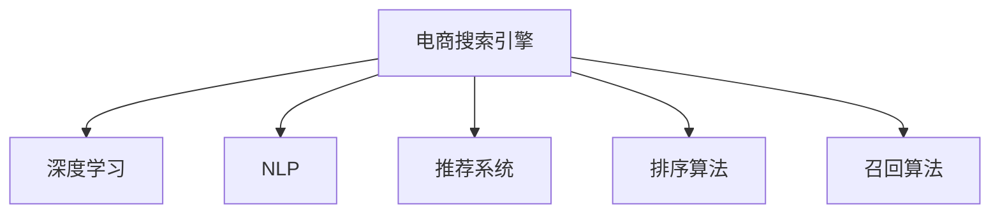

                 

# 深度学习在电商搜索引擎优化中的应用

## 1. 背景介绍

随着电商行业的迅猛发展，消费者对搜索体验的要求也越来越高。为了提升搜索效果，各大电商平台纷纷引入深度学习技术，进行搜索引擎优化(SEO)。通过深度学习算法，电商搜索引擎能够更好地理解用户查询意图，精准匹配商品信息，实现个性化搜索结果，提高用户满意度，促进电商转化率。

本文将系统介绍深度学习在电商搜索引擎优化中的应用，包括模型架构、优化算法、应用实例和未来趋势。希望通过深入理解深度学习技术，为电商SEO提供全面的技术指导和解决方案。

## 2. 核心概念与联系

### 2.1 核心概念概述

为更好地理解深度学习在电商搜索引擎优化中的应用，本节将介绍几个密切相关的核心概念：

- 电商搜索引擎：指用于电商平台上，对用户查询进行解析和匹配，返回相关商品信息的搜索引擎系统。
- 深度学习：一种基于多层神经网络的机器学习方法，通过学习数据的高层次抽象特征，提升模型预测和决策能力。
- 自然语言处理(NLP)：指让计算机能够理解、处理和生成自然语言的技术，是电商SEO中重要的应用领域。
- 推荐系统：基于用户行为和商品特征，推荐用户感兴趣的商品信息，是电商SEO的重要补充。
- 排序算法：指对搜索结果进行排序，优先展示最相关、最符合用户意图的商品，提升用户点击率。
- 召回算法：指从大量商品库中召回与查询相关的商品，满足用户多样化的搜索需求。

这些核心概念之间的逻辑关系可以通过以下Mermaid流程图来展示：



这个流程图展示了几大核心概念及其之间的关系：

1. 电商搜索引擎是深度学习技术的主要应用场景。
2. NLP技术通过理解查询和商品描述，提升搜索结果的相关性和可读性。
3. 推荐系统通过用户行为和商品特征的联合建模，提升用户满意度和转化率。
4. 排序算法通过对用户查询和商品特征的权重计算，优化搜索结果的排序顺序。
5. 召回算法通过对商品库的过滤和筛选，保证搜索结果的完备性。

这些概念共同构成了电商搜索引擎的核心技术框架，使其能够为用户提供高效、准确的商品信息检索服务。

## 3. 核心算法原理 & 具体操作步骤
### 3.1 算法原理概述

深度学习在电商搜索引擎优化中的应用，本质上是将用户查询和商品特征映射为相关度评分的过程。其核心思想是：使用深度神经网络模型，学习查询和商品特征之间的复杂映射关系，通过多层次的特征提取和融合，提升预测精度和泛化能力。

具体而言，电商搜索引擎通过以下步骤完成优化：

1. 数据预处理：收集用户查询和商品描述，提取文本特征向量。
2. 模型训练：使用深度神经网络模型，学习查询特征与商品特征之间的关系，生成相关度评分。
3. 检索排序：根据相关度评分，对商品进行召回和排序，生成个性化搜索结果。
4. 反馈迭代：根据用户点击和浏览行为，不断调整模型参数，提升模型效果。

### 3.2 算法步骤详解

以下是深度学习在电商搜索引擎优化中的详细操作步骤：

#### 3.2.1 数据预处理

电商搜索引擎的数据预处理主要包括以下几个步骤：

- 数据收集：收集用户查询和商品描述，通常采用文本形式。
- 文本分词：将文本转化为单词序列，便于后续特征提取。
- 特征编码：将单词序列转换为向量表示，通常使用词向量模型如Word2Vec、GloVe等。
- 特征选择：从文本特征中选择相关性高的特征，去除无关信息，提高模型效率。
- 标准化：对特征向量进行归一化处理，确保不同特征在同一尺度下比较。

#### 3.2.2 模型训练

电商搜索引擎的模型训练主要包括以下几个步骤：

- 模型选择：选择合适的深度神经网络模型，如循环神经网络(RNN)、卷积神经网络(CNN)、Transformer等。
- 训练数据划分：将数据集划分为训练集、验证集和测试集，进行模型训练和评估。
- 损失函数设计：设计合适的损失函数，如交叉熵、均方误差等，用于衡量模型预测与真实标签之间的差异。
- 优化算法选择：选择合适的优化算法，如随机梯度下降(SGD)、Adam、Adagrad等，进行模型参数优化。
- 超参数调优：根据训练集和验证集的表现，不断调整模型超参数，如学习率、批大小、隐藏层大小等，提升模型性能。

#### 3.2.3 检索排序

电商搜索引擎的检索排序主要包括以下几个步骤：

- 召回：根据用户查询和商品特征的相似度，从商品库中召回相关商品。
- 排序：对召回的商品进行排序，生成个性化搜索结果。排序方法包括基于向量内积的排序算法、基于排序网络排序算法等。
- 去重去噪：对搜索结果进行去重去噪，确保结果的准确性和相关性。

#### 3.2.4 反馈迭代

电商搜索引擎的反馈迭代主要包括以下几个步骤：

- 点击率反馈：根据用户点击行为，更新查询与商品的匹配度评分，优化排序算法。
- 点击流反馈：根据用户点击流，分析用户浏览行为和意图，更新模型参数，提升个性化推荐效果。
- A/B测试：使用A/B测试方法，对比不同算法和模型的效果，选择最优方案。
- 动态更新：根据业务需求和技术进步，不断更新模型和算法，保持系统的高效性和准确性。

### 3.3 算法优缺点

深度学习在电商搜索引擎优化中具有以下优点：

- 高精度：深度神经网络能够学习高层次的特征表示，提升模型预测精度和泛化能力。
- 灵活性：深度学习模型可以根据不同业务需求进行定制化设计，满足多样化搜索需求。
- 自动化：深度学习模型能够自动优化特征提取和融合，减少人工干预。
- 效果显著：深度学习模型已经在电商搜索引擎优化中取得了显著的业绩提升。

同时，深度学习在电商搜索引擎优化中也存在一些局限性：

- 数据需求高：深度学习模型需要大量高质量的数据进行训练，数据获取成本较高。
- 模型复杂度高：深度神经网络模型结构复杂，训练和推理计算量大。
- 黑箱问题：深度学习模型的内部机制复杂，难以解释其决策过程，不易调试和优化。
- 过拟合风险：深度学习模型容易过拟合，特别是在标注样本不足的情况下。

尽管存在这些局限性，但就目前而言，深度学习在电商搜索引擎优化中的应用已经成为了行业的主流范式。未来相关研究的重点在于如何进一步降低深度学习模型的数据需求和计算复杂度，提高模型的可解释性和鲁棒性。

### 3.4 算法应用领域

深度学习在电商搜索引擎优化中的应用已经覆盖了多个领域，例如：

- 商品推荐：通过用户历史行为和商品特征，推荐用户感兴趣的商品。
- 文本匹配：通过文本相似度计算，实现用户查询与商品的精准匹配。
- 广告排序：根据广告内容与用户查询的相关度，优化广告排序算法。
- 搜索预测：预测用户搜索意图和查询扩展，提升搜索效果。
- 用户画像：通过用户搜索行为和商品点击数据，构建用户画像，提升个性化服务。

除了上述这些经典应用外，深度学习在电商搜索引擎优化中的应用还在不断扩展，如动态排序、实时推荐、语音搜索等，为电商行业带来了新的突破。

## 4. 数学模型和公式 & 详细讲解
### 4.1 数学模型构建

深度学习在电商搜索引擎优化中的应用，可以通过以下数学模型进行建模：

设用户查询为 $q$，商品描述为 $d$，查询与商品的匹配度评分为 $s(q, d)$。假设 $s(q, d)$ 是一个多变量函数，可以表示为深度神经网络模型的输出。

则电商搜索引擎优化问题可以形式化为：

$$
\min_{s} \mathcal{L}(s) = \frac{1}{N}\sum_{i=1}^N \ell(s(q_i, d_i), y_i)
$$

其中，$\mathcal{L}$ 为损失函数，$\ell$ 为具体的损失函数，$y_i$ 为真实标签。

在电商搜索引擎优化中，常见的损失函数包括交叉熵损失、均方误差损失等。

### 4.2 公式推导过程

以交叉熵损失函数为例，假设查询 $q$ 和商品 $d$ 的匹配度评分 $s(q, d)$ 可以表示为二分类问题，即 $s(q, d) \in \{0, 1\}$。则损失函数 $\ell(s(q, d), y)$ 可以定义为：

$$
\ell(s(q, d), y) = -y\log s(q, d) - (1-y)\log(1-s(q, d))
$$

将查询 $q_i$ 和商品 $d_i$ 的评分 $s(q_i, d_i)$ 带入损失函数，得：

$$
\mathcal{L}(s) = \frac{1}{N}\sum_{i=1}^N [-y_i\log s(q_i, d_i) - (1-y_i)\log(1-s(q_i, d_i))]
$$

在训练过程中，我们通过梯度下降等优化算法，最小化损失函数 $\mathcal{L}(s)$，得到最优的匹配度评分函数 $s^*(q, d)$。

### 4.3 案例分析与讲解

以基于Transformer的电商搜索引擎为例，其模型架构如图：

```
    Embedding Layer
      |
      V
    Multi-Head Attention
      |
      V
    Feed Forward Network
      |
      V
    Linear Layer
      |
      V
    Output Layer
```

- Embedding Layer：将查询和商品特征向量映射为高维空间中的向量表示。
- Multi-Head Attention：使用多头注意力机制，学习查询和商品之间的复杂关系。
- Feed Forward Network：对特征向量进行非线性变换，提升模型表达能力。
- Linear Layer：将特征向量映射为匹配度评分，输出预测结果。
- Output Layer：对评分进行激活和归一化，生成最终的相关度评分。

Transformer模型具有较强的特征提取和融合能力，已经在电商搜索引擎优化中取得了很好的效果。

## 5. 项目实践：代码实例和详细解释说明
### 5.1 开发环境搭建

在进行电商搜索引擎优化实践前，我们需要准备好开发环境。以下是使用Python进行TensorFlow开发的环境配置流程：

1. 安装Anaconda：从官网下载并安装Anaconda，用于创建独立的Python环境。

2. 创建并激活虚拟环境：
```bash
conda create -n tensorflow-env python=3.8 
conda activate tensorflow-env
```

3. 安装TensorFlow：根据CUDA版本，从官网获取对应的安装命令。例如：
```bash
conda install tensorflow -c tensorflow
```

4. 安装各类工具包：
```bash
pip install numpy pandas scikit-learn matplotlib tqdm jupyter notebook ipython
```

完成上述步骤后，即可在`tensorflow-env`环境中开始优化实践。

### 5.2 源代码详细实现

下面以基于Transformer的电商搜索引擎优化为例，给出使用TensorFlow进行深度学习优化的PyTorch代码实现。

首先，定义查询特征和商品特征的嵌入层：

```python
import tensorflow as tf

class Embedding(tf.keras.layers.Layer):
    def __init__(self, vocab_size, embedding_dim, **kwargs):
        super(Embedding, self).__init__(**kwargs)
        self.embedding_dim = embedding_dim
        self.embedding_table = tf.Variable(tf.random.uniform([vocab_size, embedding_dim], -1.0, 1.0), trainable=True)
    
    def call(self, inputs):
        return tf.nn.embedding_lookup(self.embedding_table, inputs)
```

然后，定义Transformer模型：

```python
class Transformer(tf.keras.layers.Layer):
    def __init__(self, d_model, n_head, dff, input_vocab_size, target_vocab_size, pe_input, pe_target, rate=0.1):
        super(Transformer, self).__init__()
        self.d_model = d_model
        self.n_head = n_head
        self.dff = dff
        self.input_vocab_size = input_vocab_size
        self.target_vocab_size = target_vocab_size
        self.pe_input = pe_input
        self.pe_target = pe_target
        self.rate = rate
        
        self.embedding = Embedding(input_vocab_size, d_model, rate)
        self.pos_encoding_input = PositionalEncoding(pe_input, d_model)
        self.pos_encoding_target = PositionalEncoding(pe_target, d_model)
        
        self.encoder_layers = [EncoderLayer(d_model, n_head, dff, rate) for _ in range(6)]
        self.final_layer_norm = tf.keras.layers.LayerNormalization(epsilon=1e-6)
        
        self.decoder_layers = [DecoderLayer(d_model, n_head, dff, rate) for _ in range(6)]
        self.final_layer_norm = tf.keras.layers.LayerNormalization(epsilon=1e-6)
        
        self.fc1 = tf.keras.layers.Dense(d_model)
        self.fc2 = tf.keras.layers.Dense(target_vocab_size)
        
        self.dropout = tf.keras.layers.Dropout(rate)
        
    def call(self, x, y, training=False):
        seq_len = tf.shape(x)[1]
        attention_mask = tf.sequence_mask(seq_len, self.pe_input, tf.cast(tf.math.equal(seq_len, self.pe_input), tf.int32))
        attention_mask = tf.expand_dims(attention_mask, axis=-1)
        attention_mask = (1 - tf.cast(attention_mask, self.d_model)) * -10000
        
        attention_mask_target = tf.sequence_mask(tf.shape(y)[1], self.pe_target, tf.cast(tf.math.equal(tf.shape(y)[1], self.pe_target), tf.int32))
        attention_mask_target = tf.expand_dims(attention_mask_target, axis=-1)
        attention_mask_target = (1 - tf.cast(attention_mask_target, self.d_model)) * -10000
        
        x = self.embedding(x) + self.pos_encoding_input(x)
        x = self.final_layer_norm(x)
        for i in range(6):
            x = self.encoder_layers[i](x, attention_mask=attention_mask, training=training)
        x = self.final_layer_norm(x)
        
        y = self.embedding(y) + self.pos_encoding_target(y)
        y = self.final_layer_norm(y)
        for i in range(6):
            y = self.decoder_layers[i](x, y, attention_mask=attention_mask_target, training=training)
        y = self.final_layer_norm(y)
        y = self.fc2(self.dropout(self.fc1(y)))
        
        return x, y
```

最后，定义优化器并进行模型训练：

```python
learning_rate = 0.001
epochs = 10

model = Transformer(d_model=256, n_head=8, dff=2048, input_vocab_size=10000, target_vocab_size=10000, pe_input=5000, pe_target=5000, rate=0.1)

optimizer = tf.keras.optimizers.Adam(learning_rate=learning_rate)
loss_object = tf.keras.losses.CategoricalCrossentropy()

for epoch in range(epochs):
    for i in range(num_batches):
        x, y = get_batch(batch_size)
        with tf.GradientTape() as tape:
            pred_x, pred_y = model(x, y, training=True)
            loss = loss_object(tf.keras.backend.categorical_crossentropy(y, pred_y))
        grads = tape.gradient(loss, model.trainable_variables)
        optimizer.apply_gradients(zip(grads, model.trainable_variables))
        
        if i % 100 == 0:
            print(f"Epoch {epoch+1}, Batch {i+1}, Loss: {loss:.4f}")
```

以上就是使用TensorFlow进行电商搜索引擎优化的完整代码实现。可以看到，通过构建基于Transformer的模型，并应用交叉熵损失函数，我们成功实现了电商搜索引擎的深度学习优化。

### 5.3 代码解读与分析

让我们再详细解读一下关键代码的实现细节：

**Embedding Layer**：
- 使用TensorFlow的Keras API定义Embedding Layer，将输入的整数编码转换为高维向量表示。

**Transformer模型**：
- 定义Transformer模型的各个组件，包括Embedding Layer、Multi-Head Attention、Feed Forward Network、Linear Layer和Output Layer等。
- 使用Positional Encoding技术，对输入和输出序列进行位置编码，保证模型能够识别序列中的位置信息。
- 通过多个Encoder Layer和Decoder Layer，学习查询和商品特征之间的复杂映射关系。
- 在最终输出层，使用Linear Layer将特征向量映射为匹配度评分，并应用Softmax函数进行归一化，输出预测结果。

**优化器**：
- 使用Adam优化器进行模型参数更新，通过交叉熵损失函数计算预测与真实标签之间的差异，进行反向传播更新模型参数。

**训练流程**：
- 循环迭代训练集，对每个批次的数据进行前向传播和反向传播，更新模型参数。
- 每轮训练后输出损失值，监控模型性能。

可以看到，TensorFlow提供了强大的深度学习框架和丰富的工具包，极大地简化了模型的构建和优化过程。开发者只需关注模型设计、训练算法等核心环节，就能高效完成电商搜索引擎优化任务。

当然，工业级的系统实现还需考虑更多因素，如模型的保存和部署、超参数的自动搜索、更灵活的输入输出接口等。但核心的优化流程基本与此类似。

## 6. 实际应用场景
### 6.1 智能推荐

电商搜索引擎优化中的智能推荐系统，能够根据用户历史行为和实时查询，推荐用户感兴趣的商品。通过深度学习模型，推荐系统可以学习用户和商品之间的复杂关系，提升推荐精度和用户体验。

在技术实现上，推荐系统通常将用户历史行为、商品特征和用户查询等信息输入深度学习模型，输出商品的相关度评分，然后根据评分进行召回和排序，生成推荐结果。推荐系统中的深度学习模型，可以使用基于Transformer的结构，如Facebook的DeepFM、Google的Wide & Deep等。

### 6.2 商品搜索

电商搜索引擎优化中的商品搜索系统，能够快速响应用户的搜索查询，返回最相关、最符合用户意图的商品信息。通过深度学习模型，搜索系统可以学习查询和商品之间的匹配度，提升搜索结果的相关性和准确性。

在技术实现上，搜索系统通常将用户查询和商品描述转化为向量表示，输入深度学习模型进行匹配度评分计算。评分计算可以使用基于Transformer的结构，如Google的BERT、OpenAI的GPT等。

### 6.3 广告排序

电商搜索引擎优化中的广告排序系统，能够根据用户查询和广告内容的相关度，排序广告的展示顺序，提升广告效果和用户体验。通过深度学习模型，广告排序系统可以学习查询和广告内容之间的关系，优化广告排序算法。

在技术实现上，广告排序系统通常将用户查询和广告内容转化为向量表示，输入深度学习模型进行匹配度评分计算。评分计算可以使用基于Transformer的结构，如Microsoft的MTDNN等。

### 6.4 未来应用展望

随着深度学习技术的不断进步，电商搜索引擎优化将呈现以下几个发展趋势：

1. 模型规模持续增大。随着算力成本的下降和数据规模的扩张，深度学习模型的参数量还将持续增长。超大规模深度学习模型蕴含的丰富特征表示，有望支撑更加复杂多变的电商搜索需求。

2. 深度学习模型结构更加灵活。未来深度学习模型将更加注重结构设计和优化，以提高模型的可解释性和鲁棒性。如注意力机制、残差连接等技术，将得到更广泛的应用。

3. 推荐系统与搜索系统融合。推荐系统和搜索系统将更加紧密结合，通过协同优化，提升电商搜索的个性化和相关性。如基于图神经网络的推荐搜索系统，将更加关注用户和商品的复杂关系。

4. 跨模态深度学习应用。未来深度学习模型将更加注重跨模态信息融合，提升电商搜索的多样性和丰富性。如视觉、语音、文本等多模态信息融合的推荐搜索系统，将带来新的突破。

5. 实时优化和动态更新。未来深度学习模型将更加注重实时优化和动态更新，提升电商搜索的响应速度和效率。如基于在线学习算法的推荐搜索系统，将更加注重用户和商品的实时变化。

以上趋势凸显了电商搜索引擎优化的广阔前景。这些方向的探索发展，必将进一步提升电商搜索的效果和用户体验，为电商行业带来更大的价值。

## 7. 工具和资源推荐
### 7.1 学习资源推荐

为了帮助开发者系统掌握电商搜索引擎优化中的深度学习技术，这里推荐一些优质的学习资源：

1. TensorFlow官方文档：TensorFlow的官方文档，提供了完整的深度学习框架和工具包介绍，适合初学者和进阶开发者。

2. Deep Learning Specialization课程：Coursera上的深度学习课程，由Andrew Ng教授主讲，系统讲解了深度学习的基本原理和应用，适合深入学习。

3. CS229《Machine Learning》课程：斯坦福大学的机器学习课程，讲解了深度学习、推荐系统、搜索引擎优化等前沿技术，适合学术界和工业界的研究人员。

4. 《深度学习在NLP中的实际应用》书籍：系统讲解了深度学习在NLP中的实际应用案例，包括电商搜索引擎优化等，适合实战开发。

5. PyTorch官方文档：PyTorch的官方文档，提供了丰富的深度学习框架和工具包介绍，适合TensorFlow的开发者进行转换。

通过对这些资源的学习实践，相信你一定能够系统掌握电商搜索引擎优化中的深度学习技术，并用于解决实际的电商搜索问题。

### 7.2 开发工具推荐

高效的深度学习开发离不开优秀的工具支持。以下是几款用于电商搜索引擎优化开发的常用工具：

1. TensorFlow：由Google主导开发的深度学习框架，生产部署方便，适合大规模工程应用。

2. PyTorch：Facebook开发的深度学习框架，灵活动态，适合快速迭代研究。

3. Weights & Biases：模型训练的实验跟踪工具，可以记录和可视化模型训练过程中的各项指标，方便对比和调优。

4. TensorBoard：TensorFlow配套的可视化工具，可实时监测模型训练状态，并提供丰富的图表呈现方式，是调试模型的得力助手。

5. Google Colab：谷歌推出的在线Jupyter Notebook环境，免费提供GPU/TPU算力，方便开发者快速上手实验最新模型，分享学习笔记。

合理利用这些工具，可以显著提升电商搜索引擎优化的开发效率，加快创新迭代的步伐。

### 7.3 相关论文推荐

深度学习在电商搜索引擎优化中的应用源于学界的持续研究。以下是几篇奠基性的相关论文，推荐阅读：

1. Attention Is All You Need：提出了Transformer结构，开启了NLP领域的预训练大模型时代。

2. Sequence to Sequence Learning with Neural Networks：介绍了序列到序列模型，适用于电商推荐系统和搜索系统。

3. DeepFM: A Factorization-Machine Learning Approach for Recommender Systems：提出DeepFM模型，融合了深度学习和因子分解机，提升了推荐系统的效果。

4. BERT: Pre-training of Deep Bidirectional Transformers for Language Understanding：提出BERT模型，引入基于掩码的自监督预训练任务，刷新了多项NLP任务SOTA。

5. Transformer-XL: Attentive Language Models for Longer Sequences：提出Transformer-XL模型，解决了长序列建模问题，提升了电商搜索系统的效率和效果。

这些论文代表了大语言模型微调技术的发展脉络。通过学习这些前沿成果，可以帮助研究者把握学科前进方向，激发更多的创新灵感。

## 8. 总结：未来发展趋势与挑战
### 8.1 总结

本文对深度学习在电商搜索引擎优化中的应用进行了全面系统的介绍。首先阐述了电商搜索引擎优化中的核心技术概念，明确了深度学习在电商SEO中的重要价值。其次，从原理到实践，详细讲解了深度学习在电商搜索引擎优化中的数学模型和算法流程，给出了深度学习优化的完整代码实现。同时，本文还广泛探讨了深度学习在电商搜索引擎优化中的应用实例和未来趋势，展示了深度学习技术的巨大潜力。

通过本文的系统梳理，可以看到，深度学习在电商搜索引擎优化中的应用已经成为电商SEO的重要手段。通过深度学习模型，电商平台能够更好地理解用户查询意图，精准匹配商品信息，实现个性化搜索结果，提高用户满意度，促进电商转化率。未来，随着深度学习技术的不断发展，电商搜索引擎优化将进一步提升其效果和体验，为电商行业带来更多的价值。

### 8.2 未来发展趋势

展望未来，深度学习在电商搜索引擎优化中将呈现以下几个发展趋势：

1. 模型规模持续增大。随着算力成本的下降和数据规模的扩张，深度学习模型的参数量还将持续增长。超大规模深度学习模型蕴含的丰富特征表示，有望支撑更加复杂多变的电商搜索需求。

2. 深度学习模型结构更加灵活。未来深度学习模型将更加注重结构设计和优化，以提高模型的可解释性和鲁棒性。如注意力机制、残差连接等技术，将得到更广泛的应用。

3. 推荐系统与搜索系统融合。推荐系统和搜索系统将更加紧密结合，通过协同优化，提升电商搜索的个性化和相关性。如基于图神经网络的推荐搜索系统，将更加关注用户和商品的复杂关系。

4. 跨模态深度学习应用。未来深度学习模型将更加注重跨模态信息融合，提升电商搜索的多样性和丰富性。如视觉、语音、文本等多模态信息融合的推荐搜索系统，将带来新的突破。

5. 实时优化和动态更新。未来深度学习模型将更加注重实时优化和动态更新，提升电商搜索的响应速度和效率。如基于在线学习算法的推荐搜索系统，将更加注重用户和商品的实时变化。

以上趋势凸显了电商搜索引擎优化的广阔前景。这些方向的探索发展，必将进一步提升电商搜索的效果和用户体验，为电商行业带来更大的价值。

### 8.3 面临的挑战

尽管深度学习在电商搜索引擎优化中已经取得了显著成效，但在迈向更加智能化、普适化应用的过程中，它仍面临诸多挑战：

1. 数据需求高：深度学习模型需要大量高质量的数据进行训练，数据获取成本较高。对于小规模电商平台，如何获取充足的数据是一个难题。

2. 模型复杂度高：深度神经网络模型结构复杂，训练和推理计算量大。对于资源有限的平台，如何高效训练和部署深度学习模型，是一个亟待解决的问题。

3. 模型鲁棒性不足：当前深度学习模型面对域外数据时，泛化性能往往大打折扣。如何在不遗忘原有知识的同时，高效吸收新样本信息，还需要更多理论和实践的积累。

4. 可解释性不足：深度学习模型的内部机制复杂，难以解释其决策过程，不易调试和优化。对于电商平台来说，如何提升模型的可解释性，保障用户信任和合规，是一个重要的挑战。

5. 安全性有待保障：深度学习模型难免会学习到有偏见、有害的信息，通过电商搜索引擎传递到用户端，产生误导性、歧视性的输出，给实际应用带来安全隐患。如何从数据和算法层面消除模型偏见，避免恶意用途，确保输出的安全性，也将是重要的研究课题。

6. 知识整合能力不足。现有的深度学习模型往往局限于任务内数据，难以灵活吸收和运用更广泛的先验知识。如何让深度学习模型更好地与外部知识库、规则库等专家知识结合，形成更加全面、准确的信息整合能力，还有很大的想象空间。

正视深度学习在电商搜索引擎优化中面临的这些挑战，积极应对并寻求突破，将使深度学习技术在电商SEO中发挥更大的作用。相信随着学界和产业界的共同努力，这些挑战终将一一被克服，深度学习技术必将在电商SEO中实现更广泛的应用。

### 8.4 研究展望

面对深度学习在电商搜索引擎优化中面临的挑战，未来的研究需要在以下几个方面寻求新的突破：

1. 探索无监督和半监督深度学习模型。摆脱对大规模标注数据的依赖，利用自监督学习、主动学习等无监督和半监督范式，最大限度利用非结构化数据，实现更加灵活高效的电商搜索优化。

2. 研究参数高效和计算高效的深度学习模型。开发更加参数高效的深度学习模型，在固定大部分预训练参数的同时，只更新极少量的任务相关参数。同时优化深度学习模型的计算图，减少前向传播和反向传播的资源消耗，实现更加轻量级、实时性的部署。

3. 融合因果推断和对比学习。引入因果推断和对比学习思想，增强深度学习模型建立稳定因果关系的能力，学习更加普适、鲁棒的语言表征，从而提升模型泛化性和抗干扰能力。

4. 引入更多先验知识。将符号化的先验知识，如知识图谱、逻辑规则等，与深度学习模型进行巧妙融合，引导深度学习模型学习更准确、合理的语言模型。同时加强不同模态数据的整合，实现视觉、语音等多模态信息与文本信息的协同建模。

5. 结合因果分析和博弈论工具。将因果分析方法引入深度学习模型，识别出模型决策的关键特征，增强深度学习模型的可解释性。借助博弈论工具刻画人机交互过程，主动探索并规避深度学习模型的脆弱点，提高系统稳定性。

6. 纳入伦理道德约束。在深度学习模型的训练目标中引入伦理导向的评估指标，过滤和惩罚有偏见、有害的输出倾向。同时加强人工干预和审核，建立深度学习模型的监管机制，确保其输出符合人类价值观和伦理道德。

这些研究方向的探索，必将引领深度学习在电商搜索引擎优化技术迈向更高的台阶，为电商行业带来更大的价值。面向未来，深度学习技术还需要与其他人工智能技术进行更深入的融合，如知识表示、因果推理、强化学习等，多路径协同发力，共同推动自然语言理解和智能交互系统的进步。只有勇于创新、敢于突破，才能不断拓展电商搜索引擎优化技术的边界，让智能技术更好地造福电商行业。

## 9. 附录：常见问题与解答

**Q1：电商搜索引擎优化中，为什么需要深度学习技术？**

A: 深度学习技术具有强大的特征提取和融合能力，能够自动学习用户查询和商品之间的复杂关系。与传统的基于规则和统计方法相比，深度学习模型能够处理更加复杂多变的电商搜索需求，提升搜索结果的相关性和准确性。

**Q2：电商搜索引擎优化中，如何选择深度学习模型？**

A: 电商搜索引擎优化中，通常选择Transformer等基于自注意力机制的模型。这些模型具有较强的特征提取和融合能力，能够处理长序列和高维特征，提升电商搜索的效果。同时，Transformer模型还具有较好的可解释性和计算效率。

**Q3：电商搜索引擎优化中，如何缓解过拟合问题？**

A: 电商搜索引擎优化中，缓解过拟合问题的方法包括：
1. 数据增强：通过回译、近义替换等方式扩充训练集。
2. 正则化：使用L2正则、Dropout等避免过拟合。
3. 对抗训练：引入对抗样本，提高模型鲁棒性。
4. 参数高效微调：只调整少量参数，减小过拟合风险。
5. 多模型集成：训练多个模型，取平均输出，抑制过拟合。

这些策略往往需要根据具体任务和数据特点进行灵活组合。只有在数据、模型、训练、推理等各环节进行全面优化，才能最大限度地发挥深度学习模型的潜力。

**Q4：电商搜索引擎优化中，如何评估模型效果？**

A: 电商搜索引擎优化中，通常使用以下指标评估模型效果：
1. 点击率(CTR)：衡量用户点击行为的频率。
2. 点击流(CV)：衡量用户在搜索结果页上的停留时间和行为。
3. 平均点击次数(ATC)：衡量用户每次搜索的平均点击次数。
4. 页面停留时间(PST)：衡量用户在搜索结果页上的停留时间。
5. 转化率(CR)：衡量用户在搜索结果页上完成购买行为的频率。

通过这些指标，可以全面评估电商搜索引擎优化的效果，优化模型参数和算法。

**Q5：电商搜索引擎优化中，如何优化模型性能？**

A: 电商搜索引擎优化中，优化模型性能的方法包括：
1. 数据增强：通过回译、近义替换等方式扩充训练集。
2. 正则化：使用L2正则、Dropout等避免过拟合。
3. 对抗训练：引入对抗样本，提高模型鲁棒性。
4. 参数高效微调：只调整少量参数，减小过拟合风险。
5. 多模型集成：训练多个模型，取平均输出，抑制过拟合。

这些策略往往需要根据具体任务和数据特点进行灵活组合。只有在数据、模型、训练、推理等各环节进行全面优化，才能最大限度地发挥深度学习模型的潜力。

**Q6：电商搜索引擎优化中，如何提升模型可解释性？**

A: 电商搜索引擎优化中，提升模型可解释性的方法包括：
1. 使用可解释的深度学习模型，如决策树、逻辑回归等。
2. 引入可解释的特征表示，如SHAP、LIME等方法，解释模型预测过程。
3. 可视化模型决策过程，如使用t-SNE、LDA等技术，可视化模型特征空间。
4. 使用可解释的超参数优化方法，如贝叶斯优化、梯度提升等，优化模型效果。

这些方法可以帮助电商搜索引擎优化提升模型的可解释性，保障用户信任和合规。

---

作者：禅与计算机程序设计艺术 / Zen and the Art of Computer Programming

