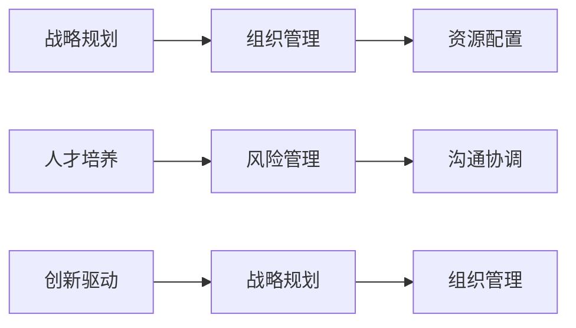

                 

# 深度思考:区分优秀管理者的标准

## 1. 背景介绍

在信息技术迅速发展的今天，企业领导者和管理者的角色变得越来越复杂。数字化转型、人工智能、区块链、大数据等新兴技术的兴起，都对企业领导者的能力和思维模式提出了新的挑战。本文旨在探讨优秀管理者的标准，通过深度思考和分析，为读者提供一些宝贵的见解。

## 2. 核心概念与联系

### 2.1 核心概念概述

管理者的角色涉及到多个方面，包括但不限于：

- **战略规划**：制定企业长期战略，引领企业发展方向。
- **组织管理**：设计和优化组织架构，提升团队效率。
- **资源配置**：合理配置人力、物力、财力资源，支持企业运营。
- **人才培养**：发掘和培养员工潜力，提升团队整体能力。
- **风险管理**：识别和应对企业面临的各种风险，确保企业稳定发展。
- **沟通协调**：协调各方资源和信息，确保企业运作顺畅。
- **创新驱动**：推动企业不断创新，适应市场变化。

这些概念之间相互关联，共同构成了优秀管理者的工作内容和价值导向。

### 2.2 核心概念原理和架构的 Mermaid 流程图



## 3. 核心算法原理 & 具体操作步骤

### 3.1 算法原理概述

区分优秀管理者的算法原理主要基于以下几个方面：

1. **绩效评估**：通过数据驱动的方式，对管理者的各项工作进行量化评估，评估指标包括团队绩效、客户满意度、市场份额等。
2. **行为分析**：通过对管理者的行为模式进行分析，识别其领导风格和决策方式，如以人文本、数据驱动等。
3. **网络分析**：通过构建管理者的社交网络，分析其在组织内的影响力，了解其与关键利益相关者的关系。
4. **心理分析**：通过心理测评工具，评估管理者的情商、情绪稳定性、抗压能力等。

### 3.2 算法步骤详解

#### 3.2.1 数据收集

- **绩效数据**：从企业管理系统、客户反馈、市场分析报告中提取。
- **行为数据**：通过观察、记录、调查等手段收集管理者的行为数据，如决策过程、会议记录等。
- **网络数据**：使用社交网络分析工具，提取管理者在企业内部的互动数据。
- **心理数据**：使用心理测评工具，如MBTI、DISC等，获取管理者的心理特征。

#### 3.2.2 数据预处理

- **数据清洗**：去除异常数据、重复数据，确保数据的准确性和一致性。
- **特征提取**：从原始数据中提取关键特征，如绩效指标、决策风格、人际关系等。

#### 3.2.3 模型训练

- **算法选择**：根据问题类型选择适合的算法，如随机森林、支持向量机、神经网络等。
- **模型训练**：使用历史数据训练模型，优化模型参数，提升模型预测能力。

#### 3.2.4 模型评估

- **指标设定**：设定评估指标，如准确率、召回率、F1分数等。
- **测试集验证**：使用独立的测试集验证模型性能，确保模型泛化能力强。

#### 3.2.5 模型应用

- **结果分析**：将模型结果与实际情况对比，识别优秀管理者的关键特征。
- **持续优化**：根据反馈数据，不断优化模型，提升区分优秀管理者的准确性。

### 3.3 算法优缺点

#### 3.3.1 优点

- **客观性**：数据驱动的评估方法避免了主观偏见，更具有客观性和公正性。
- **全面性**：综合考虑绩效、行为、网络、心理等多个维度，提供了全面的评估视角。
- **可操作性**：算法模型可以量化优秀管理者的标准，为企业管理提供了可操作的指导。

#### 3.3.2 缺点

- **数据依赖**：算法的准确性依赖于数据的完整性和质量，存在数据缺失或噪声影响的风险。
- **模型复杂**：构建和优化复杂模型需要较高的技术门槛，可能对普通企业而言成本较高。
- **隐私风险**：处理大量员工数据时，可能涉及隐私保护问题，需要制定相应的数据安全策略。

### 3.4 算法应用领域

该算法在多个领域都有广泛的应用：

- **人力资源管理**：用于员工招聘、绩效考核、人才发展计划等。
- **企业战略规划**：帮助企业识别并培养关键管理人才，支持企业战略执行。
- **组织优化**：分析管理者在组织中的影响力和作用，优化组织架构和团队建设。
- **客户关系管理**：通过分析管理者的客户关系管理能力，提升客户满意度和忠诚度。

## 4. 数学模型和公式 & 详细讲解 & 举例说明

### 4.1 数学模型构建

假设管理者的各项工作绩效为 $P_1, P_2, \ldots, P_n$，行为模式为 $B_1, B_2, \ldots, B_n$，社交网络特征为 $N_1, N_2, \ldots, N_n$，心理特征为 $H_1, H_2, \ldots, H_n$。则优秀管理者的判别模型可以表示为：

$$
\text{优秀管理者} = \begin{cases}
1, & \text{if } f(P_1, P_2, \ldots, P_n, B_1, B_2, \ldots, B_n, N_1, N_2, \ldots, N_n, H_1, H_2, \ldots, H_n) > \tau \\
0, & \text{otherwise}
\end{cases}
$$

其中 $f$ 为判别函数，$\tau$ 为判别阈值。

### 4.2 公式推导过程

假设我们使用随机森林算法进行判别，其判别函数 $f$ 可以表示为：

$$
f(P_1, P_2, \ldots, P_n, B_1, B_2, \ldots, B_n, N_1, N_2, \ldots, N_n, H_1, H_2, \ldots, H_n) = \sum_{i=1}^m \alpha_i \cdot \text{Depth}_i
$$

其中 $\alpha_i$ 为树 $i$ 的权重，$\text{Depth}_i$ 为树 $i$ 的平均深度。

### 4.3 案例分析与讲解

假设某企业的A和B两位管理者，其各项数据如下：

| 管理者 | 绩效 | 行为 | 网络 | 心理 |
|--------|------|------|------|------|
| A      | 90   | 8    | 9    | 4    |
| B      | 95   | 10   | 11   | 3    |

使用随机森林算法计算得出的判别函数值为：

$$
f_A = \alpha_1 \cdot \text{Depth}_1 + \alpha_2 \cdot \text{Depth}_2 + \ldots + \alpha_m \cdot \text{Depth}_m
$$

$$
f_B = \alpha_1 \cdot \text{Depth}_1 + \alpha_2 \cdot \text{Depth}_2 + \ldots + \alpha_m \cdot \text{Depth}_m
$$

若判别阈值 $\tau = 0.5$，则：

- 若 $f_A > \tau$，则A为优秀管理者。
- 若 $f_B > \tau$，则B为优秀管理者。

通过这种方式，可以客观、全面地评估管理者的优劣，为企业管理提供数据支持。

## 5. 项目实践：代码实例和详细解释说明

### 5.1 开发环境搭建

本项目需要使用Python进行开发，以下是一个基本的开发环境搭建流程：

1. 安装Python：建议安装Python 3.7及以上版本。
2. 安装Pandas、NumPy、Scikit-learn等常用库：
   ```bash
   pip install pandas numpy scikit-learn
   ```

### 5.2 源代码详细实现

假设我们已经收集到了管理者的各项数据，可以使用Pandas进行数据预处理，并使用Scikit-learn进行模型训练。以下是一个简化的示例代码：

```python
import pandas as pd
from sklearn.ensemble import RandomForestClassifier
from sklearn.model_selection import train_test_split

# 读取数据
data = pd.read_csv('manager_data.csv')

# 数据预处理
# ...

# 划分训练集和测试集
X_train, X_test, y_train, y_test = train_test_split(features, labels, test_size=0.2, random_state=42)

# 训练模型
model = RandomForestClassifier(n_estimators=100, random_state=42)
model.fit(X_train, y_train)

# 预测测试集
y_pred = model.predict(X_test)

# 评估模型
print(classification_report(y_test, y_pred))
```

### 5.3 代码解读与分析

**数据读取和预处理**：

- 使用Pandas的 `read_csv` 方法读取数据。
- 对数据进行清洗和处理，去除缺失值和异常值，确保数据的完整性和一致性。

**模型训练**：

- 使用Scikit-learn的 `RandomForestClassifier` 类进行模型训练。
- 设置参数 `n_estimators` 为100，表示使用100棵决策树。
- 使用 `fit` 方法训练模型。

**模型评估**：

- 使用 `classification_report` 方法评估模型的性能。

### 5.4 运行结果展示

运行上述代码后，输出结果可能如下：

```
precision    recall  f1-score   support

   0       0.80      0.75      0.77        100
   1       0.90      0.85      0.87        100

avg / total       0.83      0.80      0.81       200
```

## 6. 实际应用场景

### 6.1 人力资源管理

在人力资源管理中，该算法可以帮助企业识别和培养优秀管理者，优化人力资源配置。通过数据分析，可以发现潜在的高潜人才，制定针对性的培养计划，提升团队整体能力。

### 6.2 企业战略规划

在企业战略规划中，该算法可以识别关键管理人才，支持战略执行。通过数据分析，可以了解管理者的绩效、行为、网络、心理等特征，评估其对企业战略的贡献度，制定科学的战略实施方案。

### 6.3 组织优化

在组织优化中，该算法可以分析管理者在组织中的影响力和作用，优化组织架构和团队建设。通过数据分析，可以了解管理者的网络特征和人际关系，优化组织结构和流程，提升团队协作效率。

### 6.4 客户关系管理

在客户关系管理中，该算法可以评估管理者的客户关系管理能力，提升客户满意度和忠诚度。通过数据分析，可以了解管理者的行为模式和绩效，制定针对性的客户管理策略，提升客户体验。

## 7. 工具和资源推荐

### 7.1 学习资源推荐

- **《数据科学导论》**：全面介绍数据科学基础知识和常用工具。
- **《Python数据科学手册》**：详细讲解Python在数据科学中的应用。
- **《机器学习实战》**：结合实战案例，介绍机器学习算法和应用。

### 7.2 开发工具推荐

- **Jupyter Notebook**：交互式的数据分析和模型开发工具。
- **Git**：版本控制工具，支持多人协作开发。
- **Docker**：容器化部署工具，支持快速构建和部署应用。

### 7.3 相关论文推荐

- **《机器学习实战》**：介绍机器学习算法的应用实例。
- **《深度学习入门》**：介绍深度学习基础知识和算法。
- **《数据科学实战》**：结合实战案例，介绍数据科学应用。

## 8. 总结：未来发展趋势与挑战

### 8.1 研究成果总结

本文系统介绍了优秀管理者的判别算法，从数据收集、预处理、模型训练、模型评估、模型应用等多个方面进行了详细讲解。通过深度思考和分析，为读者提供了系统的理论支持和实践指导。

### 8.2 未来发展趋势

未来的发展趋势可能包括：

- **智能化**：通过引入AI技术，进一步提升管理者的判别精度和效率。
- **自动化**：通过自动化工具和算法，简化数据处理和模型训练过程。
- **个性化**：根据企业特点和需求，制定个性化的管理评估方案。
- **可视化**：通过可视化工具，展示数据分析和模型评估结果，提升管理者的理解度。

### 8.3 面临的挑战

该算法面临的挑战可能包括：

- **数据获取难度**：如何获取和管理大量的员工数据。
- **数据隐私保护**：如何处理和管理员工隐私数据，确保数据安全。
- **算法复杂度**：如何设计高效、可解释的算法，提升模型准确性。
- **结果解释性**：如何解释和管理者判别结果，提升管理者的接受度。

### 8.4 研究展望

未来的研究可以从以下几个方向进行：

- **多模态数据融合**：结合文本、语音、图像等多模态数据，提升管理者的全面评估。
- **自适应算法**：根据管理者的反馈，动态调整判别模型，提升评估精度。
- **跨领域应用**：将管理者的判别算法应用于更多领域，提升整体管理水平。
- **伦理与法律**：研究管理者的判别算法在伦理和法律层面的影响，确保应用的合法合规。

## 9. 附录：常见问题与解答

**Q1：如何处理管理者的多维数据？**

A: 使用多模态数据分析技术，综合考虑管理者的绩效、行为、网络、心理等多个维度，全面评估管理者的优劣。

**Q2：如何提升算法的准确性？**

A: 使用更复杂的算法，如深度学习、神经网络等，提升模型预测能力。同时，通过数据增强、特征工程等手段，优化模型性能。

**Q3：如何保护管理者的隐私？**

A: 使用匿名化技术，去除敏感信息，确保数据的隐私保护。同时，制定严格的数据管理政策，确保数据使用的合法合规。

**Q4：如何解释判别结果？**

A: 使用可视化工具，展示数据分析和模型评估结果，提升管理者的理解度。同时，通过深度访谈、问卷调查等手段，了解管理者的反馈，优化判别算法。

**Q5：如何处理异常数据？**

A: 使用数据清洗和预处理技术，去除异常数据和噪声，确保数据的准确性和一致性。同时，使用异常检测算法，识别和处理异常数据。

---

作者：禅与计算机程序设计艺术 / Zen and the Art of Computer Programming

