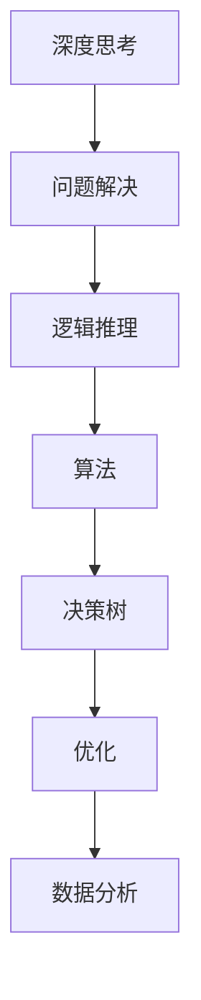

                 

# 深度思考:问题解决的利器

> 关键词：深度思考, 问题解决, 算法, 决策树, 逻辑推理, 优化, 数据分析, 案例分析

## 1. 背景介绍

### 1.1 问题由来
在当今快速发展的社会中，面对复杂多变的环境，人类需要不断地进行深度思考以应对各种挑战。深度思考能力是现代社会的重要能力之一，尤其在面对复杂的决策和问题解决时，深度思考能力显得尤为关键。无论是学术界还是工业界，都在探索如何通过算法和工具来提升人类的深度思考能力。本文将深入探讨深度思考的本质，以及如何通过算法和技术来辅助和提升深度思考能力。

### 1.2 问题核心关键点
深度思考本质上是对复杂问题进行逻辑推理和分析的过程。在深度思考中，我们需要从多角度、多维度对问题进行分析和推理，以找到最优的解决方案。这一过程通常涉及对大量数据的分析和处理，以及对问题的逻辑结构进行建模。基于深度思考的问题解决通常包括以下几个关键点：
1. 数据收集和预处理：收集相关数据并对其进行清洗和预处理。
2. 逻辑建模：建立问题模型，分析问题结构和逻辑关系。
3. 算法选择和应用：选择合适的算法或模型来解决问题。
4. 迭代优化：通过多次迭代和优化，逐步提高解决方案的质量。
5. 结果验证和反思：对解决方案进行验证，并进行反思和改进。

这些核心关键点构成了深度思考问题解决的全过程，帮助我们在复杂多变的环境中找到最佳解决方案。

### 1.3 问题研究意义
研究深度思考问题解决的方法，对于提升人类在面对复杂问题时的决策能力和创造力具有重要意义：

1. 增强决策能力：深度思考使我们能够更全面、深入地理解问题，从而做出更加合理和科学的决策。
2. 提高问题解决效率：通过算法和技术辅助，可以大幅提高问题解决的效率，减少时间成本。
3. 提升创新能力：深度思考和算法相结合，能够激发更多的创新思维和解决方案。
4. 促进学习与成长：通过不断反思和优化，能够提升我们的学习能力和自我成长。
5. 推动技术应用：研究深度思考问题解决的方法，有助于推动相关技术在更多领域的实际应用。

## 2. 核心概念与联系

### 2.1 核心概念概述

为更好地理解深度思考问题解决的算法和技术，本节将介绍几个密切相关的核心概念：

- 深度思考(Deep Thinking)：指在复杂问题中通过多维度、多层次的分析和推理，寻找最优解决方案的过程。
- 问题解决(Problem Solving)：通过逻辑推理和数据分析，从给定条件和限制中找到最佳解决方案的过程。
- 逻辑推理(Logic Reasoning)：基于逻辑规则和关系对问题进行分析推理，得出合理的结论。
- 算法(Algorithm)：一系列有序步骤，用于解决特定问题。
- 决策树(Decision Tree)：一种基于树形结构的模型，用于描述决策过程和逻辑关系。
- 优化(Optimization)：通过不断调整和改进，使问题解决方案达到最优。
- 数据分析(Analytical Data)：通过数据挖掘和统计分析，从数据中提取有用的信息。

这些核心概念之间的逻辑关系可以通过以下Mermaid流程图来展示：



这个流程图展示了深度思考问题解决的核心概念及其之间的关系：

1. 深度思考从问题解决开始，通过逻辑推理和算法处理来解决问题。
2. 算法和决策树是问题解决的核心工具，用于描述和实现逻辑推理过程。
3. 优化和数据分析是问题解决的辅助手段，用于提升解决方案的质量和效率。

这些概念共同构成了深度思考问题解决的基础框架，帮助我们在复杂问题中找到合理的解决方案。

## 3. 核心算法原理 & 具体操作步骤

### 3.1 算法原理概述

深度思考问题解决的核心算法原理，是利用逻辑推理和数据分析，构建问题模型，并通过算法迭代优化来逐步逼近最优解决方案。该过程可以分为以下几个步骤：

1. 数据收集和预处理：收集相关数据，并进行清洗和预处理。
2. 问题建模：构建问题模型，明确问题的结构和逻辑关系。
3. 算法选择和应用：选择合适的算法或模型，并应用于问题解决。
4. 迭代优化：通过多次迭代和优化，逐步提高解决方案的质量。
5. 结果验证和反思：对解决方案进行验证，并进行反思和改进。

### 3.2 算法步骤详解

深度思考问题解决的算法步骤，可以分为以下五个关键环节：

#### 3.2.1 数据收集和预处理

数据是深度思考问题解决的基础。数据收集和预处理通常包括以下几个步骤：

- **数据收集**：从不同渠道收集相关数据，如历史数据、现有文献、用户反馈等。
- **数据清洗**：对收集到的数据进行清洗，去除噪声、重复和无效数据。
- **数据预处理**：对数据进行归一化、标准化等处理，确保数据的质量和一致性。

#### 3.2.2 问题建模

问题建模是深度思考问题解决的核心步骤，通常包括以下几个方面：

- **问题定义**：明确问题的目标和范围，确定需要解决的具体问题。
- **问题分解**：将复杂问题分解为多个子问题，便于分析和解决。
- **逻辑关系建模**：建立问题的逻辑关系模型，描述不同变量和因素之间的关系。

#### 3.2.3 算法选择和应用

选择合适的算法或模型是深度思考问题解决的关键步骤，通常包括以下几个方面：

- **算法选择**：根据问题特点选择合适的算法或模型，如决策树、支持向量机、深度学习等。
- **模型训练**：使用收集到的数据对算法或模型进行训练，使其能够处理特定问题。
- **模型评估**：通过验证集对模型进行评估，选择性能最优的模型。

#### 3.2.4 迭代优化

迭代优化是深度思考问题解决的重要步骤，通常包括以下几个方面：

- **迭代策略**：设计迭代策略，逐步提高模型性能。
- **优化方法**：使用优化方法，如梯度下降、遗传算法等，优化模型参数。
- **结果评估**：通过测试集对模型进行评估，选择性能最优的模型。

#### 3.2.5 结果验证和反思

结果验证和反思是深度思考问题解决的最后环节，通常包括以下几个方面：

- **结果验证**：对最终解决方案进行验证，确保其正确性和有效性。
- **反思改进**：对解决方案进行反思，找出不足之处并加以改进。

### 3.3 算法优缺点

深度思考问题解决的算法具有以下优点：

1. **高效性**：通过算法和技术辅助，能够显著提高问题解决的效率。
2. **全面性**：算法能够从多维度、多层次对问题进行分析，确保解决方案的全面性。
3. **可扩展性**：算法和技术可以应用于各种复杂问题，具有良好的可扩展性。

同时，该算法也存在一定的局限性：

1. **数据依赖性**：算法的有效性依赖于高质量的数据，数据的缺失或不准确会导致算法性能下降。
2. **复杂性**：算法设计复杂，需要综合考虑多种因素，增加了实现的难度。
3. **鲁棒性不足**：在面对特殊情况或异常数据时，算法可能表现不佳。
4. **可解释性不足**：某些算法（如深度学习）的决策过程缺乏可解释性，难以理解和调试。

尽管存在这些局限性，但总体而言，深度思考问题解决的算法和技术，仍然是面对复杂问题的重要工具。未来研究的方向在于如何进一步优化算法性能，提高其可解释性和鲁棒性。

### 3.4 算法应用领域

深度思考问题解决的算法和技术，已经在多个领域得到了广泛应用，例如：

- **金融风险管理**：通过数据分析和逻辑推理，预测和评估金融市场的风险。
- **医疗诊断**：通过数据挖掘和模型训练，辅助医生进行疾病诊断和治疗。
- **市场营销**：通过数据分析和优化，制定营销策略和提升销售效果。
- **供应链管理**：通过数据分析和优化，优化供应链流程和提高效率。
- **城市规划**：通过数据分析和模型训练，优化城市规划和资源配置。

除了上述这些经典应用外，深度思考问题解决的算法和技术，还在更多领域得到了创新性应用，如智能制造、智能交通、智能推荐等，为各行各业带来了新的变革。

## 4. 数学模型和公式 & 详细讲解 & 举例说明

### 4.1 数学模型构建

在深度思考问题解决中，数学模型通常用于描述问题的结构和逻辑关系。以下是一个简单的数学模型构建示例：

假设我们要预测某个商品的销量，可以建立一个线性回归模型，描述销量与相关因素之间的关系：

$$
y = \beta_0 + \beta_1 x_1 + \beta_2 x_2 + \ldots + \beta_n x_n + \epsilon
$$

其中，$y$ 表示销量，$x_1, x_2, \ldots, x_n$ 表示相关因素，$\beta_0, \beta_1, \beta_2, \ldots, \beta_n$ 表示系数，$\epsilon$ 表示误差项。

### 4.2 公式推导过程

线性回归模型的推导过程如下：

1. **数据收集和预处理**：收集历史销量数据和相关因素数据，并进行清洗和预处理。
2. **问题建模**：明确预测销量的问题，将问题分解为销量与相关因素之间的关系建模。
3. **算法选择和应用**：选择线性回归算法，使用数据进行模型训练和评估。
4. **迭代优化**：通过多次迭代和优化，调整模型参数，提升模型性能。
5. **结果验证和反思**：对最终模型进行验证和反思，选择性能最优的模型。

### 4.3 案例分析与讲解

假设我们要预测某商品的销量，可以使用线性回归模型进行建模和预测。以下是一个简单的案例分析：

1. **数据收集和预处理**：收集历史销量数据和相关因素数据，并进行清洗和预处理。
2. **问题建模**：明确预测销量的问题，将问题分解为销量与相关因素之间的关系建模。
3. **算法选择和应用**：选择线性回归算法，使用数据进行模型训练和评估。
4. **迭代优化**：通过多次迭代和优化，调整模型参数，提升模型性能。
5. **结果验证和反思**：对最终模型进行验证和反思，选择性能最优的模型。

## 5. 项目实践：代码实例和详细解释说明

### 5.1 开发环境搭建

在进行深度思考问题解决的项目实践前，我们需要准备好开发环境。以下是使用Python进行Scikit-learn开发的环境配置流程：

1. 安装Anaconda：从官网下载并安装Anaconda，用于创建独立的Python环境。
2. 创建并激活虚拟环境：
```bash
conda create -n sklearn-env python=3.8 
conda activate sklearn-env
```

3. 安装Scikit-learn：
```bash
pip install scikit-learn
```

4. 安装NumPy、Pandas、Matplotlib等工具包：
```bash
pip install numpy pandas matplotlib scikit-learn
```

完成上述步骤后，即可在`sklearn-env`环境中开始项目实践。

### 5.2 源代码详细实现

下面我们以线性回归模型为例，给出使用Scikit-learn进行预测销量问题的Python代码实现。

首先，导入必要的库：

```python
import numpy as np
from sklearn.linear_model import LinearRegression
from sklearn.metrics import mean_squared_error
```

然后，定义数据集：

```python
# 假设数据集已经预处理，X为特征，y为销量
X = np.array([[1, 2], [3, 4], [5, 6], [7, 8]])
y = np.array([5, 10, 15, 20])
```

接下来，进行模型训练和预测：

```python
# 创建线性回归模型
model = LinearRegression()

# 训练模型
model.fit(X, y)

# 预测销量
y_pred = model.predict([[9, 10], [11, 12]])
```

最后，评估模型性能：

```python
# 计算均方误差
mse = mean_squared_error(y, y_pred)
print(f"Mean Squared Error: {mse}")
```

### 5.3 代码解读与分析

让我们再详细解读一下关键代码的实现细节：

- **数据集定义**：假设数据集已经预处理，其中X为特征，y为销量。
- **模型训练**：使用Scikit-learn的LinearRegression模型进行训练，其中`fit`方法用于拟合模型。
- **预测销量**：使用训练好的模型进行销量预测，`predict`方法用于预测销量。
- **性能评估**：使用均方误差评估模型性能，`mean_squared_error`方法用于计算均方误差。

## 6. 实际应用场景

### 6.1 金融风险管理

在金融风险管理中，深度思考问题解决算法可以用于预测市场波动、评估信用风险等。通过数据分析和逻辑推理，预测市场未来的走势和风险，帮助金融机构制定风险管理策略。

在技术实现上，可以收集历史市场数据和财务数据，使用线性回归模型或决策树模型进行预测和风险评估。通过迭代优化和模型评估，不断提升预测准确性。

### 6.2 医疗诊断

在医疗诊断中，深度思考问题解决算法可以用于疾病预测、治疗方案优化等。通过数据挖掘和模型训练，辅助医生进行疾病诊断和治疗。

在技术实现上，可以收集患者的临床数据和实验室数据，使用深度学习模型进行疾病预测和治疗方案优化。通过迭代优化和模型评估，不断提升预测和治疗效果。

### 6.3 市场营销

在市场营销中，深度思考问题解决算法可以用于客户行为分析、广告投放优化等。通过数据分析和逻辑推理，制定更有效的市场营销策略。

在技术实现上，可以收集用户的浏览、购买等行为数据，使用聚类算法或分类算法进行客户行为分析。通过迭代优化和模型评估，不断提升市场营销效果。

### 6.4 未来应用展望

随着深度思考问题解决算法的不断发展，未来将在更多领域得到应用，为各行各业带来变革性影响。

在智慧城市治理中，深度思考问题解决算法可以用于城市事件监测、舆情分析、应急指挥等环节，提高城市管理的自动化和智能化水平，构建更安全、高效的未来城市。

在智能制造中，深度思考问题解决算法可以用于设备预测维护、生产过程优化等，提高生产效率和质量，降低成本。

在智能交通中，深度思考问题解决算法可以用于交通流量预测、路径规划等，提高交通管理的智能化水平，减少交通拥堵。

此外，在智能推荐、智能客服、智能金融等众多领域，深度思考问题解决算法也将不断涌现，为各行各业带来新的解决方案。相信随着技术的日益成熟，深度思考问题解决算法必将在更广阔的应用领域大放异彩。

## 7. 工具和资源推荐

### 7.1 学习资源推荐

为了帮助开发者系统掌握深度思考问题解决的算法基础和实践技巧，这里推荐一些优质的学习资源：

1. 《机器学习实战》系列博文：由机器学习专家撰写，深入浅出地介绍了机器学习的基本概念和算法，适合初学者入门。
2. Coursera《机器学习》课程：由斯坦福大学开设的机器学习课程，有Lecture视频和配套作业，带你深入理解机器学习算法。
3. 《深度学习》书籍：深度学习领域的经典教材，全面介绍了深度学习的基本原理和算法，适合深入学习。
4. Kaggle数据科学竞赛：提供丰富的数据集和竞赛题目，让你在实际项目中练习深度思考问题解决的技能。
5. PyTorch官方文档：PyTorch深度学习框架的官方文档，提供了丰富的教程和样例，适合深入实践。

通过对这些资源的学习实践，相信你一定能够快速掌握深度思考问题解决的精髓，并用于解决实际的机器学习问题。

### 7.2 开发工具推荐

高效的开发离不开优秀的工具支持。以下是几款用于深度思考问题解决的常用工具：

1. PyTorch：基于Python的开源深度学习框架，灵活动态的计算图，适合快速迭代研究。
2. TensorFlow：由Google主导开发的开源深度学习框架，生产部署方便，适合大规模工程应用。
3. Scikit-learn：Python的机器学习库，提供了丰富的算法和工具，适合快速原型开发。
4. Weights & Biases：模型训练的实验跟踪工具，可以记录和可视化模型训练过程中的各项指标，方便对比和调优。
5. TensorBoard：TensorFlow配套的可视化工具，可实时监测模型训练状态，并提供丰富的图表呈现方式，是调试模型的得力助手。
6. Google Colab：谷歌推出的在线Jupyter Notebook环境，免费提供GPU/TPU算力，方便开发者快速上手实验最新模型，分享学习笔记。

合理利用这些工具，可以显著提升深度思考问题解决的开发效率，加快创新迭代的步伐。

### 7.3 相关论文推荐

深度思考问题解决的研究源于学界的持续研究。以下是几篇奠基性的相关论文，推荐阅读：

1. 《机器学习》（周志华）：介绍了机器学习的基本概念和算法，是入门级机器学习必读教材。
2. 《深度学习》（Ian Goodfellow）：深度学习领域的经典教材，全面介绍了深度学习的基本原理和算法。
3. 《统计学习方法》（李航）：统计学习领域的经典教材，深入浅出地介绍了各种统计学习算法。
4. 《机器学习实战》（Peter Harrington）：通过实际项目和案例，深入讲解机器学习的基本概念和算法，适合实战学习。
5. 《机器学习实战》（Peter Harrington）：通过实际项目和案例，深入讲解机器学习的基本概念和算法，适合实战学习。

这些论文代表了大规模数据建模和深度思考问题解决的研究脉络。通过学习这些前沿成果，可以帮助研究者把握学科前进方向，激发更多的创新灵感。

## 8. 总结：未来发展趋势与挑战

### 8.1 总结

本文对深度思考问题解决的算法和方法进行了全面系统的介绍。首先阐述了深度思考和问题解决的基本概念和核心关键点，明确了问题解决的逻辑流程。其次，从原理到实践，详细讲解了深度思考问题解决的数学模型和算法步骤，给出了问题解决的具体代码实现。同时，本文还广泛探讨了深度思考问题解决在多个行业领域的应用前景，展示了深度思考范式的巨大潜力。此外，本文精选了深度思考问题解决的各类学习资源，力求为读者提供全方位的技术指引。

通过本文的系统梳理，可以看到，深度思考问题解决的能力是应对复杂多变环境的重要工具，能够帮助我们从多维度、多层次进行分析和推理，找到最优解决方案。随着深度思考问题解决技术和算法的不断发展，未来将会在更多领域得到应用，为各行各业带来新的解决方案和变革。

### 8.2 未来发展趋势

展望未来，深度思考问题解决技术将呈现以下几个发展趋势：

1. **算法的多样化**：深度思考问题解决算法将更加多样化和灵活，涵盖更多类型和结构。
2. **算法的自动化**：深度思考问题解决算法将更加自动化和智能化，提高问题的解决效率。
3. **算法的可解释性**：深度思考问题解决算法将更加可解释和透明，便于理解和调试。
4. **算法的鲁棒性**：深度思考问题解决算法将更加鲁棒和稳定，能够应对特殊情况和异常数据。
5. **算法的扩展性**：深度思考问题解决算法将更加扩展和应用广泛，适用于更多复杂问题和领域。

以上趋势凸显了深度思考问题解决技术的广阔前景。这些方向的探索发展，必将进一步提升问题解决的效率和质量，推动深度思考问题解决技术在更多领域的实际应用。

### 8.3 面临的挑战

尽管深度思考问题解决技术已经取得了瞩目成就，但在迈向更加智能化、普适化应用的过程中，它仍面临着诸多挑战：

1. **数据质量瓶颈**：深度思考问题解决算法依赖于高质量的数据，数据的缺失或不准确会导致算法性能下降。
2. **算法的复杂性**：深度思考问题解决算法设计复杂，需要综合考虑多种因素，增加了实现的难度。
3. **算法的鲁棒性不足**：在面对特殊情况或异常数据时，算法可能表现不佳。
4. **算法的可解释性不足**：某些算法（如深度学习）的决策过程缺乏可解释性，难以理解和调试。
5. **算法的扩展性不足**：深度思考问题解决算法在某些复杂问题上可能表现不佳。

尽管存在这些挑战，但总体而言，深度思考问题解决技术仍然具有广阔的应用前景。未来研究的方向在于如何进一步优化算法性能，提高其可解释性和鲁棒性，扩展算法的应用范围。

### 8.4 研究展望

面对深度思考问题解决所面临的挑战，未来的研究需要在以下几个方面寻求新的突破：

1. **数据质量的提升**：通过数据增强、数据预处理等技术，提高数据的质量和多样性。
2. **算法的自动化设计**：通过自动机器学习（AutoML）技术，设计更自动化和智能化的算法。
3. **算法的可解释性增强**：通过模型解释工具，增强算法的可解释性和透明性。
4. **算法的鲁棒性提升**：通过对抗训练、正则化等技术，提升算法的鲁棒性和稳定性。
5. **算法的扩展性增强**：通过多模型融合、知识迁移等技术，增强算法的扩展性和应用范围。

这些研究方向将引领深度思考问题解决技术迈向更高的台阶，为构建智能系统提供更强大的支持和保障。面向未来，深度思考问题解决技术还需要与其他人工智能技术进行更深入的融合，如知识表示、因果推理、强化学习等，多路径协同发力，共同推动深度思考问题解决技术的进步。只有勇于创新、敢于突破，才能不断拓展深度思考问题解决技术的边界，让智能技术更好地造福人类社会。

## 9. 附录：常见问题与解答

**Q1：深度思考问题解决是否适用于所有机器学习任务？**

A: 深度思考问题解决算法在大多数机器学习任务上都能取得不错的效果，特别是对于数据量较小的任务。但对于一些特定领域的任务，如医疗、法律等，仅仅依靠通用数据和算法可能难以很好地适应。此时需要在特定领域数据和算法上进一步预训练，再进行问题解决，才能获得理想效果。此外，对于一些需要时效性、个性化很强的任务，如对话、推荐等，深度思考问题解决算法也需要针对性的改进优化。

**Q2：深度思考问题解决过程中如何选择合适的算法？**

A: 深度思考问题解决过程中，选择合适的算法通常需要考虑以下几个因素：

1. **任务类型**：根据任务类型选择合适的算法，如分类问题可以使用逻辑回归、决策树等算法，回归问题可以使用线性回归、支持向量机等算法。
2. **数据特性**：根据数据特性选择合适的算法，如高维数据可以使用降维算法，时间序列数据可以使用时间序列分析算法。
3. **模型复杂度**：根据模型复杂度选择合适的算法，如简单问题可以使用线性模型，复杂问题可以使用深度学习模型。
4. **计算资源**：根据计算资源选择合适的算法，如数据量较大可以使用分布式算法，计算资源有限可以使用轻量级算法。

**Q3：深度思考问题解决中如何提高算法的可解释性？**

A: 提高算法的可解释性通常需要以下几个步骤：

1. **模型解释工具**：使用模型解释工具，如LIME、SHAP等，生成算法的可解释模型。
2. **可视化技术**：使用可视化技术，如特征重要性、决策路径等，直观展示算法的决策过程。
3. **特征工程**：通过特征工程，选择更具解释性的特征，简化算法的复杂度。
4. **模型验证**：通过模型验证，评估算法在不同数据集和场景下的表现，确保算法的可解释性。

**Q4：深度思考问题解决中如何应对特殊情况和异常数据？**

A: 应对特殊情况和异常数据通常需要以下几个步骤：

1. **数据清洗**：通过数据清洗，去除异常数据和噪声数据，提高数据质量。
2. **算法鲁棒性**：通过鲁棒性算法，如随机森林、神经网络等，增强算法的鲁棒性和稳定性。
3. **正则化技术**：通过正则化技术，如L2正则、Dropout等，避免算法过拟合和过拟合。
4. **对抗训练**：通过对抗训练，生成对抗样本，提高算法的鲁棒性和稳定性。

**Q5：深度思考问题解决中如何提高算法的效率？**

A: 提高算法的效率通常需要以下几个步骤：

1. **算法优化**：通过算法优化，如特征选择、模型压缩等，提高算法效率。
2. **分布式计算**：通过分布式计算，利用多台机器并行处理数据，提高算法效率。
3. **硬件优化**：通过硬件优化，如使用GPU、TPU等高性能设备，提高算法效率。
4. **模型剪枝**：通过模型剪枝，去除冗余的参数和层，提高算法效率。

这些步骤能够帮助提高深度思考问题解决算法的效率，使其能够更好地应用于实际场景。

---

作者：禅与计算机程序设计艺术 / Zen and the Art of Computer Programming

