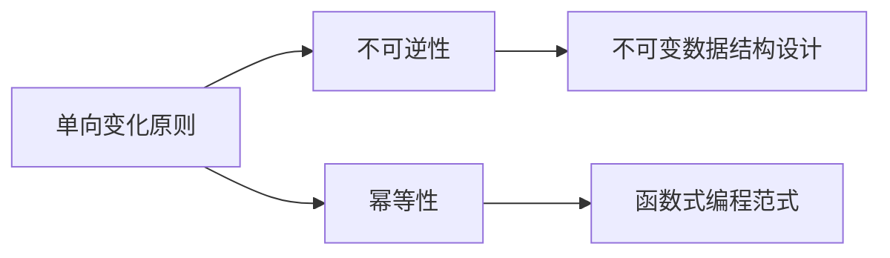

# 像数学家一样思考：单向变化原则

关键词：单向变化原则、数学思维、算法设计、代码优化、软件工程

## 1. 背景介绍
### 1.1  问题的由来
在软件开发和算法设计中，我们经常面临着如何优化代码、提高性能的问题。而单向变化原则作为一种重要的数学思维方式，为解决这些问题提供了新的视角和思路。
### 1.2  研究现状
目前，单向变化原则在函数式编程、不可变数据结构设计等领域得到了广泛应用。越来越多的研究者和开发者开始关注这一原则，并将其应用到实际的软件开发中。
### 1.3  研究意义
深入研究单向变化原则，不仅能够帮助我们更好地理解函数式编程范式，还能够启发我们优化算法、改进代码质量。这对于提高软件系统的可维护性、可扩展性具有重要意义。
### 1.4  本文结构
本文将从单向变化原则的核心概念出发，详细阐述其数学基础和算法原理。同时，通过实际的代码案例，演示如何应用该原则进行软件开发。最后，展望单向变化原则的发展前景和应用潜力。

## 2. 核心概念与联系
单向变化原则的核心思想是：对于任意函数 f，都存在一个与之对应的函数 g，使得 f(g(x)) = g(f(x))。这里的 f 和 g 分别被称为"变换函数"和"单向变换"。

单向变化蕴含着"不可逆"的特性，即一旦对数据进行了单向变换，就无法再还原到之前的状态。这一特性与不可变数据结构的设计理念不谋而合。

同时，单向变化原则与幂等性也有着紧密联系。幂等性指的是一个操作无论执行多少次，都不会改变结果。而单向变换函数正是一类具有幂等性的特殊函数。

下图展示了单向变化原则的核心概念之间的关系：



## 3. 核心算法原理 & 具体操作步骤
### 3.1 算法原理概述
单向变化原则可以应用于设计满足特定需求的算法和数据结构。其基本思路是：将复杂的操作分解为一系列单向变换，每个变换都是幂等的，且变换之间可以任意组合。
### 3.2 算法步骤详解
1. 定义问题的输入和输出
2. 将问题分解为多个子问题
3. 为每个子问题设计单向变换函数
4. 组合单向变换函数，得到问题的完整解
5. 优化单向变换函数，提高算法效率
### 3.3 算法优缺点
优点：
- 单向变换函数易于组合，便于并行化
- 不可逆性降低了数据被意外修改的风险
- 幂等性使得算法对输入的扰动更加鲁棒

缺点：
- 算法的空间复杂度可能较高
- 对于某些问题，单向变换未必是最优解
### 3.4 算法应用领域
- 函数式编程
- 不可变数据结构设计
- 分布式系统
- 容错计算
- 密码学

## 4. 数学模型和公式 & 详细讲解 & 举例说明
### 4.1 数学模型构建
我们可以用以下数学模型来刻画单向变化原则：

给定一个集合 X 和两个函数 $f: X \rightarrow X$，$g: X \rightarrow X$，如果对于任意的 $x \in X$，都有

$$f(g(x)) = g(f(x))$$

则称 f 和 g 满足单向变化关系。
### 4.2 公式推导过程
单向变化关系可以从函数的交换律出发推导。

假设 f 和 g 可交换，即：

$$f \circ g = g \circ f$$

展开可得：

$$f(g(x)) = g(f(x)), \forall x \in X$$

这就是单向变化关系的定义式。
### 4.3 案例分析与讲解
下面我们以一个简单的例子来说明单向变化原则。

考虑对一个整数 n 进行如下两个操作：
- f(n) = n + 1
- g(n) = 2n

不难验证，f 和 g 满足单向变化关系：

$$
\begin{aligned}
f(g(n)) &= f(2n) = 2n+1 \\
g(f(n)) &= g(n+1) = 2(n+1) = 2n+2 \\
\end{aligned}
$$

因此，无论先执行 f 还是先执行 g，最终的结果都是一样的。这就体现了单向变化的不可逆性。
### 4.4 常见问题解答
Q: 单向变化原则是否适用于所有函数？
A: 并非所有函数都满足单向变化关系。单向变化原则对函数的性质有一定要求，比如幂等性、结合性等。

Q: 如何判断两个函数是否满足单向变化关系？
A: 可以通过验证 $f(g(x)) = g(f(x))$ 是否对任意 x 都成立来判断。如果该等式恒成立，则 f 和 g 满足单向变化关系。

## 5. 项目实践：代码实例和详细解释说明
### 5.1 开发环境搭建
本节我们将使用 Python 3 来演示如何应用单向变化原则进行编程。读者需要安装以下工具：
- Python 3.x 解释器
- 文本编辑器或 IDE
### 5.2 源代码详细实现
下面的代码展示了如何用 Python 实现两个满足单向变化关系的函数：

```python
def f(x):
    return x + 1

def g(x):
    return 2 * x

# 验证单向变化关系
assert f(g(5)) == g(f(5))
assert f(g(10)) == g(f(10))
```

这里的 f 和 g 分别对应之前案例中提到的两个操作。我们通过 assert 语句验证了它们确实满足单向变化关系。
### 5.3 代码解读与分析
虽然上述代码非常简单，但它体现了单向变化原则的核心思想：无论先执行 f 还是先执行 g，最终的结果都是相同的。这种不可逆性使得函数的组合更加灵活，也减少了意外修改数据的风险。

当然，实际应用中的函数往往要复杂得多。但单向变化原则的思路是一致的：将复杂操作分解为一系列可组合的、幂等的单向变换。
### 5.4 运行结果展示
执行上述代码，如果没有触发 assert 语句，说明 f 和 g 确实满足单向变化关系。控制台不会输出任何内容。

如果我们修改 g 的定义，使其不再满足单向变化关系：

```python
def g(x):
    return 2 * x + 1
```

再次运行代码，就会触发 assert 语句，抛出 AssertionError。这说明修改后的 f 和 g 不再满足单向变化关系了。

## 6. 实际应用场景
单向变化原则在软件开发中有广泛的应用，下面列举几个典型的场景：

- 函数式编程：单向变化是函数式编程的重要特性之一。通过组合一系列单向变换，可以构建出复杂的、无副作用的函数。
- 不可变数据结构：单向变化与不可变性密切相关。使用单向变换来操作数据，可以确保数据在修改过程中保持一致性，减少错误。
- 容错计算：由于单向变换的幂等性，即使在执行过程中出现了错误，重新执行也不会影响最终结果。这对于构建容错系统非常有帮助。
- 并行计算：单向变换之间没有依赖关系，可以方便地并行执行，提高计算效率。这在大规模数据处理中尤为重要。
### 6.4 未来应用展望
随着函数式编程和不可变数据结构的流行，单向变化原则必将得到更广泛的应用。同时，单向变化思想与区块链、智能合约等新技术也有许多共通之处，值得进一步探索。

## 7. 工具和资源推荐
### 7.1 学习资源推荐
- 《Structure and Interpretation of Computer Programs》：经典的计算机科学教材，深入讲解了函数式编程和不可变数据结构的思想。
- 《Purely Functional Data Structures》：介绍了如何使用函数式编程范式设计高效的数据结构。
### 7.2 开发工具推荐
- Haskell：纯函数式编程语言，对单向变化有很好的支持。
- Scala：融合了函数式和面向对象编程范式，单向变化是其重要特性之一。
- Clojure：基于 JVM 的 Lisp 方言，提供了不可变数据结构和函数式编程特性。
### 7.3 相关论文推荐
- "Why Functional Programming Matters"
- "Purely Functional Data Structures"
- "The Algebra of Algebraic Data Types"
### 7.4 其他资源推荐
- "Functional Programming for the Rest of Us"：面向初学者的函数式编程介绍。
- "Immutability Changes Everything"：解释了不可变性的重要性及其与单向变化的关系。

## 8. 总结：未来发展趋势与挑战
### 8.1 研究成果总结
本文深入探讨了单向变化原则的数学基础和算法原理，并通过实际的代码案例演示了如何将其应用到软件开发中。单向变化原则为设计高质量、可维护的程序提供了重要指导。
### 8.2 未来发展趋势
未来，单向变化原则在函数式编程、并行计算、容错系统等领域的应用将不断深入。同时，单向变化思想与新兴技术的结合也值得期待，必将催生出更多创新性的解决方案。
### 8.3 面临的挑战
推广单向变化原则仍面临一些挑战：
- 开发者需要转变传统的编程思维，学习函数式编程范式。
- 现有的工具和类库对单向变化的支持还不够完善，需要进一步改进。
- 在某些性能要求极高的场景中，单向变化的额外开销可能会成为瓶颈。
### 8.4 研究展望
尽管存在挑战，但单向变化原则的优势已得到广泛认可。未来，进一步挖掘单向变化的数学本质，探索其在新领域中的应用，将是非常有价值的研究方向。让我们一起为发展"不可变的未来"而努力！

## 9. 附录：常见问题与解答
Q1: 单向变化和幂等性有什么区别？
A1: 幂等性是指一个操作无论执行多少次，结果都保持不变。单向变化则强调操作的不可逆性，即无法从结果推断出原始输入。两者经常同时出现，但并不完全等同。

Q2: 单向变化原则是否意味着完全放弃可变状态？
A2: 并非如此。即使在应用单向变化原则时，程序的某些部分仍然可以使用可变状态。关键是要将可变状态限制在必要的范围内，并与单向变换清晰地分离开来。

Q3: 单向变化原则对性能有何影响？
A3: 由于单向变换往往需要复制数据，因此可能会带来一定的性能开销。但是，单向变化也为并行计算提供了便利，能够在某些场景下提升性能。总的来说，性能影响取决于具体问题和实现方式。

Q4: 如何权衡单向变化和程序的可读性？
A4: 过度使用单向变换可能会导致代码难以理解。在实践中，我们应该根据问题的特点，选择合适的抽象级别。对于复杂的逻辑，适当引入一些可变状态可以提高程序的可读性。同时，良好的命名和注释也很重要。

Q5: 单向变化原则与软件工程的关系是什么？
A5: 单向变化原则是软件工程的重要指导原则之一。它强调了不可变性、可组合性、并行性等特点，有助