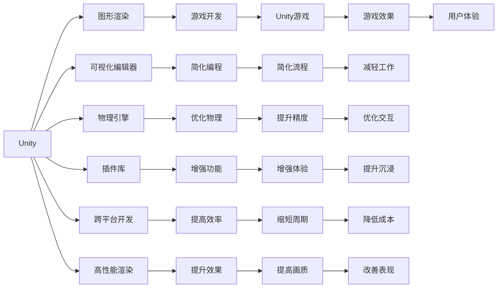

                 

# 游戏框架发展：Unity 和 Unreal Engine 4

> 关键词：Unity, Unreal Engine, 游戏引擎, 游戏开发, 图形渲染, 游戏框架

## 1. 背景介绍

### 1.1 问题由来

随着数字娱乐产业的快速发展，游戏开发逐渐成为最具商业潜力的领域之一。游戏框架作为游戏开发的底层引擎，对于提升开发效率、降低开发成本、提升游戏表现等方面有着至关重要的作用。然而，传统游戏框架存在开发复杂度高、可扩展性差、开发周期长等弊端，严重制约了游戏开发效率的提升。

随着技术的不断演进，现代游戏框架应运而生，它们通过引入先进的图形渲染技术、高效的编程模型、丰富的插件库等，大幅提升了游戏开发的效率和效果。其中，Unity和Unreal Engine 4是近年来最为流行的两大游戏框架，它们各自有着独特的优势和应用场景。本文将系统介绍Unity和Unreal Engine 4的发展历程、核心原理和应用场景，希望能为游戏开发者提供一些有价值的参考。

## 2. 核心概念与联系

### 2.1 核心概念概述

为更好地理解Unity和Unreal Engine 4，本节将介绍几个密切相关的核心概念：

- **Unity**：由Unity Technologies公司开发的游戏引擎，支持跨平台开发，提供丰富的可视化编辑器、强大的物理引擎和大量插件，广泛应用于PC、移动、网页等平台的游戏开发。
- **Unreal Engine 4**：由Epic Games开发的游戏引擎，以其先进的渲染技术、高精度物理引擎和可编程的材质系统著称，广泛应用于高端PC游戏、电影特效制作等场景。
- **游戏引擎**：是开发游戏的底层工具，负责管理游戏中的各种资源、渲染场景、处理用户输入、管理游戏逻辑等，是游戏开发的基础设施。
- **图形渲染**：游戏引擎的核心功能之一，负责将3D场景转换为2D图像并显示在屏幕上，是实现逼真游戏效果的关键。
- **游戏框架**：在传统游戏引擎基础上，通过引入现代编程技术、优化渲染算法、增强开发工具等方式，提升游戏开发效率和效果的技术平台。

这些核心概念之间的逻辑关系可以通过以下Mermaid流程图来展示：



这个流程图展示了Unity的核心功能和应用场景：

1. Unity通过图形渲染将3D场景转换为2D图像并显示，是游戏开发的基础。
2. 可视化编辑器、物理引擎和插件库等组件，简化了编程过程，优化了渲染效果。
3. 跨平台开发、高性能渲染和丰富的功能扩展，提升了开发效率和游戏效果。

## 3. 核心算法原理 & 具体操作步骤

### 3.1 算法原理概述

Unity和Unreal Engine 4的算法原理主要集中在图形渲染、物理引擎、人工智能和实时仿真等方面。它们通过引入先进的图形渲染技术、物理引擎和AI算法，大幅提升了游戏开发的效率和效果。

- **图形渲染**：Unity和Unreal Engine 4均采用了先进的图形渲染技术，包括高精度渲染管线、实时阴影、全局光照等，提升了游戏的视觉效果。
- **物理引擎**：通过引入物理引擎，游戏可以更真实地模拟现实世界的物理现象，如碰撞、重力、摩擦等。
- **人工智能**：利用AI算法实现游戏角色的智能行为，如自主导航、情感交互等，提升游戏的互动性和沉浸感。
- **实时仿真**：通过实时计算和仿真，游戏可以动态生成复杂的场景和交互效果，提升游戏体验。

### 3.2 算法步骤详解

Unity和Unreal Engine 4的核心算法步骤大致相同，可以分为以下几步：

**Step 1: 初始化环境**
- 设置游戏引擎版本、分辨率、帧率等参数。
- 加载游戏资产，包括3D模型、纹理、音频等。
- 配置渲染器、物理引擎等核心组件。

**Step 2: 渲染场景**
- 将3D场景转换为2D图像。
- 实现高精度渲染、实时阴影、全局光照等特效。
- 进行图形优化，提升渲染效率。

**Step 3: 处理输入**
- 接收用户输入，如键盘、鼠标、触摸屏等。
- 处理输入信号，实现游戏逻辑。
- 更新游戏状态，进行游戏交互。

**Step 4: 更新物理**
- 实现物理引擎，模拟碰撞、重力、摩擦等效果。
- 进行实时仿真，动态生成复杂场景和交互效果。
- 优化物理计算，提升渲染效率。

**Step 5: 人工智能交互**
- 引入AI算法，实现角色智能行为，如自主导航、情感交互等。
- 实现NPC行为控制，提升游戏互动性。
- 优化AI算法，提升智能效果。

**Step 6: 调试和优化**
- 使用调试工具，排查渲染、物理、AI等方面的问题。
- 进行性能优化，提升游戏表现。
- 进行自动化测试，确保游戏稳定性。

### 3.3 算法优缺点

Unity和Unreal Engine 4的优势包括：

- ** Unity**：
  - 跨平台支持，开发效率高，适合快速原型开发和多人协作。
  - 社区生态丰富，插件库丰富，功能强大。
  - 可视化编辑器，降低编程难度，提升开发效率。

- **Unreal Engine 4**：
  - 高精度渲染，视觉效果逼真，适合高质量游戏开发。
  - 可编程材质系统，支持自定义渲染效果。
  - 强大的物理引擎，支持复杂的物理仿真。

但这些框架也存在一些缺点：

- ** Unity**：
  - 渲染性能相对较低，不适合高端游戏开发。
  - 部分功能需要付费解锁，增加了开发成本。

- **Unreal Engine 4**：
  - 学习曲线较陡，需要较长的学习时间。
  - 资源占用较大，对硬件要求高。

### 3.4 算法应用领域

Unity和Unreal Engine 4在游戏开发、电影特效制作、虚拟现实等领域得到了广泛应用：

- **游戏开发**：Unity和Unreal Engine 4在游戏开发领域占据主导地位，广泛应用于PC、移动、网页等平台的游戏开发。
- **电影特效**：Unreal Engine 4凭借其高精度渲染和物理引擎，被广泛应用于电影特效制作，如《阿凡达》、《复仇者联盟》等。
- **虚拟现实**：Unity和Unreal Engine 4在虚拟现实领域也有广泛应用，支持用户进行虚拟环境交互和实时体验。

## 4. 数学模型和公式 & 详细讲解 & 举例说明

### 4.1 数学模型构建

本节将使用数学语言对Unity和Unreal Engine 4的图形渲染技术进行更加严格的刻画。

- **Unity**：
  - 图形渲染管道：包括顶点着色器、像素着色器、光照处理、纹理贴图等环节。
  - 实时阴影：通过计算光源到物体表面的距离，实现实时阴影效果。
  - 全局光照：利用BRDF模型计算物体的表面光照，提升渲染效果。

- **Unreal Engine 4**：
  - 图形渲染管道：包括像素着色器、光照处理、纹理贴图等环节。
  - 实时阴影：通过计算光源到物体表面的距离，实现实时阴影效果。
  - 全局光照：利用全局光照算法，计算物体表面的间接光照效果。

### 4.2 公式推导过程

以Unity的实时阴影算法为例，进行公式推导：

$$
L_{shadow}(x,y) = \frac{I(x,y)}{D(x,y)}
$$

其中，$L_{shadow}$为阴影强度，$I(x,y)$为光照强度，$D(x,y)$为光源到物体表面的距离。

通过将光照强度和光源距离代入上述公式，可以计算出每个像素的阴影强度，从而实现实时阴影效果。

### 4.3 案例分析与讲解

以Unity的高精度渲染为例，分析其渲染管线的优化过程：

- **顶点着色器**：将3D模型转换为2D图形，计算顶点坐标、法线、颜色等信息。
- **像素着色器**：对每个像素进行渲染，计算其颜色和光照效果。
- **光照处理**：计算光源和相机的位置，计算光照强度和阴影效果。
- **纹理贴图**：对物体进行纹理贴图，提升渲染效果。

通过这些步骤，Unity可以实现高精度、高效渲染，提升游戏视觉效果。

## 5. 项目实践：代码实例和详细解释说明

### 5.1 开发环境搭建

进行Unity或Unreal Engine 4项目开发，首先需要搭建开发环境：

- **Unity**：
  - 下载Unity Hub，选择适合的版本和平台。
  - 安装Unity编辑器、脚本编辑器等工具。
  - 配置开发环境，如IDE、编译器、调试器等。

- **Unreal Engine 4**：
  - 下载Unreal Engine，选择适合的版本和平台。
  - 安装Unreal Engine编辑器、插件管理器等工具。
  - 配置开发环境，如IDE、编译器、调试器等。

### 5.2 源代码详细实现

以下是一个简单的Unity项目代码示例：

```csharp
using UnityEngine;

public class ExampleScript : MonoBehaviour
{
    void Update()
    {
        // 处理输入
        if (Input.GetMouseButtonDown(0))
        {
            // 发射子弹
            Rigidbody rb = GetComponent<Rigidbody>();
            rb.AddForce(Vector3.up * 1000f);
        }
    }
}
```

这个代码示例实现了使用Unity编辑器中的物理引擎，发射一个子弹。

### 5.3 代码解读与分析

代码中使用了Unity的物理引擎，将子弹发射的逻辑嵌入到游戏对象中。代码通过`Input.GetMouseButtonDown(0)`获取鼠标按下事件，并通过`Rigidbody.AddForce()`将子弹发射出去。

在实际开发中，可以通过` GetComponent<Rigidbody>()`获取物体上的刚体组件，进而对其施加力。这种编码方式简化了代码，提高了开发效率。

## 6. 实际应用场景

### 6.1 游戏开发

Unity和Unreal Engine 4在游戏开发中得到了广泛应用。以Unity为例，其跨平台支持、强大的物理引擎和丰富的插件库，使得游戏开发效率大幅提升。例如，独立游戏开发者可以使用Unity的2D绘画工具，快速创建丰富的视觉内容，如像素游戏、角色扮演游戏等。

### 6.2 电影特效制作

Unreal Engine 4凭借其高精度渲染和物理引擎，被广泛应用于电影特效制作。例如，《阿凡达》中的环境渲染、角色动态建模等，都是使用Unreal Engine 4实现的。

### 6.3 虚拟现实

Unity和Unreal Engine 4在虚拟现实领域也有广泛应用。开发者可以使用这些引擎，创建逼真的虚拟环境，实现用户与虚拟世界的互动。例如，VR游戏、虚拟旅游、虚拟会议等。

### 6.4 未来应用展望

未来，Unity和Unreal Engine 4将进一步发展，拓展其应用场景：

- **增强现实**：Unity和Unreal Engine 4可以用于开发增强现实应用，如AR游戏、教育应用等。
- **自动驾驶**：游戏引擎中的物理引擎和AI算法，可以为自动驾驶提供基础技术支持。
- **机器人**：游戏引擎中的物理引擎和渲染技术，可以为机器人提供逼真模拟环境。

## 7. 工具和资源推荐

### 7.1 学习资源推荐

为帮助开发者掌握Unity和Unreal Engine 4，这里推荐一些优质的学习资源：

- **Unity官方文档**：Unity的官方文档，提供了详细的教程、示例和插件库，是学习Unity的最佳资源。
- **Unreal Engine 4官方文档**：Unreal Engine 4的官方文档，提供了详细的教程、示例和插件库，是学习Unreal Engine 4的最佳资源。
- **Udemy**：提供大量Unity和Unreal Engine 4的在线课程，涵盖从入门到高级的内容。
- **Coursera**：提供Unity和Unreal Engine 4的在线课程，由业内专家授课，内容全面。
- **GDC游戏开发者大会**：每年举办的GDC游戏开发者大会，展示了最新的游戏开发技术，提供大量学习资源。

### 7.2 开发工具推荐

以下是几款用于Unity和Unreal Engine 4开发的高效工具：

- **Unity Hub**：Unity官方的应用程序管理器，可以快速安装和更新Unity编辑器和插件。
- **Unreal Engine Editor**：Unreal Engine 4的编辑器，提供了强大的可视化开发环境。
- **Visual Studio**：Unity和Unreal Engine 4的集成开发环境，支持代码调试和编译。
- **Git**：版本控制系统，可以管理开发过程中的代码变更和协作。
- **GitHub**：代码托管平台，可以共享和管理代码。

### 7.3 相关论文推荐

Unity和Unreal Engine 4的发展源于学界的持续研究。以下是几篇奠基性的相关论文，推荐阅读：

- **Unity Development Kit**：描述了Unity编辑器和脚本语言的基本原理和开发方法。
- **Unreal Engine 4: Real-Time Rendering and 3D Game Design**：介绍了Unreal Engine 4的核心技术和高精度渲染算法。
- **Real-time Global Illumination in Unity**：描述了Unity引擎中的全局光照算法和优化方法。
- **Unreal Engine 4: Virtual reality for a new generation of games**：介绍了Unreal Engine 4在虚拟现实游戏开发中的应用。

这些论文代表了Unity和Unreal Engine 4的发展脉络，通过学习这些前沿成果，可以帮助研究者把握技术前进方向，激发更多的创新灵感。

## 8. 总结：未来发展趋势与挑战

### 8.1 总结

本文对Unity和Unreal Engine 4的发展历程、核心原理和应用场景进行了系统介绍。首先阐述了Unity和Unreal Engine 4的背景和优势，明确了它们在游戏开发、电影特效制作、虚拟现实等领域的重要地位。其次，从原理到实践，详细讲解了Unity和Unreal Engine 4的核心算法和操作步骤，给出了完整的代码实例和解释说明。最后，本文还广泛探讨了Unity和Unreal Engine 4在实际应用场景中的广泛应用，展示了其巨大的潜力和市场前景。

通过本文的系统梳理，可以看到，Unity和Unreal Engine 4作为现代游戏框架，不仅提升了游戏开发的效率和效果，还开辟了新的应用场景。相信随着技术的不断演进，Unity和Unreal Engine 4必将在游戏开发、电影特效制作、虚拟现实等领域发挥更大的作用，推动数字娱乐产业的进一步发展。

### 8.2 未来发展趋势

展望未来，Unity和Unreal Engine 4将呈现以下几个发展趋势：

- **技术升级**：不断引入先进技术，提升渲染精度、优化物理引擎、增强AI算法等，提升游戏效果和用户体验。
- **生态扩展**：进一步丰富插件库和开发工具，提升开发效率和工具易用性，吸引更多开发者加入生态系统。
- **跨平台支持**：进一步拓展跨平台支持，支持更多的设备和平台，降低开发成本。
- **硬件适配**：优化渲染引擎，适配不同硬件设备，提升渲染效率和效果。

这些趋势展示了Unity和Unreal Engine 4的广阔前景，相信随着技术的不断进步，它们将为游戏开发和数字娱乐产业带来更大的价值。

### 8.3 面临的挑战

尽管Unity和Unreal Engine 4在游戏开发领域占据主导地位，但在迈向更加智能化、普适化应用的过程中，它们仍面临着诸多挑战：

- **渲染性能**：随着游戏画面和效果的不断提升，对渲染性能的要求越来越高，如何优化渲染引擎，提升渲染效率，是重要的研究课题。
- **资源占用**：大型的游戏项目对硬件资源的需求越来越高，如何优化资源使用，提升开发效率，是亟待解决的问题。
- **编程难度**：部分功能需要较强的编程技能，对于初学者来说有一定的学习难度，如何降低编程难度，提升开发效率，是未来的挑战。
- **社区支持**：虽然目前社区活跃度较高，但如何进一步提升社区支持，吸引更多的开发者加入，是一个长期的挑战。
- **版本兼容性**：不同版本之间的兼容性问题，可能会影响开发者的工作效率，如何解决这个问题，是重要的研究方向。

这些挑战需要开发者和工程师共同努力，不断优化和改进，才能使Unity和Unreal Engine 4在未来的发展中更加成熟和稳定。

### 8.4 研究展望

未来的研究需要在以下几个方面寻求新的突破：

- **图形渲染优化**：进一步优化渲染引擎，提升渲染效率和效果，支持更高的画面质量和更复杂的场景。
- **物理引擎改进**：改进物理引擎，支持更复杂的物理仿真和更逼真的物理效果。
- **AI算法优化**：优化AI算法，提升角色智能行为和互动效果，增强游戏沉浸感。
- **跨平台支持拓展**：拓展跨平台支持，支持更多设备和平台，降低开发成本。
- **社区生态建设**：加强社区支持，提升开发者协作效率，吸引更多开发者加入。

这些研究方向展示了Unity和Unreal Engine 4的未来发展方向，相信随着研究的不断深入和技术的不断进步，它们将为游戏开发和数字娱乐产业带来更大的价值。

## 9. 附录：常见问题与解答

**Q1：Unity和Unreal Engine 4的渲染性能有何区别？**

A: Unity和Unreal Engine 4的渲染性能各有优劣。Unity在渲染精度和帧率上略逊于Unreal Engine 4，但在大规模多玩家场景中表现更为稳定。Unreal Engine 4在高精度渲染和光影效果上更优，适合制作高质量的3D游戏和电影特效。

**Q2：Unity和Unreal Engine 4的学习曲线有何区别？**

A: Unity的学习曲线相对较低，适合初学者快速上手，支持快速原型开发和多人协作。Unreal Engine 4的学习曲线较陡，需要较长的学习时间，但具有更高的渲染精度和更强大的物理引擎。

**Q3：如何选择合适的游戏引擎？**

A: 选择游戏引擎需要综合考虑以下几个因素：
- **游戏类型**：不同的游戏类型对引擎的要求不同，例如，2D游戏可以选择Unity，3D游戏可以选择Unreal Engine 4。
- **团队技能**：考虑团队成员的技能水平，选择更适合的引擎。
- **预算和资源**：考虑项目预算和硬件资源，选择适合的引擎。
- **开发周期**：考虑开发周期和项目需求，选择更高效的引擎。

**Q4：Unity和Unreal Engine 4的性能优化有哪些方法？**

A: 性能优化是游戏开发中的重要环节，可以通过以下方法进行优化：
- **渲染优化**：优化渲染管线，提升渲染效率和效果。
- **物理优化**：优化物理引擎，提升物理仿真效果。
- **代码优化**：优化代码，减少不必要的计算和内存消耗。
- **资源优化**：优化资源使用，减少资源加载和内存占用。
- **硬件适配**：适配不同硬件设备，提升渲染性能。

**Q5：Unity和Unreal Engine 4的开发工具有何区别？**

A: Unity和Unreal Engine 4的开发工具各有优劣。Unity的可视化编辑器和插件库丰富，开发效率高，适合快速原型开发。Unreal Engine 4的编辑器功能强大，支持可编程材质和高级渲染技术，适合制作高质量的游戏和电影特效。

---

作者：禅与计算机程序设计艺术 / Zen and the Art of Computer Programming

