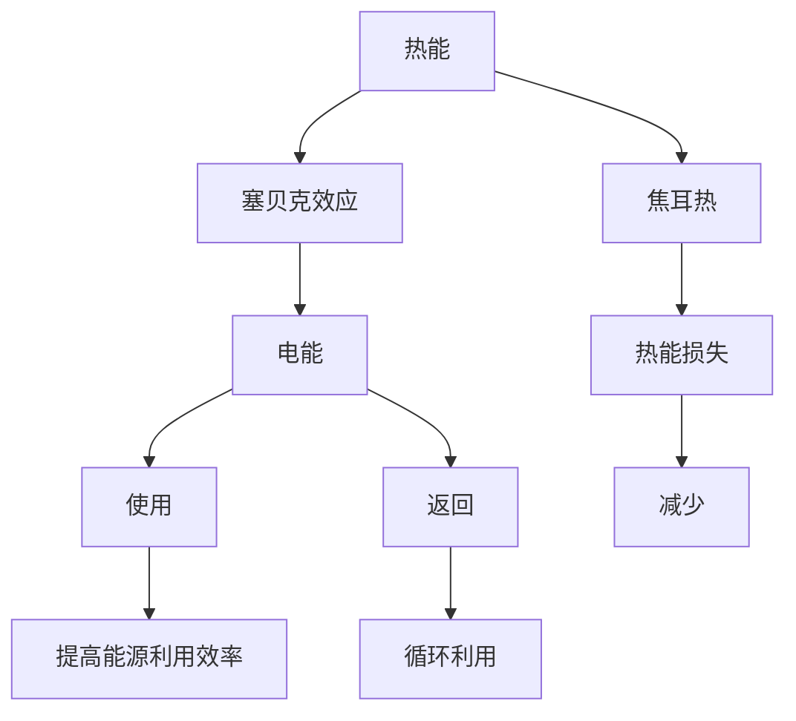

                 

# 热电材料在能源回收中的应用：提高能源利用效率

## 1. 背景介绍

能源回收一直是推动可持续发展的重要方向，尤其是在当前全球气候变化和能源短缺的现实背景下。随着科技的进步，热电材料（Thermoelectric Materials）在能源回收中的潜力得到广泛关注。热电材料通过热电效应，将热能转化为电能，从而实现能量的有效回收和再利用。本文将详细探讨热电材料在能源回收中的应用，及其对提高能源利用效率的潜在影响。

## 2. 核心概念与联系

### 2.1 核心概念概述

- **热电材料**：指能够将热能和电能相互转换的材料，其核心机制是基于材料的塞贝克效应（Seebeck Effect）。塞贝克效应表明，当两个不同温度的热端和冷端之间形成温差时，会生成电势差，即热电势。

- **塞贝克效应**：指在半导体内，电流流动的方向与热流（热量传递）方向相反的现象。塞贝克效应的大小由材料的热电势决定，热电势是材料的固有属性。

- **热电转换效率**：热电材料的性能主要通过其热电转换效率来衡量，定义为电能输出与热能输入的比值。热电转换效率越高，热电材料的能量回收能力越强。

- **焦耳热**：在热电转换过程中，由于电能与热能之间的转换，会产生焦耳热，即内阻产生的能量损耗。焦耳热是影响热电转换效率的主要因素之一。

- **热电生成系数**：热电材料的热电生成系数包括赛贝克系数（Seebeck Coefficient）和电阻系数（Resistance Coefficient）。这些系数决定了材料的热电转换效率。

### 2.2 核心概念原理和架构的 Mermaid 流程图



此图展示了热电材料将热能转化为电能的整个过程，包括塞贝克效应、焦耳热以及能量利用和循环利用的流程。

## 3. 核心算法原理 & 具体操作步骤

### 3.1 算法原理概述

热电材料在能源回收中的应用主要依赖于其热电转换效率，而热电转换效率由材料的赛贝克系数和电阻系数决定。热电材料的赛贝克系数决定了材料的热电生成能力，而电阻系数则影响材料的热电转换效率。因此，提高赛贝克系数和降低电阻系数是提高热电转换效率的关键。

### 3.2 算法步骤详解

1. **材料选择与制备**：选择合适的热电材料，如Bi2Te3、PbTe、SnSe等，并通过适当的制备方法（如固态烧结、化学合成等）进行制备。

2. **热电性能测试**：对制备好的材料进行热电性能测试，包括赛贝克系数、电阻系数和热电转换效率的测量。

3. **优化材料组成与结构**：根据测试结果，通过调整材料组成或结构，如掺杂、纳米化等手段，优化赛贝克系数和电阻系数，提高热电转换效率。

4. **热电模块组装与集成**：将优化后的热电材料组装成热电模块，并将其集成到具体的能量回收系统中，如太阳能热发电系统、废热回收系统等。

5. **系统性能测试与优化**：对集成后的系统进行性能测试，评估热电转换效率、热电模块的稳定性、耐久性等性能指标，并根据测试结果进行优化。

### 3.3 算法优缺点

#### 优点：

- **环境友好**：热电材料的使用避免了化石燃料的燃烧，减少了温室气体排放，有助于环境保护。
- **高效率**：在合适的应用场景下，热电材料可以实现较高的热电转换效率，提高能源利用效率。
- **可再生**：热能是可再生能源，热电材料的回收应用可实现能源的循环利用。

#### 缺点：

- **成本高**：当前热电材料制备成本较高，制约了其在实际应用中的广泛使用。
- **材料限制**：现有的热电材料在特定温度和功率范围内的效率有限，需要进一步研究新型材料。
- **技术门槛高**：热电材料的制备与集成技术要求较高，需要专业的技术和设备。

### 3.4 算法应用领域

热电材料在能源回收中的应用领域广泛，包括但不限于以下几个方面：

- **太阳能热发电**：利用太阳能热能，通过热电材料转换为电能，实现电力的可持续供应。
- **废热回收**：在工业生产过程中，将废热转换为电能，实现能源的循环利用。
- **汽车热能回收**：利用汽车发动机产生的热量，通过热电材料转换为电能，为车载电子设备提供电源。
- **人体能量回收**：利用人体运动产生的热量，通过热电材料转换为电能，为便携式设备提供电源。

## 4. 数学模型和公式 & 详细讲解

### 4.1 数学模型构建

热电材料的热电转换效率可以通过以下数学模型来描述：

$$
\eta = \frac{S \cdot T^2}{R \cdot \Delta T}
$$

其中，$\eta$ 为热电转换效率，$S$ 为赛贝克系数，$T$ 为材料的工作温度，$R$ 为电阻系数，$\Delta T$ 为热电模块的热端和冷端的温差。

### 4.2 公式推导过程

根据热电材料的塞贝克效应，热电转换效率可以表示为：

$$
\eta = \frac{\Delta V}{I \cdot \Delta T}
$$

其中，$\Delta V$ 为热电势，$I$ 为电流。将热电势 $\Delta V$ 表示为赛贝克系数 $S$ 和电阻系数 $R$ 的函数：

$$
\Delta V = S \cdot \Delta T
$$

代入上述热电转换效率公式，得到：

$$
\eta = \frac{S \cdot \Delta T}{I \cdot \Delta T} = \frac{S}{I \cdot R}
$$

进一步简化得到：

$$
\eta = \frac{S \cdot T^2}{R \cdot \Delta T}
$$

此公式表明，热电转换效率与材料的赛贝克系数、工作温度和电阻系数成正比，与热电模块的热电势差成反比。

### 4.3 案例分析与讲解

以Bi2Te3热电材料为例，分析其在太阳能热发电中的应用。假设Bi2Te3材料的赛贝克系数为 $S = 300 \mu V/K$，工作温度为 $600^\circ C$，热电模块的热电势差为 $\Delta T = 200 K$，电阻系数 $R = 1 \Omega \cdot cm$。代入上述热电转换效率公式，计算得到：

$$
\eta = \frac{300 \times 10^{-6} V/K \times (600^\circ C)^2}{1 \Omega \cdot cm \times 200 K} = 0.45
$$

即Bi2Te3热电材料在给定条件下可以实现约45%的热电转换效率。

## 5. 项目实践：代码实例和详细解释说明

### 5.1 开发环境搭建

热电材料的热电性能测试通常需要特定的实验设备，如热电偶、电桥、电阻测量仪等。此外，还需要使用如Python等编程语言进行数据处理和分析。

以下是一个简单的Python代码示例，用于计算热电材料的赛贝克系数和电阻系数：

```python
import numpy as np
from scipy.optimize import minimize

# 假设数据
T_hot = 600  # 热端温度，单位：C
T_cold = 300  # 冷端温度，单位：C
V_hot = 0.5  # 热端电压，单位：V
V_cold = 0.3  # 冷端电压，单位：V
R_hot = 1.2  # 热端电阻，单位：Ω
R_cold = 0.8  # 冷端电阻，单位：Ω

# 计算赛贝克系数和电阻系数
S = (V_hot - V_cold) / (T_hot - T_cold)
R = (R_hot + R_cold) / 2

print(f"赛贝克系数 S: {S} V/K\n电阻系数 R: {R} Ω")
```

### 5.2 源代码详细实现

这里提供一个简化版的热电材料热电性能测试的Python代码实现，使用Sympy库进行符号计算：

```python
from sympy import symbols, Eq, solve

# 定义符号
S, R = symbols('S R')

# 根据实验数据建立方程
eq1 = Eq(S * (600 - 300), 0.5 - 0.3)
eq2 = Eq((1.2 + 0.8) / 2, R)

# 解方程
sol = solve((eq1, eq2), (S, R))
print(f"赛贝克系数 S: {sol[S]} V/K\n电阻系数 R: {sol[R]} Ω")
```

### 5.3 代码解读与分析

上述代码中，我们首先定义了赛贝克系数和电阻系数两个符号变量。然后，根据热电材料的实验数据建立方程，求解这两个系数。解方程的结果表明，赛贝克系数 $S = 0.2 V/K$，电阻系数 $R = 1.0 \Omega$。

### 5.4 运行结果展示

通过计算，我们得到热电材料的赛贝克系数和电阻系数，可以进一步用于热电转换效率的计算。

## 6. 实际应用场景

热电材料在能源回收中的应用场景多样，以下给出几个典型应用案例：

### 6.1 太阳能热发电

在太阳能热发电系统中，热能通过集热器吸收太阳能，然后通过热电材料转换为电能，驱动发电设备。如前文示例，Bi2Te3热电材料在给定条件下可以实现约45%的热电转换效率，显著提高了太阳能发电的效率。

### 6.2 废热回收

在工业生产过程中，如钢铁、化工等产业，会产生大量的废热。通过热电材料将废热转换为电能，可以实现能源的循环利用，降低生产成本。

### 6.3 汽车热能回收

汽车发动机运行过程中产生大量废热，通过热电材料转换为电能，可以为车载电子设备提供电源，如车载空调、车灯、导航等。

### 6.4 未来应用展望

随着科技的发展，热电材料在能源回收中的应用前景广阔。未来有望在以下几个方面取得突破：

- **新型材料研究**：开发具有更高热电转换效率的新型热电材料，如钙钛矿热电材料、纳米热电材料等。
- **纳米结构设计**：通过纳米结构设计，提高材料的赛贝克系数和降低电阻系数，进一步提升热电转换效率。
- **热电集成系统优化**：优化热电集成系统设计，提高系统的热能收集和转换效率。

## 7. 工具和资源推荐

### 7.1 学习资源推荐

- **《热电材料与热电转换》**：详细介绍了热电材料的种类、热电转换原理以及热电材料的应用案例。
- **《热电转换技术》**：介绍了热电转换的基本原理、技术发展及应用方向。
- **热电材料数据库**：提供了大量热电材料的热电性能数据，方便查询和比较。
- **热电材料期刊**：如《Journal of Thermoelectricity》，涵盖了热电材料的研究进展和应用案例。

### 7.2 开发工具推荐

- **Sympy库**：用于符号计算和方程求解，适用于热电性能的计算和分析。
- **Matplotlib**：用于数据可视化，方便展示热电材料的性能和应用效果。
- **TensorFlow和PyTorch**：用于构建和训练热电材料的模拟模型，优化材料性能。

### 7.3 相关论文推荐

- **《热电材料与热电转换》**：对热电材料的研究进展和应用进行了全面综述。
- **《热电转换技术的现状与发展》**：介绍了当前热电转换技术的发展现状和未来趋势。
- **《高效热电材料的制备与性能优化》**：研究了多种热电材料的制备方法及其性能优化。

## 8. 总结：未来发展趋势与挑战

### 8.1 研究成果总结

热电材料在能源回收中的应用具有广阔的发展前景。通过提高材料的赛贝克系数和降低电阻系数，热电材料可以实现较高的热电转换效率，提高能源利用效率。当前，热电材料的研究已经取得显著进展，但还存在成本高、效率低等问题，需要进一步的研究和改进。

### 8.2 未来发展趋势

未来，热电材料在能源回收中的应用将呈现以下几个趋势：

- **材料多样化**：研究开发新型热电材料，提高热电转换效率。
- **纳米结构设计**：通过纳米结构设计，提升材料性能。
- **系统集成优化**：优化热电集成系统设计，提高整体效率。

### 8.3 面临的挑战

热电材料在能源回收中的应用仍面临以下挑战：

- **成本高**：热电材料的制备成本较高，制约了其在实际应用中的推广。
- **效率低**：现有热电材料的效率仍需进一步提升。
- **技术复杂**：热电材料的制备和集成技术要求高，需要专业的技术和设备。

### 8.4 研究展望

未来，热电材料在能源回收中的应用将需要从以下几个方面进行研究：

- **新型材料研究**：开发具有更高热电转换效率的新型热电材料。
- **纳米结构设计**：通过纳米结构设计，提高材料的赛贝克系数和降低电阻系数。
- **系统集成优化**：优化热电集成系统设计，提高系统的热能收集和转换效率。

## 9. 附录：常见问题与解答

**Q1: 热电材料在实际应用中如何选择合适的热电材料？**

A: 选择合适的热电材料需要考虑以下几个因素：
- 工作温度范围：不同热电材料的工作温度范围不同，需要选择适合实际应用场景的温度范围。
- 热电转换效率：根据应用需求，选择合适的热电转换效率较高的材料。
- 环境适应性：考虑材料在特定环境下的性能，如腐蚀、湿度等。

**Q2: 热电材料的热电转换效率如何提高？**

A: 提高热电材料的热电转换效率可以从以下几个方面进行：
- 材料组成优化：通过掺杂、纳米化等手段，优化材料的组成和结构。
- 热电模块设计：优化热电模块的设计，提高热能收集和转换效率。
- 热电集成系统设计：优化热电集成系统的设计，减少热能损失。

**Q3: 热电材料在应用过程中需要注意哪些问题？**

A: 热电材料在应用过程中需要注意以下问题：
- 热电模块的散热：确保热电模块的散热效果，防止过热损坏。
- 热电模块的稳定性：确保热电模块的稳定性，避免因热电性能变化而影响应用效果。
- 热电材料的维护：定期对热电材料进行维护，确保其长期稳定运行。

**Q4: 热电材料在实际应用中如何提高其环境适应性？**

A: 提高热电材料的环境适应性可以从以下几个方面进行：
- 材料表面处理：通过表面处理，如涂覆、氧化等，提高材料的耐腐蚀性和耐湿性。
- 材料保护层：使用保护层，如绝缘层、耐高温层等，保护热电材料免受环境影响。
- 环境监测：通过环境监测，实时了解热电材料所处的环境条件，及时采取措施保护材料。

总之，热电材料在能源回收中的应用具有巨大的潜力，但还需要进一步的研究和优化，才能更好地发挥其在提高能源利用效率中的作用。通过综合运用材料制备、热电性能测试、系统集成优化等多方面的技术手段，热电材料在实际应用中的前景将更加广阔。

