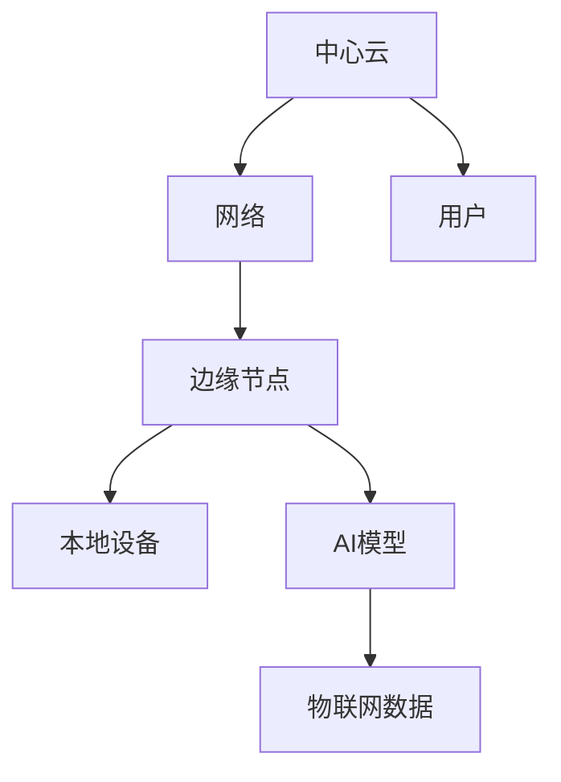
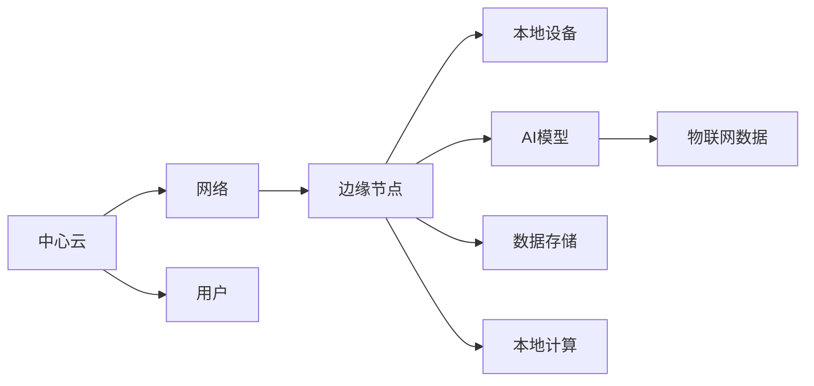

                 

# 物联网边缘计算优势：在设备端处理数据的益处

> 关键词：物联网, 边缘计算, 实时性, 数据隐私, 资源优化, 网络带宽, 人工智能, 雾计算, 工业物联网, 消费电子

## 1. 背景介绍

### 1.1 问题由来
物联网(IoT)在过去几年中迅速发展，已经改变了我们的日常生活和工作方式。IoT设备的应用场景遍及工业自动化、智慧城市、智能家居、消费电子等多个领域。这些设备通过传感器收集大量数据，并通过网络连接传输到云端进行存储和分析。然而，这种基于云的集中式处理模式也带来了诸多问题：

1. **网络带宽限制**：物联网设备通常具有网络带宽受限、延迟较高的特点，将大量数据传输到云端会增加网络负担。
2. **数据隐私和安全**：数据在云端传输和存储过程中，可能面临隐私泄露和数据被篡改的风险。
3. **计算资源浪费**：对于部分低带宽、低延迟需求的场景，集中式处理并不高效，存在计算资源浪费的问题。
4. **系统延迟**：数据处理集中在云端，响应时间较长，无法满足某些实时性要求较高的应用场景。

为了应对这些问题，物联网边缘计算（Edge Computing）应运而生。边缘计算将部分数据处理任务移至物联网设备的本地，通过就近计算和存储，大幅提升了系统的实时性和可靠性，同时保护了数据隐私和安全。

### 1.2 问题核心关键点
物联网边缘计算的本质是将数据处理任务分散到离终端设备更近的“边缘”节点上，以减少数据传输的延迟和带宽消耗，同时保护数据隐私。其主要优势包括：

1. **实时性提升**：通过就近计算，可以显著降低系统延迟，满足实时性要求较高的应用场景。
2. **数据隐私保护**：数据只在本地进行处理，减少了数据传输的环节，降低了隐私泄露的风险。
3. **网络带宽优化**：边缘计算减少了云端的计算负担，优化了网络带宽资源的使用。
4. **资源优化**：边缘计算可以根据设备硬件和网络环境进行动态资源分配，提升系统性能。

边缘计算的核心技术包括：雾计算(Mist Computing)、边缘节点(Micro-Node)、智能合约(Smart Contracts)等，其架构和应用场景如图1所示：



## 2. 核心概念与联系

### 2.1 核心概念概述

边缘计算与传统的云计算（Cloud Computing）模式相比，具有以下关键优势：

- **低延迟**：数据处理在边缘节点进行，减少了数据传输和处理的时延。
- **高实时性**：适用于需要即时响应、快速处理的应用场景。
- **数据隐私**：数据存储和处理在本地进行，降低了数据泄露的风险。
- **网络带宽优化**：减少了大量数据传输到云端的负担，优化了网络带宽资源的使用。

边缘计算的实现离不开以下核心技术：

- **雾计算**：结合了云计算和物联网的特点，通过将数据处理任务分散到边缘节点，优化资源配置。
- **边缘节点**：在数据源附近安装小型服务器，用于就近处理数据。
- **物联网(IoT)设备**：采集和传输数据到边缘节点。
- **智能合约**：在区块链上运行的程序，用于自动执行协议。

### 2.2 核心概念原理和架构的 Mermaid 流程图

以下是边缘计算的架构原理和核心组件的Mermaid流程图：



此图展示了边缘计算的基本架构：数据从IoT设备采集，经过网络传输到边缘节点，在边缘节点进行数据存储和处理，最终将结果返回给用户。

## 3. 核心算法原理 & 具体操作步骤
### 3.1 算法原理概述

边缘计算的核心算法原理主要包括以下几个方面：

1. **本地数据处理**：将部分数据处理任务在本地进行，减少网络传输的延迟和带宽消耗。
2. **分布式计算**：通过多个边缘节点的协同计算，提高系统的处理能力和资源利用率。
3. **智能合约**：在区块链上运行的程序，用于自动执行协议，保护数据隐私和安全。

### 3.2 算法步骤详解

以下是一个详细的边缘计算实现步骤：

1. **数据采集**：IoT设备采集数据，并将数据传输到边缘节点。
2. **数据存储**：边缘节点存储数据，根据设备存储能力和网络带宽进行动态资源分配。
3. **本地计算**：边缘节点在本地对数据进行处理，如数据分析、模型推理等。
4. **结果返回**：处理后的结果返回给用户或上传到中心云。
5. **智能合约执行**：使用智能合约自动执行协议，确保数据传输和处理的安全性。

### 3.3 算法优缺点

边缘计算的主要优点包括：

- **实时性提升**：通过就近计算，显著降低了系统延迟。
- **数据隐私保护**：减少了数据传输环节，降低了数据泄露的风险。
- **网络带宽优化**：减少了大量数据传输到云端的负担，优化了网络带宽资源的使用。
- **资源优化**：根据设备硬件和网络环境进行动态资源分配，提升系统性能。

其缺点主要包括：

- **设备成本高**：边缘计算需要安装和管理多个边缘节点，增加了设备成本和维护工作。
- **复杂性高**：边缘计算系统的设计和维护比传统的云计算更为复杂。
- **安全性问题**：边缘节点和IoT设备的安全性需要重点关注，防止设备被攻击和数据泄露。

### 3.4 算法应用领域

边缘计算广泛应用于以下几个领域：

1. **工业物联网**：在工厂中，边缘计算用于实时监控设备状态、优化生产流程等，提升生产效率。
2. **智慧城市**：在城市管理中，边缘计算用于实时交通管理、环境监测等，提升城市运行效率。
3. **智能家居**：在家庭环境中，边缘计算用于智能设备间的互动、数据分析等，提升用户体验。
4. **消费电子**：在手机、智能手表等设备中，边缘计算用于提升响应速度、保护用户隐私等。

## 4. 数学模型和公式 & 详细讲解 & 举例说明

### 4.1 数学模型构建

边缘计算的数学模型主要包括以下几个方面：

- **数据传输延迟模型**：描述数据从IoT设备传输到边缘节点的延迟。
- **本地计算复杂度模型**：描述数据在边缘节点处理的计算复杂度。
- **资源分配模型**：描述边缘节点如何分配计算和存储资源。

### 4.2 公式推导过程

以数据传输延迟模型为例，假设数据从IoT设备传输到边缘节点的延迟由以下两部分组成：

1. **网络传输延迟**：数据从IoT设备到边缘节点的传输延迟，可以通过公式 $d_{net} = k_{net} \cdot d_{trans}$ 计算，其中 $k_{net}$ 是网络传输系数，$d_{trans}$ 是数据传输距离。
2. **处理延迟**：数据在边缘节点处理的延迟，可以通过公式 $d_{proc} = k_{proc} \cdot d_{data}$ 计算，其中 $k_{proc}$ 是处理系数，$d_{data}$ 是数据量。

### 4.3 案例分析与讲解

假设IoT设备位于边缘节点5公里范围内，数据量为100KB，网络传输速率为10Mbps，处理速率为1Gbps，则数据传输延迟和处理延迟分别为：

$$
d_{net} = 5 \cdot 10^{-3} \cdot 100 \cdot 10^{-6} = 5 \cdot 10^{-5} \text{秒}
$$

$$
d_{proc} = 1 \cdot 10^{-3} \cdot 100 = 10^{-2} \text{秒}
$$

因此，总延迟为 $d_{total} = d_{net} + d_{proc} = 5 \cdot 10^{-5} + 10^{-2} \approx 0.005 \text{秒}$。

## 5. 项目实践：代码实例和详细解释说明

### 5.1 开发环境搭建

在进行边缘计算项目开发前，需要准备以下开发环境：

1. **安装编程语言**：Python是最常用的编程语言之一，需要安装Python 3.x版本。
2. **安装物联网设备驱动程序**：如MQTT、CoAP等协议的库。
3. **安装边缘计算平台**：如Apache Kafka、Fog计算等。
4. **安装AI模型库**：如TensorFlow、PyTorch等。
5. **安装边缘计算设备**：如树莓派、嵌入式系统等。

### 5.2 源代码详细实现

以下是一个简单的边缘计算实现代码示例：

```python
import paho.mqtt.client as mqtt
import time

# MQTT客户端配置
broker = "192.168.1.100"
topic = "iot/data"

# 连接MQTT服务器
client = mqtt.Client()
client.connect(broker, 1883, 60)

# 数据处理函数
def process_data(data):
    # 将数据在本地进行处理
    result = process_local_data(data)
    # 将结果上传至中心云
    client.publish(topic, result)

# 本地数据处理函数
def process_local_data(data):
    # 在此处进行数据处理
    # ...
    return result

# 数据采集函数
def collect_data():
    # 在IoT设备上采集数据
    # ...
    return data

# 主循环
while True:
    data = collect_data()
    process_data(data)
    time.sleep(1)  # 1秒采集一次数据
```

该代码实现了数据从IoT设备采集、本地处理和上传至中心云的基本流程。

### 5.3 代码解读与分析

该代码的核心在于数据处理函数 `process_data`。在此函数中，我们首先调用本地数据处理函数 `process_local_data` 对采集到的数据进行处理，然后将处理结果通过MQTT协议上传至中心云。这种就近处理的方式，可以显著降低数据传输的延迟和带宽消耗。

### 5.4 运行结果展示

运行该代码后，我们可以在中心云平台上实时查看处理后的数据。例如，在Kafka平台中，可以订阅MQTT主题，查看处理结果的展示。

## 6. 实际应用场景

### 6.1 工业物联网

在工业物联网中，边缘计算可以应用于以下场景：

1. **设备状态监测**：通过传感器采集设备状态数据，边缘计算进行实时处理和分析，及时发现设备异常。
2. **生产流程优化**：对生产数据进行处理，优化生产流程，提升生产效率。
3. **质量检测**：对产品质量进行检测，及时反馈，减少不合格品率。

### 6.2 智慧城市

在智慧城市中，边缘计算可以应用于以下场景：

1. **交通管理**：通过摄像头和传感器采集交通数据，边缘计算进行实时分析，优化交通信号灯和交通流量。
2. **环境监测**：对环境数据进行处理，如空气质量、噪音、温度等，提升环境监测能力。
3. **公共安全**：对公共安全数据进行处理，如视频监控、入侵检测等，提升公共安全水平。

### 6.3 智能家居

在智能家居中，边缘计算可以应用于以下场景：

1. **智能设备互联**：通过边缘计算处理智能设备间的通信，提升设备互联效率。
2. **家庭自动化**：对家庭数据进行处理，自动化控制家庭设备，提升用户体验。
3. **个性化服务**：根据用户行为数据进行处理，提供个性化服务，提升用户满意度。

### 6.4 消费电子

在消费电子中，边缘计算可以应用于以下场景：

1. **设备交互**：在智能手机、智能手表等设备中，边缘计算处理用户操作和设备响应，提升设备互动性。
2. **内容推荐**：对用户行为数据进行处理，推荐相关内容，提升用户体验。
3. **数据隐私保护**：在本地处理用户数据，减少数据泄露风险。

## 7. 工具和资源推荐

### 7.1 学习资源推荐

为了帮助开发者系统掌握边缘计算的理论基础和实践技巧，以下是一些推荐的学习资源：

1. **《边缘计算概论》书籍**：全面介绍了边缘计算的基本概念、架构和应用场景。
2. **《Fog计算》书籍**：详细讲解了Fog计算的理论基础、实现方法和应用案例。
3. **《物联网边缘计算》课程**：介绍了物联网和边缘计算的基本原理、技术和应用。
4. **IoT开发者社区**：如ThingWorx、OpenThings等，提供大量的边缘计算实践案例和资源。
5. **Kubernetes平台**：提供了丰富的边缘计算部署和管理工具，帮助开发者快速搭建边缘计算系统。

### 7.2 开发工具推荐

以下是一些推荐的边缘计算开发工具：

1. **Apache Kafka**：高性能的消息队列系统，支持分布式数据处理和实时数据流。
2. **Fog计算平台**：提供了边缘计算平台和开发工具，支持多种编程语言和设备。
3. **TensorFlow**：提供了强大的机器学习库，支持边缘计算中的数据处理和模型推理。
4. **MQTT协议库**：如Paho MQTT、Eclipse Paho等，支持边缘计算中IoT设备的通信。

### 7.3 相关论文推荐

以下是几篇与边缘计算相关的经典论文：

1. **"Edge Computing: Concepts, Methodologies, and Future Directions"**：介绍了边缘计算的基本概念、架构和应用场景。
2. **"Edge Computing for Smartphones"**：探讨了在智能手机上实现边缘计算的方法和应用。
3. **"Fog Computing: A Survey"**：详细介绍了Fog计算的理论基础、实现方法和应用场景。

## 8. 总结：未来发展趋势与挑战

### 8.1 研究成果总结

边缘计算作为物联网技术的重要组成部分，已经在多个领域得到了广泛应用。其主要研究成果包括：

1. **实时性提升**：通过就近计算，显著降低了数据传输和处理的时延。
2. **数据隐私保护**：减少了数据传输环节，降低了数据泄露的风险。
3. **网络带宽优化**：减少了大量数据传输到云端的负担，优化了网络带宽资源的使用。
4. **资源优化**：根据设备硬件和网络环境进行动态资源分配，提升系统性能。

### 8.2 未来发展趋势

展望未来，边缘计算技术将呈现以下几个发展趋势：

1. **5G网络的普及**：5G网络的高带宽、低延迟特性，将进一步推动边缘计算的发展。
2. **人工智能的融入**：将人工智能算法融入边缘计算，提升数据处理能力和决策准确性。
3. **物联网设备的智能化**：更多的物联网设备将具备边缘计算能力，实现智能决策和控制。
4. **边缘计算平台的标准化**：更多的边缘计算平台将采用标准化协议和接口，提高互操作性。

### 8.3 面临的挑战

尽管边缘计算技术已经取得了一定的进展，但在应用过程中仍面临以下挑战：

1. **设备成本高**：边缘计算需要安装和管理多个边缘节点，增加了设备成本和维护工作。
2. **复杂性高**：边缘计算系统的设计和维护比传统的云计算更为复杂。
3. **安全性问题**：边缘节点和IoT设备的安全性需要重点关注，防止设备被攻击和数据泄露。

### 8.4 研究展望

为了解决这些挑战，未来的研究需要关注以下几个方向：

1. **设备成本降低**：开发更高效、更经济的边缘计算设备，降低设备成本和维护工作。
2. **系统复杂性简化**：简化边缘计算系统的设计和维护，提升系统的可扩展性和易用性。
3. **安全性提升**：提高边缘计算设备和系统的安全性，防止攻击和数据泄露。

## 9. 附录：常见问题与解答

**Q1：边缘计算和云计算的区别是什么？**

A: 边缘计算和云计算的主要区别在于数据处理的位置。边缘计算将部分数据处理任务在本地进行，减少了数据传输的延迟和带宽消耗，适用于需要实时性和低延迟的场景。云计算则将数据处理任务集中在云端进行，适用于大规模数据处理和计算密集型任务。

**Q2：边缘计算是否适合所有物联网应用？**

A: 边缘计算适用于需要实时性和低延迟的应用场景，如工业物联网、智能家居等。但对于一些数据量较小、计算量较少的应用，直接上传至云端处理可能更为高效。

**Q3：边缘计算和雾计算的区别是什么？**

A: 雾计算是边缘计算的一种形式，强调将数据处理任务分散到离终端设备更近的节点上，优化资源配置。边缘计算和雾计算的区别在于雾计算更强调资源优化和本地化计算。

**Q4：边缘计算如何保护数据隐私？**

A: 边缘计算通过将数据处理任务在本地进行，减少了数据传输环节，降低了数据泄露的风险。此外，智能合约可以在区块链上自动执行协议，确保数据传输和处理的安全性。

**Q5：边缘计算的优势是什么？**

A: 边缘计算的主要优势包括实时性提升、数据隐私保护、网络带宽优化和资源优化。通过就近计算，可以显著降低数据传输的延迟和带宽消耗，同时保护数据隐私，优化网络带宽资源的使用，并根据设备硬件和网络环境进行动态资源分配。

---

作者：禅与计算机程序设计艺术 / Zen and the Art of Computer Programming

