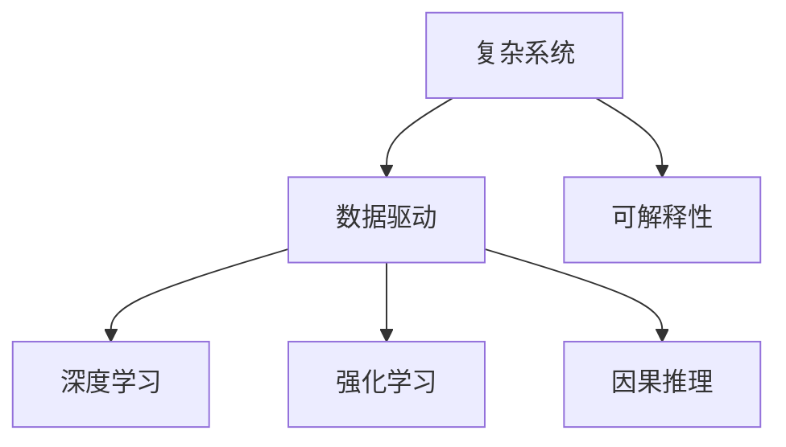

                 

## 1. 背景介绍

### 1.1 问题由来

在现代科技飞速发展的今天，人工智能（AI）正在迅速渗透到我们生活的方方面面。然而，尽管AI技术在诸多领域取得了显著进展，人们仍然面临着许多复杂和棘手的问题，这些问题往往涉及到不确定性、多目标、高维度、非线性等特性。如何在大数据和复杂系统中寻找简单的解决方案，成为一个重要的研究课题。

### 1.2 问题核心关键点

面对复杂问题时，洞察力（Insight）的寻找成为了解决问题的关键。洞察力指的是能够从复杂现象中识别出简单而关键的模式、规律和关联。具备洞察力的人或系统能够迅速抓住问题的核心，从而找到有效的解决方案。在大数据和复杂系统中，洞察力的寻找需要跨学科的协作，包括数学、统计学、计算机科学、物理学等领域的知识和方法。

## 2. 核心概念与联系

### 2.1 核心概念概述

为更好地理解如何在复杂问题中寻找简单解决方案，本节将介绍几个密切相关的核心概念：

- **复杂系统**：指由大量相互作用的元素组成，并表现出整体性、动态性和自组织性的系统。复杂系统包括生态系统、社会系统、经济系统等。
- **数据驱动**：指利用大数据和数据科学的方法，从数据中提取知识、模式和洞见，指导决策和行动。
- **深度学习**：一种基于神经网络的机器学习方法，通过多层次的非线性变换，从大量数据中自动学习特征表示，广泛应用于图像识别、自然语言处理等领域。
- **强化学习**：一种通过试错来优化决策策略的学习方法，适用于智能代理在动态环境中进行决策。
- **因果推理**：指推断因果关系的能力，即理解事件之间的因果联系，在医疗、金融等领域具有重要应用。
- **可解释性（Explainability）**：指模型能够提供透明、可理解、易于解释的决策过程，确保决策的可信度和可接受性。

这些核心概念之间的逻辑关系可以通过以下Mermaid流程图来展示：



这个流程图展示了复杂系统中寻找简单解决方案的主要路径，包括数据驱动、深度学习、强化学习和因果推理等方法，同时强调了可解释性的重要性。

## 3. 核心算法原理 & 具体操作步骤
### 3.1 算法原理概述

在复杂系统中寻找简单解决方案，本质上是利用数据和算法识别出系统中的关键模式和规律。这通常需要以下步骤：

1. **数据收集与预处理**：获取相关数据并进行清洗、归一化、特征工程等预处理操作，确保数据的准确性和一致性。
2. **模型选择与训练**：选择合适的模型，并利用数据进行训练，学习模型参数，使模型能够捕捉到数据中的模式和规律。
3. **特征选择与降维**：从数据中提取最有用的特征，进行特征选择或降维操作，以减少维度，提高模型效率。
4. **模型评估与优化**：评估模型在验证集上的性能，通过交叉验证、正则化等方法进行模型优化，避免过拟合。
5. **决策与解释**：利用模型进行预测和决策，同时提供可解释的推理过程，确保决策的可接受性和透明度。

### 3.2 算法步骤详解

以下是具体的操作步骤，以深度学习为例：

**Step 1: 数据收集与预处理**

- 获取复杂系统的相关数据，包括时间序列数据、图像数据、文本数据等。
- 进行数据清洗，去除噪声、异常值等不规范数据。
- 进行数据归一化，确保不同特征具有相同的量级。
- 进行特征工程，提取有意义的特征，如提取图像中的边缘、角点等特征。

**Step 2: 模型选择与训练**

- 选择合适的深度学习模型，如卷积神经网络（CNN）、循环神经网络（RNN）、长短期记忆网络（LSTM）等。
- 利用数据进行模型训练，优化模型参数，使其能够捕捉到数据中的模式和规律。
- 利用正则化技术，如L2正则、Dropout等，防止模型过拟合。

**Step 3: 特征选择与降维**

- 利用特征选择方法，如LASSO回归、随机森林等，选择最有用的特征。
- 利用降维技术，如主成分分析（PCA）、t-SNE等，减少特征维度，提高模型效率。

**Step 4: 模型评估与优化**

- 在验证集上评估模型的性能，使用均方误差、交叉熵等指标进行评估。
- 通过交叉验证等方法，评估模型的泛化能力，避免过拟合。
- 根据评估结果，调整模型参数，优化模型性能。

**Step 5: 决策与解释**

- 利用训练好的模型进行预测和决策。
- 提供可解释的推理过程，如展示模型的权重、激活图等，帮助理解和验证模型的决策。

### 3.3 算法优缺点

深度学习在复杂系统中寻找简单解决方案时具有以下优点：

- **强大的表示能力**：深度学习模型能够自动学习特征表示，不需要手动设计特征。
- **良好的泛化能力**：深度学习模型在大量数据上进行训练，能够捕捉到数据中的复杂模式和规律。
- **灵活的架构**：深度学习模型可以通过网络结构的设计，适应不同的应用场景。

然而，深度学习也存在一些局限性：

- **计算资源需求高**：深度学习模型参数量大，训练和推理过程计算资源需求高。
- **模型复杂度高**：深度学习模型结构复杂，难以理解和调试。
- **数据依赖性高**：深度学习模型依赖于大量标注数据，数据收集和预处理成本高。

尽管存在这些局限性，但深度学习仍然是解决复杂系统问题的重要工具。未来，通过更多的算法优化、硬件加速和数据增强等方法，深度学习将进一步提升其应用效率和可靠性。

### 3.4 算法应用领域

深度学习在复杂系统中的应用领域非常广泛，包括但不限于：

- **自然语言处理**：利用深度学习模型进行文本分类、情感分析、机器翻译等任务。
- **计算机视觉**：利用深度学习模型进行图像识别、图像生成、目标检测等任务。
- **医疗诊断**：利用深度学习模型进行图像分析、基因组学分析等，辅助医疗诊断和治疗。
- **金融预测**：利用深度学习模型进行市场预测、风险评估等任务。
- **自动驾驶**：利用深度学习模型进行图像识别、行为预测等，支持自动驾驶技术。

## 4. 数学模型和公式 & 详细讲解 & 举例说明

### 4.1 数学模型构建

以自然语言处理（NLP）中的文本分类为例，我们可以构建以下数学模型：

- **输入**：文本数据 $x$，表示为向量形式 $\vec{x} = [x_1, x_2, ..., x_n]$。
- **输出**：分类标签 $y$，表示为整数形式 $y \in \{1, 2, ..., C\}$，其中 $C$ 为类别数。
- **模型**：选择神经网络模型，如卷积神经网络（CNN），其参数为 $\theta$。

### 4.2 公式推导过程

**前向传播**：
$$
\hat{y} = \sigma(\vec{W} \vec{x} + b)
$$
其中，$\vec{W}$ 为权重矩阵，$b$ 为偏置项，$\sigma$ 为激活函数。

**损失函数**：
$$
\mathcal{L}(\theta) = -\frac{1}{N} \sum_{i=1}^N \log(\hat{y}_i)
$$
其中，$N$ 为样本数，$\hat{y}_i$ 为模型对样本 $i$ 的预测概率。

**反向传播**：
$$
\frac{\partial \mathcal{L}}{\partial \theta} = -\frac{1}{N} \sum_{i=1}^N \nabla_{\hat{y}_i} \log(\hat{y}_i)
$$

### 4.3 案例分析与讲解

以情感分析为例，我们利用深度学习模型对电影评论进行情感分类。具体步骤如下：

1. **数据预处理**：将电影评论数据清洗、归一化，提取情感词汇特征。
2. **模型构建**：选择LSTM模型，设置隐藏层大小、学习率等超参数。
3. **训练与评估**：利用训练集数据训练模型，在验证集上评估模型性能，调整超参数。
4. **预测与解释**：利用训练好的模型对新评论进行情感预测，提供可解释的推理过程。

## 5. 项目实践：代码实例和详细解释说明

### 5.1 开发环境搭建

在进行深度学习项目实践前，我们需要准备好开发环境。以下是使用Python进行PyTorch开发的环境配置流程：

1. 安装Anaconda：从官网下载并安装Anaconda，用于创建独立的Python环境。
2. 创建并激活虚拟环境：
```bash
conda create -n pytorch-env python=3.8 
conda activate pytorch-env
```
3. 安装PyTorch：根据CUDA版本，从官网获取对应的安装命令。例如：
```bash
conda install pytorch torchvision torchaudio cudatoolkit=11.1 -c pytorch -c conda-forge
```
4. 安装TensorFlow：
```bash
pip install tensorflow
```
5. 安装各类工具包：
```bash
pip install numpy pandas scikit-learn matplotlib tqdm jupyter notebook ipython
```

完成上述步骤后，即可在`pytorch-env`环境中开始深度学习项目的实践。

### 5.2 源代码详细实现

以下是使用PyTorch对CNN模型进行图像分类的代码实现：

```python
import torch
import torch.nn as nn
import torch.optim as optim
from torchvision import datasets, transforms
from torch.utils.data import DataLoader

# 定义模型
class CNN(nn.Module):
    def __init__(self):
        super(CNN, self).__init__()
        self.conv1 = nn.Conv2d(3, 64, kernel_size=3, stride=1, padding=1)
        self.conv2 = nn.Conv2d(64, 128, kernel_size=3, stride=1, padding=1)
        self.fc1 = nn.Linear(128*8*8, 256)
        self.fc2 = nn.Linear(256, 10)

    def forward(self, x):
        x = nn.functional.relu(self.conv1(x))
        x = nn.functional.max_pool2d(x, 2)
        x = nn.functional.relu(self.conv2(x))
        x = nn.functional.max_pool2d(x, 2)
        x = x.view(-1, 128*8*8)
        x = nn.functional.relu(self.fc1(x))
        x = self.fc2(x)
        return x

# 加载数据
train_dataset = datasets.CIFAR10(root='data', train=True, download=True, transform=transforms.ToTensor())
test_dataset = datasets.CIFAR10(root='data', train=False, download=True, transform=transforms.ToTensor())

# 划分数据集
train_loader = DataLoader(train_dataset, batch_size=64, shuffle=True)
test_loader = DataLoader(test_dataset, batch_size=64, shuffle=False)

# 定义模型、优化器和损失函数
model = CNN()
criterion = nn.CrossEntropyLoss()
optimizer = optim.Adam(model.parameters(), lr=0.001)

# 训练模型
for epoch in range(10):
    model.train()
    for data, target in train_loader:
        optimizer.zero_grad()
        output = model(data)
        loss = criterion(output, target)
        loss.backward()
        optimizer.step()
    model.eval()
    correct = 0
    total = 0
    with torch.no_grad():
        for data, target in test_loader:
            output = model(data)
            _, predicted = torch.max(output.data, 1)
            total += target.size(0)
            correct += (predicted == target).sum().item()
    print('Epoch {}: Acc = {}%'.format(epoch+1, 100 * correct / total))
```

### 5.3 代码解读与分析

让我们再详细解读一下关键代码的实现细节：

**CNN类**：
- `__init__`方法：初始化卷积层、全连接层等组件。
- `forward`方法：定义前向传播过程，包括卷积、激活、池化、全连接等操作。

**数据加载**：
- `datasets.CIFAR10`类：加载CIFAR-10数据集。
- `transforms.ToTensor()`方法：将PIL图像转换为张量。

**训练与评估**：
- `DataLoader`类：定义数据批处理器。
- `optimizer`和`criterion`：定义优化器和损失函数。
- `for`循环：进行多轮训练。
- `model.train()`和`model.eval()`：切换模型训练和评估模式。

**模型预测与评估**：
- `correct`和`total`：记录正确预测和总样本数。
- `torch.max`：找到预测值中概率最大的类别。

**输出展示**：
- 利用训练好的模型对测试集进行预测，并输出准确率。

## 6. 实际应用场景

### 6.1 智能医疗诊断

深度学习在医疗诊断中的应用非常广泛，通过分析医学影像、病历数据等，辅助医生进行疾病诊断和预测。例如，利用深度学习模型对X光片进行自动诊断，识别出肺部结节、肿块等异常情况，帮助医生快速做出诊断决策。

### 6.2 金融风险评估

金融领域需要实时评估市场风险，预测股票价格、债券信用等级等。深度学习模型能够分析历史数据，识别出市场趋势和异常情况，辅助金融分析师做出更准确的预测。

### 6.3 智能推荐系统

推荐系统通过分析用户历史行为和偏好，推荐用户可能感兴趣的商品或内容。深度学习模型能够自动提取特征，学习用户兴趣和物品特征，提供个性化的推荐结果。

### 6.4 自动驾驶

自动驾驶技术依赖于深度学习模型进行图像识别、行为预测等，辅助车辆在复杂环境中进行决策。例如，利用深度学习模型对道路标志、行人、车辆等进行识别，确保车辆安全行驶。

## 7. 工具和资源推荐

### 7.1 学习资源推荐

为了帮助开发者系统掌握深度学习技术，这里推荐一些优质的学习资源：

1. 《深度学习》书籍：由深度学习领域的权威学者编写，系统介绍了深度学习的基本概念和算法。
2. CS231n《卷积神经网络》课程：斯坦福大学开设的深度学习课程，涵盖深度学习的基础知识和实践技巧。
3. DeepLearning.AI《深度学习专项课程》：由Andrew Ng教授主讲，系统介绍了深度学习的理论和应用。
4. HuggingFace官方文档：提供了丰富的深度学习模型和工具库，适合快速上手实践。
5. GitHub上的开源项目：如TensorFlow、PyTorch等，提供大量的代码和实践案例，适合学习者参考。

通过对这些资源的学习实践，相信你一定能够快速掌握深度学习技术的精髓，并用于解决实际的复杂问题。

### 7.2 开发工具推荐

高效的开发离不开优秀的工具支持。以下是几款用于深度学习开发的常用工具：

1. PyTorch：基于Python的开源深度学习框架，灵活动态的计算图，适合快速迭代研究。
2. TensorFlow：由Google主导开发的开源深度学习框架，生产部署方便，适合大规模工程应用。
3. Weights & Biases：模型训练的实验跟踪工具，可以记录和可视化模型训练过程中的各项指标，方便对比和调优。
4. TensorBoard：TensorFlow配套的可视化工具，可实时监测模型训练状态，并提供丰富的图表呈现方式。

合理利用这些工具，可以显著提升深度学习项目的开发效率，加快创新迭代的步伐。

### 7.3 相关论文推荐

深度学习在复杂系统中的应用研究仍在不断深入。以下是几篇奠基性的相关论文，推荐阅读：

1. AlexNet：提出深度卷积神经网络，在图像识别任务上取得了显著进步。
2. ResNet：提出残差连接，解决了深度网络训练中的梯度消失问题。
3. InceptionNet：提出多层次网络结构，提高了网络效率和表现。
4. BERT：提出预训练语言模型，极大提升了自然语言处理任务的性能。
5. GAN：提出生成对抗网络，实现了高质量的图像生成和数据增强。

这些论文代表了大数据和复杂系统中深度学习的最新进展，值得深入学习和实践。

## 8. 总结：未来发展趋势与挑战

### 8.1 总结

本文对深度学习在复杂系统中寻找简单解决方案的方法进行了全面系统的介绍。首先阐述了深度学习在大数据和复杂系统中的重要性和应用场景，明确了深度学习在模型选择、数据预处理、特征工程、模型训练、特征选择、模型评估和决策解释等各个环节的流程和操作。通过对深度学习核心算法和操作步骤的详细介绍，提供了项目实践的完整代码实现。

通过本文的系统梳理，可以看到，深度学习在复杂系统中的应用已经取得了很多成功案例，但在实际应用中仍面临许多挑战和瓶颈。未来，需要通过更多的算法优化、硬件加速和数据增强等方法，不断提升深度学习的应用效率和可靠性。

### 8.2 未来发展趋势

展望未来，深度学习在复杂系统中寻找简单解决方案将呈现以下几个发展趋势：

1. **多模态融合**：深度学习模型将不仅限于单一数据模态，而是融合图像、文本、语音等多模态数据，提升系统的感知和推理能力。
2. **自动化设计**：通过自动化设计工具，如神经网络结构搜索，快速找到最优网络结构和超参数，提高模型设计效率。
3. **联邦学习**：在数据分布不均、隐私保护等约束下，通过联邦学习技术，实现分布式训练，提升模型的泛化能力。
4. **自适应学习**：开发自适应学习算法，使模型能够动态调整参数，应对数据分布的变化。
5. **解释性增强**：通过可解释性技术，提高模型的可解释性和透明度，增强用户信任和接受度。

这些趋势将引领深度学习技术进一步发展，为解决复杂系统问题提供更强大的工具和方法。

### 8.3 面临的挑战

尽管深度学习在复杂系统中寻找简单解决方案已经取得显著进展，但仍面临诸多挑战：

1. **计算资源需求高**：深度学习模型参数量大，训练和推理过程计算资源需求高。
2. **模型复杂度高**：深度学习模型结构复杂，难以理解和调试。
3. **数据依赖性高**：深度学习模型依赖于大量标注数据，数据收集和预处理成本高。
4. **解释性不足**：深度学习模型通常缺乏可解释性，难以理解模型的决策过程。
5. **过拟合风险高**：深度学习模型容易过拟合，特别是在数据量不足的情况下。
6. **对抗攻击脆弱**：深度学习模型容易受到对抗样本攻击，产生误导性输出。

这些挑战需要在未来的研究中不断解决，以进一步提升深度学习的应用效果和可靠性。

### 8.4 研究展望

面对深度学习面临的诸多挑战，未来的研究需要在以下几个方面寻求新的突破：

1. **参数高效模型**：开发更加参数高效的模型，在固定大部分预训练参数的情况下，只更新极少量的任务相关参数。
2. **计算资源优化**：通过硬件加速、模型压缩等方法，降低计算资源需求，提高模型训练和推理效率。
3. **模型可解释性**：通过可解释性技术，提高模型的可解释性和透明度，增强用户信任和接受度。
4. **对抗攻击防御**：开发抗对抗攻击的模型和算法，增强模型的鲁棒性和安全性。
5. **多任务学习**：开发能够处理多任务学习的能力，提高模型的泛化能力和适应性。

这些研究方向将进一步提升深度学习在复杂系统中的应用效果，推动人工智能技术的进一步发展。

## 9. 附录：常见问题与解答

**Q1: 深度学习在复杂系统中的应用主要有哪些？**

A: 深度学习在复杂系统中的应用非常广泛，包括但不限于：
1. **自然语言处理**：文本分类、情感分析、机器翻译等任务。
2. **计算机视觉**：图像识别、图像生成、目标检测等任务。
3. **医疗诊断**：医学影像分析、基因组学分析等，辅助医疗诊断和治疗。
4. **金融预测**：市场预测、风险评估等任务。
5. **自动驾驶**：图像识别、行为预测等，支持自动驾驶技术。

**Q2: 深度学习在应用中如何提高模型的可解释性？**

A: 提高深度学习模型的可解释性，通常可以通过以下方法：
1. **特征可视化**：利用特征可视化工具，展示模型对输入数据的特征提取过程。
2. **模型蒸馏**：通过知识蒸馏技术，将复杂模型转换为更简单的模型，提高可解释性。
3. **可解释性模块**：在模型中引入可解释性模块，如LIME、SHAP等，提供可解释的推理过程。
4. **决策树融合**：将深度学习模型与决策树等传统模型结合，提供多模态的可解释性。

**Q3: 深度学习在复杂系统中的应用面临哪些挑战？**

A: 深度学习在复杂系统中的应用面临以下挑战：
1. **计算资源需求高**：深度学习模型参数量大，训练和推理过程计算资源需求高。
2. **模型复杂度高**：深度学习模型结构复杂，难以理解和调试。
3. **数据依赖性高**：深度学习模型依赖于大量标注数据，数据收集和预处理成本高。
4. **解释性不足**：深度学习模型通常缺乏可解释性，难以理解模型的决策过程。
5. **过拟合风险高**：深度学习模型容易过拟合，特别是在数据量不足的情况下。
6. **对抗攻击脆弱**：深度学习模型容易受到对抗样本攻击，产生误导性输出。

**Q4: 如何提高深度学习模型的泛化能力？**

A: 提高深度学习模型的泛化能力，通常可以通过以下方法：
1. **数据增强**：通过对训练数据进行扩充，提高模型的泛化能力。
2. **正则化**：利用L2正则、Dropout等正则化技术，防止模型过拟合。
3. **迁移学习**：在类似任务上预训练模型，再迁移到目标任务上微调，提高泛化能力。
4. **多模型集成**：通过集成多个模型，提高模型的泛化能力和鲁棒性。
5. **对抗训练**：通过对抗样本训练，提高模型的鲁棒性和泛化能力。

**Q5: 深度学习在复杂系统中的应用未来有哪些发展趋势？**

A: 深度学习在复杂系统中的应用未来将有以下发展趋势：
1. **多模态融合**：深度学习模型将不仅限于单一数据模态，而是融合图像、文本、语音等多模态数据，提升系统的感知和推理能力。
2. **自动化设计**：通过自动化设计工具，如神经网络结构搜索，快速找到最优网络结构和超参数，提高模型设计效率。
3. **联邦学习**：在数据分布不均、隐私保护等约束下，通过联邦学习技术，实现分布式训练，提升模型的泛化能力。
4. **自适应学习**：开发自适应学习算法，使模型能够动态调整参数，应对数据分布的变化。
5. **解释性增强**：通过可解释性技术，提高模型的可解释性和透明度，增强用户信任和接受度。

这些趋势将引领深度学习技术进一步发展，为解决复杂系统问题提供更强大的工具和方法。

---

作者：禅与计算机程序设计艺术 / Zen and the Art of Computer Programming

