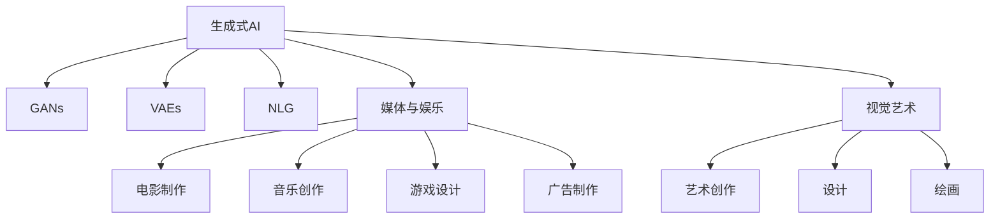

                 

# 生成式AIGC是金矿还是泡沫:回归商业本质

> 关键词：生成式AI, 生成对抗网络(GANs), 变分自编码器(VAEs), 自然语言生成, 媒体和娱乐, 视觉艺术

## 1. 背景介绍

### 1.1 问题由来

近年来，生成式人工智能（AIGC）在媒体、娱乐、艺术、广告等领域引起了巨大的变革。无论是在生成音乐、视频、图像、文本等方面，生成式AI都展现出了卓越的表现，吸引了大量的投资和关注。然而，随着技术的日益成熟和应用的不断拓展，生成式AI是否真正创造了价值，或者只是一个个噱头？

在一片喧嚣中，我们需要重新审视生成式AI的商业本质，探讨其在各行各业中实际应用的价值，以及可能面临的挑战。

### 1.2 问题核心关键点

- **生成式AI技术的突破**：GPT-3、DALL-E、Stable Diffusion等生成模型的涌现，展示了生成式AI在文本、图像、音频等领域的能力。
- **商业应用的探索**：在音乐、电影、游戏、艺术创作等方面的尝试，展现了生成式AI的巨大潜力。
- **市场需求与投资热潮**：技术的突破带动了资本的追逐，生成式AI成为了资本市场的热门投资标的。
- **伦理与法律挑战**：生成式AI可能引发的版权、隐私、安全等问题，引起了广泛的社会关注。

## 2. 核心概念与联系

### 2.1 核心概念概述

- **生成式AI (AIGC)**：使用机器学习模型生成全新的数据（如文本、图像、音频等），模仿真实数据的分布，具有创造性。
- **生成对抗网络 (GANs)**：由生成器和判别器两个网络组成，通过对抗训练使生成器能够生成逼真的数据。
- **变分自编码器 (VAEs)**：通过潜在空间对数据进行编码和解码，生成新的数据，同时具备数据压缩能力。
- **自然语言生成 (NLG)**：利用深度学习模型自动生成符合语法和语义规则的文本。
- **媒体与娱乐**：生成式AI在电影制作、音乐创作、游戏设计、广告制作等领域的广泛应用。
- **视觉艺术**：生成式AI在艺术创作、设计、绘画等方面的创新和实验。

这些概念之间的逻辑关系可以通过以下Mermaid流程图来展示：



这个流程图展示了生成式AI的核心概念以及它们在各个领域中的应用：

1. **生成式AI**：作为大类，涵盖了GANs、VAEs、NLG等多种技术。
2. **GANs、VAEs、NLG**：生成式AI的三大核心技术，分别在图像、数据压缩、文本生成等方面具有独特优势。
3. **媒体与娱乐、视觉艺术**：生成式AI的主要应用领域，展示了其在多个行业的潜力。

## 3. 核心算法原理 & 具体操作步骤
### 3.1 算法原理概述

生成式AI的核心原理是通过机器学习模型生成新的数据，其基本思路为：

- **数据分布建模**：使用深度学习模型学习数据的概率分布，即数据的统计特性。
- **生成新数据**：在学到的数据分布上采样，生成新的数据。
- **优化模型性能**：通过优化模型参数，提高生成数据的逼真度、多样性和可控性。

生成式AI通常包括以下关键步骤：

1. **数据准备**：收集和预处理用于训练的数据。
2. **模型设计**：选择合适的生成模型架构，如GANs、VAEs等。
3. **模型训练**：使用训练数据训练生成模型，调整模型参数。
4. **数据生成**：使用训练好的模型生成新的数据。
5. **模型评估**：通过评价指标（如FID、IS等）评估生成数据的逼真度和多样性。

### 3.2 算法步骤详解

以GANs为例，详细讲解其训练和生成过程：

**Step 1: 数据准备**
- 收集用于训练的图像数据集。
- 将图像数据转换为模型的输入格式，如张量或矩阵。

**Step 2: 模型设计**
- 设计生成器和判别器的网络结构。
- 确定损失函数，如生成器损失、判别器损失、对抗损失等。
- 确定优化器，如Adam、SGD等。

**Step 3: 模型训练**
- 初始化生成器和判别器的参数。
- 在每轮训练中，先使用判别器对生成器生成的图像进行评分，然后调整生成器和判别器的参数以最大化对抗损失。
- 重复多次训练，直至生成器生成的图像与真实图像无明显差异。

**Step 4: 数据生成**
- 使用训练好的生成器网络生成新的图像数据。
- 根据需要，可以对生成图像进行后处理，如调整亮度、对比度、噪声等。

**Step 5: 模型评估**
- 使用Inception Score (IS)或Fréchet Inception Distance (FID)等指标评估生成图像的质量。
- 使用多样性度量（如Jensen-Shannon Divergence）评估生成图像的多样性。

### 3.3 算法优缺点

**优点**：
- **高度创造性**：生成式AI能够生成全新的数据，具有无限的可能性。
- **广泛应用**：可以在文本、图像、音频等各个领域应用，具有广泛的市场潜力。
- **技术先进**：生成对抗网络、变分自编码器等技术成熟，理论基础扎实。

**缺点**：
- **训练复杂**：生成式AI的训练过程复杂，需要大量计算资源和时间。
- **数据依赖**：生成式AI依赖于高质量的数据集，数据不足时生成效果较差。
- **版权问题**：生成的数据可能与真实数据相似，涉及版权和伦理问题。
- **可解释性差**：生成的数据缺乏明确的来源和依据，难以解释和理解。

### 3.4 算法应用领域

生成式AI在多个领域都有广泛应用，主要包括以下几个方面：

- **媒体与娱乐**：生成式AI在电影制作、音乐创作、游戏设计、广告制作等方面展现出巨大潜力。
- **视觉艺术**：生成式AI在艺术创作、设计、绘画等方面的创新和实验。
- **医疗**：生成式AI在医疗影像生成、疾病模拟、新药研发等方面的应用。
- **金融**：生成式AI在金融数据分析、市场模拟、投资策略设计等方面的应用。
- **交通**：生成式AI在自动驾驶、交通模拟、路径规划等方面的应用。
- **教育**：生成式AI在教育内容生成、个性化学习、自动评分等方面的应用。

## 4. 数学模型和公式 & 详细讲解 & 举例说明

### 4.1 数学模型构建

生成式AI的数学模型通常基于概率模型，如生成对抗网络和变分自编码器。以下以GANs为例，构建生成式AI的数学模型。

**生成器（Generator）**：定义生成器网络 $G$，将噪声向量 $z$ 映射为生成样本 $x$。

$$
G: z \rightarrow x
$$

**判别器（Discriminator）**：定义判别器网络 $D$，判断样本 $x$ 是真实样本还是生成样本。

$$
D: x \rightarrow \text{real} \in \{0,1\}
$$

**目标函数**：GANs的目标函数由生成器和判别器的损失组成，通常为对抗损失（Adversarial Loss）。

$$
L_{\text{GAN}} = \mathbb{E}_{x \sim p_{\text{data}}(x)} \log D(x) + \mathbb{E}_{z \sim p_{\text{noise}}(z)} \log (1 - D(G(z)))
$$

其中 $p_{\text{data}}(x)$ 为真实数据分布，$p_{\text{noise}}(z)$ 为噪声向量分布。

### 4.2 公式推导过程

以GANs为例，推导生成器和判别器的优化过程：

**生成器优化**：

$$
\min_{G} \mathbb{E}_{z \sim p_{\text{noise}}(z)} \log (1 - D(G(z)))
$$

**判别器优化**：

$$
\max_{D} \mathbb{E}_{x \sim p_{\text{data}}(x)} \log D(x) + \mathbb{E}_{z \sim p_{\text{noise}}(z)} \log (1 - D(G(z)))
$$

### 4.3 案例分析与讲解

以DALL-E为例，分析其在图像生成中的应用。

DALL-E是一个基于扩散模型（Diffusion Model）的生成模型，能够在文本描述的指导下生成逼真的图像。

**案例1: 生成名画复制品**

输入文本描述："一张马克斯·梅勒（Max Meller）绘制的抽象画作"。

DALL-E通过扩散模型生成图像，并根据输入文本进行微调，最终生成符合描述的抽象画作。

**案例2: 生成虚拟角色**

输入文本描述："一个穿着白色长袍的神秘魔法师"。

DALL-E根据输入文本生成图像，通过调整扩散模型参数和微调损失，生成具有一定风格和特征的虚拟角色。

## 5. 项目实践：代码实例和详细解释说明

### 5.1 开发环境搭建

在进行生成式AI开发前，需要准备好相应的开发环境。以下是使用PyTorch进行GANs开发的配置流程：

1. 安装Anaconda：从官网下载并安装Anaconda，用于创建独立的Python环境。

2. 创建并激活虚拟环境：
```bash
conda create -n pytorch-env python=3.8 
conda activate pytorch-env
```

3. 安装PyTorch：根据CUDA版本，从官网获取对应的安装命令。例如：
```bash
conda install pytorch torchvision torchaudio cudatoolkit=11.1 -c pytorch -c conda-forge
```

4. 安装相关库：
```bash
pip install torch torchvision datasets
```

完成上述步骤后，即可在`pytorch-env`环境中开始生成式AI开发。

### 5.2 源代码详细实现

以下是一个使用PyTorch实现的GANs代码示例，包括生成器和判别器的定义、优化过程、数据生成等关键步骤：

```python
import torch
import torch.nn as nn
import torch.optim as optim
from torch.utils.data import DataLoader
from torchvision import datasets, transforms

class Generator(nn.Module):
    def __init__(self, latent_dim=100, img_size=784):
        super(Generator, self).__init__()
        self.encoder = nn.Sequential(
            nn.Linear(latent_dim, 256),
            nn.ReLU(),
            nn.Linear(256, 512),
            nn.ReLU(),
            nn.Linear(512, img_size)
        )

    def forward(self, x):
        return self.encoder(x)

class Discriminator(nn.Module):
    def __init__(self, img_size=784):
        super(Discriminator, self).__init__()
        self.decoder = nn.Sequential(
            nn.Linear(img_size, 512),
            nn.LeakyReLU(0.2),
            nn.Linear(512, 256),
            nn.LeakyReLU(0.2),
            nn.Linear(256, 1),
            nn.Sigmoid()
        )

    def forward(self, x):
        return self.decoder(x)

def load_data(batch_size=64, img_size=64):
    train_data = datasets.MNIST(root='./data', train=True, transform=transforms.ToTensor(), download=True)
    train_loader = DataLoader(train_data, batch_size=batch_size, shuffle=True)
    return train_loader

def train(model, train_loader, device, n_epochs=100):
    device = torch.device('cuda' if torch.cuda.is_available() else 'cpu')
    model.to(device)

    criterion = nn.BCELoss()
    optimizer = optim.Adam(model.parameters(), lr=0.0002)

    for epoch in range(n_epochs):
        for batch_idx, (real_images, _) in enumerate(train_loader):
            real_images = real_images.to(device)
            noise = torch.randn(batch_size, latent_dim).to(device)
            generated_images = model(noise)

            # 真实样本的判别器训练
            real_labels = torch.ones(batch_size, 1).to(device)
            optimizer.zero_grad()
            real_loss = criterion(discriminator(real_images), real_labels)
            real_loss.backward()
            optimizer.step()

            # 生成样本的判别器训练
            fake_labels = torch.zeros(batch_size, 1).to(device)
            optimizer.zero_grad()
            fake_loss = criterion(discriminator(generated_images), fake_labels)
            fake_loss.backward()
            optimizer.step()

            if (batch_idx+1) % 100 == 0:
                print('Epoch [{}/{}], Batch [{}/{}], Real Loss: {:.4f}, Fake Loss: {:.4f}'
                      .format(epoch+1, n_epochs, batch_idx+1, len(train_loader), real_loss.item(), fake_loss.item()))

        if (epoch+1) % 10 == 0:
            save_model(model, 'model_epoch{}.pkl'.format(epoch+1))

def generate(model, latent_dim, n_samples=16):
    device = torch.device('cuda' if torch.cuda.is_available() else 'cpu')
    model.to(device)
    noise = torch.randn(n_samples, latent_dim).to(device)
    generated_images = model(noise)
    return generated_images

# 实例化生成器和判别器
generator = Generator()
discriminator = Discriminator()

# 加载训练数据
train_loader = load_data()

# 训练模型
train(generator, train_loader, device='cuda')

# 生成图像
generated_images = generate(generator, latent_dim=100, n_samples=16)
```

### 5.3 代码解读与分析

让我们再详细解读一下关键代码的实现细节：

**生成器和判别器的定义**：

- `Generator`类定义生成器网络，接收噪声向量 `z` 并输出图像。
- `Discriminator`类定义判别器网络，接收图像并输出判别结果。

**数据加载**：

- `load_data`函数使用PyTorch的数据集API，加载MNIST手写数字数据集，并将其转换为模型所需的格式。

**模型训练**：

- 在每轮训练中，先使用判别器对真实样本进行评分，然后对生成样本进行评分，并分别计算损失，更新生成器和判别器的参数。
- 在每个epoch结束后，保存训练好的模型，以便后续使用。

**数据生成**：

- `generate`函数使用训练好的生成器模型，生成一定数量的图像，并返回结果。

以上代码展示了GANs模型的基本流程，包括模型定义、数据加载、训练和生成等关键步骤。开发者可以根据具体需求进行优化和扩展。

## 6. 实际应用场景

### 6.1 媒体与娱乐

生成式AI在媒体与娱乐领域的应用广泛，以下是几个典型应用场景：

- **电影制作**：通过生成对抗网络（GANs）生成逼真的背景图像和角色动画，节省制作成本和时间。例如，使用CycleGAN实现风格迁移，将真实视频转换为卡通风格。
- **音乐创作**：使用变分自编码器（VAEs）和生成对抗网络（GANs）生成原创音乐和MIDI文件。例如，使用DCGAN生成音乐演奏片段，使用Jukebox训练生成风格多样的歌曲。
- **游戏设计**：生成对抗网络（GANs）和变分自编码器（VAEs）用于生成角色、场景和物品等游戏资产。例如，使用DeepDream生成高保真的游戏画面，使用Pix2Pix生成逼真的地图和纹理。
- **广告制作**：生成对抗网络（GANs）和变分自编码器（VAEs）用于生成创意广告和产品展示。例如，使用StyleGAN生成高质量的商业广告，使用VAE生成动态的产品展示视频。

### 6.2 视觉艺术

生成式AI在视觉艺术领域的应用具有颠覆性，以下是几个典型应用场景：

- **艺术创作**：生成对抗网络（GANs）和变分自编码器（VAEs）用于创作抽象画作、雕塑和装置艺术。例如，使用DALL-E根据文本描述生成绘画，使用GPT-3生成诗歌和书法作品。
- **设计**：生成对抗网络（GANs）和变分自编码器（VAEs）用于设计界面、图标和海报等视觉元素。例如，使用StyleGAN生成品牌标志和广告设计，使用VAE生成时尚设计和家居布局。
- **绘画**：生成对抗网络（GANs）和变分自编码器（VAEs）用于自动绘制和生成绘画作品。例如，使用扩散模型生成像素艺术和数字插画，使用GANs生成水彩画和油画。

### 6.3 医疗

生成式AI在医疗领域的应用具有很大的潜力，以下是几个典型应用场景：

- **医学影像生成**：生成对抗网络（GANs）和变分自编码器（VAEs）用于生成高质量的医学影像，辅助医生诊断和治疗。例如，使用CycleGAN生成3D重建的医学影像，使用VAE生成MRI和CT的增强图像。
- **疾病模拟**：生成对抗网络（GANs）和变分自编码器（VAEs）用于模拟疾病发展过程和疗效评估。例如，使用GANs生成病毒传播模型，使用VAE生成肿瘤生长模拟。
- **新药研发**：生成对抗网络（GANs）和变分自编码器（VAEs）用于药物分子生成和新药设计。例如，使用GANs生成新型分子结构和化合物，使用VAE优化药物组合和剂量设计。

### 6.4 金融

生成式AI在金融领域的应用具有很高的价值，以下是几个典型应用场景：

- **金融数据分析**：生成对抗网络（GANs）和变分自编码器（VAEs）用于金融数据预测和风险评估。例如，使用GANs生成市场模拟数据，使用VAE进行信用评分和风险评估。
- **市场模拟**：生成对抗网络（GANs）和变分自编码器（VAEs）用于市场模拟和投资策略设计。例如，使用GANs生成虚拟股票市场，使用VAE优化投资组合和策略设计。
- **个性化理财**：生成对抗网络（GANs）和变分自编码器（VAEs）用于个性化理财建议和产品设计。例如，使用GANs生成个性化的金融报告和建议，使用VAE进行理财产品的个性化推荐。

## 7. 工具和资源推荐

### 7.1 学习资源推荐

为了帮助开发者系统掌握生成式AI的理论基础和实践技巧，这里推荐一些优质的学习资源：

1. **《生成对抗网络》（GANs）**：Ian Goodfellow等著，详细介绍了GANs的基本原理和应用，是GANs领域的经典著作。

2. **《变分自编码器》（VAEs）**：David Kingma和Max Welling著，介绍了VAEs的原理和应用，是VAEs领域的权威教材。

3. **《自然语言生成》（NLG）**：Liang-Jun Xu等著，介绍了NLG的基本原理和应用，是NLG领域的权威教材。

4. **CS231n《卷积神经网络》**：斯坦福大学开设的计算机视觉课程，介绍了生成对抗网络和变分自编码器在图像生成中的应用。

5. **DeepMind博客**：DeepMind的官方博客，介绍了生成式AI在图像生成、音乐创作、游戏设计等方面的最新进展。

### 7.2 开发工具推荐

高效的开发离不开优秀的工具支持。以下是几款用于生成式AI开发的常用工具：

1. **PyTorch**：基于Python的开源深度学习框架，灵活动态的计算图，适合快速迭代研究。

2. **TensorFlow**：由Google主导开发的开源深度学习框架，生产部署方便，适合大规模工程应用。

3. **Transformers**：HuggingFace开发的NLP工具库，集成了众多SOTA语言模型，支持生成式AI任务开发。

4. **Weights & Biases**：模型训练的实验跟踪工具，可以记录和可视化模型训练过程中的各项指标，方便对比和调优。

5. **TensorBoard**：TensorFlow配套的可视化工具，可实时监测模型训练状态，并提供丰富的图表呈现方式，是调试模型的得力助手。

6. **Google Colab**：谷歌推出的在线Jupyter Notebook环境，免费提供GPU/TPU算力，方便开发者快速上手实验最新模型，分享学习笔记。

合理利用这些工具，可以显著提升生成式AI的开发效率，加快创新迭代的步伐。

### 7.3 相关论文推荐

生成式AI的研究方向涵盖多个领域，以下是几篇奠基性的相关论文，推荐阅读：

1. **Generative Adversarial Nets**：Ian Goodfellow等著，提出了生成对抗网络的框架，是GANs领域的经典论文。

2. **Generative Adversarial Text-to-Speech Synthesis**：David Bourlard等著，介绍了GANs在语音合成中的应用，是NLP领域的经典论文。

3. **WaveGAN: A Wavenet Architecture for Improving Learning Efficiency**：Peter Huggenberger等著，介绍了GANs在音频生成中的应用，是音频领域的经典论文。

4. **Language Models as Self-supervised Multitask Learners**：Alexey Radford等著，提出了BERT等语言模型，是NLP领域的经典论文。

5. **Unsupervised Learning of Visual Representations by Transforming Convolutions**：Serkan Ozair等著，介绍了VAE在图像生成中的应用，是图像领域的经典论文。

这些论文代表了大生成式AI研究的发展脉络。通过学习这些前沿成果，可以帮助研究者把握学科前进方向，激发更多的创新灵感。

## 8. 总结：未来发展趋势与挑战

### 8.1 研究成果总结

本文对生成式AI的生成、训练和应用进行了全面系统的介绍。首先阐述了生成式AI的突破进展，探讨了其在媒体、娱乐、艺术等领域的应用前景。其次，从原理到实践，详细讲解了生成式AI的数学模型和操作步骤，给出了生成式AI的代码实例和详细解释说明。最后，讨论了生成式AI的实际应用场景和未来趋势，指出了其面临的挑战和未来的研究展望。

通过本文的系统梳理，可以看到，生成式AI技术正在引领人工智能领域的发展，其强大的生成能力正在改变各个行业的面貌。未来，随着技术的不断进步和应用的深入，生成式AI将展现出更加广阔的前景和潜力。

### 8.2 未来发展趋势

展望未来，生成式AI将呈现以下几个发展趋势：

1. **技术进步**：生成式AI的核心技术（如GANs、VAEs）将不断进步，生成能力将进一步提升，生成数据的逼真度和多样性将得到进一步增强。

2. **跨领域应用**：生成式AI将在更多领域得到应用，如医疗、金融、交通等，其跨领域的适应能力将得到进一步提升。

3. **商业化落地**：生成式AI将从学术界走向产业界，其商业价值将得到进一步挖掘和实现。

4. **伦理与安全**：生成式AI将面临更多的伦理和安全问题，如何在技术创新与社会责任之间取得平衡将是未来的重要课题。

5. **开源与合作**：生成式AI的发展将更加开放和协作，开源社区和产业界的合作将进一步推动技术进步和应用落地。

### 8.3 面临的挑战

尽管生成式AI技术已经取得了瞩目成就，但在迈向更加智能化、普适化应用的过程中，它仍面临诸多挑战：

1. **伦理与法律问题**：生成式AI可能涉及版权、隐私、安全等问题，引发社会关注。

2. **技术瓶颈**：生成式AI的训练过程复杂，计算资源和时间成本较高，需要更多优化。

3. **数据依赖**：生成式AI依赖高质量的数据集，数据不足时生成效果较差。

4. **可解释性**：生成的数据缺乏明确的来源和依据，难以解释和理解。

5. **安全性**：生成的数据可能被滥用，需要更多安全防护措施。

6. **商业应用**：生成式AI的商业模式和商业化路径尚未明确，需要更多探索和实践。

### 8.4 研究展望

面对生成式AI面临的挑战，未来的研究需要在以下几个方面寻求新的突破：

1. **多模态生成**：将文本、图像、音频等多种模态的数据进行融合，生成多模态的数据产品。

2. **智能生成**：引入智能生成机制，如决策树、逻辑规则等，增强生成过程的智能化和可控性。

3. **跨领域应用**：将生成式AI技术与其他领域的技术进行融合，如自然语言处理、计算机视觉、语音识别等，形成跨领域的智能应用。

4. **伦理与法律**：在生成式AI的开发和应用过程中，引入伦理和法律的约束，确保生成过程符合社会价值观和法律法规。

5. **商业化路径**：探索生成式AI的商业应用模式，如SaaS、API、订阅服务等，推动技术成果的产业化应用。

通过这些研究方向的探索，相信生成式AI将能够更好地服务于社会和产业发展，为各个行业带来创新和变革。

## 9. 附录：常见问题与解答

**Q1：生成式AI是否可以应用于所有领域？**

A: 生成式AI在大多数领域都有应用潜力，但特定领域的应用效果取决于数据质量和生成模型的能力。对于一些需要高度精确性和规范性的领域，如医疗、法律、金融等，生成式AI的效果可能受限。

**Q2：生成式AI的生成结果是否具有版权问题？**

A: 生成式AI生成的内容可能与真实作品相似，涉及到版权问题。生成式AI的开发者需要确保其生成的内容不侵犯第三方版权，并采取必要的防范措施。

**Q3：生成式AI的训练和应用是否需要大量数据？**

A: 生成式AI需要高质量的数据进行训练，数据不足可能导致生成效果差。对于小样本或低资源环境，可以考虑使用少样本学习、数据增强等方法。

**Q4：生成式AI是否可以用于图像生成和音乐创作？**

A: 生成式AI可以用于图像生成和音乐创作，已经在这些领域取得了一些成功应用。例如，使用GANs生成逼真图像，使用VAE生成音乐演奏片段。

**Q5：生成式AI的伦理和安全问题如何解决？**

A: 生成式AI的伦理和安全问题需要多方面的措施，包括数据隐私保护、生成内容审查、模型透明性等。开发者需要遵守相关的法律法规，确保生成过程和应用符合社会价值观和伦理要求。

通过本文的系统梳理，可以看到，生成式AI技术正在引领人工智能领域的发展，其强大的生成能力正在改变各个行业的面貌。未来，随着技术的不断进步和应用的深入，生成式AI将展现出更加广阔的前景和潜力。然而，生成式AI也面临着诸多挑战，需要在技术创新与社会责任之间取得平衡，为社会和产业发展带来更多创新和价值。

