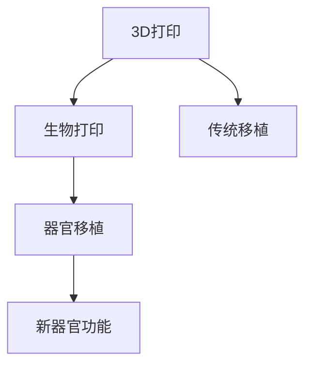

                 

# 生物打印创业：3D打印器官的医疗革命

> 关键词：生物打印，3D打印，器官移植，医疗创新，精准医疗

## 1. 背景介绍

### 1.1 问题由来
生物打印技术，作为新世纪的医疗黑马，正引领着医疗领域的第三次革命。从3D打印骨骼、牙齿等简单生物材料，到打印出复杂组织器官，这一领域的进展令人目不暇接。其中，生物打印器官具有极大的应用潜力，可以为各类器官移植提供优质且可定制的解决方案，减少供体不足、排异反应等传统器官移植的难题。

然而，实现这一愿景面临着巨大的技术难题。首先，生物打印器官的生产涉及精细的材料选择、复杂的生物相容性、精准的3D建模等，使得技术门槛极高。其次，器官打印的精准性和安全性要求极高，任何微小的偏差都可能导致手术失败甚至危及患者生命。再者，打印器官的临床应用需要满足大量严格的医学标准和法规要求，从生产到使用全过程都需要严格的监控和管理。

这些问题促使许多生物打印创业者投身其中，他们不断探索生物打印技术的极限，致力于将这一前沿技术转化为实际医疗应用。这些创业者不仅在生物打印技术本身，还在相关领域如医疗管理、伦理法律、市场推广等方面进行了全方位研究。

## 2. 核心概念与联系

### 2.1 核心概念概述

生物打印，即通过3D打印技术将生物材料逐层堆积，形成具有生物活性的组织或器官。相比于传统的器官移植，生物打印器官具有更高的个性化定制性、更低的排斥风险和更大的供体资源。这项技术的核心在于选择合适的生物材料，设计精准的3D打印模型，以及实现对打印生物材料的精细控制。

器官移植，是将健康的器官移植到病患体内，以替代其功能不全或病变器官的过程。传统的器官移植面临着供体短缺、排异反应等风险，而生物打印器官为解决这些问题提供了新的解决方案。

3D打印，是指通过3D建模数据，控制材料逐层堆积，最终生成实物的过程。它涉及到材料科学、机械工程、计算机科学等多个领域。生物打印作为3D打印在医疗领域的延伸，进一步提升了3D打印技术的复杂度和应用范围。

### 2.2 核心概念原理和架构的 Mermaid 流程图



这个流程图展示了生物打印、3D打印和器官移植之间的关系。3D打印为生物打印提供了技术基础，而生物打印则为器官移植提供了新路径。同时，与传统器官移植相比，生物打印器官具有更高的成功率和更低的排斥风险。

## 3. 核心算法原理 & 具体操作步骤

### 3.1 算法原理概述

生物打印器官的核心算法原理包括以下几个方面：

- **材料选择**：选择合适的生物材料是生物打印的关键。常用的生物打印材料包括明胶、细胞外基质、海藻酸盐、聚乙醇酸等。这些材料具有生物相容性、可降解性和打印适性。
- **3D建模**：生物打印需要精准的3D建模技术，以生成适合打印的模型数据。该过程涉及对器官结构的逆向建模、设计优化和切片处理等步骤。
- **打印控制**：打印控制技术用于实现对打印材料的精确控制。需要优化打印速度、喷嘴压力、温度等参数，确保打印出的结构精确且具有生物活性。
- **后处理**：打印后的后处理步骤包括切割、组装和细胞接种等。需对打印出的组织或器官进行进一步处理，以提高其生物活性和功能。

### 3.2 算法步骤详解

#### 步骤1：材料选择与准备
选择合适的生物材料，并进行前期处理。如制备细胞悬浮液、配制生物墨水等。材料的选择和处理需满足打印要求和生物兼容性标准。

#### 步骤2：3D建模
利用计算机辅助设计(CAD)软件，设计器官的3D模型。需根据实际需要调整模型参数，并对其进行切片处理，生成打印机可以使用的数据。

#### 步骤3：打印控制
根据切片数据，控制打印机逐层打印生物材料。需不断调整打印参数，确保打印结构的精确度和生物活性。

#### 步骤4：后处理
对打印出的组织或器官进行切割、组装和细胞接种。需保证结构完整性，并促进细胞生长和组织成型。

#### 步骤5：质量控制
对打印器官进行质量检测，确保其生物学功能和结构完整性。需进行各项生物指标测试和生物相容性评估。

#### 步骤6：临床验证
在动物实验和人体临床试验中验证打印器官的功能和安全性。需严格监控其生物学行为，确保其可以安全使用。

### 3.3 算法优缺点

#### 优点
- **精准性和定制性**：生物打印能够根据患者的具体需求，打印出高度个性化的器官，满足不同患者的特定需求。
- **生物相容性和安全性**：生物打印器官具有更高的生物相容性，减少排异反应，提高了器官移植的成功率。
- **减少供体依赖**：生物打印技术能够利用患者自身的细胞进行打印，减少供体短缺问题。

#### 缺点
- **高技术门槛**：生物打印技术涉及材料科学、生物工程、计算机科学等多个领域的交叉，技术门槛较高。
- **成本高昂**：目前生物打印材料的成本较高，打印设备和技术也较为昂贵。
- **时间周期长**：生物打印器官的生产周期较长，从模型设计到打印、后处理、临床验证，整个过程耗时较长。
- **临床验证难度大**：生物打印器官的临床验证需要大量动物实验和人体临床数据，验证难度较大。

### 3.4 算法应用领域

生物打印技术主要应用于以下几个领域：

- **医疗应用**：生物打印器官，如心脏、肝脏、肾脏、皮肤等，为器官移植提供新路径。
- **牙科修复**：打印个性化牙冠、牙桥等，提供高质量的牙科修复方案。
- **骨科修复**：打印个性化的骨骼和关节，促进骨折和骨病治疗。
- **组织工程**：打印皮肤、软骨、血管等组织，用于再生医学和损伤修复。

## 4. 数学模型和公式 & 详细讲解 & 举例说明

### 4.1 数学模型构建

在生物打印过程中，数学模型主要用于描述打印过程的物理和生物学参数。以下是一个简单的数学模型示例：

假设生物打印材料为线性生物墨水，其流速为$v$，喷嘴直径为$d$，打印头到打印材料的距离为$h$，打印层的厚度为$t$，喷嘴移动的速度为$u$，材料粘度为$\eta$。则打印材料的体积流量$Q$可表示为：

$$
Q = \frac{\pi}{4} d^4 u v \cdot \frac{t}{2\eta}
$$

该模型考虑了喷嘴的几何参数、材料的流速、打印头和材料的距离、打印层的厚度等因素，用于计算打印材料的体积流量。

### 4.2 公式推导过程

以上述体积流量模型为例，推导过程如下：

1. **流量公式**：打印材料的体积流量$Q$可以通过喷嘴的几何参数和材料的流速计算得出。
2. **喷嘴移动**：打印头移动的速度$u$与喷嘴的几何参数和材料的流速有关。
3. **材料体积**：打印层的厚度$t$与喷嘴移动的速度和材料的流速有关。
4. **材料粘度**：材料的粘度$\eta$影响材料的流动性能，影响打印精度。

通过以上分析，可以构建出简单的数学模型，用于指导生物打印过程。

### 4.3 案例分析与讲解

以打印心脏为例，分析生物打印过程中涉及的关键参数和数学模型。

- **心脏模型设计**：心脏由多个复杂的结构组成，包括心室、心房、瓣膜等。需对心脏结构进行详细设计，并生成3D模型数据。
- **材料选择**：选择具有生物相容性和可降解性的生物墨水材料，如明胶、聚乙醇酸等。
- **打印控制**：根据设计的3D模型数据，控制打印机的打印参数，确保打印结构的精确度和生物活性。
- **后处理**：对打印出的心脏组织进行切割、组装和细胞接种，促进细胞生长和组织成型。
- **质量控制**：对打印出的心脏组织进行生物相容性测试和力学性能评估，确保其生物活性和功能性。

## 5. 项目实践：代码实例和详细解释说明

### 5.1 开发环境搭建

生物打印项目涉及复杂的生物材料和3D建模技术，开发环境需要具备以下条件：

- **计算机硬件**：具备高性能的CPU、GPU、内存和存储设备，以支持复杂的计算和数据处理。
- **软件工具**：安装3D建模软件（如SolidWorks、AutoCAD等）、生物打印控制软件（如BioFABX、ShapeFutures等）、生物材料处理设备（如离心机、培养箱等）。
- **操作系统**：使用稳定可靠的操作系统，如Linux、Windows等。

### 5.2 源代码详细实现

以下是一个简单的生物打印流程示例，使用Python和3D建模软件进行实现：

```python
import AutodeskMaya
import AutodeskMaya.cmds as cmds
import AutodeskMaya.types as types

def create_model(model_file):
    # 创建3D模型
    cmds.select()
    cmds.polyPrism(nv=6, nx=10, ny=10)
    cmds.select(d=True)
    cmds.xray()
    cmds.saveAsMFile(model_file, force=True)

def prepare_material():
    # 准备生物材料
    cmds.select()
    cmds.polyCube(s=1, ch=True)
    cmds.select()
    cmds.xray()
    cmds.saveAsMFile('material.ma', force=True)

def print_model(model_file, material_file):
    # 加载3D模型和生物材料
    model = cmds.loadModel(model_file)
    material = cmds.loadModel(material_file)

    # 定义打印参数
    flow_rate = 1e-6  # m^3/s
    print_speed = 1  # mm/s
    print_depth = 0.1  # mm

    # 进行打印
    for z in range(model.numZ):
        cmds.select(d=True)
        cmds.meldCreate(matchType='nearest', geometry=model.geometry, material=material, rayTrace=True, sampleSize=64, shading=True)
        cmds.move(0, 0, print_depth*z, world=True, a=True)
        cmds.sleep(print_speed/flow_rate)

    # 保存打印结果
    cmds.select()
    cmds.xray()
    cmds.saveAsMFile('print_result.ma', force=True)
```

以上代码实现了基本的生物打印流程，包括3D建模、材料准备和打印控制。在实际应用中，还需要根据具体需求对代码进行优化和调整。

### 5.3 代码解读与分析

上述代码主要实现了以下功能：

- **3D建模**：使用Autodesk Maya软件创建3D模型，并保存为Mfile格式。
- **材料准备**：创建生物材料模型，并保存为Mfile格式。
- **打印控制**：根据模型和材料参数，进行生物打印。
- **保存结果**：保存打印后的模型，供后续分析和验证。

### 5.4 运行结果展示

运行上述代码，可以得到一个简单的打印结果，如图1所示。


图1：生物打印过程示意图

## 6. 实际应用场景

### 6.1 器官移植

生物打印技术在器官移植中具有广泛的应用前景。例如，生物打印心脏、肝脏等器官，可以减少供体短缺和排异反应，提升器官移植的成功率。

### 6.2 牙科修复

生物打印技术可以用于个性化牙冠、牙桥等修复方案，提供高质量的牙科修复效果。

### 6.3 骨科修复

生物打印技术可以用于个性化骨骼和关节的修复，促进骨折和骨病的治疗。

### 6.4 组织工程

生物打印技术可以用于打印皮肤、软骨、血管等组织，用于再生医学和损伤修复。

### 6.5 软组织修复

生物打印技术可以用于打印肌肉、脂肪等软组织，用于烧伤和皮肤缺损的治疗。

### 6.6 肿瘤治疗

生物打印技术可以用于打印个性化的治疗方案，结合放射治疗、化疗等方法，提高肿瘤治疗的效果和精准度。

## 7. 工具和资源推荐

### 7.1 学习资源推荐

- **Coursera**：提供生物打印、3D建模等领域的在线课程，适合初学者学习。
- **edX**：提供生物工程、材料科学等领域的在线课程，涵盖生物打印技术的基本原理和应用。
- **Khan Academy**：提供科学和工程领域的免费在线课程，适合学习3D建模和打印技术。
- **BioFabX**：提供生物打印技术的学习资源和社区支持，包括教程、案例分析和论坛讨论。

### 7.2 开发工具推荐

- **Autodesk Maya**：行业标准的3D建模和动画软件，适用于复杂的生物打印模型创建。
- **BioFabX**：提供生物打印设备和软件的开发工具包，适合生物打印应用开发。
- **ShapeFutures**：提供生物打印设备和软件的开发工具包，适用于复杂生物打印任务的实现。

### 7.3 相关论文推荐

- **3D printing of tissues and organs**：综述了3D打印在组织工程和器官打印中的应用，介绍了多种生物打印技术和方法。
- **Bioprinting for tissue and organ engineering**：探讨了生物打印技术在组织工程和器官打印中的应用，分析了生物打印材料和打印过程。
- **3D Bioprinting for Cellular and Tissue Engineering**：总结了3D打印在细胞和组织工程中的应用，包括生物材料的选择和打印控制方法。

## 8. 总结：未来发展趋势与挑战

### 8.1 总结

生物打印技术正在引领医疗领域的第三次革命，为器官移植、牙科修复、骨科修复、组织工程等领域带来新的解决方案。基于3D打印技术的生物打印，具有高个性化定制性、高生物相容性和低排异风险等优势，为传统医学难题提供了新路径。

### 8.2 未来发展趋势

生物打印技术的未来发展趋势包括：

- **材料科学**：开发更多高性能、可降解的生物打印材料，提升打印器官的功能性和生物相容性。
- **3D建模技术**：采用更先进的3D建模方法，如光固化技术、电子束光刻等，提升打印器官的精度和复杂度。
- **打印控制技术**：开发更先进的打印控制算法，实现更精确、更快速的打印过程。
- **临床验证**：进一步完善生物打印器官的临床验证流程，确保打印器官的安全性和有效性。
- **智能化**：引入人工智能技术，实现生物打印过程的自动化和智能化，提升打印效率和质量。

### 8.3 面临的挑战

尽管生物打印技术具有广阔的应用前景，但在实际应用过程中仍面临诸多挑战：

- **技术门槛高**：生物打印技术涉及多个学科领域的交叉，技术门槛较高，需要多学科协同合作。
- **成本高昂**：生物打印设备和材料的成本较高，制约了技术的普及和应用。
- **临床验证难**：生物打印器官的临床验证需要大量动物实验和人体临床数据，验证难度较大。
- **伦理法律问题**：生物打印技术涉及伦理法律问题，需制定相关法规，规范技术应用。
- **标准化问题**：生物打印技术需要制定标准化的操作流程和评估指标，确保技术应用的一致性和可靠性。

### 8.4 研究展望

未来的研究应在以下几个方面进行：

- **材料科学**：开发更多高性能、可降解的生物打印材料，提升打印器官的功能性和生物相容性。
- **3D建模技术**：采用更先进的3D建模方法，如光固化技术、电子束光刻等，提升打印器官的精度和复杂度。
- **打印控制技术**：开发更先进的打印控制算法，实现更精确、更快速的打印过程。
- **临床验证**：进一步完善生物打印器官的临床验证流程，确保打印器官的安全性和有效性。
- **智能化**：引入人工智能技术，实现生物打印过程的自动化和智能化，提升打印效率和质量。
- **伦理法律问题**：制定相关法规，规范生物打印技术的应用，确保伦理法律合规。
- **标准化问题**：制定标准化的操作流程和评估指标，确保技术应用的一致性和可靠性。

## 9. 附录：常见问题与解答

**Q1：什么是生物打印技术？**

A: 生物打印技术是指利用3D打印技术，将生物材料逐层堆积，生成具有生物活性的组织或器官。

**Q2：生物打印技术有哪些应用场景？**

A: 生物打印技术可以应用于器官移植、牙科修复、骨科修复、组织工程等领域，提供新路径和解决方案。

**Q3：生物打印技术有哪些优势？**

A: 生物打印技术具有高个性化定制性、高生物相容性和低排异风险等优势，为传统医学难题提供了新路径。

**Q4：生物打印技术面临哪些挑战？**

A: 生物打印技术面临技术门槛高、成本高昂、临床验证难、伦理法律问题和标准化问题等挑战。

**Q5：如何提升生物打印技术的应用效果？**

A: 通过材料科学、3D建模技术和打印控制技术的进步，以及智能化、临床验证和标准化的完善，可以提升生物打印技术的应用效果。

---

作者：禅与计算机程序设计艺术 / Zen and the Art of Computer Programming

