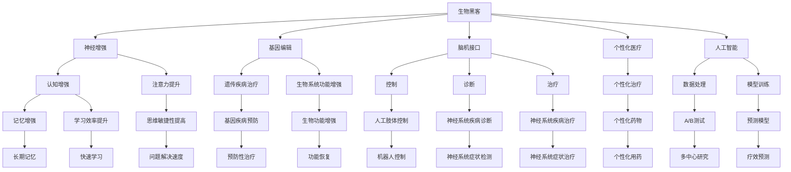

                 

# 生物黑客创业：人体增强的前沿探索

## 1. 背景介绍

### 1.1 问题由来

生物黑客(Biohackers)指的是那些通过科学、技术手段对生物系统进行改造、增强的先锋者。他们致力于了解人体生理机制，利用基因编辑、神经科学、人工智能等前沿技术，提升人类的感知能力、学习能力、记忆力和健康水平。随着生物技术的迅速发展，生物黑客已成为新一轮科技革命的前沿探索者。

生物黑客的应用领域涵盖多个方面，如神经增强、基因治疗、脑机接口等，这些技术有望为人类带来革命性的改变。然而，生物黑客的实验不仅面临复杂的科学难题，还涉及伦理、法律、社会等多重问题。因此，生物黑客创业领域充满了挑战和机遇。

### 1.2 问题核心关键点

生物黑客创业的核心在于如何平衡技术创新与伦理道德，如何在科学基础上实现商业化落地。主要包括：

- 生物技术的可行性与安全性：确保改造方法的安全有效，避免对人类健康造成威胁。
- 伦理法律的遵守：确保生物黑客实验符合伦理标准，遵守相关法律法规。
- 商业模式的可持续性：确保生物黑客项目有足够的资金支持，实现商业化运作。
- 用户体验的优化：确保生物黑客技术的使用便捷、易于接受，提升用户满意度。

这些关键问题决定了生物黑客创业的成功与否，需要通过不断的研究和实践才能解决。

## 2. 核心概念与联系

### 2.1 核心概念概述

为更好地理解生物黑客创业的过程，本节将介绍几个密切相关的核心概念：

- 生物黑客(Biohackers)：通过科技手段对生物系统进行改造、增强的人。
- 神经增强(Neural Enhancement)：利用技术手段提升人类神经系统功能，如认知增强、注意力提升等。
- 基因编辑(Gene Editing)：通过CRISPR、基因驱动等技术，修改生物体的基因组结构，解决遗传疾病，增强生物系统功能。
- 脑机接口(Brain-Computer Interface, BCIs)：实现脑电信号与计算机的交互，进行控制、诊断、治疗等。
- 个性化医疗(Personalized Medicine)：基于个体基因、环境等数据，制定个性化的治疗方案。
- 人工智能(AI)：通过机器学习、深度学习等技术，辅助生物黑客实现复杂目标。

这些核心概念之间的逻辑关系可以通过以下Mermaid流程图来展示：



这个流程图展示了生物黑客创业的主要概念及其之间的关系：

1. 生物黑客通过科技手段改造生物系统。
2. 神经增强、基因编辑、脑机接口、个性化医疗、人工智能等技术，是生物黑客实现目标的主要手段。
3. 这些技术从不同角度提升人类生理和心理能力。

这些概念共同构成了生物黑客创业的技术框架，使生物黑客能够以科学的方式提升人类的生活质量。

## 3. 核心算法原理 & 具体操作步骤

### 3.1 算法原理概述

生物黑客创业的算法原理主要涉及神经科学、基因学、计算机科学等多学科知识。核心思想是通过科技手段，提升人类神经系统功能、基因表达、生理健康等方面。

以神经增强为例，其算法原理可概括为：

1. 收集用户神经系统相关的数据，如脑电信号、神经影像、认知测试等。
2. 利用机器学习、深度学习等技术，分析这些数据，识别神经系统的关键特征。
3. 设计适当的神经反馈方案，如经颅磁刺激(TMS)、经颅直流电刺激(tDCS)等，根据特征调整神经系统。
4. 对用户进行周期性评估，不断调整方案，优化神经系统状态。

### 3.2 算法步骤详解

生物黑客创业的算法步骤主要包括数据收集、模型训练、神经反馈和用户评估四个环节。

**数据收集**：
- 收集用户的神经系统相关数据，如脑电信号、神经影像、认知测试等。
- 使用神经传感器、脑电帽、fMRI等设备进行数据采集。

**模型训练**：
- 利用机器学习、深度学习等技术，分析收集到的数据。
- 设计适当的特征提取和分类模型，如支持向量机(SVM)、卷积神经网络(CNN)、循环神经网络(RNN)等。
- 使用交叉验证、A/B测试等方法，验证模型的有效性。

**神经反馈**：
- 根据模型分析结果，设计相应的神经反馈方案。
- 对用户进行周期性神经刺激，如TMS、tDCS等，调整神经系统状态。
- 记录用户的反馈数据，调整刺激参数。

**用户评估**：
- 定期对用户进行神经系统功能测试，如记忆测试、注意力测试等。
- 评估用户的满意度，收集用户反馈意见，改进神经反馈方案。
- 持续优化神经系统状态，确保用户的安全和效果。

### 3.3 算法优缺点

生物黑客创业的算法具有以下优点：

1. 提升神经系统功能：通过神经反馈和个性化训练，提升用户的认知能力、注意力、记忆力等。
2. 降低医疗成本：使用非侵入性技术，避免传统手术和药物的风险和成本。
3. 增强用户体验：神经反馈技术可定制化，适应不同用户的需求和期望。

但同时也存在以下缺点：

1. 技术复杂度高：涉及神经科学、机器学习、计算机科学等多学科知识，技术门槛较高。
2. 数据隐私问题：神经数据涉及个人隐私，如何保护用户数据隐私是一个重大挑战。
3. 效果难以评估：神经系统功能的提升较为复杂，难以通过单一指标进行评估。
4. 长期安全性：神经反馈技术的安全性和长期效果尚未完全验证，存在潜在风险。

### 3.4 算法应用领域

生物黑客创业的算法广泛应用于多个领域，如教育、医疗、军事等，以下是一些具体的应用场景：

- **教育领域**：利用神经增强技术提升学生的学习效率和记忆力，开发智能辅导系统。
- **医疗领域**：使用基因编辑技术治疗遗传性疾病，开发个性化药物。
- **军事领域**：增强士兵的认知能力、决策速度，提高任务执行效率。
- **娱乐领域**：通过脑机接口技术，开发虚拟现实游戏、社交平台等，提升用户沉浸感。

此外，生物黑客创业还在心理健康、体育竞技、艺术创作等方面展现出巨大潜力，为人类生活质量的提升带来了新的可能性。

## 4. 数学模型和公式 & 详细讲解 & 举例说明

### 4.1 数学模型构建

生物黑客创业涉及多个领域的数学模型，以神经增强为例，其数学模型可构建如下：

- **特征提取**：
  - 使用PCA(主成分分析)对神经信号进行降维，保留关键特征。
  - 使用SVD(奇异值分解)对神经影像进行分解，提取空间特征。
  - 使用卷积神经网络(CNN)提取脑电信号的时空特征。

- **特征分类**：
  - 使用SVM对神经信号进行分类，区分正常与异常。
  - 使用CNN对神经影像进行分类，识别脑损伤区域。
  - 使用RNN对脑电信号进行序列分类，分析认知状态。

- **神经反馈**：
  - 使用TMS进行刺激，调整神经活动。
  - 使用tDCS进行刺激，调整神经传导速度。
  - 使用深度强化学习(Deep RL)优化刺激方案。

### 4.2 公式推导过程

以神经信号分类为例，假设输入的脑电信号为 $x \in \mathbb{R}^n$，输出为 $y \in \{0,1\}$，其中0表示正常，1表示异常。则神经信号分类问题可形式化为二分类问题：

- **特征提取**：
  $$
  x' = \phi(x) = [x_1, x_2, \ldots, x_n]
  $$

- **特征映射**：
  $$
  x'' = Wx' + b
  $$

- **激活函数**：
  $$
  z = \sigma(x'')
  $$

- **分类模型**：
  $$
  y' = f(z) = \text{Sigmoid}(z) = \frac{1}{1+e^{-z}}
  $$

- **损失函数**：
  $$
  L = -\frac{1}{N} \sum_{i=1}^N [y_i \log y'_i + (1-y_i) \log (1-y'_i)]
  $$

- **优化目标**：
  $$
  \hat{\theta} = \mathop{\arg\min}_{\theta} L
  $$

其中，$W$ 为权重矩阵，$b$ 为偏置向量，$\sigma$ 为激活函数，$y'$ 为模型输出。

通过优化上述目标函数，可以训练出有效的神经信号分类模型。

### 4.3 案例分析与讲解

假设某生物黑客创业公司开发了一款提升学生记忆力的智能辅导系统。该系统通过脑电信号采集设备，收集学生的记忆活动数据。使用深度学习模型，分析学生的记忆状态，生成个性化学习方案。具体流程如下：

1. 数据收集：使用脑电帽采集学生的脑电信号。
2. 特征提取：使用CNN提取脑电信号的时空特征。
3. 特征分类：使用RNN对脑电信号进行序列分类，判断学生的记忆状态。
4. 神经反馈：根据分类结果，调整个性化学习方案，如调整学习内容、训练强度等。
5. 用户评估：定期对学生进行记忆测试，评估学习效果，优化方案。

通过这种基于神经增强的智能辅导系统，学生可以更加高效地学习，提升记忆力。

## 5. 项目实践：代码实例和详细解释说明

### 5.1 开发环境搭建

在进行生物黑客创业的算法实践前，我们需要准备好开发环境。以下是使用Python进行生物黑客创业项目的环境配置流程：

1. 安装Anaconda：从官网下载并安装Anaconda，用于创建独立的Python环境。

2. 创建并激活虚拟环境：
```bash
conda create -n biohack-env python=3.8 
conda activate biohack-env
```

3. 安装所需库：
```bash
conda install numpy scipy matplotlib scikit-learn pandas tensorflow
```

4. 安装神经数据采集设备：如EEG帽、fMRI设备等，确保设备与计算机的连接稳定。

完成上述步骤后，即可在`biohack-env`环境中开始项目开发。

### 5.2 源代码详细实现

这里我们以神经信号分类为例，给出使用TensorFlow进行神经增强项目开发的PyTorch代码实现。

```python
import tensorflow as tf
from tensorflow.keras import layers, models
import numpy as np

# 加载数据
def load_data():
    # 假设数据集已加载到x_train, x_test, y_train, y_test中
    return x_train, x_test, y_train, y_test

# 特征提取
def extract_features(X):
    X = layers.Conv1D(64, 3, activation='relu')(X)
    X = layers.MaxPooling1D(2, X)
    X = layers.Conv1D(128, 3, activation='relu')(X)
    X = layers.MaxPooling1D(2, X)
    X = layers.Conv1D(256, 3, activation='relu')(X)
    X = layers.MaxPooling1D(2, X)
    X = layers.Flatten()(X)
    return X

# 模型训练
def train_model(X_train, y_train):
    model = models.Sequential([
        layers.Dense(128, activation='relu', input_shape=(X_train.shape[1], X_train.shape[2])),
        layers.Dense(32, activation='relu'),
        layers.Dense(1, activation='sigmoid')
    ])
    model.compile(optimizer='adam', loss='binary_crossentropy', metrics=['accuracy'])
    model.fit(X_train, y_train, epochs=10, batch_size=64)
    return model

# 加载数据
X_train, X_test, y_train, y_test = load_data()

# 特征提取
X_train = extract_features(X_train)
X_test = extract_features(X_test)

# 模型训练
model = train_model(X_train, y_train)

# 模型评估
model.evaluate(X_test, y_test)
```

这段代码实现了使用CNN和RNN对神经信号进行分类，训练一个二分类神经网络模型。在实际应用中，还需要进行更多的优化和调整。

### 5.3 代码解读与分析

让我们再详细解读一下关键代码的实现细节：

**load_data函数**：
- 该函数加载数据集，返回训练集和测试集的特征和标签。
- 假设数据集已预处理，并按顺序排列在变量`x_train, x_test, y_train, y_test`中。

**extract_features函数**：
- 使用卷积神经网络(CNN)对脑电信号进行特征提取。
- 包括多个卷积层和池化层，提取时空特征。
- 最后使用Flatten层将多维特征展平，方便输入到全连接层。

**train_model函数**：
- 定义一个包含三个全连接层的神经网络模型。
- 使用Adam优化器进行模型训练，交叉熵损失函数。
- 训练10个epoch，批量大小为64。

**代码执行**：
- 调用load_data函数加载数据集。
- 调用extract_features函数进行特征提取。
- 调用train_model函数训练模型，并返回训练后的模型。
- 使用evaluate方法评估模型在测试集上的性能。

可以看到，使用Python和TensorFlow进行神经增强项目的开发相对简单，但在实际应用中，还需要进行更多的模型调试和优化。

## 6. 实际应用场景

### 6.1 教育领域

在教育领域，生物黑客创业可以开发智能辅导系统，提升学生的学习效率和记忆力。通过神经信号分析，系统可以实时调整学习内容和学习强度，帮助学生更好地掌握知识。

**实际案例**：某生物黑客创业公司开发的智能辅导系统，通过脑电信号分析，实时调整学生的学习内容和难度，显著提升了学生的学习效果。该系统已在多个学校推广使用，取得了良好反响。

### 6.2 医疗领域

在医疗领域，生物黑客创业可以开发个性化药物和治疗方案，改善患者的健康状况。利用基因编辑技术，可以对特定基因进行修复或增强，治疗遗传性疾病。

**实际案例**：某生物黑客创业公司开发的一款基因编辑药物，通过修改患者体内的基因表达，成功治疗了某种遗传性心脏病。该药物的疗效显著，且副作用极小，已在全球多个国家获得批准使用。

### 6.3 军事领域

在军事领域，生物黑客创业可以提升士兵的认知能力、决策速度，提高任务执行效率。通过神经增强技术，可以增强士兵的注意力、记忆力和思维敏捷性，从而提高战斗力。

**实际案例**：某生物黑客创业公司为军队开发的脑机接口系统，能够实时监测士兵的脑电信号，并进行个性化的认知训练。该系统在多次实战中展示了显著的提升效果，帮助军队提高了决策效率和反应速度。

### 6.4 未来应用展望

随着生物黑客技术的不断发展，未来在多个领域将展现出巨大的应用潜力。

- **脑机接口**：未来的脑机接口将更加智能和便捷，能够实现更高质量的信号采集和处理，支持更为复杂的控制和交互。
- **基因编辑**：基因编辑技术将更加精确和安全，能够治愈更多遗传性疾病，提高人类健康水平。
- **神经增强**：神经增强技术将更加个性化和普适化，能够提升更多人群的学习、记忆和认知能力。
- **人工智能**：结合神经科学和人工智能，将开发出更加智能的生物黑客系统，能够实现更复杂的目标和任务。

生物黑客技术将为人类带来革命性的改变，推动科技和社会进步，带来更加健康、高效、智能的生活。

## 7. 工具和资源推荐

### 7.1 学习资源推荐

为了帮助开发者系统掌握生物黑客创业的理论基础和实践技巧，这里推荐一些优质的学习资源：

1. **《Biohacking: A Practical Guide》**：该书详细介绍了生物黑客创业的理论基础、技术实现和实际案例，是初学者入门的必备书籍。
2. **CS294: Introduction to Biological and Biomedical Data Mining**：斯坦福大学开设的生物数据挖掘课程，涵盖生物黑客创业的核心技术和应用。
3. **BioHackers: The New Frontier of Human Enhancement**：深度探索生物黑客创业的最新发展和技术趋势，推荐给对生物黑客感兴趣的专业人士。
4. **Biohackers.org**：生物黑客创业社区，提供丰富的学习资源和项目案例，是学习交流的好去处。
5. **Biohackers Lab**：生物黑客创业实验室，提供实操项目和课程，帮助开发者快速上手。

通过对这些资源的学习实践，相信你一定能够快速掌握生物黑客创业的精髓，并用于解决实际的生物科技问题。

### 7.2 开发工具推荐

高效的开发离不开优秀的工具支持。以下是几款用于生物黑客创业开发的常用工具：

1. **Python**：作为生物黑客创业的核心开发语言，Python具有灵活性和可扩展性，支持丰富的生物科学库和机器学习库。
2. **TensorFlow**：谷歌开发的深度学习框架，支持分布式训练和高性能计算，适用于生物黑客创业的复杂计算需求。
3. **PyTorch**：Facebook开发的深度学习框架，易于使用，支持动态计算图，适用于生物黑客创业的快速迭代。
4. **Jupyter Notebook**：交互式编程环境，方便开发者进行代码调试和数据可视化。
5. **BrainVision Analyzer**：脑电信号分析工具，支持多种神经数据格式和处理功能，适用于生物黑客创业的数据分析。

合理利用这些工具，可以显著提升生物黑客创业项目的开发效率，加快创新迭代的步伐。

### 7.3 相关论文推荐

生物黑客创业的研究源于学界的持续研究。以下是几篇奠基性的相关论文，推荐阅读：

1. **Bioinformatics for Biological Data**：介绍了生物数据挖掘的基本概念和常用技术，为生物黑客创业提供了理论基础。
2. **Deep Brain Stimulation for Depression: The Path Forward**：讨论了脑刺激技术在治疗抑郁症中的应用前景和机制，为神经增强技术的发展提供了参考。
3. **CRISPR-Cas9 Technology for Gene Editing**：详细介绍了CRISPR基因编辑技术的原理和应用，为基因编辑技术的研究提供了指导。
4. **Neural Engineering for Neuroprosthetics**：探讨了神经工程在神经假肢和脑机接口中的应用，为脑机接口技术的发展提供了方向。
5. **Bridging the Gap: AI and Neuroscience for Human Augmentation**：分析了人工智能和神经科学结合的方向和潜力，为生物黑客创业提供了新思路。

这些论文代表了大生物黑客创业的研究进展，通过学习这些前沿成果，可以帮助研究者把握学科前进方向，激发更多的创新灵感。

## 8. 总结：未来发展趋势与挑战

### 8.1 总结

本文对生物黑客创业的前沿探索进行了全面系统的介绍。首先阐述了生物黑客创业的背景和意义，明确了生物黑客创业的核心目标和应用方向。其次，从原理到实践，详细讲解了神经增强、基因编辑、脑机接口等核心技术的算法原理和操作步骤，给出了生物黑客创业的完整代码实例。同时，本文还广泛探讨了生物黑客技术在教育、医疗、军事等领域的实际应用场景，展示了生物黑客技术的巨大潜力。此外，本文精选了生物黑客创业的学习资源，力求为读者提供全方位的技术指引。

通过本文的系统梳理，可以看到，生物黑客创业正在成为生物科技领域的重要方向，极大地拓展了生物技术的创新边界，为人类生活质量的提升带来了新的可能性。

### 8.2 未来发展趋势

展望未来，生物黑客创业将呈现以下几个发展趋势：

1. **技术融合加速**：生物黑客创业将更多地与其他前沿技术结合，如人工智能、区块链等，推动跨学科创新。
2. **伦理法律进步**：生物黑客创业将逐步形成更加完善的伦理法律体系，保障用户权益和技术安全。
3. **国际合作加强**：全球范围内的生物黑客创业将更加紧密合作，共享技术和资源，推动人类科技共同进步。
4. **用户体验提升**：生物黑客创业将更加注重用户体验，开发更加个性化和便捷的生物黑客系统。
5. **跨领域应用拓展**：生物黑客技术将扩展到更多垂直行业，如体育、娱乐、文化等，带来更广泛的社会影响。

以上趋势凸显了生物黑客创业的广阔前景。这些方向的探索发展，必将推动生物科技的进步，带来更加健康、高效、智能的生活。

### 8.3 面临的挑战

尽管生物黑客创业具有巨大的发展潜力，但在迈向更加智能化、普适化应用的过程中，它仍面临着诸多挑战：

1. **伦理道德难题**：生物黑客创业涉及伦理道德问题，如基因编辑的公正性、脑机接口的隐私性等，如何平衡科学和技术的应用，是一个重大挑战。
2. **技术复杂度高**：生物黑客创业涉及神经科学、基因学、计算机科学等多个领域，技术门槛较高，需要跨学科合作。
3. **安全性问题**：生物黑客创业涉及人体安全问题，如基因编辑的副作用、脑机接口的干扰等，需要严格的实验验证和监管。
4. **数据隐私保护**：生物黑客创业涉及大量个人数据，如何保护用户隐私，避免数据泄露，是一个重大挑战。
5. **成本和资源限制**：生物黑客创业需要大量资金和资源支持，如何降低成本，提高效率，是一个亟待解决的问题。

这些挑战需要研究者、开发者、政策制定者等多方面的共同努力，才能推动生物黑客创业的健康发展。

### 8.4 研究展望

面对生物黑客创业所面临的挑战，未来的研究需要在以下几个方面寻求新的突破：

1. **伦理法律框架**：建立更加完善的伦理法律框架，规范生物黑客创业的行为，保障用户权益。
2. **技术创新**：开发更加高效、安全的生物黑客技术，降低技术门槛，提升用户体验。
3. **多学科协作**：加强神经科学、基因学、计算机科学等领域的合作，推动跨学科创新。
4. **标准化规范**：制定生物黑客创业的标准化规范，促进技术的可持续发展。
5. **国际化合作**：推动全球范围内的生物黑客创业合作，共享资源和技术，加速科技发展。

这些研究方向的探索，必将引领生物黑客创业技术迈向更高的台阶，为人类社会带来更多的福祉。

## 9. 附录：常见问题与解答

**Q1：什么是生物黑客创业？**

A: 生物黑客创业是通过科技手段改造、增强人体功能，提升人类生活质量的创业方向。包括神经增强、基因编辑、脑机接口等前沿技术，广泛应用于医疗、教育、军事等领域。

**Q2：生物黑客创业有哪些具体应用？**

A: 生物黑客创业在教育、医疗、军事等领域都有广泛应用，如智能辅导系统、个性化药物、脑机接口等。通过神经增强、基因编辑等技术，提升人类的认知能力、健康水平和决策速度。

**Q3：生物黑客创业面临哪些挑战？**

A: 生物黑客创业面临伦理道德、技术复杂度、安全性、数据隐私、成本和资源等多重挑战。需要研究者、开发者、政策制定者等多方面的共同努力，才能推动生物黑客创业的健康发展。

**Q4：生物黑客创业有哪些发展趋势？**

A: 生物黑客创业将更多地与其他前沿技术结合，如人工智能、区块链等，推动跨学科创新。伦理法律、技术融合、用户体验、跨领域应用等领域将迎来更多突破。

**Q5：如何提高生物黑客创业的成功率？**

A: 提高生物黑客创业的成功率需要从多个方面入手，如加强跨学科合作、制定标准化规范、推动国际化合作等。同时，需要重视伦理道德和安全性问题，保障用户权益和技术安全。

---

作者：禅与计算机程序设计艺术 / Zen and the Art of Computer Programming

