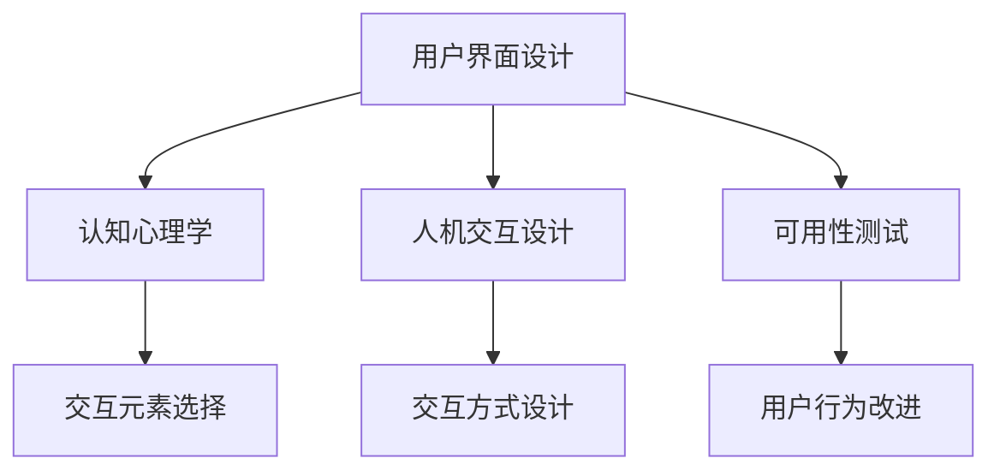

                 

# 用户界面设计：提升人类计算的用户体验

> 关键词：用户界面设计, 用户体验, 人类计算, 计算思维, 界面元素, 人机交互, 可用性测试, 设计原则

## 1. 背景介绍

### 1.1 问题由来

随着计算技术的迅猛发展，人工智能(AI)、机器学习(ML)等技术逐渐渗透到各行各业。面对日益复杂的数据处理和决策需求，计算已不再局限于物理计算，越来越多的任务被交给了计算思维去解决。用户界面设计(User Interface Design, UI Design)作为连接计算与用户的桥梁，其质量直接决定了用户体验的好坏，从而影响计算效率和用户满意度。

在传统软件开发中，用户界面设计常被忽视，导致许多应用程序难以满足用户的需求。但随着计算思维的兴起，以用户体验为中心的设计理念逐渐被人们重视，并通过各种技术手段如认知心理学、人机交互设计等进一步提升界面设计的质量。

### 1.2 问题核心关键点

界面设计的核心在于构建简洁高效、美观易用、符合用户心理和行为习惯的交互界面。关键点在于：

1. **目标用户群体的理解**：清晰地界定目标用户的特征、需求、使用场景等，明确设计方向和原则。
2. **界面元素的选择和布局**：合理选择和组合界面元素，确保界面清晰、一致、易于操作。
3. **用户行为与交互的优化**：通过可用性测试等手段，不断改进用户行为和交互体验，提升界面的可用性。
4. **视觉和感知设计**：合理利用色彩、字体、形状等视觉元素，提升用户的感知体验。
5. **性能优化**：确保界面响应迅速，操作流畅，避免因延迟、卡顿等影响用户体验。

### 1.3 问题研究意义

提升用户界面设计的质量，不仅能够提升计算效率，更能显著提高用户满意度，促进技术与社会的良性互动。具体意义包括：

1. **提高工作效率**：优秀的界面设计可以大幅提升用户的操作效率，减少错误率，节约计算资源。
2. **增强用户体验**：直观、易用的界面能够提高用户对系统的认可度和使用频次。
3. **降低技术门槛**：复杂的技术背后，简洁的界面能够让更多用户接触和应用AI技术。
4. **驱动创新发展**：通过不断优化用户界面，推动计算思维与实际应用场景的深度融合。
5. **优化决策质量**：界面设计中融入的计算思维和数据可视化等技术手段，能够增强决策的科学性和合理性。

## 2. 核心概念与联系

### 2.1 核心概念概述

界面设计涉及多个交叉领域，核心概念包括：

- **用户界面设计**：涉及界面元素的选取和布局、交互方式的设计等，旨在提升用户的操作体验。
- **认知心理学**：研究人类信息处理过程及其规律，指导界面设计。
- **人机交互设计**：研究人与机器如何有效互动，优化交互体验。
- **可用性测试**：通过用户测试，评估界面设计效果，发现并改进问题。
- **计算思维**：指将问题抽象为计算模型，使用算法和程序解决计算问题。

这些概念间的关系通过以下Mermaid流程图来展示：



该流程图展示了各个核心概念之间的逻辑关系：

1. **用户界面设计**：基于认知心理学理论，结合人机交互设计，通过可用性测试不断优化，最终达到设计目标。
2. **认知心理学**：提供人类信息处理机制，指导界面元素和交互方式的选择与优化。
3. **人机交互设计**：研究人机交互的效率和体验，指导具体的交互行为设计。
4. **可用性测试**：通过用户测试，评估界面设计效果，提出改进意见。
5. **计算思维**：以计算模型为基础，通过算法和程序解决实际问题，并在界面设计中融入计算思维，增强交互的智能性。

## 3. 核心算法原理 & 具体操作步骤
### 3.1 算法原理概述

界面设计的核心算法原理在于：

1. **目标函数优化**：界面设计的目标函数是通过优化界面元素和交互方式，提升用户体验的满意度。
2. **用户行为预测**：通过认知心理学理论，预测用户在不同界面下的行为模式，优化界面设计。
3. **交互路径分析**：通过人机交互设计，分析用户操作路径，优化界面布局和交互流程。
4. **性能评估与优化**：通过可用性测试，评估界面设计的性能，不断改进优化。

### 3.2 算法步骤详解

界面设计的大致步骤包括：

**Step 1: 需求分析与用户调研**
- 明确目标用户和他们的需求。
- 进行用户调研，收集用户行为和反馈数据。

**Step 2: 界面原型设计**
- 根据需求和调研结果，设计界面原型。
- 通过认知心理学和人机交互设计理论，优化界面元素和交互方式。

**Step 3: 可用性测试**
- 邀请目标用户进行可用性测试，收集使用数据。
- 分析测试结果，发现并解决用户遇到的问题。

**Step 4: 迭代优化**
- 根据可用性测试结果，不断迭代优化界面设计。
- 重复进行可用性测试，确保设计满足用户需求。

**Step 5: 界面实现**
- 根据设计方案，实现界面的具体功能。
- 进行性能优化，确保界面流畅响应。

**Step 6: 发布与反馈**
- 发布界面设计成果，收集用户反馈。
- 根据反馈持续改进界面设计。

### 3.3 算法优缺点

界面设计的算法有如下优点：

1. **用户体验提升**：通过优化界面设计，可以显著提升用户的满意度和操作效率。
2. **智能化决策**：通过计算思维和人机交互设计，可以实现更智能化的界面设计。
3. **设计效率提升**：可用性测试和迭代优化可以大幅提升界面设计的效率和质量。

同时，也存在一些缺点：

1. **设计成本高**：需要进行多轮迭代优化，时间成本较高。
2. **用户需求多样**：不同用户有不同的需求，界面设计需要考虑广泛的用户群体。
3. **技术门槛高**：需要综合运用认知心理学、人机交互设计等多学科知识，对设计者要求较高。

### 3.4 算法应用领域

界面设计在多个领域得到了广泛应用，例如：

1. **计算界面设计**：涉及数据分析、图形处理、编程界面等。通过优化界面，提升计算效率和操作便利性。
2. **电子商务平台**：优化产品展示、购物车、支付界面等，提升用户体验和转化率。
3. **医疗信息系统**：设计电子病历、处方单、检验报告等界面，提升医生和患者的满意度。
4. **教育平台**：设计在线课程、作业提交、考试成绩界面，提升学生的学习体验。
5. **智能家居系统**：设计智能设备和应用界面，提升用户体验和生活便利性。
6. **虚拟现实系统**：设计虚拟环境、交互操作界面，提升虚拟体验的沉浸感和交互性。

这些领域的界面设计，不仅提升了用户体验，也为实际应用带来了显著的性能提升。

## 4. 数学模型和公式 & 详细讲解  
### 4.1 数学模型构建

界面设计可以抽象为一个多目标优化问题，目标函数为：

$$
\min_{I}\{\mathcal{U}(I) + \mathcal{E}(I) + \mathcal{P}(I)\}
$$

其中，$I$ 表示界面设计方案，$\mathcal{U}(I)$ 为用户的满意程度，$\mathcal{E}(I)$ 为界面元素的易于使用程度，$\mathcal{P}(I)$ 为界面性能的优化程度。

### 4.2 公式推导过程

用户满意度的评价函数可以表示为：

$$
\mathcal{U}(I) = \sum_{u \in U}w_u f_u(I)
$$

其中，$U$ 为所有用户，$f_u(I)$ 为第 $u$ 个用户对界面 $I$ 的满意度，$w_u$ 为用户的权重。

界面元素的易于使用程度可以用简洁度、一致性、可访问性等指标来衡量，可以用以下公式表示：

$$
\mathcal{E}(I) = \sum_{e \in E}w_e g_e(I)
$$

其中，$E$ 为所有界面元素，$g_e(I)$ 为第 $e$ 个元素对界面设计的评价，$w_e$ 为元素的权重。

界面性能的优化包括响应时间、加载速度、操作流畅性等，可以用以下公式表示：

$$
\mathcal{P}(I) = \sum_{p \in P}w_p h_p(I)
$$

其中，$P$ 为所有性能指标，$h_p(I)$ 为第 $p$ 个指标的优化程度，$w_p$ 为指标的权重。

### 4.3 案例分析与讲解

以下以一个简单的在线购物平台为例，介绍如何通过界面设计提升用户体验：

**用户调研**
- 收集用户反馈，了解用户需求和使用体验。

**界面原型设计**
- 设计产品展示、购物车、结算界面等原型。
- 引入排序算法和推荐系统，优化商品展示方式。

**可用性测试**
- 邀请用户测试原型，记录用户操作路径和行为。
- 分析测试结果，发现问题并优化。

**迭代优化**
- 多次迭代优化界面设计，确保用户满意度高。

**界面实现**
- 实现购物平台的具体功能。
- 进行性能优化，确保界面流畅响应。

**发布与反馈**
- 发布购物平台，收集用户反馈。
- 根据反馈持续改进界面设计。

通过以上步骤，可以显著提升购物平台的用户体验，提高用户满意度和操作效率。

## 5. 项目实践：代码实例和详细解释说明
### 5.1 开发环境搭建

在进行界面设计实践前，我们需要准备好开发环境。以下是使用Python进行界面设计的开发环境配置流程：

1. 安装Python：从官网下载并安装最新版本的Python，配置好开发环境。
2. 安装必要的库：安装Pillow、numpy、matplotlib等必要的图像处理和数据分析库。
3. 安装界面设计工具：安装Sketch、Figma、Adobe XD等流行的界面设计工具，并进行简单的配置。

### 5.2 源代码详细实现

下面以设计一个简单的在线表单为例，展示如何使用Python进行界面设计：

```python
from tkinter import *

# 创建窗口
window = Tk()
window.title("Online Form")
window.geometry("400x300")

# 创建标签
Label(window, text="Name:").grid(row=0, column=0)
Label(window, text="Age:").grid(row=1, column=0)

# 创建输入框
Entry(window).grid(row=0, column=1)
Entry(window).grid(row=1, column=1)

# 创建提交按钮
Button(window, text="Submit").grid(row=2, columnspan=2)

# 运行窗口
window.mainloop()
```

以上代码创建了一个简单的在线表单界面，包含两个标签和两个输入框，以及一个提交按钮。界面设计主要依赖于GUI库中的组件配置和布局设置。

### 5.3 代码解读与分析

让我们再详细解读一下关键代码的实现细节：

**Tkinter库**：
- 是Python自带的GUI库，提供了丰富的组件和布局选项，适用于快速实现界面原型。

**Label和Entry组件**：
- Label组件用于显示文本标签，Entry组件用于输入文本，通过`grid()`方法进行网格布局设置，使界面元素整齐排列。

**Button组件**：
- 用于创建提交按钮，通过`Button()`方法创建，并使用`grid()`方法设置位置和跨度。

**窗口配置**：
- 通过`Tk()`方法创建窗口，使用`title()`方法设置窗口标题，使用`geometry()`方法设置窗口大小。

通过Tkinter库，可以快速实现界面原型，并通过不断的迭代优化，逐步提升用户体验。实际应用中，还需要进一步结合心理学和人机交互设计理论，进行更深入的界面优化。

## 6. 实际应用场景
### 6.1 智能家居系统

智能家居系统通过界面设计，使用户能够轻松控制家庭设备，提升生活便利性和舒适度。例如，智能音箱可以通过语音交互界面，让用户通过语音命令控制家居设备。智能灯光系统通过触控界面，让用户通过触摸手势调节灯光亮度和颜色。

### 6.2 教育平台

教育平台通过界面设计，提升学生和教师的使用体验，促进教育资源的共享和利用。例如，在线课程平台可以通过交互式界面，展示多媒体内容，提升学习效果。作业提交系统可以通过简洁的界面，简化学生和教师的操作流程。

### 6.3 电子商务平台

电子商务平台通过界面设计，提升用户的购物体验和转化率。例如，产品展示界面可以通过高品质的图片和详细描述，吸引用户购买。购物车和结算界面可以通过直观的界面布局，简化购物流程，提升用户满意度。

### 6.4 医疗信息系统

医疗信息系统通过界面设计，提升医生和患者的使用体验，优化医疗服务。例如，电子病历界面可以通过简洁的布局和易用的功能，提升医生的工作效率。患者查询系统可以通过直观的界面，帮助患者快速查询病历和预约信息。

### 6.5 工业控制系统

工业控制系统通过界面设计，提升操作员和设备的管理效率。例如，设备监控界面可以通过可视化图表和仪表盘，实时展示设备的运行状态和性能数据。故障报警系统可以通过简洁的界面，快速定位和处理设备故障。

### 6.6 虚拟现实系统

虚拟现实系统通过界面设计，提升用户的沉浸式体验。例如，虚拟现实游戏界面可以通过流畅的操作和逼真的环境，提升游戏体验。虚拟实验室界面可以通过易于操作的界面，简化用户的操作流程，提升实验效果。

## 7. 工具和资源推荐
### 7.1 学习资源推荐

为了帮助开发者系统掌握界面设计的理论基础和实践技巧，这里推荐一些优质的学习资源：

1. **《用户界面设计》系列书籍**：如《Don't Make Me Think》《The Elements of User Experience》等，深入浅出地介绍了用户界面设计的核心原则和设计技巧。
2. **《人机交互设计》系列课程**：如麻省理工学院《Interaction Design》课程、斯坦福大学《Human-Computer Interaction》课程，涵盖人机交互设计的理论和实践。
3. **《认知心理学》系列书籍**：如《The Design of Everyday Things》《Understanding Human Cognition》等，深入探讨人类信息处理机制和认知规律。
4. **《可用性测试》系列书籍**：如《Designing for Interaction》《Heuristic Evaluation of User Interface Design》等，涵盖可用性测试的理论和方法。
5. **《计算思维》系列课程**：如哈佛大学《Computational Thinking》课程、卡内基梅隆大学《Introduction to Computing in Python》课程，引导学生培养计算思维和编程能力。

通过对这些资源的学习实践，相信你一定能够快速掌握界面设计的精髓，并用于解决实际的计算问题。

### 7.2 开发工具推荐

高效的开发离不开优秀的工具支持。以下是几款用于界面设计开发的常用工具：

1. **Sketch**：是一款流行的界面设计工具，适用于快速创建原型和进行界面优化。
2. **Figma**：是一款基于Web的界面设计工具，支持多人协作和实时编辑，适用于团队开发和快速迭代。
3. **Adobe XD**：是一款功能强大的界面设计工具，适用于创建复杂的界面原型和进行交互设计。
4. **Axure RP**：是一款专业的界面设计工具，适用于创建交互式原型和进行用例分析。
5. **InVision Studio**：是一款集成化的界面设计工具，支持原型制作、设计管理和用户测试。

合理利用这些工具，可以显著提升界面设计的开发效率，加快创新迭代的步伐。

### 7.3 相关论文推荐

界面设计的研究源于学界的持续研究。以下是几篇奠基性的相关论文，推荐阅读：

1. **《可用性设计：人机交互中的人类与计算》（Designing for User Experience）**：Jeanne Burroughs，详细介绍了可用性设计的基本概念和实践方法。
2. **《认知负荷理论：用户界面设计的基础》（Cognitive Load Theory and User Interface Design）**：Gunni Ringberg，深入探讨了认知负荷理论在界面设计中的应用。
3. **《用户界面设计：方法与实践》（Human-Computer Interaction）**：Jesse James Garrett，介绍了界面设计的核心方法和最佳实践。
4. **《界面设计原则：认知心理学与实践》（Principles of Interface Design）**：Robert W. Stager，详细讲解了界面设计的心理学基础和设计原则。
5. **《用户界面设计：设计、原则与模式》（Interaction Design）**：Dan Saffer，全面介绍了用户界面设计的方法和模式。

这些论文代表了大语言模型微调技术的发展脉络。通过学习这些前沿成果，可以帮助研究者把握学科前进方向，激发更多的创新灵感。

## 8. 总结：未来发展趋势与挑战
### 8.1 总结

本文对用户界面设计进行了全面系统的介绍。首先阐述了界面设计在计算思维和用户体验提升中的重要性，明确了界面设计的目标函数和优化方向。其次，从原理到实践，详细讲解了界面设计的数学模型和操作步骤，给出了界面设计任务开发的完整代码实例。同时，本文还广泛探讨了界面设计在智能家居、教育、电商等多个行业领域的应用前景，展示了界面设计范式的巨大潜力。此外，本文精选了界面设计的各类学习资源，力求为读者提供全方位的技术指引。

通过本文的系统梳理，可以看到，界面设计作为连接计算与用户的桥梁，其质量直接决定了用户体验的好坏，从而影响计算效率和用户满意度。未来，伴随计算思维与实际应用场景的深度融合，界面设计将在构建人机协同的智能时代中扮演越来越重要的角色。

### 8.2 未来发展趋势

界面设计的未来发展趋势包括：

1. **智能化界面设计**：通过人工智能技术，实现更加智能化的界面设计。例如，通过计算思维和认知心理学，优化界面元素和交互方式，提升用户体验。
2. **多模态界面设计**：界面设计将不再局限于二维界面，而是融合视觉、听觉、触觉等多种感官信息，提升用户体验。例如，通过虚拟现实技术，设计沉浸式的交互界面。
3. **自适应界面设计**：根据用户的操作习惯和环境变化，自适应调整界面布局和元素配置，提升用户体验的个性化和灵活性。例如，通过机器学习技术，实时调整界面设计方案。
4. **交互界面的无障碍设计**：界面设计将更加关注残障用户的需求，提供无障碍的操作界面，确保所有用户都能平等地访问和使用系统。例如，通过语音控制和触觉反馈，提升残障用户的体验。
5. **界面设计的自动化和工具化**：通过自动生成界面设计和智能辅助工具，降低界面设计的门槛，提升设计的效率和质量。例如，通过AI界面设计工具，快速生成界面原型和设计方案。
6. **界面设计的伦理和安全设计**：界面设计将更加注重伦理和安全问题，确保用户数据和隐私的安全，避免有害信息的传播。例如，通过加密技术和隐私保护机制，提升界面设计的安全性。

以上趋势凸显了界面设计的广阔前景。这些方向的探索发展，必将进一步提升用户体验，促进计算思维与实际应用场景的深度融合。

### 8.3 面临的挑战

尽管界面设计已经取得了一定的成果，但在迈向更加智能化、普适化应用的过程中，它仍面临诸多挑战：

1. **设计成本高**：需要多轮迭代优化，时间成本较高。
2. **用户需求多样**：不同用户有不同的需求，界面设计需要考虑广泛的用户群体。
3. **技术门槛高**：需要综合运用认知心理学、人机交互设计等多学科知识，对设计者要求较高。
4. **用户体验一致性**：在不同设备和平台上的用户体验一致性难以保证。
5. **界面设计的美学问题**：界面设计的美学设计需要不断改进和优化，保持设计的新鲜感和吸引力。
6. **界面设计的标准化**：缺乏统一的界面设计标准，不同设计方案的兼容性和互操作性较差。

正视界面设计面临的这些挑战，积极应对并寻求突破，将是大语言模型微调走向成熟的必由之路。相信随着学界和产业界的共同努力，这些挑战终将一一被克服，界面设计必将在构建人机协同的智能时代中扮演越来越重要的角色。

### 8.4 研究展望

未来的研究需要在以下几个方面寻求新的突破：

1. **界面设计的多学科融合**：将心理学、社会学、工程学等多学科知识融合到界面设计中，提升设计的全面性和系统性。
2. **用户行为模型的构建**：构建用户行为模型，优化界面设计的预测和优化过程，提升设计的效率和质量。
3. **界面设计的自动化和工具化**：开发智能界面设计工具，实现自动生成界面设计和智能辅助，降低设计门槛。
4. **界面设计的持续优化**：通过持续的用户反馈和迭代优化，不断改进界面设计的质量，提升用户体验。
5. **界面设计的伦理与安全设计**：界面设计将更加注重伦理和安全问题，确保用户数据和隐私的安全，避免有害信息的传播。

这些研究方向的探索，必将引领界面设计技术迈向更高的台阶，为构建安全、可靠、可解释、可控的智能系统铺平道路。面向未来，界面设计技术还需要与其他人工智能技术进行更深入的融合，如认知推理、自然语言处理等，多路径协同发力，共同推动自然语言理解和智能交互系统的进步。只有勇于创新、敢于突破，才能不断拓展界面设计的边界，让智能技术更好地造福人类社会。

## 9. 附录：常见问题与解答
### 9.1 Q1：界面设计中的用户调研应该如何进行？

A: 界面设计的用户调研通常包括以下几个步骤：
1. 明确调研目标：确定需要调研的问题和目标用户群体。
2. 选择调研方法：采用问卷调查、深度访谈、用户测试等多种方法，收集用户需求和反馈。
3. 数据整理与分析：对收集到的数据进行整理和分析，识别用户痛点和需求。
4. 设计优化：根据调研结果，不断优化界面设计，提升用户体验。

### 9.2 Q2：界面设计中的用户测试如何进行？

A: 用户测试通常包括以下几个步骤：
1. 设计测试任务：明确测试目标，设计具体的测试任务。
2. 选择测试用户：选取具有代表性的目标用户进行测试。
3. 进行测试：观察用户完成测试任务的过程和行为，记录用户的操作路径和反馈。
4. 分析结果：分析用户测试数据，识别界面设计和用户体验中的问题。
5. 优化设计：根据测试结果，不断优化界面设计，提升用户体验。

### 9.3 Q3：界面设计中如何平衡用户需求与设计成本？

A: 界面设计中需要平衡用户需求和设计成本，可以采用以下几种策略：
1. 渐进式设计：通过多次迭代优化，逐步提升界面设计质量，避免一次性大规模设计带来的高成本。
2. 优先级排序：根据用户需求的紧急程度和重要程度，进行优先级排序，优先优化高优先级的界面设计。
3. 自动化设计工具：采用自动化设计工具，如界面设计原型工具，提高设计效率，降低设计成本。
4. 持续优化：通过用户反馈和持续优化，不断改进界面设计，减少设计成本，提升用户体验。

通过以上策略，可以在满足用户需求的同时，有效控制界面设计的成本。

### 9.4 Q4：界面设计中如何保证设计的标准化和一致性？

A: 界面设计的标准化和一致性可以通过以下几种方法来实现：
1. 制定设计标准：制定统一的界面设计规范和标准，确保不同设计方案的兼容性和互操作性。
2. 设计工具整合：采用统一的接口和数据格式，将不同设计工具整合到统一的平台上，实现设计方案的统一管理和展示。
3. 设计反馈机制：建立设计反馈机制，及时发现和解决界面设计中的不一致性问题。
4. 设计审查机制：建立设计审查机制，对设计方案进行定期审查，确保设计的一致性和标准化。

通过以上方法，可以保证界面设计的标准化和一致性，提升设计的质量和效率。

### 9.5 Q5：界面设计中如何实现界面的无障碍设计？

A: 界面设计中的无障碍设计可以通过以下几种方法来实现：
1. 采用无障碍设计标准：遵循无障碍设计标准，确保界面设计的可访问性和易用性。例如，使用高对比度的颜色、清晰的标签和按钮等。
2. 引入辅助技术：引入辅助技术，如屏幕阅读器、语音控制等，帮助残障用户访问和使用系统。
3. 用户测试与反馈：通过用户测试和反馈，不断改进界面设计，提升残障用户的体验。
4. 设计文档与培训：提供详细的界面设计文档和培训，帮助残障用户更好地理解和使用系统。

通过以上方法，可以提升界面设计的无障碍性，确保所有用户都能平等地访问和使用系统。

---

作者：禅与计算机程序设计艺术 / Zen and the Art of Computer Programming

