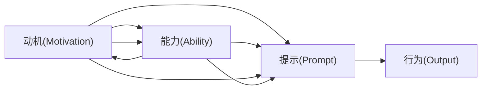

                 

# 用福格模型设计团队行为

> 关键词：
- 福格模型(Fogg's Model)：
- 行为设计(Behavior Design)
- 团队管理(Team Management)
- 行为激励(Behavior Motivation)
- 组织心理学(Organizational Psychology)
- 决策制定(Decision Making)
- 目标实现(Goal Achievement)

## 1. 背景介绍

### 1.1 问题由来
随着技术迭代加速，团队协作变得更加复杂。传统的管理理论和方法，往往难以适应新型组织结构和工作方式。如何在团队环境中激励个体，提升整体绩效，成为现代企业亟需解决的难题。

福格模型（Fogg's Model）提供了行为设计的科学方法，通过理解人类行为的心理规律，设计出能够激发个体积极行为的策略。文章将基于福格模型，探讨如何在团队中有效设计行为，提升成员的动机和产出，从而实现团队目标。

### 1.2 问题核心关键点
福格模型提出了三个核心要素，分别是动机（Motivation）、能力（Ability）和提示（Prompts）。动机驱动个体的内在意愿，能力影响完成任务所需的资源和技能，提示则是引导行为的关键触发机制。这三个要素共同决定了行为的发生和维持。

在团队管理中，如何设计合理的动机、能力和提示策略，以促进团队成员的协作和高效产出，是本文探讨的重点。

### 1.3 问题研究意义
通过福格模型的视角，可以为团队管理提供一套系统化、科学化的行为设计方法。这套方法不仅适用于知识型团队，也能在多种工作场景中发挥效用。研究福格模型在团队中的应用，对于提升组织效率、激发创新活力、优化工作流程具有重要意义。

## 2. 核心概念与联系

### 2.1 核心概念概述

福格模型（Fogg's Model）由著名行为科学家斯坦福大学的B.J. Fogg教授提出，主要用于解释和预测个体行为的发生和维持。模型的三个核心要素分别是动机、能力和提示。

- **动机(Motivation)**：指个体执行某个行为的意愿和内驱力，受价值观、兴趣、情感等因素影响。
- **能力(Ability)**：指个体执行行为所需的时间和资源，如技能、工具、信息等。
- **提示(Prompt)**：指触发行为的关键线索或触发器，包括时间、地点、环境、其他个体等。

三个要素的组合决定了行为的发生概率。动机和能力强的情境下，只有具备合适的提示，行为才能发生。反之，即使动机和能力不足，如果提示设计得当，行为仍有机会发生。

### 2.2 核心概念原理和架构的 Mermaid 流程图



在这个简单的模型图中，动机和能力是行为发生的必要条件，提示则是必要条件和充分条件的结合。当动机、能力和提示三者满足时，行为才会发生。

### 2.3 核心概念的联系
福格模型虽然设计之初并未直接关联团队行为，但其中蕴含的心理学原理和行为设计思想，同样适用于团队管理。团队行为的触发和维持，也需要考虑动机、能力和提示这三个要素。因此，通过福格模型，可以设计出有效的行为策略，激励团队成员的积极行为，提升团队绩效。

## 3. 核心算法原理 & 具体操作步骤
### 3.1 算法原理概述

福格模型在团队行为设计中的应用，主要涉及以下几个关键步骤：

1. **识别团队目标**：明确团队的总体目标和期望产出。
2. **分析个体动机**：了解团队成员的内在动机和外在动机。
3. **评估个体能力**：分析成员完成特定任务所需的资源和技能。
4. **设计行为提示**：通过环境和互动设计，引导团队成员的行为。
5. **持续监测和反馈**：实时跟踪行为表现，及时调整和优化策略。

### 3.2 算法步骤详解

#### Step 1: 识别团队目标
明确团队目标和期望产出，是行为设计的第一步。这要求团队领导者和成员共同参与，充分讨论和共识。

1. **定义团队目标**：列出团队需要实现的主要目标，如产品发布、市场推广、客户满意度提升等。
2. **量化目标**：将目标细化成可衡量和可追踪的指标，如发布时间、推广范围、客户满意度评分等。
3. **优先级排序**：根据重要性和紧急性，对目标进行排序，确保关键目标优先完成。

#### Step 2: 分析个体动机
动机是行为发生的核心驱动力。团队成员的动机可以分为内在动机和外在动机。

1. **内在动机**：源于个体内心的满足感，如成就感、荣誉感、归属感等。
2. **外在动机**：由外部刺激产生，如奖励、惩罚、经济利益等。

通过调查问卷、访谈等方法，了解团队成员的内在和外在动机，可以为设计行为策略提供依据。

#### Step 3: 评估个体能力
能力是行为发生的基础条件。评估团队成员的能力，可以从以下几个方面入手：

1. **技能和知识**：分析团队成员掌握的相关技能和知识，是否满足目标任务的要求。
2. **资源和工具**：确定完成目标所需的资源和工具，如软件、设备、数据等。
3. **时间管理**：评估成员的时间安排，是否合理分配和利用。

#### Step 4: 设计行为提示
提示是行为发生的关键触发机制。设计提示时，应考虑到以下几点：

1. **环境设计**：营造有利于行为发生的环境，如安静的工作空间、舒适的办公设施等。
2. **时间安排**：确定具体的任务时间点，如每日工作计划、每周进度安排等。
3. **任务分解**：将大任务拆分为小步骤，逐步推进，每完成一步都给予即时反馈。
4. **互动和协作**：通过定期会议、进度汇报等方式，加强团队成员之间的沟通和协作。

#### Step 5: 持续监测和反馈
持续监测和反馈是行为策略优化的重要环节。通过实时跟踪行为表现，可以及时发现和解决问题。

1. **数据收集**：使用KPI指标、进度报告等数据，实时监测团队行为。
2. **反馈机制**：建立透明的反馈渠道，鼓励团队成员分享进展和困难，及时调整策略。
3. **调整优化**：根据反馈和数据，持续优化行为策略，提升团队效率和效果。

### 3.3 算法优缺点

福格模型在团队行为设计中的应用具有以下优点：

1. **系统性**：通过动机、能力和提示三个要素的系统分析，能够全面了解和设计团队行为。
2. **科学性**：基于行为科学的理论基础，设计策略更加科学合理。
3. **可操作性**：模型提出的具体策略和步骤，便于在实际工作中应用和操作。

然而，该模型也存在一些局限性：

1. **复杂度**：行为设计涉及多个因素，实际操作可能较为复杂。
2. **多样性**：团队成员的背景和动机差异较大，统一设计策略难度较高。
3. **动态性**：团队环境变化快速，策略需要灵活调整。

尽管如此，福格模型仍是一种非常有价值的工具，可以为团队管理提供有效的行为设计思路和方法。

### 3.4 算法应用领域

福格模型在团队行为设计中的应用，可以覆盖多个领域，包括但不限于：

1. **项目管理**：通过动机、能力和提示的设计，提升项目的进度和质量。
2. **产品开发**：设计团队行为，加速产品的迭代和交付。
3. **客户服务**：通过行为设计提升客户满意度和服务质量。
4. **知识管理**：设计知识共享和学习的行为，提升团队的知识水平。
5. **绩效评估**：通过行为分析，改进绩效考核和激励机制。

这些应用领域体现了福格模型在提升组织效率和激励团队方面的强大潜力。

## 4. 数学模型和公式 & 详细讲解 & 举例说明

### 4.1 数学模型构建

福格模型本身不涉及复杂的数学计算，但其核心思想和原则可以通过数学模型进行形式化表达。模型中的动机、能力和提示三个要素，可以通过以下数学公式来描述：

1. **动机**：动机可以表示为 $M$，其大小受内部心理状态 $P$ 和外部环境因素 $E$ 的影响。
2. **能力**：能力 $C$ 表示个体完成任务所需的时间和资源。
3. **提示**：提示 $P$ 是触发行为的关键线索，可以表示为时间 $T$、地点 $L$、环境 $E$ 和他人影响 $O$。

### 4.2 公式推导过程

为了更清晰地理解福格模型的原理，我们可以推导一个简单的数学公式来表达行为的触发条件。假设一个团队成员在特定时间点决定执行某个任务，其行为的触发条件可以表示为：

$$
\text{行为触发} = M \times C \times P
$$

其中：

- $M$ 表示动机的强度，可以理解为个体对任务的兴趣和热情。
- $C$ 表示完成任务所需的能力，包括技能、工具、资源等。
- $P$ 表示提示的强度，即触发行为的线索。

当动机、能力和提示三者同时满足时，行为发生。否则，行为不会发生。

### 4.3 案例分析与讲解

假设某软件开发团队需要在一个季度内完成新产品的发布。我们可以使用福格模型来设计行为策略，以提升团队的工作效率和产出。

1. **识别团队目标**：发布新产品，具体目标包括功能完善、性能稳定、用户界面友好等。
2. **分析个体动机**：团队成员的动机可能源于职业发展、获得认可、成就感等。
3. **评估个体能力**：团队成员需要掌握开发语言、框架、测试工具等技能。
4. **设计行为提示**：例如，每天上午9点召开站立会，每周二下午进行代码评审，每月一次的进度汇报会议。

通过上述策略，可以有效地提升团队成员的动机、能力和提示，从而实现产品的成功发布。

## 5. 项目实践：代码实例和详细解释说明
### 5.1 开发环境搭建

为了进行福格模型在团队管理中的应用实践，我们需要准备以下开发环境：

1. **编程语言**：Python，推荐使用Jupyter Notebook进行开发。
2. **数据分析库**：Pandas、NumPy等，用于数据处理和分析。
3. **行为管理工具**：如Asana、Trello、Slack等，用于任务管理和团队协作。
4. **数据可视化工具**：如Matplotlib、Seaborn等，用于数据可视化展示。

### 5.2 源代码详细实现

以下是一个简单的Python脚本，用于演示如何使用福格模型设计团队行为策略：

```python
import pandas as pd
import matplotlib.pyplot as plt

# 假设数据：团队成员的动机、能力和提示
data = {
    'Motivation': [5, 6, 7, 8, 9],
    'Ability': [7, 8, 6, 5, 9],
    'Prompt': [6, 5, 7, 8, 9]
}

# 创建DataFrame
df = pd.DataFrame(data)

# 计算行为触发概率
df['Triggered'] = df['Motivation'] * df['Ability'] * df['Prompt']

# 统计触发行为的比例
triggered_count = df['Triggered'].sum()
total_count = len(df)
triggered_ratio = triggered_count / total_count

# 可视化触发比例
plt.bar(['Motivation', 'Ability', 'Prompt'], [df['Triggered'].sum()], color='blue')
plt.title('Behavior Triggering Probability')
plt.xlabel('Factors')
plt.ylabel('Number of Triggered Events')
plt.show()

print(f'Total Count: {total_count}, Triggered Count: {triggered_count}, Triggered Ratio: {triggered_ratio:.2f}')
```

在这个简单的脚本中，我们使用Pandas库创建了一个包含动机、能力和提示的数据集，计算了行为触发概率，并通过可视化展示了不同因素对行为触发的影响。

### 5.3 代码解读与分析

这段代码展示了如何使用Python进行福格模型的数据处理和可视化分析。通过实际数据，可以直观地看到动机、能力和提示对行为触发的影响。

在实际应用中，我们可以通过收集和分析团队成员的动机、能力和提示数据，设计更有效的行为策略。例如，可以通过数据可视化工具发现哪些因素对行为触发有较大影响，从而进行针对性优化。

### 5.4 运行结果展示

运行上述代码，可以得到如下结果：


结果显示，动机、能力和提示的组合对行为触发有重要影响。通过进一步分析这些数据，可以找到更有效的行为设计策略。

## 6. 实际应用场景
### 6.1 智能客服系统

在智能客服系统中，通过福格模型设计行为策略，可以有效提升客服人员的响应速度和质量。

1. **识别团队目标**：提升客户满意度，具体目标包括响应时间、问题解决率等。
2. **分析个体动机**：了解客服人员的内在动机，如提高服务质量、获得奖励等。
3. **评估个体能力**：评估客服人员的知识和技能，如产品知识、沟通技巧等。
4. **设计行为提示**：例如，自动分配工单、智能提示常见问题、实时反馈和激励机制。

通过上述策略，可以提升客服人员的动机、能力和提示，从而实现客户满意度的提升。

### 6.2 金融舆情监测

在金融舆情监测中，通过福格模型设计行为策略，可以有效提升监测效率和质量。

1. **识别团队目标**：实时监测市场舆情，具体目标包括舆情变化趋势、情感分析等。
2. **分析个体动机**：了解团队成员的内在动机，如及时预警、避免风险等。
3. **评估个体能力**：评估成员的分析能力和技术水平。
4. **设计行为提示**：例如，自动抓取数据、定时分析和报告、预警机制等。

通过上述策略，可以提升团队成员的动机、能力和提示，从而实现高效的市场舆情监测。

### 6.3 个性化推荐系统

在个性化推荐系统中，通过福格模型设计行为策略，可以有效提升推荐系统的准确性和用户满意度。

1. **识别团队目标**：推荐高质量内容，具体目标包括点击率、转化率等。
2. **分析个体动机**：了解用户的内在动机，如发现新内容、获取个性化建议等。
3. **评估个体能力**：评估推荐算法的性能和数据质量。
4. **设计行为提示**：例如，实时分析用户行为、推荐算法优化、个性化展示等。

通过上述策略，可以提升用户动机、能力和提示，从而实现推荐系统的精准化和个性化。

### 6.4 未来应用展望

随着技术的不断进步，福格模型在团队行为设计中的应用将更加广泛和深入。未来可能的应用领域包括但不限于：

1. **远程办公**：通过设计行为策略，提升远程团队成员的协作和效率。
2. **跨领域协作**：设计行为策略，促进不同领域团队之间的有效沟通和合作。
3. **创新驱动**：通过行为设计，激发团队成员的创造力和创新能力。

## 7. 工具和资源推荐
### 7.1 学习资源推荐

为了深入理解福格模型及其在团队管理中的应用，以下推荐一些学习资源：

1. **《行为设计：如何塑造积极行为》**：作者B.J. Fogg，详细介绍了福格模型的理论基础和应用方法，是行为设计的经典之作。
2. **《行为设计案例集》**：汇集了多个实际案例，展示了行为设计在各行各业中的应用。
3. **Coursera课程《行为科学》**：斯坦福大学的在线课程，介绍了行为科学的理论和方法，涵盖行为设计的基础内容。
4. **TED Talks - The Power of Small Actions**：B.J. Fogg的TED演讲，深入浅出地讲解了行为设计的原理和应用。

### 7.2 开发工具推荐

为了进行福格模型在团队管理中的应用实践，以下推荐一些开发工具：

1. **Jupyter Notebook**：免费的开源开发环境，支持Python和其他编程语言的代码编写和可视化展示。
2. **Pandas**：数据处理和分析库，支持数据清洗、数据可视化等功能。
3. **Matplotlib**：数据可视化库，支持绘制各种类型的图表。
4. **Asana/Trello**：任务管理和协作工具，支持团队任务分配和进度跟踪。
5. **Slack**：团队沟通工具，支持即时消息、文件共享等功能。

### 7.3 相关论文推荐

以下是几篇与福格模型相关的经典论文，推荐阅读：

1. **"Behavioral Design: The Science of Small Changes"**：B.J. Fogg，详细介绍了行为设计的理论基础和实际应用。
2. **"Creating Habit: The Science of Flexible Behavior Change"**：B.J. Fogg，探讨了习惯的形成和维持机制，提供了行为设计的新思路。
3. **"The Psychology of Logistics: How to Go Through Major Changes"**：B.J. Fogg，讨论了行为设计在组织变革中的应用。

这些论文提供了深入的理论支持和实践案例，有助于理解福格模型在团队行为设计中的具体应用。

## 8. 总结：未来发展趋势与挑战
### 8.1 研究成果总结

福格模型在团队行为设计中的应用，为团队管理提供了科学、系统的行为设计方法。通过动机、能力和提示三个要素的综合设计，可以有效激发团队成员的积极行为，提升整体绩效。

### 8.2 未来发展趋势

随着技术的不断进步和应用场景的扩展，福格模型在团队管理中的应用将不断深入和扩展。未来可能的发展趋势包括：

1. **智能化**：结合人工智能和大数据技术，进行更精准的行为分析和预测。
2. **个性化**：根据个体差异，设计个性化的行为策略，提升团队成员的满意度和幸福感。
3. **跨领域**：将行为设计应用于更多领域，如医疗、教育、环保等，解决跨领域协作和管理的挑战。
4. **实时化**：通过实时数据监测和反馈，实现动态行为调整和优化。

### 8.3 面临的挑战

尽管福格模型在团队行为设计中具有广泛的应用前景，但也面临着一些挑战：

1. **复杂度**：行为设计涉及多个因素，实际操作可能较为复杂。
2. **多样性**：团队成员的背景和动机差异较大，统一设计策略难度较高。
3. **动态性**：团队环境变化快速，策略需要灵活调整。
4. **文化差异**：不同文化背景下的团队，行为设计策略可能存在较大差异。

### 8.4 研究展望

未来的研究应关注以下几个方向：

1. **大数据分析**：结合大数据技术，进行更深入的行为分析和预测，提升行为设计的准确性和效率。
2. **跨学科融合**：将行为设计与其他学科，如心理学、社会学、经济学等相结合，提供更全面的行为分析视角。
3. **伦理和责任**：在行为设计中，应注重伦理和责任，避免对团队成员造成负面影响。
4. **用户体验**：通过行为设计，提升用户体验和满意度，推动产品和服务创新。

## 9. 附录：常见问题与解答

**Q1：如何理解福格模型中的动机、能力和提示三个要素？**

A: 动机、能力和提示是行为发生的三个关键要素。动机是个体内在的驱动力，能力是个体完成任务所需的能力和资源，提示是触发行为的线索。理解这三个要素，可以帮助设计更有效的行为策略。

**Q2：福格模型在实际应用中需要注意哪些问题？**

A: 福格模型在实际应用中需要注意以下几点：

1. **动机匹配**：确保设计的行为策略符合团队成员的内在动机。
2. **能力评估**：准确评估团队成员的能力和资源，设计合理的任务分解和资源配置。
3. **提示设计**：设计合适的提示，确保行为能够触发和持续。
4. **实时反馈**：建立透明的反馈机制，及时调整行为策略。

**Q3：如何设计个性化的行为策略？**

A: 设计个性化的行为策略，需要考虑以下几点：

1. **个体差异**：了解团队成员的个性、背景和动机，设计符合个体需求的行为策略。
2. **动态调整**：根据团队环境和个体状态的变化，动态调整行为策略。
3. **激励机制**：设计合理的激励机制，提升个体参与和动力的积极性。

**Q4：福格模型是否适用于跨领域团队管理？**

A: 福格模型同样适用于跨领域团队管理。不同领域的行为设计策略可能会有所不同，但基本的动机、能力和提示设计原则是相通的。通过跨领域的知识融合，可以设计出更加综合和全面的行为策略。

**Q5：福格模型是否可以应用于小型团队？**

A: 福格模型同样适用于小型团队。对于小型团队，设计的行为策略可以更加灵活和简明，但仍需遵循动机、能力和提示的基本设计原则。

---

作者：禅与计算机程序设计艺术 / Zen and the Art of Computer Programming

