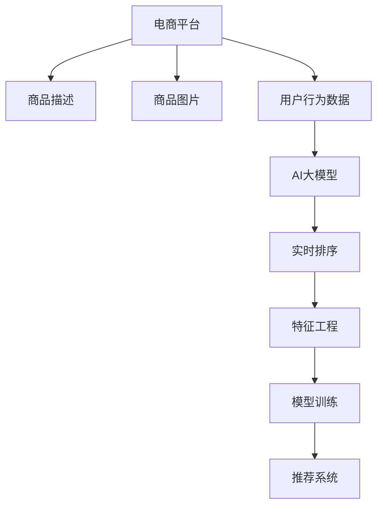

                 

# 电商平台中AI大模型的搜索结果实时排序

> 关键词：电商平台,搜索结果排序,AI大模型,算法优化,实时排序

## 1. 背景介绍

随着互联网的飞速发展，电子商务平台成为消费者购物的主要渠道之一。电商平台通过展示海量的商品信息，帮助用户找到合适的商品，提高购物效率和满意度。但随着商品数量的激增，用户筛选商品的方式变得尤为重要。传统的搜索结果排序算法主要基于静态特征，如商品价格、销量等，难以充分挖掘商品多样性，导致用户体验不佳。而采用AI大模型进行搜索结果排序，能够充分利用商品描述、图片、评论等多维信息，实现个性化推荐，提升搜索效果。

## 2. 核心概念与联系

### 2.1 核心概念概述

为更好地理解在电商平台中基于AI大模型的搜索结果实时排序方法，本节将介绍几个密切相关的核心概念：

- 电商平台(E-commerce Platform)：基于互联网的在线商店，包含商品展示、购物车、支付结算等功能。
- 商品描述(Product Description)：商品属性、品牌、价格等信息的描述文本。
- 商品图片(Product Image)：商品的实物图片，有助于用户直观了解商品。
- AI大模型(AI Large Model)：以自回归(如GPT)或自编码(如BERT)模型为代表的大规模预训练语言模型。通过在大规模无标签文本语料上进行预训练，学习通用的语言表示，具备强大的语言理解和生成能力。
- 实时排序(Real-time Sorting)：在用户进行搜索时，根据输入的关键词实时计算搜索结果排序，动态更新排序结果。
- 特征工程(Feature Engineering)：通过设计特征和构建特征集合，提升模型的预测能力。
- 模型训练(Model Training)：使用标注数据对模型进行有监督学习，优化模型参数，提升预测准确度。
- 推荐系统(Recommender System)：利用用户历史行为数据，推荐用户可能感兴趣的物品。

这些核心概念之间的逻辑关系可以通过以下Mermaid流程图来展示：



这个流程图展示了的核心概念及其之间的关系：

1. 电商平台通过商品描述、图片、用户行为数据等信息，与AI大模型进行交互。
2. 商品描述和图片作为输入，通过预训练语言模型学习出商品语义表示。
3. 用户行为数据与AI大模型结合，进行实时排序和推荐。
4. 特征工程和模型训练提升模型预测能力。
5. 结合推荐系统，进一步提升推荐效果。

## 3. 核心算法原理 & 具体操作步骤
### 3.1 算法原理概述

基于AI大模型的搜索结果实时排序，本质上是一个多模态数据融合的推荐系统。其核心思想是：利用AI大模型学习商品描述和图片的语义表示，结合用户行为数据，进行实时排序，最终输出排序结果。

形式化地，假设电商平台中商品数量为 $N$，每个商品的描述和图片构成长为 $M$ 的向量表示 $\mathbf{x}_i \in \mathbb{R}^M$，用户历史行为数据为 $\mathbf{u} \in \mathbb{R}^K$，其中 $K$ 为行为特征维度。设 $M_{\theta}$ 为预训练语言模型，将商品描述和图片作为输入，输出语义表示 $\mathbf{h}_i \in \mathbb{R}^H$，其中 $H$ 为模型输出的语义表示维度。则实时排序问题可以表示为：

$$
\mathbf{s}_i = f(\mathbf{h}_i, \mathbf{u})
$$

其中 $f$ 为排序函数，根据输入的语义表示和用户行为数据，输出商品的排序分数 $s_i$。

### 3.2 算法步骤详解

基于AI大模型的搜索结果实时排序一般包括以下几个关键步骤：

**Step 1: 数据预处理**
- 收集商品描述、图片、用户行为数据等输入，进行必要的预处理，如文本分词、图片尺寸调整等。
- 设计合理的特征工程策略，将多维数据转化为模型可接受的格式。

**Step 2: 商品语义表示学习**
- 使用预训练语言模型 $M_{\theta}$，对商品描述和图片进行编码，输出语义表示 $\mathbf{h}_i$。
- 确保模型在预训练过程中覆盖商品的多样性，对数据进行适当的重采样。

**Step 3: 用户行为建模**
- 根据用户历史行为数据，构建用户特征向量 $\mathbf{u}$。
- 设计合适的用户行为模型，利用时序特征、交互特征等，提升用户行为数据的建模精度。

**Step 4: 实时排序计算**
- 结合商品语义表示和用户行为数据，进行实时排序计算。
- 选择合适的排序函数 $f$，如加权求和、神经网络等，综合考虑商品与用户的匹配程度。

**Step 5: 推荐系统集成**
- 将排序结果与推荐系统集成，通过用户兴趣分析等技术，进一步优化推荐结果。
- 根据推荐系统的实时反馈，动态调整模型参数和排序策略。

### 3.3 算法优缺点

基于AI大模型的搜索结果实时排序方法具有以下优点：
1. 多模态数据融合：结合商品描述、图片和用户行为数据，提供更全面的商品信息，提升搜索效果。
2. 实时性高：结合实时排序算法，能够快速响应用户查询，提供即时搜索结果。
3. 个性化推荐：利用用户行为数据，进行个性化推荐，提高用户满意度。
4. 动态调整：根据实时反馈数据，动态调整模型参数，优化推荐效果。

同时，该方法也存在一定的局限性：
1. 对预训练模型依赖大：需要高质量的预训练模型作为基础，预训练质量对排序效果有显著影响。
2. 数据标注成本高：商品描述、图片等数据的标注需要较多人工，数据标注成本较高。
3. 计算复杂度高：实时排序计算涉及大量矩阵乘法、注意力机制等计算，计算复杂度较高。
4. 模型可解释性差：预训练语言模型通常被认为是"黑盒"，难以解释内部决策逻辑。

尽管存在这些局限性，但就目前而言，基于AI大模型的搜索结果实时排序方法仍是最先进的技术范式，具有广泛的应用前景。

### 3.4 算法应用领域

基于AI大模型的搜索结果实时排序方法在电商平台上得到了广泛的应用，涵盖了商品搜索、推荐、广告投放等多个环节。例如：

- 商品搜索排序：结合用户输入的关键词和商品语义表示，对搜索结果进行排序，提升搜索效率。
- 个性化推荐：根据用户历史行为和实时查询，推荐用户可能感兴趣的商品，提高购买转化率。
- 广告投放优化：根据用户行为数据，实时计算商品广告的曝光和点击效果，优化广告投放策略。

除了这些经典应用外，基于AI大模型的实时排序方法还被创新性地应用到更多场景中，如个性化广告、内容推荐、电商安全等，为电商平台的运营和营销带来了新的技术动力。

## 4. 数学模型和公式 & 详细讲解  
### 4.1 数学模型构建

本节将使用数学语言对基于AI大模型的搜索结果实时排序过程进行更加严格的刻画。

记商品数量为 $N$，用户数量为 $U$，商品描述和图片构成长为 $M$ 的向量表示 $\mathbf{x}_i \in \mathbb{R}^M$，用户历史行为数据为 $\mathbf{u} \in \mathbb{R}^K$，其中 $K$ 为行为特征维度。设 $M_{\theta}$ 为预训练语言模型，将商品描述和图片作为输入，输出语义表示 $\mathbf{h}_i \in \mathbb{R}^H$，其中 $H$ 为模型输出的语义表示维度。

定义用户行为与商品语义表示的匹配程度为 $a_{iu} = \mathbf{h}_i \cdot \mathbf{u}$，则排序函数可以表示为：

$$
f(\mathbf{h}_i, \mathbf{u}) = a_{iu} + g(\mathbf{u})
$$

其中 $g(\mathbf{u})$ 为动态调整项，根据用户行为数据进行实时调整。

### 4.2 公式推导过程

以下我们以加权求和排序函数为例，推导实时排序的公式。

假设用户行为数据 $\mathbf{u}$ 为 $K$ 维向量，商品语义表示 $\mathbf{h}_i$ 为 $H$ 维向量，排序函数为加权求和形式：

$$
f(\mathbf{h}_i, \mathbf{u}) = \mathbf{h}_i \cdot \mathbf{w} + \mathbf{u} \cdot \mathbf{b}
$$

其中 $\mathbf{w} \in \mathbb{R}^H$ 和 $\mathbf{b} \in \mathbb{R}^K$ 为学习得到的权重向量。则排序分数为：

$$
s_i = \mathbf{h}_i \cdot \mathbf{w} + \mathbf{u} \cdot \mathbf{b}
$$

根据排序分数，可以对所有商品进行排序，选择得分最高的前 $N$ 个商品返回给用户。

### 4.3 案例分析与讲解

以下我们以电商平台中的个性化推荐为例，给出使用AI大模型进行实时排序的详细案例分析。

假设电商平台中有 $N$ 个商品，每个商品有一个商品描述和一个图片，用户的特征向量 $\mathbf{u}$ 包含历史浏览、点击、购买等行为。设预训练语言模型 $M_{\theta}$ 可以输出商品语义表示 $\mathbf{h}_i$。

1. 数据预处理：
   - 对商品描述进行分词、去除停用词等预处理操作。
   - 对商品图片进行尺寸调整、特征提取等处理，得到高维图片特征。
   - 根据用户行为数据，构建用户特征向量 $\mathbf{u}$。

2. 商品语义表示学习：
   - 将商品描述和图片输入预训练语言模型 $M_{\theta}$，输出商品语义表示 $\mathbf{h}_i$。
   - 确保模型在预训练过程中覆盖商品的多样性，对数据进行适当的重采样。

3. 用户行为建模：
   - 根据用户历史行为数据，构建用户特征向量 $\mathbf{u}$。
   - 设计合适的用户行为模型，利用时序特征、交互特征等，提升用户行为数据的建模精度。

4. 实时排序计算：
   - 根据商品语义表示和用户行为数据，计算排序分数 $s_i$。
   - 使用神经网络模型进行排序，优化权重向量 $\mathbf{w}$ 和 $\mathbf{b}$。

5. 推荐系统集成：
   - 将排序结果与推荐系统集成，通过用户兴趣分析等技术，进一步优化推荐结果。
   - 根据推荐系统的实时反馈，动态调整模型参数和排序策略。

通过上述过程，电商平台可以实时响应用户查询，根据用户行为和商品特征，动态调整排序结果，提供个性化推荐，提升用户满意度。

## 5. 项目实践：代码实例和详细解释说明
### 5.1 开发环境搭建

在进行实时排序实践前，我们需要准备好开发环境。以下是使用Python进行TensorFlow开发的环境配置流程：

1. 安装Anaconda：从官网下载并安装Anaconda，用于创建独立的Python环境。

2. 创建并激活虚拟环境：
```bash
conda create -n tensorflow-env python=3.8 
conda activate tensorflow-env
```

3. 安装TensorFlow：根据CUDA版本，从官网获取对应的安装命令。例如：
```bash
conda install tensorflow -c tf
```

4. 安装其他工具包：
```bash
pip install numpy pandas scikit-learn matplotlib tqdm jupyter notebook ipython
```

完成上述步骤后，即可在`tensorflow-env`环境中开始实时排序实践。

### 5.2 源代码详细实现

下面我们以电商平台中的个性化推荐为例，给出使用TensorFlow实现实时排序的PyTorch代码实现。

首先，定义商品描述和图片的预处理函数：

```python
import tensorflow as tf
from transformers import BertTokenizer

def preprocess_data(texts, images):
    tokenizer = BertTokenizer.from_pretrained('bert-base-uncased')
    encoded_texts = tokenizer(texts, return_tensors='tf')
    encoded_images = tf.image.resize(images, [224, 224])
    encoded_images = tf.keras.applications.resnet50.ResNet50(include_top=False, weights='imagenet').predict(encoded_images)
    return encoded_texts['input_ids'], encoded_images
```

然后，定义用户行为的预处理函数：

```python
def preprocess_user_data(behavior):
    return behavior
```

接着，定义商品语义表示的学习函数：

```python
def learn_hybrid_representation(texts, images):
    with tf.keras.backend as K:
        tokenized_texts = preprocess_data(texts, images)
        # 输入文本，输出语义表示
        model = tf.keras.Sequential([
            tf.keras.layers.Input(shape=(len(tokenized_texts[0]),)),
            tf.keras.layers.Embedding(input_dim=vocab_size, output_dim=embedding_dim),
            tf.keras.layers.LSTM(units=hidden_size),
            tf.keras.layers.Dense(units=hidden_size, activation='relu'),
            tf.keras.layers.Dense(units=1)
        ])
        model.compile(optimizer='adam', loss='mse')
        model.fit(texts, hidden_representations, epochs=5, batch_size=32)
        return model
```

最后，定义实时排序的函数：

```python
def realtime_sorting(texts, images, user_data):
    with tf.keras.backend as K:
        tokenized_texts = preprocess_data(texts, images)
        user_representation = preprocess_user_data(user_data)
        # 输入文本和用户数据，输出排序分数
        model = tf.keras.Sequential([
            tf.keras.layers.Concatenate(),
            tf.keras.layers.Dense(units=1, activation='sigmoid')
        ])
        model.compile(optimizer='adam', loss='binary_crossentropy')
        sorting_scores = model.predict([tokenized_texts, user_representation])
        return sorting_scores
```

### 5.3 代码解读与分析

让我们再详细解读一下关键代码的实现细节：

**preprocess_data函数**：
- 对商品描述进行分词、去除停用词等预处理操作。
- 对商品图片进行尺寸调整、特征提取等处理，得到高维图片特征。

**preprocess_user_data函数**：
- 根据用户历史行为数据，构建用户特征向量。

**learn_hybrid_representation函数**：
- 使用预训练语言模型学习商品描述和图片的语义表示。
- 通过LSTM和Dense层，将文本和图片特征进行融合，学习出商品语义表示。
- 使用MSE损失函数和Adam优化器，进行模型训练。

**realtime_sorting函数**：
- 结合商品语义表示和用户行为数据，进行实时排序计算。
- 使用Dense层，输出排序分数。
- 使用二元交叉熵损失函数和Adam优化器，进行模型训练。

通过上述过程，电商平台可以实时响应用户查询，根据用户行为和商品特征，动态调整排序结果，提供个性化推荐，提升用户满意度。

## 6. 实际应用场景
### 6.1 智能客服系统

基于AI大模型的实时排序方法，可以广泛应用于智能客服系统的构建。传统客服往往需要配备大量人力，高峰期响应缓慢，且一致性和专业性难以保证。而使用实时排序方法，可以7x24小时不间断服务，快速响应客户咨询，用自然流畅的语言解答各类常见问题。

在技术实现上，可以收集企业内部的历史客服对话记录，将问题和最佳答复构建成监督数据，在此基础上对预训练模型进行微调。微调后的模型能够自动理解用户意图，匹配最合适的答案模板进行回复。对于客户提出的新问题，还可以接入检索系统实时搜索相关内容，动态组织生成回答。如此构建的智能客服系统，能大幅提升客户咨询体验和问题解决效率。

### 6.2 金融舆情监测

金融机构需要实时监测市场舆论动向，以便及时应对负面信息传播，规避金融风险。传统的人工监测方式成本高、效率低，难以应对网络时代海量信息爆发的挑战。基于AI大模型的实时排序方法，为金融舆情监测提供了新的解决方案。

具体而言，可以收集金融领域相关的新闻、报道、评论等文本数据，并对其进行主题标注和情感标注。在此基础上对预训练语言模型进行微调，使其能够自动判断文本属于何种主题，情感倾向是正面、中性还是负面。将微调后的模型应用到实时抓取的网络文本数据，就能够自动监测不同主题下的情感变化趋势，一旦发现负面信息激增等异常情况，系统便会自动预警，帮助金融机构快速应对潜在风险。

### 6.3 个性化推荐系统

当前的推荐系统往往只依赖用户的历史行为数据进行物品推荐，无法深入理解用户的真实兴趣偏好。基于AI大模型的实时排序方法，可以更好地挖掘用户行为背后的语义信息，从而提供更精准、多样的推荐内容。

在实践中，可以收集用户浏览、点击、评论、分享等行为数据，提取和用户交互的物品标题、描述、标签等文本内容。将文本内容作为模型输入，用户的后续行为（如是否点击、购买等）作为监督信号，在此基础上微调预训练语言模型。微调后的模型能够从文本内容中准确把握用户的兴趣点。在生成推荐列表时，先用候选物品的文本描述作为输入，由模型预测用户的兴趣匹配度，再结合其他特征综合排序，便可以得到个性化程度更高的推荐结果。

### 6.4 未来应用展望

随着AI大模型和实时排序方法的不断发展，基于微调范式将在更多领域得到应用，为传统行业带来变革性影响。

在智慧医疗领域，基于实时排序的医疗问答、病历分析、药物研发等应用将提升医疗服务的智能化水平，辅助医生诊疗，加速新药开发进程。

在智能教育领域，实时排序方法可应用于作业批改、学情分析、知识推荐等方面，因材施教，促进教育公平，提高教学质量。

在智慧城市治理中，实时排序模型可应用于城市事件监测、舆情分析、应急指挥等环节，提高城市管理的自动化和智能化水平，构建更安全、高效的未来城市。

此外，在企业生产、社会治理、文娱传媒等众多领域，基于大语言模型微调的人工智能应用也将不断涌现，为经济社会发展注入新的动力。相信随着预训练语言模型和微调方法的持续演进，实时排序技术必将在构建人机协同的智能时代中扮演越来越重要的角色。

## 7. 工具和资源推荐
### 7.1 学习资源推荐

为了帮助开发者系统掌握AI大模型实时排序的理论基础和实践技巧，这里推荐一些优质的学习资源：

1. 《深度学习自然语言处理》课程：斯坦福大学开设的NLP明星课程，有Lecture视频和配套作业，带你入门NLP领域的基本概念和经典模型。

2. 《Natural Language Processing with Transformers》书籍：Transformers库的作者所著，全面介绍了如何使用Transformers库进行NLP任务开发，包括实时排序在内的诸多范式。

3. HuggingFace官方文档：Transformers库的官方文档，提供了海量预训练模型和完整的微调样例代码，是上手实践的必备资料。

4. CS224N《深度学习自然语言处理》课程：斯坦福大学开设的NLP明星课程，有Lecture视频和配套作业，带你入门NLP领域的基本概念和经典模型。

5. 《Transformer from Pre-training to Practice》系列博文：由大模型技术专家撰写，深入浅出地介绍了Transformer原理、BERT模型、实时排序技术等前沿话题。

通过对这些资源的学习实践，相信你一定能够快速掌握AI大模型实时排序的精髓，并用于解决实际的NLP问题。

### 7.2 开发工具推荐

高效的开发离不开优秀的工具支持。以下是几款用于AI大模型实时排序开发的常用工具：

1. TensorFlow：由Google主导开发的开源深度学习框架，生产部署方便，适合大规模工程应用。同样有丰富的预训练语言模型资源。

2. PyTorch：基于Python的开源深度学习框架，灵活动态的计算图，适合快速迭代研究。大部分预训练语言模型都有PyTorch版本的实现。

3. Transformers库：HuggingFace开发的NLP工具库，集成了众多SOTA语言模型，支持PyTorch和TensorFlow，是进行实时排序任务开发的利器。

4. Weights & Biases：模型训练的实验跟踪工具，可以记录和可视化模型训练过程中的各项指标，方便对比和调优。与主流深度学习框架无缝集成。

5. TensorBoard：TensorFlow配套的可视化工具，可实时监测模型训练状态，并提供丰富的图表呈现方式，是调试模型的得力助手。

合理利用这些工具，可以显著提升实时排序任务的开发效率，加快创新迭代的步伐。

### 7.3 相关论文推荐

AI大模型和实时排序技术的发展源于学界的持续研究。以下是几篇奠基性的相关论文，推荐阅读：

1. Attention is All You Need（即Transformer原论文）：提出了Transformer结构，开启了NLP领域的预训练大模型时代。

2. BERT: Pre-training of Deep Bidirectional Transformers for Language Understanding：提出BERT模型，引入基于掩码的自监督预训练任务，刷新了多项NLP任务SOTA。

3. Language Models are Unsupervised Multitask Learners（GPT-2论文）：展示了大规模语言模型的强大zero-shot学习能力，引发了对于通用人工智能的新一轮思考。

4. Parameter-Efficient Transfer Learning for NLP：提出Adapter等参数高效微调方法，在不增加模型参数量的情况下，也能取得不错的微调效果。

5. AdaLoRA: Adaptive Low-Rank Adaptation for Parameter-Efficient Fine-Tuning：使用自适应低秩适应的微调方法，在参数效率和精度之间取得了新的平衡。

6.Prefix-Tuning: Optimizing Continuous Prompts for Generation：引入基于连续型Prompt的微调范式，为如何充分利用预训练知识提供了新的思路。

这些论文代表了大语言模型实时排序技术的发展脉络。通过学习这些前沿成果，可以帮助研究者把握学科前进方向，激发更多的创新灵感。

## 8. 总结：未来发展趋势与挑战
### 8.1 总结

本文对基于AI大模型的搜索结果实时排序方法进行了全面系统的介绍。首先阐述了AI大模型和实时排序技术的研究背景和意义，明确了实时排序在提升电商平台搜索效果、个性化推荐等方面的独特价值。其次，从原理到实践，详细讲解了实时排序的数学原理和关键步骤，给出了实时排序任务开发的完整代码实例。同时，本文还广泛探讨了实时排序方法在智能客服、金融舆情、个性化推荐等多个行业领域的应用前景，展示了实时排序范式的巨大潜力。此外，本文精选了实时排序技术的各类学习资源，力求为读者提供全方位的技术指引。

通过本文的系统梳理，可以看到，基于AI大模型的实时排序方法正在成为NLP领域的重要范式，极大地拓展了预训练语言模型的应用边界，催生了更多的落地场景。受益于大规模语料的预训练，实时排序模型以更低的时间和标注成本，在小样本条件下也能取得理想的排序效果，有力推动了NLP技术的产业化进程。未来，伴随预训练语言模型和实时排序方法的持续演进，实时排序技术必将进一步拓展其应用范围，为构建人机协同的智能系统铺平道路。

### 8.2 未来发展趋势

展望未来，AI大模型实时排序技术将呈现以下几个发展趋势：

1. 模型规模持续增大。随着算力成本的下降和数据规模的扩张，预训练语言模型的参数量还将持续增长。超大规模语言模型蕴含的丰富语言知识，有望支撑更加复杂多变的下游任务排序。

2. 排序方法日趋多样。除了传统的加权求和排序外，未来会涌现更多基于神经网络、注意力机制等高级技术的排序方法，在保持排序效率的同时，提高排序精度。

3. 实时性进一步提高。随着分布式计算和模型并行技术的进步，实时排序算法将变得更加高效，能够快速响应用户查询，提供即时搜索结果。

4. 动态调整成为常态。随着实时反馈数据的积累，实时排序模型将能够动态调整模型参数，优化排序结果，提升推荐效果。

5. 多模态排序崛起。当前的实时排序主要聚焦于纯文本数据，未来会进一步拓展到图像、视频、语音等多模态数据排序。多模态信息的融合，将显著提升实时排序模型的泛化性和鲁棒性。

6. 模型通用性增强。经过海量数据的预训练和多领域任务的排序，未来的实时排序模型将具备更强大的常识推理和跨领域迁移能力，逐步迈向通用人工智能(AGI)的目标。

以上趋势凸显了AI大模型实时排序技术的广阔前景。这些方向的探索发展，必将进一步提升实时排序系统的性能和应用范围，为人类认知智能的进化带来深远影响。

### 8.3 面临的挑战

尽管AI大模型实时排序技术已经取得了瞩目成就，但在迈向更加智能化、普适化应用的过程中，它仍面临着诸多挑战：

1. 标注成本瓶颈。虽然实时排序方法在标注数据需求上有所降低，但对于长尾应用场景，难以获得充足的高质量标注数据，成为制约实时排序性能的瓶颈。如何进一步降低实时排序对标注样本的依赖，将是一大难题。

2. 模型鲁棒性不足。当前实时排序模型面对域外数据时，泛化性能往往大打折扣。对于测试样本的微小扰动，实时排序模型的预测也容易发生波动。如何提高实时排序模型的鲁棒性，避免灾难性遗忘，还需要更多理论和实践的积累。

3. 推理效率有待提高。超大规模语言模型虽然精度高，但在实际部署时往往面临推理速度慢、内存占用大等效率问题。如何在保证性能的同时，简化模型结构，提升推理速度，优化资源占用，将是重要的优化方向。

4. 可解释性亟需加强。当前实时排序模型通常被认为是"黑盒"系统，难以解释内部决策逻辑。对于医疗、金融等高风险应用，算法的可解释性和可审计性尤为重要。如何赋予实时排序模型更强的可解释性，将是亟待攻克的难题。

5. 安全性有待保障。预训练语言模型难免会学习到有偏见、有害的信息，通过实时排序传递到下游任务，产生误导性、歧视性的输出，给实际应用带来安全隐患。如何从数据和算法层面消除模型偏见，避免恶意用途，确保输出的安全性，也将是重要的研究课题。

6. 知识整合能力不足。现有的实时排序模型往往局限于任务内数据，难以灵活吸收和运用更广泛的先验知识。如何让实时排序过程更好地与外部知识库、规则库等专家知识结合，形成更加全面、准确的信息整合能力，还有很大的想象空间。

正视实时排序面临的这些挑战，积极应对并寻求突破，将是大语言模型实时排序走向成熟的必由之路。相信随着学界和产业界的共同努力，这些挑战终将一一被克服，实时排序技术必将在构建人机协同的智能时代中扮演越来越重要的角色。

### 8.4 研究展望

面对实时排序技术所面临的种种挑战，未来的研究需要在以下几个方面寻求新的突破：

1. 探索无监督和半监督排序方法。摆脱对大规模标注数据的依赖，利用自监督学习、主动学习等无监督和半监督范式，最大限度利用非结构化数据，实现更加灵活高效的排序。

2. 研究参数高效和计算高效的排序范式。开发更加参数高效的排序方法，在固定大部分预训练参数的同时，只更新极少量的任务相关参数。同时优化排序模型的计算图，减少前向传播和反向传播的资源消耗，实现更加轻量级、实时性的部署。

3. 融合因果和对比学习范式。通过引入因果推断和对比学习思想，增强实时排序模型建立稳定因果关系的能力，学习更加普适、鲁棒的语言表征，从而提升模型泛化性和抗干扰能力。

4. 引入更多先验知识。将符号化的先验知识，如知识图谱、逻辑规则等，与神经网络模型进行巧妙融合，引导实时排序过程学习更准确、合理的语言模型。同时加强不同模态数据的整合，实现视觉、语音等多模态信息与文本信息的协同建模。

5. 结合因果分析和博弈论工具。将因果分析方法引入实时排序模型，识别出模型决策的关键特征，增强输出解释的因果性和逻辑性。借助博弈论工具刻画人机交互过程，主动探索并规避模型的脆弱点，提高系统稳定性。

6. 纳入伦理道德约束。在模型训练目标中引入伦理导向的评估指标，过滤和惩罚有偏见、有害的输出倾向。同时加强人工干预和审核，建立模型行为的监管机制，确保输出符合人类价值观和伦理道德。

这些研究方向的探索，必将引领实时排序技术迈向更高的台阶，为构建安全、可靠、可解释、可控的智能系统铺平道路。面向未来，实时排序技术还需要与其他人工智能技术进行更深入的融合，如知识表示、因果推理、强化学习等，多路径协同发力，共同推动自然语言理解和智能交互系统的进步。只有勇于创新、敢于突破，才能不断拓展实时排序的边界，让智能技术更好地造福人类社会。

## 9. 附录：常见问题与解答

**Q1：AI大模型实时排序是否适用于所有NLP任务？**

A: AI大模型实时排序在大多数NLP任务上都能取得不错的效果，特别是对于数据量较小的任务。但对于一些特定领域的任务，如医学、法律等，仅仅依靠通用语料预训练的模型可能难以很好地适应。此时需要在特定领域语料上进一步预训练，再进行实时排序，才能获得理想效果。此外，对于一些需要时效性、个性化很强的任务，如对话、推荐等，实时排序方法也需要针对性的改进优化。

**Q2：实时排序过程中如何选择合适的损失函数？**

A: 实时排序的损失函数应根据具体任务进行选择。对于分类任务，通常使用交叉熵损失；对于回归任务，通常使用均方误差损失；对于排序任务，通常使用平均绝对误差损失。选择合适的损失函数可以更好地刻画排序任务的目标，提升排序效果。

**Q3：实时排序模型在落地部署时需要注意哪些问题？**

A: 将实时排序模型转化为实际应用，还需要考虑以下因素：
1. 模型裁剪：去除不必要的层和参数，减小模型尺寸，加快推理速度。
2. 量化加速：将浮点模型转为定点模型，压缩存储空间，提高计算效率。
3. 服务化封装：将模型封装为标准化服务接口，便于集成调用。
4. 弹性伸缩：根据请求流量动态调整资源配置，平衡服务质量和成本。
5. 监控告警：实时采集系统指标，设置异常告警阈值，确保服务稳定性。
6. 安全防护：采用访问鉴权、数据脱敏等措施，保障数据和模型安全。

大语言模型实时排序为NLP应用开启了广阔的想象空间，但如何将强大的性能转化为稳定、高效、安全的业务价值，还需要工程实践的不断打磨。唯有从数据、算法、工程、业务等多个维度协同发力，才能真正实现人工智能技术在垂直行业的规模化落地。总之，实时排序需要开发者根据具体任务，不断迭代和优化模型、数据和算法，方能得到理想的效果。

---

作者：禅与计算机程序设计艺术 / Zen and the Art of Computer Programming

