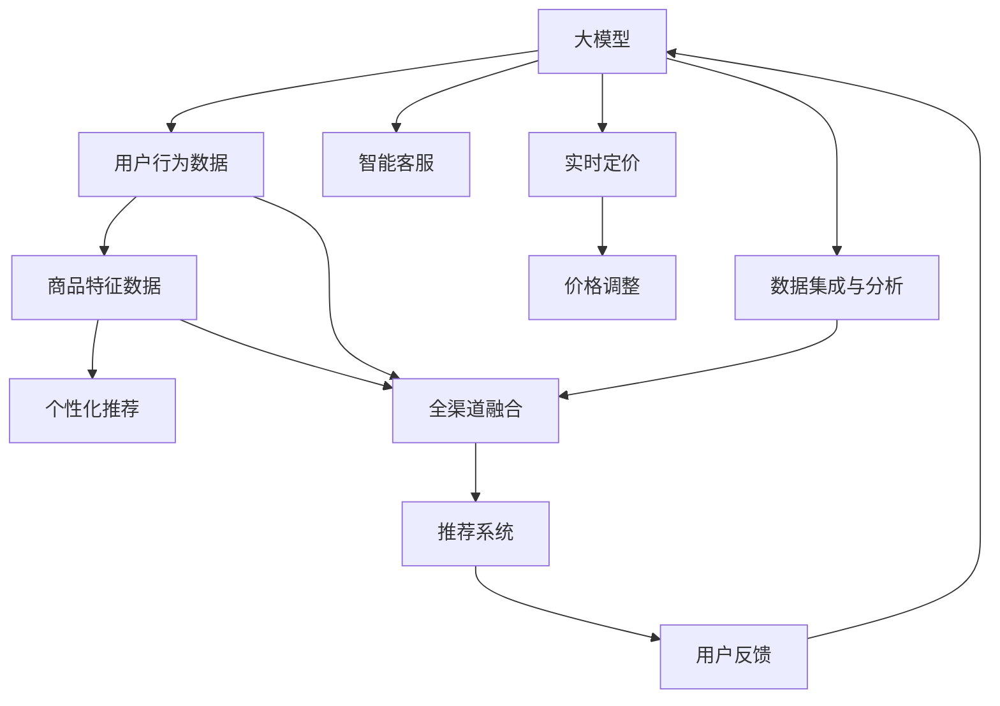

                 

# 电商平台中的AI大模型：从单一渠道到全渠道融合

> 关键词：大模型,电商推荐系统,全渠道,智能客服,数据集成,多模态融合,可解释AI,隐私保护

## 1. 背景介绍

在快速发展的电商市场中，如何提升用户体验，优化商品推荐，提高转化率，成为电商运营的重大挑战。随着人工智能技术的进步，大模型在电商平台中的应用日益广泛，从单一渠道的推荐系统到全渠道的用户行为理解，AI大模型正逐步成为电商企业竞争力的关键。

### 1.1 电商市场发展现状

近年来，中国电商市场已进入成熟期，市场规模快速扩大，消费者需求更加多样化，电商竞争趋于激烈。随着智能手机的普及和移动电商的兴起，越来越多的消费者开始通过移动设备进行购物，由此推动了移动电商平台的快速崛起。然而，面对高度竞争的市场环境，提升用户购物体验，优化推荐系统，提高客户留存和转化率，成为电商平台亟需解决的问题。

电商平台的个性化推荐系统，涉及用户行为数据、商品信息、营销活动等多维度的综合处理。传统推荐系统基于静态用户行为和商品特征，难以适应不断变化的电商市场环境。而基于深度学习的大模型推荐系统，通过学习丰富的用户和商品特征，能够更精准地匹配用户需求和商品，提高推荐系统的效果。

### 1.2 大模型在电商中的应用

大模型在电商领域的应用场景多样，主要集中在以下几个方面：

1. **个性化推荐系统**：通过学习用户行为和商品特征，生成高质量的商品推荐列表。
2. **智能客服系统**：通过理解用户提问，提供及时有效的回答，提升用户体验。
3. **实时定价系统**：基于市场供需关系和用户行为，动态调整商品价格，实现最优定价策略。
4. **数据集成与分析**：整合多渠道数据，进行用户行为和商品特征的综合分析，挖掘用户潜在需求。

大模型的应用使得电商平台的推荐系统从单一渠道拓展到全渠道，实现了从用户行为理解到商品推荐、价格调整的全流程自动化，提升了电商平台的运营效率和服务质量。

## 2. 核心概念与联系

### 2.1 核心概念概述

为了深入理解大模型在电商平台中的应用，我们首先介绍几个关键概念：

- **大模型(Large Model)**：指在大型语料库上预训练的深度神经网络模型，如GPT-3、BERT等。这些模型具有强大的表征学习能力，能够在多种NLP任务中取得优异表现。
- **个性化推荐系统(Recommender System)**：通过分析用户历史行为和商品特征，为用户生成个性化推荐列表，提高转化率。
- **全渠道融合(OMO - Omnichannel Integration)**：将线上和线下的用户行为、商品信息等数据进行整合，实现跨平台的用户行为分析。
- **多模态融合(Multimodal Fusion)**：将文本、图片、视频等多模态数据进行融合，提升推荐系统的准确性。
- **可解释AI(Explainable AI, XAI)**：解释模型的内部工作机制和决策逻辑，提高模型透明性和可信任度。
- **隐私保护(Privacy Protection)**：保护用户数据隐私，防止数据泄露和滥用。

### 2.2 核心概念原理和架构的 Mermaid 流程图



这个流程图展示了大模型在电商平台中的应用架构：

1. **大模型作为核心引擎**：接收用户行为数据和商品特征数据，输出推荐结果。
2. **全渠道融合**：整合线上线下数据，实现跨平台的用户行为分析。
3. **多模态融合**：融合文本、图片、视频等多模态数据，提升推荐系统的准确性。
4. **可解释AI**：解释模型的内部工作机制和决策逻辑。
5. **隐私保护**：保护用户数据隐私，防止数据滥用。

## 3. 核心算法原理 & 具体操作步骤

### 3.1 算法原理概述

大模型在电商平台中的应用，主要基于深度学习中的推荐系统和多模态融合技术。通过在大规模无标签数据上进行预训练，大模型能够学习到丰富的用户和商品特征表示，从而在推荐系统中取得优异表现。

推荐系统的基本原理是，通过分析用户历史行为和商品特征，预测用户对商品感兴趣的可能性，生成个性化推荐列表。大模型通过多层次的神经网络结构，可以有效地捕捉用户和商品之间的复杂关系，从而提高推荐的准确性。

多模态融合技术，则将不同模态的数据进行联合建模，从而实现更全面的用户行为理解。通过将文本、图片、视频等多模态数据进行融合，可以更准确地捕捉用户意图和商品特征，提升推荐系统的准确性和鲁棒性。

### 3.2 算法步骤详解

基于大模型的电商推荐系统，主要包括以下几个步骤：

1. **数据预处理**：收集和整合用户行为数据、商品特征数据、社交媒体数据等，进行数据清洗和标准化处理。
2. **特征工程**：提取和构造用户行为特征、商品特征、社交媒体特征等，构建输入特征向量。
3. **模型训练**：使用大模型进行训练，生成推荐模型，输出推荐结果。
4. **多模态融合**：将不同模态的数据进行融合，提高推荐系统的准确性。
5. **实时推荐**：基于实时数据流，动态生成推荐列表，实现个性化推荐。

### 3.3 算法优缺点

大模型在电商推荐系统中的应用，具有以下优点：

1. **性能提升**：大模型能够高效地学习用户和商品之间的复杂关系，生成高质量的推荐结果。
2. **泛化能力强**：通过在大型语料库上进行预训练，大模型能够适应多种NLP任务，提高推荐的泛化能力。
3. **多模态融合**：将文本、图片、视频等多模态数据进行融合，提高推荐系统的准确性和鲁棒性。
4. **可解释性**：大模型的决策过程可以通过LIME、SHAP等方法进行解释，提高模型的透明性和可信度。

同时，大模型在电商应用中也存在一些局限性：

1. **数据依赖**：大模型的性能高度依赖于数据质量，需要收集和整合大量高质量数据，数据获取成本较高。
2. **资源消耗大**：大模型的参数量巨大，推理和训练过程需要高性能计算资源，增加了系统部署的复杂性。
3. **隐私保护**：电商平台涉及大量用户隐私数据，需要采取有效的隐私保护措施，防止数据滥用。

### 3.4 算法应用领域

大模型在电商领域的应用非常广泛，涉及个性化推荐、智能客服、实时定价等多个方面。具体而言：

- **个性化推荐系统**：基于用户行为和商品特征，生成个性化推荐列表，提高用户满意度和转化率。
- **智能客服系统**：通过理解用户提问，提供及时有效的回答，提升用户体验。
- **实时定价系统**：基于市场供需关系和用户行为，动态调整商品价格，实现最优定价策略。
- **数据集成与分析**：整合多渠道数据，进行用户行为和商品特征的综合分析，挖掘用户潜在需求。

## 4. 数学模型和公式 & 详细讲解 & 举例说明

### 4.1 数学模型构建

基于大模型的电商推荐系统，可以采用多种数学模型进行构建。这里以协同过滤算法为例，介绍推荐系统的数学模型构建过程。

设用户集合为 $U$，商品集合为 $I$，用户对商品 $i$ 的评分 $r_{ui}$ 为 $[0, 5]$ 的整数，目标是为用户 $u$ 推荐商品 $i$。

协同过滤算法基于用户间的相似性，为用户生成个性化推荐。用户 $u$ 和用户 $v$ 的相似性通过余弦相似度衡量：

$$
\theta_{uv} = \frac{\sum_{i \in I}r_{ui}r_{vi}}{\sqrt{\sum_{i \in I}r_{ui}^2}\sqrt{\sum_{i \in I}r_{vi}^2}}
$$

利用相似度矩阵 $\Theta$，可以通过矩阵乘法计算用户 $u$ 对商品 $i$ 的预测评分 $r_{ui}'$：

$$
r_{ui}' = \sum_{v \in U} \theta_{uv}r_{vi}
$$

### 4.2 公式推导过程

协同过滤算法的关键在于计算用户间的相似度矩阵 $\Theta$。通过余弦相似度计算，可以得到：

$$
\theta_{uv} = \frac{\sum_{i \in I}r_{ui}r_{vi}}{\sqrt{\sum_{i \in I}r_{ui}^2}\sqrt{\sum_{i \in I}r_{vi}^2}}
$$

将 $\theta_{uv}$ 代入预测评分公式：

$$
r_{ui}' = \sum_{v \in U} \theta_{uv}r_{vi}
$$

通过多层次神经网络模型，可以更有效地捕捉用户和商品之间的复杂关系，从而提高推荐的准确性。大模型可以通过自编码、自回归等形式，进行推荐系统的构建和优化。

### 4.3 案例分析与讲解

以电商平台的个性化推荐系统为例，分析大模型的应用效果。首先，收集用户行为数据和商品特征数据，构建特征向量：

$$
\mathbf{x}_u = [b_u, i_u, a_u, \ldots]
$$

其中 $b_u$ 为用户基本信息，$i_u$ 为最近浏览的商品ID，$a_u$ 为最近购买商品的属性信息等。

然后，将特征向量输入大模型，输出用户对商品的评分：

$$
r_{ui}' = f(\mathbf{x}_u; \theta)
$$

其中 $f$ 为多层次神经网络模型，$\theta$ 为模型参数。

最后，根据预测评分和用户行为，生成个性化推荐列表。通过用户对推荐商品的点击、购买等行为反馈，可以进一步优化模型参数，提高推荐系统的效果。

## 5. 项目实践：代码实例和详细解释说明

### 5.1 开发环境搭建

为了实现基于大模型的电商推荐系统，需要搭建高效的开发环境。以下是开发环境的搭建流程：

1. **安装Python和相关库**：确保Python版本为3.8或更高，安装TensorFlow、Keras等深度学习库。
2. **安装相关硬件**：确保有高性能的GPU或TPU，以便进行深度学习模型的训练和推理。
3. **搭建分布式训练环境**：使用Spark、Kubernetes等工具，搭建分布式训练环境，加速模型训练。
4. **部署模型服务**：将训练好的模型部署到云平台或本地服务器，提供API接口，进行实时推荐。

### 5.2 源代码详细实现

以下是使用TensorFlow实现电商推荐系统的Python代码：

```python
import tensorflow as tf
from tensorflow.keras.layers import Input, Embedding, Dot, Add, Dense
from tensorflow.keras.models import Model

# 构建用户特征向量
user_input = Input(shape=(num_users, ), name='user_input')
user_embedding = Embedding(num_users, emb_dim)(user_input)

# 构建商品特征向量
item_input = Input(shape=(num_items, ), name='item_input')
item_embedding = Embedding(num_items, emb_dim)(item_input)

# 计算用户与商品相似度
dot = Dot(axes=(2, 2), name='dot')([user_embedding, item_embedding])

# 将用户特征与商品特征融合
merged = Add(name='add')([dot, user_input, item_input])

# 输出预测评分
prediction = Dense(1, activation='sigmoid')(merged)

# 构建推荐模型
model = Model(inputs=[user_input, item_input], outputs=prediction)

# 编译模型
model.compile(optimizer='adam', loss='binary_crossentropy', metrics=['accuracy'])

# 训练模型
model.fit([user_input, item_input], labels, epochs=num_epochs, batch_size=batch_size)
```

这段代码实现了基本的协同过滤算法，通过用户和商品的特征向量，计算相似度并进行融合，输出预测评分。

### 5.3 代码解读与分析

- **用户和商品嵌入**：将用户和商品特征向量映射到低维空间，通过嵌入层实现。
- **相似度计算**：利用点积计算用户和商品的相似度，通过余弦相似度实现。
- **融合操作**：将用户特征、商品特征和相似度进行融合，提高预测准确性。
- **预测评分**：通过全连接层输出预测评分，并进行二分类处理。
- **模型编译**：选择合适的优化器、损失函数和评价指标，进行模型编译。
- **模型训练**：使用训练数据集进行模型训练，更新模型参数。

## 6. 实际应用场景

### 6.1 智能客服系统

智能客服系统是电商平台中常见的应用场景。通过大模型进行智能客服，可以提升用户体验，提高问题解决效率。

以电商平台的用户咨询为例，系统可以收集用户提出的问题，进行自然语言理解，并生成对应的回答。具体实现步骤如下：

1. **数据收集**：收集用户咨询的问题和客服回答，构建问题-回答对数据集。
2. **数据预处理**：清洗和标准化数据集，去除噪音和无用信息。
3. **模型训练**：使用大模型进行训练，输出问题-回答对映射关系。
4. **在线推理**：基于在线收集的用户咨询，进行实时推理，输出对应的回答。

### 6.2 实时定价系统

实时定价系统可以基于用户行为和市场供需关系，动态调整商品价格，实现最优定价策略。

以电商平台的用户点击行为为例，系统可以实时监控用户的点击数据，预测用户对不同商品的价格敏感度。具体实现步骤如下：

1. **数据收集**：收集用户点击行为数据和商品价格数据，构建行为-价格对数据集。
2. **特征提取**：提取用户点击行为特征和商品价格特征，进行特征工程。
3. **模型训练**：使用大模型进行训练，输出用户点击行为对商品价格的预测关系。
4. **动态定价**：基于实时收集的用户点击数据，动态调整商品价格，实现最优定价策略。

### 6.3 数据集成与分析

电商平台的推荐系统需要整合多渠道数据，进行用户行为和商品特征的综合分析，挖掘用户潜在需求。

以电商平台的订单数据和社交媒体数据为例，系统可以整合两者的数据，进行用户行为和商品特征的综合分析。具体实现步骤如下：

1. **数据收集**：收集订单数据和社交媒体数据，构建订单-社交对数据集。
2. **特征提取**：提取订单数据中的用户行为特征和商品特征，提取社交媒体数据中的用户兴趣特征。
3. **模型训练**：使用大模型进行训练，输出订单-社交数据的关联关系。
4. **行为预测**：基于实时订单数据和社交媒体数据，预测用户行为，生成个性化推荐列表。

### 6.4 未来应用展望

未来的电商推荐系统，将进一步融合全渠道数据，实现多模态融合和多任务学习，提高推荐系统的准确性和鲁棒性。同时，可解释AI也将逐步应用于电商推荐系统，提高模型的透明性和可信度。

未来的电商推荐系统还将引入隐私保护技术，保护用户隐私数据，防止数据滥用。通过差分隐私、联邦学习等技术，实现对用户数据的高效保护和利用。

## 7. 工具和资源推荐

### 7.1 学习资源推荐

为了帮助开发者系统掌握大模型在电商平台中的应用，推荐以下学习资源：

1. **《深度学习》教材**：Ian Goodfellow、Yoshua Bengio和Aaron Courville合著的《深度学习》教材，全面介绍了深度学习的基础理论和应用。
2. **Deep Learning Specialization**：由Andrew Ng主讲的Coursera深度学习专项课程，涵盖了深度学习的基础理论、算法和应用。
3. **《TensorFlow实战》书籍**：Google开发的深度学习框架TensorFlow，提供了丰富的学习资源和实践样例。
4. **Transformers库官方文档**：HuggingFace开发的Transformers库，提供了丰富的预训练语言模型和微调样例。
5. **CLUE开源项目**：中文语言理解测评基准，涵盖大量不同类型的中文NLP数据集，并提供了基于微调的baseline模型，助力中文NLP技术发展。

### 7.2 开发工具推荐

开发大模型推荐系统的常用工具包括：

1. **TensorFlow**：Google开发的深度学习框架，适合大规模深度学习模型的训练和推理。
2. **Keras**：高层次的深度学习框架，封装了TensorFlow等底层框架，易于使用。
3. **PyTorch**：Facebook开发的深度学习框架，灵活动态，适合快速迭代研究。
4. **Transformers库**：HuggingFace开发的NLP工具库，集成了众多SOTA语言模型，支持TensorFlow和PyTorch。
5. **Spark**：Apache开发的分布式计算框架，适合大规模数据处理和分布式训练。

### 7.3 相关论文推荐

大模型在电商推荐系统中的应用，得益于学界的持续研究。以下是几篇奠基性的相关论文，推荐阅读：

1. **"Deep Collaborative Filtering using Matrix Factorization Techniques"**：Yadong Luo等人在KDD会议上发表的论文，提出协同过滤算法的基本原理和实现方法。
2. **"Hybrid Recommender System based on Item-Based and User-Based Collaborative Filtering"**：Ying Xie等人在ECIR会议上发表的论文，提出混合协同过滤算法，结合用户和商品特征进行推荐。
3. **"Neural-based Recommendation System: A Survey"**：Houfei Chen等人在IEEE TNNLS上发表的综述论文，全面介绍了深度学习在推荐系统中的应用。
4. **"Personalized Recommendation via Matrix Factorization"**：Kuan-Yu Chen等人在KDD会议上发表的论文，提出基于矩阵分解的推荐算法，实现高质量的个性化推荐。

这些论文代表了大模型在电商推荐系统中的应用发展脉络。通过学习这些前沿成果，可以帮助研究者把握学科前进方向，激发更多的创新灵感。

## 8. 总结：未来发展趋势与挑战

### 8.1 总结

本文对基于大模型的电商推荐系统进行了全面系统的介绍。首先阐述了电商市场的发展现状和大模型在电商中的应用，明确了推荐系统的基本原理和应用场景。其次，从理论到实践，详细讲解了推荐系统的数学模型构建、算法步骤、训练优化等关键步骤，给出了电商推荐系统的完整代码实现。同时，本文还广泛探讨了智能客服、实时定价、数据集成与分析等多个电商应用场景，展示了大模型在不同任务中的应用潜力。最后，本文精选了电商推荐系统的学习资源、开发工具和相关论文，力求为读者提供全方位的技术指引。

通过本文的系统梳理，可以看到，基于大模型的电商推荐系统正在成为电商平台的重要竞争力。大模型通过学习丰富的用户和商品特征，生成高质量的推荐结果，显著提升了电商平台的运营效率和服务质量。未来，伴随大模型和推荐系统技术的不断发展，电商推荐系统将在更多领域得到应用，为消费者带来更加个性化、高效的购物体验。

### 8.2 未来发展趋势

展望未来，电商推荐系统的发展趋势如下：

1. **多模态融合**：将文本、图片、视频等多模态数据进行融合，提升推荐系统的准确性和鲁棒性。
2. **深度学习和协同过滤的融合**：结合深度学习与协同过滤的优点，实现更加高效、精确的推荐。
3. **可解释性**：通过可解释AI技术，提高模型的透明性和可信度，帮助用户理解和信任推荐结果。
4. **隐私保护**：引入差分隐私、联邦学习等技术，保护用户隐私数据，防止数据滥用。
5. **个性化推荐**：基于用户行为和商品特征，实现更加精准、个性化的推荐。
6. **实时推荐**：基于实时数据流，动态生成推荐列表，实现个性化推荐。

### 8.3 面临的挑战

尽管大模型在电商推荐系统中的应用取得了显著成效，但仍面临诸多挑战：

1. **数据依赖**：大模型的性能高度依赖于数据质量，需要收集和整合大量高质量数据，数据获取成本较高。
2. **资源消耗大**：大模型的参数量巨大，推理和训练过程需要高性能计算资源，增加了系统部署的复杂性。
3. **隐私保护**：电商平台涉及大量用户隐私数据，需要采取有效的隐私保护措施，防止数据滥用。
4. **可解释性**：电商推荐系统的模型决策过程较为复杂，难以解释其内部工作机制和决策逻辑，用户难以理解和信任推荐结果。
5. **实时性要求高**：电商平台的推荐系统需要实时响应用户行为，对系统实时性要求高，现有技术难以完全满足。

### 8.4 研究展望

为了应对这些挑战，未来的电商推荐系统需要在以下几个方面进行创新：

1. **数据质量提升**：通过数据清洗和特征工程，提升数据质量和特征代表性，减少数据获取成本。
2. **资源优化**：引入模型压缩、量化加速等技术，优化大模型的推理和训练过程，降低资源消耗。
3. **隐私保护技术**：引入差分隐私、联邦学习等技术，保护用户隐私数据，防止数据滥用。
4. **可解释性增强**：引入可解释AI技术，提高模型的透明性和可信度，帮助用户理解和信任推荐结果。
5. **实时性优化**：引入模型并行、计算图优化等技术，提高电商推荐系统的实时性，满足实时推荐的需求。

这些研究方向将有助于进一步提升大模型在电商推荐系统中的应用效果，实现更加高效、个性化、透明的推荐服务。

## 9. 附录：常见问题与解答

**Q1：大模型在电商推荐系统中的应用效果如何？**

A: 大模型在电商推荐系统中的应用效果显著。通过学习用户和商品之间的复杂关系，大模型能够生成高质量的推荐列表，提高用户满意度和转化率。具体而言，大模型可以通过多层次神经网络模型，捕捉用户行为和商品特征之间的复杂关系，生成更准确的预测评分。同时，大模型还可以结合多模态数据进行融合，提升推荐系统的准确性和鲁棒性。

**Q2：大模型在电商推荐系统中的资源消耗大，如何解决？**

A: 大模型在电商推荐系统中的资源消耗较大，可以通过以下方法进行优化：

1. **模型压缩**：通过模型剪枝、参数共享等方法，减少模型参数量，减小内存占用。
2. **量化加速**：将浮点模型转为定点模型，压缩存储空间，提高计算效率。
3. **分布式训练**：使用Spark、Kubernetes等工具，进行分布式训练，加速模型训练。

**Q3：大模型在电商推荐系统中的隐私保护问题如何解决？**

A: 电商平台涉及大量用户隐私数据，需要进行有效的隐私保护。可以通过以下方法进行隐私保护：

1. **差分隐私**：在数据收集和处理过程中，加入噪声干扰，防止数据泄露和滥用。
2. **联邦学习**：通过分布式训练，在用户端进行数据加密处理，保护用户隐私。
3. **安全多方计算**：在多方的协作过程中，保护各方的数据隐私，防止数据泄露。

**Q4：大模型在电商推荐系统中的实时性要求如何满足？**

A: 电商平台的推荐系统需要实时响应用户行为，对系统实时性要求高。可以通过以下方法进行优化：

1. **模型并行**：将模型分为多个并行模块，加快推理速度。
2. **计算图优化**：优化模型的计算图，减少计算量，提高计算效率。
3. **缓存技术**：使用缓存技术，减少重复计算，提高响应速度。

总之，大模型在电商推荐系统中的应用需要兼顾性能、隐私和实时性，需要在多个方面进行综合优化。通过不断探索和创新，大模型将更好地服务于电商平台的推荐系统，提升用户体验和平台竞争力。

---

作者：禅与计算机程序设计艺术 / Zen and the Art of Computer Programming

