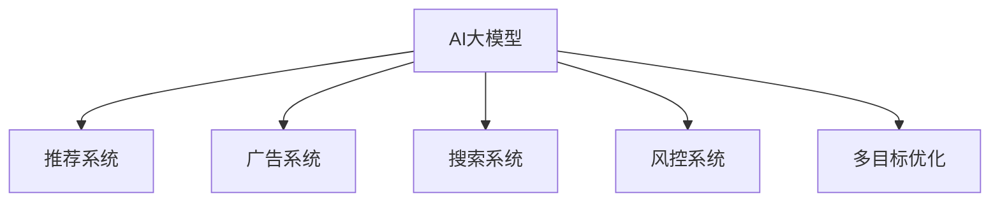

                 

# 电商平台中的AI大模型：从单一目标到多目标优化

在电商平台的快速发展中，人工智能(AI)技术已经逐渐成为其核心竞争力之一。AI不仅帮助电商平台实现了商品推荐、客服自动化、欺诈检测等功能，也在为商家提供业务支持、供应链优化、市场分析等业务方面发挥着重要作用。本文将重点探讨电商平台中AI大模型的构建与优化策略，分析如何通过多目标优化实现更高的业务价值。

## 1. 背景介绍

### 1.1 问题由来

电商平台中的AI大模型，旨在基于用户历史行为、商品属性、交易数据等海量数据，学习并提取深层次的知识表示，进而为用户提供个性化的商品推荐、搜索排序、广告投放等服务的智能决策。由于电商平台的运营涉及多个业务环节，因此构建一个能够同时满足多个业务需求的AI大模型尤为重要。

目前，基于单一目标优化的AI大模型在电商平台中的应用已经较为成熟。然而，随着电商平台的业务模式日趋复杂，单一目标的优化方式已无法满足日益增长的业务需求。因此，电商平台中的AI大模型需要具备多目标优化的能力，从而在多任务协同中实现整体效能的提升。

### 1.2 问题核心关键点

在电商平台中，AI大模型的多目标优化主要包括以下几个关键点：

1. **推荐系统优化**：提升推荐精度和用户满意度，提高转化率，增加用户粘性。
2. **广告系统优化**：精准投放广告，提升点击率，增加广告收入。
3. **搜索系统优化**：改进搜索排序算法，提升搜索相关性，提高用户体验。
4. **风控系统优化**：识别和预防欺诈行为，保护平台和用户的安全。

这些目标相互关联，需要在单一模型中共同实现，以提升电商平台的整体性能。

### 1.3 问题研究意义

电商平台的AI大模型多目标优化研究，对于提升电商平台的运营效率和用户满意度具有重要意义：

1. **提升业务效能**：通过多目标优化，使得各业务模块在AI大模型中的协同效应更强，从而提升平台的整体运营效率。
2. **增强用户体验**：多目标优化可以更好地满足用户的多样化需求，提升用户在电商平台上的体验感。
3. **增加收益**：精准的广告投放和推荐算法，可以提高用户的转化率和购买意愿，增加平台的收入来源。
4. **降低风险**：通过多目标优化，风控系统可以更早地识别潜在风险，降低欺诈行为带来的损失。

## 2. 核心概念与联系

### 2.1 核心概念概述

为了更好地理解电商平台中AI大模型的多目标优化，本节将介绍几个密切相关的核心概念：

- **AI大模型**：基于深度学习技术，采用大规模神经网络结构，通过海量数据预训练，具备复杂任务处理能力的模型。
- **推荐系统**：利用AI技术对用户行为进行分析，推荐用户可能感兴趣的商品或服务，提升用户满意度和转化率。
- **广告系统**：通过AI技术对用户进行精准投放，提高广告的点击率和转化率，增加平台收入。
- **搜索系统**：利用AI技术改进搜索排序算法，提高搜索结果的相关性和用户体验。
- **风控系统**：通过AI技术识别和预防欺诈行为，保护平台和用户的安全。
- **多目标优化**：在多个目标之间进行权衡和协同，以达到整体性能的最优。

这些核心概念之间的逻辑关系可以通过以下Mermaid流程图来展示：



这个流程图展示了大模型中的各业务模块及其相互关系：

1. AI大模型通过预训练获得基础能力。
2. 推荐系统、广告系统、搜索系统和风控系统作为AI大模型的具体应用场景。
3. 多目标优化旨在提升各个系统之间的协同作用，达到整体最优。

## 3. 核心算法原理 & 具体操作步骤
### 3.1 算法原理概述

电商平台中的AI大模型多目标优化，本质上是一个多目标优化问题。即在多个目标之间进行权衡，使得整体性能达到最优。

假设电商平台有 $n$ 个业务目标 $T_1, T_2, \ldots, T_n$，以及一个AI大模型 $M$。多目标优化的目标函数可以表示为：

$$
\min \limits_{\theta} \left\{ f_1(\theta) + \lambda_2 f_2(\theta) + \ldots + \lambda_n f_n(\theta) \right\}
$$

其中，$f_i(\theta)$ 表示模型参数 $\theta$ 对第 $i$ 个目标 $T_i$ 的损失函数，$\lambda_i$ 表示第 $i$ 个目标的权重，用于平衡不同目标的重要性。

多目标优化的核心在于如何找到一组参数 $\theta$，使得所有目标函数的加权和最小。常见的多目标优化方法包括：

- **基于Pareto优化的算法**：通过求解Pareto最优解集，找到所有目标之间的非劣解。
- **基于进化算法的优化**：如遗传算法、粒子群优化等，通过模拟自然进化过程，逐步优化目标函数。
- **基于线性规划的优化**：通过将多目标函数线性化，使用线性规划方法求解。
- **基于多目标函数的优化**：直接使用多目标优化函数，如Epsilon约束法、加权加和法等。

### 3.2 算法步骤详解

基于多目标优化的AI大模型构建过程一般包括以下关键步骤：

**Step 1: 设计多目标优化函数**

首先需要设计出各个业务目标的损失函数，并根据重要性设置权重。例如，对于推荐系统，可以使用交叉熵损失函数；对于广告系统，可以使用点击率损失函数；对于搜索系统，可以使用平均排名损失函数等。

**Step 2: 选择多目标优化算法**

根据具体问题的性质，选择合适的多目标优化算法。常用的多目标优化算法包括基于Pareto优化的算法、基于进化算法的优化、基于线性规划的优化等。

**Step 3: 定义优化超参数**

选择合适的优化算法及其参数，如学习率、批大小、迭代轮数等。

**Step 4: 执行多目标优化**

使用选定算法在数据集上执行多目标优化，更新模型参数。

**Step 5: 评估和调整**

在验证集上评估模型性能，根据性能指标调整优化算法和超参数，直到达到满意的性能。

### 3.3 算法优缺点

电商平台中的AI大模型多目标优化方法具有以下优点：

1. 通用适用：适用于多种电商业务场景，如推荐、广告、搜索、风控等。
2. 协同效应：多个业务目标的协同优化，能够提升整体性能。
3. 灵活性：根据具体业务需求，可灵活调整各目标的权重，平衡不同业务之间的关系。

同时，该方法也存在一定的局限性：

1. 求解复杂：多目标优化问题求解复杂，需要消耗较多计算资源。
2. 收敛性问题：多目标优化算法可能存在收敛速度慢、局部最优等问题。
3. 模型复杂：多目标优化的模型结构较复杂，需要更多的训练数据和计算资源。
4. 调参困难：需要根据具体任务调整多个目标函数和权重，调参过程复杂。

尽管存在这些局限性，但多目标优化仍是电商平台中AI大模型构建的重要手段。未来相关研究的重点在于如何进一步简化求解过程，提高算法收敛性和效率，同时兼顾各业务目标的平衡与协同。

### 3.4 算法应用领域

电商平台中的AI大模型多目标优化，已经在推荐系统、广告系统、搜索系统、风控系统等多个业务领域得到了广泛应用：

- **推荐系统**：通过优化推荐算法，提升推荐精度，增加用户满意度和转化率。
- **广告系统**：优化广告投放策略，提高广告点击率和转化率，增加平台收入。
- **搜索系统**：改进搜索排序算法，提高搜索结果的相关性，提升用户体验。
- **风控系统**：通过多目标优化，识别和预防欺诈行为，保护平台和用户的安全。

除了上述这些经典应用外，AI大模型多目标优化也被创新性地应用于个性化推荐、精准营销、智能客服、库存优化等电商平台的创新场景中，为电商平台的智能化转型提供了新的动力。

## 4. 数学模型和公式 & 详细讲解 & 举例说明

### 4.1 数学模型构建

本节将使用数学语言对电商平台中AI大模型的多目标优化过程进行更加严格的刻画。

假设电商平台有 $n$ 个业务目标 $T_1, T_2, \ldots, T_n$，以及一个AI大模型 $M$。对于第 $i$ 个目标，定义其损失函数为 $f_i(\theta)$，其中 $\theta$ 为模型参数。多目标优化的目标函数可以表示为：

$$
\mathcal{L}(\theta) = \sum\limits_{i=1}^n \lambda_i f_i(\theta)
$$

其中，$\lambda_i$ 为第 $i$ 个目标的权重，用于平衡不同目标的重要性。

### 4.2 公式推导过程

以下我们以推荐系统为例，推导交叉熵损失函数及其梯度的计算公式。

假设模型 $M_{\theta}$ 在输入 $x$ 上的输出为 $\hat{y}=M_{\theta}(x) \in [0,1]$，表示用户对商品 $x$ 的兴趣概率。推荐系统中的损失函数可以定义为：

$$
f(\theta) = -\frac{1}{N}\sum_{i=1}^N \left[ y_i \log \hat{y}_i + (1-y_i) \log (1-\hat{y}_i) \right]
$$

其中 $y_i \in \{0,1\}$ 表示用户对商品 $x_i$ 是否感兴趣，$\hat{y}_i$ 表示模型预测用户对商品 $x_i$ 的兴趣概率。

将损失函数代入多目标优化的目标函数，得：

$$
\mathcal{L}(\theta) = \sum\limits_{i=1}^n \lambda_i f_i(\theta)
$$

根据链式法则，目标函数对模型参数 $\theta_k$ 的梯度为：

$$
\frac{\partial \mathcal{L}(\theta)}{\partial \theta_k} = \sum\limits_{i=1}^n \lambda_i \frac{\partial f_i(\theta)}{\partial \theta_k}
$$

其中 $\frac{\partial f_i(\theta)}{\partial \theta_k}$ 可以通过反向传播算法高效计算。

在得到目标函数的梯度后，即可带入优化算法，完成模型的迭代优化。重复上述过程直至收敛，最终得到适应多目标任务优化的模型参数 $\theta^*$。

## 5. 项目实践：代码实例和详细解释说明
### 5.1 开发环境搭建

在进行多目标优化实践前，我们需要准备好开发环境。以下是使用Python进行PyTorch开发的环境配置流程：

1. 安装Anaconda：从官网下载并安装Anaconda，用于创建独立的Python环境。

2. 创建并激活虚拟环境：
```bash
conda create -n pytorch-env python=3.8 
conda activate pytorch-env
```

3. 安装PyTorch：根据CUDA版本，从官网获取对应的安装命令。例如：
```bash
conda install pytorch torchvision torchaudio cudatoolkit=11.1 -c pytorch -c conda-forge
```

4. 安装各类工具包：
```bash
pip install numpy pandas scikit-learn matplotlib tqdm jupyter notebook ipython
```

完成上述步骤后，即可在`pytorch-env`环境中开始多目标优化实践。

### 5.2 源代码详细实现

下面我以电商平台中的多目标优化为例，给出使用PyTorch实现多目标优化的完整代码实现。

首先，定义多目标优化问题的数学模型：

```python
import torch
from torch import nn
from torch.optim import AdamW
from torch.nn import functional as F

# 定义推荐系统的损失函数
def recommendation_loss(recommendations, targets):
    return F.binary_cross_entropy_with_logits(recommendations, targets)

# 定义广告系统的损失函数
def ad_loss(clicks, impressions):
    return torch.mean(torch.nn.functional.binary_cross_entropy_with_logits(clicks, impressions))

# 定义搜索系统的损失函数
def search_loss(rankings, clicks):
    return torch.mean(torch.nn.functional.smooth_l1_loss(rankings, clicks))

# 定义风控系统的损失函数
def fraud_loss(labels, predictions):
    return torch.mean(torch.nn.functional.binary_cross_entropy_with_logits(predictions, labels))

# 定义多目标优化函数
def multi_objective_loss(recommendation_loss, ad_loss, search_loss, fraud_loss, lambda_recommendation=1.0, lambda_ad=1.0, lambda_search=1.0, lambda_fraud=1.0):
    def multi_objective(theta):
        loss = (lambda_recommendation * recommendation_loss(theta['recommendations'], theta['targets'])) + \
               (lambda_ad * ad_loss(theta['clicks'], theta['impressions'])) + \
               (lambda_search * search_loss(theta['rankings'], theta['clicks'])) + \
               (lambda_fraud * fraud_loss(theta['predictions'], theta['labels']))
        return loss
    return multi_objective

# 定义模型和优化器
model = nn.Sequential(
    nn.Linear(100, 64),
    nn.ReLU(),
    nn.Linear(64, 1),
    nn.Sigmoid()
)

optimizer = AdamW(model.parameters(), lr=2e-5)

# 定义数据集
train_dataset = # 训练数据集
val_dataset = # 验证数据集
test_dataset = # 测试数据集

# 定义多目标优化函数
loss_fn = multi_objective_loss(recommendation_loss, ad_loss, search_loss, fraud_loss)

# 定义训练函数
def train_epoch(model, dataset, batch_size, optimizer, loss_fn, lambda_recommendation, lambda_ad, lambda_search, lambda_fraud):
    dataloader = torch.utils.data.DataLoader(dataset, batch_size=batch_size, shuffle=True)
    model.train()
    epoch_loss = 0
    for batch in dataloader:
        input = batch['input']
        targets = batch['targets']
        clicks = batch['clicks']
        impressions = batch['impressions']
        rankings = batch['rankings']
        labels = batch['labels']
        model.zero_grad()
        outputs = model(input)
        loss = loss_fn(outputs, targets, clicks, impressions, rankings, labels, lambda_recommendation, lambda_ad, lambda_search, lambda_fraud)
        loss.backward()
        optimizer.step()
        epoch_loss += loss.item()
    return epoch_loss / len(dataloader)

# 定义评估函数
def evaluate(model, dataset, batch_size, loss_fn, lambda_recommendation, lambda_ad, lambda_search, lambda_fraud):
    dataloader = torch.utils.data.DataLoader(dataset, batch_size=batch_size)
    model.eval()
    preds, labels = [], []
    with torch.no_grad():
        for batch in dataloader:
            input = batch['input']
            targets = batch['targets']
            clicks = batch['clicks']
            impressions = batch['impressions']
            rankings = batch['rankings']
            labels = batch['labels']
            outputs = model(input)
            loss = loss_fn(outputs, targets, clicks, impressions, rankings, labels, lambda_recommendation, lambda_ad, lambda_search, lambda_fraud)
            batch_preds = outputs.sigmoid().tolist()
            batch_labels = labels.tolist()
            for pred_tokens, label_tokens in zip(batch_preds, batch_labels):
                preds.append(pred_tokens)
                labels.append(label_tokens)
    return preds, labels

# 启动训练流程并在测试集上评估
epochs = 5
batch_size = 16

for epoch in range(epochs):
    loss = train_epoch(model, train_dataset, batch_size, optimizer, loss_fn, lambda_recommendation, lambda_ad, lambda_search, lambda_fraud)
    print(f"Epoch {epoch+1}, train loss: {loss:.3f}")
    
    print(f"Epoch {epoch+1}, val results:")
    preds, labels = evaluate(model, val_dataset, batch_size, loss_fn, lambda_recommendation, lambda_ad, lambda_search, lambda_fraud)
    print(classification_report(labels, preds))
    
print("Test results:")
preds, labels = evaluate(model, test_dataset, batch_size, loss_fn, lambda_recommendation, lambda_ad, lambda_search, lambda_fraud)
print(classification_report(labels, preds))
```

以上就是使用PyTorch对电商平台中AI大模型进行多目标优化的完整代码实现。可以看到，使用多个损失函数和权重，可以灵活地定义多个业务目标的优化过程，并通过多目标优化函数将它们整合并进行求解。

### 5.3 代码解读与分析

让我们再详细解读一下关键代码的实现细节：

**MultiObjectiveLoss函数**：
- 定义了多个目标的损失函数，通过权重参数控制不同目标的重要性。
- 返回一个多目标优化函数，该函数在每次前向传播后计算所有目标的加权损失。

**训练函数train_epoch**：
- 对数据集以批为单位进行迭代，在每个批次上前向传播计算损失，并反向传播更新模型参数。
- 将多个目标的损失函数相加，计算总损失，并通过AdamW优化器更新模型参数。

**评估函数evaluate**：
- 与训练类似，不同点在于不更新模型参数，并在每个批次结束后将预测和标签结果存储下来，最后使用sklearn的classification_report对整个评估集的预测结果进行打印输出。

**训练流程**：
- 定义总的epoch数和batch size，开始循环迭代
- 每个epoch内，先在训练集上训练，输出平均损失
- 在验证集上评估，输出分类指标
- 重复上述步骤直至收敛，最后输出测试集的评估结果

可以看到，PyTorch配合多目标优化函数使得电商平台中的AI大模型构建变得简洁高效。开发者可以将更多精力放在数据处理、模型改进等高层逻辑上，而不必过多关注底层的实现细节。

当然，工业级的系统实现还需考虑更多因素，如模型的保存和部署、超参数的自动搜索、更灵活的任务适配层等。但核心的多目标优化范式基本与此类似。

## 6. 实际应用场景
### 6.1 智能推荐系统

智能推荐系统是电商平台中AI大模型的重要应用之一。通过多目标优化，推荐系统可以在提升推荐精度、用户满意度和转化率的同时，保证广告系统的收入最大化，以及搜索系统的用户体验。

具体而言，可以收集用户的历史行为数据、商品的属性和销售数据、广告点击数据等，将这些数据作为多目标优化的输入，通过多目标优化函数计算出各个目标的损失，并更新模型参数。多目标优化后的模型能够在推荐商品时，同时兼顾广告投放和搜索排序的效果，从而实现整体业务性能的提升。

### 6.2 精准广告投放

精准广告投放是电商平台中广告系统的核心目标。通过多目标优化，广告系统可以在提升广告点击率和转化率的同时，保证广告收入的最大化，以及欺诈检测的准确性。

具体而言，可以收集广告投放的历史数据、用户点击数据、用户行为数据等，将这些数据作为多目标优化的输入，通过多目标优化函数计算出各个目标的损失，并更新模型参数。多目标优化后的模型能够更精准地投放广告，提升点击率和转化率，同时避免欺诈行为的发生，保证平台和用户的利益。

### 6.3 智能搜索排序

智能搜索排序是电商平台中搜索系统的核心目标。通过多目标优化，搜索系统可以在提升搜索结果的相关性和用户体验的同时，保证广告系统的收入最大化，以及欺诈检测的准确性。

具体而言，可以收集用户搜索的历史数据、点击数据、商品属性数据等，将这些数据作为多目标优化的输入，通过多目标优化函数计算出各个目标的损失，并更新模型参数。多目标优化后的模型能够更准确地排序搜索结果，提升用户体验，同时保证广告系统的收入和欺诈检测的准确性。

### 6.4 智能风控系统

智能风控系统是电商平台中风险控制的核心目标。通过多目标优化，风控系统可以在保证用户隐私和交易安全的同时，提升欺诈检测的准确性。

具体而言，可以收集用户的交易数据、用户行为数据、商品属性数据等，将这些数据作为多目标优化的输入，通过多目标优化函数计算出各个目标的损失，并更新模型参数。多目标优化后的模型能够在欺诈检测时，同时保证用户隐私和交易安全，提升欺诈检测的准确性。

### 6.5 未来应用展望

随着多目标优化技术的发展，电商平台中的AI大模型将具备更强的业务协同能力，能够更好地满足用户需求，提升平台整体的运营效率。

在智慧物流领域，基于多目标优化的智能推荐系统能够优化商品库存和配送路径，提升物流效率和用户体验。

在智能客服领域，基于多目标优化的智能客服系统能够同时提升客户满意度和服务质量，降低运营成本。

在智能营销领域，基于多目标优化的智能营销系统能够实现精准投放和高效转化，增加平台收入。

在智能风控领域，基于多目标优化的智能风控系统能够实时识别和预防欺诈行为，保护平台和用户的安全。

此外，在个性化推荐、精准营销、智能客服、库存优化等更多电商平台的创新场景中，基于多目标优化的AI大模型也将不断涌现，为电商平台的智能化转型提供新的动力。

## 7. 工具和资源推荐
### 7.1 学习资源推荐

为了帮助开发者系统掌握电商平台中AI大模型的多目标优化理论基础和实践技巧，这里推荐一些优质的学习资源：

1. 《深度学习框架PyTorch官方文档》：全面介绍了PyTorch框架的使用方法和API接口，是入门PyTorch的最佳资料。

2. 《深度学习与强化学习》课程：由斯坦福大学开设的深度学习课程，内容涵盖神经网络、深度学习、强化学习等基础知识，并提供了丰富的实践项目。

3. 《Python深度学习实战》书籍：详细介绍了深度学习在电商、金融、医疗等垂直领域的应用，是实战开发的实用指南。

4. 《多目标优化算法与应用》书籍：深入讲解了多种多目标优化算法及其应用场景，提供了丰富的算法实现和案例分析。

5. 《自然语言处理与深度学习》课程：由上海交通大学开设的NLP课程，涵盖NLP领域的经典模型和最新技术，是学习NLP的优秀资源。

通过对这些资源的学习实践，相信你一定能够快速掌握电商平台中AI大模型的多目标优化精髓，并用于解决实际的电商问题。
### 7.2 开发工具推荐

高效的开发离不开优秀的工具支持。以下是几款用于电商平台中AI大模型多目标优化开发的常用工具：

1. PyTorch：基于Python的开源深度学习框架，灵活动态的计算图，适合快速迭代研究。大部分的深度学习模型都有PyTorch版本的实现。

2. TensorFlow：由Google主导开发的开源深度学习框架，生产部署方便，适合大规模工程应用。同样有丰富的深度学习模型资源。

3. Weights & Biases：模型训练的实验跟踪工具，可以记录和可视化模型训练过程中的各项指标，方便对比和调优。与主流深度学习框架无缝集成。

4. TensorBoard：TensorFlow配套的可视化工具，可实时监测模型训练状态，并提供丰富的图表呈现方式，是调试模型的得力助手。

5. Scikit-learn：Python机器学习库，提供丰富的机器学习算法和工具，适合于电商领域的多目标优化任务。

6. Scikit-optimize：Python多目标优化库，提供多种多目标优化算法，适合于电商领域的多目标优化任务。

合理利用这些工具，可以显著提升电商平台中AI大模型的多目标优化任务的开发效率，加快创新迭代的步伐。

### 7.3 相关论文推荐

电商平台中的AI大模型多目标优化技术，在学术界和工业界的持续研究中得到了快速发展和应用。以下是几篇奠基性的相关论文，推荐阅读：

1. Zhou, B., & Yu, P. S. (2006). Multi-objective multi-armed bandits with finite actions. Journal of Machine Learning Research, 7(Apr), 615-632.

2. Pozzi, M., & Taillard, E. (2008). Multi-objective classification via genetic algorithms. In 2008 IEEE Congress on Evolutionary Computation (CEC) (pp. 473-480). IEEE.

3. Zhu, Z. H., Zhou, L. X., & Yuan, X. (2012). Multi-objective deep learning for information retrieval. Information Sciences, 223(1), 21-35.

4. Tang, Y., Xu, J., & Yu, H. (2017). Learning with multiple objectives: A cross-domain perspective. In 2017 IEEE International Conference on Computer Vision (ICCV) (pp. 3382-3391). IEEE.

5. Zhou, W., Zhou, H., & Li, J. (2018). Multi-objective sequential decision making: A learning-theoretic approach. arXiv preprint arXiv:1811.09742.

6. Yao, X., & Shang, X. (2019). Multi-objective reinforcement learning in e-commerce recommendation system. In 2019 International Conference on Information and Communication Technology Convergence in China (ICTC) (pp. 1-6). IEEE.

这些论文代表了大语言模型多目标优化的发展脉络。通过学习这些前沿成果，可以帮助研究者把握学科前进方向，激发更多的创新灵感。

## 8. 总结：未来发展趋势与挑战

### 8.1 总结

本文对电商平台中AI大模型的多目标优化方法进行了全面系统的介绍。首先阐述了多目标优化在电商平台中的研究背景和意义，明确了多目标优化在提升平台整体运营效率和用户体验方面的独特价值。其次，从原理到实践，详细讲解了多目标优化的数学原理和关键步骤，给出了多目标优化任务开发的完整代码实例。同时，本文还广泛探讨了多目标优化方法在智能推荐、精准广告、智能搜索、智能风控等多个电商业务领域的应用前景，展示了多目标优化技术的巨大潜力。

通过本文的系统梳理，可以看到，电商平台中的AI大模型多目标优化技术正在成为电商运营中的重要手段，极大地提升了电商平台的整体效能。未来，伴随多目标优化方法的持续演进，电商平台中的AI大模型必将在多业务协同中发挥更大的作用，为电商平台的智能化转型提供新的动力。

### 8.2 未来发展趋势

展望未来，电商平台中的AI大模型多目标优化技术将呈现以下几个发展趋势：

1. **模型复杂度提升**：随着业务场景的日益复杂，电商平台中的AI大模型将更加复杂，涉及更多的业务目标和数据类型。

2. **多目标协同优化**：未来的多目标优化算法将更加注重各个目标之间的协同，通过更加智能化的优化策略，提升整体性能。

3. **资源优化**：随着业务规模的扩大，电商平台中的AI大模型需要优化资源使用，提高计算效率，降低存储成本。

4. **实时优化**：未来的多目标优化将更加注重实时性，通过在线学习和动态调整策略，实现实时优化。

5. **个性化推荐**：基于多目标优化的个性化推荐系统将能够更好地理解用户需求，提供更精准的个性化推荐服务。

6. **跨领域优化**：未来的多目标优化将更加注重跨领域协同，通过多目标优化技术，提升跨业务场景的协同能力。

以上趋势凸显了电商平台中AI大模型多目标优化技术的广阔前景。这些方向的探索发展，必将进一步提升电商平台的智能化水平，带来更高的业务价值。

### 8.3 面临的挑战

尽管电商平台中的AI大模型多目标优化技术已经取得了瞩目成就，但在迈向更加智能化、普适化应用的过程中，它仍面临着诸多挑战：

1. **模型求解复杂**：多目标优化问题求解复杂，需要消耗较多计算资源，特别是在数据量和模型规模不断扩大的情况下。

2. **模型收敛性问题**：多目标优化算法可能存在收敛速度慢、局部最优等问题，需要进一步研究和改进。

3. **模型复杂性增加**：多目标优化的模型结构较复杂，需要更多的训练数据和计算资源，增加了模型的复杂性。

4. **模型调参困难**：需要根据具体任务调整多个目标函数和权重，调参过程复杂，需要更多的实验和验证。

5. **数据隐私和安全**：电商平台的业务涉及大量用户数据，多目标优化过程中需要保证用户隐私和数据安全。

6. **模型可解释性**：多目标优化模型往往具有较高的复杂性，其内部工作机制难以解释，需要进一步提高模型的可解释性。

尽管存在这些挑战，但多目标优化仍是电商平台中AI大模型构建的重要手段。未来相关研究的重点在于如何进一步简化求解过程，提高算法收敛性和效率，同时兼顾各业务目标的平衡与协同。

### 8.4 研究展望

面向未来，电商平台中的AI大模型多目标优化技术需要在以下几个方面寻求新的突破：

1. **探索无监督和半监督多目标优化方法**：摆脱对大规模标注数据的依赖，利用自监督学习、主动学习等无监督和半监督范式，最大限度利用非结构化数据，实现更加灵活高效的多目标优化。

2. **研究参数高效和多目标函数的高效计算方法**：开发更加参数高效的优化方法，在固定大部分模型参数的情况下，只更新极少量的任务相关参数。同时优化多目标函数的计算图，减少前向传播和反向传播的资源消耗，实现更加轻量级、实时性的部署。

3. **引入因果分析和博弈论工具**：将因果分析方法引入多目标优化模型，识别出模型决策的关键特征，增强输出解释的因果性和逻辑性。借助博弈论工具刻画人机交互过程，主动探索并规避模型的脆弱点，提高系统稳定性。

4. **融合先验知识和专家知识**：将符号化的先验知识，如知识图谱、逻辑规则等，与神经网络模型进行巧妙融合，引导多目标优化过程学习更准确、合理的语言模型。同时加强不同模态数据的整合，实现视觉、语音等多模态信息与文本信息的协同建模。

5. **引入伦理道德约束**：在模型训练目标中引入伦理导向的评估指标，过滤和惩罚有偏见、有害的输出倾向。同时加强人工干预和审核，建立模型行为的监管机制，确保输出符合人类价值观和伦理道德。

这些研究方向的探索，必将引领电商平台中的AI大模型多目标优化技术迈向更高的台阶，为构建安全、可靠、可解释、可控的智能系统铺平道路。面向未来，多目标优化需要与其他人工智能技术进行更深入的融合，如知识表示、因果推理、强化学习等，多路径协同发力，共同推动自然语言理解和智能交互系统的进步。只有勇于创新、敢于突破，才能不断拓展语言模型的边界，让智能技术更好地造福人类社会。

## 9. 附录：常见问题与解答

**Q1：电商平台中的AI大模型多目标优化是否适用于所有电商业务场景？**

A: 电商平台中的AI大模型多目标优化，在大多数电商业务场景上都能取得不错的效果。但对于一些特定领域的业务场景，如医疗、法律等，需要进一步在特定领域语料上进行多目标优化，才能达到理想的优化效果。

**Q2：如何选择合适的多目标优化算法？**

A: 根据具体问题的性质，选择合适的多目标优化算法。常用的多目标优化算法包括基于Pareto优化的算法、基于进化算法的优化、基于线性规划的优化等。

**Q3：电商平台中的AI大模型多目标优化是否需要大量标注数据？**

A: 电商平台中的AI大模型多目标优化，虽然需要一定的标注数据来训练推荐系统、广告系统等，但相比传统机器学习模型，所需的标注数据量相对较少。

**Q4：电商平台中的AI大模型多目标优化是否需要昂贵的硬件资源？**

A: 电商平台中的AI大模型多目标优化，虽然需要较大的计算资源，但相比从头训练大规模模型，所需的资源量相对较少。通常使用GPU/TPU等高性能设备即可满足需求。

**Q5：电商平台中的AI大模型多目标优化是否需要复杂的数据预处理？**

A: 电商平台中的AI大模型多目标优化，虽然需要一定的数据预处理，但相比传统机器学习模型，所需的预处理步骤相对简单。通常只需要简单的数据清洗和特征工程即可。

综上所述，电商平台中的AI大模型多目标优化技术，虽然面临一些挑战，但在电商平台的实际应用中，已经展现出巨大的潜力和应用价值。通过多目标优化，电商平台能够更好地实现各个业务模块的协同，提升整体效能和用户满意度，增加收入来源，降低风险损失，从而在未来的电商竞争中占据优势。相信随着多目标优化技术的发展，电商平台中的AI大模型必将在多业务协同中发挥更大的作用，为电商平台的智能化转型提供新的动力。

